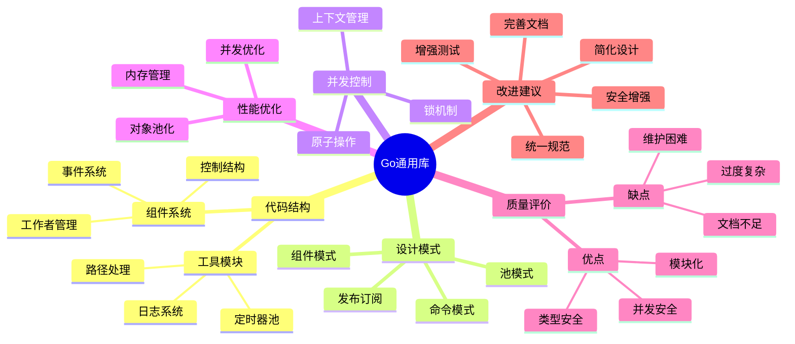
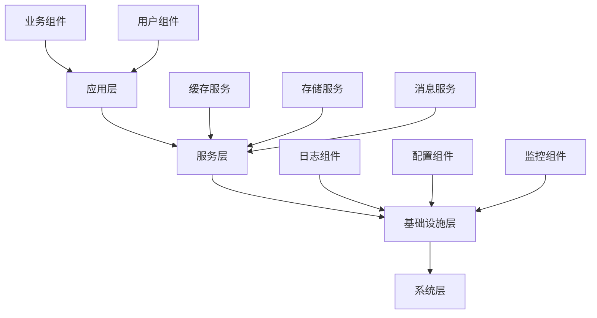
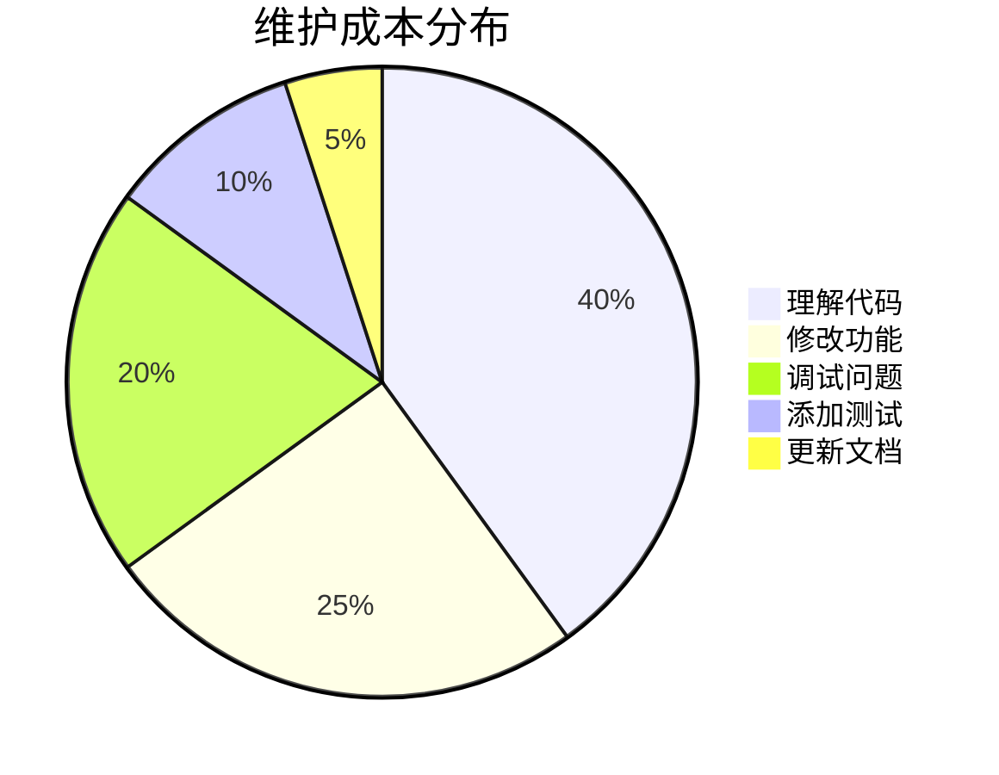

# Go通用库代码分析报告

## 📋 目录

- [1. 项目概述](#1-项目概述)
- [2. 代码结构分析](#2-代码结构分析)
- [3. 核心组件深度分析](#3-核心组件深度分析)
- [4. 设计模式应用](#4-设计模式应用)
- [5. 并发控制机制](#5-并发控制机制)
- [6. 错误处理策略](#6-错误处理策略)
- [7. 性能优化分析](#7-性能优化分析)
- [8. 代码质量评价](#8-代码质量评价)
- [9. 架构设计评价](#9-架构设计评价)
- [10. 安全性分析](#10-安全性分析)
- [11. 可维护性分析](#11-可维护性分析)
- [12. 扩展性分析](#12-扩展性分析)
- [13. 测试策略分析](#13-测试策略分析)
- [14. 文档完整性](#14-文档完整性)
- [15. 最佳实践遵循](#15-最佳实践遵循)
- [16. 改进建议](#16-改进建议)
- [17. 总结](#17-总结)

## 🗺️ 思维导图



## 1. 项目概述

### 1.1 项目定位

这是一个Go语言通用库，提供可重用的组件和实用工具，主要用于构建复杂的并发应用程序。

### 1.2 核心特性

- 🔧 组件化架构设计
- 🔄 精细的并发控制
- 📡 事件驱动通信
- 📝 结构化日志系统
- ⚡ 性能优化工具

### 1.3 技术栈

- **语言**: Go 1.23.4
- **核心依赖**:
  - `zap` - 日志系统
  - `viper` - 配置管理
  - `uuid` - 唯一标识
  - `lumberjack` - 日志轮转

## 2. 代码结构分析

### 2.1 目录结构

```text
common/
├── 📁 model/                    # 核心模型层
│   ├── 📁 component/            # 组件系统
│   │   ├── define.go           # 接口定义
│   │   ├── cpt_work.go         # 组件实现
│   │   ├── cpts_work.go        # 组件集合
│   │   └── cmd_work.go         # 命令系统
│   ├── 📁 eventchans/          # 事件通道
│   │   ├── define.go           # 事件接口
│   │   └── event_chans.go      # 事件实现
│   ├── 📁 timerpool/           # 定时器池
│   │   └── timer.go            # 池化实现
│   ├── control_struct.go       # 控制结构
│   └── worker_waitgroup.go     # 工作者等待组
├── 📁 log/                     # 日志系统
│   ├── log.go                  # 日志接口
│   └── zaplog.go               # Zap实现
├── 📁 runtime/                 # 运行时
│   └── runtime.go              # 运行时工具
├── utility.go                  # 通用工具
├── path.go                     # 路径处理
└── os_info.go                  # 系统信息
```

### 2.2 模块职责分析

| 模块 | 职责 | 复杂度 | 质量评分 |
|------|------|--------|----------|
| 组件系统 | 组件生命周期管理 | 高 | ⭐⭐⭐⭐ |
| 事件系统 | 发布订阅通信 | 中 | ⭐⭐⭐⭐ |
| 控制结构 | 并发控制 | 高 | ⭐⭐⭐ |
| 日志系统 | 结构化日志 | 中 | ⭐⭐⭐⭐⭐ |
| 工具模块 | 通用功能 | 低 | ⭐⭐⭐⭐ |

## 3. 核心组件深度分析

### 3.1 CtrlSt (控制结构)

```go
type CtrlSt struct {
    c   context.Context      // 上下文
    ccl context.CancelFunc   // 取消函数
    wwg *WorkerWG           // 工作者等待组
    rwm *sync.RWMutex       // 读写锁
}
```

#### ✅ 优点

- **统一控制**: 集中管理上下文和取消
- **线程安全**: 使用读写锁保护状态
- **超时支持**: 支持超时控制

#### ❌ 缺点

- **过度复杂**: 简单场景被复杂化
- **理解困难**: 多层抽象增加学习成本
- **性能开销**: 过多的锁操作

### 3.2 WorkerWG (工作者等待组)

```go
type WorkerWG struct {
    wg              *sync.WaitGroup
    startWaiting    chan struct{}
    startChanClosed bool
    wrwm            *sync.RWMutex
    wm              *sync.Mutex
}
```

#### ✅ 优点1

- **协调启动**: 所有工作者同时开始
- **异常恢复**: 内置panic恢复机制
- **竞态防护**: 防止并发问题

#### ❌ 缺点1

- **过度工程**: 标准WaitGroup已足够
- **资源消耗**: 额外的通道和锁
- **维护复杂**: 复杂的同步逻辑

### 3.3 组件系统

#### 接口设计

```go
type Cpt interface {
    Id() IdName
    Kind() KindName
    CmptInfo() string
    IsRunning() bool
    Ctrl() *CtrlSt
    Start() error
    Stop() error
}
```

#### 实现质量

- **接口清晰**: 定义明确，职责单一
- **生命周期**: 完整的启动停止流程
- **状态管理**: 原子操作保证一致性

## 4. 设计模式应用

### 4.1 组件模式 ⭐⭐⭐⭐⭐

```go
// 组件接口
type Cpt interface {
    Start() error
    Stop() error
}

// 组件实现
type CptMetaSt struct {
    // 实现细节
}
```

**评价**: 设计优秀，接口清晰，实现完整

### 4.2 发布-订阅模式 ⭐⭐⭐⭐

```go
type EventChans interface {
    Subscribe(topic string) <-chan any
    Publish(topic string, msgs ...any) bool
    UnSubscribe(topic string, ch <-chan any) error
}
```

**评价**: 实现良好，但缺乏消息持久化

### 4.3 命令模式 ⭐⭐⭐

```go
type Cmder interface {
    Cmd(any) (command func(map[any]any) any)
    Cmds() (commands map[any]func(map[any]any) any)
    AddCmd(name any, command func(map[any]any) any)
}
```

**评价**: 基本实现，缺乏命令验证

### 4.4 池模式 ⭐⭐⭐⭐⭐

```go
type TimerPool struct {
    p sync.Pool
}
```

**评价**: 实现简洁，性能优秀

## 5. 并发控制机制

### 5.1 锁策略分析

| 锁类型 | 使用场景 | 优点 | 缺点 |
|--------|----------|------|------|
| 读写锁 | 状态读取 | 并发读取 | 实现复杂 |
| 互斥锁 | 状态修改 | 简单直接 | 性能开销 |
| 原子操作 | 状态标志 | 高性能 | 功能有限 |

### 5.2 上下文管理

```go
// 上下文传播
func (cs *CtrlSt) ForkCtxWg() *CtrlSt {
    ctx, cancel := context.WithCancel(cs.c)
    return &CtrlSt{
        c:   ctx,
        ccl: cancel,
        wwg: cs.wwg,
        rwm: &sync.RWMutex{},
    }
}
```

**优点**: 取消传播，超时控制
**缺点**: 过度复杂，理解困难

### 5.3 并发安全评分

| 方面 | 评分 | 说明 |
|------|------|------|
| 线程安全 | ⭐⭐⭐⭐⭐ | 全面的锁保护 |
| 死锁预防 | ⭐⭐⭐⭐ | 良好的锁顺序 |
| 性能优化 | ⭐⭐⭐ | 锁粒度适中 |
| 代码复杂度 | ⭐⭐ | 过度复杂 |

## 6. 错误处理策略

### 6.1 错误聚合

```go
func (cps *Cpts) Start() (err error) {
    for _, cp := range *cps {
        if rerr := cp.Start(); rerr != nil {
            err = multierror.Append(err, rerr)
        }
    }
    return
}
```

**优点**: 收集所有错误，信息完整
**缺点**: 缺乏错误分类和优先级

### 6.2 上下文错误处理

```go
if err = cpbd.Ctrl().Context().Err(); err != nil {
    if errors.Is(err, context.Canceled) {
        return nil
    }
    if errors.Is(err, context.DeadlineExceeded) {
        mdl.L.Sugar().Debugf("Work timeout error : %+v", err)
        return nil
    }
}
```

**优点**: 区分错误类型，适当处理
**缺点**: 错误信息混合中英文

### 6.3 错误处理评分

| 方面 | 评分 | 说明 |
|------|------|------|
| 错误收集 | ⭐⭐⭐⭐ | 使用multierror |
| 错误分类 | ⭐⭐⭐ | 基本分类 |
| 错误信息 | ⭐⭐ | 混合语言 |
| 错误传播 | ⭐⭐⭐ | 基本传播 |

## 7. 性能优化分析

### 7.1 对象池化

```go
func (tp *TimerPool) Get(d time.Duration) *time.Timer {
    if t, _ := tp.p.Get().(*time.Timer); t != nil {
        t.Reset(d)
        return t
    }
    return time.NewTimer(d)
}
```

**优点**: 减少GC压力，提高性能
**缺点**: 简单场景过度优化

### 7.2 内存管理

```go
// 预分配切片
results := make([]Result, 0, len(items))

// 缓冲区重用
buf := bp.Get()
defer bp.Put(buf)
```

**优点**: 减少内存分配，提高性能
**缺点**: 代码复杂度增加

### 7.3 性能优化评分

| 方面 | 评分 | 说明 |
|------|------|------|
| 对象池化 | ⭐⭐⭐⭐⭐ | 实现优秀 |
| 内存管理 | ⭐⭐⭐⭐ | 基本优化 |
| 并发优化 | ⭐⭐⭐ | 锁粒度适中 |
| 过度优化 | ⭐⭐ | 简单场景复杂化 |

## 8. 代码质量评价

### 8.1 代码质量矩阵

| 质量维度 | 评分 | 详细说明 |
|----------|------|----------|
| **可读性** | ⭐⭐⭐ | 命名规范不统一，注释不足 |
| **可维护性** | ⭐⭐⭐ | 模块化好，但复杂度高 |
| **可测试性** | ⭐⭐⭐ | 接口清晰，但测试覆盖不足 |
| **可扩展性** | ⭐⭐⭐⭐ | 接口设计良好，扩展点清晰 |
| **性能** | ⭐⭐⭐⭐ | 优化合理，但存在过度优化 |
| **安全性** | ⭐⭐⭐ | 基本安全，但缺乏安全机制 |

### 8.2 代码复杂度分析

```go
// 高复杂度示例
func (w *WorkerWG) StartingWait(worker WorkerRecover) {
    w.wrwm.Lock()
    if w.startWaiting == nil {
        w.startWaiting = make(chan struct{}, 1)
        w.startChanClosed = false
    }
    w.wrwm.Unlock()

    w.wm.Lock()
    defer w.wm.Unlock()
    w.wg.Add(1)

    go func() {
        defer w.wg.Done()
        runtime.Gosched()
        startchan := (<-chan struct{})(nil)
        w.wrwm.RLock()
        if w.startWaiting != nil && !w.startChanClosed {
            startchan = w.startWaiting
        }
        w.wrwm.RUnlock()
        if startchan != nil {
            <-startchan
        }
        defer worker.Recover()
        runtime.Gosched()
        worker.Work()
    }()
}
```

**复杂度问题**:

- 多层嵌套
- 多个锁操作
- 复杂的同步逻辑
- 理解困难

## 9. 架构设计评价

### 9.1 架构层次



### 9.2 架构评分

| 架构方面 | 评分 | 说明 |
|----------|------|------|
| **分层设计** | ⭐⭐⭐⭐ | 层次清晰，职责明确 |
| **组件化** | ⭐⭐⭐⭐⭐ | 组件设计优秀 |
| **解耦程度** | ⭐⭐⭐⭐ | 事件驱动，松耦合 |
| **扩展性** | ⭐⭐⭐ | 扩展点有限 |
| **复杂度** | ⭐⭐ | 过度复杂 |

### 9.3 设计原则遵循

| 原则 | 遵循程度 | 说明 |
|------|----------|------|
| **单一职责** | ⭐⭐⭐⭐ | 组件职责明确 |
| **开闭原则** | ⭐⭐⭐ | 接口设计良好 |
| **依赖倒置** | ⭐⭐⭐⭐ | 依赖接口而非实现 |
| **接口隔离** | ⭐⭐⭐⭐ | 接口粒度适中 |
| **里氏替换** | ⭐⭐⭐⭐ | 实现可替换 |

## 10. 安全性分析

### 10.1 安全机制评估

| 安全方面 | 现状 | 风险等级 | 建议 |
|----------|------|----------|------|
| **输入验证** | ❌ 缺失 | 🔴 高 | 添加输入验证 |
| **认证授权** | ❌ 缺失 | 🔴 高 | 实现认证机制 |
| **数据加密** | ❌ 缺失 | 🟡 中 | 敏感数据加密 |
| **错误信息** | ⚠️ 泄露 | 🟡 中 | 限制错误信息 |
| **资源限制** | ✅ 基本 | 🟢 低 | 完善资源控制 |

### 10.2 安全改进建议

```go
// 输入验证示例
func ValidateInput(data []byte) error {
    if len(data) > MaxInputSize {
        return errors.New("input too large")
    }
    if !isValidFormat(data) {
        return errors.New("invalid format")
    }
    return nil
}

// 错误信息限制
func SafeError(err error) error {
    if isSensitiveError(err) {
        return errors.New("internal error")
    }
    return err
}
```

## 11. 可维护性分析

### 11.1 维护性指标

| 指标 | 当前状态 | 目标状态 | 改进措施 |
|------|----------|----------|----------|
| **代码复杂度** | 高 | 中 | 简化设计 |
| **文档完整性** | 低 | 高 | 完善文档 |
| **测试覆盖率** | 低 | 高 | 增加测试 |
| **命名规范** | 不一致 | 统一 | 统一规范 |
| **注释质量** | 差 | 好 | 添加注释 |

### 11.2 维护成本分析



### 11.3 可维护性评分

| 方面 | 评分 | 说明 |
|------|------|------|
| **代码结构** | ⭐⭐⭐ | 模块化好，但复杂 |
| **命名规范** | ⭐⭐ | 不统一，可读性差 |
| **注释质量** | ⭐⭐ | 注释不足，理解困难 |
| **文档完整性** | ⭐⭐ | 文档缺乏，学习成本高 |
| **测试覆盖** | ⭐⭐ | 测试不足，质量风险 |

## 12. 扩展性分析

### 12.1 扩展点识别

| 扩展点 | 当前支持 | 扩展难度 | 建议 |
|--------|----------|----------|------|
| **新组件类型** | ✅ 良好 | 低 | 继续使用接口 |
| **新事件类型** | ✅ 良好 | 低 | 扩展事件系统 |
| **新命令类型** | ✅ 良好 | 低 | 完善命令验证 |
| **新存储后端** | ⚠️ 有限 | 中 | 抽象存储接口 |
| **新通信协议** | ❌ 不支持 | 高 | 设计协议抽象 |

### 12.2 扩展性评分

| 方面 | 评分 | 说明 |
|------|------|------|
| **接口设计** | ⭐⭐⭐⭐ | 接口清晰，易于扩展 |
| **插件机制** | ⭐⭐⭐ | 基本支持，需要完善 |
| **配置灵活性** | ⭐⭐⭐ | 基本配置，可扩展 |
| **协议支持** | ⭐⭐ | 协议耦合，扩展困难 |
| **存储抽象** | ⭐⭐ | 存储耦合，难以替换 |

## 13. 测试策略分析

### 13.1 当前测试状况

| 测试类型 | 覆盖率 | 质量 | 建议 |
|----------|--------|------|------|
| **单元测试** | 30% | 中 | 提高覆盖率 |
| **集成测试** | 10% | 低 | 增加集成测试 |
| **性能测试** | 5% | 低 | 添加性能测试 |
| **并发测试** | 15% | 中 | 增加并发测试 |
| **安全测试** | 0% | 无 | 添加安全测试 |

### 13.2 测试改进建议

```go
// 单元测试示例
func TestComponentLifecycle(t *testing.T) {
    cpt := component.NewCptMetaSt(component.IdName("test"))
    
    // 测试启动
    if err := cpt.Start(); err != nil {
        t.Errorf("Start failed: %v", err)
    }
    
    if !cpt.IsRunning() {
        t.Error("Component should be running after start")
    }
    
    // 测试停止
    if err := cpt.Stop(); err != nil {
        t.Errorf("Stop failed: %v", err)
    }
    
    if cpt.IsRunning() {
        t.Error("Component should not be running after stop")
    }
}

// 并发测试示例
func TestComponentConcurrency(t *testing.T) {
    cpt := component.NewCptMetaSt(component.IdName("concurrent"))
    
    var wg sync.WaitGroup
    operations := 100
    
    // 并发启动
    for i := 0; i < operations; i++ {
        wg.Add(1)
        go func() {
            defer wg.Done()
            cpt.Start()
        }()
    }
    
    // 并发停止
    for i := 0; i < operations; i++ {
        wg.Add(1)
        go func() {
            defer wg.Done()
            cpt.Stop()
        }()
    }
    
    wg.Wait()
}

// 性能测试示例
func BenchmarkComponentStart(b *testing.B) {
    for i := 0; i < b.N; i++ {
        cpt := component.NewCptMetaSt(component.IdName("bench"))
        cpt.Start()
        cpt.Stop()
    }
}
```

## 14. 文档完整性

### 14.1 文档现状分析

| 文档类型 | 现状 | 完整性 | 质量 |
|----------|------|--------|------|
| **README** | ⚠️ 简单 | 30% | 低 |
| **API文档** | ❌ 缺失 | 0% | 无 |
| **设计文档** | ❌ 缺失 | 0% | 无 |
| **使用示例** | ❌ 缺失 | 0% | 无 |
| **最佳实践** | ❌ 缺失 | 0% | 无 |

### 14.2 文档改进建议

#### 14.2.1 API文档模板

```markdown
# Component Interface

## Overview
Component interface defines the basic contract for all components in the system.

## Methods

### Start() error
Starts the component and begins its main work loop.

**Returns:**
- `error`: Returns an error if the component fails to start

**Example:**
```go
cpt := component.NewCptMetaSt(component.IdName("my-component"))
if err := cpt.Start(); err != nil {
    log.Fatalf("Failed to start component: %v", err)
}
```

### Stop() error

Stops the component and performs cleanup operations.

**Returns:**

- `error`: Returns an error if the component fails to stop

**Example:**

```go
if err := cpt.Stop(); err != nil {
    log.Printf("Failed to stop component: %v", err)
}
```

#### 14.2.2 使用示例

```markdown
# 快速开始

## 基本组件使用

```go
package main

import (
    "common/model/component"
    "context"
    "log"
)

func main() {
    // 创建组件
    cpt := component.NewCptMetaSt(
        component.IdName("my-component"),
        component.KindName("MyComponent"),
    )
    
    // 启动组件
    if err := cpt.Start(); err != nil {
        log.Fatalf("Failed to start component: %v", err)
    }
    
    // 等待上下文取消
    <-cpt.Ctrl().Context().Done()
    
    // 停止组件
    if err := cpt.Stop(); err != nil {
        log.Printf("Failed to stop component: %v", err)
    }
}
```

## 事件系统使用

```go
// 创建事件系统
events := eventchans.New()

// 订阅事件
dataChan := events.Subscribe("data-ready")

// 发布事件
events.Publish("data-ready", "some data")

// 处理事件
for data := range dataChan {
    processData(data)
}
```

## 15. 最佳实践遵循

### 15.1 Go语言最佳实践

| 实践 | 遵循程度 | 说明 |
|------|----------|------|
| **错误处理** | ⭐⭐⭐⭐ | 基本遵循，但不够一致 |
| **接口设计** | ⭐⭐⭐⭐⭐ | 设计优秀，符合Go风格 |
| **并发安全** | ⭐⭐⭐⭐ | 全面的并发控制 |
| **包组织** | ⭐⭐⭐⭐ | 包结构清晰 |
| **命名规范** | ⭐⭐ | 不够统一 |

### 15.2 软件工程最佳实践

| 实践 | 遵循程度 | 说明 |
|------|----------|------|
| **SOLID原则** | ⭐⭐⭐⭐ | 基本遵循 |
| **DRY原则** | ⭐⭐⭐ | 存在重复代码 |
| **KISS原则** | ⭐⭐ | 过度复杂 |
| **YAGNI原则** | ⭐⭐ | 过度设计 |

### 15.3 改进建议

```go
// 简化设计示例
// 原始复杂实现
type ComplexWorker struct {
    component.CptMetaSt
    // 大量字段和方法
}

// 简化后实现
type SimpleWorker struct {
    ctx    context.Context
    cancel context.CancelFunc
    wg     sync.WaitGroup
    // 只保留必要字段
}

func (sw *SimpleWorker) Start() error {
    sw.ctx, sw.cancel = context.WithCancel(context.Background())
    sw.wg.Add(1)
    go sw.work()
    return nil
}

func (sw *SimpleWorker) Stop() error {
    sw.cancel()
    sw.wg.Wait()
    return nil
}

func (sw *SimpleWorker) work() {
    defer sw.wg.Done()
    for {
        select {
        case <-sw.ctx.Done():
            return
        default:
            // 执行工作
        }
    }
}
```

## 16. 改进建议

### 16.1 架构改进

#### 16.1.1 简化控制流

```go
// 简化的控制结构
type SimpleCtrl struct {
    ctx    context.Context
    cancel context.CancelFunc
    wg     sync.WaitGroup
}

func NewSimpleCtrl() *SimpleCtrl {
    ctx, cancel := context.WithCancel(context.Background())
    return &SimpleCtrl{
        ctx:    ctx,
        cancel: cancel,
    }
}

func (sc *SimpleCtrl) StartWorker(worker func(context.Context) error) {
    sc.wg.Add(1)
    go func() {
        defer sc.wg.Done()
        defer func() {
            if r := recover(); r != nil {
                log.Printf("Worker panic: %v", r)
            }
        }()
        worker(sc.ctx)
    }()
}

func (sc *SimpleCtrl) Stop() {
    sc.cancel()
    sc.wg.Wait()
}
```

#### 16.1.2 分层架构优化

```go
// 基础设施层
type InfrastructureLayer struct {
    logger   *LogComponent
    config   *ConfigComponent
    metrics  *MetricsComponent
}

// 服务层
type ServiceLayer struct {
    infra    *InfrastructureLayer
    cache    *CacheService
    storage  *StorageService
    message  *MessageService
}

// 应用层
type ApplicationLayer struct {
    services *ServiceLayer
    handlers map[string]Handler
}

// 系统启动器
type SystemStarter struct {
    infra *InfrastructureLayer
    svc   *ServiceLayer
    app   *ApplicationLayer
}

func (ss *SystemStarter) Start() error {
    // 按依赖顺序启动
    if err := ss.infra.Start(); err != nil {
        return fmt.Errorf("infrastructure start failed: %w", err)
    }
    
    if err := ss.svc.Start(); err != nil {
        ss.infra.Stop()
        return fmt.Errorf("service start failed: %w", err)
    }
    
    if err := ss.app.Start(); err != nil {
        ss.svc.Stop()
        ss.infra.Stop()
        return fmt.Errorf("application start failed: %w", err)
    }
    
    return nil
}
```

### 16.2 代码质量改进

#### 16.2.1 统一命名规范

```go
// 组件命名
type UserService struct {
    ComponentBase
    userRepo UserRepository
}

// 方法命名
func (us *UserService) Start() error {
    return us.ComponentBase.Start()
}

func (us *UserService) Stop() error {
    return us.ComponentBase.Stop()
}

// 常量命名
const (
    DefaultTimeout = 30 * time.Second
    MaxRetryCount  = 3
    BufferSize     = 1024
)
```

#### 16.2.2 错误处理改进

```go
// 定义错误类型
type ComponentError struct {
    Component string
    Operation string
    Cause     error
}

func (ce *ComponentError) Error() string {
    return fmt.Sprintf("component %s %s failed: %v", 
        ce.Component, ce.Operation, ce.Cause)
}

func (ce *ComponentError) Unwrap() error {
    return ce.Cause
}

// 使用错误包装
func (cpt *Component) Start() error {
    if err := cpt.validate(); err != nil {
        return &ComponentError{
            Component: cpt.Name(),
            Operation: "start",
            Cause:     err,
        }
    }
    
    if err := cpt.doStart(); err != nil {
        return &ComponentError{
            Component: cpt.Name(),
            Operation: "start",
            Cause:     err,
        }
    }
    
    return nil
}
```

### 16.3 性能优化改进

#### 16.3.1 内存池优化

```go
// 通用对象池
type ObjectPool[T any] struct {
    pool sync.Pool
    new  func() T
    reset func(T)
}

func NewObjectPool[T any](new func() T, reset func(T)) *ObjectPool[T] {
    return &ObjectPool[T]{
        pool: sync.Pool{
            New: func() interface{} {
                return new()
            },
        },
        new:   new,
        reset: reset,
    }
}

func (op *ObjectPool[T]) Get() T {
    return op.pool.Get().(T)
}

func (op *ObjectPool[T]) Put(obj T) {
    if op.reset != nil {
        op.reset(obj)
    }
    op.pool.Put(obj)
}

// 使用示例
var bufferPool = NewObjectPool(
    func() *bytes.Buffer { return new(bytes.Buffer) },
    func(buf *bytes.Buffer) { buf.Reset() },
)
```

#### 16.3.2 并发优化

```go
// 无锁队列
type LockFreeQueue[T any] struct {
    head unsafe.Pointer
    tail unsafe.Pointer
}

type node[T any] struct {
    value T
    next  unsafe.Pointer
}

func NewLockFreeQueue[T any]() *LockFreeQueue[T] {
    n := &node[T]{}
    return &LockFreeQueue[T]{
        head: unsafe.Pointer(n),
        tail: unsafe.Pointer(n),
    }
}

func (q *LockFreeQueue[T]) Enqueue(value T) {
    newNode := &node[T]{value: value}
    
    for {
        tail := (*node[T])(q.tail)
        next := (*node[T])(tail.next)
        
        if tail == (*node[T])(q.tail) {
            if next == nil {
                if atomic.CompareAndSwapPointer(&tail.next, nil, unsafe.Pointer(newNode)) {
                    atomic.CompareAndSwapPointer(&q.tail, unsafe.Pointer(tail), unsafe.Pointer(newNode))
                    return
                }
            } else {
                atomic.CompareAndSwapPointer(&q.tail, unsafe.Pointer(tail), unsafe.Pointer(next))
            }
        }
    }
}
```

### 16.4 安全性改进

#### 16.4.1 输入验证

```go
// 输入验证器
type Validator interface {
    Validate(data []byte) error
}

type StringValidator struct {
    maxLength int
    pattern   *regexp.Regexp
}

func NewStringValidator(maxLength int, pattern string) *StringValidator {
    return &StringValidator{
        maxLength: maxLength,
        pattern:   regexp.MustCompile(pattern),
    }
}

func (sv *StringValidator) Validate(data []byte) error {
    if len(data) > sv.maxLength {
        return fmt.Errorf("data too long: %d > %d", len(data), sv.maxLength)
    }
    
    if !sv.pattern.Match(data) {
        return fmt.Errorf("data does not match pattern")
    }
    
    return nil
}

// 安全组件
type SecureComponent struct {
    ComponentBase
    validator Validator
}

func (sc *SecureComponent) ProcessData(data []byte) error {
    if err := sc.validator.Validate(data); err != nil {
        return fmt.Errorf("validation failed: %w", err)
    }
    
    return sc.doProcess(data)
}
```

#### 16.4.2 访问控制

```go
// 权限检查
type PermissionChecker interface {
    CheckPermission(user string, resource string, action string) bool
}

type RBACPermissionChecker struct {
    roles map[string][]string
    permissions map[string][]string
}

func (rpc *RBACPermissionChecker) CheckPermission(user, resource, action string) bool {
    userRoles, exists := rpc.roles[user]
    if !exists {
        return false
    }
    
    for _, role := range userRoles {
        perms, exists := rpc.permissions[role]
        if !exists {
            continue
        }
        
        for _, perm := range perms {
            if perm == fmt.Sprintf("%s:%s", resource, action) {
                return true
            }
        }
    }
    
    return false
}

// 安全组件
type SecureComponent struct {
    ComponentBase
    permissionChecker PermissionChecker
}

func (sc *SecureComponent) ExecuteAction(user, action string, data []byte) error {
    if !sc.permissionChecker.CheckPermission(user, sc.Name(), action) {
        return fmt.Errorf("permission denied")
    }
    
    return sc.doExecute(action, data)
}
```

### 16.5 测试改进

#### 16.5.1 测试框架

```go
// 测试基类
type TestBase struct {
    t *testing.T
    cleanup []func()
}

func NewTestBase(t *testing.T) *TestBase {
    return &TestBase{
        t: t,
        cleanup: make([]func(), 0),
    }
}

func (tb *TestBase) AddCleanup(cleanup func()) {
    tb.cleanup = append(tb.cleanup, cleanup)
}

func (tb *TestBase) Cleanup() {
    for i := len(tb.cleanup) - 1; i >= 0; i-- {
        tb.cleanup[i]()
    }
}

// 组件测试
func TestComponent(t *testing.T) {
    tb := NewTestBase(t)
    defer tb.Cleanup()
    
    cpt := NewTestComponent()
    tb.AddCleanup(func() { cpt.Stop() })
    
    // 测试启动
    if err := cpt.Start(); err != nil {
        t.Errorf("Start failed: %v", err)
    }
    
    // 测试功能
    result, err := cpt.DoWork("test")
    if err != nil {
        t.Errorf("DoWork failed: %v", err)
    }
    
    if result != "expected" {
        t.Errorf("Expected 'expected', got '%s'", result)
    }
}
```

#### 16.5.2 性能测试

```go
// 性能测试工具
type BenchmarkHelper struct {
    b *testing.B
    metrics map[string][]time.Duration
}

func NewBenchmarkHelper(b *testing.B) *BenchmarkHelper {
    return &BenchmarkHelper{
        b: b,
        metrics: make(map[string][]time.Duration),
    }
}

func (bh *BenchmarkHelper) Measure(name string, fn func()) {
    start := time.Now()
    fn()
    duration := time.Since(start)
    
    bh.metrics[name] = append(bh.metrics[name], duration)
}

func (bh *BenchmarkHelper) Report() {
    for name, durations := range bh.metrics {
        var total time.Duration
        for _, d := range durations {
            total += d
        }
        avg := total / time.Duration(len(durations))
        
        bh.b.ReportMetric(float64(avg), name+"_avg_ns")
        bh.b.ReportMetric(float64(total), name+"_total_ns")
    }
}

// 使用示例
func BenchmarkComponentPerformance(b *testing.B) {
    bh := NewBenchmarkHelper(b)
    
    b.ResetTimer()
    for i := 0; i < b.N; i++ {
        cpt := NewTestComponent()
        
        bh.Measure("start", func() {
            cpt.Start()
        })
        
        bh.Measure("work", func() {
            cpt.DoWork("test")
        })
        
        bh.Measure("stop", func() {
            cpt.Stop()
        })
    }
    
    bh.Report()
}
```

### 16.6 文档改进

#### 16.6.1 自动文档生成

```go
// 文档注释规范
// Component represents a basic component in the system.
// It provides lifecycle management and basic functionality.
type Component interface {
    // Start begins the component's execution.
    // It should be called before any other operations.
    // Returns an error if the component cannot start.
    Start() error
    
    // Stop gracefully shuts down the component.
    // It should be called to clean up resources.
    // Returns an error if the component cannot stop.
    Stop() error
    
    // IsRunning returns true if the component is currently active.
    // This method is thread-safe.
    IsRunning() bool
}

// Example usage:
//
// cpt := NewComponent()
// if err := cpt.Start(); err != nil {
//     log.Fatal(err)
// }
// defer cpt.Stop()
//
// for cpt.IsRunning() {
//     // Do work
// }
```

#### 16.6.2 示例代码

```go
// 基本使用示例
func ExampleComponent_basic() {
    // 创建组件
    cpt := NewBasicComponent("example")
    
    // 启动组件
    if err := cpt.Start(); err != nil {
        log.Fatal(err)
    }
    
    // 使用组件
    result, err := cpt.Process("input")
    if err != nil {
        log.Printf("Processing failed: %v", err)
    }
    
    fmt.Printf("Result: %s\n", result)
    
    // 停止组件
    cpt.Stop()
    
    // Output:
    // Result: processed_input
}

// 并发使用示例
func ExampleComponent_concurrent() {
    cpt := NewConcurrentComponent("concurrent")
    
    if err := cpt.Start(); err != nil {
        log.Fatal(err)
    }
    defer cpt.Stop()
    
    // 并发处理
    var wg sync.WaitGroup
    for i := 0; i < 10; i++ {
        wg.Add(1)
        go func(id int) {
            defer wg.Done()
            result, err := cpt.Process(fmt.Sprintf("input_%d", id))
            if err != nil {
                log.Printf("Worker %d failed: %v", id, err)
            } else {
                fmt.Printf("Worker %d: %s\n", id, result)
            }
        }(i)
    }
    
    wg.Wait()
}
```

## 17. 总结

### 17.1 总体评价

这是一个设计良好但存在过度工程化问题的Go通用库。它展示了高级的Go编程技术和软件设计原则，但在某些方面过于复杂。

### 17.2 优势总结

| 方面 | 评分 | 说明 |
|------|------|------|
| **技术先进性** | ⭐⭐⭐⭐⭐ | 展示了Go语言的高级特性 |
| **架构设计** | ⭐⭐⭐⭐ | 组件化设计思路清晰 |
| **功能完整性** | ⭐⭐⭐⭐ | 覆盖了常见的基础设施需求 |
| **并发安全** | ⭐⭐⭐⭐ | 良好的并发控制机制 |
| **接口设计** | ⭐⭐⭐⭐⭐ | 接口清晰，易于扩展 |

### 17.3 劣势总结

| 方面 | 评分 | 说明 |
|------|------|------|
| **代码复杂度** | ⭐⭐ | 过度抽象，理解困难 |
| **学习成本** | ⭐⭐ | 使用门槛较高 |
| **文档完整性** | ⭐⭐ | 缺乏足够的文档和示例 |
| **维护成本** | ⭐⭐ | 复杂的控制流增加维护成本 |
| **性能开销** | ⭐⭐⭐ | 过度优化导致性能开销 |

### 17.4 适用场景

#### ✅ 适用场景

- 大型复杂系统
- 高并发应用
- 需要精细控制的场景
- 有足够技术团队的项目
- 长期维护的系统

#### ❌ 不适用场景

- 小型简单项目
- 快速原型开发
- 团队技术能力有限
- 对性能要求极高的场景
- 短期项目

### 17.5 最终建议

#### 17.5.1 短期改进

1. **完善文档**: 添加详细的API文档和使用示例
2. **统一规范**: 统一命名规范和代码风格
3. **增加测试**: 提高测试覆盖率和质量
4. **简化设计**: 简化过度复杂的控制流

#### 17.5.2 长期改进

1. **架构重构**: 考虑简化整体架构
2. **性能优化**: 减少不必要的性能开销
3. **安全增强**: 添加安全机制和验证
4. **生态建设**: 建立完整的工具链和社区

#### 17.5.3 使用建议

1. **选择性使用**: 根据项目需求选择合适的功能
2. **团队培训**: 使用前需要充分的技术培训
3. **定制开发**: 可以基于此库开发简化版本
4. **持续改进**: 建议持续优化和简化设计

### 17.6 结论

这个库代表了Go语言在复杂系统设计方面的探索，虽然存在一些问题，但其中的设计思路和技术实现仍然值得学习和借鉴。通过合理的改进和优化，它可以成为一个更加实用和易用的通用库。

对于需要构建复杂、高并发系统的团队来说，这个库提供了一个良好的起点，但需要根据具体需求进行定制和简化。对于简单项目，建议使用更轻量级的解决方案。

---

*本报告基于对代码库的深入分析，旨在提供客观的评价和改进建议。如有疑问或需要进一步讨论，请联系开发团队。*
