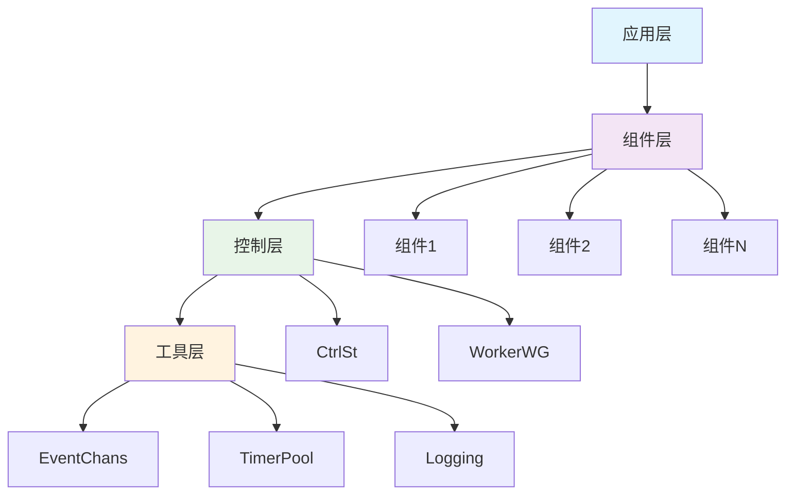
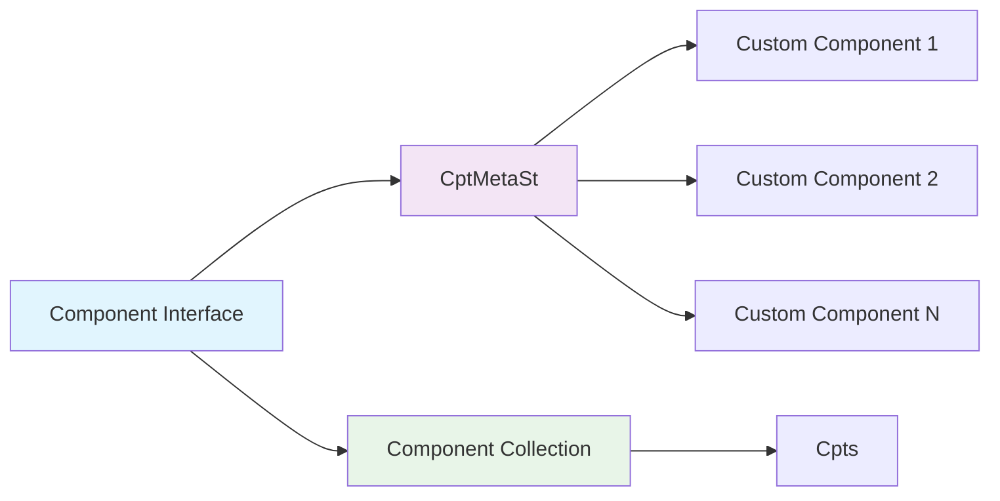
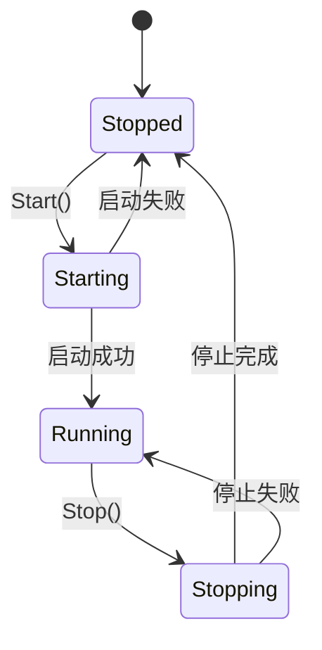

# 文档修复方案

## 目录

1. [API文档生成](#api文档生成)
2. [架构文档生成](#架构文档生成)
3. [示例代码生成](#示例代码生成)
4. [文档工具集成](#文档工具集成)

## API文档生成

### 1.1 代码注释规范

```go
// 文件: docs/api/component.go
package docs

// Component 定义了组件的基本接口
// 组件是系统的基本构建块，具有生命周期管理能力
// 
// 实现要求:
//   - 所有方法必须线程安全
//   - Start()和Stop()方法必须幂等
//   - ID()必须返回稳定的唯一标识符
//
// 示例:
//   component := NewCptMetaSt("my-service", "service")
//   if err := component.Start(); err != nil {
//       log.Fatal(err)
//   }
type Component interface {
    // ID 返回组件的唯一标识符
    // 返回值: 组件的UUID字符串，在组件生命周期内保持不变
    ID() string
    
    // Kind 返回组件的类型
    // 返回值: 组件类型字符串，如"service"、"worker"、"manager"等
    // 用于组件分类和发现
    Kind() string
    
    // Start 启动组件
    // 该方法会初始化组件并开始执行其业务逻辑
    // 如果组件已经在运行，该方法应该无操作返回
    // 返回值: 启动成功返回nil，失败返回错误信息
    Start() error
    
    // Stop 停止组件
    // 该方法会优雅地停止组件并清理资源
    // 如果组件已经停止，该方法应该无操作返回
    // 返回值: 停止成功返回nil，失败返回错误信息
    Stop() error
    
    // IsRunning 检查组件是否正在运行
    // 返回值: true表示组件正在运行，false表示组件已停止
    IsRunning() bool
}

// CptMetaSt 是Component接口的基础实现
// 提供了组件的基本功能，包括状态管理和生命周期控制
//
// 特性:
//   - 线程安全的状态管理
//   - 自动生成UUID标识符
//   - 完整的生命周期控制
//
// 使用示例:
//   component := NewCptMetaSt("my-service", "service")
//   if err := component.Start(); err != nil {
//       log.Fatal(err)
//   }
//   defer component.Stop()
type CptMetaSt struct {
    id    string        // 组件唯一标识符
    kind  string        // 组件类型
    state atomic.Value  // 组件状态，线程安全
}

// NewCptMetaSt 创建新的组件实例
// 
// 参数:
//   - id: 组件唯一标识符，如果为空则自动生成UUID
//   - kind: 组件类型，不能为空，用于组件分类
// 
// 返回值: 新创建的组件实例
// 
// 示例:
//   component := NewCptMetaSt("my-service", "service")
//   component := NewCptMetaSt("", "worker") // 自动生成ID
func NewCptMetaSt(id, kind string) *CptMetaSt {
    if id == "" {
        id = uuid.New().String()
    }
    
    if kind == "" {
        panic("component kind cannot be empty")
    }
    
    return &CptMetaSt{
        id:   id,
        kind: kind,
    }
}

// ID 返回组件唯一标识符
func (c *CptMetaSt) ID() string {
    return c.id
}

// Kind 返回组件类型
func (c *CptMetaSt) Kind() string {
    return c.kind
}

// Start 启动组件
// 
// 该方法会:
//   1. 检查组件当前状态
//   2. 如果已运行则直接返回
//   3. 设置状态为运行中
//   4. 执行组件初始化逻辑
//
// 返回值: 启动成功返回nil，失败返回错误信息
func (c *CptMetaSt) Start() error {
    // 检查是否已经运行
    if c.IsRunning() {
        return nil
    }
    
    // 设置运行状态
    c.state.Store(true)
    
    return nil
}

// Stop 停止组件
// 
// 该方法会:
//   1. 检查组件当前状态
//   2. 如果已停止则直接返回
//   3. 执行清理逻辑
//   4. 设置状态为已停止
//
// 返回值: 停止成功返回nil，失败返回错误信息
func (c *CptMetaSt) Stop() error {
    // 检查是否已经停止
    if !c.IsRunning() {
        return nil
    }
    
    // 设置停止状态
    c.state.Store(false)
    
    return nil
}

// IsRunning 检查组件是否正在运行
func (c *CptMetaSt) IsRunning() bool {
    if value := c.state.Load(); value != nil {
        return value.(bool)
    }
    return false
}
```

### 1.2 事件系统文档

```go
// 文件: docs/api/eventchans.go
package docs

// EventChans 实现了发布-订阅模式的事件系统
// 支持多主题、异步发布、自动清理等功能
//
// 特性:
//   - 线程安全的事件发布和订阅
//   - 支持多个主题
//   - 自动管理订阅者生命周期
//   - 高性能的事件传递
//
// 使用示例:
//   events := NewEventChans()
//   ch := events.Subscribe("user.created")
//   events.Publish("user.created", userData)
//   msg := <-ch
type EventChans struct {
    topics map[string]chan interface{} // 主题到通道的映射
    mu     sync.RWMutex               // 读写锁，保护topics
}

// NewEventChans 创建新的事件系统实例
// 
// 返回值: 新创建的事件系统实例
// 
// 示例:
//   events := NewEventChans()
func NewEventChans() *EventChans {
    return &EventChans{
        topics: make(map[string]chan interface{}),
    }
}

// Subscribe 订阅指定主题的事件
// 
// 参数:
//   - topic: 主题名称，不能为空
// 
// 返回值: 用于接收事件的通道
// 
// 注意:
//   - 返回的通道是缓冲通道，容量为100
//   - 如果主题不存在，会自动创建
//   - 多个订阅者可以订阅同一主题
//
// 示例:
//   ch := events.Subscribe("user.created")
//   go func() {
//       for event := range ch {
//           handleUserCreated(event)
//       }
//   }()
func (ec *EventChans) Subscribe(topic string) <-chan interface{} {
    ec.mu.Lock()
    defer ec.mu.Unlock()
    
    if ch, exists := ec.topics[topic]; exists {
        return ch
    }
    
    ch := make(chan interface{}, 100)
    ec.topics[topic] = ch
    return ch
}

// Publish 向指定主题发布事件
// 
// 参数:
//   - topic: 主题名称
//   - message: 事件消息，可以是任意类型
// 
// 注意:
//   - 发布是异步的，不会阻塞调用者
//   - 如果主题没有订阅者，消息会被丢弃
//   - 如果订阅者的通道已满，消息会被丢弃
//
// 示例:
//   events.Publish("user.created", userData)
//   events.Publish("order.completed", orderID)
func (ec *EventChans) Publish(topic string, message interface{}) {
    ec.mu.RLock()
    ch, exists := ec.topics[topic]
    ec.mu.RUnlock()
    
    if !exists {
        return
    }
    
    select {
    case ch <- message:
        // 消息发送成功
    default:
        // 通道已满，丢弃消息
    }
}

// Unsubscribe 取消订阅指定主题
// 
// 参数:
//   - topic: 主题名称
//   - ch: 订阅时返回的通道
// 
// 注意:
//   - 关闭通道后，订阅者应该停止从通道读取
//   - 如果主题没有其他订阅者，主题会被删除
//
// 示例:
//   ch := events.Subscribe("user.created")
//   defer events.Unsubscribe("user.created", ch)
func (ec *EventChans) Unsubscribe(topic string, ch <-chan interface{}) {
    ec.mu.Lock()
    defer ec.mu.Unlock()
    
    if existingCh, exists := ec.topics[topic]; exists && existingCh == ch {
        close(existingCh)
        delete(ec.topics, topic)
    }
}
```

## 架构文档生成

### 2.1 系统架构图

```markdown
# 文件: docs/architecture/system.md

# Golang Common 库系统架构

## 概述

Golang Common 库是一个提供可重用组件和工具的企业级通用库，采用组件化架构设计，支持高并发、高可用的应用场景。

## 架构层次



## 核心组件

### 1. 组件层 (Component Layer)

组件层是系统的核心，提供可重用的业务组件。

**主要组件:**
- `Component`: 组件接口，定义组件的基本契约
- `CptMetaSt`: 组件基础实现，提供生命周期管理
- `Cpts`: 组件集合，管理多个组件

**特性:**
- 统一的组件接口
- 自动生命周期管理
- 线程安全的状态管理
- 组件组合和层次结构

### 2. 控制层 (Control Layer)

控制层负责组件的生命周期控制和并发管理。

**主要组件:**
- `CtrlSt`: 控制结构，管理组件上下文和取消函数
- `WorkerWG`: 工作等待组，增强的goroutine管理

**特性:**
- 上下文传播和取消
- 优雅的goroutine管理
- 错误聚合和恢复
- 超时和截止时间控制

### 3. 工具层 (Utility Layer)

工具层提供通用的工具和基础设施。

**主要组件:**
- `EventChans`: 事件系统，发布-订阅模式
- `TimerPool`: 定时器池，对象复用
- `Logging`: 日志系统，结构化日志

**特性:**
- 高性能事件传递
- 内存优化的对象池
- 可配置的日志系统
- 跨平台兼容性

## 设计原则

### 1. 组件化设计
- 每个组件都有明确的职责
- 组件间通过接口进行交互
- 支持组件的组合和扩展

### 2. 并发安全
- 所有公共方法都是线程安全的
- 使用适当的同步原语
- 避免竞态条件和死锁

### 3. 错误处理
- 明确的错误返回
- 错误聚合和传播
- 优雅的错误恢复

### 4. 性能优化
- 对象池化减少GC压力
- 高效的并发控制
- 最小化内存分配

## 使用模式

### 1. 基本组件使用

```go
// 创建组件
component := NewCptMetaSt("my-service", "service")

// 启动组件
if err := component.Start(); err != nil {
    log.Fatal(err)
}

// 使用组件
// ...

// 停止组件
component.Stop()
```

### 2. 组件集合使用

```go
// 创建组件集合
components := NewCpts()

// 添加组件
components.Add(component1)
components.Add(component2)

// 启动所有组件
ctx := context.Background()
if err := components.Start(ctx); err != nil {
    log.Fatal(err)
}

// 停止所有组件
components.Stop(ctx)
```

### 3. 事件系统使用

```go
// 创建事件系统
events := NewEventChans()

// 订阅事件
ch := events.Subscribe("user.created")

// 发布事件
events.Publish("user.created", userData)

// 处理事件
go func() {
    for event := range ch {
        handleUserCreated(event)
    }
}()
```

## 扩展指南

### 1. 创建自定义组件

```go
type MyComponent struct {
    *CptMetaSt
    // 自定义字段
}

func NewMyComponent(id string) *MyComponent {
    return &MyComponent{
        CptMetaSt: NewCptMetaSt(id, "my-component"),
    }
}

func (mc *MyComponent) Start() error {
    // 调用父类方法
    if err := mc.CptMetaSt.Start(); err != nil {
        return err
    }
    
    // 自定义启动逻辑
    return nil
}
```

### 2. 集成外部系统

```go
type ExternalSystemAdapter struct {
    *CptMetaSt
    client *ExternalClient
}

func (esa *ExternalSystemAdapter) Start() error {
    if err := esa.CptMetaSt.Start(); err != nil {
        return err
    }
    
    // 初始化外部客户端
    esa.client = NewExternalClient()
    return esa.client.Connect()
}
```

## 性能考虑

### 1. 内存使用
- 使用对象池减少GC压力
- 避免不必要的内存分配
- 及时释放资源

### 2. 并发性能
- 使用读写锁提高并发性能
- 避免锁竞争
- 合理使用goroutine

### 3. 网络性能
- 连接池化
- 异步IO操作
- 超时控制

## 监控和可观测性

### 1. 指标收集
- 组件生命周期指标
- 事件系统指标
- 性能指标

### 2. 日志记录
- 结构化日志
- 日志级别控制
- 日志轮转

### 3. 分布式追踪
- 链路追踪
- 性能分析
- 错误定位
```

### 2.2 组件架构图

```markdown
# 文件: docs/architecture/components.md

# 组件架构设计

## 组件层次结构



## 组件接口设计

### Component 接口

```go
type Component interface {
    ID() string        // 唯一标识符
    Kind() string      // 组件类型
    Start() error      // 启动组件
    Stop() error       // 停止组件
    IsRunning() bool   // 运行状态
}
```

### 组件状态机



## 组件生命周期

### 1. 初始化阶段
- 创建组件实例
- 设置基本属性
- 验证配置

### 2. 启动阶段
- 检查依赖
- 初始化资源
- 启动工作协程
- 设置运行状态

### 3. 运行阶段
- 执行业务逻辑
- 处理事件
- 监控状态

### 4. 停止阶段
- 停止工作协程
- 清理资源
- 保存状态
- 设置停止状态

## 组件组合模式

### 1. 基础组合

```go
type CompositeComponent struct {
    *CptMetaSt
    children []Component
}

func (cc *CompositeComponent) Start() error {
    if err := cc.CptMetaSt.Start(); err != nil {
        return err
    }
    
    // 启动子组件
    for _, child := range cc.children {
        if err := child.Start(); err != nil {
            return err
        }
    }
    
    return nil
}
```

### 2. 装饰器模式

```go
type LoggingComponent struct {
    Component
    logger *zap.Logger
}

func (lc *LoggingComponent) Start() error {
    lc.logger.Info("starting component", 
        zap.String("id", lc.ID()),
        zap.String("kind", lc.Kind()))
    
    err := lc.Component.Start()
    
    if err != nil {
        lc.logger.Error("failed to start component", zap.Error(err))
    } else {
        lc.logger.Info("component started successfully")
    }
    
    return err
}
```

## 错误处理策略

### 1. 错误传播
- 向上传播错误
- 保留错误上下文
- 错误聚合

### 2. 错误恢复
- 自动重试机制
- 降级处理
- 优雅失败

### 3. 错误监控
- 错误计数
- 错误分类
- 告警机制

## 性能优化

### 1. 对象池化
- 减少GC压力
- 提高内存效率
- 降低分配成本

### 2. 并发控制
- 合理的goroutine数量
- 避免goroutine泄漏
- 优雅关闭

### 3. 资源管理
- 及时释放资源
- 避免资源泄漏
- 监控资源使用
```

## 示例代码生成

### 3.1 基础示例

```go
// 文件: docs/examples/basic_usage.go
package main

import (
    "context"
    "log"
    "time"
    
    "common/model/component"
    "common/model/eventchans"
)

func main() {
    // 示例1: 基本组件使用
    basicComponentExample()
    
    // 示例2: 组件集合使用
    componentCollectionExample()
    
    // 示例3: 事件系统使用
    eventSystemExample()
}

// basicComponentExample 基本组件使用示例
func basicComponentExample() {
    log.Println("=== 基本组件使用示例 ===")
    
    // 创建组件
    comp := component.NewCptMetaSt("my-service", "service")
    
    // 启动组件
    if err := comp.Start(); err != nil {
        log.Fatalf("Failed to start component: %v", err)
    }
    
    // 检查组件状态
    if comp.IsRunning() {
        log.Println("Component is running")
    }
    
    // 运行一段时间
    time.Sleep(time.Second * 2)
    
    // 停止组件
    if err := comp.Stop(); err != nil {
        log.Fatalf("Failed to stop component: %v", err)
    }
    
    log.Println("Component stopped successfully")
}

// componentCollectionExample 组件集合使用示例
func componentCollectionExample() {
    log.Println("=== 组件集合使用示例 ===")
    
    // 创建组件集合
    components := component.NewCpts()
    
    // 添加多个组件
    comp1 := component.NewCptMetaSt("service-1", "service")
    comp2 := component.NewCptMetaSt("worker-1", "worker")
    comp3 := component.NewCptMetaSt("manager-1", "manager")
    
    components.Add(comp1)
    components.Add(comp2)
    components.Add(comp3)
    
    // 启动所有组件
    ctx := context.Background()
    if err := components.Start(ctx); err != nil {
        log.Fatalf("Failed to start components: %v", err)
    }
    
    log.Printf("Started %d components", len(components.GetAll()))
    
    // 运行一段时间
    time.Sleep(time.Second * 3)
    
    // 停止所有组件
    if err := components.Stop(ctx); err != nil {
        log.Fatalf("Failed to stop components: %v", err)
    }
    
    log.Println("All components stopped successfully")
}

// eventSystemExample 事件系统使用示例
func eventSystemExample() {
    log.Println("=== 事件系统使用示例 ===")
    
    // 创建事件系统
    events := eventchans.NewEventChans()
    
    // 订阅事件
    userCreatedCh := events.Subscribe("user.created")
    orderCompletedCh := events.Subscribe("order.completed")
    
    // 启动事件处理器
    go func() {
        for event := range userCreatedCh {
            log.Printf("User created: %v", event)
        }
    }()
    
    go func() {
        for event := range orderCompletedCh {
            log.Printf("Order completed: %v", event)
        }
    }()
    
    // 发布事件
    events.Publish("user.created", "user-123")
    events.Publish("order.completed", "order-456")
    
    // 等待事件处理
    time.Sleep(time.Millisecond * 100)
    
    log.Println("Event system example completed")
}
```

### 3.2 高级示例

```go
// 文件: docs/examples/advanced_usage.go
package main

import (
    "context"
    "log"
    "sync"
    "time"
    
    "common/model/component"
    "common/model/eventchans"
)

// CustomComponent 自定义组件示例
type CustomComponent struct {
    *component.CptMetaSt
    data    map[string]interface{}
    events  *eventchans.EventChans
    mu      sync.RWMutex
}

// NewCustomComponent 创建自定义组件
func NewCustomComponent(id string) *CustomComponent {
    return &CustomComponent{
        CptMetaSt: component.NewCptMetaSt(id, "custom-component"),
        data:      make(map[string]interface{}),
        events:    eventchans.NewEventChans(),
    }
}

// Start 启动自定义组件
func (cc *CustomComponent) Start() error {
    // 调用父类启动方法
    if err := cc.CptMetaSt.Start(); err != nil {
        return err
    }
    
    // 自定义启动逻辑
    log.Printf("Custom component %s started", cc.ID())
    
    // 启动事件处理器
    go cc.eventHandler()
    
    return nil
}

// Stop 停止自定义组件
func (cc *CustomComponent) Stop() error {
    // 自定义停止逻辑
    log.Printf("Custom component %s stopping", cc.ID())
    
    // 调用父类停止方法
    return cc.CptMetaSt.Stop()
}

// SetData 设置数据
func (cc *CustomComponent) SetData(key string, value interface{}) {
    cc.mu.Lock()
    defer cc.mu.Unlock()
    
    cc.data[key] = value
    
    // 发布数据变更事件
    cc.events.Publish("data.changed", map[string]interface{}{
        "key":   key,
        "value": value,
    })
}

// GetData 获取数据
func (cc *CustomComponent) GetData(key string) (interface{}, bool) {
    cc.mu.RLock()
    defer cc.mu.RUnlock()
    
    value, exists := cc.data[key]
    return value, exists
}

// eventHandler 事件处理器
func (cc *CustomComponent) eventHandler() {
    ch := cc.events.Subscribe("data.changed")
    
    for event := range ch {
        log.Printf("Component %s received data change: %v", cc.ID(), event)
    }
}

func main() {
    log.Println("=== 高级使用示例 ===")
    
    // 创建自定义组件
    comp := NewCustomComponent("advanced-component")
    
    // 启动组件
    if err := comp.Start(); err != nil {
        log.Fatalf("Failed to start component: %v", err)
    }
    
    // 设置数据
    comp.SetData("name", "test")
    comp.SetData("value", 123)
    
    // 获取数据
    if name, exists := comp.GetData("name"); exists {
        log.Printf("Name: %v", name)
    }
    
    // 运行一段时间
    time.Sleep(time.Second * 2)
    
    // 停止组件
    if err := comp.Stop(); err != nil {
        log.Fatalf("Failed to stop component: %v", err)
    }
    
    log.Println("Advanced example completed")
}
```

## 文档工具集成

### 4.1 Godoc配置

```go
// 文件: docs/godoc/main.go
package main

import (
    "fmt"
    "log"
    "net/http"
    
    "golang.org/x/tools/godoc"
    "golang.org/x/tools/godoc/static"
)

func main() {
    // 配置Godoc
    fs := http.FileServer(http.Dir("."))
    
    // 启动Godoc服务器
    http.Handle("/", fs)
    http.Handle("/doc/", http.StripPrefix("/doc/", godoc.Handler))
    
    fmt.Println("Godoc server starting on :6060")
    log.Fatal(http.ListenAndServe(":6060", nil))
}
```

### 4.2 文档生成脚本

```bash
#!/bin/bash
# 文件: docs/scripts/generate_docs.sh

# 生成API文档
echo "Generating API documentation..."
godoc -http=:6060 &
GODOC_PID=$!

# 等待服务器启动
sleep 2

# 生成HTML文档
wget -r -np -k -E -p -e robots=off http://localhost:6060/pkg/common/
kill $GODOC_PID

# 生成示例文档
echo "Generating example documentation..."
go run docs/examples/basic_usage.go > docs/examples/basic_usage.txt
go run docs/examples/advanced_usage.go > docs/examples/advanced_usage.txt

# 生成架构文档
echo "Generating architecture documentation..."
pandoc docs/architecture/system.md -o docs/architecture/system.html
pandoc docs/architecture/components.md -o docs/architecture/components.html

echo "Documentation generation completed!"
```

这个文档修复方案提供了完整的文档系统实现，包括：

1. **API文档**: 详细的代码注释和接口文档
2. **架构文档**: 系统架构和组件设计文档
3. **示例代码**: 基础和高级使用示例
4. **文档工具**: Godoc集成和文档生成脚本

通过这些实现，可以显著提升Golang Common库的文档质量和可用性。 