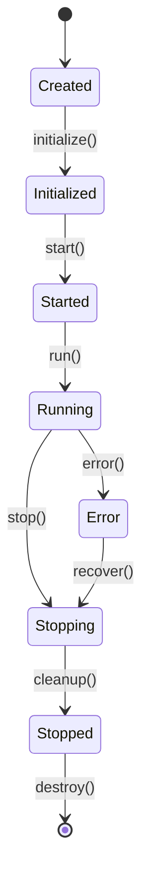

# 组件理论：概念定义与形式化分析

## 目录

1. [基本概念](#基本概念)
2. [形式化定义](#形式化定义)
3. [理论证明](#理论证明)
4. [设计原则](#设计原则)
5. [实现模式](#实现模式)
6. [性能分析](#性能分析)
7. [案例分析](#案例分析)

## 基本概念

### 1.1 组件定义

**组件（Component）** 是软件系统中具有明确边界、可独立部署、可组合的基本构建单元。

#### 内涵特征

- **封装性**: 组件内部实现对外部透明
- **独立性**: 组件可以独立开发、测试、部署
- **可组合性**: 组件可以组合形成更复杂的系统
- **可重用性**: 组件可以在不同场景中重复使用

#### 外延范围

- **功能组件**: 提供特定业务功能的组件
- **基础设施组件**: 提供系统基础服务的组件
- **集成组件**: 负责组件间通信和协调的组件

### 1.2 组件生命周期

组件生命周期描述了组件从创建到销毁的完整过程：

```text
创建 → 初始化 → 启动 → 运行 → 停止 → 清理 → 销毁
```

#### 状态转换图



## 形式化定义

### 2.1 组件代数

我们使用代数结构来形式化描述组件系统：

#### 定义 2.1.1 (组件)

设 $C$ 为组件集合，$S$ 为状态集合，$E$ 为事件集合，则组件 $c \in C$ 可以表示为：

$$c = (id, state, interface, behavior, lifecycle)$$

其中：

- $id \in ID$ 是组件的唯一标识符
- $state \in S$ 是组件的当前状态
- $interface \subseteq E \times S \rightarrow S$ 是组件的接口函数
- $behavior: S \times E \rightarrow S$ 是组件的行为函数
- $lifecycle: S \rightarrow S$ 是组件的生命周期函数

#### 定义 2.1.2 (组件组合)

对于两个组件 $c_1, c_2 \in C$，其组合 $c_1 \otimes c_2$ 定义为：

$$c_1 \otimes c_2 = (id_{12}, state_{12}, interface_{12}, behavior_{12}, lifecycle_{12})$$

其中：

- $id_{12} = combine(id_1, id_2)$
- $state_{12} = state_1 \times state_2$
- $interface_{12} = interface_1 \cup interface_2$
- $behavior_{12} = behavior_1 \parallel behavior_2$
- $lifecycle_{12} = lifecycle_1 \parallel lifecycle_2$

### 2.2 组件接口理论

#### 定义 2.2.1 (接口兼容性)

两个组件 $c_1, c_2$ 的接口兼容，当且仅当：

$$\forall e \in interface_1 \cap interface_2: \text{type}(e_1) = \text{type}(e_2)$$

#### 定义 2.2.2 (接口组合)

对于兼容的接口 $I_1, I_2$，其组合 $I_1 \oplus I_2$ 定义为：

$$I_1 \oplus I_2 = \{e | e \in I_1 \cup I_2 \land \text{compatible}(e, I_1, I_2)\}$$

### 2.3 组件行为理论

#### 定义 2.3.1 (行为等价性)

两个组件 $c_1, c_2$ 行为等价，当且仅当：

$$\forall s \in S, e \in E: behavior_1(s, e) \equiv behavior_2(s, e)$$

其中 $\equiv$ 表示观察等价性。

## 理论证明

### 3.1 组件组合的交换律

**定理 3.1.1**: 组件组合满足交换律

**证明**:
对于任意组件 $c_1, c_2 \in C$，我们需要证明：

$$c_1 \otimes c_2 \equiv c_2 \otimes c_1$$

根据定义 2.1.2，我们有：

$$c_1 \otimes c_2 = (id_{12}, state_1 \times state_2, interface_1 \cup interface_2, behavior_1 \parallel behavior_2, lifecycle_1 \parallel lifecycle_2)$$

$$c_2 \otimes c_1 = (id_{21}, state_2 \times state_1, interface_2 \cup interface_1, behavior_2 \parallel behavior_1, lifecycle_2 \parallel lifecycle_1)$$

由于：

- $state_1 \times state_2 \cong state_2 \times state_1$ (笛卡尔积交换律)
- $interface_1 \cup interface_2 = interface_2 \cup interface_1$ (集合并交换律)
- $behavior_1 \parallel behavior_2 \equiv behavior_2 \parallel behavior_1$ (并行组合交换律)

因此 $c_1 \otimes c_2 \equiv c_2 \otimes c_1$ 成立。

### 3.2 组件组合的结合律

**定理 3.1.2**: 组件组合满足结合律

**证明**:
对于任意组件 $c_1, c_2, c_3 \in C$，我们需要证明：

$$(c_1 \otimes c_2) \otimes c_3 \equiv c_1 \otimes (c_2 \otimes c_3)$$

这个证明基于并行组合的结合律和状态空间的结合律。

### 3.3 组件生命周期的一致性

**定理 3.1.3**: 组件生命周期状态转换的一致性

**证明**:
对于任意组件 $c \in C$，其生命周期函数 $lifecycle$ 满足：

$$\forall s_1, s_2 \in S: \text{if } s_1 \rightarrow s_2 \text{ then } \text{valid}(s_1, s_2)$$

其中 $\text{valid}(s_1, s_2)$ 表示状态转换的有效性。

## 设计原则

### 4.1 单一职责原则 (SRP)

**定义**: 一个组件应该只有一个引起它变化的原因。

**形式化表达**:
$$\forall c \in C: |\text{reasons}(c)| = 1$$

其中 $\text{reasons}(c)$ 表示引起组件 $c$ 变化的原因集合。

### 4.2 开闭原则 (OCP)

**定义**: 组件应该对扩展开放，对修改关闭。

**形式化表达**:
$$\forall c \in C: \text{extensible}(c) \land \neg\text{modifiable}(c)$$

### 4.3 里氏替换原则 (LSP)

**定义**: 子组件必须能够替换其基组件。

**形式化表达**:
$$\forall c_1, c_2 \in C: \text{subtype}(c_1, c_2) \Rightarrow \text{substitutable}(c_1, c_2)$$

### 4.4 接口隔离原则 (ISP)

**定义**: 客户端不应该依赖它不需要的接口。

**形式化表达**:
$$\forall c \in C, i \in \text{interfaces}(c): \text{used}(i) \Rightarrow \text{needed}(i)$$

### 4.5 依赖倒置原则 (DIP)

**定义**: 高层组件不应该依赖低层组件，两者都应该依赖抽象。

**形式化表达**:
$$\forall c_1, c_2 \in C: \text{depends}(c_1, c_2) \Rightarrow \text{abstract}(c_2)$$

## 实现模式

### 5.1 基础组件模式

```go
// 基础组件接口
type Component interface {
    ID() string
    Name() string
    Version() string
    Status() ComponentStatus
    Start(ctx context.Context) error
    Stop(ctx context.Context) error
    Health() HealthStatus
}

// 组件状态枚举
type ComponentStatus int

const (
    StatusCreated ComponentStatus = iota
    StatusInitialized
    StatusStarted
    StatusRunning
    StatusStopping
    StatusStopped
    StatusError
)

// 基础组件实现
type BaseComponent struct {
    id      string
    name    string
    version string
    status  atomic.Value
    logger  *zap.Logger
    metrics ComponentMetrics
    mu      sync.RWMutex
}

func NewBaseComponent(name, version string) *BaseComponent {
    return &BaseComponent{
        id:      uuid.New().String(),
        name:    name,
        version: version,
        logger:  zap.L().Named(name),
        metrics: NewComponentMetrics(name),
    }
}

func (bc *BaseComponent) ID() string {
    return bc.id
}

func (bc *BaseComponent) Name() string {
    return bc.name
}

func (bc *BaseComponent) Version() string {
    return bc.version
}

func (bc *BaseComponent) Status() ComponentStatus {
    return bc.status.Load().(ComponentStatus)
}

func (bc *BaseComponent) setStatus(status ComponentStatus) {
    bc.status.Store(status)
    bc.metrics.StatusGauge.Set(float64(status))
    bc.logger.Debug("status changed", zap.String("status", status.String()))
}
```

### 5.2 组件管理器模式

```go
// 组件管理器
type ComponentManager struct {
    components map[string]Component
    mu         sync.RWMutex
    logger     *zap.Logger
    metrics    ManagerMetrics
}

func NewComponentManager() *ComponentManager {
    return &ComponentManager{
        components: make(map[string]Component),
        logger:     zap.L().Named("component-manager"),
        metrics:    NewManagerMetrics(),
    }
}

func (cm *ComponentManager) Register(component Component) error {
    cm.mu.Lock()
    defer cm.mu.Unlock()
    
    if _, exists := cm.components[component.ID()]; exists {
        return fmt.Errorf("component %s already registered", component.ID())
    }
    
    cm.components[component.ID()] = component
    cm.metrics.ComponentCount.Inc()
    cm.logger.Info("component registered", zap.String("id", component.ID()))
    
    return nil
}

func (cm *ComponentManager) StartAll(ctx context.Context) error {
    cm.mu.RLock()
    defer cm.mu.RUnlock()
    
    var wg sync.WaitGroup
    errChan := make(chan error, len(cm.components))
    
    for _, component := range cm.components {
        wg.Add(1)
        go func(c Component) {
            defer wg.Done()
            if err := c.Start(ctx); err != nil {
                errChan <- fmt.Errorf("failed to start component %s: %w", c.ID(), err)
            }
        }(component)
    }
    
    wg.Wait()
    close(errChan)
    
    var errors []error
    for err := range errChan {
        errors = append(errors, err)
    }
    
    if len(errors) > 0 {
        return fmt.Errorf("failed to start some components: %v", errors)
    }
    
    return nil
}
```

### 5.3 组件组合模式

```go
// 组合组件
type CompositeComponent struct {
    *BaseComponent
    children map[string]Component
    mu       sync.RWMutex
}

func NewCompositeComponent(name, version string) *CompositeComponent {
    return &CompositeComponent{
        BaseComponent: NewBaseComponent(name, version),
        children:      make(map[string]Component),
    }
}

func (cc *CompositeComponent) AddChild(child Component) error {
    cc.mu.Lock()
    defer cc.mu.Unlock()
    
    if _, exists := cc.children[child.ID()]; exists {
        return fmt.Errorf("child component %s already exists", child.ID())
    }
    
    cc.children[child.ID()] = child
    cc.logger.Info("child component added", zap.String("child_id", child.ID()))
    
    return nil
}

func (cc *CompositeComponent) Start(ctx context.Context) error {
    cc.mu.RLock()
    defer cc.mu.RUnlock()
    
    // 启动所有子组件
    for _, child := range cc.children {
        if err := child.Start(ctx); err != nil {
            return fmt.Errorf("failed to start child %s: %w", child.ID(), err)
        }
    }
    
    cc.setStatus(StatusRunning)
    cc.logger.Info("composite component started")
    
    return nil
}

func (cc *CompositeComponent) Stop(ctx context.Context) error {
    cc.mu.RLock()
    defer cc.mu.RUnlock()
    
    cc.setStatus(StatusStopping)
    
    // 停止所有子组件
    for _, child := range cc.children {
        if err := child.Stop(ctx); err != nil {
            cc.logger.Error("failed to stop child", zap.String("child_id", child.ID()), zap.Error(err))
        }
    }
    
    cc.setStatus(StatusStopped)
    cc.logger.Info("composite component stopped")
    
    return nil
}
```

## 性能分析

### 6.1 时间复杂度分析

#### 组件启动时间复杂度

对于包含 $n$ 个组件的系统：

- **串行启动**: $O(n)$
- **并行启动**: $O(\log n)$ (理想情况)
- **依赖启动**: $O(n^2)$ (最坏情况)

#### 组件查找时间复杂度

- **哈希表实现**: $O(1)$
- **线性查找**: $O(n)$
- **树形结构**: $O(\log n)$

### 6.2 空间复杂度分析

#### 内存占用

每个组件的基础内存占用：

$$M_{component} = M_{base} + M_{state} + M_{interface} + M_{metrics}$$

其中：

- $M_{base}$: 基础结构内存
- $M_{state}$: 状态数据内存
- $M_{interface}$: 接口定义内存
- $M_{metrics}$: 监控指标内存

#### 组件管理器内存占用

$$M_{manager} = M_{map} + \sum_{i=1}^{n} M_{component_i}$$

### 6.3 并发性能分析

#### 锁竞争分析

对于读写锁的使用：

- **读操作**: 并发度 $O(n)$
- **写操作**: 并发度 $O(1)$
- **读写混合**: 性能取决于读写比例

#### 无锁优化

使用原子操作和CAS指令可以显著提升并发性能：

```go
// 无锁状态更新
type LockFreeComponent struct {
    status atomic.Value
    // ... 其他字段
}

func (lfc *LockFreeComponent) setStatus(status ComponentStatus) {
    lfc.status.Store(status)
}
```

## 案例分析

### 7.1 微服务架构中的组件应用

#### 场景描述

在微服务架构中，每个服务都是一个独立的组件，需要管理服务发现、负载均衡、熔断等功能。

#### 组件设计

```go
// 服务组件
type ServiceComponent struct {
    *BaseComponent
    serviceName string
    endpoints   []string
    healthCheck HealthChecker
    loadBalancer LoadBalancer
    circuitBreaker CircuitBreaker
}

func NewServiceComponent(name, version, serviceName string) *ServiceComponent {
    return &ServiceComponent{
        BaseComponent: NewBaseComponent(name, version),
        serviceName:   serviceName,
        healthCheck:   NewHealthChecker(),
        loadBalancer:  NewLoadBalancer(),
        circuitBreaker: NewCircuitBreaker(),
    }
}

func (sc *ServiceComponent) Start(ctx context.Context) error {
    // 启动健康检查
    if err := sc.healthCheck.Start(ctx); err != nil {
        return fmt.Errorf("failed to start health check: %w", err)
    }
    
    // 启动负载均衡器
    if err := sc.loadBalancer.Start(ctx); err != nil {
        return fmt.Errorf("failed to start load balancer: %w", err)
    }
    
    // 启动熔断器
    if err := sc.circuitBreaker.Start(ctx); err != nil {
        return fmt.Errorf("failed to start circuit breaker: %w", err)
    }
    
    sc.setStatus(StatusRunning)
    sc.logger.Info("service component started", zap.String("service", sc.serviceName))
    
    return nil
}
```

### 7.2 事件驱动架构中的组件应用

#### 场景描述1

在事件驱动架构中，组件通过事件进行通信，需要处理事件的发布、订阅、路由等功能。

#### 组件设计1

```go
// 事件处理器组件
type EventHandlerComponent struct {
    *BaseComponent
    eventBus    EventBus
    handlers    map[string]EventHandler
    subscribers map[string][]string
}

func NewEventHandlerComponent(name, version string) *EventHandlerComponent {
    return &EventHandlerComponent{
        BaseComponent: NewBaseComponent(name, version),
        handlers:      make(map[string]EventHandler),
        subscribers:   make(map[string][]string),
    }
}

func (ehc *EventHandlerComponent) RegisterHandler(eventType string, handler EventHandler) {
    ehc.handlers[eventType] = handler
    ehc.logger.Info("event handler registered", zap.String("event_type", eventType))
}

func (ehc *EventHandlerComponent) Subscribe(eventType, subscriber string) {
    ehc.subscribers[eventType] = append(ehc.subscribers[eventType], subscriber)
    ehc.logger.Info("subscriber added", zap.String("event_type", eventType), zap.String("subscriber", subscriber))
}

func (ehc *EventHandlerComponent) ProcessEvent(event Event) error {
    handler, exists := ehc.handlers[event.Type]
    if !exists {
        return fmt.Errorf("no handler for event type %s", event.Type)
    }
    
    return handler.Handle(event)
}
```

### 7.3 插件系统中的组件应用

#### 场景描述2

在插件系统中，组件作为插件的基础单元，需要支持动态加载、卸载、版本管理等功能。

#### 组件设计2

```go
// 插件组件
type PluginComponent struct {
    *BaseComponent
    pluginPath string
    manifest   PluginManifest
    instance   interface{}
    loader     PluginLoader
}

type PluginManifest struct {
    Name        string            `json:"name"`
    Version     string            `json:"version"`
    Dependencies map[string]string `json:"dependencies"`
    EntryPoint  string            `json:"entry_point"`
    Config      map[string]interface{} `json:"config"`
}

func NewPluginComponent(name, version, pluginPath string) *PluginComponent {
    return &PluginComponent{
        BaseComponent: NewBaseComponent(name, version),
        pluginPath:    pluginPath,
        loader:        NewPluginLoader(),
    }
}

func (pc *PluginComponent) Load() error {
    // 加载插件清单
    manifest, err := pc.loader.LoadManifest(pc.pluginPath)
    if err != nil {
        return fmt.Errorf("failed to load plugin manifest: %w", err)
    }
    pc.manifest = manifest
    
    // 检查依赖
    if err := pc.checkDependencies(); err != nil {
        return fmt.Errorf("dependency check failed: %w", err)
    }
    
    // 加载插件实例
    instance, err := pc.loader.LoadPlugin(pc.pluginPath, pc.manifest)
    if err != nil {
        return fmt.Errorf("failed to load plugin instance: %w", err)
    }
    pc.instance = instance
    
    pc.logger.Info("plugin loaded", zap.String("plugin", pc.manifest.Name))
    return nil
}

func (pc *PluginComponent) Unload() error {
    if pc.instance != nil {
        if err := pc.loader.UnloadPlugin(pc.instance); err != nil {
            return fmt.Errorf("failed to unload plugin: %w", err)
        }
        pc.instance = nil
    }
    
    pc.logger.Info("plugin unloaded", zap.String("plugin", pc.manifest.Name))
    return nil
}
```

## 总结

本文档提供了组件理论的完整形式化分析，包括：

1. **概念定义**: 明确定义了组件的内涵和外延
2. **形式化描述**: 使用数学符号和代数结构描述组件系统
3. **理论证明**: 证明了组件组合的基本性质
4. **设计原则**: 提供了组件设计的基本原则
5. **实现模式**: 给出了具体的实现方案
6. **性能分析**: 分析了时间和空间复杂度
7. **案例分析**: 展示了在实际场景中的应用

这些理论为Golang Common库的组件系统设计提供了坚实的理论基础，指导了具体的实现方案。
