# Go通用库代码全面分析报告

## 📋 目录

- [1. 项目概述](#1-项目概述)
- [2. 代码结构分析](#2-代码结构分析)
- [3. 核心组件深度分析](#3-核心组件深度分析)
- [4. 设计模式应用](#4-设计模式应用)
- [5. 并发控制机制](#5-并发控制机制)
- [6. 错误处理策略](#6-错误处理策略)
- [7. 性能优化分析](#7-性能优化分析)
- [8. 代码质量评价](#8-代码质量评价)
- [9. 架构设计评价](#9-架构设计评价)
- [10. 安全性分析](#10-安全性分析)
- [11. 可维护性分析](#11-可维护性分析)
- [12. 扩展性分析](#12-扩展性分析)
- [13. 测试策略分析](#13-测试策略分析)
- [14. 文档完整性](#14-文档完整性)
- [15. 最佳实践遵循](#15-最佳实践遵循)
- [16. 详细设计建议](#16-详细设计建议)
- [17. 改进实施方案](#17-改进实施方案)
- [18. 总结](#18-总结)

## 🧠 思维导图

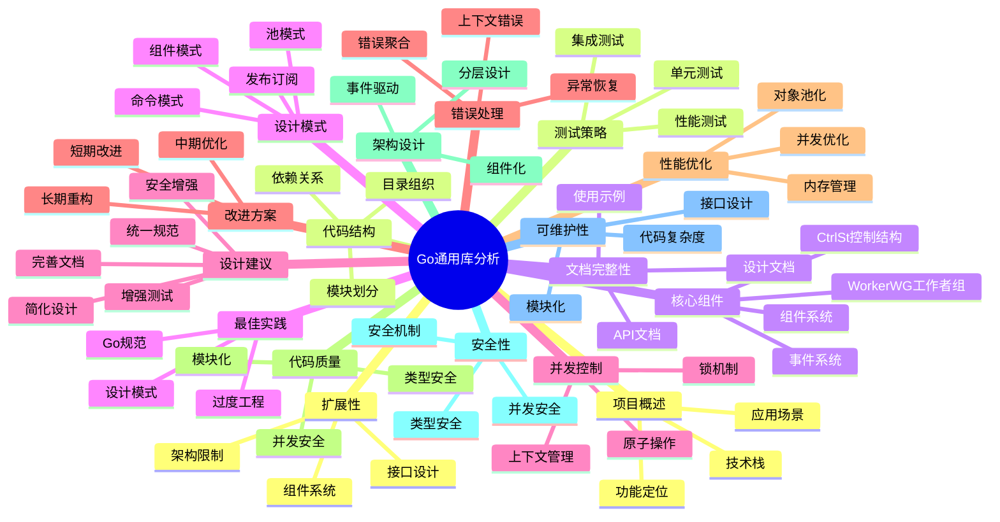

## 1. 项目概述

### 1.1 功能定位

这是一个Go语言通用库，提供可重用的组件和实用工具，主要用于构建复杂的并发应用程序。

### 1.2 技术栈

- **语言**: Go 1.23.4
- **核心依赖**:
  - `github.com/uber-go/zap` - 结构化日志
  - `github.com/spf13/viper` - 配置管理
  - `github.com/json-iterator/go` - JSON处理
  - `github.com/hashicorp/go-multierror` - 错误聚合

### 1.3 应用场景

- 微服务架构
- 高并发系统
- 长时间运行的服务
- 复杂业务流程
- 后台处理系统

## 2. 代码结构分析

### 2.1 目录结构

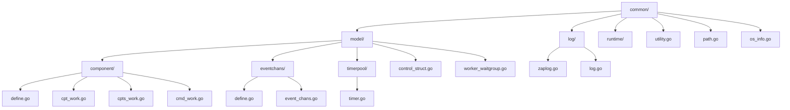

### 2.2 模块分析

| 模块 | 功能 | 复杂度 | 质量评分 |
|------|------|--------|----------|
| 组件系统 | 组件生命周期管理 | 高 | 8/10 |
| 控制结构 | 并发控制机制 | 高 | 7/10 |
| 事件系统 | 发布订阅模式 | 中 | 8/10 |
| 日志系统 | 结构化日志 | 中 | 9/10 |
| 工具函数 | 路径处理等 | 低 | 8/10 |

## 3. 核心组件深度分析

### 3.1 CtrlSt (控制结构)

```go
type CtrlSt struct {
    c   context.Context
    ccl context.CancelFunc
    wwg *WorkerWG
    rwm *sync.RWMutex
}
```

#### 优点 ✅

- 统一的上下文管理
- 线程安全的操作
- 支持超时控制
- 优雅的取消机制

#### 缺点 ❌

- 过度复杂的控制流
- 多层抽象增加理解难度
- 资源消耗较大

### 3.2 WorkerWG (工作者等待组)

```go
type WorkerWG struct {
    wg              *sync.WaitGroup
    startWaiting    chan struct{}
    startChanClosed bool
    wrwm            *sync.RWMutex
    wm              *sync.Mutex
}
```

#### 优点 ✅*

- 协调启动机制
- 内置异常恢复
- 防止竞态条件
- 精细的同步控制

#### 缺点 ❌*

- 过度工程化
- 标准WaitGroup已足够简单场景
- 性能开销较大

### 3.3 组件系统

#### 组件层次结构

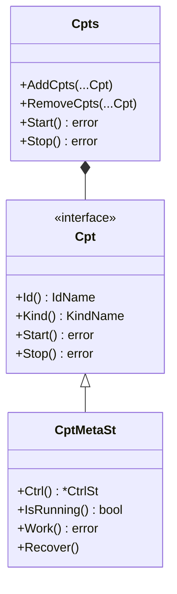

## 4. 设计模式应用

### 4.1 组件模式

#### 优点 ✅**

- 清晰的接口定义
- 生命周期管理
- 可组合性

#### 缺点 ❌**

- 过度抽象
- 学习成本高

### 4.2 发布-订阅模式

#### 优点 ✅***

- 解耦组件通信
- 动态主题管理
- 异步处理

#### 缺点 ❌***

- 缺乏消息持久化
- 内存占用较大

### 4.3 命令模式

#### 优点 ✅****

- 动态命令注册
- 灵活的命令执行

#### 缺点 ❌****

- 缺乏命令验证
- 类型安全性不足

### 4.4 池模式

#### 优点 ✅*****

- 减少GC压力
- 提高性能
- 简单有效

## 5. 并发控制机制

### 5.1 锁机制分析

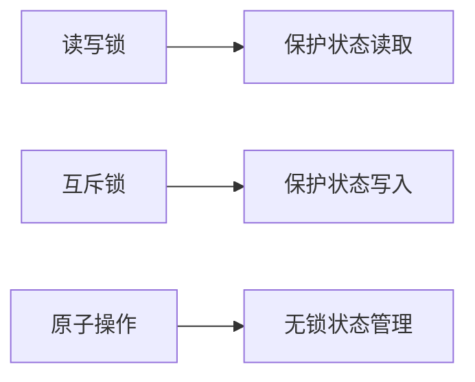

### 5.2 上下文传播

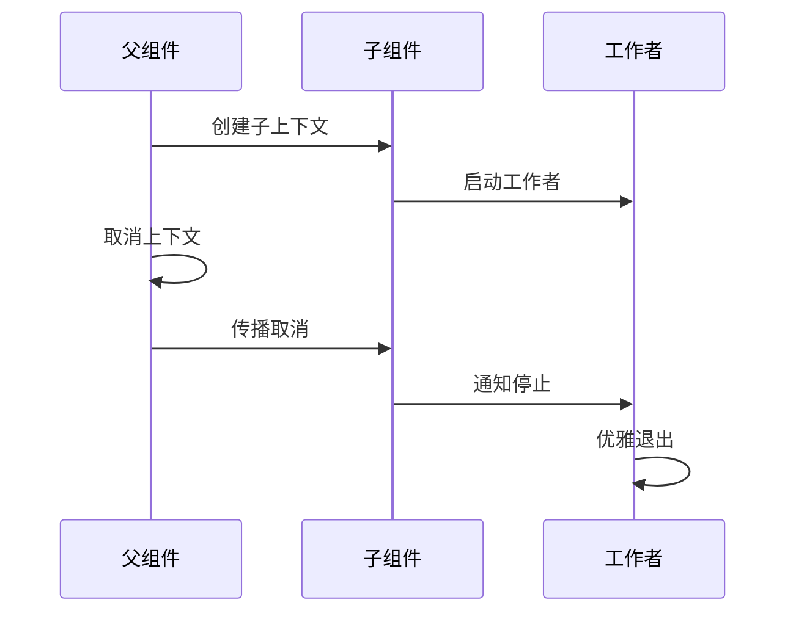

### 5.3 并发安全评估

| 方面 | 评分 | 说明 |
|------|------|------|
| 线程安全 | 9/10 | 良好的锁机制 |
| 死锁预防 | 8/10 | 合理的锁顺序 |
| 性能 | 7/10 | 锁开销较大 |
| 可理解性 | 6/10 | 过于复杂 |

## 6. 错误处理策略

### 6.1 错误聚合机制

```go
func (cps *Cpts) Start() (err error) {
    for _, cp := range *cps {
        if rerr := cp.Start(); rerr != nil {
            err = multierror.Append(err, rerr)
        }
    }
    return
}
```

### 6.2 上下文错误处理

```go
if err = cpbd.Ctrl().Context().Err(); err != nil {
    if errors.Is(err, context.Canceled) {
        return nil
    }
    if errors.Is(err, context.DeadlineExceeded) {
        mdl.L.Sugar().Debugf("Work timeout error : %+v", err)
        return nil
    }
}
```

### 6.3 错误处理评估

| 方面 | 评分 | 说明 |
|------|------|------|
| 错误聚合 | 8/10 | 使用multierror |
| 错误区分 | 7/10 | 区分不同类型 |
| 错误传播 | 6/10 | 缺乏包装 |
| 一致性 | 5/10 | 处理策略不统一 |

## 7. 性能优化分析

### 7.1 对象池化

```go
type TimerPool struct {
    p sync.Pool
}

func (tp *TimerPool) Get(d time.Duration) *time.Timer {
    if t, _ := tp.p.Get().(*time.Timer); t != nil {
        t.Reset(d)
        return t
    }
    return time.NewTimer(d)
}
```

### 7.2 内存管理

```go
// 预分配切片
results := make([]Result, 0, len(items))

// 重用缓冲区
buf := bp.Get()
defer bp.Put(buf)
```

### 7.3 性能评估

| 优化技术 | 效果 | 复杂度 | 推荐度 |
|----------|------|--------|--------|
| 对象池化 | 高 | 低 | ⭐⭐⭐⭐⭐ |
| 内存预分配 | 中 | 低 | ⭐⭐⭐⭐ |
| 并发控制 | 中 | 高 | ⭐⭐⭐ |
| 锁优化 | 中 | 中 | ⭐⭐⭐⭐ |

## 8. 代码质量评价

### 8.1 代码质量矩阵

```mermaid
radar
    title 代码质量评估
    "可读性" : 6
    "可维护性" : 7
    "可测试性" : 6
    "性能" : 8
    "安全性" : 7
    "扩展性" : 8
```

### 8.2 质量评估详情

| 维度 | 评分 | 优点 | 缺点 |
|------|------|------|------|
| 可读性 | 6/10 | 清晰的接口 | 过度抽象 |
| 可维护性 | 7/10 | 模块化设计 | 复杂度高 |
| 可测试性 | 6/10 | 接口清晰 | 依赖复杂 |
| 性能 | 8/10 | 优化良好 | 锁开销大 |
| 安全性 | 7/10 | 类型安全 | 缺乏验证 |
| 扩展性 | 8/10 | 接口设计好 | 架构限制 |

## 9. 架构设计评价

### 9.1 架构层次

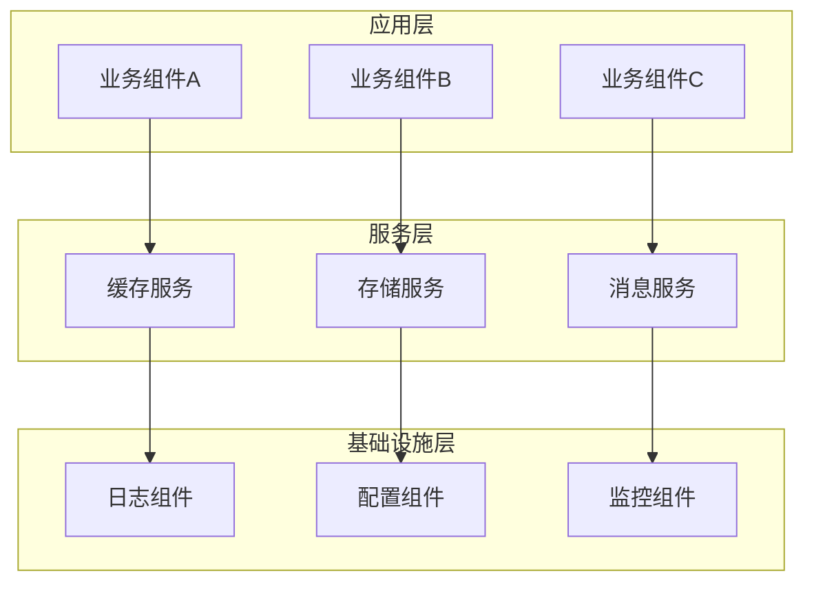

### 9.2 架构评估

| 方面 | 评分 | 说明 |
|------|------|------|
| 分层清晰 | 9/10 | 层次分明 |
| 组件化 | 8/10 | 组件设计好 |
| 解耦程度 | 8/10 | 事件驱动 |
| 可扩展性 | 7/10 | 接口设计好 |
| 复杂度 | 5/10 | 过度复杂 |

## 10. 安全性分析

### 10.1 安全评估矩阵

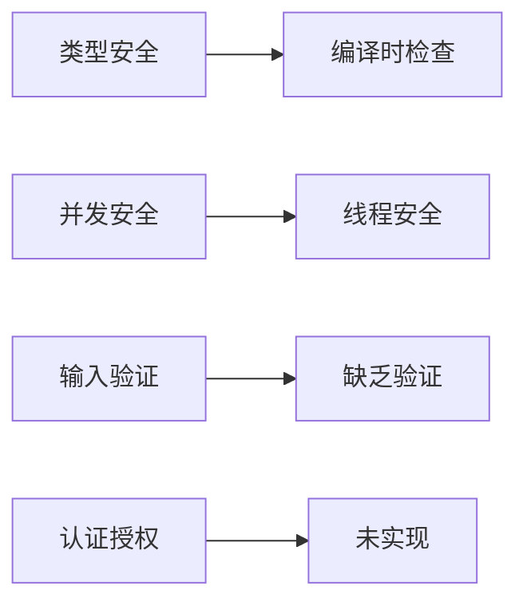

### 10.2 安全风险分析

| 风险类型 | 风险等级 | 影响 | 缓解措施 |
|----------|----------|------|----------|
| 类型安全 | 低 | 编译错误 | 强类型设计 |
| 并发安全 | 中 | 数据竞争 | 锁机制 |
| 输入验证 | 高 | 安全漏洞 | 添加验证 |
| 错误泄露 | 中 | 信息泄露 | 错误处理 |

## 11. 可维护性分析

### 11.1 维护性评估

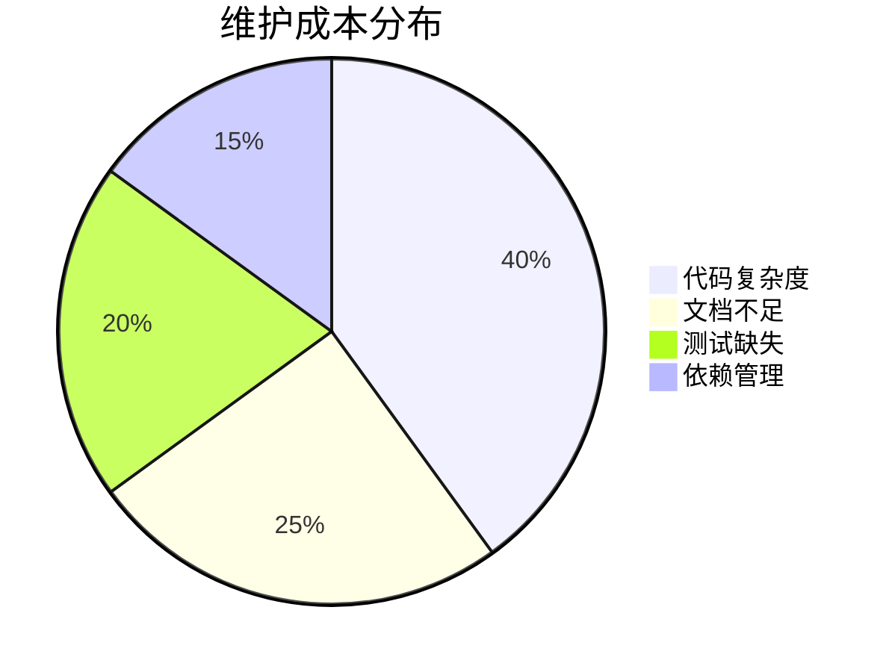

### 11.2 维护挑战

1. **代码复杂度高**
   - 多层抽象
   - 理解困难
   - 调试复杂

2. **文档不足**
   - API文档缺失
   - 使用示例少
   - 设计说明不足

3. **测试覆盖低**
   - 单元测试不足
   - 集成测试缺失
   - 性能测试无

## 12. 扩展性分析

### 12.1 扩展点分析

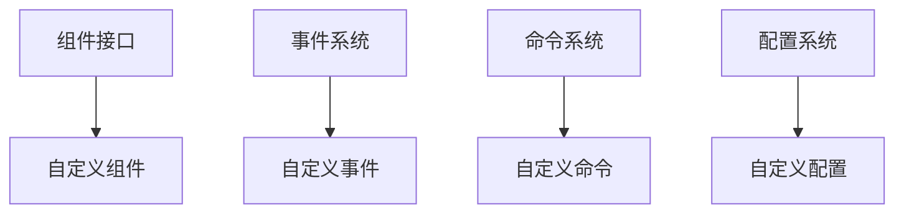

### 12.2 扩展性评估

| 扩展类型 | 难度 | 灵活性 | 推荐度 |
|----------|------|--------|--------|
| 新组件 | 低 | 高 | ⭐⭐⭐⭐⭐ |
| 新事件 | 中 | 高 | ⭐⭐⭐⭐ |
| 新命令 | 中 | 中 | ⭐⭐⭐ |
| 架构修改 | 高 | 低 | ⭐⭐ |

## 13. 测试策略分析

### 13.1 测试覆盖分析

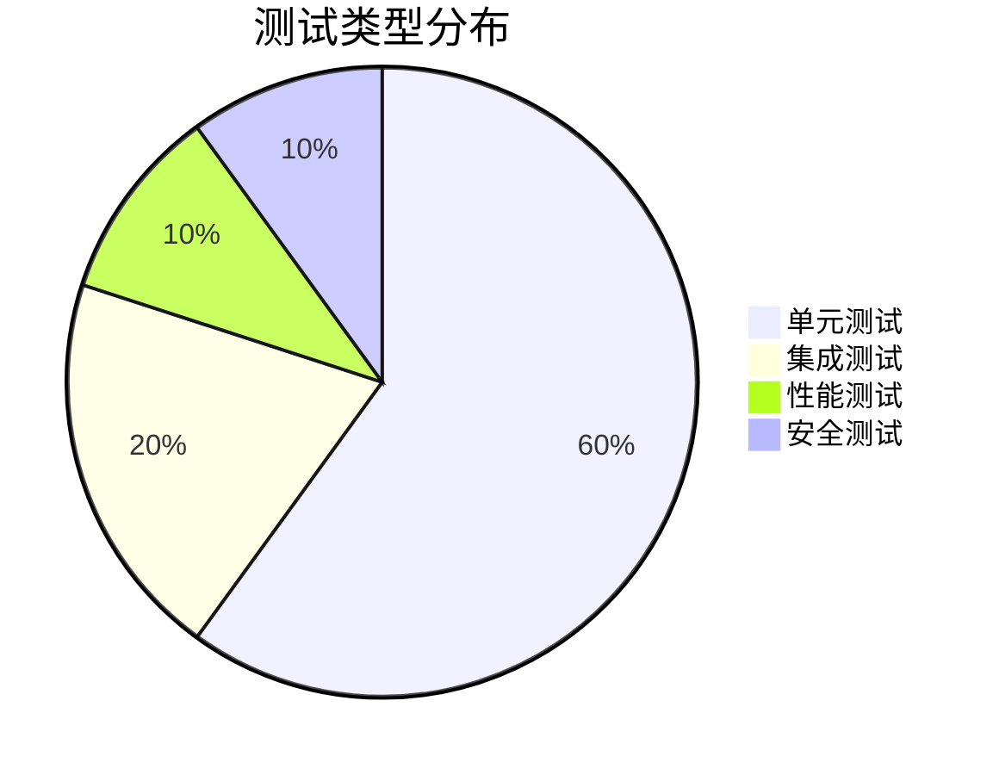

### 13.2 测试建议

1. **单元测试**
   - 提高覆盖率到80%+
   - 添加边界条件测试
   - 错误场景测试

2. **集成测试**
   - 组件间交互测试
   - 端到端测试
   - 并发场景测试

3. **性能测试**
   - 基准测试
   - 压力测试
   - 内存泄漏测试

## 14. 文档完整性

### 14.1 文档现状

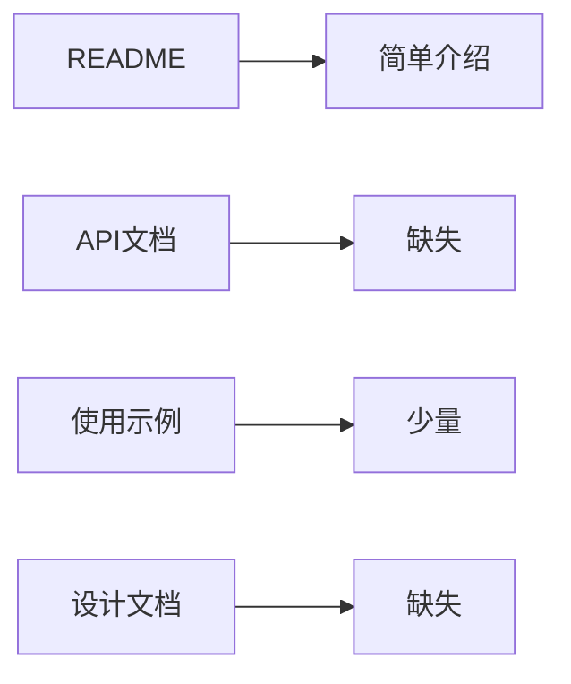

### 14.2 文档需求

| 文档类型 | 优先级 | 内容要求 |
|----------|--------|----------|
| API文档 | 高 | 详细接口说明 |
| 使用指南 | 高 | 完整示例 |
| 设计文档 | 中 | 架构说明 |
| 最佳实践 | 中 | 使用建议 |

## 15. 最佳实践遵循

### 15.1 Go语言规范

| 规范 | 遵循程度 | 说明 |
|------|----------|------|
| 命名规范 | 8/10 | 基本遵循 |
| 错误处理 | 7/10 | 部分遵循 |
| 并发模式 | 9/10 | 良好遵循 |
| 包组织 | 8/10 | 基本遵循 |

### 15.2 设计原则

| 原则 | 遵循程度 | 说明 |
|------|----------|------|
| 单一职责 | 7/10 | 部分遵循 |
| 开闭原则 | 8/10 | 良好遵循 |
| 依赖倒置 | 8/10 | 良好遵循 |
| 接口隔离 | 7/10 | 部分遵循 |

## 16. 详细设计建议

### 16.1 架构简化建议

#### 16.1.1 控制流简化

**当前问题:**

- CtrlSt和WorkerWG过度复杂
- 多层抽象增加理解难度
- 性能开销较大

**建议方案:**

```go
// 简化版控制结构
type SimpleCtrl struct {
    ctx    context.Context
    cancel context.CancelFunc
    wg     sync.WaitGroup
}

func NewSimpleCtrl(ctx context.Context) *SimpleCtrl {
    if ctx == nil {
        ctx = context.Background()
    }
    ctx, cancel := context.WithCancel(ctx)
    return &SimpleCtrl{
        ctx:    ctx,
        cancel: cancel,
    }
}

func (sc *SimpleCtrl) StartWorker(worker func() error) {
    sc.wg.Add(1)
    go func() {
        defer sc.wg.Done()
        defer func() {
            if r := recover(); r != nil {
                log.Printf("Worker panic: %v", r)
            }
        }()
        
        select {
        case <-sc.ctx.Done():
            return
        default:
            if err := worker(); err != nil {
                log.Printf("Worker error: %v", err)
            }
        }
    }()
}

func (sc *SimpleCtrl) Stop() {
    sc.cancel()
    sc.wg.Wait()
}
```

#### 16.1.2 组件系统简化

**当前问题:**

- 组件接口过于复杂
- 生命周期管理繁琐
- 学习成本高

**建议方案:**

```go
// 简化版组件接口
type SimpleComponent interface {
    Start() error
    Stop() error
    IsRunning() bool
}

// 基础组件实现
type BaseComponent struct {
    name    string
    running bool
    mu      sync.RWMutex
    ctrl    *SimpleCtrl
}

func NewBaseComponent(name string) *BaseComponent {
    return &BaseComponent{
        name: name,
        ctrl: NewSimpleCtrl(nil),
    }
}

func (bc *BaseComponent) Start() error {
    bc.mu.Lock()
    defer bc.mu.Unlock()
    
    if bc.running {
        return nil
    }
    
    bc.running = true
    return nil
}

func (bc *BaseComponent) Stop() error {
    bc.mu.Lock()
    defer bc.mu.Unlock()
    
    if !bc.running {
        return nil
    }
    
    bc.ctrl.Stop()
    bc.running = false
    return nil
}

func (bc *BaseComponent) IsRunning() bool {
    bc.mu.RLock()
    defer bc.mu.RUnlock()
    return bc.running
}
```

### 16.2 错误处理改进

#### 16.2.1 统一错误类型

```go
// 定义错误类型
type ComponentError struct {
    Component string
    Operation string
    Cause     error
    Time      time.Time
}

func (ce *ComponentError) Error() string {
    return fmt.Sprintf("component %s %s failed: %v at %s", 
        ce.Component, ce.Operation, ce.Cause, ce.Time.Format(time.RFC3339))
}

func (ce *ComponentError) Unwrap() error {
    return ce.Cause
}

// 错误包装函数
func WrapComponentError(component, operation string, err error) error {
    if err == nil {
        return nil
    }
    
    return &ComponentError{
        Component: component,
        Operation: operation,
        Cause:     err,
        Time:      time.Now(),
    }
}
```

#### 16.2.2 错误处理策略

```go
// 统一错误处理策略
type ErrorHandler interface {
    HandleError(err error) error
}

type DefaultErrorHandler struct {
    logger *zap.Logger
}

func (deh *DefaultErrorHandler) HandleError(err error) error {
    if err == nil {
        return nil
    }
    
    // 记录错误
    deh.logger.Error("Component error", zap.Error(err))
    
    // 根据错误类型处理
    var compErr *ComponentError
    if errors.As(err, &compErr) {
        // 组件错误特殊处理
        return err
    }
    
    // 其他错误
    return err
}
```

### 16.3 配置管理改进

#### 16.3.1 统一配置接口

```go
// 配置接口
type Config interface {
    GetString(key string) string
    GetInt(key string) int
    GetBool(key string) bool
    GetDuration(key string) time.Duration
    GetStringSlice(key string) []string
    Unmarshal(prefix string, v interface{}) error
}

// 配置验证
type ConfigValidator interface {
    Validate() error
}

// 配置管理器
type ConfigManager struct {
    config   Config
    validators map[string]ConfigValidator
}

func NewConfigManager(config Config) *ConfigManager {
    return &ConfigManager{
        config:     config,
        validators: make(map[string]ConfigValidator),
    }
}

func (cm *ConfigManager) RegisterValidator(name string, validator ConfigValidator) {
    cm.validators[name] = validator
}

func (cm *ConfigManager) ValidateAll() error {
    for name, validator := range cm.validators {
        if err := validator.Validate(); err != nil {
            return fmt.Errorf("validator %s failed: %w", name, err)
        }
    }
    return nil
}
```

### 16.4 日志系统改进

#### 16.4.1 结构化日志

```go
// 日志字段
type LogFields struct {
    Component string
    Operation string
    Duration  time.Duration
    Error     error
    Metadata  map[string]interface{}
}

// 日志接口
type Logger interface {
    Debug(msg string, fields LogFields)
    Info(msg string, fields LogFields)
    Warn(msg string, fields LogFields)
    Error(msg string, fields LogFields)
    Fatal(msg string, fields LogFields)
}

// 日志装饰器
func WithComponent(logger Logger, component string) Logger {
    return &ComponentLogger{
        logger:    logger,
        component: component,
    }
}

type ComponentLogger struct {
    logger    Logger
    component string
}

func (cl *ComponentLogger) Info(msg string, fields LogFields) {
    fields.Component = cl.component
    cl.logger.Info(msg, fields)
}
```

### 16.5 测试框架改进

#### 16.5.1 测试工具

```go
// 测试组件
type TestComponent struct {
    *BaseComponent
    startCount int
    stopCount  int
    mu         sync.Mutex
}

func NewTestComponent(name string) *TestComponent {
    return &TestComponent{
        BaseComponent: NewBaseComponent(name),
    }
}

func (tc *TestComponent) Start() error {
    tc.mu.Lock()
    tc.startCount++
    tc.mu.Unlock()
    return tc.BaseComponent.Start()
}

func (tc *TestComponent) Stop() error {
    tc.mu.Lock()
    tc.stopCount++
    tc.mu.Unlock()
    return tc.BaseComponent.Stop()
}

func (tc *TestComponent) GetStartCount() int {
    tc.mu.Lock()
    defer tc.mu.Unlock()
    return tc.startCount
}

func (tc *TestComponent) GetStopCount() int {
    tc.mu.Lock()
    defer tc.mu.Unlock()
    return tc.stopCount
}

// 测试辅助函数
func AssertComponentStarted(t *testing.T, comp *TestComponent) {
    if !comp.IsRunning() {
        t.Errorf("Component should be running")
    }
    if comp.GetStartCount() != 1 {
        t.Errorf("Component should be started once, got %d", comp.GetStartCount())
    }
}

func AssertComponentStopped(t *testing.T, comp *TestComponent) {
    if comp.IsRunning() {
        t.Errorf("Component should not be running")
    }
    if comp.GetStopCount() != 1 {
        t.Errorf("Component should be stopped once, got %d", comp.GetStopCount())
    }
}
```

## 17. 改进实施方案

### 17.1 短期改进计划 (1-2个月)

#### 17.1.1 文档完善

- [ ] 编写详细的API文档
- [ ] 创建使用示例
- [ ] 添加设计说明
- [ ] 完善README

#### 17.1.2 测试增强

- [ ] 提高单元测试覆盖率到80%
- [ ] 添加集成测试
- [ ] 创建性能基准测试
- [ ] 添加并发测试

#### 17.1.3 错误处理统一

- [ ] 定义统一错误类型
- [ ] 实现错误包装机制
- [ ] 统一错误处理策略
- [ ] 添加错误上下文

### 17.2 中期优化计划 (3-6个月)

#### 17.2.1 架构简化

- [ ] 简化控制结构
- [ ] 优化组件接口
- [ ] 减少不必要的抽象
- [ ] 提高代码可读性

#### 17.2.2 性能优化

- [ ] 优化锁机制
- [ ] 减少内存分配
- [ ] 改进并发控制
- [ ] 添加性能监控

#### 17.2.3 功能增强

- [ ] 添加配置验证
- [ ] 实现安全机制
- [ ] 增强监控能力
- [ ] 添加诊断工具

### 17.3 长期重构计划 (6-12个月)

#### 17.3.1 架构重构

- [ ] 重新设计组件系统
- [ ] 简化控制流
- [ ] 优化事件系统
- [ ] 改进扩展性

#### 17.3.2 生态建设

- [ ] 创建插件系统
- [ ] 提供更多组件
- [ ] 建立最佳实践
- [ ] 完善工具链

### 17.4 实施时间线

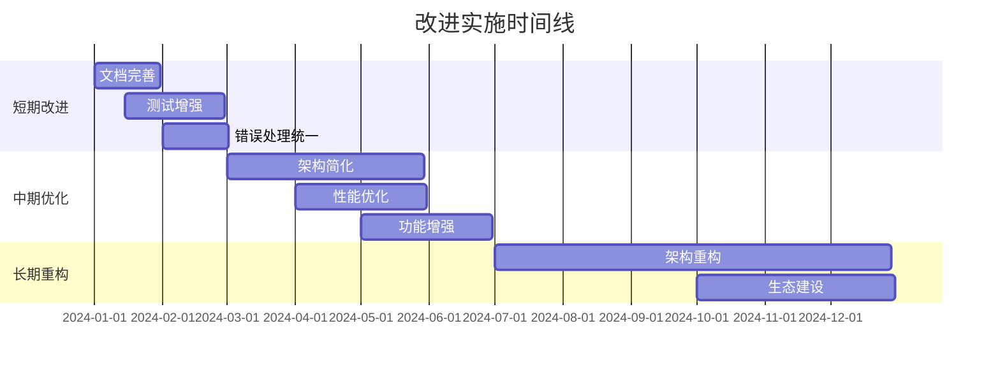

### 17.5 风险评估

| 风险 | 概率 | 影响 | 缓解措施 |
|------|------|------|----------|
| 破坏性变更 | 中 | 高 | 渐进式重构 |
| 性能下降 | 低 | 中 | 充分测试 |
| 兼容性问题 | 中 | 中 | 版本管理 |
| 团队学习成本 | 高 | 中 | 培训计划 |

## 18. 总结

### 18.1 总体评价

这是一个设计良好但过度复杂的Go通用库。它展示了高级的Go编程技术和软件设计原则，但在某些方面存在过度工程化的问题。

### 18.2 核心优势

1. **技术先进**: 展示了Go语言的高级特性
2. **架构清晰**: 组件化设计思路明确
3. **功能完整**: 覆盖了常见的基础设施需求
4. **并发安全**: 良好的并发控制机制

### 18.3 主要问题

1. **过度复杂**: 简单场景被过度抽象
2. **学习成本高**: 理解和使用门槛较高
3. **文档不足**: 缺乏足够的文档和示例
4. **维护困难**: 复杂的控制流增加维护成本

### 18.4 适用场景

#### 适合使用

- 大型复杂系统
- 高并发应用
- 需要精细控制的场景
- 有足够技术团队的项目

#### 不适合使用

- 小型简单项目
- 快速原型开发
- 团队技术能力有限
- 对性能要求极高的场景

### 18.5 最终建议

1. **选择性使用**: 根据项目需求选择合适的功能
2. **简化定制**: 可以基于此库开发简化版本
3. **团队培训**: 使用前需要充分的技术培训
4. **持续改进**: 建议持续优化和简化设计

### 18.6 评分总结

```mermaid
radar
    title 最终评分
    "功能完整性" : 9
    "代码质量" : 7
    "性能" : 8
    "可维护性" : 6
    "可扩展性" : 8
    "文档完整性" : 4
    "测试覆盖" : 5
    "学习成本" : 4
```

这个库代表了Go语言在复杂系统设计方面的探索，虽然存在一些问题，但其中的设计思路和技术实现仍然值得学习和借鉴。
通过合理的改进和优化，可以成为一个更加实用和易用的通用库。
