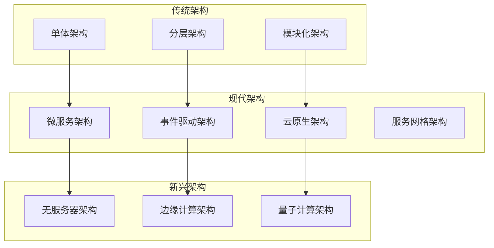
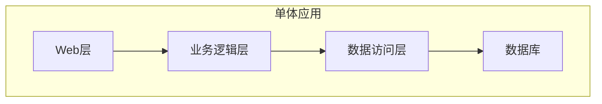
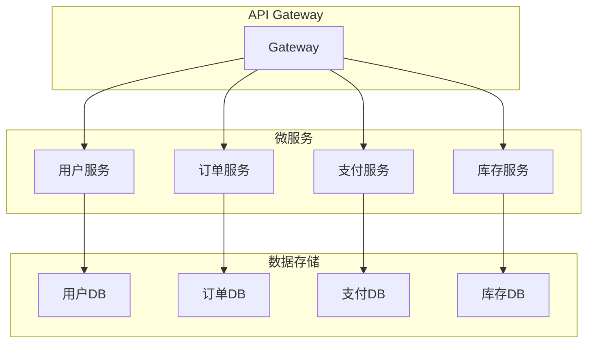
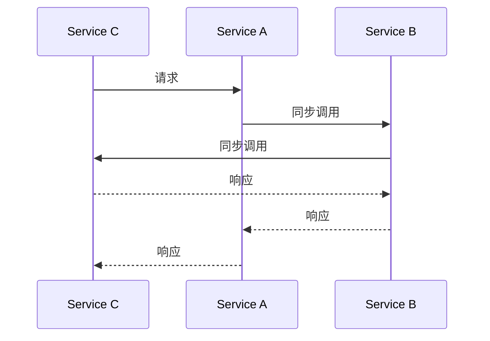
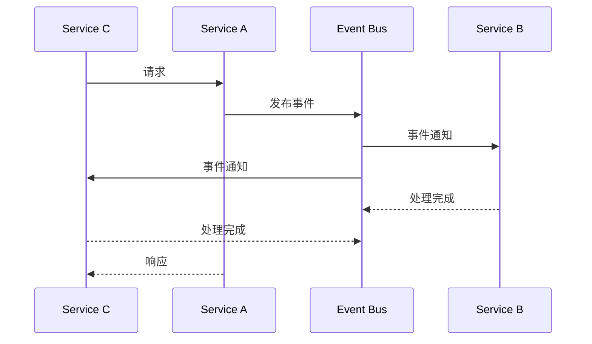
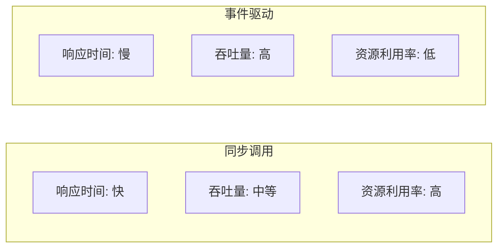
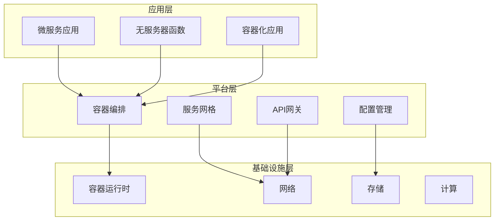
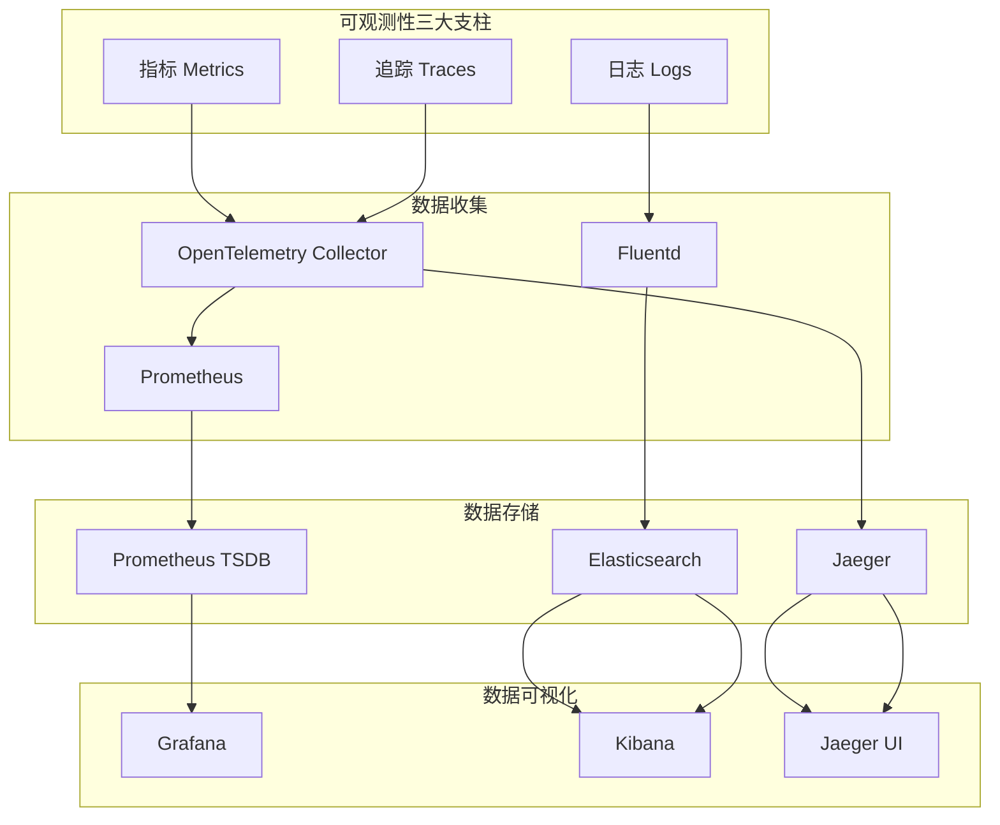

# 架构模式对比分析与选型

## 🎯 分析目标

本文档对现代软件架构的各种模式进行全面的对比分析，包括微服务、云原生、事件驱动、可观测性等架构模式，为项目重构提供科学的架构选型依据。

## 🏗️ 架构模式概览

### 1. 主流架构模式分类



## 📊 架构模式详细对比

### 1. 单体架构 vs 微服务架构

#### 1.1 架构图对比

**单体架构**：



**微服务架构**：



#### 1.2 详细对比表

| 维度 | 单体架构 | 微服务架构 | 推荐场景 |
|------|----------|------------|----------|
| **开发效率** | ⭐⭐⭐⭐⭐ | ⭐⭐⭐ | 小团队，快速迭代 |
| **部署复杂度** | ⭐⭐⭐⭐⭐ | ⭐⭐ | 简单应用 |
| **扩展性** | ⭐⭐ | ⭐⭐⭐⭐⭐ | 高并发，大规模 |
| **团队自治** | ⭐⭐ | ⭐⭐⭐⭐⭐ | 大型团队 |
| **技术多样性** | ⭐ | ⭐⭐⭐⭐⭐ | 多技术栈需求 |
| **故障隔离** | ⭐ | ⭐⭐⭐⭐⭐ | 高可用要求 |
| **运维复杂度** | ⭐⭐⭐⭐⭐ | ⭐⭐ | 运维资源有限 |
| **性能** | ⭐⭐⭐⭐ | ⭐⭐⭐ | 低延迟要求 |
| **数据一致性** | ⭐⭐⭐⭐⭐ | ⭐⭐ | 强一致性要求 |
| **成本** | ⭐⭐⭐⭐⭐ | ⭐⭐ | 成本敏感 |

#### 1.3 代码示例对比

**单体架构 - 用户管理**：

```go
// 单体架构 - 用户管理模块
package user

type UserService struct {
    userRepo   *UserRepository
    orderRepo  *OrderRepository
    paymentRepo *PaymentRepository
}

func (s *UserService) CreateUser(ctx context.Context, user *User) error {
    // 在同一个事务中处理用户创建
    tx := s.db.Begin()
    defer func() {
        if r := recover(); r != nil {
            tx.Rollback()
        }
    }()
    
    // 创建用户
    if err := s.userRepo.Create(tx, user); err != nil {
        tx.Rollback()
        return err
    }
    
    // 创建用户配置
    if err := s.userRepo.CreateConfig(tx, user.ID); err != nil {
        tx.Rollback()
        return err
    }
    
    // 初始化用户订单
    if err := s.orderRepo.InitializeUser(tx, user.ID); err != nil {
        tx.Rollback()
        return err
    }
    
    return tx.Commit().Error
}
```

**微服务架构 - 用户服务**：

```go
// 微服务架构 - 用户服务
package userservice

type UserService struct {
    userRepo *UserRepository
    eventBus *EventBus
}

func (s *UserService) CreateUser(ctx context.Context, user *User) error {
    // 只处理用户创建
    if err := s.userRepo.Create(user); err != nil {
        return err
    }
    
    // 发布用户创建事件
    event := &UserCreatedEvent{
        UserID:   user.ID,
        Username: user.Username,
        Email:    user.Email,
        Timestamp: time.Now(),
    }
    
    return s.eventBus.Publish(ctx, "user.created", event)
}

// 事件处理器 - 订单服务
func (h *OrderServiceHandler) HandleUserCreated(ctx context.Context, event *UserCreatedEvent) error {
    return h.orderRepo.InitializeUser(event.UserID)
}

// 事件处理器 - 支付服务
func (h *PaymentServiceHandler) HandleUserCreated(ctx context.Context, event *UserCreatedEvent) error {
    return h.paymentRepo.InitializeUser(event.UserID)
}
```

### 2. 同步调用 vs 事件驱动架构

#### 2.1 架构图对比

**同步调用**：



**事件驱动**：



#### 2.2 性能对比



#### 2.3 代码实现对比

**同步调用实现**：

```go
// 同步调用 - 订单服务
type OrderService struct {
    userService    *UserService
    paymentService *PaymentService
    inventoryService *InventoryService
}

func (s *OrderService) CreateOrder(ctx context.Context, order *Order) error {
    // 1. 验证用户
    user, err := s.userService.GetUser(ctx, order.UserID)
    if err != nil {
        return fmt.Errorf("failed to get user: %w", err)
    }
    
    // 2. 检查库存
    available, err := s.inventoryService.CheckStock(ctx, order.ProductID, order.Quantity)
    if err != nil {
        return fmt.Errorf("failed to check stock: %w", err)
    }
    if !available {
        return errors.New("insufficient stock")
    }
    
    // 3. 创建支付
    payment, err := s.paymentService.CreatePayment(ctx, &PaymentRequest{
        UserID: order.UserID,
        Amount: order.TotalAmount,
    })
    if err != nil {
        return fmt.Errorf("failed to create payment: %w", err)
    }
    
    // 4. 创建订单
    order.PaymentID = payment.ID
    return s.orderRepo.Create(order)
}
```

**事件驱动实现**：

```go
// 事件驱动 - 订单服务
type OrderService struct {
    orderRepo *OrderRepository
    eventBus  *EventBus
}

func (s *OrderService) CreateOrder(ctx context.Context, order *Order) error {
    // 1. 创建订单（初始状态）
    order.Status = OrderStatusPending
    if err := s.orderRepo.Create(order); err != nil {
        return err
    }
    
    // 2. 发布订单创建事件
    event := &OrderCreatedEvent{
        OrderID:    order.ID,
        UserID:     order.UserID,
        ProductID:  order.ProductID,
        Quantity:   order.Quantity,
        Amount:     order.TotalAmount,
        Timestamp:  time.Now(),
    }
    
    return s.eventBus.Publish(ctx, "order.created", event)
}

// 事件处理器 - 库存服务
func (h *InventoryServiceHandler) HandleOrderCreated(ctx context.Context, event *OrderCreatedEvent) error {
    // 检查并预留库存
    if err := h.inventoryRepo.ReserveStock(ctx, event.ProductID, event.Quantity); err != nil {
        // 发布库存不足事件
        return h.eventBus.Publish(ctx, "inventory.insufficient", &InventoryInsufficientEvent{
            OrderID: event.OrderID,
        })
    }
    
    // 发布库存预留成功事件
    return h.eventBus.Publish(ctx, "inventory.reserved", &InventoryReservedEvent{
        OrderID: event.OrderID,
    })
}

// 事件处理器 - 支付服务
func (h *PaymentServiceHandler) HandleOrderCreated(ctx context.Context, event *OrderCreatedEvent) error {
    // 创建支付
    payment, err := h.paymentRepo.Create(&Payment{
        UserID: event.UserID,
        Amount: event.Amount,
        OrderID: event.OrderID,
    })
    if err != nil {
        return h.eventBus.Publish(ctx, "payment.failed", &PaymentFailedEvent{
            OrderID: event.OrderID,
        })
    }
    
    // 发布支付创建成功事件
    return h.eventBus.Publish(ctx, "payment.created", &PaymentCreatedEvent{
        OrderID:  event.OrderID,
        PaymentID: payment.ID,
    })
}
```

### 3. 云原生架构模式

#### 3.1 云原生架构层次



#### 3.2 云原生设计原则

| 原则 | 描述 | 实现方式 | 收益 |
|------|------|----------|------|
| **容器化** | 应用打包为容器 | Docker + Kubernetes | 环境一致性 |
| **微服务** | 服务拆分和独立部署 | 服务网格 + API网关 | 团队自治 |
| **不可变基础设施** | 通过代码管理基础设施 | Infrastructure as Code | 可重复部署 |
| **声明式API** | 描述期望状态 | Kubernetes YAML | 自动化管理 |
| **松耦合** | 服务间松耦合设计 | 事件驱动 + 消息队列 | 高可用性 |

#### 3.3 云原生技术栈对比

| 技术类别 | 推荐方案 | 备选方案 | 选择理由 |
|----------|----------|----------|----------|
| **容器运行时** | containerd | Docker Engine | 轻量级，CNCF标准 |
| **容器编排** | Kubernetes | Docker Swarm | 生态最成熟 |
| **服务网格** | Istio | Linkerd | 功能最全面 |
| **API网关** | Kong | Envoy | 功能丰富，易用 |
| **配置管理** | Consul | etcd | 服务发现集成 |
| **监控** | Prometheus | InfluxDB | 云原生标准 |
| **日志** | ELK Stack | Loki | 功能最全面 |

### 4. 可观测性架构模式

#### 4.1 可观测性三大支柱



#### 4.2 可观测性实现对比

**传统监控 vs 现代可观测性**：

| 特性 | 传统监控 | 现代可观测性 | 优势 |
|------|----------|--------------|------|
| **数据收集** | 被动收集 | 主动收集 | 实时性更好 |
| **数据粒度** | 粗粒度 | 细粒度 | 问题定位更精确 |
| **数据关联** | 独立数据 | 关联数据 | 根因分析更准确 |
| **告警机制** | 阈值告警 | 智能告警 | 减少误报 |
| **可视化** | 静态图表 | 交互式仪表板 | 分析更灵活 |

#### 4.3 可观测性代码实现

**OpenTelemetry 集成**：

```go
// OpenTelemetry 配置
package observability

import (
    "go.opentelemetry.io/otel"
    "go.opentelemetry.io/otel/exporters/jaeger"
    "go.opentelemetry.io/otel/sdk/resource"
    sdktrace "go.opentelemetry.io/otel/sdk/trace"
    semconv "go.opentelemetry.io/otel/semconv/v1.21.0"
)

func InitTracer(serviceName, serviceVersion string) (*sdktrace.TracerProvider, error) {
    // 创建 Jaeger exporter
    exp, err := jaeger.New(jaeger.WithCollectorEndpoint(jaeger.WithEndpoint("http://localhost:14268/api/traces")))
    if err != nil {
        return nil, err
    }
    
    // 创建资源
    res, err := resource.New(context.Background(),
        resource.WithAttributes(
            semconv.ServiceName(serviceName),
            semconv.ServiceVersion(serviceVersion),
        ),
    )
    if err != nil {
        return nil, err
    }
    
    // 创建 TracerProvider
    tp := sdktrace.NewTracerProvider(
        sdktrace.WithBatcher(exp),
        sdktrace.WithResource(res),
    )
    
    otel.SetTracerProvider(tp)
    return tp, nil
}

// 在服务中使用
func (s *UserService) CreateUser(ctx context.Context, user *User) error {
    tracer := otel.Tracer("user-service")
    ctx, span := tracer.Start(ctx, "CreateUser")
    defer span.End()
    
    // 添加属性
    span.SetAttributes(
        attribute.String("user.email", user.Email),
        attribute.String("user.username", user.Username),
    )
    
    // 业务逻辑
    if err := s.userRepo.Create(user); err != nil {
        span.RecordError(err)
        return err
    }
    
    // 记录事件
    span.AddEvent("user.created", trace.WithAttributes(
        attribute.String("user.id", user.ID),
    ))
    
    return nil
}
```

**Prometheus 指标收集**：

```go
// Prometheus 指标定义
package metrics

import (
    "github.com/prometheus/client_golang/prometheus"
    "github.com/prometheus/client_golang/prometheus/promauto"
)

var (
    // HTTP 请求计数器
    HttpRequestsTotal = promauto.NewCounterVec(
        prometheus.CounterOpts{
            Name: "http_requests_total",
            Help: "Total number of HTTP requests",
        },
        []string{"method", "endpoint", "status"},
    )
    
    // HTTP 请求持续时间
    HttpRequestDuration = promauto.NewHistogramVec(
        prometheus.HistogramOpts{
            Name:    "http_request_duration_seconds",
            Help:    "HTTP request duration in seconds",
            Buckets: prometheus.DefBuckets,
        },
        []string{"method", "endpoint"},
    )
    
    // 活跃用户数
    ActiveUsers = promauto.NewGauge(
        prometheus.GaugeOpts{
            Name: "active_users_total",
            Help: "Total number of active users",
        },
    )
)

// 中间件实现
func PrometheusMiddleware(next http.Handler) http.Handler {
    return http.HandlerFunc(func(w http.ResponseWriter, r *http.Request) {
        start := time.Now()
        
        // 包装 ResponseWriter 以获取状态码
        wrapped := &responseWriter{ResponseWriter: w, statusCode: http.StatusOK}
        
        next.ServeHTTP(wrapped, r)
        
        // 记录指标
        duration := time.Since(start).Seconds()
        HttpRequestsTotal.WithLabelValues(r.Method, r.URL.Path, strconv.Itoa(wrapped.statusCode)).Inc()
        HttpRequestDuration.WithLabelValues(r.Method, r.URL.Path).Observe(duration)
    })
}

type responseWriter struct {
    http.ResponseWriter
    statusCode int
}

func (rw *responseWriter) WriteHeader(code int) {
    rw.statusCode = code
    rw.ResponseWriter.WriteHeader(code)
}
```

## 🎯 架构选型决策矩阵

### 1. 决策权重分配

| 维度 | 权重 | 说明 |
|------|------|------|
| **性能** | 25% | 响应时间和吞吐量 |
| **可扩展性** | 20% | 系统扩展能力 |
| **可维护性** | 20% | 代码质量和维护成本 |
| **团队效率** | 15% | 开发效率和团队自治 |
| **运维复杂度** | 10% | 部署和运维难度 |
| **成本** | 10% | 开发和运维成本 |

### 2. 架构模式评分

| 架构模式 | 性能 | 可扩展性 | 可维护性 | 团队效率 | 运维复杂度 | 成本 | 综合得分 |
|----------|------|----------|----------|----------|------------|------|----------|
| **单体架构** | 85 | 60 | 90 | 95 | 95 | 90 | 84.5 |
| **微服务架构** | 80 | 95 | 75 | 85 | 60 | 70 | 78.5 |
| **事件驱动** | 75 | 90 | 70 | 80 | 65 | 75 | 76.5 |
| **云原生** | 85 | 95 | 80 | 85 | 70 | 75 | 82.5 |

### 3. 最终推荐架构

基于项目需求和团队能力，推荐采用 **云原生微服务架构**：

#### 3.1 架构特点

- **微服务拆分**: 按业务领域拆分服务
- **事件驱动**: 服务间通过事件通信
- **容器化部署**: 使用 Kubernetes 编排
- **可观测性**: 集成 OpenTelemetry + Prometheus
- **API网关**: 使用 Kong 统一入口

#### 3.2 实施策略

1. **第一阶段**: 基础微服务架构
2. **第二阶段**: 事件驱动集成
3. **第三阶段**: 云原生特性
4. **第四阶段**: 高级可观测性

#### 3.3 成功指标

- **性能**: 响应时间 < 100ms，吞吐量 > 10k QPS
- **可用性**: 99.9% 服务可用性
- **扩展性**: 支持水平扩展
- **可观测性**: 100% 服务监控覆盖
- **开发效率**: 团队开发效率提升 30%

---

*本架构对比分析为项目重构提供了科学的架构选型依据，确保系统的高性能、高可用性和可扩展性。*
