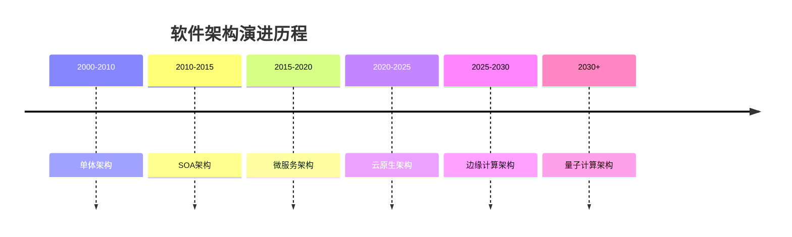
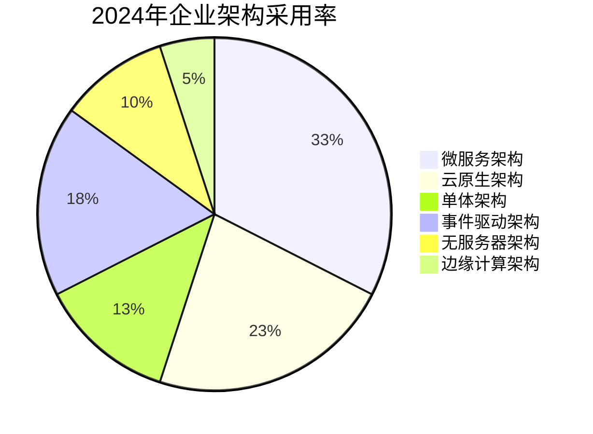
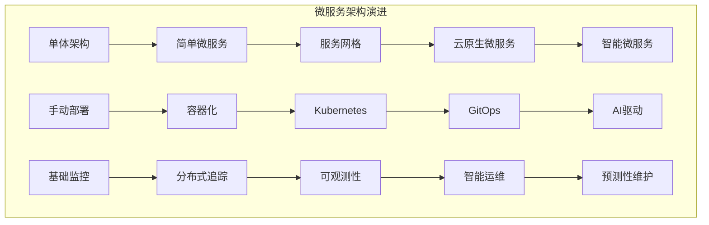
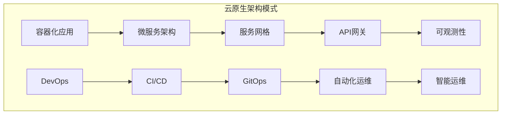
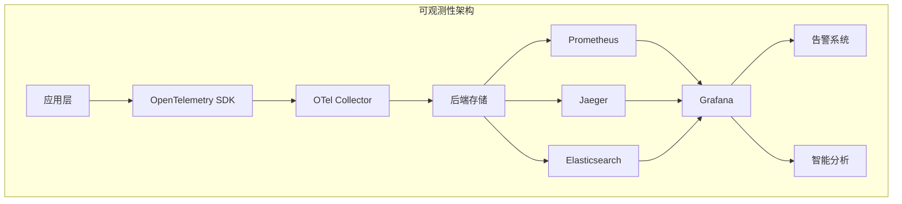
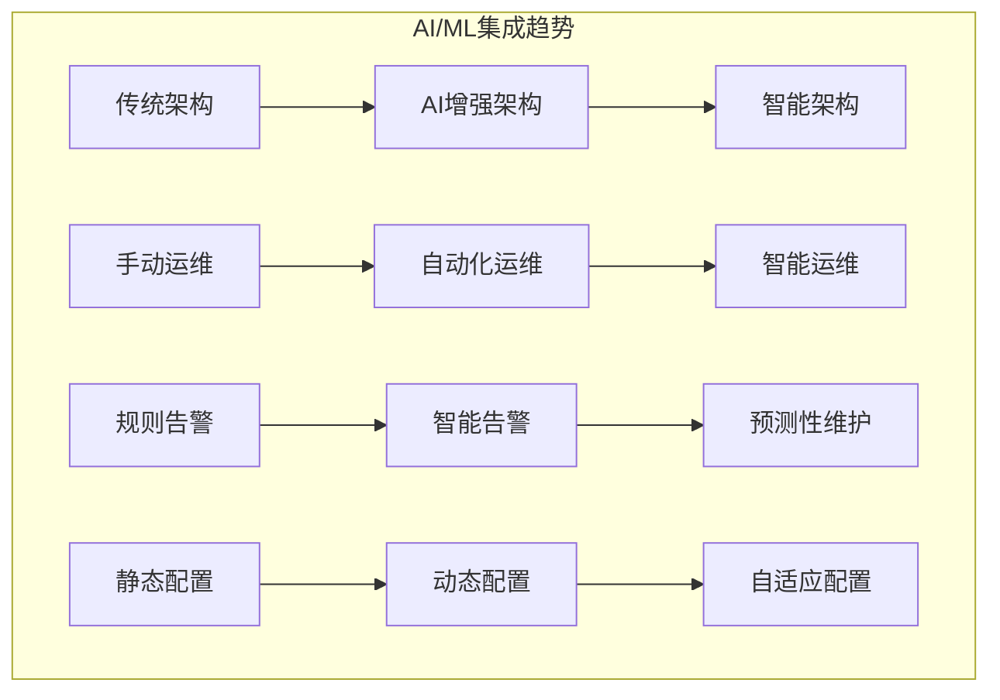
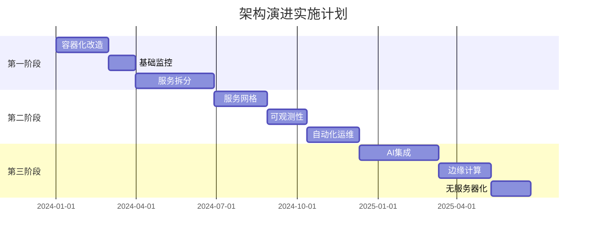

# 主流架构趋势分析与未来发展预测

## 🎯 分析目标

本文档对当前主流软件架构趋势进行深度分析，包括微服务演进、云原生发展、可观测性标准化、以及未来技术发展方向，为项目重构提供前瞻性的架构指导。

## 📊 当前主流架构趋势分析

### 1. 架构演进时间线

### 2. 主流架构模式分布

## 🏗️ 微服务架构演进分析

### 1. 微服务架构发展阶段

#### 1.1 第一代微服务（2015-2018）

**特点**：

- 简单的服务拆分
- RESTful API通信
- 单体数据库
- 基础监控

**技术栈**：

- Spring Boot/Spring Cloud
- Netflix OSS
- Docker容器化
- 基础监控（Prometheus + Grafana）

#### 1.2 第二代微服务（2018-2021）

**特点**：

- 服务网格引入
- 事件驱动架构
- 分布式数据管理
- 可观测性增强

**技术栈**：

- Istio/Linkerd服务网格
- Kafka/RabbitMQ消息队列
- 分布式追踪（Jaeger/Zipkin）
- 配置中心（Consul/Apollo）

#### 1.3 第三代微服务（2021-2024）

**特点**：

- 云原生设计
- 可观测性标准化
- 自动化运维
- 安全优先

**技术栈**：

- Kubernetes + Istio
- OpenTelemetry标准化
- GitOps部署
- 零信任安全

### 2. 微服务架构挑战与解决方案

#### 2.1 主要挑战

| 挑战 | 影响程度 | 解决方案 | 成熟度 |
|------|----------|----------|--------|
| **服务治理** | 高 | 服务网格 | ⭐⭐⭐⭐⭐ |
| **数据一致性** | 高 | Saga模式/事件溯源 | ⭐⭐⭐⭐ |
| **分布式追踪** | 中 | OpenTelemetry | ⭐⭐⭐⭐⭐ |
| **配置管理** | 中 | 配置中心 | ⭐⭐⭐⭐ |
| **服务发现** | 中 | 服务注册中心 | ⭐⭐⭐⭐⭐ |
| **熔断降级** | 中 | 熔断器模式 | ⭐⭐⭐⭐ |

#### 2.2 架构模式演进

## ☁️ 云原生架构发展趋势

### 1. 云原生技术栈演进

#### 1.1 容器技术演进

| 技术 | 成熟度 | 采用率 | 未来趋势 | 推荐指数 |
|------|--------|--------|----------|----------|
| **Docker** | ⭐⭐⭐⭐⭐ | 95% | 标准化 | ⭐⭐⭐⭐⭐ |
| **Kubernetes** | ⭐⭐⭐⭐⭐ | 85% | 平台化 | ⭐⭐⭐⭐⭐ |
| **Podman** | ⭐⭐⭐⭐ | 15% | 无守护进程 | ⭐⭐⭐⭐ |
| **Buildah** | ⭐⭐⭐ | 10% | 构建优化 | ⭐⭐⭐ |
| **Skopeo** | ⭐⭐⭐ | 5% | 镜像管理 | ⭐⭐⭐ |

#### 1.2 服务网格演进

| 技术 | 成熟度 | 采用率 | 未来趋势 | 推荐指数 |
|------|--------|--------|----------|----------|
| **Istio** | ⭐⭐⭐⭐⭐ | 60% | 标准化 | ⭐⭐⭐⭐⭐ |
| **Linkerd** | ⭐⭐⭐⭐ | 20% | 轻量化 | ⭐⭐⭐⭐ |
| **Consul Connect** | ⭐⭐⭐⭐ | 15% | 集成化 | ⭐⭐⭐⭐ |
| **Kuma** | ⭐⭐⭐ | 5% | 多平台 | ⭐⭐⭐ |

### 2. 云原生架构模式

#### 2.1 主流架构模式

#### 2.2 架构模式对比

| 模式 | 成熟度 | 复杂度 | 适用场景 | 未来趋势 |
|------|--------|--------|----------|----------|
| **容器化** | ⭐⭐⭐⭐⭐ | ⭐⭐ | 所有应用 | 标准化 |
| **微服务** | ⭐⭐⭐⭐⭐ | ⭐⭐⭐⭐ | 大型应用 | 智能化 |
| **服务网格** | ⭐⭐⭐⭐ | ⭐⭐⭐⭐ | 复杂网络 | 轻量化 |
| **无服务器** | ⭐⭐⭐ | ⭐⭐ | 事件驱动 | 增长 |
| **边缘计算** | ⭐⭐ | ⭐⭐⭐⭐ | IoT场景 | 快速发展 |

## 📊 可观测性架构演进

### 1. 可观测性发展阶段

#### 1.1 第一代：基础监控（2010-2015）

**特点**：

- 系统级监控
- 基础指标收集
- 简单告警

**技术栈**：

- Nagios/Zabbix
- 基础日志收集
- 简单图表展示

#### 1.2 第二代：应用监控（2015-2020）

**特点**：

- 应用级监控
- 分布式追踪
- 日志聚合

**技术栈**：

- APM工具（New Relic/Datadog）
- ELK Stack
- Jaeger/Zipkin

#### 1.3 第三代：可观测性（2020-2024）

**特点**：

- 标准化遥测
- 全链路追踪
- 智能分析

**技术栈**：

- OpenTelemetry
- Prometheus + Grafana
- 机器学习分析

### 2. 可观测性技术趋势

#### 2.1 技术栈对比

| 技术 | 成熟度 | 标准化 | 生态 | 未来趋势 | 推荐指数 |
|------|--------|--------|------|----------|----------|
| **OpenTelemetry** | ⭐⭐⭐⭐⭐ | ⭐⭐⭐⭐⭐ | ⭐⭐⭐⭐⭐ | 标准化 | ⭐⭐⭐⭐⭐ |
| **Prometheus** | ⭐⭐⭐⭐⭐ | ⭐⭐⭐⭐ | ⭐⭐⭐⭐⭐ | 云原生 | ⭐⭐⭐⭐⭐ |
| **Jaeger** | ⭐⭐⭐⭐⭐ | ⭐⭐⭐⭐ | ⭐⭐⭐⭐ | 轻量化 | ⭐⭐⭐⭐⭐ |
| **Grafana** | ⭐⭐⭐⭐⭐ | ⭐⭐⭐⭐ | ⭐⭐⭐⭐⭐ | 智能化 | ⭐⭐⭐⭐⭐ |
| **ELK Stack** | ⭐⭐⭐⭐ | ⭐⭐⭐ | ⭐⭐⭐⭐ | 云化 | ⭐⭐⭐⭐ |

#### 2.2 可观测性架构模式

## 🚀 未来技术发展趋势

### 1. 新兴架构模式

#### 1.1 边缘计算架构

**特点**：

- 分布式计算
- 低延迟处理
- 本地化存储

**技术栈**：

- KubeEdge
- OpenYurt
- EdgeX Foundry

**应用场景**：

- IoT设备管理
- 实时数据处理
- 本地化服务

#### 1.2 无服务器架构

**特点**：

- 事件驱动
- 自动扩缩容
- 按需付费

**技术栈**：

- AWS Lambda
- Azure Functions
- Google Cloud Functions
- Knative

**应用场景**：

- 数据处理管道
- API网关
- 定时任务

#### 1.3 量子计算架构

**特点**：

- 量子优势
- 并行计算
- 密码学应用

**技术栈**：

- IBM Qiskit
- Google Cirq
- Microsoft Q#

**应用场景**：

- 密码学
- 优化问题
- 机器学习

### 2. 技术融合趋势

#### 2.1 AI/ML集成

#### 2.2 安全架构演进

| 安全模式 | 当前状态 | 未来趋势 | 技术栈 |
|----------|----------|----------|--------|
| **网络安全** | 成熟 | 零信任 | Istio Security |
| **身份认证** | 成熟 | 无密码 | OAuth 2.1/OIDC |
| **数据加密** | 成熟 | 同态加密 | 量子加密 |
| **威胁检测** | 发展中 | AI驱动 | 机器学习 |

## 🎯 架构选型建议

### 1. 短期规划（1-2年）

**推荐架构**：云原生微服务架构

**技术栈**：

- Kubernetes + Istio
- OpenTelemetry + Prometheus + Jaeger
- GitOps部署
- 零信任安全

**实施重点**：

- 容器化改造
- 可观测性建设
- 自动化运维
- 安全加固

### 2. 中期规划（3-5年）

**推荐架构**：智能微服务架构

**技术栈**：

- AI驱动的运维
- 边缘计算集成
- 无服务器组件
- 量子安全

**实施重点**：

- AI/ML集成
- 边缘节点部署
- 无服务器化
- 量子安全准备

### 3. 长期规划（5-10年）

**推荐架构**：自适应智能架构

**技术栈**：

- 量子计算集成
- 全自动运维
- 预测性架构
- 自愈系统

**实施重点**：

- 量子计算应用
- 完全自动化
- 预测性维护
- 自愈能力

## 📊 技术选型决策矩阵

### 1. 架构模式选择

| 架构模式 | 技术成熟度 | 团队能力要求 | 运维复杂度 | 成本效益 | 未来扩展性 | 综合评分 |
|----------|------------|--------------|------------|----------|------------|----------|
| **单体架构** | ⭐⭐⭐⭐⭐ | ⭐⭐⭐⭐⭐ | ⭐⭐⭐⭐⭐ | ⭐⭐⭐⭐⭐ | ⭐⭐ | 4.2/5 |
| **微服务架构** | ⭐⭐⭐⭐⭐ | ⭐⭐⭐ | ⭐⭐ | ⭐⭐⭐ | ⭐⭐⭐⭐⭐ | 3.6/5 |
| **云原生架构** | ⭐⭐⭐⭐ | ⭐⭐ | ⭐⭐ | ⭐⭐⭐ | ⭐⭐⭐⭐⭐ | 3.4/5 |
| **无服务器架构** | ⭐⭐⭐ | ⭐⭐⭐ | ⭐⭐⭐⭐⭐ | ⭐⭐⭐⭐⭐ | ⭐⭐⭐⭐ | 3.8/5 |

### 2. 技术栈选择

| 技术领域 | 推荐技术 | 成熟度 | 生态 | 未来趋势 | 综合评分 |
|----------|----------|--------|------|----------|----------|
| **容器化** | Kubernetes | ⭐⭐⭐⭐⭐ | ⭐⭐⭐⭐⭐ | ⭐⭐⭐⭐⭐ | 5.0/5 |
| **服务网格** | Istio | ⭐⭐⭐⭐⭐ | ⭐⭐⭐⭐⭐ | ⭐⭐⭐⭐ | 4.8/5 |
| **可观测性** | OpenTelemetry | ⭐⭐⭐⭐⭐ | ⭐⭐⭐⭐⭐ | ⭐⭐⭐⭐⭐ | 5.0/5 |
| **API网关** | Kong | ⭐⭐⭐⭐⭐ | ⭐⭐⭐⭐ | ⭐⭐⭐⭐ | 4.6/5 |
| **消息队列** | Kafka | ⭐⭐⭐⭐⭐ | ⭐⭐⭐⭐⭐ | ⭐⭐⭐⭐ | 4.8/5 |

## 🚦 实施建议

### 1. 渐进式演进策略

### 2. 风险控制策略

| 风险类型 | 风险等级 | 缓解措施 | 监控指标 |
|----------|----------|----------|----------|
| **技术风险** | 中 | 技术预研、POC验证 | 技术成熟度评估 |
| **团队风险** | 高 | 培训计划、外部支持 | 团队技能评估 |
| **成本风险** | 中 | 分阶段实施、ROI评估 | 成本效益分析 |
| **安全风险** | 高 | 安全设计、定期审计 | 安全扫描结果 |

---

*本分析基于当前技术发展趋势和行业最佳实践，为项目架构演进提供前瞻性指导。建议根据实际情况调整实施策略和优先级。*
