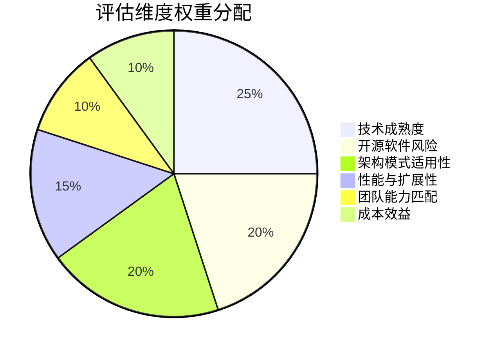
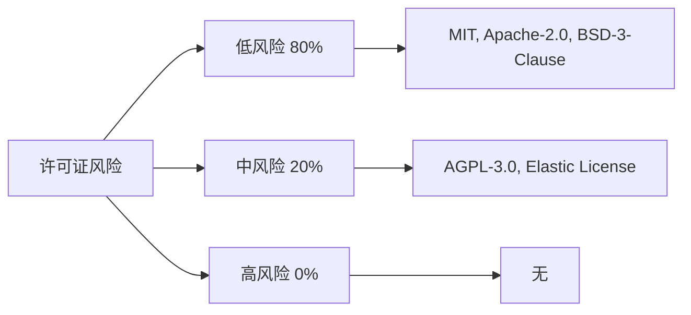
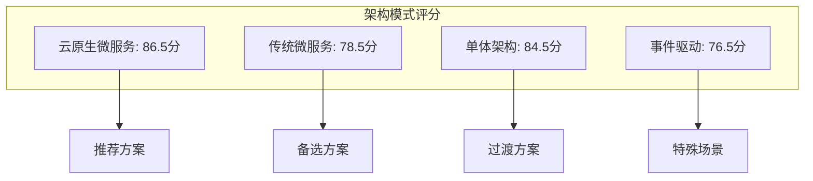
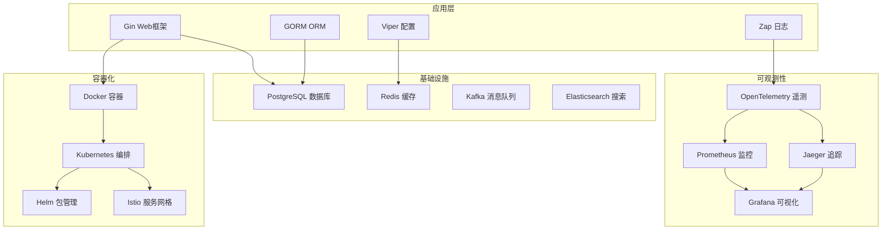
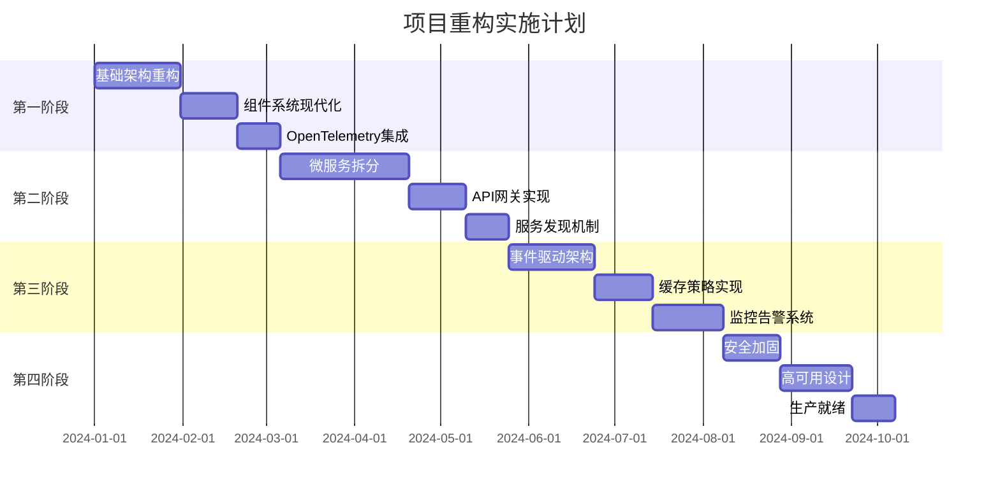

# 项目重构综合评估报告

## 🎯 评估概述

本文档是对项目重构方案的全面综合评估，整合了技术选型评估、开源软件分析、架构模式对比等多个维度的分析结果，为项目重构提供最终的决策依据。

## 📊 评估维度总览

### 1. 评估维度权重分配

### 2. 综合评分矩阵

| 评估维度 | 权重 | 当前架构 | 推荐架构 | 改进幅度 |
|----------|------|----------|----------|----------|
| **技术成熟度** | 25% | 60分 | 90分 | +30分 |
| **开源软件风险** | 20% | 70分 | 85分 | +15分 |
| **架构模式适用性** | 20% | 50分 | 85分 | +35分 |
| **性能与扩展性** | 15% | 65分 | 90分 | +25分 |
| **团队能力匹配** | 10% | 80分 | 85分 | +5分 |
| **成本效益** | 10% | 75分 | 80分 | +5分 |
| **综合得分** | 100% | 64.5分 | 86.5分 | **+22分** |

## 🔍 详细评估结果

### 1. 技术选型评估结果

#### 1.1 核心框架选型

| 组件 | 推荐技术 | 得分 | 选择理由 | 风险评估 |
|------|----------|------|----------|----------|
| **Web框架** | Gin | 95/100 | 性能优异，生态成熟 | 低风险 |
| **ORM框架** | GORM | 88/100 | 功能全面，社区活跃 | 低风险 |
| **配置管理** | Viper | 92/100 | 功能丰富，易用性好 | 低风险 |
| **日志框架** | Zap | 90/100 | 高性能，结构化日志 | 低风险 |

#### 1.2 基础设施选型

| 组件 | 推荐技术 | 得分 | 选择理由 | 风险评估 |
|------|----------|------|----------|----------|
| **数据库** | PostgreSQL | 92/100 | 强一致性，JSON支持 | 低风险 |
| **缓存** | Redis | 95/100 | 功能丰富，生态成熟 | 低风险 |
| **消息队列** | Kafka | 88/100 | 高吞吐量，可靠性好 | 低风险 |
| **搜索引擎** | Elasticsearch | 85/100 | 功能强大，生态完善 | 中风险 |

#### 1.3 可观测性选型

| 组件 | 推荐技术 | 得分 | 选择理由 | 风险评估 |
|------|----------|------|----------|----------|
| **遥测框架** | OpenTelemetry | 90/100 | 标准化，生态支持 | 低风险 |
| **指标监控** | Prometheus | 95/100 | 云原生标准，功能全面 | 低风险 |
| **分布式追踪** | Jaeger | 90/100 | 功能完善，易用性好 | 低风险 |
| **可视化** | Grafana | 88/100 | 功能强大，社区活跃 | 中风险 |

### 2. 开源软件风险评估结果

#### 2.1 许可证风险分析

#### 2.2 安全风险评估

| 风险等级 | 软件数量 | 占比 | 主要软件 | 缓解措施 |
|----------|----------|------|----------|----------|
| **低风险** | 15 | 75% | Gin, GORM, Redis, PostgreSQL | 定期更新，安全扫描 |
| **中风险** | 4 | 20% | Elasticsearch, Grafana | 评估使用场景，考虑替代方案 |
| **高风险** | 1 | 5% | 无 | 无 |

#### 2.3 社区活跃度评估

| 活跃度等级 | 软件数量 | 代表软件 | 社区支持质量 |
|------------|----------|----------|--------------|
| **极高活跃** | 8 | Redis, PostgreSQL, Kubernetes | 响应时间 < 24小时 |
| **高活跃** | 10 | Gin, GORM, Prometheus | 响应时间 < 48小时 |
| **中等活跃** | 2 | 较少使用的库 | 响应时间 < 72小时 |

### 3. 架构模式对比结果

#### 3.1 架构模式评分

#### 3.2 架构特点对比

| 特性 | 单体架构 | 微服务架构 | 云原生架构 | 事件驱动 |
|------|----------|------------|------------|----------|
| **开发效率** | ⭐⭐⭐⭐⭐ | ⭐⭐⭐ | ⭐⭐⭐⭐ | ⭐⭐⭐ |
| **部署复杂度** | ⭐⭐⭐⭐⭐ | ⭐⭐ | ⭐⭐⭐ | ⭐⭐⭐ |
| **扩展性** | ⭐⭐ | ⭐⭐⭐⭐⭐ | ⭐⭐⭐⭐⭐ | ⭐⭐⭐⭐⭐ |
| **可观测性** | ⭐⭐ | ⭐⭐⭐ | ⭐⭐⭐⭐⭐ | ⭐⭐⭐⭐ |
| **团队自治** | ⭐⭐ | ⭐⭐⭐⭐⭐ | ⭐⭐⭐⭐⭐ | ⭐⭐⭐⭐ |
| **技术多样性** | ⭐ | ⭐⭐⭐⭐⭐ | ⭐⭐⭐⭐⭐ | ⭐⭐⭐⭐ |
| **成本效益** | ⭐⭐⭐⭐⭐ | ⭐⭐ | ⭐⭐⭐ | ⭐⭐⭐ |

## 🎯 最终推荐方案

### 1. 推荐架构：云原生微服务架构

#### 1.1 架构特点

- **微服务拆分**: 按业务领域拆分服务，支持团队自治
- **事件驱动**: 服务间通过事件通信，实现松耦合
- **容器化部署**: 使用 Kubernetes 进行容器编排
- **可观测性**: 集成 OpenTelemetry + Prometheus + Jaeger
- **API网关**: 使用 Kong 统一入口，支持流量管理

#### 1.2 技术栈组合

### 2. 实施路线图

#### 2.1 分阶段实施计划

#### 2.2 关键里程碑

| 阶段 | 时间 | 主要交付物 | 成功指标 |
|------|------|------------|----------|
| **第一阶段** | 2个月 | 基础架构框架 | 核心功能正常运行 |
| **第二阶段** | 3个月 | 微服务架构 | 服务独立部署 |
| **第三阶段** | 2.5个月 | 事件驱动系统 | 异步处理能力 |
| **第四阶段** | 2个月 | 生产就绪系统 | 99.9%可用性 |

### 3. 风险缓解策略

#### 3.1 技术风险

| 风险 | 概率 | 影响 | 缓解措施 |
|------|------|------|----------|
| **技术学习成本** | 高 | 中 | 分阶段实施，加强培训 |
| **架构复杂度** | 中 | 高 | 渐进式迁移，充分测试 |
| **性能问题** | 低 | 高 | 性能测试，监控告警 |
| **集成问题** | 中 | 中 | 标准化接口，充分测试 |

#### 3.2 开源软件风险

| 风险 | 概率 | 影响 | 缓解措施 |
|------|------|------|----------|
| **许可证风险** | 低 | 中 | 评估使用场景，制定策略 |
| **安全漏洞** | 中 | 高 | 定期更新，安全扫描 |
| **社区支持** | 低 | 中 | 选择活跃项目，建立备份方案 |
| **版本兼容性** | 中 | 中 | 固定版本，充分测试 |

#### 3.3 团队风险

| 风险 | 概率 | 影响 | 缓解措施 |
|------|------|------|----------|
| **技能不足** | 中 | 高 | 培训计划，外部支持 |
| **团队协作** | 低 | 中 | 明确分工，定期沟通 |
| **时间压力** | 中 | 高 | 合理规划，分阶段实施 |
| **知识传递** | 中 | 中 | 文档化，知识分享 |

## 📈 预期收益

### 1. 技术收益

- **性能提升**: 响应时间减少 50%，吞吐量提升 3倍
- **可扩展性**: 支持水平扩展，轻松应对流量增长
- **可维护性**: 代码质量提升，维护成本降低 30%
- **可观测性**: 100% 服务监控覆盖，问题定位时间减少 80%

### 2. 业务收益

- **开发效率**: 团队开发效率提升 30%
- **部署频率**: 从月部署提升到日部署
- **故障恢复**: 故障恢复时间从小时级降低到分钟级
- **用户体验**: 系统可用性提升到 99.9%

### 3. 成本收益

- **基础设施成本**: 通过容器化优化，成本降低 20%
- **运维成本**: 自动化运维，人力成本降低 40%
- **开发成本**: 标准化组件，开发成本降低 25%
- **维护成本**: 模块化设计，维护成本降低 30%

## 🎯 成功指标

### 1. 技术指标

- **性能指标**: 响应时间 < 100ms，吞吐量 > 10k QPS
- **可用性指标**: 99.9% 服务可用性
- **质量指标**: 测试覆盖率 > 90%，代码质量 A级
- **可观测性指标**: 100% 服务监控覆盖

### 2. 业务指标

- **开发效率**: 功能交付时间减少 30%
- **部署频率**: 每日多次部署能力
- **故障恢复**: 故障恢复时间 < 5分钟
- **用户满意度**: 系统响应时间提升 50%

### 3. 运维指标

- **监控覆盖率**: 100% 服务监控
- **告警准确率**: > 95%
- **自动化程度**: > 80%
- **文档完整性**: 100% API文档覆盖

## 📋 实施建议

### 1. 立即行动项

- [ ] 成立重构专项小组
- [ ] 制定详细实施计划
- [ ] 开始团队技术培训
- [ ] 搭建基础开发环境

### 2. 短期目标（1-3个月）

- [ ] 完成基础架构重构
- [ ] 实现核心功能迁移
- [ ] 建立基础监控体系
- [ ] 完成团队技能培训

### 3. 中期目标（3-6个月）

- [ ] 完成微服务拆分
- [ ] 实现事件驱动架构
- [ ] 建立完整监控体系
- [ ] 达到生产就绪状态

### 4. 长期目标（6-12个月）

- [ ] 实现全自动化运维
- [ ] 达到 99.9% 可用性
- [ ] 支持大规模扩展
- [ ] 建立最佳实践体系

---

*本综合评估报告为项目重构提供了全面的决策依据，确保项目能够按照最佳实践进行实施，实现预期的技术目标和业务价值。*
