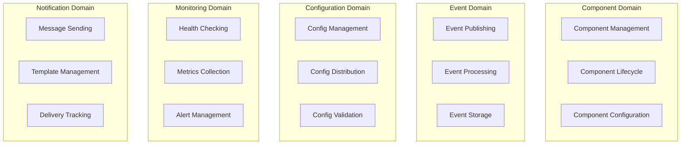
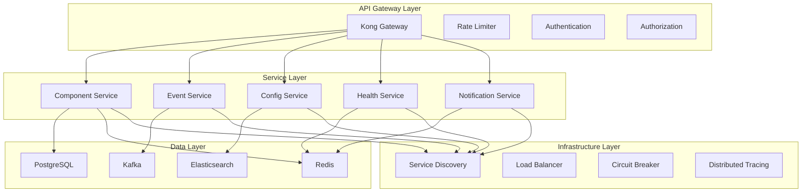
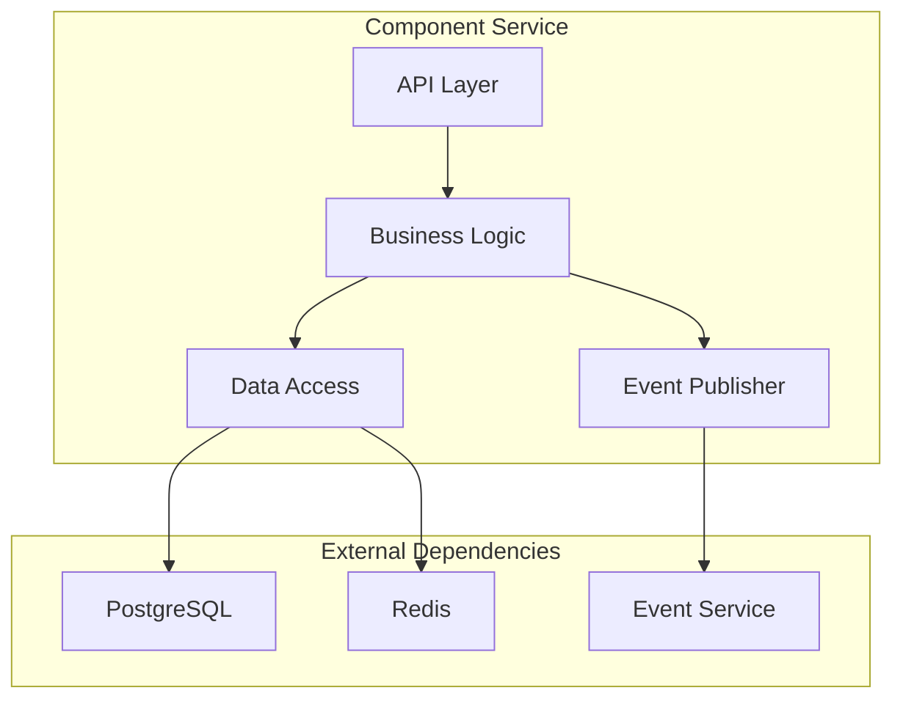
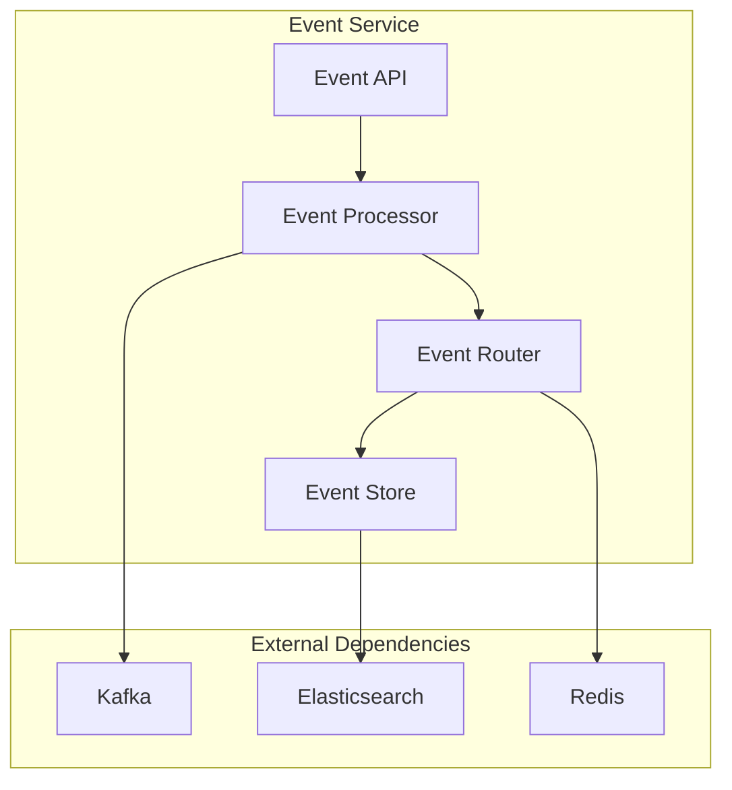
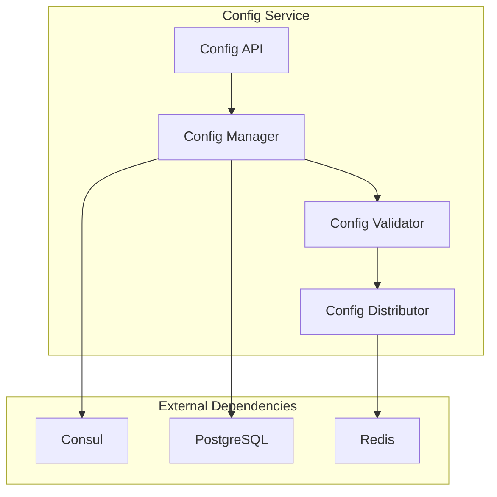
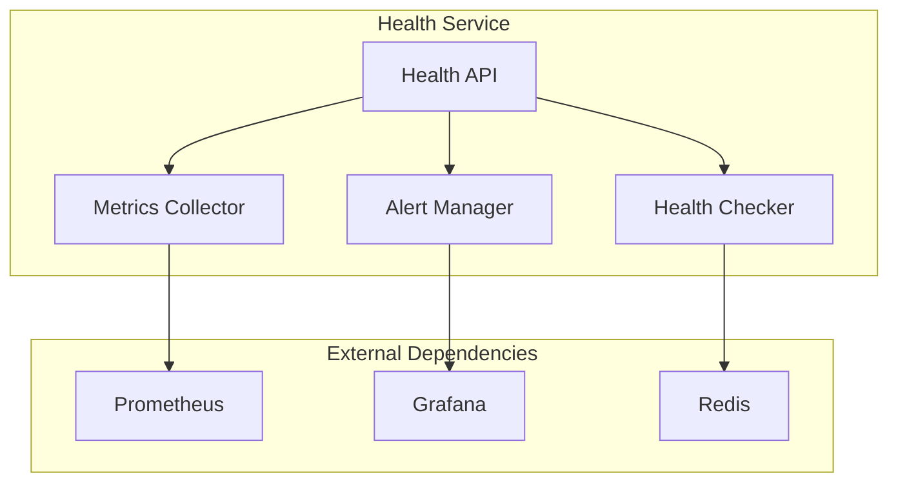
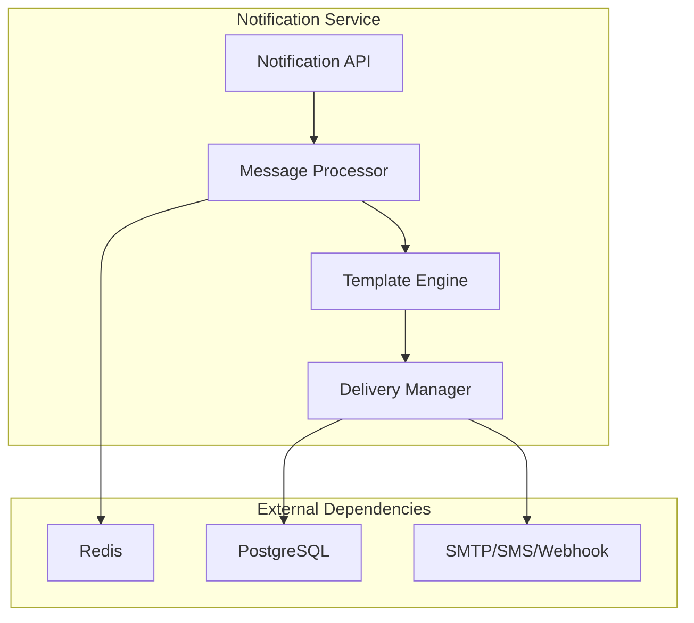
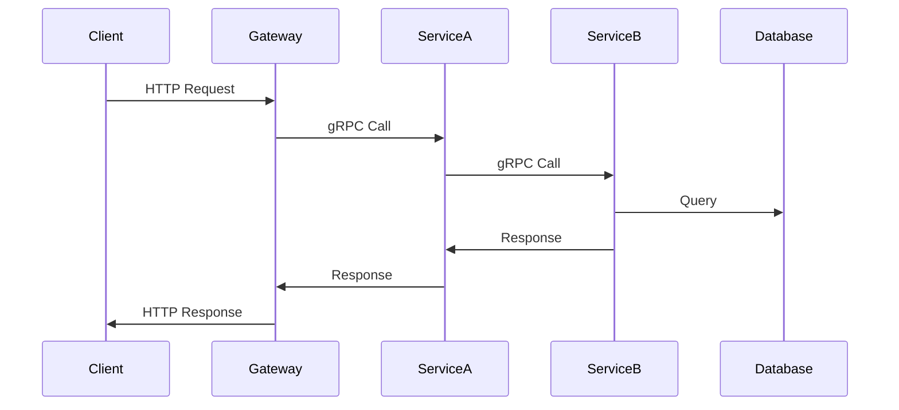
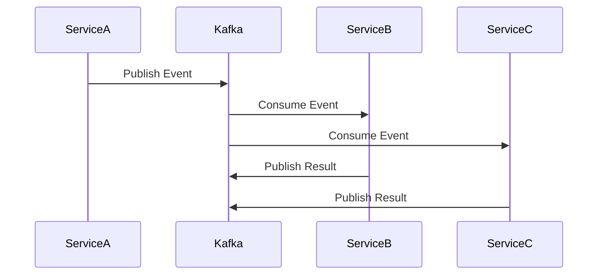

# 微服务架构设计

## 🎯 微服务设计目标

### 1. 核心目标

- **服务自治**: 每个服务独立开发、部署、扩展
- **技术多样性**: 不同服务可选择最适合的技术栈
- **故障隔离**: 单个服务故障不影响整体系统
- **团队自治**: 不同团队可独立负责不同服务

### 2. 设计原则

- **单一职责**: 每个服务只负责一个业务领域
- **松耦合**: 服务间通过标准接口通信
- **高内聚**: 服务内部功能紧密相关
- **可独立部署**: 服务可独立发布和回滚

## 🏗️ 服务拆分策略

### 1. 领域驱动设计 (DDD)

#### 1.1 领域划分



#### 1.2 服务边界定义

| 服务名称 | 领域 | 职责 | 数据所有权 |
|---------|------|------|-----------|
| Component Service | Component Domain | 组件生命周期管理 | Component Data |
| Event Service | Event Domain | 事件处理和分发 | Event Data |
| Config Service | Configuration Domain | 配置管理 | Config Data |
| Health Service | Monitoring Domain | 健康检查和监控 | Health Data |
| Notification Service | Notification Domain | 通知和告警 | Notification Data |

### 2. 服务拆分标准

#### 2.1 业务能力拆分

- **按业务功能**: 每个服务对应一个业务能力
- **按数据边界**: 服务拥有自己的数据
- **按团队边界**: 服务对应团队职责

#### 2.2 技术考虑

- **性能要求**: 高频访问的服务独立部署
- **扩展需求**: 不同扩展模式的服务分离
- **技术栈**: 不同技术需求的服务分离

## 🏛️ 微服务架构

### 1. 整体架构图



### 2. 服务详细设计

#### 2.1 Component Service



**职责**:

- 组件注册和注销
- 组件生命周期管理
- 组件状态监控
- 组件配置管理

**API接口**:

```protobuf
service ComponentService {
    rpc CreateComponent(CreateComponentRequest) returns (CreateComponentResponse);
    rpc GetComponent(GetComponentRequest) returns (GetComponentResponse);
    rpc UpdateComponent(UpdateComponentRequest) returns (UpdateComponentResponse);
    rpc DeleteComponent(DeleteComponentRequest) returns (DeleteComponentResponse);
    rpc ListComponents(ListComponentsRequest) returns (ListComponentsResponse);
    rpc StartComponent(StartComponentRequest) returns (StartComponentResponse);
    rpc StopComponent(StopComponentRequest) returns (StopComponentResponse);
}
```

#### 2.2 Event Service



**职责**:

- 事件发布和订阅
- 事件路由和分发
- 事件存储和检索
- 事件重放和回放

**API接口**:

```protobuf
service EventService {
    rpc PublishEvent(PublishEventRequest) returns (PublishEventResponse);
    rpc SubscribeEvents(SubscribeEventsRequest) returns (stream Event);
    rpc GetEvents(GetEventsRequest) returns (GetEventsResponse);
    rpc ReplayEvents(ReplayEventsRequest) returns (ReplayEventsResponse);
}
```

#### 2.3 Config Service



**职责**:

- 配置创建和更新
- 配置验证和分发
- 配置版本管理
- 配置回滚

**API接口**:

```protobuf
service ConfigService {
    rpc CreateConfig(CreateConfigRequest) returns (CreateConfigResponse);
    rpc GetConfig(GetConfigRequest) returns (GetConfigResponse);
    rpc UpdateConfig(UpdateConfigRequest) returns (UpdateConfigResponse);
    rpc DeleteConfig(DeleteConfigRequest) returns (DeleteConfigResponse);
    rpc ListConfigs(ListConfigsRequest) returns (ListConfigsResponse);
    rpc RollbackConfig(RollbackConfigRequest) returns (RollbackConfigResponse);
}
```

#### 2.4 Health Service



**职责**:

- 服务健康检查
- 指标收集和聚合
- 告警规则管理
- 告警通知

**API接口**:

```protobuf
service HealthService {
    rpc CheckHealth(CheckHealthRequest) returns (CheckHealthResponse);
    rpc GetMetrics(GetMetricsRequest) returns (GetMetricsResponse);
    rpc SetAlertRule(SetAlertRuleRequest) returns (SetAlertRuleResponse);
    rpc GetAlertRules(GetAlertRulesRequest) returns (GetAlertRulesResponse);
}
```

#### 2.5 Notification Service



**职责**:

- 消息模板管理
- 消息发送和跟踪
- 多渠道支持
- 发送历史记录

**API接口**:

```protobuf
service NotificationService {
    rpc SendNotification(SendNotificationRequest) returns (SendNotificationResponse);
    rpc GetNotificationStatus(GetNotificationStatusRequest) returns (GetNotificationStatusResponse);
    rpc CreateTemplate(CreateTemplateRequest) returns (CreateTemplateResponse);
    rpc ListTemplates(ListTemplatesRequest) returns (ListTemplatesResponse);
}
```

## 🔄 服务通信

### 1. 通信模式

#### 1.1 同步通信 (gRPC)



#### 1.2 异步通信 (Kafka)



### 2. 服务发现

#### 2.1 服务注册

```go
// 服务注册示例
type ServiceRegistry struct {
    consulClient *consul.Client
    logger       *zap.Logger
}

func (sr *ServiceRegistry) Register(service *ServiceInfo) error {
    registration := &consul.AgentServiceRegistration{
        ID:      service.ID,
        Name:    service.Name,
        Port:    service.Port,
        Address: service.Address,
        Check: &consul.AgentServiceCheck{
            HTTP:                           fmt.Sprintf("http://%s:%d/health", service.Address, service.Port),
            Interval:                       "10s",
            Timeout:                        "5s",
            DeregisterCriticalServiceAfter: "30s",
        },
    }
    
    return sr.consulClient.Agent().ServiceRegister(registration)
}
```

#### 2.2 服务发现

```go
// 服务发现示例
type ServiceDiscovery struct {
    consulClient *consul.Client
    logger       *zap.Logger
}

func (sd *ServiceDiscovery) Discover(serviceName string) ([]*ServiceInstance, error) {
    services, _, err := sd.consulClient.Health().Service(serviceName, "", true, nil)
    if err != nil {
        return nil, fmt.Errorf("failed to discover service %s: %w", serviceName, err)
    }
    
    instances := make([]*ServiceInstance, 0, len(services))
    for _, service := range services {
        instances = append(instances, &ServiceInstance{
            ID:      service.Service.ID,
            Name:    service.Service.Service,
            Address: service.Service.Address,
            Port:    service.Service.Port,
            Status:  service.Checks.AggregatedStatus(),
        })
    }
    
    return instances, nil
}
```

### 3. 负载均衡

#### 3.1 客户端负载均衡

```go
// 客户端负载均衡器
type ClientLoadBalancer struct {
    discovery *ServiceDiscovery
    strategy  LoadBalanceStrategy
    logger    *zap.Logger
}

type LoadBalanceStrategy interface {
    Select(instances []*ServiceInstance) *ServiceInstance
}

// 轮询策略
type RoundRobinStrategy struct {
    counter int64
}

func (rr *RoundRobinStrategy) Select(instances []*ServiceInstance) *ServiceInstance {
    if len(instances) == 0 {
        return nil
    }
    
    index := atomic.AddInt64(&rr.counter, 1) % int64(len(instances))
    return instances[index]
}

// 随机策略
type RandomStrategy struct{}

func (rs *RandomStrategy) Select(instances []*ServiceInstance) *ServiceInstance {
    if len(instances) == 0 {
        return nil
    }
    
    index := rand.Intn(len(instances))
    return instances[index]
}
```

## 🛡️ 容错机制

### 1. 熔断器模式

```go
// 熔断器实现
type CircuitBreaker struct {
    name           string
    failureThreshold int64
    timeout        time.Duration
    state          CircuitBreakerState
    failureCount   int64
    lastFailureTime time.Time
    mu             sync.RWMutex
    logger         *zap.Logger
}

type CircuitBreakerState int

const (
    StateClosed CircuitBreakerState = iota
    StateOpen
    StateHalfOpen
)

func (cb *CircuitBreaker) Execute(command func() error) error {
    if !cb.canExecute() {
        return ErrCircuitBreakerOpen
    }
    
    err := command()
    cb.recordResult(err)
    return err
}

func (cb *CircuitBreaker) canExecute() bool {
    cb.mu.RLock()
    defer cb.mu.RUnlock()
    
    switch cb.state {
    case StateClosed:
        return true
    case StateOpen:
        if time.Since(cb.lastFailureTime) > cb.timeout {
            cb.state = StateHalfOpen
            return true
        }
        return false
    case StateHalfOpen:
        return true
    default:
        return false
    }
}
```

### 2. 重试机制

```go
// 重试器实现
type Retrier struct {
    maxAttempts int
    backoff     BackoffStrategy
    logger      *zap.Logger
}

type BackoffStrategy interface {
    GetDelay(attempt int) time.Duration
}

// 指数退避策略
type ExponentialBackoff struct {
    initialDelay time.Duration
    maxDelay     time.Duration
    multiplier   float64
}

func (eb *ExponentialBackoff) GetDelay(attempt int) time.Duration {
    delay := time.Duration(float64(eb.initialDelay) * math.Pow(eb.multiplier, float64(attempt-1)))
    if delay > eb.maxDelay {
        delay = eb.maxDelay
    }
    return delay
}

func (r *Retrier) Execute(operation func() error) error {
    var lastErr error
    
    for attempt := 1; attempt <= r.maxAttempts; attempt++ {
        if err := operation(); err == nil {
            return nil
        } else {
            lastErr = err
            if attempt < r.maxAttempts {
                delay := r.backoff.GetDelay(attempt)
                r.logger.Warn("operation failed, retrying",
                    zap.Int("attempt", attempt),
                    zap.Duration("delay", delay),
                    zap.Error(err))
                time.Sleep(delay)
            }
        }
    }
    
    return fmt.Errorf("operation failed after %d attempts: %w", r.maxAttempts, lastErr)
}
```

## 📊 监控和可观测性

### 1. 服务监控

#### 1.1 健康检查

```go
// 健康检查接口
type HealthChecker interface {
    Check() HealthStatus
}

type HealthStatus struct {
    Status    string                 `json:"status"`
    Timestamp time.Time              `json:"timestamp"`
    Details   map[string]interface{} `json:"details,omitempty"`
}

// 数据库健康检查
type DatabaseHealthChecker struct {
    db     *sql.DB
    logger *zap.Logger
}

func (dhc *DatabaseHealthChecker) Check() HealthStatus {
    ctx, cancel := context.WithTimeout(context.Background(), 5*time.Second)
    defer cancel()
    
    if err := dhc.db.PingContext(ctx); err != nil {
        dhc.logger.Error("database health check failed", zap.Error(err))
        return HealthStatus{
            Status:    "unhealthy",
            Timestamp: time.Now(),
            Details: map[string]interface{}{
                "error": err.Error(),
            },
        }
    }
    
    return HealthStatus{
        Status:    "healthy",
        Timestamp: time.Now(),
    }
}
```

#### 1.2 指标收集

```go
// 指标收集器
type MetricsCollector struct {
    registry prometheus.Registry
    logger   *zap.Logger
}

// HTTP请求计数器
var httpRequestsTotal = prometheus.NewCounterVec(
    prometheus.CounterOpts{
        Name: "http_requests_total",
        Help: "Total number of HTTP requests",
    },
    []string{"method", "endpoint", "status"},
)

// 响应时间直方图
var httpRequestDuration = prometheus.NewHistogramVec(
    prometheus.HistogramOpts{
        Name:    "http_request_duration_seconds",
        Help:    "HTTP request duration in seconds",
        Buckets: prometheus.DefBuckets,
    },
    []string{"method", "endpoint"},
)

func (mc *MetricsCollector) RecordHTTPRequest(method, endpoint string, status int, duration time.Duration) {
    httpRequestsTotal.WithLabelValues(method, endpoint, strconv.Itoa(status)).Inc()
    httpRequestDuration.WithLabelValues(method, endpoint).Observe(duration.Seconds())
}
```

### 2. 分布式追踪

```go
// 追踪中间件
func TracingMiddleware(tracer trace.Tracer) gin.HandlerFunc {
    return func(c *gin.Context) {
        ctx := c.Request.Context()
        
        // 从请求头中提取追踪上下文
        ctx = otel.GetTextMapPropagator().Extract(ctx, propagation.HeaderCarrier(c.Request.Header))
        
        // 创建新的span
        spanName := fmt.Sprintf("%s %s", c.Request.Method, c.Request.URL.Path)
        ctx, span := tracer.Start(ctx, spanName)
        defer span.End()
        
        // 注入追踪上下文到请求
        c.Request = c.Request.WithContext(ctx)
        
        // 记录请求信息
        span.SetAttributes(
            attribute.String("http.method", c.Request.Method),
            attribute.String("http.url", c.Request.URL.String()),
            attribute.String("http.user_agent", c.Request.UserAgent()),
        )
        
        // 处理请求
        c.Next()
        
        // 记录响应信息
        span.SetAttributes(
            attribute.Int("http.status_code", c.Writer.Status()),
        )
        
        // 如果有错误，记录错误信息
        if len(c.Errors) > 0 {
            span.SetStatus(codes.Error, c.Errors.String())
        }
    }
}
```

## 🚀 部署策略

### 1. 容器化部署

#### 1.1 Dockerfile示例

```dockerfile
# 多阶段构建
FROM golang:1.23-alpine AS builder

WORKDIR /app

# 复制依赖文件
COPY go.mod go.sum ./
RUN go mod download

# 复制源代码
COPY . .

# 构建应用
RUN CGO_ENABLED=0 GOOS=linux go build -a -installsuffix cgo -o main ./cmd/component-service

# 运行阶段
FROM alpine:latest

RUN apk --no-cache add ca-certificates

WORKDIR /root/

# 从构建阶段复制二进制文件
COPY --from=builder /app/main .

# 暴露端口
EXPOSE 8080

# 健康检查
HEALTHCHECK --interval=30s --timeout=3s --start-period=5s --retries=3 \
    CMD curl -f http://localhost:8080/health || exit 1

# 运行应用
CMD ["./main"]
```

#### 1.2 Kubernetes部署

```yaml
# component-service-deployment.yaml
apiVersion: apps/v1
kind: Deployment
metadata:
  name: component-service
  labels:
    app: component-service
spec:
  replicas: 3
  selector:
    matchLabels:
      app: component-service
  template:
    metadata:
      labels:
        app: component-service
    spec:
      containers:
      - name: component-service
        image: component-service:latest
        ports:
        - containerPort: 8080
        env:
        - name: DATABASE_URL
          valueFrom:
            secretKeyRef:
              name: db-secret
              key: url
        - name: REDIS_URL
          valueFrom:
            configMapKeyRef:
              name: redis-config
              key: url
        resources:
          requests:
            memory: "128Mi"
            cpu: "100m"
          limits:
            memory: "256Mi"
            cpu: "200m"
        livenessProbe:
          httpGet:
            path: /health
            port: 8080
          initialDelaySeconds: 30
          periodSeconds: 10
        readinessProbe:
          httpGet:
            path: /ready
            port: 8080
          initialDelaySeconds: 5
          periodSeconds: 5
---
apiVersion: v1
kind: Service
metadata:
  name: component-service
spec:
  selector:
    app: component-service
  ports:
  - protocol: TCP
    port: 80
    targetPort: 8080
  type: ClusterIP
```

### 2. 服务网格

#### 2.1 Istio配置

```yaml
# istio-virtual-service.yaml
apiVersion: networking.istio.io/v1alpha3
kind: VirtualService
metadata:
  name: component-service
spec:
  hosts:
  - component-service
  http:
  - route:
    - destination:
        host: component-service
        subset: v1
      weight: 90
    - destination:
        host: component-service
        subset: v2
      weight: 10
---
apiVersion: networking.istio.io/v1alpha3
kind: DestinationRule
metadata:
  name: component-service
spec:
  host: component-service
  subsets:
  - name: v1
    labels:
      version: v1
  - name: v2
    labels:
      version: v2
```

## 📈 性能优化

### 1. 缓存策略

#### 1.1 多级缓存

```go
// 多级缓存实现
type MultiLevelCache struct {
    l1Cache *MemoryCache
    l2Cache *RedisCache
    logger  *zap.Logger
}

func (mlc *MultiLevelCache) Get(key string) (interface{}, error) {
    // 先查L1缓存
    if value, err := mlc.l1Cache.Get(key); err == nil {
        return value, nil
    }
    
    // L1未命中，查L2缓存
    if value, err := mlc.l2Cache.Get(key); err == nil {
        // 回填L1缓存
        mlc.l1Cache.Set(key, value, time.Minute*5)
        return value, nil
    }
    
    return nil, ErrCacheMiss
}

func (mlc *MultiLevelCache) Set(key string, value interface{}, ttl time.Duration) error {
    // 同时设置L1和L2缓存
    if err := mlc.l1Cache.Set(key, value, ttl); err != nil {
        mlc.logger.Warn("failed to set L1 cache", zap.Error(err))
    }
    
    if err := mlc.l2Cache.Set(key, value, ttl); err != nil {
        mlc.logger.Warn("failed to set L2 cache", zap.Error(err))
    }
    
    return nil
}
```

### 2. 连接池

#### 2.1 数据库连接池

```go
// 数据库连接池配置
type DatabaseConfig struct {
    Host            string
    Port            int
    Username        string
    Password        string
    Database        string
    MaxOpenConns    int
    MaxIdleConns    int
    ConnMaxLifetime time.Duration
}

func NewDatabaseConnection(config *DatabaseConfig) (*sql.DB, error) {
    dsn := fmt.Sprintf("host=%s port=%d user=%s password=%s dbname=%s sslmode=disable",
        config.Host, config.Port, config.Username, config.Password, config.Database)
    
    db, err := sql.Open("postgres", dsn)
    if err != nil {
        return nil, fmt.Errorf("failed to open database: %w", err)
    }
    
    // 配置连接池
    db.SetMaxOpenConns(config.MaxOpenConns)
    db.SetMaxIdleConns(config.MaxIdleConns)
    db.SetConnMaxLifetime(config.ConnMaxLifetime)
    
    // 验证连接
    if err := db.Ping(); err != nil {
        return nil, fmt.Errorf("failed to ping database: %w", err)
    }
    
    return db, nil
}
```

## 🔒 安全考虑

### 1. 服务间认证

#### 1.1 mTLS认证

```yaml
# istio-mtls.yaml
apiVersion: security.istio.io/v1beta1
kind: PeerAuthentication
metadata:
  name: default
  namespace: istio-system
spec:
  mtls:
    mode: STRICT
---
apiVersion: security.istio.io/v1beta1
kind: DestinationRule
metadata:
  name: default
  namespace: istio-system
spec:
  host: "*.local"
  trafficPolicy:
    tls:
      mode: ISTIO_MUTUAL
```

### 2. API安全

#### 2.1 JWT认证

```go
// JWT中间件
func JWTAuthMiddleware(secret string) gin.HandlerFunc {
    return func(c *gin.Context) {
        tokenString := c.GetHeader("Authorization")
        if tokenString == "" {
            c.JSON(http.StatusUnauthorized, gin.H{"error": "missing authorization header"})
            c.Abort()
            return
        }
        
        // 移除Bearer前缀
        if strings.HasPrefix(tokenString, "Bearer ") {
            tokenString = tokenString[7:]
        }
        
        // 验证JWT
        token, err := jwt.Parse(tokenString, func(token *jwt.Token) (interface{}, error) {
            if _, ok := token.Method.(*jwt.SigningMethodHMAC); !ok {
                return nil, fmt.Errorf("unexpected signing method: %v", token.Header["alg"])
            }
            return []byte(secret), nil
        })
        
        if err != nil || !token.Valid {
            c.JSON(http.StatusUnauthorized, gin.H{"error": "invalid token"})
            c.Abort()
            return
        }
        
        // 将用户信息存储到上下文
        if claims, ok := token.Claims.(jwt.MapClaims); ok {
            c.Set("user_id", claims["user_id"])
            c.Set("username", claims["username"])
        }
        
        c.Next()
    }
}
```

---

*本微服务架构设计基于最新的软件工程最佳实践，旨在构建一个可扩展、高性能、可观测的微服务系统。*
