# 架构概览 - 现代化软件工程架构设计

## 🎯 架构愿景

构建一个现代化、高性能、可观测、可扩展的Go语言通用库，采用最新的软件工程最佳实践，支持云原生部署和微服务架构。

## 🏗️ 架构原则

### 1. 设计原则

#### 1.1 SOLID原则

- **单一职责原则 (SRP)**: 每个组件只负责一个功能
- **开闭原则 (OCP)**: 对扩展开放，对修改关闭
- **里氏替换原则 (LSP)**: 子类可以替换父类
- **接口隔离原则 (ISP)**: 客户端不应该依赖它不需要的接口
- **依赖倒置原则 (DIP)**: 依赖抽象而不是具体实现

#### 1.2 云原生原则

- **容器化**: 所有服务都容器化部署
- **微服务**: 服务拆分和独立部署
- **不可变基础设施**: 通过代码管理基础设施
- **声明式API**: 使用声明式配置
- **松耦合**: 服务间松耦合设计

#### 1.3 可观测性原则

- **可观测性**: 系统内部状态可观测
- **可追踪性**: 请求链路可追踪
- **可度量性**: 系统性能可度量
- **可调试性**: 问题可快速定位和调试

### 2. 架构模式

#### 2.1 分层架构

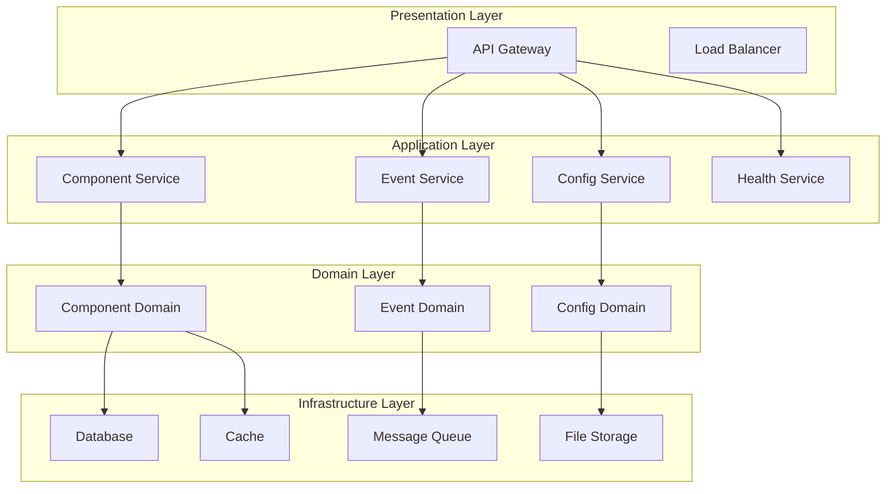

#### 2.2 事件驱动架构

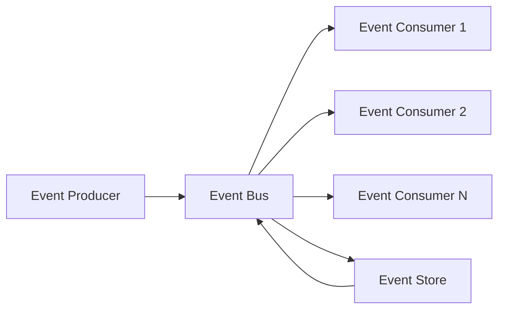

#### 2.3 CQRS模式

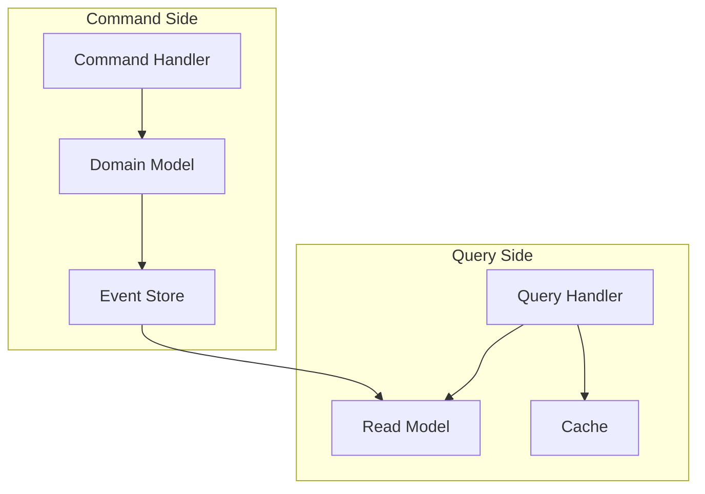

## 🏛️ 整体架构

### 1. 系统架构图

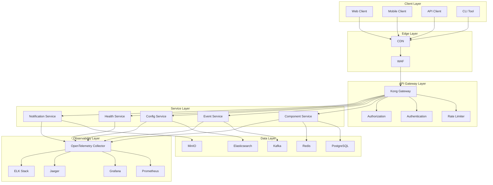

### 2. 服务架构

#### 2.1 核心服务

| 服务名称 | 职责 | 技术栈 | 数据存储 |
|---------|------|--------|----------|
| Component Service | 组件生命周期管理 | Go + gRPC | PostgreSQL + Redis |
| Event Service | 事件处理和分发 | Go + Kafka | Kafka + Elasticsearch |
| Config Service | 配置管理 | Go + Consul | Consul + PostgreSQL |
| Health Service | 健康检查和监控 | Go + Prometheus | Prometheus + Grafana |
| Notification Service | 通知和告警 | Go + WebSocket | Redis + PostgreSQL |

#### 2.2 服务通信

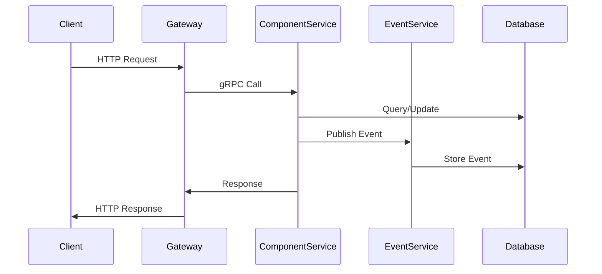

### 3. 数据架构

#### 3.1 数据分层

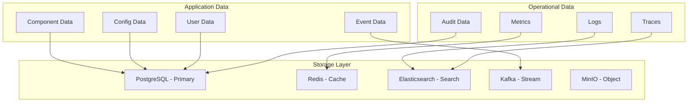

#### 3.2 数据流

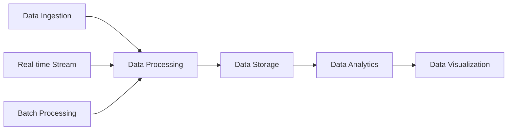

## 🔧 技术架构

### 1. 技术栈选择

#### 1.1 核心框架

- **Go 1.23+**: 最新版本，性能优化
- **Gin**: 高性能HTTP框架
- **gRPC**: 高性能RPC框架
- **Protocol Buffers**: 高效序列化

#### 1.2 数据存储

- **PostgreSQL**: 主数据库，ACID事务
- **Redis**: 缓存和会话存储
- **Elasticsearch**: 日志和搜索
- **Kafka**: 消息队列和流处理

#### 1.3 可观测性

- **OpenTelemetry**: 统一遥测标准
- **Prometheus**: 指标收集
- **Grafana**: 可视化监控
- **Jaeger**: 分布式追踪

#### 1.4 部署运维

- **Docker**: 容器化
- **Kubernetes**: 容器编排
- **Helm**: 包管理
- **ArgoCD**: GitOps部署

### 2. 性能架构

#### 2.1 缓存策略

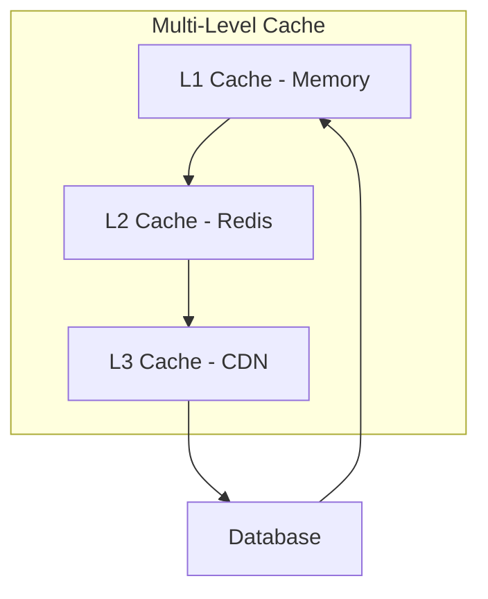

#### 2.2 负载均衡

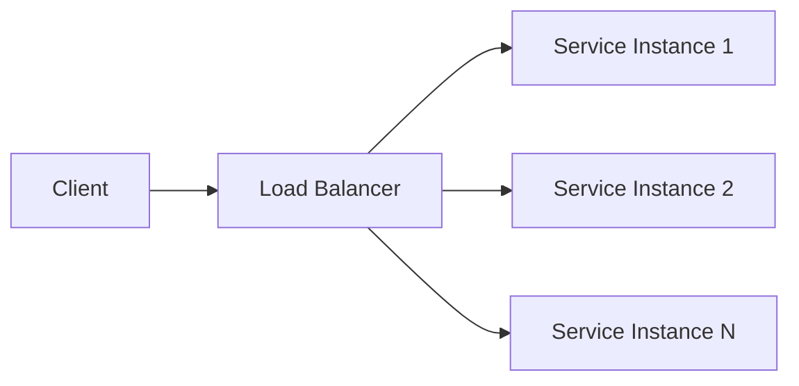

#### 2.3 数据库分片

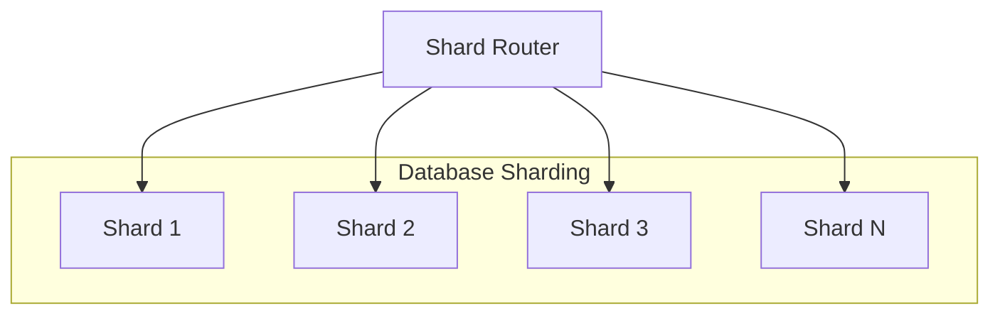

### 3. 安全架构

#### 3.1 安全层次

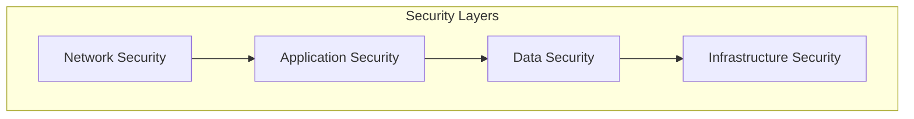

#### 3.2 认证授权

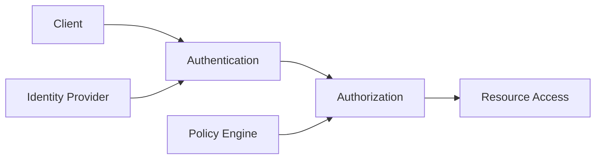

## 📊 架构指标

### 1. 性能指标

| 指标 | 目标值 | 监控方式 |
|------|--------|----------|
| 响应时间 | < 100ms | Prometheus + Grafana |
| 吞吐量 | > 10,000 QPS | Load Testing |
| 可用性 | 99.9% | Health Checks |
| 资源利用率 | CPU < 70%, 内存 < 80% | Kubernetes Metrics |

### 2. 质量指标

| 指标 | 目标值 | 工具 |
|------|--------|------|
| 测试覆盖率 | > 90% | Go Test |
| 代码质量 | SonarQube A级 | SonarQube |
| 安全扫描 | 无高危漏洞 | Trivy |
| 文档完整性 | 100% | Swagger |

### 3. 运维指标

| 指标 | 目标值 | 监控方式 |
|------|--------|----------|
| 部署频率 | 每日多次 | ArgoCD |
| 故障恢复时间 | < 5分钟 | Incident Management |
| 监控覆盖率 | 100% | Prometheus |
| 告警准确率 | > 95% | AlertManager |

## 🚀 架构演进

### 1. 演进策略

#### 1.1 渐进式演进

- **阶段1**: 基础架构重构
- **阶段2**: 微服务拆分
- **阶段3**: 高级特性
- **阶段4**: 生产就绪

#### 1.2 兼容性保证

- **向后兼容**: 保持API兼容性
- **渐进迁移**: 逐步迁移现有功能
- **回滚机制**: 支持快速回滚
- **灰度发布**: 降低发布风险

### 2. 技术债务管理

#### 2.1 债务识别

- **代码质量**: 静态代码分析
- **架构问题**: 架构评审
- **性能瓶颈**: 性能测试
- **安全漏洞**: 安全扫描

#### 2.2 债务偿还

- **优先级排序**: 按影响程度排序
- **资源分配**: 合理分配开发资源
- **持续改进**: 建立改进机制
- **知识传承**: 文档和培训

## 📚 参考资源

### 1. 架构模式

- [微服务架构模式](https://microservices.io/)
- [云原生架构](https://cloudnative.dev/)
- [事件驱动架构](https://martinfowler.com/articles/201701-event-driven.html)

### 2. 技术文档

- [OpenTelemetry](https://opentelemetry.io/)
- [Kubernetes](https://kubernetes.io/)
- [Prometheus](https://prometheus.io/)

### 3. 最佳实践

- [12-Factor App](https://12factor.net/)
- [Google SRE](https://sre.google/)
- [Netflix Chaos Engineering](https://netflixtechblog.com/)

---

*本架构设计基于最新的软件工程最佳实践，旨在构建一个现代化、高性能、可观测的Go语言通用库。*
