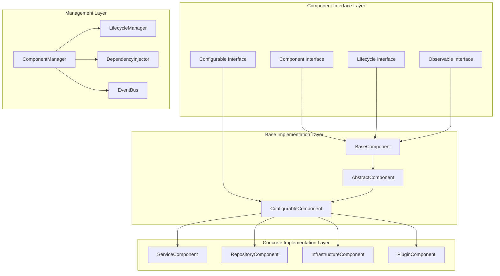

# 组件系统重构实现方案

## 🎯 重构目标

### 1. 核心目标

- **现代化架构**: 采用最新的软件工程最佳实践
- **高性能**: 支持高并发和低延迟
- **可观测性**: 集成OpenTelemetry和监控
- **可扩展性**: 支持插件化和动态扩展
- **易用性**: 简化API和开发体验

### 2. 设计原则

- **单一职责**: 每个组件只负责一个功能
- **依赖注入**: 通过依赖注入管理组件依赖
- **生命周期管理**: 标准化的组件生命周期
- **事件驱动**: 基于事件的松耦合通信
- **配置驱动**: 通过配置管理组件行为

## 🏗️ 新架构设计

### 1. 组件层次结构



### 2. 核心接口定义

```go
// 组件接口
type Component interface {
    // 基本信息
    ID() string
    Name() string
    Version() string
    Type() ComponentType
    
    // 生命周期
    Start(ctx context.Context) error
    Stop(ctx context.Context) error
    Status() ComponentStatus
    
    // 依赖管理
    Dependencies() []string
    Dependents() []string
    
    // 配置管理
    Config() ComponentConfig
    UpdateConfig(config ComponentConfig) error
    
    // 健康检查
    Health() HealthStatus
    
    // 指标收集
    Metrics() ComponentMetrics
}

// 组件类型
type ComponentType string

const (
    TypeService        ComponentType = "service"
    TypeRepository     ComponentType = "repository"
    TypeInfrastructure ComponentType = "infrastructure"
    TypePlugin         ComponentType = "plugin"
    TypeComposite      ComponentType = "composite"
)

// 组件状态
type ComponentStatus int

const (
    StatusCreated ComponentStatus = iota
    StatusInitialized
    StatusStarting
    StatusRunning
    StatusStopping
    StatusStopped
    StatusError
    StatusDegraded
)

// 组件配置
type ComponentConfig struct {
    ID          string                 `json:"id" yaml:"id"`
    Name        string                 `json:"name" yaml:"name"`
    Version     string                 `json:"version" yaml:"version"`
    Type        ComponentType          `json:"type" yaml:"type"`
    Dependencies []string              `json:"dependencies" yaml:"dependencies"`
    Properties  map[string]interface{} `json:"properties" yaml:"properties"`
    Metadata    map[string]string      `json:"metadata" yaml:"metadata"`
}

// 健康状态
type HealthStatus struct {
    Status    string                 `json:"status"`
    Message   string                 `json:"message"`
    Timestamp time.Time              `json:"timestamp"`
    Details   map[string]interface{} `json:"details,omitempty"`
}

// 组件指标
type ComponentMetrics struct {
    StartTime       time.Time     `json:"start_time"`
    StopTime        time.Time     `json:"stop_time"`
    Uptime          time.Duration `json:"uptime"`
    RestartCount    int64         `json:"restart_count"`
    ErrorCount      int64         `json:"error_count"`
    RequestCount    int64         `json:"request_count"`
    ResponseTime    time.Duration `json:"response_time"`
    MemoryUsage     int64         `json:"memory_usage"`
    CPUUsage        float64       `json:"cpu_usage"`
}
```

## 🔧 基础实现

### 1. 基础组件实现

```go
// 基础组件
type BaseComponent struct {
    id           string
    name         string
    version      string
    componentType ComponentType
    status       atomic.Value
    config       ComponentConfig
    dependencies []string
    dependents   []string
    container    *DependencyContainer
    lifecycle    *LifecycleManager
    eventBus     *EventBus
    logger       *zap.Logger
    tracer       trace.Tracer
    meter        metric.Meter
    metrics      *ComponentMetricsImpl
    health       HealthStatus
    mu           sync.RWMutex
    ctx          context.Context
    cancel       context.CancelFunc
}

// 创建基础组件
func NewBaseComponent(config ComponentConfig, container *DependencyContainer) *BaseComponent {
    ctx, cancel := context.WithCancel(context.Background())
    
    bc := &BaseComponent{
        id:            config.ID,
        name:          config.Name,
        version:       config.Version,
        componentType: config.Type,
        config:        config,
        dependencies:  config.Dependencies,
        container:     container,
        lifecycle:     NewLifecycleManager(ctx),
        eventBus:      NewEventBus(),
        logger:        zap.L().Named(fmt.Sprintf("component:%s", config.ID)),
        tracer:        otel.Tracer(fmt.Sprintf("component.%s", config.ID)),
        meter:         otel.Meter(fmt.Sprintf("component.%s", config.ID)),
        metrics:       NewComponentMetrics(config.ID),
        ctx:           ctx,
        cancel:        cancel,
    }
    
    bc.status.Store(StatusCreated)
    return bc
}

// 实现Component接口
func (bc *BaseComponent) ID() string {
    return bc.id
}

func (bc *BaseComponent) Name() string {
    return bc.name
}

func (bc *BaseComponent) Version() string {
    return bc.version
}

func (bc *BaseComponent) Type() ComponentType {
    return bc.componentType
}

func (bc *BaseComponent) Status() ComponentStatus {
    return bc.status.Load().(ComponentStatus)
}

func (bc *BaseComponent) Dependencies() []string {
    return bc.dependencies
}

func (bc *BaseComponent) Dependents() []string {
    bc.mu.RLock()
    defer bc.mu.RUnlock()
    return bc.dependents
}

func (bc *BaseComponent) Config() ComponentConfig {
    bc.mu.RLock()
    defer bc.mu.RUnlock()
    return bc.config
}

func (bc *BaseComponent) UpdateConfig(config ComponentConfig) error {
    bc.mu.Lock()
    defer bc.mu.Unlock()
    
    // 验证配置
    if err := bc.validateConfig(config); err != nil {
        return fmt.Errorf("invalid config: %w", err)
    }
    
    bc.config = config
    bc.logger.Info("config updated", zap.String("component_id", bc.id))
    
    // 发布配置更新事件
    bc.eventBus.Publish("config.updated", map[string]interface{}{
        "component_id": bc.id,
        "config":       config,
        "timestamp":    time.Now(),
    })
    
    return nil
}

func (bc *BaseComponent) Health() HealthStatus {
    bc.mu.RLock()
    defer bc.mu.RUnlock()
    return bc.health
}

func (bc *BaseComponent) Metrics() ComponentMetrics {
    bc.mu.RLock()
    defer bc.mu.RUnlock()
    
    metrics := bc.metrics.GetMetrics()
    if bc.Status() == StatusRunning {
        metrics.Uptime = time.Since(metrics.StartTime)
    }
    
    return metrics
}

// 生命周期管理
func (bc *BaseComponent) Start(ctx context.Context) error {
    bc.mu.Lock()
    defer bc.mu.Unlock()
    
    currentStatus := bc.Status()
    if currentStatus != StatusCreated && currentStatus != StatusStopped {
        return fmt.Errorf("component %s is not in startable status: %s", bc.id, currentStatus)
    }
    
    // 创建追踪span
    ctx, span := bc.tracer.Start(ctx, "component.start")
    defer span.End()
    
    span.SetAttributes(
        attribute.String("component.id", bc.id),
        attribute.String("component.name", bc.name),
        attribute.String("component.type", string(bc.componentType)),
    )
    
    bc.logger.Info("starting component")
    bc.status.Store(StatusStarting)
    
    // 检查依赖
    if err := bc.checkDependencies(ctx); err != nil {
        bc.status.Store(StatusError)
        span.SetStatus(codes.Error, err.Error())
        span.RecordError(err)
        return fmt.Errorf("dependency check failed: %w", err)
    }
    
    // 启动生命周期管理器
    if err := bc.lifecycle.Start(ctx); err != nil {
        bc.status.Store(StatusError)
        span.SetStatus(codes.Error, err.Error())
        span.RecordError(err)
        return fmt.Errorf("failed to start lifecycle: %w", err)
    }
    
    // 执行自定义启动逻辑
    if err := bc.onStart(ctx); err != nil {
        bc.status.Store(StatusError)
        span.SetStatus(codes.Error, err.Error())
        span.RecordError(err)
        return fmt.Errorf("failed to start component: %w", err)
    }
    
    bc.status.Store(StatusRunning)
    bc.metrics.RecordStart()
    bc.updateHealth(HealthStatus{
        Status:    "healthy",
        Message:   "Component is running",
        Timestamp: time.Now(),
    })
    
    bc.logger.Info("component started successfully")
    
    // 发布启动事件
    bc.eventBus.Publish("component.started", map[string]interface{}{
        "component_id": bc.id,
        "timestamp":    time.Now(),
    })
    
    return nil
}

func (bc *BaseComponent) Stop(ctx context.Context) error {
    bc.mu.Lock()
    defer bc.mu.Unlock()
    
    currentStatus := bc.Status()
    if currentStatus != StatusRunning {
        return fmt.Errorf("component %s is not running: %s", bc.id, currentStatus)
    }
    
    // 创建追踪span
    ctx, span := bc.tracer.Start(ctx, "component.stop")
    defer span.End()
    
    span.SetAttributes(
        attribute.String("component.id", bc.id),
        attribute.String("component.name", bc.name),
    )
    
    bc.logger.Info("stopping component")
    bc.status.Store(StatusStopping)
    
    // 执行自定义停止逻辑
    if err := bc.onStop(ctx); err != nil {
        bc.status.Store(StatusError)
        span.SetStatus(codes.Error, err.Error())
        span.RecordError(err)
        return fmt.Errorf("failed to stop component: %w", err)
    }
    
    // 停止生命周期管理器
    if err := bc.lifecycle.Stop(ctx); err != nil {
        bc.status.Store(StatusError)
        span.SetStatus(codes.Error, err.Error())
        span.RecordError(err)
        return fmt.Errorf("failed to stop lifecycle: %w", err)
    }
    
    bc.status.Store(StatusStopped)
    bc.metrics.RecordStop()
    bc.updateHealth(HealthStatus{
        Status:    "stopped",
        Message:   "Component is stopped",
        Timestamp: time.Now(),
    })
    
    bc.logger.Info("component stopped successfully")
    
    // 发布停止事件
    bc.eventBus.Publish("component.stopped", map[string]interface{}{
        "component_id": bc.id,
        "timestamp":    time.Now(),
    })
    
    return nil
}

// 依赖检查
func (bc *BaseComponent) checkDependencies(ctx context.Context) error {
    for _, depID := range bc.dependencies {
        dep, err := bc.container.GetComponent(depID)
        if err != nil {
            return fmt.Errorf("dependency %s not found: %w", depID, err)
        }
        
        if dep.Status() != StatusRunning {
            return fmt.Errorf("dependency %s is not running: %s", depID, dep.Status())
        }
    }
    return nil
}

// 健康状态更新
func (bc *BaseComponent) updateHealth(health HealthStatus) {
    bc.mu.Lock()
    defer bc.mu.Unlock()
    bc.health = health
}

// 配置验证
func (bc *BaseComponent) validateConfig(config ComponentConfig) error {
    if config.ID == "" {
        return fmt.Errorf("component ID cannot be empty")
    }
    if config.Name == "" {
        return fmt.Errorf("component name cannot be empty")
    }
    if config.Type == "" {
        return fmt.Errorf("component type cannot be empty")
    }
    return nil
}

// 钩子方法（子类可重写）
func (bc *BaseComponent) onStart(ctx context.Context) error {
    // 默认实现为空
    return nil
}

func (bc *BaseComponent) onStop(ctx context.Context) error {
    // 默认实现为空
    return nil
}
```

### 2. 可配置组件

```go
// 可配置组件接口
type ConfigurableComponent interface {
    Component
    SetConfig(config ComponentConfig) error
    GetConfig() ComponentConfig
    ValidateConfig(config ComponentConfig) error
}

// 可配置组件实现
type ConfigurableBaseComponent struct {
    *BaseComponent
    configValidator ConfigValidator
    configWatcher   ConfigWatcher
}

// 配置验证器
type ConfigValidator interface {
    Validate(config ComponentConfig) error
}

// 配置监听器
type ConfigWatcher interface {
    Watch(configPath string, callback func(ComponentConfig) error) error
    Unwatch(configPath string) error
}

// 创建可配置组件
func NewConfigurableBaseComponent(config ComponentConfig, container *DependencyContainer) *ConfigurableBaseComponent {
    return &ConfigurableBaseComponent{
        BaseComponent:   NewBaseComponent(config, container),
        configValidator: NewDefaultConfigValidator(),
        configWatcher:   NewFileConfigWatcher(),
    }
}

func (cbc *ConfigurableBaseComponent) SetConfig(config ComponentConfig) error {
    // 验证配置
    if err := cbc.configValidator.Validate(config); err != nil {
        return fmt.Errorf("config validation failed: %w", err)
    }
    
    // 更新配置
    return cbc.BaseComponent.UpdateConfig(config)
}

func (cbc *ConfigurableBaseComponent) GetConfig() ComponentConfig {
    return cbc.BaseComponent.Config()
}

func (cbc *ConfigurableBaseComponent) ValidateConfig(config ComponentConfig) error {
    return cbc.configValidator.Validate(config)
}
```

### 3. 服务组件

```go
// 服务组件
type ServiceComponent struct {
    *ConfigurableBaseComponent
    serviceName string
    endpoints   []string
    healthCheck HealthChecker
    loadBalancer LoadBalancer
    circuitBreaker CircuitBreaker
}

// 创建服务组件
func NewServiceComponent(config ComponentConfig, container *DependencyContainer) *ServiceComponent {
    sc := &ServiceComponent{
        ConfigurableBaseComponent: NewConfigurableBaseComponent(config, container),
        serviceName:               config.Properties["service_name"].(string),
        healthCheck:               NewHealthChecker(),
        loadBalancer:              NewLoadBalancer(),
        circuitBreaker:            NewCircuitBreaker(),
    }
    
    if endpoints, ok := config.Properties["endpoints"].([]interface{}); ok {
        for _, endpoint := range endpoints {
            sc.endpoints = append(sc.endpoints, endpoint.(string))
        }
    }
    
    return sc
}

func (sc *ServiceComponent) onStart(ctx context.Context) error {
    // 启动健康检查
    if err := sc.healthCheck.Start(ctx); err != nil {
        return fmt.Errorf("failed to start health check: %w", err)
    }
    
    // 启动负载均衡器
    if err := sc.loadBalancer.Start(ctx); err != nil {
        return fmt.Errorf("failed to start load balancer: %w", err)
    }
    
    // 启动熔断器
    if err := sc.circuitBreaker.Start(ctx); err != nil {
        return fmt.Errorf("failed to start circuit breaker: %w", err)
    }
    
    sc.logger.Info("service component started", zap.String("service", sc.serviceName))
    return nil
}

func (sc *ServiceComponent) onStop(ctx context.Context) error {
    // 停止健康检查
    if err := sc.healthCheck.Stop(ctx); err != nil {
        sc.logger.Warn("failed to stop health check", zap.Error(err))
    }
    
    // 停止负载均衡器
    if err := sc.loadBalancer.Stop(ctx); err != nil {
        sc.logger.Warn("failed to stop load balancer", zap.Error(err))
    }
    
    // 停止熔断器
    if err := sc.circuitBreaker.Stop(ctx); err != nil {
        sc.logger.Warn("failed to stop circuit breaker", zap.Error(err))
    }
    
    sc.logger.Info("service component stopped", zap.String("service", sc.serviceName))
    return nil
}
```

### 4. 仓库组件

```go
// 仓库组件
type RepositoryComponent struct {
    *ConfigurableBaseComponent
    dataSource DataSource
    cache      Cache
    metrics    RepositoryMetrics
}

// 数据源接口
type DataSource interface {
    Connect(ctx context.Context) error
    Disconnect(ctx context.Context) error
    IsConnected() bool
}

// 缓存接口
type Cache interface {
    Get(key string) (interface{}, error)
    Set(key string, value interface{}, ttl time.Duration) error
    Delete(key string) error
    Clear() error
}

// 仓库指标
type RepositoryMetrics struct {
    QueryCount    int64
    QueryDuration time.Duration
    CacheHits     int64
    CacheMisses   int64
    ErrorCount    int64
}

// 创建仓库组件
func NewRepositoryComponent(config ComponentConfig, container *DependencyContainer) *RepositoryComponent {
    rc := &RepositoryComponent{
        ConfigurableBaseComponent: NewConfigurableBaseComponent(config, container),
        dataSource:                NewDataSource(config.Properties),
        cache:                     NewCache(config.Properties),
    }
    
    return rc
}

func (rc *RepositoryComponent) onStart(ctx context.Context) error {
    // 连接数据源
    if err := rc.dataSource.Connect(ctx); err != nil {
        return fmt.Errorf("failed to connect to data source: %w", err)
    }
    
    // 初始化缓存
    if err := rc.cache.Clear(); err != nil {
        rc.logger.Warn("failed to clear cache", zap.Error(err))
    }
    
    rc.logger.Info("repository component started")
    return nil
}

func (rc *RepositoryComponent) onStop(ctx context.Context) error {
    // 断开数据源连接
    if err := rc.dataSource.Disconnect(ctx); err != nil {
        rc.logger.Warn("failed to disconnect from data source", zap.Error(err))
    }
    
    // 清理缓存
    if err := rc.cache.Clear(); err != nil {
        rc.logger.Warn("failed to clear cache", zap.Error(err))
    }
    
    rc.logger.Info("repository component stopped")
    return nil
}
```

## 🏛️ 组件管理器

### 1. 组件管理器实现

```go
// 组件管理器
type ComponentManager struct {
    components     map[string]Component
    container      *DependencyContainer
    lifecycle      *LifecycleManager
    eventBus       *EventBus
    logger         *zap.Logger
    tracer         trace.Tracer
    meter          metric.Meter
    mu             sync.RWMutex
    ctx            context.Context
    cancel         context.CancelFunc
}

// 创建组件管理器
func NewComponentManager(container *DependencyContainer) *ComponentManager {
    ctx, cancel := context.WithCancel(context.Background())
    
    cm := &ComponentManager{
        components: make(map[string]Component),
        container:  container,
        lifecycle:  NewLifecycleManager(ctx),
        eventBus:   NewEventBus(),
        logger:     zap.L().Named("component-manager"),
        tracer:     otel.Tracer("component-manager"),
        meter:      otel.Meter("component-manager"),
        ctx:        ctx,
        cancel:     cancel,
    }
    
    // 注册组件管理器到容器
    container.RegisterService("component-manager", cm)
    
    return cm
}

// 注册组件
func (cm *ComponentManager) RegisterComponent(component Component) error {
    cm.mu.Lock()
    defer cm.mu.Unlock()
    
    if _, exists := cm.components[component.ID()]; exists {
        return fmt.Errorf("component %s already registered", component.ID())
    }
    
    cm.components[component.ID()] = component
    cm.logger.Info("component registered", 
        zap.String("id", component.ID()),
        zap.String("name", component.Name()),
        zap.String("type", string(component.Type())))
    
    // 发布组件注册事件
    cm.eventBus.Publish("component.registered", map[string]interface{}{
        "component_id": component.ID(),
        "component_name": component.Name(),
        "component_type": component.Type(),
        "timestamp": time.Now(),
    })
    
    return nil
}

// 注销组件
func (cm *ComponentManager) UnregisterComponent(componentID string) error {
    cm.mu.Lock()
    defer cm.mu.Unlock()
    
    component, exists := cm.components[componentID]
    if !exists {
        return fmt.Errorf("component %s not found", componentID)
    }
    
    // 停止组件
    if component.Status() == StatusRunning {
        if err := component.Stop(cm.ctx); err != nil {
            cm.logger.Warn("failed to stop component during unregistration", 
                zap.String("component_id", componentID),
                zap.Error(err))
        }
    }
    
    delete(cm.components, componentID)
    cm.logger.Info("component unregistered", zap.String("component_id", componentID))
    
    // 发布组件注销事件
    cm.eventBus.Publish("component.unregistered", map[string]interface{}{
        "component_id": componentID,
        "timestamp": time.Now(),
    })
    
    return nil
}

// 获取组件
func (cm *ComponentManager) GetComponent(componentID string) (Component, error) {
    cm.mu.RLock()
    defer cm.mu.RUnlock()
    
    component, exists := cm.components[componentID]
    if !exists {
        return nil, fmt.Errorf("component %s not found", componentID)
    }
    
    return component, nil
}

// 获取所有组件
func (cm *ComponentManager) GetAllComponents() []Component {
    cm.mu.RLock()
    defer cm.mu.RUnlock()
    
    components := make([]Component, 0, len(cm.components))
    for _, component := range cm.components {
        components = append(components, component)
    }
    
    return components
}

// 按类型获取组件
func (cm *ComponentManager) GetComponentsByType(componentType ComponentType) []Component {
    cm.mu.RLock()
    defer cm.mu.RUnlock()
    
    var components []Component
    for _, component := range cm.components {
        if component.Type() == componentType {
            components = append(components, component)
        }
    }
    
    return components
}

// 启动所有组件
func (cm *ComponentManager) StartAll(ctx context.Context) error {
    cm.mu.RLock()
    components := make([]Component, 0, len(cm.components))
    for _, component := range cm.components {
        components = append(components, component)
    }
    cm.mu.RUnlock()
    
    // 按依赖顺序排序组件
    sortedComponents, err := cm.sortByDependencies(components)
    if err != nil {
        return fmt.Errorf("failed to sort components by dependencies: %w", err)
    }
    
    // 启动组件
    for _, component := range sortedComponents {
        if err := component.Start(ctx); err != nil {
            cm.logger.Error("failed to start component",
                zap.String("component_id", component.ID()),
                zap.Error(err))
            return fmt.Errorf("failed to start component %s: %w", component.ID(), err)
        }
    }
    
    cm.logger.Info("all components started", zap.Int("count", len(sortedComponents)))
    return nil
}

// 停止所有组件
func (cm *ComponentManager) StopAll(ctx context.Context) error {
    cm.mu.RLock()
    components := make([]Component, 0, len(cm.components))
    for _, component := range cm.components {
        components = append(components, component)
    }
    cm.mu.RUnlock()
    
    // 按依赖顺序的反序停止组件
    sortedComponents, err := cm.sortByDependencies(components)
    if err != nil {
        return fmt.Errorf("failed to sort components by dependencies: %w", err)
    }
    
    // 反转顺序
    for i, j := 0, len(sortedComponents)-1; i < j; i, j = i+1, j-1 {
        sortedComponents[i], sortedComponents[j] = sortedComponents[j], sortedComponents[i]
    }
    
    // 停止组件
    for _, component := range sortedComponents {
        if err := component.Stop(ctx); err != nil {
            cm.logger.Error("failed to stop component",
                zap.String("component_id", component.ID()),
                zap.Error(err))
            return fmt.Errorf("failed to stop component %s: %w", component.ID(), err)
        }
    }
    
    cm.logger.Info("all components stopped", zap.Int("count", len(sortedComponents)))
    return nil
}

// 按依赖排序
func (cm *ComponentManager) sortByDependencies(components []Component) ([]Component, error) {
    // 构建依赖图
    graph := make(map[string][]string)
    componentMap := make(map[string]Component)
    
    for _, component := range components {
        graph[component.ID()] = component.Dependencies()
        componentMap[component.ID()] = component
    }
    
    // 检测循环依赖
    if hasCycle(graph) {
        return nil, fmt.Errorf("circular dependency detected")
    }
    
    // 拓扑排序
    sorted := make([]Component, 0, len(components))
    visited := make(map[string]bool)
    temp := make(map[string]bool)
    
    var visit func(string) error
    visit = func(node string) error {
        if temp[node] {
            return fmt.Errorf("circular dependency detected")
        }
        if visited[node] {
            return nil
        }
        
        temp[node] = true
        
        for _, dep := range graph[node] {
            if _, exists := componentMap[dep]; exists {
                if err := visit(dep); err != nil {
                    return err
                }
            }
        }
        
        temp[node] = false
        visited[node] = true
        sorted = append(sorted, componentMap[node])
        return nil
    }
    
    for _, component := range components {
        if !visited[component.ID()] {
            if err := visit(component.ID()); err != nil {
                return nil, err
            }
        }
    }
    
    return sorted, nil
}

// 检测循环依赖
func hasCycle(graph map[string][]string) bool {
    visited := make(map[string]bool)
    recStack := make(map[string]bool)
    
    var isCyclicUtil func(string) bool
    isCyclicUtil = func(node string) bool {
        visited[node] = true
        recStack[node] = true
        
        for _, neighbor := range graph[node] {
            if !visited[neighbor] {
                if isCyclicUtil(neighbor) {
                    return true
                }
            } else if recStack[neighbor] {
                return true
            }
        }
        
        recStack[node] = false
        return false
    }
    
    for node := range graph {
        if !visited[node] {
            if isCyclicUtil(node) {
                return true
            }
        }
    }
    
    return false
}
```

## 🔄 事件系统

### 1. 事件总线实现

```go
// 事件总线
type EventBus struct {
    subscribers map[string][]chan Event
    logger      *zap.Logger
    mu          sync.RWMutex
}

// 事件
type Event struct {
    Type      string                 `json:"type"`
    Data      map[string]interface{} `json:"data"`
    Timestamp time.Time              `json:"timestamp"`
    Source    string                 `json:"source"`
}

// 创建事件总线
func NewEventBus() *EventBus {
    return &EventBus{
        subscribers: make(map[string][]chan Event),
        logger:      zap.L().Named("event-bus"),
    }
}

// 订阅事件
func (eb *EventBus) Subscribe(eventType string) (<-chan Event, error) {
    eb.mu.Lock()
    defer eb.mu.Unlock()
    
    ch := make(chan Event, 100)
    eb.subscribers[eventType] = append(eb.subscribers[eventType], ch)
    
    eb.logger.Info("event subscription created", zap.String("event_type", eventType))
    return ch, nil
}

// 取消订阅
func (eb *EventBus) Unsubscribe(eventType string, ch <-chan Event) error {
    eb.mu.Lock()
    defer eb.mu.Unlock()
    
    subscribers, exists := eb.subscribers[eventType]
    if !exists {
        return fmt.Errorf("event type %s not found", eventType)
    }
    
    for i, subscriber := range subscribers {
        if subscriber == ch {
            close(subscriber)
            eb.subscribers[eventType] = append(subscribers[:i], subscribers[i+1:]...)
            eb.logger.Info("event subscription removed", zap.String("event_type", eventType))
            return nil
        }
    }
    
    return fmt.Errorf("subscriber not found for event type %s", eventType)
}

// 发布事件
func (eb *EventBus) Publish(eventType string, data map[string]interface{}) {
    eb.mu.RLock()
    subscribers, exists := eb.subscribers[eventType]
    eb.mu.RUnlock()
    
    if !exists {
        return
    }
    
    event := Event{
        Type:      eventType,
        Data:      data,
        Timestamp: time.Now(),
        Source:    "event-bus",
    }
    
    for _, ch := range subscribers {
        select {
        case ch <- event:
            // 事件发送成功
        default:
            // 通道已满，记录警告
            eb.logger.Warn("event channel is full, dropping event",
                zap.String("event_type", eventType))
        }
    }
    
    eb.logger.Debug("event published", 
        zap.String("event_type", eventType),
        zap.Any("data", data))
}
```

## 📊 指标收集

### 1. 组件指标实现

```go
// 组件指标实现
type ComponentMetricsImpl struct {
    componentID    string
    startTime      atomic.Value
    stopTime       atomic.Value
    restartCount   int64
    errorCount     int64
    requestCount   int64
    responseTime   time.Duration
    memoryUsage    int64
    cpuUsage       float64
    mu             sync.RWMutex
}

// 创建组件指标
func NewComponentMetrics(componentID string) *ComponentMetricsImpl {
    cm := &ComponentMetricsImpl{
        componentID: componentID,
    }
    
    cm.startTime.Store(time.Time{})
    cm.stopTime.Store(time.Time{})
    
    return cm
}

func (cm *ComponentMetricsImpl) GetMetrics() ComponentMetrics {
    cm.mu.RLock()
    defer cm.mu.RUnlock()
    
    startTime := cm.startTime.Load().(time.Time)
    stopTime := cm.stopTime.Load().(time.Time)
    
    var uptime time.Duration
    if !startTime.IsZero() {
        if stopTime.IsZero() {
            uptime = time.Since(startTime)
        } else {
            uptime = stopTime.Sub(startTime)
        }
    }
    
    return ComponentMetrics{
        StartTime:    startTime,
        StopTime:     stopTime,
        Uptime:       uptime,
        RestartCount: atomic.LoadInt64(&cm.restartCount),
        ErrorCount:   atomic.LoadInt64(&cm.errorCount),
        RequestCount: atomic.LoadInt64(&cm.requestCount),
        ResponseTime: cm.responseTime,
        MemoryUsage:  atomic.LoadInt64(&cm.memoryUsage),
        CPUUsage:     cm.cpuUsage,
    }
}

func (cm *ComponentMetricsImpl) RecordStart() {
    cm.startTime.Store(time.Now())
    atomic.AddInt64(&cm.restartCount, 1)
}

func (cm *ComponentMetricsImpl) RecordStop() {
    cm.stopTime.Store(time.Now())
}

func (cm *ComponentMetricsImpl) RecordError() {
    atomic.AddInt64(&cm.errorCount, 1)
}

func (cm *ComponentMetricsImpl) RecordRequest(duration time.Duration) {
    atomic.AddInt64(&cm.requestCount, 1)
    cm.mu.Lock()
    cm.responseTime = duration
    cm.mu.Unlock()
}

func (cm *ComponentMetricsImpl) UpdateMemoryUsage(usage int64) {
    atomic.StoreInt64(&cm.memoryUsage, usage)
}

func (cm *ComponentMetricsImpl) UpdateCPUUsage(usage float64) {
    cm.mu.Lock()
    cm.cpuUsage = usage
    cm.mu.Unlock()
}
```

## 🚀 使用示例

### 1. 基本使用

```go
// 创建组件管理器
container := NewDependencyContainer()
manager := NewComponentManager(container)

// 创建组件配置
config := ComponentConfig{
    ID:          "user-service",
    Name:        "User Service",
    Version:     "1.0.0",
    Type:        TypeService,
    Dependencies: []string{"user-repository", "event-bus"},
    Properties: map[string]interface{}{
        "service_name": "user-service",
        "port":         8080,
        "endpoints":    []string{"http://localhost:8080"},
    },
}

// 创建服务组件
userService := NewServiceComponent(config, container)

// 注册组件
if err := manager.RegisterComponent(userService); err != nil {
    log.Fatal(err)
}

// 启动所有组件
ctx := context.Background()
if err := manager.StartAll(ctx); err != nil {
    log.Fatal(err)
}

// 等待信号
sigChan := make(chan os.Signal, 1)
signal.Notify(sigChan, syscall.SIGINT, syscall.SIGTERM)
<-sigChan

// 停止所有组件
if err := manager.StopAll(ctx); err != nil {
    log.Fatal(err)
}
```

### 2. 事件处理

```go
// 订阅事件
ch, err := manager.eventBus.Subscribe("component.started")
if err != nil {
    log.Fatal(err)
}

// 处理事件
go func() {
    for event := range ch {
        fmt.Printf("Component started: %s\n", event.Data["component_id"])
    }
}()

// 发布事件
manager.eventBus.Publish("custom.event", map[string]interface{}{
    "message": "Hello, World!",
    "timestamp": time.Now(),
})
```

### 3. 指标监控

```go
// 获取组件指标
component, err := manager.GetComponent("user-service")
if err != nil {
    log.Fatal(err)
}

metrics := component.Metrics()
fmt.Printf("Uptime: %v\n", metrics.Uptime)
fmt.Printf("Request Count: %d\n", metrics.RequestCount)
fmt.Printf("Error Count: %d\n", metrics.ErrorCount)
```

---

*本组件系统重构方案提供了现代化、高性能、可观测的组件管理能力，支持复杂的业务场景和扩展需求。*
