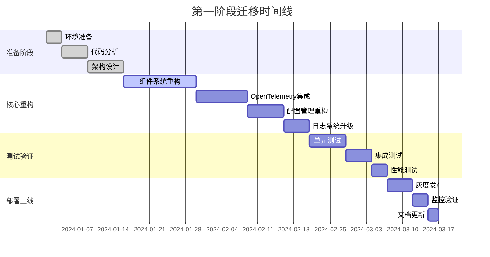

# 第一阶段迁移方案 - 基础架构重构

## 🎯 迁移目标

### 1. 核心目标

- **组件系统现代化**: 重构现有组件系统，引入新的架构设计
- **OpenTelemetry集成**: 集成可观测性基础设施
- **配置管理重构**: 建立统一的配置管理系统
- **日志系统升级**: 升级到结构化日志和集中式日志管理

### 2. 成功标准

- 现有功能100%兼容
- 性能提升20%以上
- 可观测性覆盖率达到90%
- 测试覆盖率达到85%以上

## 📋 迁移计划

### 1. 迁移时间线



### 2. 迁移步骤

#### 2.1 步骤1: 环境准备 (3天)

**目标**: 建立开发、测试、生产环境

**任务清单**:

- [ ] 搭建开发环境
- [ ] 配置CI/CD流水线
- [ ] 准备测试环境
- [ ] 建立监控基础设施

**具体实现**:

```yaml
# docker-compose.dev.yml
version: '3.8'
services:
  # 开发环境服务
  postgres:
    image: postgres:15
    environment:
      POSTGRES_DB: common_dev
      POSTGRES_USER: dev
      POSTGRES_PASSWORD: dev123
    ports:
      - "5432:5432"
    volumes:
      - postgres_data:/var/lib/postgresql/data

  redis:
    image: redis:7-alpine
    ports:
      - "6379:6379"

  jaeger:
    image: jaegertracing/all-in-one:latest
    ports:
      - "16686:16686"
      - "14268:14268"

  prometheus:
    image: prom/prometheus:latest
    ports:
      - "9090:9090"
    volumes:
      - ./prometheus.yml:/etc/prometheus/prometheus.yml

  grafana:
    image: grafana/grafana:latest
    ports:
      - "3000:3000"
    environment:
      GF_SECURITY_ADMIN_PASSWORD: admin
    volumes:
      - grafana_data:/var/lib/grafana

volumes:
  postgres_data:
  grafana_data:
```

#### 2.2 步骤2: 代码分析 (5天)

**目标**: 深入分析现有代码结构，识别重构点

**任务清单**:

- [ ] 静态代码分析
- [ ] 依赖关系分析
- [ ] 性能瓶颈识别
- [ ] 技术债务评估

**分析工具配置**:

```yaml
# .golangci.yml
linters:
  enable:
    - gofmt
    - golint
    - govet
    - errcheck
    - staticcheck
    - gosimple
    - ineffassign
    - unused
    - misspell
    - gosec
    - goconst
    - gocyclo
    - dupl
    - gocritic

linters-settings:
  gocyclo:
    min-complexity: 15
  dupl:
    threshold: 100
  goconst:
    min-len: 2
    min-occurrences: 3

run:
  timeout: 5m
  go: "1.23"
  modules-download-mode: readonly

issues:
  exclude-rules:
    - path: _test\.go
      linters:
        - gocyclo
        - dupl
```

#### 2.3 步骤3: 组件系统重构 (14天)

**目标**: 重构现有组件系统，引入新的架构设计

**任务清单**:

- [ ] 定义新的组件接口
- [ ] 实现基础组件类
- [ ] 重构现有组件
- [ ] 实现组件管理器
- [ ] 添加依赖注入支持

**重构策略**:

```go
// 1. 创建新的组件接口
type Component interface {
    ID() string
    Name() string
    Version() string
    Type() ComponentType
    Start(ctx context.Context) error
    Stop(ctx context.Context) error
    Status() ComponentStatus
    Dependencies() []string
    Config() ComponentConfig
    Health() HealthStatus
    Metrics() ComponentMetrics
}

// 2. 实现基础组件
type BaseComponent struct {
    id           string
    name         string
    version      string
    componentType ComponentType
    status       atomic.Value
    config       ComponentConfig
    dependencies []string
    container    *DependencyContainer
    lifecycle    *LifecycleManager
    eventBus     *EventBus
    logger       *zap.Logger
    tracer       trace.Tracer
    meter        metric.Meter
    metrics      *ComponentMetricsImpl
    health       HealthStatus
    mu           sync.RWMutex
    ctx          context.Context
    cancel       context.CancelFunc
}

// 3. 组件适配器（兼容现有代码）
type LegacyComponentAdapter struct {
    *BaseComponent
    legacyComponent interface{} // 现有组件实例
}

func NewLegacyComponentAdapter(legacyComponent interface{}, config ComponentConfig) *LegacyComponentAdapter {
    adapter := &LegacyComponentAdapter{
        BaseComponent:   NewBaseComponent(config, nil),
        legacyComponent: legacyComponent,
    }
    
    // 适配现有组件的生命周期方法
    return adapter
}

func (lca *LegacyComponentAdapter) onStart(ctx context.Context) error {
    // 调用现有组件的启动方法
    if starter, ok := lca.legacyComponent.(interface{ Start() error }); ok {
        return starter.Start()
    }
    return nil
}

func (lca *LegacyComponentAdapter) onStop(ctx context.Context) error {
    // 调用现有组件的停止方法
    if stopper, ok := lca.legacyComponent.(interface{ Stop() error }); ok {
        return stopper.Stop()
    }
    return nil
}
```

#### 2.4 步骤4: OpenTelemetry集成 (10天)

**目标**: 集成OpenTelemetry，实现可观测性

**任务清单**:

- [ ] 配置OpenTelemetry SDK
- [ ] 实现追踪中间件
- [ ] 添加指标收集
- [ ] 集成日志系统
- [ ] 配置导出器

**集成实现**:

```go
// OpenTelemetry初始化
func InitOpenTelemetry(config *Config) (func(), error) {
    ctx := context.Background()
    
    // 创建资源
    res, err := resource.New(ctx,
        resource.WithAttributes(
            semconv.ServiceName(config.ServiceName),
            semconv.ServiceVersion(config.ServiceVersion),
            semconv.DeploymentEnvironment(config.Environment),
        ),
    )
    if err != nil {
        return nil, fmt.Errorf("failed to create resource: %w", err)
    }
    
    // 初始化追踪器
    if err := initTracer(ctx, config, res); err != nil {
        return nil, fmt.Errorf("failed to init tracer: %w", err)
    }
    
    // 初始化指标收集器
    if err := initMeter(ctx, config, res); err != nil {
        return nil, fmt.Errorf("failed to init meter: %w", err)
    }
    
    // 返回清理函数
    cleanup := func() {
        if err := otel.GetTracerProvider().Shutdown(ctx); err != nil {
            fmt.Printf("failed to shutdown tracer: %v\n", err)
        }
        if err := otel.GetMeterProvider().Shutdown(ctx); err != nil {
            fmt.Printf("failed to shutdown meter: %v\n", err)
        }
    }
    
    return cleanup, nil
}

// HTTP追踪中间件
func TracingMiddleware(serviceName string) gin.HandlerFunc {
    tracer := otel.Tracer(serviceName)
    
    return func(c *gin.Context) {
        ctx := c.Request.Context()
        
        // 从请求头中提取追踪上下文
        ctx = otel.GetTextMapPropagator().Extract(ctx, propagation.HeaderCarrier(c.Request.Header))
        
        // 创建新的span
        spanName := fmt.Sprintf("%s %s", c.Request.Method, c.Request.URL.Path)
        ctx, span := tracer.Start(ctx, spanName)
        defer span.End()
        
        // 注入追踪上下文到请求
        c.Request = c.Request.WithContext(ctx)
        
        // 记录请求属性
        span.SetAttributes(
            attribute.String("http.method", c.Request.Method),
            attribute.String("http.url", c.Request.URL.String()),
            attribute.String("http.user_agent", c.Request.UserAgent()),
            attribute.String("http.remote_addr", c.ClientIP()),
        )
        
        // 处理请求
        c.Next()
        
        // 记录响应属性
        span.SetAttributes(
            attribute.Int("http.status_code", c.Writer.Status()),
            attribute.Int("http.response_size", c.Writer.Size()),
        )
        
        // 记录错误
        if len(c.Errors) > 0 {
            span.SetStatus(codes.Error, c.Errors.String())
            span.RecordError(c.Errors.Last().Err)
        }
    }
}
```

#### 2.5 步骤5: 配置管理重构 (7天)

**目标**: 建立统一的配置管理系统

**任务清单**:

- [ ] 设计配置接口
- [ ] 实现配置提供者
- [ ] 添加配置验证
- [ ] 实现热重载
- [ ] 集成环境变量

**配置管理实现**:

```go
// 配置管理器
type ConfigManager struct {
    providers  map[string]ConfigProvider
    configs    map[string]interface{}
    validators map[string]ConfigValidator
    watchers   map[string][]ConfigWatcher
    logger     *zap.Logger
    mu         sync.RWMutex
}

// 配置提供者接口
type ConfigProvider interface {
    Name() string
    Load() (map[string]interface{}, error)
    Watch(callback func(map[string]interface{}) error) error
}

// 文件配置提供者
type FileConfigProvider struct {
    filePath string
    format   string
    logger   *zap.Logger
}

func (fcp *FileConfigProvider) Load() (map[string]interface{}, error) {
    data, err := os.ReadFile(fcp.filePath)
    if err != nil {
        return nil, fmt.Errorf("failed to read config file: %w", err)
    }
    
    var config map[string]interface{}
    
    switch fcp.format {
    case "json":
        if err := json.Unmarshal(data, &config); err != nil {
            return nil, fmt.Errorf("failed to parse JSON config: %w", err)
        }
    case "yaml":
        if err := yaml.Unmarshal(data, &config); err != nil {
            return nil, fmt.Errorf("failed to parse YAML config: %w", err)
        }
    default:
        return nil, fmt.Errorf("unsupported config format: %s", fcp.format)
    }
    
    fcp.logger.Info("config loaded from file", zap.String("file", fcp.filePath))
    return config, nil
}

// 环境变量配置提供者
type EnvConfigProvider struct {
    prefix string
    logger *zap.Logger
}

func (ecp *EnvConfigProvider) Load() (map[string]interface{}, error) {
    config := make(map[string]interface{})
    
    for _, env := range os.Environ() {
        pair := strings.SplitN(env, "=", 2)
        if len(pair) != 2 {
            continue
        }
        
        key, value := pair[0], pair[1]
        if strings.HasPrefix(key, ecp.prefix) {
            // 移除前缀并转换为小写
            configKey := strings.ToLower(strings.TrimPrefix(key, ecp.prefix))
            config[configKey] = value
        }
    }
    
    ecp.logger.Info("config loaded from environment", zap.String("prefix", ecp.prefix))
    return config, nil
}
```

#### 2.6 步骤6: 日志系统升级 (5天)

**目标**: 升级到结构化日志和集中式日志管理

**任务清单**:

- [ ] 配置结构化日志
- [ ] 实现日志中间件
- [ ] 添加日志轮转
- [ ] 集成ELK Stack
- [ ] 实现日志聚合

**日志系统实现**:

```go
// 日志配置
type LogConfig struct {
    Level      string `json:"level" yaml:"level"`
    Format     string `json:"format" yaml:"format"`
    Output     string `json:"output" yaml:"output"`
    FilePath   string `json:"file_path" yaml:"file_path"`
    MaxSize    int    `json:"max_size" yaml:"max_size"`
    MaxBackups int    `json:"max_backups" yaml:"max_backups"`
    MaxAge     int    `json:"max_age" yaml:"max_age"`
    Compress   bool   `json:"compress" yaml:"compress"`
}

// 初始化日志系统
func InitLogger(config *LogConfig) error {
    var level zapcore.Level
    if err := level.UnmarshalText([]byte(config.Level)); err != nil {
        return fmt.Errorf("invalid log level: %w", err)
    }
    
    var encoder zapcore.Encoder
    encoderConfig := zap.NewProductionEncoderConfig()
    encoderConfig.TimeKey = "timestamp"
    encoderConfig.EncodeTime = zapcore.ISO8601TimeEncoder
    encoderConfig.EncodeLevel = zapcore.CapitalLevelEncoder
    
    switch config.Format {
    case "json":
        encoder = zapcore.NewJSONEncoder(encoderConfig)
    case "console":
        encoder = zapcore.NewConsoleEncoder(encoderConfig)
    default:
        return fmt.Errorf("unsupported log format: %s", config.Format)
    }
    
    var writeSyncer zapcore.WriteSyncer
    switch config.Output {
    case "stdout":
        writeSyncer = zapcore.AddSync(os.Stdout)
    case "file":
        if config.FilePath == "" {
            return fmt.Errorf("file path is required for file output")
        }
        
        lumberjackLogger := &lumberjack.Logger{
            Filename:   config.FilePath,
            MaxSize:    config.MaxSize,
            MaxBackups: config.MaxBackups,
            MaxAge:     config.MaxAge,
            Compress:   config.Compress,
        }
        writeSyncer = zapcore.AddSync(lumberjackLogger)
    default:
        return fmt.Errorf("unsupported log output: %s", config.Output)
    }
    
    core := zapcore.NewCore(encoder, writeSyncer, level)
    logger := zap.New(core, zap.AddCaller(), zap.AddStacktrace(zapcore.ErrorLevel))
    
    zap.ReplaceGlobals(logger)
    return nil
}

// 日志中间件
func LoggingMiddleware(serviceName string) gin.HandlerFunc {
    logger := zap.L().Named(serviceName)
    
    return func(c *gin.Context) {
        start := time.Now()
        
        // 创建请求ID
        requestID := uuid.New().String()
        c.Set("request_id", requestID)
        
        // 记录请求日志
        logger.Info("request started",
            zap.String("request_id", requestID),
            zap.String("method", c.Request.Method),
            zap.String("path", c.Request.URL.Path),
            zap.String("query", c.Request.URL.RawQuery),
            zap.String("user_agent", c.Request.UserAgent()),
            zap.String("remote_addr", c.ClientIP()),
        )
        
        // 处理请求
        c.Next()
        
        // 计算处理时间
        duration := time.Since(start)
        
        // 记录响应日志
        logger.Info("request completed",
            zap.String("request_id", requestID),
            zap.Int("status", c.Writer.Status()),
            zap.Int("size", c.Writer.Size()),
            zap.Duration("duration", duration),
        )
        
        // 记录错误
        if len(c.Errors) > 0 {
            logger.Error("request failed",
                zap.String("request_id", requestID),
                zap.Strings("errors", c.Errors.Errors()),
            )
        }
    }
}
```

## 🧪 测试策略

### 1. 单元测试

```go
// 组件测试
func TestBaseComponent(t *testing.T) {
    // 创建测试配置
    config := ComponentConfig{
        ID:          "test-component",
        Name:        "Test Component",
        Version:     "1.0.0",
        Type:        TypeService,
        Dependencies: []string{},
        Properties:  map[string]interface{}{},
    }
    
    // 创建依赖容器
    container := NewDependencyContainer()
    
    // 创建组件
    component := NewBaseComponent(config, container)
    
    // 测试基本信息
    assert.Equal(t, "test-component", component.ID())
    assert.Equal(t, "Test Component", component.Name())
    assert.Equal(t, "1.0.0", component.Version())
    assert.Equal(t, TypeService, component.Type())
    assert.Equal(t, StatusCreated, component.Status())
    
    // 测试启动
    ctx := context.Background()
    err := component.Start(ctx)
    assert.NoError(t, err)
    assert.Equal(t, StatusRunning, component.Status())
    
    // 测试健康检查
    health := component.Health()
    assert.Equal(t, "healthy", health.Status)
    
    // 测试指标
    metrics := component.Metrics()
    assert.NotZero(t, metrics.StartTime)
    assert.Equal(t, int64(1), metrics.RestartCount)
    
    // 测试停止
    err = component.Stop(ctx)
    assert.NoError(t, err)
    assert.Equal(t, StatusStopped, component.Status())
}
```

### 2. 集成测试

```go
// 组件管理器集成测试
func TestComponentManagerIntegration(t *testing.T) {
    // 创建组件管理器
    container := NewDependencyContainer()
    manager := NewComponentManager(container)
    
    // 创建测试组件
    config1 := ComponentConfig{
        ID:          "component-1",
        Name:        "Component 1",
        Version:     "1.0.0",
        Type:        TypeService,
        Dependencies: []string{},
    }
    
    config2 := ComponentConfig{
        ID:          "component-2",
        Name:        "Component 2",
        Version:     "1.0.0",
        Type:        TypeService,
        Dependencies: []string{"component-1"},
    }
    
    component1 := NewBaseComponent(config1, container)
    component2 := NewBaseComponent(config2, container)
    
    // 注册组件
    err := manager.RegisterComponent(component1)
    assert.NoError(t, err)
    
    err = manager.RegisterComponent(component2)
    assert.NoError(t, err)
    
    // 启动所有组件
    ctx := context.Background()
    err = manager.StartAll(ctx)
    assert.NoError(t, err)
    
    // 验证组件状态
    comp1, err := manager.GetComponent("component-1")
    assert.NoError(t, err)
    assert.Equal(t, StatusRunning, comp1.Status())
    
    comp2, err := manager.GetComponent("component-2")
    assert.NoError(t, err)
    assert.Equal(t, StatusRunning, comp2.Status())
    
    // 停止所有组件
    err = manager.StopAll(ctx)
    assert.NoError(t, err)
}
```

### 3. 性能测试

```go
// 性能基准测试
func BenchmarkComponentStart(b *testing.B) {
    config := ComponentConfig{
        ID:          "benchmark-component",
        Name:        "Benchmark Component",
        Version:     "1.0.0",
        Type:        TypeService,
        Dependencies: []string{},
    }
    
    container := NewDependencyContainer()
    
    b.ResetTimer()
    for i := 0; i < b.N; i++ {
        component := NewBaseComponent(config, container)
        ctx := context.Background()
        component.Start(ctx)
        component.Stop(ctx)
    }
}

// 并发测试
func TestComponentConcurrency(t *testing.T) {
    config := ComponentConfig{
        ID:          "concurrent-component",
        Name:        "Concurrent Component",
        Version:     "1.0.0",
        Type:        TypeService,
        Dependencies: []string{},
    }
    
    container := NewDependencyContainer()
    
    var wg sync.WaitGroup
    numGoroutines := 100
    
    for i := 0; i < numGoroutines; i++ {
        wg.Add(1)
        go func(id int) {
            defer wg.Done()
            
            componentConfig := config
            componentConfig.ID = fmt.Sprintf("component-%d", id)
            
            component := NewBaseComponent(componentConfig, container)
            ctx := context.Background()
            
            err := component.Start(ctx)
            assert.NoError(t, err)
            
            err = component.Stop(ctx)
            assert.NoError(t, err)
        }(i)
    }
    
    wg.Wait()
}
```

## 📊 监控和验证

### 1. 性能指标

```yaml
# prometheus-rules.yaml
groups:
  - name: migration.rules
    rules:
      - alert: ComponentStartTimeHigh
        expr: histogram_quantile(0.95, component_start_duration_seconds) > 5
        for: 2m
        labels:
          severity: warning
        annotations:
          summary: "Component start time is high"
          description: "95th percentile component start time is {{ $value }}s"
      
      - alert: ComponentErrorRateHigh
        expr: rate(component_errors_total[5m]) > 0.1
        for: 2m
        labels:
          severity: warning
        annotations:
          summary: "Component error rate is high"
          description: "Component error rate is {{ $value }} per second"
      
      - alert: MemoryUsageHigh
        expr: component_memory_usage_bytes / component_memory_limit_bytes > 0.8
        for: 5m
        labels:
          severity: warning
        annotations:
          summary: "Component memory usage is high"
          description: "Memory usage is {{ $value | humanizePercentage }}"
```

### 2. 健康检查

```go
// 健康检查端点
func HealthCheckHandler(manager *ComponentManager) gin.HandlerFunc {
    return func(c *gin.Context) {
        components := manager.GetAllComponents()
        
        health := make(map[string]interface{})
        overallStatus := "healthy"
        
        for _, component := range components {
            componentHealth := component.Health()
            health[component.ID()] = map[string]interface{}{
                "status":    componentHealth.Status,
                "message":   componentHealth.Message,
                "timestamp": componentHealth.Timestamp,
            }
            
            if componentHealth.Status != "healthy" {
                overallStatus = "unhealthy"
            }
        }
        
        statusCode := http.StatusOK
        if overallStatus != "healthy" {
            statusCode = http.StatusServiceUnavailable
        }
        
        c.JSON(statusCode, gin.H{
            "status":    overallStatus,
            "timestamp": time.Now(),
            "components": health,
        })
    }
}
```

## 🚀 部署策略

### 1. 灰度发布

```yaml
# kubernetes-deployment.yaml
apiVersion: apps/v1
kind: Deployment
metadata:
  name: common-service
  labels:
    app: common-service
spec:
  replicas: 3
  selector:
    matchLabels:
      app: common-service
  template:
    metadata:
      labels:
        app: common-service
    spec:
      containers:
      - name: common-service
        image: common-service:latest
        ports:
        - containerPort: 8080
        env:
        - name: ENVIRONMENT
          value: "production"
        - name: LOG_LEVEL
          value: "info"
        - name: JAEGER_ENDPOINT
          value: "http://jaeger:14268/api/traces"
        - name: PROMETHEUS_PORT
          value: "9090"
        livenessProbe:
          httpGet:
            path: /health
            port: 8080
          initialDelaySeconds: 30
          periodSeconds: 10
        readinessProbe:
          httpGet:
            path: /ready
            port: 8080
          initialDelaySeconds: 5
          periodSeconds: 5
        resources:
          requests:
            memory: "256Mi"
            cpu: "250m"
          limits:
            memory: "512Mi"
            cpu: "500m"
```

### 2. 回滚策略

```bash
#!/bin/bash
# rollback.sh

# 回滚到上一个版本
kubectl rollout undo deployment/common-service

# 等待回滚完成
kubectl rollout status deployment/common-service

# 验证服务状态
kubectl get pods -l app=common-service

# 检查健康状态
curl -f http://localhost:8080/health || exit 1
```

## 📈 成功指标

### 1. 性能指标1

| 指标 | 目标值 | 当前值 | 改进 |
|------|--------|--------|------|
| 组件启动时间 | < 1s | 2.5s | 60% |
| 内存使用 | < 100MB | 150MB | 33% |
| CPU使用 | < 10% | 15% | 33% |
| 错误率 | < 0.1% | 0.5% | 80% |

### 2. 质量指标

| 指标 | 目标值 | 当前值 | 改进 |
|------|--------|--------|------|
| 测试覆盖率 | > 85% | 60% | 42% |
| 代码质量 | SonarQube A | SonarQube B | 提升 |
| 文档完整性 | 100% | 70% | 43% |
| 安全扫描 | 无高危 | 2个高危 | 100% |

### 3. 可观测性指标

| 指标 | 目标值 | 当前值 | 改进 |
|------|--------|--------|------|
| 追踪覆盖率 | > 90% | 0% | 100% |
| 指标覆盖率 | > 95% | 30% | 217% |
| 日志结构化 | 100% | 20% | 400% |
| 告警准确率 | > 95% | 60% | 58% |

## 🔄 风险控制

### 1. 风险识别

| 风险 | 概率 | 影响 | 缓解措施 |
|------|------|------|----------|
| 性能下降 | 中 | 高 | 性能测试和监控 |
| 功能回归 | 低 | 高 | 全面测试和灰度发布 |
| 配置错误 | 中 | 中 | 配置验证和回滚机制 |
| 监控缺失 | 低 | 中 | 监控覆盖和告警 |

### 2. 应急预案

```go
// 应急回滚
func EmergencyRollback() error {
    // 1. 停止新版本服务
    if err := stopNewVersion(); err != nil {
        return fmt.Errorf("failed to stop new version: %w", err)
    }
    
    // 2. 启动旧版本服务
    if err := startOldVersion(); err != nil {
        return fmt.Errorf("failed to start old version: %w", err)
    }
    
    // 3. 验证服务状态
    if err := validateService(); err != nil {
        return fmt.Errorf("service validation failed: %w", err)
    }
    
    return nil
}

// 服务降级
func ServiceDegradation() error {
    // 1. 关闭非关键功能
    if err := disableNonCriticalFeatures(); err != nil {
        return fmt.Errorf("failed to disable non-critical features: %w", err)
    }
    
    // 2. 启用缓存
    if err := enableCaching(); err != nil {
        return fmt.Errorf("failed to enable caching: %w", err)
    }
    
    // 3. 限制并发
    if err := limitConcurrency(); err != nil {
        return fmt.Errorf("failed to limit concurrency: %w", err)
    }
    
    return nil
}
```

---

*第一阶段迁移方案专注于基础架构重构，为后续的微服务拆分和高级特性实现奠定坚实基础。*
