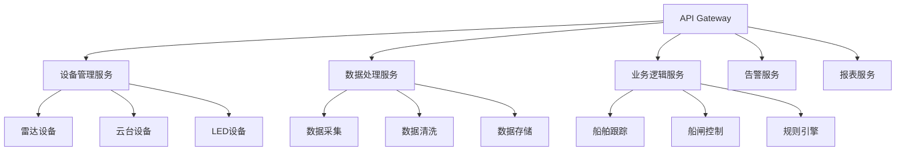

# 1. 云原生架构设计

## 1.1 云原生概述

### 1.1.1 云原生定义

云原生是一种构建和运行应用程序的方法，它充分利用云计算模型的优势。对于葛洲坝船闸导航系统，云原生架构将带来以下核心价值：

- **弹性伸缩**：根据负载自动调整资源
- **高可用性**：多副本部署，故障自动恢复
- **可观测性**：全链路监控和追踪
- **安全性**：零信任架构，多层安全防护
- **DevOps**：自动化部署和运维

### 1.1.2 架构演进

```text
传统架构 → 容器化 → 微服务 → 云原生
    ↓         ↓        ↓         ↓
  单体应用    Docker  服务拆分    K8s+Istio
  手动部署    容器    服务发现    服务网格
  垂直扩展    编排    负载均衡    可观测性
```

## 1.2 Kubernetes部署架构

### 1.2.1 集群架构设计

```yaml
# 集群拓扑
┌─────────────────────────────────────────────────────────┐
│                    Kubernetes集群                        │
│  ┌─────────────────┐  ┌─────────────────┐              │
│  │   控制平面       │  │   工作节点       │              │
│  │  ┌─────────────┐│  │  ┌─────────────┐│              │
│  │  │ API Server  ││  │  │   Node 1    ││              │
│  │  │ Scheduler   ││  │  │   Node 2    ││              │
│  │  │ Controller  ││  │  │   Node 3    ││              │
│  │  │ etcd        ││  │  │   Node N    ││              │
│  │  └─────────────┘│  │  └─────────────┘│              │
│  └─────────────────┘  └─────────────────┘              │
└─────────────────────────────────────────────────────────┘
```

### 1.2.2 命名空间设计

```yaml
# 命名空间规划
apiVersion: v1
kind: Namespace
metadata:
  name: navlock-system
  labels:
    name: navlock-system
    purpose: system-components

---
apiVersion: v1
kind: Namespace
metadata:
  name: navlock-devices
  labels:
    name: navlock-devices
    purpose: device-management

---
apiVersion: v1
kind: Namespace
metadata:
  name: navlock-data
  labels:
    name: navlock-data
    purpose: data-processing

---
apiVersion: v1
kind: Namespace
metadata:
  name: navlock-business
  labels:
    name: navlock-business
    purpose: business-logic

---
apiVersion: v1
kind: Namespace
metadata:
  name: navlock-monitoring
  labels:
    name: navlock-monitoring
    purpose: observability
```

### 1.2.3 资源配额管理

```yaml
# 资源配额配置
apiVersion: v1
kind: ResourceQuota
metadata:
  name: navlock-quota
  namespace: navlock-system
spec:
  hard:
    requests.cpu: "8"
    requests.memory: 16Gi
    limits.cpu: "16"
    limits.memory: 32Gi
    pods: "20"
    services: "10"
    persistentvolumeclaims: "5"
```

## 1.3 微服务拆分策略

### 1.3.1 服务边界定义

基于领域驱动设计(DDD)原则，将船闸导航系统拆分为以下微服务：



### 1.3.2 服务拆分原则

-**1. 单一职责原则**

- 每个服务只负责一个业务领域
- 服务间松耦合，高内聚
- 独立开发、部署和扩展

-**2. 数据所有权**

- 每个服务拥有自己的数据
- 通过API进行数据交互
- 避免跨服务直接访问数据库

-**3. 服务粒度**

- 服务大小适中，便于管理
- 避免过度拆分导致复杂性
- 考虑团队组织架构

### 1.3.3 服务定义示例

```yaml
# 设备管理服务
apiVersion: apps/v1
kind: Deployment
metadata:
  name: device-management-service
  namespace: navlock-devices
  labels:
    app: device-management
    version: v1
spec:
  replicas: 3
  selector:
    matchLabels:
      app: device-management
  template:
    metadata:
      labels:
        app: device-management
        version: v1
    spec:
      containers:
      - name: device-management
        image: navlock/device-management:v1.0.0
        ports:
        - containerPort: 8080
        env:
        - name: DATABASE_URL
          valueFrom:
            secretKeyRef:
              name: navlock-secrets
              key: database-url
        - name: REDIS_URL
          valueFrom:
            configMapKeyRef:
              name: navlock-config
              key: redis-url
        resources:
          requests:
            memory: "256Mi"
            cpu: "250m"
          limits:
            memory: "512Mi"
            cpu: "500m"
        livenessProbe:
          httpGet:
            path: /health
            port: 8080
          initialDelaySeconds: 30
          periodSeconds: 10
        readinessProbe:
          httpGet:
            path: /ready
            port: 8080
          initialDelaySeconds: 5
          periodSeconds: 5
```

## 1.4 服务网格集成

### 1.4.1 Istio架构

```yaml
# Istio服务网格配置
apiVersion: install.istio.io/v1alpha1
kind: IstioOperator
metadata:
  namespace: istio-system
spec:
  profile: production
  components:
    pilot:
      k8s:
        resources:
          requests:
            cpu: 500m
            memory: 2048Mi
          limits:
            cpu: 1000m
            memory: 4096Mi
    telemetry:
      k8s:
        resources:
          requests:
            cpu: 100m
            memory: 128Mi
          limits:
            cpu: 500m
            memory: 256Mi
    policy:
      k8s:
        resources:
          requests:
            cpu: 100m
            memory: 128Mi
          limits:
            cpu: 500m
            memory: 256Mi
```

### 1.4.2 流量管理

```yaml
# 虚拟服务配置
apiVersion: networking.istio.io/v1alpha3
kind: VirtualService
metadata:
  name: navlock-api
  namespace: navlock-system
spec:
  hosts:
  - navlock-api.example.com
  gateways:
  - navlock-gateway
  http:
  - match:
    - uri:
        prefix: /api/v1/devices
    route:
    - destination:
        host: device-management-service
        port:
          number: 8080
      weight: 100
  - match:
    - uri:
        prefix: /api/v1/ships
    route:
    - destination:
        host: ship-tracking-service
        port:
          number: 8080
      weight: 100
```

### 1.4.3 负载均衡策略

```yaml
# 目标规则配置
apiVersion: networking.istio.io/v1alpha3
kind: DestinationRule
metadata:
  name: navlock-services
  namespace: navlock-system
spec:
  host: "*.navlock-system.svc.cluster.local"
  trafficPolicy:
    loadBalancer:
      simple: ROUND_ROBIN
    connectionPool:
      tcp:
        maxConnections: 100
        connectTimeout: 30ms
      http:
        http2MaxRequests: 1000
        maxRequestsPerConnection: 10
    outlierDetection:
      consecutive5xxErrors: 5
      interval: 10s
      baseEjectionTime: 30s
      maxEjectionPercent: 10
```

## 1.5 容器化最佳实践

### 1.5.1 Dockerfile优化

```dockerfile
# 多阶段构建优化
# 构建阶段
FROM golang:1.24-alpine AS builder

WORKDIR /app

# 安装依赖
COPY go.mod go.sum ./
RUN go mod download

# 复制源代码
COPY . .

# 构建应用
RUN CGO_ENABLED=0 GOOS=linux go build -a -installsuffix cgo -o navlock-service ./cmd/server/navlock-gezhouba

# 运行阶段
FROM alpine:latest

RUN apk --no-cache add ca-certificates tzdata

WORKDIR /root/

# 从构建阶段复制二进制文件
COPY --from=builder /app/navlock-service .

# 创建非root用户
RUN addgroup -g 1000 navlock && \
    adduser -D -s /bin/sh -u 1000 -G navlock navlock

USER navlock

EXPOSE 8080

CMD ["./navlock-service"]
```

### 1.5.2 容器安全配置

```yaml
# Pod安全策略
apiVersion: policy/v1beta1
kind: PodSecurityPolicy
metadata:
  name: navlock-psp
spec:
  privileged: false
  allowPrivilegeEscalation: false
  requiredDropCapabilities:
  - ALL
  volumes:
  - 'configMap'
  - 'emptyDir'
  - 'projected'
  - 'secret'
  - 'downwardAPI'
  - 'persistentVolumeClaim'
  hostNetwork: false
  hostIPC: false
  hostPID: false
  runAsUser:
    rule: 'MustRunAsNonRoot'
  seLinux:
    rule: 'RunAsAny'
  supplementalGroups:
    rule: 'MustRunAs'
    ranges:
    - min: 1
      max: 65535
  fsGroup:
    rule: 'MustRunAs'
    ranges:
    - min: 1
      max: 65535
  readOnlyRootFilesystem: true
```

### 1.5.3 资源管理

```yaml
# 资源限制配置
apiVersion: v1
kind: LimitRange
metadata:
  name: navlock-limits
  namespace: navlock-system
spec:
  limits:
  - default:
      memory: 512Mi
      cpu: 500m
    defaultRequest:
      memory: 256Mi
      cpu: 250m
    type: Container
  - max:
      memory: 2Gi
      cpu: 2000m
    min:
      memory: 64Mi
      cpu: 50m
    type: Container
```

## 1.6 高可用性设计

### 1.6.1 多副本部署

```yaml
# 高可用部署配置
apiVersion: apps/v1
kind: Deployment
metadata:
  name: navlock-service-ha
  namespace: navlock-system
spec:
  replicas: 3
  strategy:
    type: RollingUpdate
    rollingUpdate:
      maxSurge: 1
      maxUnavailable: 0
  selector:
    matchLabels:
      app: navlock-service
  template:
    metadata:
      labels:
        app: navlock-service
    spec:
      affinity:
        podAntiAffinity:
          preferredDuringSchedulingIgnoredDuringExecution:
          - weight: 100
            podAffinityTerm:
              labelSelector:
                matchExpressions:
                - key: app
                  operator: In
                  values:
                  - navlock-service
              topologyKey: kubernetes.io/hostname
      containers:
      - name: navlock-service
        image: navlock/navlock-service:v1.0.0
        ports:
        - containerPort: 8080
        readinessProbe:
          httpGet:
            path: /ready
            port: 8080
          initialDelaySeconds: 5
          periodSeconds: 5
        livenessProbe:
          httpGet:
            path: /health
            port: 8080
          initialDelaySeconds: 30
          periodSeconds: 10
```

### 1.6.2 自动扩缩容

```yaml
# HPA配置
apiVersion: autoscaling/v2
kind: HorizontalPodAutoscaler
metadata:
  name: navlock-service-hpa
  namespace: navlock-system
spec:
  scaleTargetRef:
    apiVersion: apps/v1
    kind: Deployment
    name: navlock-service-ha
  minReplicas: 3
  maxReplicas: 10
  metrics:
  - type: Resource
    resource:
      name: cpu
      target:
        type: Utilization
        averageUtilization: 70
  - type: Resource
    resource:
      name: memory
      target:
        type: Utilization
        averageUtilization: 80
  behavior:
    scaleDown:
      stabilizationWindowSeconds: 300
      policies:
      - type: Percent
        value: 10
        periodSeconds: 60
    scaleUp:
      stabilizationWindowSeconds: 60
      policies:
      - type: Percent
        value: 100
        periodSeconds: 15
```

## 1.7 网络策略

### 1.7.1 网络隔离

```yaml
# 网络策略配置
apiVersion: networking.k8s.io/v1
kind: NetworkPolicy
metadata:
  name: navlock-network-policy
  namespace: navlock-system
spec:
  podSelector:
    matchLabels:
      app: navlock-service
  policyTypes:
  - Ingress
  - Egress
  ingress:
  - from:
    - namespaceSelector:
        matchLabels:
          name: navlock-system
    ports:
    - protocol: TCP
      port: 8080
  - from:
    - namespaceSelector:
        matchLabels:
          name: navlock-monitoring
    ports:
    - protocol: TCP
      port: 8080
  egress:
  - to:
    - namespaceSelector:
        matchLabels:
          name: navlock-data
    ports:
    - protocol: TCP
      port: 5432
  - to:
    - namespaceSelector:
        matchLabels:
          name: navlock-devices
    ports:
    - protocol: TCP
      port: 8080
```

### 1.7.2 服务发现

```yaml
# 服务配置
apiVersion: v1
kind: Service
metadata:
  name: navlock-service
  namespace: navlock-system
  labels:
    app: navlock-service
spec:
  type: ClusterIP
  ports:
  - port: 8080
    targetPort: 8080
    protocol: TCP
    name: http
  selector:
    app: navlock-service
```

## 1.8 配置管理

### 1.8.1 ConfigMap管理

```yaml
# 配置映射
apiVersion: v1
kind: ConfigMap
metadata:
  name: navlock-config
  namespace: navlock-system
data:
  app.yaml: |
    server:
      port: 8080
      host: 0.0.0.0
    
    database:
      host: navlock-db.navlock-data.svc.cluster.local
      port: 5432
      name: navlock_prod
    
    redis:
      host: navlock-redis.navlock-data.svc.cluster.local
      port: 6379
    
    kafka:
      brokers:
      - navlock-kafka.navlock-data.svc.cluster.local:9092
      topic: navlock-events
    
    observability:
      jaeger_endpoint: http://jaeger-collector.navlock-monitoring.svc.cluster.local:14268/api/traces
      prometheus_endpoint: http://prometheus.navlock-monitoring.svc.cluster.local:9090
```

### 1.8.2 Secret管理

```yaml
# 密钥管理
apiVersion: v1
kind: Secret
metadata:
  name: navlock-secrets
  namespace: navlock-system
type: Opaque
data:
  database-url: cG9zdGdyZXM6Ly9uYXZsb2NrOnNlY3JldEBuYXZsb2NrLWRiOjU0MzIvbmF2bG9ja19wcm9k
  redis-password: c2VjcmV0LXBhc3N3b3Jk
  jwt-secret: c2VjcmV0LWp3dC1rZXk=
```

## 1.9 监控和告警

### 1.9.1 服务监控

```yaml
# ServiceMonitor配置
apiVersion: monitoring.coreos.com/v1
kind: ServiceMonitor
metadata:
  name: navlock-service-monitor
  namespace: navlock-monitoring
  labels:
    release: prometheus
spec:
  selector:
    matchLabels:
      app: navlock-service
  endpoints:
  - port: http
    path: /metrics
    interval: 30s
    scrapeTimeout: 10s
```

### 1.9.2 告警规则

```yaml
# PrometheusRule配置
apiVersion: monitoring.coreos.com/v1
kind: PrometheusRule
metadata:
  name: navlock-alerts
  namespace: navlock-monitoring
  labels:
    release: prometheus
spec:
  groups:
  - name: navlock.rules
    rules:
    - alert: NavlockServiceDown
      expr: up{job="navlock-service"} == 0
      for: 1m
      labels:
        severity: critical
      annotations:
        summary: "Navlock服务不可用"
        description: "Navlock服务已停止运行超过1分钟"
    
    - alert: NavlockHighCPU
      expr: rate(container_cpu_usage_seconds_total{container="navlock-service"}[5m]) > 0.8
      for: 5m
      labels:
        severity: warning
      annotations:
        summary: "Navlock服务CPU使用率过高"
        description: "CPU使用率超过80%持续5分钟"
```

## 1.10 部署策略

### 1.10.1 蓝绿部署

```yaml
# 蓝绿部署配置
apiVersion: argoproj.io/v1alpha1
kind: Rollout
metadata:
  name: navlock-service-rollout
  namespace: navlock-system
spec:
  replicas: 3
  selector:
    matchLabels:
      app: navlock-service
  template:
    metadata:
      labels:
        app: navlock-service
    spec:
      containers:
      - name: navlock-service
        image: navlock/navlock-service:v1.0.0
        ports:
        - containerPort: 8080
  strategy:
    blueGreen:
      activeService: navlock-service-active
      previewService: navlock-service-preview
      autoPromotionEnabled: false
      scaleDownDelaySeconds: 30
      prePromotionAnalysis:
        templates:
        - templateName: success-rate
        args:
        - name: service-name
          value: navlock-service-preview
      postPromotionAnalysis:
        templates:
        - templateName: success-rate
        args:
        - name: service-name
          value: navlock-service-active
```

### 1.10.2 金丝雀发布

```yaml
# 金丝雀发布配置
apiVersion: argoproj.io/v1alpha1
kind: Rollout
metadata:
  name: navlock-service-canary
  namespace: navlock-system
spec:
  replicas: 5
  selector:
    matchLabels:
      app: navlock-service
  template:
    metadata:
      labels:
        app: navlock-service
    spec:
      containers:
      - name: navlock-service
        image: navlock/navlock-service:v1.0.0
        ports:
        - containerPort: 8080
  strategy:
    canary:
      steps:
      - setWeight: 20
      - pause: {duration: 60s}
      - setWeight: 40
      - pause: {duration: 60s}
      - setWeight: 60
      - pause: {duration: 60s}
      - setWeight: 80
      - pause: {duration: 60s}
      - setWeight: 100
      analysis:
        templates:
        - templateName: success-rate
        args:
        - name: service-name
          value: navlock-service
```

## 1.11 总结

云原生架构设计为葛洲坝船闸导航系统提供了现代化的部署和运维能力。通过Kubernetes容器编排、Istio服务网格、微服务拆分等技术的应用，系统获得了：

**核心优势：**

1. **高可用性**：多副本部署，自动故障恢复
2. **弹性伸缩**：根据负载自动调整资源
3. **服务治理**：统一的服务发现、负载均衡、熔断
4. **安全隔离**：网络策略、Pod安全策略
5. **可观测性**：集成监控、日志、追踪
6. **部署灵活**：蓝绿部署、金丝雀发布

**实施建议：**

1. 渐进式迁移，先容器化再微服务化
2. 建立完善的监控和告警体系
3. 制定详细的网络和安全策略
4. 培训团队掌握云原生技术
5. 建立自动化运维流程

这个云原生架构为系统的长期发展提供了坚实的技术基础，使其能够更好地适应未来的业务需求和技术发展。
