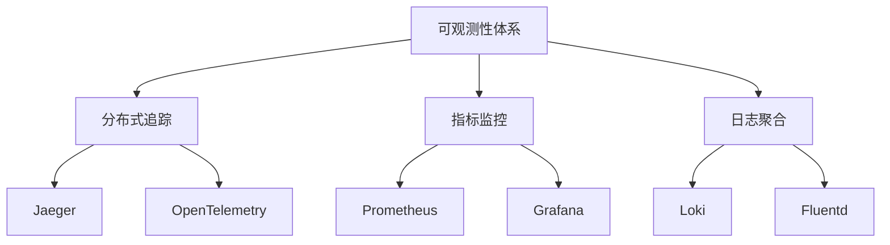

# 2. 可观测性体系设计

## 2.1 可观测性概述

### 2.1.1 可观测性定义

可观测性(Observability)是指通过外部输出来推断系统内部状态的能力。对于葛洲坝船闸导航系统，可观测性体系将提供：

- **分布式追踪**：全链路请求追踪
- **指标监控**：系统性能指标收集
- **日志聚合**：结构化日志管理
- **告警通知**：异常情况及时通知
- **可视化展示**：数据可视化分析

### 2.1.2 可观测性三大支柱



## 2.2 OpenTelemetry集成

### 2.2.1 OpenTelemetry架构

OpenTelemetry是一个统一的可观测性标准，提供：

```yaml
# OpenTelemetry Collector配置
apiVersion: v1
kind: ConfigMap
metadata:
  name: otel-collector-config
  namespace: navlock-monitoring
data:
  config.yaml: |
    receivers:
      otlp:
        protocols:
          grpc:
            endpoint: 0.0.0.0:4317
          http:
            endpoint: 0.0.0.0:4318
    
    processors:
      batch:
        timeout: 1s
        send_batch_size: 1024
      memory_limiter:
        check_interval: 1s
        limit_mib: 1500
      resource:
        attributes:
          - key: environment
            value: production
            action: upsert
    
    exporters:
      jaeger:
        endpoint: jaeger-collector:14250
        tls:
          insecure: true
      prometheus:
        endpoint: "0.0.0.0:9464"
        namespace: navlock
        const_labels:
          label1: value1
      logging:
        loglevel: debug
    
    service:
      pipelines:
        traces:
          receivers: [otlp]
          processors: [batch, memory_limiter, resource]
          exporters: [jaeger, logging]
        metrics:
          receivers: [otlp]
          processors: [batch, memory_limiter, resource]
          exporters: [prometheus, logging]
        logs:
          receivers: [otlp]
          processors: [batch, memory_limiter, resource]
          exporters: [logging]
```

### 2.2.2 Go应用集成

```go
// OpenTelemetry集成示例
package main

import (
    "context"
    "log"
    "time"

    "go.opentelemetry.io/otel"
    "go.opentelemetry.io/otel/attribute"
    "go.opentelemetry.io/otel/exporters/jaeger"
    "go.opentelemetry.io/otel/sdk/resource"
    sdktrace "go.opentelemetry.io/otel/sdk/trace"
    semconv "go.opentelemetry.io/otel/semconv/v1.4.0"
    "go.opentelemetry.io/otel/trace"
)

// 初始化OpenTelemetry
func initTracer() (*sdktrace.TracerProvider, error) {
    // 创建Jaeger导出器
    exp, err := jaeger.New(jaeger.WithCollectorEndpoint(jaeger.WithEndpoint("http://jaeger-collector:14268/api/traces")))
    if err != nil {
        return nil, err
    }

    // 创建资源
    res, err := resource.New(context.Background(),
        resource.WithAttributes(
            semconv.ServiceNameKey.String("navlock-service"),
            semconv.ServiceVersionKey.String("1.0.0"),
            attribute.String("environment", "production"),
        ),
    )
    if err != nil {
        return nil, err
    }

    // 创建TracerProvider
    tp := sdktrace.NewTracerProvider(
        sdktrace.WithBatcher(exp),
        sdktrace.WithResource(res),
    )
    otel.SetTracerProvider(tp)
    return tp, nil
}

// 船舶跟踪服务示例
type ShipTrackingService struct {
    tracer trace.Tracer
    logger *zap.Logger
}

func NewShipTrackingService() *ShipTrackingService {
    tracer := otel.Tracer("ship-tracking")
    logger, _ := zap.NewProduction()
    
    return &ShipTrackingService{
        tracer: tracer,
        logger: logger,
    }
}

func (s *ShipTrackingService) TrackShip(ctx context.Context, shipID string) error {
    // 创建span
    ctx, span := s.tracer.Start(ctx, "track_ship")
    defer span.End()

    // 设置span属性
    span.SetAttributes(
        attribute.String("ship.id", shipID),
        attribute.String("service.name", "ship_tracking"),
        attribute.String("operation", "track_ship"),
    )

    // 记录日志
    s.logger.Info("开始跟踪船舶",
        zap.String("ship_id", shipID),
        zap.String("trace_id", span.SpanContext().TraceID().String()),
        zap.String("span_id", span.SpanContext().SpanID().String()),
    )

    // 模拟业务逻辑
    time.Sleep(100 * time.Millisecond)

    // 记录事件
    span.AddEvent("ship_tracked", trace.WithAttributes(
        attribute.String("ship.id", shipID),
        attribute.String("status", "success"),
    ))

    return nil
}

// 设备管理服务示例
type DeviceManagementService struct {
    tracer trace.Tracer
    meter  metric.Meter
    logger *zap.Logger
}

func NewDeviceManagementService() *DeviceManagementService {
    tracer := otel.Tracer("device-management")
    meter := otel.Meter("device-management")
    logger, _ := zap.NewProduction()

    // 创建指标
    deviceStatusCounter, _ := meter.Int64Counter("device_status_changes",
        metric.WithDescription("设备状态变更次数"),
    )

    return &DeviceManagementService{
        tracer: tracer,
        meter:  meter,
        logger: logger,
    }
}

func (d *DeviceManagementService) UpdateDeviceStatus(ctx context.Context, deviceID string, status string) error {
    ctx, span := d.tracer.Start(ctx, "update_device_status")
    defer span.End()

    span.SetAttributes(
        attribute.String("device.id", deviceID),
        attribute.String("device.status", status),
    )

    // 记录指标
    d.meter.RecordBatch(ctx, []attribute.KeyValue{
        attribute.String("device.id", deviceID),
        attribute.String("device.status", status),
    }, d.deviceStatusCounter.Measurement(1))

    d.logger.Info("设备状态更新",
        zap.String("device_id", deviceID),
        zap.String("status", status),
        zap.String("trace_id", span.SpanContext().TraceID().String()),
    )

    return nil
}
```

### 2.2.3 中间件集成

```go
// HTTP中间件
func OpenTelemetryMiddleware(next http.Handler) http.Handler {
    return http.HandlerFunc(func(w http.ResponseWriter, r *http.Request) {
        tracer := otel.Tracer("http-server")
        
        // 从请求头提取trace context
        ctx := otel.GetTextMapPropagator().Extract(r.Context(), propagation.HeaderCarrier(r.Header))
        
        // 创建span
        ctx, span := tracer.Start(ctx, r.URL.Path,
            trace.WithAttributes(
                attribute.String("http.method", r.Method),
                attribute.String("http.url", r.URL.String()),
                attribute.String("http.user_agent", r.UserAgent()),
            ),
        )
        defer span.End()

        // 注入trace context到响应头
        otel.GetTextMapPropagator().Inject(ctx, propagation.HeaderCarrier(w.Header()))

        // 包装ResponseWriter以捕获状态码
        wrappedWriter := &responseWriter{ResponseWriter: w, statusCode: 200}
        
        next.ServeHTTP(wrappedWriter, r.WithContext(ctx))

        // 设置span属性
        span.SetAttributes(attribute.Int("http.status_code", wrappedWriter.statusCode))
    })
}

type responseWriter struct {
    http.ResponseWriter
    statusCode int
}

func (rw *responseWriter) WriteHeader(code int) {
    rw.statusCode = code
    rw.ResponseWriter.WriteHeader(code)
}

// gRPC中间件
func OpenTelemetryUnaryInterceptor() grpc.UnaryServerInterceptor {
    return func(ctx context.Context, req interface{}, info *grpc.UnaryServerInfo, handler grpc.UnaryHandler) (interface{}, error) {
        tracer := otel.Tracer("grpc-server")
        
        ctx, span := tracer.Start(ctx, info.FullMethod,
            trace.WithAttributes(
                attribute.String("grpc.method", info.FullMethod),
                attribute.String("grpc.service", info.Server),
            ),
        )
        defer span.End()

        resp, err := handler(ctx, req)
        
        if err != nil {
            span.SetAttributes(attribute.String("grpc.error", err.Error()))
        }

        return resp, err
    }
}
```

## 2.3 分布式追踪

### 2.3.1 Jaeger部署

```yaml
# Jaeger部署配置
apiVersion: apps/v1
kind: Deployment
metadata:
  name: jaeger
  namespace: navlock-monitoring
  labels:
    app: jaeger
spec:
  replicas: 1
  selector:
    matchLabels:
      app: jaeger
  template:
    metadata:
      labels:
        app: jaeger
    spec:
      containers:
      - name: jaeger
        image: jaegertracing/all-in-one:1.42
        ports:
        - containerPort: 16686
          name: ui
        - containerPort: 14268
          name: http
        - containerPort: 14250
          name: grpc
        env:
        - name: COLLECTOR_OTLP_ENABLED
          value: "true"
        - name: COLLECTOR_ZIPKIN_HOST_PORT
          value: ":9411"
        resources:
          limits:
            cpu: 500m
            memory: 512Mi
          requests:
            cpu: 100m
            memory: 128Mi
---
apiVersion: v1
kind: Service
metadata:
  name: jaeger
  namespace: navlock-monitoring
  labels:
    app: jaeger
spec:
  ports:
  - port: 16686
    targetPort: ui
    name: ui
  - port: 14268
    targetPort: http
    name: http
  - port: 14250
    targetPort: grpc
    name: grpc
  selector:
    app: jaeger
```

### 2.3.2 追踪配置

```go
// 追踪配置
type TracingConfig struct {
    ServiceName    string
    ServiceVersion string
    Environment    string
    JaegerEndpoint string
    SamplingRate   float64
}

func SetupTracing(config TracingConfig) (*sdktrace.TracerProvider, error) {
    // 创建Jaeger导出器
    exp, err := jaeger.New(jaeger.WithCollectorEndpoint(
        jaeger.WithEndpoint(config.JaegerEndpoint),
    ))
    if err != nil {
        return nil, err
    }

    // 创建资源
    res, err := resource.New(context.Background(),
        resource.WithAttributes(
            semconv.ServiceNameKey.String(config.ServiceName),
            semconv.ServiceVersionKey.String(config.ServiceVersion),
            attribute.String("environment", config.Environment),
        ),
    )
    if err != nil {
        return nil, err
    }

    // 创建采样器
    sampler := sdktrace.TraceIDRatioBased(config.SamplingRate)

    // 创建TracerProvider
    tp := sdktrace.NewTracerProvider(
        sdktrace.WithBatcher(exp),
        sdktrace.WithResource(res),
        sdktrace.WithSampler(sampler),
    )

    // 设置全局TracerProvider
    otel.SetTracerProvider(tp)
    otel.SetTextMapPropagator(propagation.NewCompositeTextMapPropagator(
        propagation.TraceContext{},
        propagation.Baggage{},
    ))

    return tp, nil
}

// 业务追踪示例
func (s *ShipTrackingService) ProcessShipPassage(ctx context.Context, shipID string) error {
    ctx, span := s.tracer.Start(ctx, "process_ship_passage")
    defer span.End()

    span.SetAttributes(
        attribute.String("ship.id", shipID),
        attribute.String("operation", "process_passage"),
    )

    // 子操作1：验证船舶信息
    ctx, validateSpan := s.tracer.Start(ctx, "validate_ship_info")
    if err := s.validateShipInfo(ctx, shipID); err != nil {
        validateSpan.SetAttributes(attribute.String("error", err.Error()))
        validateSpan.End()
        return err
    }
    validateSpan.End()

    // 子操作2：计算通行时间
    ctx, calcSpan := s.tracer.Start(ctx, "calculate_passage_time")
    passageTime, err := s.calculatePassageTime(ctx, shipID)
    if err != nil {
        calcSpan.SetAttributes(attribute.String("error", err.Error()))
        calcSpan.End()
        return err
    }
    calcSpan.SetAttributes(attribute.Int64("passage_time_ms", passageTime.Milliseconds()))
    calcSpan.End()

    // 子操作3：更新数据库
    ctx, dbSpan := s.tracer.Start(ctx, "update_database")
    if err := s.updateDatabase(ctx, shipID, passageTime); err != nil {
        dbSpan.SetAttributes(attribute.String("error", err.Error()))
        dbSpan.End()
        return err
    }
    dbSpan.End()

    span.AddEvent("ship_passage_completed", trace.WithAttributes(
        attribute.String("ship.id", shipID),
        attribute.Int64("passage_time_ms", passageTime.Milliseconds()),
    ))

    return nil
}
```

## 2.4 指标监控

### 2.4.1 Prometheus配置

```yaml
# Prometheus配置
apiVersion: v1
kind: ConfigMap
metadata:
  name: prometheus-config
  namespace: navlock-monitoring
data:
  prometheus.yml: |
    global:
      scrape_interval: 15s
      evaluation_interval: 15s
    
    rule_files:
      - /etc/prometheus/rules/*.yml
    
    scrape_configs:
      - job_name: 'navlock-services'
        kubernetes_sd_configs:
          - role: pod
        relabel_configs:
          - source_labels: [__meta_kubernetes_pod_annotation_prometheus_io_scrape]
            action: keep
            regex: true
          - source_labels: [__meta_kubernetes_pod_annotation_prometheus_io_path]
            action: replace
            target_label: __metrics_path__
            regex: (.+)
          - source_labels: [__address__, __meta_kubernetes_pod_annotation_prometheus_io_port]
            action: replace
            regex: ([^:]+)(?::\d+)?;(\d+)
            replacement: $1:$2
            target_label: __address__
          - action: labelmap
            regex: __meta_kubernetes_pod_label_(.+)
          - source_labels: [__meta_kubernetes_namespace]
            action: replace
            target_label: kubernetes_namespace
          - source_labels: [__meta_kubernetes_pod_name]
            action: replace
            target_label: kubernetes_pod_name
          - source_labels: [__meta_kubernetes_pod_container_name]
            action: replace
            target_label: kubernetes_container_name

      - job_name: 'navlock-devices'
        static_configs:
          - targets: ['device-manager:8080']
        metrics_path: /metrics
        scrape_interval: 30s

      - job_name: 'navlock-database'
        static_configs:
          - targets: ['navlock-db:5432']
        metrics_path: /metrics
        scrape_interval: 60s
```

### 2.4.2 自定义指标

```go
// 自定义指标定义
type MetricsCollector struct {
    shipPassageCounter    metric.Int64Counter
    deviceStatusGauge     metric.Int64UpDownCounter
    responseTimeHistogram metric.Float64Histogram
    errorCounter          metric.Int64Counter
}

func NewMetricsCollector(meter metric.Meter) *MetricsCollector {
    shipPassageCounter, _ := meter.Int64Counter("ship_passage_total",
        metric.WithDescription("船舶通行总次数"),
    )

    deviceStatusGauge, _ := meter.Int64UpDownCounter("device_status",
        metric.WithDescription("设备状态"),
    )

    responseTimeHistogram, _ := meter.Float64Histogram("http_request_duration_seconds",
        metric.WithDescription("HTTP请求响应时间"),
        metric.WithUnit("s"),
    )

    errorCounter, _ := meter.Int64Counter("errors_total",
        metric.WithDescription("错误总次数"),
    )

    return &MetricsCollector{
        shipPassageCounter:    shipPassageCounter,
        deviceStatusGauge:     deviceStatusGauge,
        responseTimeHistogram: responseTimeHistogram,
        errorCounter:          errorCounter,
    }
}

// 业务指标记录
func (s *ShipTrackingService) RecordShipPassage(ctx context.Context, shipID string, passageTime time.Duration) {
    s.metrics.shipPassageCounter.Add(ctx, 1,
        metric.WithAttributes(
            attribute.String("ship.id", shipID),
            attribute.String("direction", "upstream"),
        ),
    )

    s.metrics.responseTimeHistogram.Record(ctx, passageTime.Seconds(),
        metric.WithAttributes(
            attribute.String("operation", "ship_passage"),
        ),
    )
}

func (s *DeviceManagementService) UpdateDeviceStatus(ctx context.Context, deviceID string, status int) {
    s.metrics.deviceStatusGauge.Add(ctx, int64(status),
        metric.WithAttributes(
            attribute.String("device.id", deviceID),
            attribute.String("device.type", "radar"),
        ),
    )
}

func (s *ShipTrackingService) RecordError(ctx context.Context, operation string, errorType string) {
    s.metrics.errorCounter.Add(ctx, 1,
        metric.WithAttributes(
            attribute.String("operation", operation),
            attribute.String("error.type", errorType),
        ),
    )
}
```

### 2.4.3 告警规则

```yaml
# 告警规则配置
apiVersion: monitoring.coreos.com/v1
kind: PrometheusRule
metadata:
  name: navlock-alerts
  namespace: navlock-monitoring
  labels:
    release: prometheus
spec:
  groups:
  - name: navlock.rules
    rules:
    # 服务可用性告警
    - alert: NavlockServiceDown
      expr: up{job="navlock-services"} == 0
      for: 1m
      labels:
        severity: critical
        service: navlock
      annotations:
        summary: "Navlock服务不可用"
        description: "服务 {{ $labels.instance }} 已停止运行超过1分钟"
        runbook_url: "https://wiki.example.com/navlock-service-down"

    # 高CPU使用率告警
    - alert: NavlockHighCPU
      expr: rate(container_cpu_usage_seconds_total{container="navlock-service"}[5m]) > 0.8
      for: 5m
      labels:
        severity: warning
        service: navlock
      annotations:
        summary: "Navlock服务CPU使用率过高"
        description: "CPU使用率超过80%持续5分钟，当前值: {{ $value }}"

    # 高内存使用率告警
    - alert: NavlockHighMemory
      expr: (container_memory_usage_bytes{container="navlock-service"} / container_spec_memory_limit_bytes{container="navlock-service"}) > 0.85
      for: 5m
      labels:
        severity: warning
        service: navlock
      annotations:
        summary: "Navlock服务内存使用率过高"
        description: "内存使用率超过85%持续5分钟，当前值: {{ $value | humanizePercentage }}"

    # 错误率告警
    - alert: NavlockHighErrorRate
      expr: rate(errors_total{service="navlock"}[5m]) > 0.1
      for: 2m
      labels:
        severity: critical
        service: navlock
      annotations:
        summary: "Navlock服务错误率过高"
        description: "错误率超过10%持续2分钟，当前值: {{ $value | humanizePercentage }}"

    # 响应时间告警
    - alert: NavlockSlowResponse
      expr: histogram_quantile(0.95, rate(http_request_duration_seconds_bucket{service="navlock"}[5m])) > 2
      for: 5m
      labels:
        severity: warning
        service: navlock
      annotations:
        summary: "Navlock服务响应时间过长"
        description: "95%分位响应时间超过2秒持续5分钟，当前值: {{ $value }}s"

    # 设备离线告警
    - alert: NavlockDeviceOffline
      expr: device_status{device_type="radar"} == 0
      for: 5m
      labels:
        severity: critical
        service: navlock
      annotations:
        summary: "雷达设备离线"
        description: "设备 {{ $labels.device_id }} 已离线超过5分钟"

    # 船舶通行异常告警
    - alert: NavlockShipPassageAnomaly
      expr: rate(ship_passage_total{service="navlock"}[10m]) < 0.1
      for: 10m
      labels:
        severity: warning
        service: navlock
      annotations:
        summary: "船舶通行异常"
        description: "10分钟内船舶通行次数异常减少，当前值: {{ $value }}"
```

## 2.5 日志聚合

### 2.5.1 Loki配置

```yaml
# Loki部署配置
apiVersion: apps/v1
kind: StatefulSet
metadata:
  name: loki
  namespace: navlock-monitoring
spec:
  serviceName: loki
  replicas: 1
  selector:
    matchLabels:
      app: loki
  template:
    metadata:
      labels:
        app: loki
    spec:
      containers:
      - name: loki
        image: grafana/loki:2.8.0
        args:
        - -config.file=/etc/loki/local-config.yaml
        ports:
        - containerPort: 3100
          name: http-metrics
        volumeMounts:
        - name: loki-config
          mountPath: /etc/loki
        - name: loki-data
          mountPath: /loki
        resources:
          limits:
            cpu: 1000m
            memory: 2Gi
          requests:
            cpu: 500m
            memory: 1Gi
      volumes:
      - name: loki-config
        configMap:
          name: loki-config
  volumeClaimTemplates:
  - metadata:
      name: loki-data
    spec:
      accessModes: ["ReadWriteOnce"]
      resources:
        requests:
          storage: 10Gi
---
apiVersion: v1
kind: ConfigMap
metadata:
  name: loki-config
  namespace: navlock-monitoring
data:
  local-config.yaml: |
    auth_enabled: false
    
    server:
      http_listen_port: 3100
    
    ingester:
      lifecycler:
        address: 127.0.0.1
        ring:
          kvstore:
            store: inmemory
          replication_factor: 1
        final_sleep: 0s
      chunk_idle_period: 5m
      chunk_retain_period: 30s
    
    schema_config:
      configs:
        - from: 2020-10-24
          store: boltdb-shipper
          object_store: filesystem
          schema: v11
          index:
            prefix: index_
            period: 24h
    
    storage_config:
      boltdb_shipper:
        active_index_directory: /loki/boltdb-shipper-active
        cache_location: /loki/boltdb-shipper-cache
        cache_ttl: 24h
        shared_store: filesystem
      filesystem:
        directory: /loki/chunks
    
    limits_config:
      enforce_metric_name: false
      reject_old_samples: true
      reject_old_samples_max_age: 168h
    
    chunk_store_config:
      max_look_back_period: 0s
    
    table_manager:
      retention_deletes_enabled: false
      retention_period: 0s
```

### 2.5.2 Fluentd配置

```yaml
# Fluentd配置
apiVersion: v1
kind: ConfigMap
metadata:
  name: fluentd-config
  namespace: navlock-monitoring
data:
  fluent.conf: |
    <source>
      @type tail
      path /var/log/containers/*navlock*.log
      pos_file /var/log/fluentd-containers.log.pos
      tag kubernetes.*
      read_from_head true
      <parse>
        @type json
        time_format %Y-%m-%dT%H:%M:%S.%NZ
      </parse>
    </source>

    <filter kubernetes.**>
      @type kubernetes_metadata
      @id filter_kube_metadata
    </filter>

    <filter kubernetes.**>
      @type record_transformer
      enable_ruby true
      <record>
        service_name ${record['kubernetes']['labels']['app']}
        pod_name ${record['kubernetes']['pod_name']}
        namespace ${record['kubernetes']['namespace_name']}
        container_name ${record['kubernetes']['container_name']}
        trace_id ${record['trace_id']}
        span_id ${record['span_id']}
      </record>
    </filter>

    <match kubernetes.**>
      @type loki
      url http://loki:3100
      <label>
        service_name
        pod_name
        namespace
        container_name
      </label>
      <buffer>
        @type memory
        flush_interval 5s
        chunk_limit_size 2M
        queue_limit_length 8
        retry_max_interval 30
        retry_forever false
      </buffer>
    </match>
```

### 2.5.3 结构化日志

```go
// 结构化日志配置
type LoggerConfig struct {
    Level      string
    Format     string
    OutputPath string
    Service    string
    Version    string
}

func NewLogger(config LoggerConfig) (*zap.Logger, error) {
    var zapConfig zap.Config

    if config.Format == "json" {
        zapConfig = zap.NewProductionConfig()
    } else {
        zapConfig = zap.NewDevelopmentConfig()
    }

    zapConfig.Level = zap.NewAtomicLevelAt(getLogLevel(config.Level))
    zapConfig.OutputPaths = []string{config.OutputPath, "stdout"}
    zapConfig.ErrorOutputPaths = []string{config.OutputPath, "stderr"}

    logger, err := zapConfig.Build(
        zap.Fields(
            zap.String("service", config.Service),
            zap.String("version", config.Version),
        ),
    )
    if err != nil {
        return nil, err
    }

    return logger, nil
}

func getLogLevel(level string) zapcore.Level {
    switch level {
    case "debug":
        return zapcore.DebugLevel
    case "info":
        return zapcore.InfoLevel
    case "warn":
        return zapcore.WarnLevel
    case "error":
        return zapcore.ErrorLevel
    default:
        return zapcore.InfoLevel
    }
}

// 业务日志示例
func (s *ShipTrackingService) ProcessShipData(ctx context.Context, shipID string, data *ShipData) error {
    logger := s.logger.With(
        zap.String("ship_id", shipID),
        zap.String("operation", "process_ship_data"),
    )

    if span := trace.SpanFromContext(ctx); span != nil {
        logger = logger.With(
            zap.String("trace_id", span.SpanContext().TraceID().String()),
            zap.String("span_id", span.SpanContext().SpanID().String()),
        )
    }

    logger.Info("开始处理船舶数据",
        zap.Float64("speed", data.Speed),
        zap.Float64("position_x", data.Position.X),
        zap.Float64("position_y", data.Position.Y),
    )

    // 数据验证
    if err := s.validateShipData(data); err != nil {
        logger.Error("船舶数据验证失败",
            zap.Error(err),
            zap.Any("data", data),
        )
        return err
    }

    // 数据处理
    if err := s.processData(ctx, data); err != nil {
        logger.Error("船舶数据处理失败",
            zap.Error(err),
            zap.String("ship_id", shipID),
        )
        return err
    }

    logger.Info("船舶数据处理完成",
        zap.String("ship_id", shipID),
        zap.Duration("processing_time", time.Since(time.Now())),
    )

    return nil
}
```

## 2.6 Grafana可视化

### 2.6.1 仪表板配置

```json
{
  "dashboard": {
    "id": null,
    "title": "Navlock系统监控",
    "tags": ["navlock", "monitoring"],
    "timezone": "browser",
    "panels": [
      {
        "id": 1,
        "title": "服务可用性",
        "type": "stat",
        "targets": [
          {
            "expr": "up{job=\"navlock-services\"}",
            "legendFormat": "{{instance}}"
          }
        ],
        "fieldConfig": {
          "defaults": {
            "color": {
              "mode": "thresholds"
            },
            "thresholds": {
              "steps": [
                {"color": "red", "value": 0},
                {"color": "green", "value": 1}
              ]
            }
          }
        }
      },
      {
        "id": 2,
        "title": "CPU使用率",
        "type": "graph",
        "targets": [
          {
            "expr": "rate(container_cpu_usage_seconds_total{container=\"navlock-service\"}[5m]) * 100",
            "legendFormat": "{{pod}}"
          }
        ],
        "yAxes": [
          {
            "label": "CPU使用率 (%)",
            "min": 0,
            "max": 100
          }
        ]
      },
      {
        "id": 3,
        "title": "内存使用率",
        "type": "graph",
        "targets": [
          {
            "expr": "(container_memory_usage_bytes{container=\"navlock-service\"} / container_spec_memory_limit_bytes{container=\"navlock-service\"}) * 100",
            "legendFormat": "{{pod}}"
          }
        ],
        "yAxes": [
          {
            "label": "内存使用率 (%)",
            "min": 0,
            "max": 100
          }
        ]
      },
      {
        "id": 4,
        "title": "错误率",
        "type": "graph",
        "targets": [
          {
            "expr": "rate(errors_total{service=\"navlock\"}[5m])",
            "legendFormat": "{{operation}}"
          }
        ],
        "yAxes": [
          {
            "label": "错误率 (errors/sec)",
            "min": 0
          }
        ]
      },
      {
        "id": 5,
        "title": "响应时间",
        "type": "graph",
        "targets": [
          {
            "expr": "histogram_quantile(0.95, rate(http_request_duration_seconds_bucket{service=\"navlock\"}[5m]))",
            "legendFormat": "95%分位"
          },
          {
            "expr": "histogram_quantile(0.50, rate(http_request_duration_seconds_bucket{service=\"navlock\"}[5m]))",
            "legendFormat": "50%分位"
          }
        ],
        "yAxes": [
          {
            "label": "响应时间 (秒)",
            "min": 0
          }
        ]
      },
      {
        "id": 6,
        "title": "船舶通行统计",
        "type": "graph",
        "targets": [
          {
            "expr": "rate(ship_passage_total{service=\"navlock\"}[5m])",
            "legendFormat": "通行速率"
          }
        ],
        "yAxes": [
          {
            "label": "通行次数/秒",
            "min": 0
          }
        ]
      },
      {
        "id": 7,
        "title": "设备状态",
        "type": "stat",
        "targets": [
          {
            "expr": "device_status{device_type=\"radar\"}",
            "legendFormat": "{{device_id}}"
          }
        ],
        "fieldConfig": {
          "defaults": {
            "color": {
              "mode": "thresholds"
            },
            "thresholds": {
              "steps": [
                {"color": "red", "value": 0},
                {"color": "green", "value": 1}
              ]
            }
          }
        }
      }
    ],
    "time": {
      "from": "now-1h",
      "to": "now"
    },
    "refresh": "30s"
  }
}
```

### 2.6.2 告警通知

```yaml
# Alertmanager配置
apiVersion: v1
kind: ConfigMap
metadata:
  name: alertmanager-config
  namespace: navlock-monitoring
data:
  alertmanager.yml: |
    global:
      smtp_smarthost: 'smtp.example.com:587'
      smtp_from: 'alertmanager@example.com'
      smtp_auth_username: 'alertmanager@example.com'
      smtp_auth_password: 'password'
    
    route:
      group_by: ['alertname', 'service']
      group_wait: 10s
      group_interval: 10s
      repeat_interval: 1h
      receiver: 'navlock-team'
      routes:
      - match:
          severity: critical
        receiver: 'navlock-critical'
        continue: true
      - match:
          service: navlock
        receiver: 'navlock-team'
    
    receivers:
    - name: 'navlock-team'
      email_configs:
      - to: 'navlock-team@example.com'
        subject: 'Navlock系统告警'
        body: |
          告警名称: {{ .GroupLabels.alertname }}
          告警级别: {{ .CommonLabels.severity }}
          服务名称: {{ .CommonLabels.service }}
          告警详情: {{ .CommonAnnotations.description }}
          告警时间: {{ .StartsAt }}
    
    - name: 'navlock-critical'
      email_configs:
      - to: 'navlock-critical@example.com'
        subject: 'Navlock系统严重告警'
        body: |
          严重告警！
          告警名称: {{ .GroupLabels.alertname }}
          告警级别: {{ .CommonLabels.severity }}
          服务名称: {{ .CommonLabels.service }}
          告警详情: {{ .CommonAnnotations.description }}
          告警时间: {{ .StartsAt }}
      
      webhook_configs:
      - url: 'http://navlock-webhook:8080/alert'
        send_resolved: true
```

## 2.7 性能优化

### 2.7.1 采样策略

```go
// 采样配置
type SamplingConfig struct {
    DefaultSamplingRate float64
    ServiceSamplingRates map[string]float64
    ErrorSamplingRate   float64
}

func NewSampler(config SamplingConfig) sdktrace.Sampler {
    return sdktrace.TraceIDRatioBased(config.DefaultSamplingRate)
}

// 错误采样器
func NewErrorSampler(config SamplingConfig) sdktrace.Sampler {
    return sdktrace.ParentBased(
        sdktrace.TraceIDRatioBased(config.ErrorSamplingRate),
        sdktrace.WithRemoteParentSampled(sdktrace.AlwaysSample()),
    )
}
```

### 2.7.2 批量处理

```go
// 批量处理器配置
type BatchConfig struct {
    MaxQueueSize      int
    BatchTimeout      time.Duration
    MaxExportBatchSize int
    MaxConcurrentExports int
}

func NewBatchProcessor(config BatchConfig) sdktrace.BatchSpanProcessor {
    return sdktrace.NewBatchSpanProcessor(
        exporter,
        sdktrace.WithMaxQueueSize(config.MaxQueueSize),
        sdktrace.WithBatchTimeout(config.BatchTimeout),
        sdktrace.WithMaxExportBatchSize(config.MaxExportBatchSize),
        sdktrace.WithMaxConcurrentExports(config.MaxConcurrentExports),
    )
}
```

## 2.8 总结

可观测性体系设计为葛洲坝船闸导航系统提供了全面的监控、追踪和日志能力。通过集成OpenTelemetry、Jaeger、Prometheus、Grafana等成熟的开源组件，系统获得了：

**核心价值：**

1. **全链路追踪**：分布式请求追踪，快速定位问题
2. **实时监控**：系统性能指标实时监控
3. **智能告警**：异常情况及时通知
4. **可视化分析**：数据可视化展示和分析
5. **日志聚合**：结构化日志统一管理

**实施建议：**

1. 渐进式集成，先基础监控再深度追踪
2. 建立完善的告警规则和通知机制
3. 制定日志规范和采样策略
4. 培训团队使用监控工具
5. 建立可观测性最佳实践

这个可观测性体系为系统的稳定运行和问题排查提供了强有力的支撑，是现代化IoT系统不可或缺的重要组成部分。
