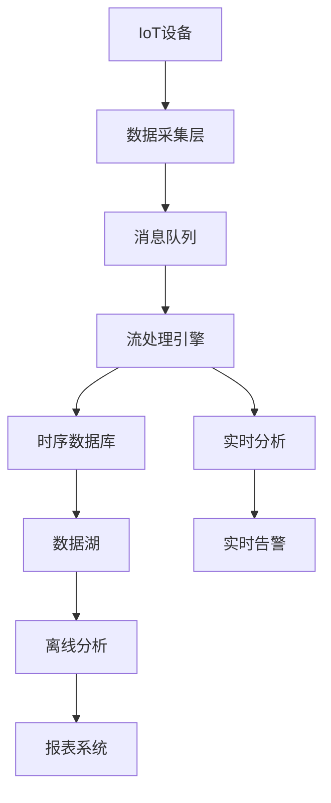

# 4. 数据架构重构

## 4.1 数据架构概述

### 4.1.1 数据架构演进

葛洲坝船闸导航系统的数据架构需要从传统的单体数据库演进到现代化的分布式数据架构：

```text
传统架构 → 数据分层 → 分布式架构 → 云原生数据架构
    ↓         ↓          ↓           ↓
  单一数据库   读写分离    分库分表     多数据源
  集中存储     主从复制    数据分片     时序数据库
  关系型数据库  缓存层     消息队列     流处理
```

### 4.1.2 现代数据架构特点

- **多数据源**：不同类型数据使用最适合的存储
- **时序优化**：IoT数据使用时序数据库
- **流处理**：实时数据处理和分析
- **数据湖**：统一的数据存储和分析平台
- **数据治理**：数据质量、安全和生命周期管理

## 4.2 时序数据库选型

### 4.2.1 时序数据库对比

| 特性 | InfluxDB | TimescaleDB | Prometheus | ClickHouse |
|------|----------|-------------|------------|------------|
| 开源协议 | MIT | Apache 2.0 | Apache 2.0 | Apache 2.0 |
| 存储引擎 | 自研TSM | PostgreSQL | LevelDB | MergeTree |
| SQL支持 | InfluxQL | PostgreSQL SQL | PromQL | SQL |
| 集群支持 | 企业版 | 开源 | 有限 | 开源 |
| 压缩比 | 高 | 中等 | 高 | 很高 |
| 查询性能 | 高 | 高 | 中等 | 很高 |
| 运维复杂度 | 低 | 中等 | 低 | 高 |

### 4.2.2 TimescaleDB选型理由

**优势：**

1. **PostgreSQL兼容**：团队学习成本低
2. **SQL标准**：丰富的SQL功能和生态系统
3. **时序优化**：自动分区和压缩
4. **开源免费**：无许可证成本
5. **成熟稳定**：基于PostgreSQL的可靠性

**适用场景：**

- 船舶位置数据存储
- 设备状态数据记录
- 性能指标监控
- 历史数据分析

### 4.2.3 TimescaleDB部署

```yaml
# TimescaleDB部署配置
apiVersion: apps/v1
kind: StatefulSet
metadata:
  name: timescaledb
  namespace: navlock-data
spec:
  serviceName: timescaledb
  replicas: 3
  selector:
    matchLabels:
      app: timescaledb
  template:
    metadata:
      labels:
        app: timescaledb
    spec:
      containers:
      - name: timescaledb
        image: timescale/timescaledb:2.8.0-pg14
        ports:
        - containerPort: 5432
          name: postgresql
        env:
        - name: POSTGRES_DB
          value: navlock
        - name: POSTGRES_USER
          value: navlock
        - name: POSTGRES_PASSWORD
          valueFrom:
            secretKeyRef:
              name: navlock-secrets
              key: database-password
        - name: TIMESCALEDB_TELEMETRY
          value: "off"
        volumeMounts:
        - name: timescaledb-data
          mountPath: /var/lib/postgresql/data
        - name: timescaledb-config
          mountPath: /etc/postgresql/postgresql.conf
          subPath: postgresql.conf
        resources:
          requests:
            memory: "2Gi"
            cpu: "1000m"
          limits:
            memory: "8Gi"
            cpu: "4000m"
        livenessProbe:
          exec:
            command:
            - pg_isready
            - -U
            - navlock
            - -d
            - navlock
          initialDelaySeconds: 30
          periodSeconds: 10
        readinessProbe:
          exec:
            command:
            - pg_isready
            - -U
            - navlock
            - -d
            - navlock
          initialDelaySeconds: 5
          periodSeconds: 5
      volumes:
      - name: timescaledb-config
        configMap:
          name: timescaledb-config
  volumeClaimTemplates:
  - metadata:
      name: timescaledb-data
    spec:
      accessModes: ["ReadWriteOnce"]
      storageClassName: fast-ssd
      resources:
        requests:
          storage: 100Gi
---
apiVersion: v1
kind: ConfigMap
metadata:
  name: timescaledb-config
  namespace: navlock-data
data:
  postgresql.conf: |
    # 基础配置
    listen_addresses = '*'
    port = 5432
    max_connections = 200
    shared_buffers = 2GB
    effective_cache_size = 6GB
    maintenance_work_mem = 1GB
    checkpoint_completion_target = 0.9
    wal_buffers = 16MB
    default_statistics_target = 100
    
    # 日志配置
    log_destination = 'stderr'
    logging_collector = on
    log_directory = 'log'
    log_filename = 'postgresql-%Y-%m-%d_%H%M%S.log'
    log_rotation_age = 1d
    log_rotation_size = 100MB
    log_min_duration_statement = 1000
    log_checkpoints = on
    log_connections = on
    log_disconnections = on
    log_lock_waits = on
    
    # 时序数据库配置
    shared_preload_libraries = 'timescaledb'
    timescaledb.license = 'apache'
    timescaledb.telemetry_level = 'off'
    
    # 性能优化
    random_page_cost = 1.1
    effective_io_concurrency = 200
    work_mem = 64MB
    max_worker_processes = 8
    max_parallel_workers_per_gather = 4
    max_parallel_workers = 8
    max_parallel_maintenance_workers = 4
---
apiVersion: v1
kind: Service
metadata:
  name: timescaledb
  namespace: navlock-data
spec:
  type: ClusterIP
  ports:
  - port: 5432
    targetPort: 5432
    protocol: TCP
    name: postgresql
  selector:
    app: timescaledb
```

### 4.2.4 数据模型设计

```sql
-- 船舶位置数据表
CREATE TABLE ship_positions (
    time TIMESTAMPTZ NOT NULL,
    ship_id TEXT NOT NULL,
    position_x DOUBLE PRECISION NOT NULL,
    position_y DOUBLE PRECISION NOT NULL,
    position_z DOUBLE PRECISION,
    speed DOUBLE PRECISION,
    direction DOUBLE PRECISION,
    heading DOUBLE PRECISION,
    status TEXT,
    metadata JSONB
);

-- 创建时序表
SELECT create_hypertable('ship_positions', 'time');

-- 创建索引
CREATE INDEX ON ship_positions (ship_id, time DESC);
CREATE INDEX ON ship_positions (time DESC, ship_id);

-- 设备状态数据表
CREATE TABLE device_status (
    time TIMESTAMPTZ NOT NULL,
    device_id TEXT NOT NULL,
    device_type TEXT NOT NULL,
    status TEXT NOT NULL,
    temperature DOUBLE PRECISION,
    humidity DOUBLE PRECISION,
    voltage DOUBLE PRECISION,
    current DOUBLE PRECISION,
    signal_strength INTEGER,
    error_code TEXT,
    metadata JSONB
);

-- 创建时序表
SELECT create_hypertable('device_status', 'time');

-- 创建索引
CREATE INDEX ON device_status (device_id, time DESC);
CREATE INDEX ON device_status (device_type, time DESC);

-- 船闸操作日志表
CREATE TABLE lock_operations (
    time TIMESTAMPTZ NOT NULL,
    lock_id TEXT NOT NULL,
    operation_type TEXT NOT NULL,
    operation_status TEXT NOT NULL,
    operator_id TEXT,
    ship_id TEXT,
    duration_seconds INTEGER,
    energy_consumption DOUBLE PRECISION,
    water_level_before DOUBLE PRECISION,
    water_level_after DOUBLE PRECISION,
    metadata JSONB
);

-- 创建时序表
SELECT create_hypertable('lock_operations', 'time');

-- 创建索引
CREATE INDEX ON lock_operations (lock_id, time DESC);
CREATE INDEX ON lock_operations (operation_type, time DESC);

-- 系统性能指标表
CREATE TABLE system_metrics (
    time TIMESTAMPTZ NOT NULL,
    service_name TEXT NOT NULL,
    metric_name TEXT NOT NULL,
    metric_value DOUBLE PRECISION NOT NULL,
    metric_unit TEXT,
    labels JSONB
);

-- 创建时序表
SELECT create_hypertable('system_metrics', 'time');

-- 创建索引
CREATE INDEX ON system_metrics (service_name, metric_name, time DESC);

-- 数据保留策略
SELECT add_retention_policy('ship_positions', INTERVAL '1 year');
SELECT add_retention_policy('device_status', INTERVAL '6 months');
SELECT add_retention_policy('lock_operations', INTERVAL '2 years');
SELECT add_retention_policy('system_metrics', INTERVAL '3 months');

-- 压缩策略
SELECT add_compression_policy('ship_positions', INTERVAL '7 days');
SELECT add_compression_policy('device_status', INTERVAL '7 days');
SELECT add_compression_policy('lock_operations', INTERVAL '30 days');
SELECT add_compression_policy('system_metrics', INTERVAL '1 day');
```

## 4.3 数据流设计

### 4.3.1 数据流架构



### 4.3.2 Apache Kafka配置

```yaml
# Kafka部署配置
apiVersion: apps/v1
kind: StatefulSet
metadata:
  name: kafka
  namespace: navlock-data
spec:
  serviceName: kafka
  replicas: 3
  selector:
    matchLabels:
      app: kafka
  template:
    metadata:
      labels:
        app: kafka
    spec:
      containers:
      - name: kafka
        image: confluentinc/cp-kafka:7.3.0
        ports:
        - containerPort: 9092
          name: kafka
        - containerPort: 9093
          name: kafka-internal
        env:
        - name: KAFKA_BROKER_ID
          valueFrom:
            fieldRef:
              fieldPath: metadata.name
        - name: KAFKA_ZOOKEEPER_CONNECT
          value: "zookeeper:2181"
        - name: KAFKA_LISTENER_SECURITY_PROTOCOL_MAP
          value: "PLAINTEXT:PLAINTEXT,PLAINTEXT_HOST:PLAINTEXT"
        - name: KAFKA_ADVERTISED_LISTENERS
          value: "PLAINTEXT://$(MY_POD_NAME).kafka.navlock-data.svc.cluster.local:9092,PLAINTEXT_HOST://$(MY_POD_IP):9093"
        - name: KAFKA_OFFSETS_TOPIC_REPLICATION_FACTOR
          value: "3"
        - name: KAFKA_GROUP_INITIAL_REBALANCE_DELAY_MS
          value: "0"
        - name: KAFKA_TRANSACTION_STATE_LOG_MIN_ISR
          value: "2"
        - name: KAFKA_TRANSACTION_STATE_LOG_REPLICATION_FACTOR
          value: "3"
        - name: KAFKA_JMX_PORT
          value: "9101"
        - name: KAFKA_JMX_HOSTNAME
          value: "localhost"
        - name: KAFKA_AUTO_CREATE_TOPICS_ENABLE
          value: "true"
        - name: KAFKA_DELETE_TOPIC_ENABLE
          value: "true"
        - name: KAFKA_LOG_RETENTION_HOURS
          value: "168"
        - name: KAFKA_LOG_SEGMENT_BYTES
          value: "1073741824"
        - name: KAFKA_LOG_RETENTION_CHECK_INTERVAL_MS
          value: "300000"
        volumeMounts:
        - name: kafka-data
          mountPath: /var/lib/kafka/data
        resources:
          requests:
            memory: "2Gi"
            cpu: "1000m"
          limits:
            memory: "4Gi"
            cpu: "2000m"
  volumeClaimTemplates:
  - metadata:
      name: kafka-data
    spec:
      accessModes: ["ReadWriteOnce"]
      storageClassName: fast-ssd
      resources:
        requests:
          storage: 100Gi
```

### 4.3.3 数据流处理

```go
// 数据流处理器
type DataStreamProcessor struct {
    kafkaProducer sarama.SyncProducer
    kafkaConsumer sarama.Consumer
    timescaleDB   *sql.DB
    redisClient   *redis.Client
    logger        *zap.Logger
    tracer        trace.Tracer
    metrics       *MetricsCollector
}

func NewDataStreamProcessor(deps Dependencies) *DataStreamProcessor {
    return &DataStreamProcessor{
        kafkaProducer: deps.KafkaProducer,
        kafkaConsumer: deps.KafkaConsumer,
        timescaleDB:   deps.TimescaleDB,
        redisClient:   deps.RedisClient,
        logger:        deps.Logger,
        tracer:        deps.Tracer,
        metrics:       deps.Metrics,
    }
}

// 处理船舶位置数据
func (p *DataStreamProcessor) ProcessShipPosition(ctx context.Context, data *ShipPositionData) error {
    ctx, span := p.tracer.Start(ctx, "process_ship_position")
    defer span.End()
    
    span.SetAttributes(
        attribute.String("ship.id", data.ShipID),
        attribute.Float64("position.x", data.Position.X),
        attribute.Float64("position.y", data.Position.Y),
    )
    
    // 1. 数据验证
    if err := p.validateShipPosition(data); err != nil {
        p.metrics.RecordError(ctx, "process_ship_position", "validation_error")
        return fmt.Errorf("validation failed: %w", err)
    }
    
    // 2. 数据清洗
    cleanData, err := p.cleanShipPosition(data)
    if err != nil {
        p.metrics.RecordError(ctx, "process_ship_position", "cleaning_error")
        return fmt.Errorf("cleaning failed: %w", err)
    }
    
    // 3. 存储到时序数据库
    if err := p.storeShipPosition(ctx, cleanData); err != nil {
        p.metrics.RecordError(ctx, "process_ship_position", "storage_error")
        return fmt.Errorf("storage failed: %w", err)
    }
    
    // 4. 更新缓存
    if err := p.updateShipPositionCache(ctx, cleanData); err != nil {
        p.logger.Warn("更新船舶位置缓存失败",
            zap.Error(err),
            zap.String("ship_id", cleanData.ShipID),
        )
    }
    
    // 5. 发布事件
    event := &ShipPositionUpdatedEvent{
        ShipID:    cleanData.ShipID,
        Position:  cleanData.Position,
        Speed:     cleanData.Speed,
        Timestamp: cleanData.Timestamp,
    }
    
    if err := p.publishEvent(ctx, "ship.position.updated", event); err != nil {
        p.logger.Warn("发布船舶位置更新事件失败",
            zap.Error(err),
            zap.String("ship_id", cleanData.ShipID),
        )
    }
    
    p.metrics.RecordShipPositionProcessed(ctx, cleanData.ShipID)
    
    return nil
}

// 存储船舶位置数据
func (p *DataStreamProcessor) storeShipPosition(ctx context.Context, data *ShipPositionData) error {
    ctx, span := p.tracer.Start(ctx, "store_ship_position")
    defer span.End()
    
    query := `
        INSERT INTO ship_positions (
            time, ship_id, position_x, position_y, position_z,
            speed, direction, heading, status, metadata
        ) VALUES ($1, $2, $3, $4, $5, $6, $7, $8, $9, $10)
    `
    
    _, err := p.timescaleDB.ExecContext(ctx, query,
        data.Timestamp,
        data.ShipID,
        data.Position.X,
        data.Position.Y,
        data.Position.Z,
        data.Speed,
        data.Direction,
        data.Heading,
        data.Status,
        data.Metadata,
    )
    
    if err != nil {
        return fmt.Errorf("failed to insert ship position: %w", err)
    }
    
    return nil
}

// 更新缓存
func (p *DataStreamProcessor) updateShipPositionCache(ctx context.Context, data *ShipPositionData) error {
    ctx, span := p.tracer.Start(ctx, "update_ship_position_cache")
    defer span.End()
    
    key := fmt.Sprintf("ship:position:%s", data.ShipID)
    
    cacheData := map[string]interface{}{
        "ship_id":    data.ShipID,
        "position_x": data.Position.X,
        "position_y": data.Position.Y,
        "position_z": data.Position.Z,
        "speed":      data.Speed,
        "direction":  data.Direction,
        "heading":    data.Heading,
        "status":     data.Status,
        "timestamp":  data.Timestamp.Unix(),
    }
    
    // 使用Redis Hash存储
    if err := p.redisClient.HMSet(ctx, key, cacheData).Err(); err != nil {
        return fmt.Errorf("failed to update cache: %w", err)
    }
    
    // 设置过期时间
    if err := p.redisClient.Expire(ctx, key, 24*time.Hour).Err(); err != nil {
        return fmt.Errorf("failed to set cache expiry: %w", err)
    }
    
    return nil
}

// 发布事件
func (p *DataStreamProcessor) publishEvent(ctx context.Context, topic string, event interface{}) error {
    ctx, span := p.tracer.Start(ctx, "publish_event")
    defer span.End()
    
    span.SetAttributes(
        attribute.String("event.topic", topic),
        attribute.String("event.type", fmt.Sprintf("%T", event)),
    )
    
    data, err := json.Marshal(event)
    if err != nil {
        return fmt.Errorf("failed to marshal event: %w", err)
    }
    
    msg := &sarama.ProducerMessage{
        Topic: topic,
        Value: sarama.ByteEncoder(data),
    }
    
    partition, offset, err := p.kafkaProducer.SendMessage(msg)
    if err != nil {
        return fmt.Errorf("failed to send message: %w", err)
    }
    
    span.SetAttributes(
        attribute.Int32("kafka.partition", partition),
        attribute.Int64("kafka.offset", offset),
    )
    
    return nil
}
```

## 4.4 缓存策略

### 4.4.1 Redis缓存架构

```yaml
# Redis集群部署
apiVersion: apps/v1
kind: StatefulSet
metadata:
  name: redis-cluster
  namespace: navlock-data
spec:
  serviceName: redis-cluster
  replicas: 6
  selector:
    matchLabels:
      app: redis-cluster
  template:
    metadata:
      labels:
        app: redis-cluster
    spec:
      containers:
      - name: redis
        image: redis:7.0-alpine
        ports:
        - containerPort: 6379
          name: redis
        - containerPort: 16379
          name: cluster
        command:
        - redis-server
        - /etc/redis/redis.conf
        volumeMounts:
        - name: redis-config
          mountPath: /etc/redis
        - name: redis-data
          mountPath: /data
        resources:
          requests:
            memory: "1Gi"
            cpu: "500m"
          limits:
            memory: "2Gi"
            cpu: "1000m"
      volumes:
      - name: redis-config
        configMap:
          name: redis-config
  volumeClaimTemplates:
  - metadata:
      name: redis-data
    spec:
      accessModes: ["ReadWriteOnce"]
      storageClassName: fast-ssd
      resources:
        requests:
          storage: 20Gi
---
apiVersion: v1
kind: ConfigMap
metadata:
  name: redis-config
  namespace: navlock-data
data:
  redis.conf: |
    # 基础配置
    port 6379
    cluster-port 16379
    bind 0.0.0.0
    protected-mode no
    
    # 内存配置
    maxmemory 1gb
    maxmemory-policy allkeys-lru
    
    # 持久化配置
    save 900 1
    save 300 10
    save 60 10000
    rdbcompression yes
    rdbchecksum yes
    dbfilename dump.rdb
    dir /data
    
    # AOF配置
    appendonly yes
    appendfilename "appendonly.aof"
    appendfsync everysec
    no-appendfsync-on-rewrite no
    auto-aof-rewrite-percentage 100
    auto-aof-rewrite-min-size 64mb
    
    # 集群配置
    cluster-enabled yes
    cluster-config-file nodes.conf
    cluster-node-timeout 5000
    cluster-require-full-coverage no
    
    # 性能优化
    tcp-keepalive 300
    timeout 0
    tcp-backlog 511
    databases 16
    stop-writes-on-bgsave-error yes
    rdb-save-incremental-fsync yes
```

### 4.4.2 缓存策略实现

```go
// 缓存管理器
type CacheManager struct {
    redisClient *redis.Client
    logger      *zap.Logger
    tracer      trace.Tracer
    metrics     *MetricsCollector
}

func NewCacheManager(deps Dependencies) *CacheManager {
    return &CacheManager{
        redisClient: deps.RedisClient,
        logger:      deps.Logger,
        tracer:      deps.Tracer,
        metrics:     deps.Metrics,
    }
}

// 船舶位置缓存
func (cm *CacheManager) GetShipPosition(ctx context.Context, shipID string) (*ShipPosition, error) {
    ctx, span := cm.tracer.Start(ctx, "get_ship_position_cache")
    defer span.End()
    
    span.SetAttributes(attribute.String("ship.id", shipID))
    
    key := fmt.Sprintf("ship:position:%s", shipID)
    
    // 从缓存获取
    result, err := cm.redisClient.HGetAll(ctx, key).Result()
    if err != nil {
        if err == redis.Nil {
            // 缓存未命中
            cm.metrics.RecordCacheMiss(ctx, "ship_position", shipID)
            return nil, nil
        }
        return nil, fmt.Errorf("failed to get from cache: %w", err)
    }
    
    if len(result) == 0 {
        cm.metrics.RecordCacheMiss(ctx, "ship_position", shipID)
        return nil, nil
    }
    
    // 解析数据
    position := &ShipPosition{}
    if x, ok := result["position_x"]; ok {
        if val, err := strconv.ParseFloat(x, 64); err == nil {
            position.X = val
        }
    }
    if y, ok := result["position_y"]; ok {
        if val, err := strconv.ParseFloat(y, 64); err == nil {
            position.Y = val
        }
    }
    if z, ok := result["position_z"]; ok {
        if val, err := strconv.ParseFloat(z, 64); err == nil {
            position.Z = val
        }
    }
    
    cm.metrics.RecordCacheHit(ctx, "ship_position", shipID)
    
    return position, nil
}

// 设备状态缓存
func (cm *CacheManager) GetDeviceStatus(ctx context.Context, deviceID string) (*DeviceStatus, error) {
    ctx, span := cm.tracer.Start(ctx, "get_device_status_cache")
    defer span.End()
    
    span.SetAttributes(attribute.String("device.id", deviceID))
    
    key := fmt.Sprintf("device:status:%s", deviceID)
    
    // 从缓存获取
    result, err := cm.redisClient.HGetAll(ctx, key).Result()
    if err != nil {
        if err == redis.Nil {
            cm.metrics.RecordCacheMiss(ctx, "device_status", deviceID)
            return nil, nil
        }
        return nil, fmt.Errorf("failed to get from cache: %w", err)
    }
    
    if len(result) == 0 {
        cm.metrics.RecordCacheMiss(ctx, "device_status", deviceID)
        return nil, nil
    }
    
    // 解析数据
    status := &DeviceStatus{
        DeviceID: deviceID,
    }
    
    if val, ok := result["status"]; ok {
        status.Status = val
    }
    if val, ok := result["temperature"]; ok {
        if temp, err := strconv.ParseFloat(val, 64); err == nil {
            status.Temperature = temp
        }
    }
    if val, ok := result["humidity"]; ok {
        if humidity, err := strconv.ParseFloat(val, 64); err == nil {
            status.Humidity = humidity
        }
    }
    
    cm.metrics.RecordCacheHit(ctx, "device_status", deviceID)
    
    return status, nil
}

// 批量获取船舶位置
func (cm *CacheManager) GetShipPositionsBatch(ctx context.Context, shipIDs []string) (map[string]*ShipPosition, error) {
    ctx, span := cm.tracer.Start(ctx, "get_ship_positions_batch")
    defer span.End()
    
    span.SetAttributes(attribute.Int("ship.count", len(shipIDs)))
    
    pipe := cm.redisClient.Pipeline()
    
    // 批量获取
    cmds := make(map[string]*redis.StringStringMapCmd)
    for _, shipID := range shipIDs {
        key := fmt.Sprintf("ship:position:%s", shipID)
        cmds[shipID] = pipe.HGetAll(ctx, key)
    }
    
    _, err := pipe.Exec(ctx)
    if err != nil {
        return nil, fmt.Errorf("failed to execute pipeline: %w", err)
    }
    
    // 解析结果
    result := make(map[string]*ShipPosition)
    for shipID, cmd := range cmds {
        data, err := cmd.Result()
        if err != nil {
            if err == redis.Nil {
                cm.metrics.RecordCacheMiss(ctx, "ship_position", shipID)
                continue
            }
            cm.logger.Warn("解析船舶位置缓存失败",
                zap.Error(err),
                zap.String("ship_id", shipID),
            )
            continue
        }
        
        if len(data) == 0 {
            cm.metrics.RecordCacheMiss(ctx, "ship_position", shipID)
            continue
        }
        
        position := &ShipPosition{}
        if x, ok := data["position_x"]; ok {
            if val, err := strconv.ParseFloat(x, 64); err == nil {
                position.X = val
            }
        }
        if y, ok := data["position_y"]; ok {
            if val, err := strconv.ParseFloat(y, 64); err == nil {
                position.Y = val
            }
        }
        
        result[shipID] = position
        cm.metrics.RecordCacheHit(ctx, "ship_position", shipID)
    }
    
    return result, nil
}

// 缓存预热
func (cm *CacheManager) WarmupCache(ctx context.Context) error {
    ctx, span := cm.tracer.Start(ctx, "warmup_cache")
    defer span.End()
    
    // 预热船舶位置缓存
    if err := cm.warmupShipPositions(ctx); err != nil {
        cm.logger.Error("预热船舶位置缓存失败",
            zap.Error(err),
        )
    }
    
    // 预热设备状态缓存
    if err := cm.warmupDeviceStatus(ctx); err != nil {
        cm.logger.Error("预热设备状态缓存失败",
            zap.Error(err),
        )
    }
    
    return nil
}

func (cm *CacheManager) warmupShipPositions(ctx context.Context) error {
    // 从数据库获取最近的船舶位置数据
    query := `
        SELECT DISTINCT ON (ship_id) 
            ship_id, position_x, position_y, position_z, speed, direction, heading, status
        FROM ship_positions 
        ORDER BY ship_id, time DESC
        LIMIT 1000
    `
    
    rows, err := cm.timescaleDB.QueryContext(ctx, query)
    if err != nil {
        return fmt.Errorf("failed to query ship positions: %w", err)
    }
    defer rows.Close()
    
    pipe := cm.redisClient.Pipeline()
    
    for rows.Next() {
        var shipID string
        var positionX, positionY, positionZ, speed, direction, heading float64
        var status string
        
        if err := rows.Scan(&shipID, &positionX, &positionY, &positionZ, &speed, &direction, &heading, &status); err != nil {
            continue
        }
        
        key := fmt.Sprintf("ship:position:%s", shipID)
        cacheData := map[string]interface{}{
            "position_x": positionX,
            "position_y": positionY,
            "position_z": positionZ,
            "speed":      speed,
            "direction":  direction,
            "heading":    heading,
            "status":     status,
        }
        
        pipe.HMSet(ctx, key, cacheData)
        pipe.Expire(ctx, key, 24*time.Hour)
    }
    
    _, err = pipe.Exec(ctx)
    if err != nil {
        return fmt.Errorf("failed to execute warmup pipeline: %w", err)
    }
    
    return nil
}
```

## 4.5 数据治理

### 4.5.1 数据质量监控

```go
// 数据质量监控器
type DataQualityMonitor struct {
    timescaleDB *sql.DB
    logger      *zap.Logger
    tracer      trace.Tracer
    metrics     *MetricsCollector
}

func NewDataQualityMonitor(deps Dependencies) *DataQualityMonitor {
    return &DataQualityMonitor{
        timescaleDB: deps.TimescaleDB,
        logger:      deps.Logger,
        tracer:      deps.Tracer,
        metrics:     deps.Metrics,
    }
}

// 检查数据完整性
func (dqm *DataQualityMonitor) CheckDataIntegrity(ctx context.Context) error {
    ctx, span := dqm.tracer.Start(ctx, "check_data_integrity")
    defer span.End()
    
    // 检查船舶位置数据完整性
    if err := dqm.checkShipPositionIntegrity(ctx); err != nil {
        dqm.logger.Error("船舶位置数据完整性检查失败",
            zap.Error(err),
        )
    }
    
    // 检查设备状态数据完整性
    if err := dqm.checkDeviceStatusIntegrity(ctx); err != nil {
        dqm.logger.Error("设备状态数据完整性检查失败",
            zap.Error(err),
        )
    }
    
    return nil
}

func (dqm *DataQualityMonitor) checkShipPositionIntegrity(ctx context.Context) error {
    // 检查数据缺失
    query := `
        SELECT 
            COUNT(*) as total_records,
            COUNT(CASE WHEN position_x IS NULL OR position_y IS NULL THEN 1 END) as null_positions,
            COUNT(CASE WHEN speed < 0 OR speed > 50 THEN 1 END) as invalid_speed,
            COUNT(CASE WHEN time < NOW() - INTERVAL '1 hour' THEN 1 END) as old_data
        FROM ship_positions 
        WHERE time > NOW() - INTERVAL '1 day'
    `
    
    var total, nullPositions, invalidSpeed, oldData int64
    err := dqm.timescaleDB.QueryRowContext(ctx, query).Scan(&total, &nullPositions, &invalidSpeed, &oldData)
    if err != nil {
        return fmt.Errorf("failed to check ship position integrity: %w", err)
    }
    
    // 记录指标
    dqm.metrics.RecordDataQuality(ctx, "ship_positions", "total_records", float64(total))
    dqm.metrics.RecordDataQuality(ctx, "ship_positions", "null_positions", float64(nullPositions))
    dqm.metrics.RecordDataQuality(ctx, "ship_positions", "invalid_speed", float64(invalidSpeed))
    dqm.metrics.RecordDataQuality(ctx, "ship_positions", "old_data", float64(oldData))
    
    // 计算数据质量分数
    qualityScore := float64(total-nullPositions-invalidSpeed) / float64(total) * 100
    dqm.metrics.RecordDataQuality(ctx, "ship_positions", "quality_score", qualityScore)
    
    if qualityScore < 95 {
        dqm.logger.Warn("船舶位置数据质量较低",
            zap.Float64("quality_score", qualityScore),
            zap.Int64("total_records", total),
            zap.Int64("null_positions", nullPositions),
            zap.Int64("invalid_speed", invalidSpeed),
        )
    }
    
    return nil
}

// 数据清理
func (dqm *DataQualityMonitor) CleanInvalidData(ctx context.Context) error {
    ctx, span := dqm.tracer.Start(ctx, "clean_invalid_data")
    defer span.End()
    
    // 清理无效的船舶位置数据
    query := `
        DELETE FROM ship_positions 
        WHERE position_x IS NULL 
           OR position_y IS NULL 
           OR speed < 0 
           OR speed > 50
           OR time < NOW() - INTERVAL '30 days'
    `
    
    result, err := dqm.timescaleDB.ExecContext(ctx, query)
    if err != nil {
        return fmt.Errorf("failed to clean invalid ship position data: %w", err)
    }
    
    rowsAffected, _ := result.RowsAffected()
    dqm.logger.Info("清理无效数据完成",
        zap.Int64("rows_affected", rowsAffected),
    )
    
    return nil
}
```

### 4.5.2 数据备份恢复

```go
// 数据备份管理器
type DataBackupManager struct {
    timescaleDB *sql.DB
    s3Client    *s3.Client
    logger      *zap.Logger
    tracer      trace.Tracer
    metrics     *MetricsCollector
}

func NewDataBackupManager(deps Dependencies) *DataBackupManager {
    return &DataBackupManager{
        timescaleDB: deps.TimescaleDB,
        s3Client:    deps.S3Client,
        logger:      deps.Logger,
        tracer:      deps.Tracer,
        metrics:     deps.Metrics,
    }
}

// 创建数据备份
func (dbm *DataBackupManager) CreateBackup(ctx context.Context) error {
    ctx, span := dbm.tracer.Start(ctx, "create_backup")
    defer span.End()
    
    backupID := fmt.Sprintf("navlock-backup-%s", time.Now().Format("20060102-150405"))
    
    // 创建备份文件
    backupFile := fmt.Sprintf("/tmp/%s.sql", backupID)
    
    cmd := exec.CommandContext(ctx, "pg_dump",
        "-h", "timescaledb",
        "-U", "navlock",
        "-d", "navlock",
        "-f", backupFile,
        "--format=custom",
        "--compress=9",
    )
    
    cmd.Env = append(cmd.Env, fmt.Sprintf("PGPASSWORD=%s", os.Getenv("POSTGRES_PASSWORD")))
    
    if err := cmd.Run(); err != nil {
        return fmt.Errorf("failed to create backup: %w", err)
    }
    
    // 上传到S3
    file, err := os.Open(backupFile)
    if err != nil {
        return fmt.Errorf("failed to open backup file: %w", err)
    }
    defer file.Close()
    
    _, err = dbm.s3Client.PutObject(ctx, &s3.PutObjectInput{
        Bucket: aws.String("navlock-backups"),
        Key:    aws.String(fmt.Sprintf("daily/%s.sql", backupID)),
        Body:   file,
    })
    if err != nil {
        return fmt.Errorf("failed to upload backup to S3: %w", err)
    }
    
    // 清理本地文件
    os.Remove(backupFile)
    
    dbm.logger.Info("数据备份创建成功",
        zap.String("backup_id", backupID),
    )
    
    return nil
}

// 恢复数据备份
func (dbm *DataBackupManager) RestoreBackup(ctx context.Context, backupID string) error {
    ctx, span := dbm.tracer.Start(ctx, "restore_backup")
    defer span.End()
    
    span.SetAttributes(attribute.String("backup.id", backupID))
    
    // 从S3下载备份文件
    backupFile := fmt.Sprintf("/tmp/%s.sql", backupID)
    
    result, err := dbm.s3Client.GetObject(ctx, &s3.GetObjectInput{
        Bucket: aws.String("navlock-backups"),
        Key:    aws.String(fmt.Sprintf("daily/%s.sql", backupID)),
    })
    if err != nil {
        return fmt.Errorf("failed to download backup from S3: %w", err)
    }
    defer result.Body.Close()
    
    file, err := os.Create(backupFile)
    if err != nil {
        return fmt.Errorf("failed to create backup file: %w", err)
    }
    defer file.Close()
    
    if _, err := io.Copy(file, result.Body); err != nil {
        return fmt.Errorf("failed to write backup file: %w", err)
    }
    
    // 恢复数据
    cmd := exec.CommandContext(ctx, "pg_restore",
        "-h", "timescaledb",
        "-U", "navlock",
        "-d", "navlock",
        "--clean",
        "--if-exists",
        backupFile,
    )
    
    cmd.Env = append(cmd.Env, fmt.Sprintf("PGPASSWORD=%s", os.Getenv("POSTGRES_PASSWORD")))
    
    if err := cmd.Run(); err != nil {
        return fmt.Errorf("failed to restore backup: %w", err)
    }
    
    // 清理本地文件
    os.Remove(backupFile)
    
    dbm.logger.Info("数据备份恢复成功",
        zap.String("backup_id", backupID),
    )
    
    return nil
}
```

## 4.6 总结

数据架构重构为葛洲坝船闸导航系统提供了现代化的数据存储和处理能力。通过时序数据库、消息队列、缓存等技术，系统获得了：

**核心优势：**

1. **时序优化**：针对IoT数据的时间序列特性优化
2. **高性能**：多级缓存和流处理提升性能
3. **可扩展性**：分布式架构支持数据量增长
4. **数据质量**：完善的数据治理和质量监控
5. **可靠性**：数据备份和恢复机制

**实施建议：**

1. 渐进式迁移，先迁移核心数据
2. 建立完善的数据监控和告警
3. 制定数据备份和恢复策略
4. 建立数据质量检查机制
5. 培训团队掌握新数据技术

这个数据架构为系统的数据处理和分析提供了强有力的支撑，是现代化IoT系统的重要组成部分。
