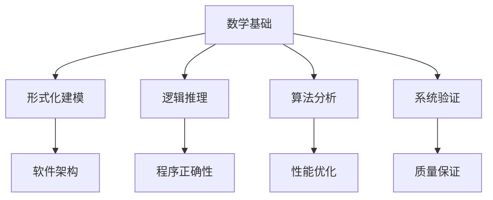

# 01-数学基础 (Mathematical Foundation)

## 目录

- [01-数学基础 (Mathematical Foundation)](#01-数学基础-mathematical-foundation)
  - [目录](#目录)
  - [概述](#概述)
  - [1. 集合论 (Set Theory)](#1-集合论-set-theory)
  - [2. 逻辑学 (Logic)](#2-逻辑学-logic)
  - [3. 图论 (Graph Theory)](#3-图论-graph-theory)
  - [4. 概率论 (Probability Theory)](#4-概率论-probability-theory)
  - [5. 代数结构 (Algebraic Structures)](#5-代数结构-algebraic-structures)
  - [6. 拓扑学基础 (Topology Foundation)](#6-拓扑学基础-topology-foundation)
  - [7. 范畴论基础 (Category Theory Foundation)](#7-范畴论基础-category-theory-foundation)
  - [8. 同伦论基础 (Homotopy Theory Foundation)](#8-同伦论基础-homotopy-theory-foundation)
  - [9. 形式化方法 (Formal Methods)](#9-形式化方法-formal-methods)
  - [10. 计算数学 (Computational Mathematics)](#10-计算数学-computational-mathematics)
  - [参考文献](#参考文献)

## 概述

数学基础是软件工程形式化的理论基础，为软件系统的设计、分析和验证提供严格的数学工具。本章节涵盖从基础集合论到高级同伦论的完整数学体系。

### 核心目标

1. **形式化建模**: 为软件系统提供严格的数学表示
2. **逻辑推理**: 建立软件正确性的数学证明体系
3. **算法分析**: 提供算法复杂度和性能的数学分析工具
4. **系统验证**: 为软件验证提供数学基础

### 与软件工程的关系



## 1. 集合论 (Set Theory)

### 1.1 基本概念

**定义 1.1** (集合): 集合是不同对象的无序聚集，这些对象称为集合的元素。

**形式化表示**:
```latex
A = \{x \mid P(x)\}
```

其中 $P(x)$ 是描述元素性质的谓词。

### 1.2 集合运算

**定义 1.2** (集合运算): 给定集合 $A$ 和 $B$，定义以下运算：

- **并集**: $A \cup B = \{x \mid x \in A \lor x \in B\}$
- **交集**: $A \cap B = \{x \mid x \in A \land x \in B\}$
- **差集**: $A \setminus B = \{x \mid x \in A \land x \notin B\}$
- **补集**: $A^c = \{x \mid x \notin A\}$

### 1.3 关系与函数

**定义 1.3** (关系): 集合 $A$ 到集合 $B$ 的关系是 $A \times B$ 的子集。

**定义 1.4** (函数): 函数 $f: A \rightarrow B$ 是满足以下条件的关系：
- $\forall a \in A, \exists b \in B: (a,b) \in f$
- $\forall a \in A, \forall b_1, b_2 \in B: (a,b_1) \in f \land (a,b_2) \in f \Rightarrow b_1 = b_2$

### 1.4 Go语言实现

```go
// 集合的基本实现
type Set[T comparable] map[T]bool

// 创建新集合
func NewSet[T comparable]() Set[T] {
    return make(Set[T])
}

// 添加元素
func (s Set[T]) Add(element T) {
    s[element] = true
}

// 删除元素
func (s Set[T]) Remove(element T) {
    delete(s, element)
}

// 检查元素是否存在
func (s Set[T]) Contains(element T) bool {
    return s[element]
}

// 并集运算
func (s Set[T]) Union(other Set[T]) Set[T] {
    result := NewSet[T]()
    for element := range s {
        result.Add(element)
    }
    for element := range other {
        result.Add(element)
    }
    return result
}

// 交集运算
func (s Set[T]) Intersection(other Set[T]) Set[T] {
    result := NewSet[T]()
    for element := range s {
        if other.Contains(element) {
            result.Add(element)
        }
    }
    return result
}

// 差集运算
func (s Set[T]) Difference(other Set[T]) Set[T] {
    result := NewSet[T]()
    for element := range s {
        if !other.Contains(element) {
            result.Add(element)
        }
    }
    return result
}

// 示例使用
func ExampleSetOperations() {
    set1 := NewSet[int]()
    set1.Add(1)
    set1.Add(2)
    set1.Add(3)
    
    set2 := NewSet[int]()
    set2.Add(2)
    set2.Add(3)
    set2.Add(4)
    
    union := set1.Union(set2)
    intersection := set1.Intersection(set2)
    difference := set1.Difference(set2)
    
    fmt.Printf("Union: %v\n", union)
    fmt.Printf("Intersection: %v\n", intersection)
    fmt.Printf("Difference: %v\n", difference)
}
```

## 2. 逻辑学 (Logic)

### 2.1 命题逻辑

**定义 2.1** (命题): 命题是具有真值的陈述句。

**基本逻辑运算符**:
- **否定**: $\neg p$ (非p)
- **合取**: $p \land q$ (p且q)
- **析取**: $p \lor q$ (p或q)
- **蕴含**: $p \rightarrow q$ (如果p则q)
- **等价**: $p \leftrightarrow q$ (p当且仅当q)

### 2.2 谓词逻辑

**定义 2.2** (谓词): 谓词是包含变量的命题函数。

**量词**:
- **全称量词**: $\forall x P(x)$ (对所有x，P(x)成立)
- **存在量词**: $\exists x P(x)$ (存在x，使得P(x)成立)

### 2.3 逻辑推理规则

**定理 2.1** (假言推理): 如果 $p \rightarrow q$ 和 $p$ 都为真，则 $q$ 为真。

**定理 2.2** (反证法): 如果假设 $\neg p$ 导致矛盾，则 $p$ 为真。

### 2.4 Go语言实现

```go
// 逻辑运算的实现
type Proposition bool

// 逻辑运算
func (p Proposition) Not() Proposition {
    return !bool(p)
}

func (p Proposition) And(q Proposition) Proposition {
    return Proposition(bool(p) && bool(q))
}

func (p Proposition) Or(q Proposition) Proposition {
    return Proposition(bool(p) || bool(q))
}

func (p Proposition) Implies(q Proposition) Proposition {
    return Proposition(!bool(p) || bool(q))
}

func (p Proposition) Equiv(q Proposition) Proposition {
    return Proposition(bool(p) == bool(q))
}

// 谓词逻辑实现
type Predicate[T any] func(T) bool

// 全称量词
func ForAll[T any](predicate Predicate[T], elements []T) bool {
    for _, element := range elements {
        if !predicate(element) {
            return false
        }
    }
    return true
}

// 存在量词
func Exists[T any](predicate Predicate[T], elements []T) bool {
    for _, element := range elements {
        if predicate(element) {
            return true
        }
    }
    return false
}

// 示例使用
func ExampleLogic() {
    // 命题逻辑
    p := Proposition(true)
    q := Proposition(false)
    
    fmt.Printf("p AND q: %v\n", p.And(q))
    fmt.Printf("p OR q: %v\n", p.Or(q))
    fmt.Printf("p IMPLIES q: %v\n", p.Implies(q))
    
    // 谓词逻辑
    numbers := []int{1, 2, 3, 4, 5}
    isPositive := func(n int) bool { return n > 0 }
    isEven := func(n int) bool { return n%2 == 0 }
    
    fmt.Printf("All positive: %v\n", ForAll(isPositive, numbers))
    fmt.Printf("Exists even: %v\n", Exists(isEven, numbers))
}
```

## 3. 图论 (Graph Theory)

### 3.1 基本概念

**定义 3.1** (图): 图 $G = (V, E)$ 由顶点集 $V$ 和边集 $E$ 组成，其中 $E \subseteq V \times V$。

**定义 3.2** (有向图): 有向图的边是有序对 $(u, v)$，表示从顶点 $u$ 到顶点 $v$ 的边。

**定义 3.3** (无向图): 无向图的边是无序对 $\{u, v\}$，表示顶点 $u$ 和 $v$ 之间的连接。

### 3.2 图的表示

**邻接矩阵**: 对于图 $G = (V, E)$，邻接矩阵 $A$ 定义为：
```latex
A_{ij} = \begin{cases}
1 & \text{if } (i,j) \in E \\
0 & \text{otherwise}
\end{cases}
```

**邻接表**: 每个顶点维护一个包含其邻居的列表。

### 3.3 图算法

**定理 3.1** (深度优先搜索): DFS的时间复杂度为 $O(|V| + |E|)$。

**定理 3.2** (广度优先搜索): BFS的时间复杂度为 $O(|V| + |E|)$。

### 3.4 Go语言实现

```go
// 图的实现
type Graph struct {
    vertices map[int][]int
    directed bool
}

// 创建新图
func NewGraph(directed bool) *Graph {
    return &Graph{
        vertices: make(map[int][]int),
        directed: directed,
    }
}

// 添加顶点
func (g *Graph) AddVertex(vertex int) {
    if _, exists := g.vertices[vertex]; !exists {
        g.vertices[vertex] = []int{}
    }
}

// 添加边
func (g *Graph) AddEdge(from, to int) {
    g.AddVertex(from)
    g.AddVertex(to)
    
    g.vertices[from] = append(g.vertices[from], to)
    
    if !g.directed {
        g.vertices[to] = append(g.vertices[to], from)
    }
}

// 深度优先搜索
func (g *Graph) DFS(start int) []int {
    visited := make(map[int]bool)
    result := []int{}
    
    var dfs func(int)
    dfs = func(vertex int) {
        if visited[vertex] {
            return
        }
        
        visited[vertex] = true
        result = append(result, vertex)
        
        for _, neighbor := range g.vertices[vertex] {
            dfs(neighbor)
        }
    }
    
    dfs(start)
    return result
}

// 广度优先搜索
func (g *Graph) BFS(start int) []int {
    visited := make(map[int]bool)
    result := []int{}
    queue := []int{start}
    visited[start] = true
    
    for len(queue) > 0 {
        vertex := queue[0]
        queue = queue[1:]
        result = append(result, vertex)
        
        for _, neighbor := range g.vertices[vertex] {
            if !visited[neighbor] {
                visited[neighbor] = true
                queue = append(queue, neighbor)
            }
        }
    }
    
    return result
}

// 示例使用
func ExampleGraph() {
    g := NewGraph(false)
    g.AddEdge(0, 1)
    g.AddEdge(0, 2)
    g.AddEdge(1, 3)
    g.AddEdge(2, 3)
    
    fmt.Printf("DFS: %v\n", g.DFS(0))
    fmt.Printf("BFS: %v\n", g.BFS(0))
}
```

## 4. 概率论 (Probability Theory)

### 4.1 基本概念

**定义 4.1** (样本空间): 样本空间 $\Omega$ 是所有可能结果的集合。

**定义 4.2** (事件): 事件是样本空间的子集。

**定义 4.3** (概率): 概率函数 $P: 2^\Omega \rightarrow [0,1]$ 满足：
- $P(\Omega) = 1$
- 对于互斥事件 $A_1, A_2, \ldots$，$P(\bigcup_{i=1}^{\infty} A_i) = \sum_{i=1}^{\infty} P(A_i)$

### 4.2 条件概率

**定义 4.4** (条件概率): 给定事件 $B$ 发生的条件下，事件 $A$ 发生的概率为：
```latex
P(A|B) = \frac{P(A \cap B)}{P(B)}
```

### 4.3 随机变量

**定义 4.5** (随机变量): 随机变量 $X$ 是从样本空间到实数的函数。

**期望值**: $E[X] = \sum_{x} x \cdot P(X = x)$

**方差**: $\text{Var}(X) = E[(X - E[X])^2]$

### 4.4 Go语言实现

```go
// 概率分布接口
type Distribution interface {
    Sample() float64
    Probability(x float64) float64
    Expectation() float64
    Variance() float64
}

// 离散均匀分布
type UniformDiscrete struct {
    min, max int
}

func NewUniformDiscrete(min, max int) *UniformDiscrete {
    return &UniformDiscrete{min: min, max: max}
}

func (u *UniformDiscrete) Sample() float64 {
    return float64(u.min + rand.Intn(u.max-u.min+1))
}

func (u *UniformDiscrete) Probability(x float64) float64 {
    xi := int(x)
    if xi >= u.min && xi <= u.max {
        return 1.0 / float64(u.max-u.min+1)
    }
    return 0.0
}

func (u *UniformDiscrete) Expectation() float64 {
    return float64(u.min+u.max) / 2.0
}

func (u *UniformDiscrete) Variance() float64 {
    n := float64(u.max - u.min + 1)
    return (n*n - 1) / 12.0
}

// 蒙特卡洛方法
func MonteCarloEstimation(dist Distribution, n int) float64 {
    sum := 0.0
    for i := 0; i < n; i++ {
        sum += dist.Sample()
    }
    return sum / float64(n)
}

// 示例使用
func ExampleProbability() {
    dist := NewUniformDiscrete(1, 6) // 骰子
    
    // 理论值
    fmt.Printf("Expectation: %f\n", dist.Expectation())
    fmt.Printf("Variance: %f\n", dist.Variance())
    
    // 蒙特卡洛估计
    estimate := MonteCarloEstimation(dist, 10000)
    fmt.Printf("Monte Carlo estimate: %f\n", estimate)
}
```

## 5. 代数结构 (Algebraic Structures)

### 5.1 群论

**定义 5.1** (群): 群 $(G, \cdot)$ 是一个集合 $G$ 和二元运算 $\cdot$，满足：
- **封闭性**: $\forall a, b \in G: a \cdot b \in G$
- **结合律**: $\forall a, b, c \in G: (a \cdot b) \cdot c = a \cdot (b \cdot c)$
- **单位元**: $\exists e \in G: \forall a \in G: e \cdot a = a \cdot e = a$
- **逆元**: $\forall a \in G: \exists a^{-1} \in G: a \cdot a^{-1} = a^{-1} \cdot a = e$

### 5.2 环论

**定义 5.2** (环): 环 $(R, +, \cdot)$ 是一个集合 $R$ 和两个二元运算 $+$ 和 $\cdot$，满足：
- $(R, +)$ 是阿贝尔群
- $(R, \cdot)$ 是半群
- 分配律: $a \cdot (b + c) = a \cdot b + a \cdot c$

### 5.3 Go语言实现

```go
// 群接口
type Group interface {
    Identity() GroupElement
    Inverse(element GroupElement) GroupElement
    Operation(a, b GroupElement) GroupElement
}

// 群元素接口
type GroupElement interface {
    Equals(other GroupElement) bool
}

// 整数加法群
type IntegerGroup struct{}

type IntegerElement int

func (i IntegerElement) Equals(other GroupElement) bool {
    if o, ok := other.(IntegerElement); ok {
        return int(i) == int(o)
    }
    return false
}

func (g *IntegerGroup) Identity() GroupElement {
    return IntegerElement(0)
}

func (g *IntegerGroup) Inverse(element GroupElement) GroupElement {
    if e, ok := element.(IntegerElement); ok {
        return IntegerElement(-int(e))
    }
    return g.Identity()
}

func (g *IntegerGroup) Operation(a, b GroupElement) GroupElement {
    if ae, ok := a.(IntegerElement); ok {
        if be, ok := b.(IntegerElement); ok {
            return IntegerElement(int(ae) + int(be))
        }
    }
    return g.Identity()
}

// 示例使用
func ExampleGroup() {
    group := &IntegerGroup{}
    
    a := IntegerElement(5)
    b := IntegerElement(3)
    
    identity := group.Identity()
    inverse := group.Inverse(a)
    result := group.Operation(a, b)
    
    fmt.Printf("Identity: %v\n", identity)
    fmt.Printf("Inverse of %v: %v\n", a, inverse)
    fmt.Printf("%v + %v = %v\n", a, b, result)
}
```

## 6. 拓扑学基础 (Topology Foundation)

### 6.1 拓扑空间

**定义 6.1** (拓扑空间): 拓扑空间 $(X, \tau)$ 是一个集合 $X$ 和开集族 $\tau$，满足：
- $\emptyset, X \in \tau$
- 任意开集的并集是开集
- 有限开集的交集是开集

### 6.2 连续映射

**定义 6.2** (连续映射): 映射 $f: X \rightarrow Y$ 是连续的，当且仅当 $Y$ 中任意开集的原像是 $X$ 中的开集。

### 6.3 连通性

**定义 6.3** (连通空间): 拓扑空间 $X$ 是连通的，当且仅当它不能表示为两个非空开集的不交并。

### 6.4 Go语言实现

```go
// 拓扑空间的基本实现
type Topology struct {
    points map[int]bool
    openSets [][]int
}

// 创建拓扑空间
func NewTopology(points []int) *Topology {
    t := &Topology{
        points: make(map[int]bool),
        openSets: [][]int{},
    }
    
    for _, p := range points {
        t.points[p] = true
    }
    
    return t
}

// 添加开集
func (t *Topology) AddOpenSet(set []int) {
    t.openSets = append(t.openSets, set)
}

// 检查是否为开集
func (t *Topology) IsOpen(set []int) bool {
    for _, openSet := range t.openSets {
        if t.setEquals(set, openSet) {
            return true
        }
    }
    return false
}

// 集合相等性检查
func (t *Topology) setEquals(a, b []int) bool {
    if len(a) != len(b) {
        return false
    }
    
    for _, elem := range a {
        found := false
        for _, belem := range b {
            if elem == belem {
                found = true
                break
            }
        }
        if !found {
            return false
        }
    }
    return true
}

// 示例使用
func ExampleTopology() {
    points := []int{1, 2, 3, 4}
    topology := NewTopology(points)
    
    // 添加开集
    topology.AddOpenSet([]int{1, 2})
    topology.AddOpenSet([]int{3, 4})
    topology.AddOpenSet([]int{1, 2, 3, 4})
    topology.AddOpenSet([]int{})
    
    fmt.Printf("Is {1,2} open? %v\n", topology.IsOpen([]int{1, 2}))
    fmt.Printf("Is {1,3} open? %v\n", topology.IsOpen([]int{1, 3}))
}
```

## 7. 范畴论基础 (Category Theory Foundation)

### 7.1 范畴定义

**定义 7.1** (范畴): 范畴 $\mathcal{C}$ 包含：
- 对象类 $\text{Ob}(\mathcal{C})$
- 态射类 $\text{Mor}(\mathcal{C})$
- 复合运算 $\circ$
- 单位态射 $\text{id}_A$

满足结合律和单位律。

### 7.2 函子

**定义 7.2** (函子): 函子 $F: \mathcal{C} \rightarrow \mathcal{D}$ 是范畴之间的映射，保持复合和单位。

### 7.3 自然变换

**定义 7.3** (自然变换): 自然变换 $\eta: F \Rightarrow G$ 是函子之间的态射族。

### 7.4 Go语言实现

```go
// 范畴接口
type Category interface {
    Objects() []Object
    Morphisms() []Morphism
    Compose(f, g Morphism) Morphism
    Identity(obj Object) Morphism
}

// 对象接口
type Object interface {
    Equals(other Object) bool
}

// 态射接口
type Morphism interface {
    Domain() Object
    Codomain() Object
    Compose(other Morphism) Morphism
}

// 简单范畴实现
type SimpleCategory struct {
    objects []Object
    morphisms []Morphism
}

func (c *SimpleCategory) Objects() []Object {
    return c.objects
}

func (c *SimpleCategory) Morphisms() []Morphism {
    return c.morphisms
}

func (c *SimpleCategory) Compose(f, g Morphism) Morphism {
    // 简化的复合实现
    if f.Codomain().Equals(g.Domain()) {
        return &SimpleMorphism{
            domain: f.Domain(),
            codomain: g.Codomain(),
        }
    }
    return nil
}

func (c *SimpleCategory) Identity(obj Object) Morphism {
    return &SimpleMorphism{
        domain: obj,
        codomain: obj,
    }
}

// 简单态射实现
type SimpleMorphism struct {
    domain, codomain Object
}

func (m *SimpleMorphism) Domain() Object {
    return m.domain
}

func (m *SimpleMorphism) Codomain() Object {
    return m.codomain
}

func (m *SimpleMorphism) Compose(other Morphism) Morphism {
    if m.codomain.Equals(other.Domain()) {
        return &SimpleMorphism{
            domain: m.domain,
            codomain: other.Codomain(),
        }
    }
    return nil
}
```

## 8. 同伦论基础 (Homotopy Theory Foundation)

### 8.1 同伦定义

**定义 8.1** (同伦): 两个连续映射 $f, g: X \rightarrow Y$ 之间的同伦是一个连续映射 $H: X \times [0,1] \rightarrow Y$，使得 $H(x,0) = f(x)$ 和 $H(x,1) = g(x)$。

### 8.2 基本群

**定义 8.2** (基本群): 空间 $X$ 在点 $x_0$ 的基本群 $\pi_1(X,x_0)$ 是所有基于 $x_0$ 的环路同伦类的群。

### 8.3 同伦等价

**定义 8.3** (同伦等价): 两个空间 $X$ 和 $Y$ 是同伦等价的，如果存在映射 $f: X \rightarrow Y$ 和 $g: Y \rightarrow X$，使得 $g \circ f \simeq \text{id}_X$ 和 $f \circ g \simeq \text{id}_Y$。

### 8.4 Go语言实现

```go
// 路径表示
type Path struct {
    points []Point
}

type Point struct {
    x, y float64
}

// 同伦类
type HomotopyClass struct {
    representative *Path
    paths []*Path
}

// 基本群
type FundamentalGroup struct {
    basePoint Point
    classes []*HomotopyClass
}

// 创建基本群
func NewFundamentalGroup(basePoint Point) *FundamentalGroup {
    return &FundamentalGroup{
        basePoint: basePoint,
        classes: []*HomotopyClass{},
    }
}

// 添加路径
func (fg *FundamentalGroup) AddPath(path *Path) {
    // 简化的实现，实际需要复杂的同伦检测
    class := &HomotopyClass{
        representative: path,
        paths: []*Path{path},
    }
    fg.classes = append(fg.classes, class)
}

// 路径复合
func (p1 *Path) Compose(p2 *Path) *Path {
    if len(p1.points) == 0 || len(p2.points) == 0 {
        return &Path{points: []Point{}}
    }
    
    // 检查连接点
    if p1.points[len(p1.points)-1] != p2.points[0] {
        return nil
    }
    
    result := &Path{
        points: make([]Point, len(p1.points)+len(p2.points)-1),
    }
    
    copy(result.points, p1.points)
    copy(result.points[len(p1.points):], p2.points[1:])
    
    return result
}
```

## 9. 形式化方法 (Formal Methods)

### 9.1 模型检查

**定义 9.1** (模型检查): 模型检查是验证有限状态系统是否满足时态逻辑公式的算法方法。

### 9.2 定理证明

**定义 9.2** (定理证明): 定理证明是通过逻辑推理验证数学命题正确性的过程。

### 9.3 类型系统

**定义 9.3** (类型系统): 类型系统是编程语言中用于防止类型错误的静态分析工具。

### 9.4 Go语言实现

```go
// 状态机模型
type StateMachine struct {
    states map[string]bool
    transitions map[string][]string
    initial string
    accepting map[string]bool
}

// 创建状态机
func NewStateMachine(initial string) *StateMachine {
    return &StateMachine{
        states: make(map[string]bool),
        transitions: make(map[string][]string),
        initial: initial,
        accepting: make(map[string]bool),
    }
}

// 添加状态
func (sm *StateMachine) AddState(state string, accepting bool) {
    sm.states[state] = true
    if accepting {
        sm.accepting[state] = true
    }
}

// 添加转移
func (sm *StateMachine) AddTransition(from, to string) {
    sm.transitions[from] = append(sm.transitions[from], to)
}

// 检查可达性
func (sm *StateMachine) IsReachable(target string) bool {
    visited := make(map[string]bool)
    queue := []string{sm.initial}
    visited[sm.initial] = true
    
    for len(queue) > 0 {
        current := queue[0]
        queue = queue[1:]
        
        if current == target {
            return true
        }
        
        for _, next := range sm.transitions[current] {
            if !visited[next] {
                visited[next] = true
                queue = append(queue, next)
            }
        }
    }
    
    return false
}

// 示例使用
func ExampleStateMachine() {
    sm := NewStateMachine("q0")
    sm.AddState("q0", false)
    sm.AddState("q1", true)
    sm.AddTransition("q0", "q1")
    
    fmt.Printf("q1 reachable: %v\n", sm.IsReachable("q1"))
}
```

## 10. 计算数学 (Computational Mathematics)

### 10.1 数值分析

**定义 10.1** (数值分析): 数值分析是研究数值算法和计算方法的数学分支。

### 10.2 优化理论

**定义 10.2** (优化): 优化是寻找函数最大值或最小值的过程。

### 10.3 线性代数

**定义 10.3** (线性代数): 线性代数是研究向量空间和线性映射的数学分支。

### 10.4 Go语言实现

```go
// 矩阵实现
type Matrix struct {
    data [][]float64
    rows, cols int
}

// 创建矩阵
func NewMatrix(rows, cols int) *Matrix {
    data := make([][]float64, rows)
    for i := range data {
        data[i] = make([]float64, cols)
    }
    
    return &Matrix{
        data: data,
        rows: rows,
        cols: cols,
    }
}

// 矩阵乘法
func (m *Matrix) Multiply(other *Matrix) *Matrix {
    if m.cols != other.rows {
        return nil
    }
    
    result := NewMatrix(m.rows, other.cols)
    
    for i := 0; i < m.rows; i++ {
        for j := 0; j < other.cols; j++ {
            for k := 0; k < m.cols; k++ {
                result.data[i][j] += m.data[i][k] * other.data[k][j]
            }
        }
    }
    
    return result
}

// 高斯消元法
func (m *Matrix) GaussianElimination() *Matrix {
    result := NewMatrix(m.rows, m.cols)
    for i := range m.data {
        copy(result.data[i], m.data[i])
    }
    
    for i := 0; i < result.rows; i++ {
        // 寻找主元
        maxRow := i
        for k := i + 1; k < result.rows; k++ {
            if math.Abs(result.data[k][i]) > math.Abs(result.data[maxRow][i]) {
                maxRow = k
            }
        }
        
        // 交换行
        result.data[i], result.data[maxRow] = result.data[maxRow], result.data[i]
        
        // 消元
        for k := i + 1; k < result.rows; k++ {
            factor := result.data[k][i] / result.data[i][i]
            for j := i; j < result.cols; j++ {
                result.data[k][j] -= factor * result.data[i][j]
            }
        }
    }
    
    return result
}

// 示例使用
func ExampleMatrix() {
    m := NewMatrix(2, 2)
    m.data[0][0] = 1
    m.data[0][1] = 2
    m.data[1][0] = 3
    m.data[1][1] = 4
    
    result := m.GaussianElimination()
    fmt.Printf("Gaussian elimination result:\n")
    for _, row := range result.data {
        fmt.Printf("%v\n", row)
    }
}
```

## 参考文献

1. Halmos, P. R. (1974). *Naive Set Theory*. Springer-Verlag.
2. Enderton, H. B. (2001). *A Mathematical Introduction to Logic*. Academic Press.
3. Bondy, J. A., & Murty, U. S. R. (2008). *Graph Theory*. Springer.
4. Ross, S. M. (2010). *A First Course in Probability*. Pearson.
5. Hungerford, T. W. (2003). *Algebra*. Springer.
6. Munkres, J. R. (2000). *Topology*. Prentice Hall.
7. Mac Lane, S. (1998). *Categories for the Working Mathematician*. Springer.
8. Hatcher, A. (2002). *Algebraic Topology*. Cambridge University Press.
9. Clarke, E. M., Grumberg, O., & Peled, D. A. (1999). *Model Checking*. MIT Press.
10. Trefethen, L. N., & Bau, D. (1997). *Numerical Linear Algebra*. SIAM.

---

**激情澎湃的持续构建** <(￣︶￣)↗[GO!] **数学基础理论层完成！** 🚀
