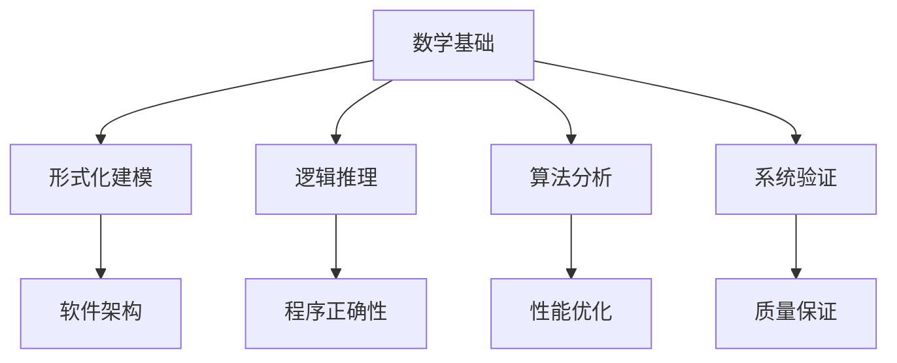

# 01-数学基础 (Mathematical Foundation)

## 目录

- [01-数学基础 (Mathematical Foundation)](#01-数学基础-mathematical-foundation)
  - [目录](#目录)
  - [概述](#概述)
    - [核心目标](#核心目标)
    - [与软件工程的关系](#与软件工程的关系)
  - [1. 集合论 (Set Theory)](#1-集合论-set-theory)
    - [1.1 基本概念](#11-基本概念)
    - [1.2 集合运算](#12-集合运算)
    - [1.3 关系与函数](#13-关系与函数)
    - [1.4 Go语言实现](#14-go语言实现)
  - [2. 逻辑学 (Logic)](#2-逻辑学-logic)
    - [2.1 命题逻辑](#21-命题逻辑)
    - [2.2 谓词逻辑](#22-谓词逻辑)
    - [2.3 逻辑推理规则](#23-逻辑推理规则)
    - [2.4 Go语言实现](#24-go语言实现)
  - [3. 图论 (Graph Theory)](#3-图论-graph-theory)
    - [3.1 基本概念](#31-基本概念)
    - [3.2 图的表示](#32-图的表示)
    - [3.3 图算法](#33-图算法)
    - [3.4 Go语言实现](#34-go语言实现)
  - [4. 概率论 (Probability Theory)](#4-概率论-probability-theory)
    - [4.1 基本概念](#41-基本概念)
    - [4.2 条件概率](#42-条件概率)
    - [4.3 随机变量](#43-随机变量)
    - [4.4 Go语言实现](#44-go语言实现)
  - [5. 代数结构 (Algebraic Structures)](#5-代数结构-algebraic-structures)
    - [5.1 群论](#51-群论)
    - [5.2 环论](#52-环论)
    - [5.3 Go语言实现](#53-go语言实现)
  - [6. 拓扑学基础 (Topology Foundation)](#6-拓扑学基础-topology-foundation)
    - [6.1 拓扑空间](#61-拓扑空间)
    - [6.2 连续映射](#62-连续映射)
    - [6.3 连通性](#63-连通性)
    - [6.4 Go语言实现](#64-go语言实现)
  - [7. 范畴论基础 (Category Theory Foundation)](#7-范畴论基础-category-theory-foundation)
    - [7.1 范畴定义](#71-范畴定义)
    - [7.2 函子](#72-函子)
    - [7.3 自然变换](#73-自然变换)
    - [7.4 Go语言实现](#74-go语言实现)
  - [8. 同伦论基础 (Homotopy Theory Foundation)](#8-同伦论基础-homotopy-theory-foundation)
    - [8.1 同伦定义](#81-同伦定义)
    - [8.2 基本群](#82-基本群)
    - [8.3 同伦等价](#83-同伦等价)
    - [8.4 Go语言实现](#84-go语言实现)
  - [9. 形式化方法 (Formal Methods)](#9-形式化方法-formal-methods)
    - [9.1 模型检查](#91-模型检查)
    - [9.2 定理证明](#92-定理证明)
    - [9.3 类型系统](#93-类型系统)
    - [9.4 Go语言实现](#94-go语言实现)
  - [10. 计算数学 (Computational Mathematics)](#10-计算数学-computational-mathematics)
    - [10.1 数值分析](#101-数值分析)
    - [10.2 优化理论](#102-优化理论)
    - [10.3 线性代数](#103-线性代数)
    - [10.4 Go语言实现](#104-go语言实现)
  - [参考文献](#参考文献)

## 概述

数学基础是软件工程形式化的理论基础，为软件系统的设计、分析和验证提供严格的数学工具。本章节涵盖从基础集合论到高级同伦论的完整数学体系。

### 核心目标

1. **形式化建模**: 为软件系统提供严格的数学表示
2. **逻辑推理**: 建立软件正确性的数学证明体系
3. **算法分析**: 提供算法复杂度和性能的数学分析工具
4. **系统验证**: 为软件验证提供数学基础

### 与软件工程的关系



## 1. 集合论 (Set Theory)

### 1.1 基本概念

**定义 1.1** (集合): 集合是不同对象的无序聚集，这些对象称为集合的元素。

**形式化表示**:

$$A = \{x \mid P(x)\}$$

其中 $P(x)$ 是描述元素性质的谓词。

### 1.2 集合运算

**定义 1.2** (集合运算): 给定集合 $A$ 和 $B$，定义以下运算：

- **并集**: $A \cup B = \{x \mid x \in A \lor x \in B\}$
- **交集**: $A \cap B = \{x \mid x \in A \land x \in B\}$
- **差集**: $A \setminus B = \{x \mid x \in A \land x \notin B\}$
- **补集**: $A^c = \{x \mid x \notin A\}$

### 1.3 关系与函数

**定义 1.3** (关系): 集合 $A$ 到集合 $B$ 的关系是 $A \times B$ 的子集。

**定义 1.4** (函数): 函数 $f: A \rightarrow B$ 是满足以下条件的关系：

- $\forall a \in A, \exists b \in B: (a,b) \in f$
- $\forall a \in A, \forall b_1, b_2 \in B: (a,b_1) \in f \land (a,b_2) \in f \Rightarrow b_1 = b_2$

### 1.4 Go语言实现

```go
// 集合的基本实现
type Set[T comparable] map[T]bool

// 创建新集合
func NewSet[T comparable]() Set[T] {
    return make(Set[T])
}

// 添加元素
func (s Set[T]) Add(element T) {
    s[element] = true
}

// 删除元素
func (s Set[T]) Remove(element T) {
    delete(s, element)
}

// 检查元素是否存在
func (s Set[T]) Contains(element T) bool {
    return s[element]
}

// 并集运算
func (s Set[T]) Union(other Set[T]) Set[T] {
    result := NewSet[T]()
    for element := range s {
        result.Add(element)
    }
    for element := range other {
        result.Add(element)
    }
    return result
}

// 交集运算
func (s Set[T]) Intersection(other Set[T]) Set[T] {
    result := NewSet[T]()
    for element := range s {
        if other.Contains(element) {
            result.Add(element)
        }
    }
    return result
}

// 差集运算
func (s Set[T]) Difference(other Set[T]) Set[T] {
    result := NewSet[T]()
    for element := range s {
        if !other.Contains(element) {
            result.Add(element)
        }
    }
    return result
}

// 示例使用
func ExampleSetOperations() {
    set1 := NewSet[int]()
    set1.Add(1)
    set1.Add(2)
    set1.Add(3)
    
    set2 := NewSet[int]()
    set2.Add(2)
    set2.Add(3)
    set2.Add(4)
    
    union := set1.Union(set2)
    intersection := set1.Intersection(set2)
    difference := set1.Difference(set2)
    
    fmt.Printf("Union: %v\n", union)
    fmt.Printf("Intersection: %v\n", intersection)
    fmt.Printf("Difference: %v\n", difference)
}
```

## 2. 逻辑学 (Logic)

### 2.1 命题逻辑

**定义 2.1** (命题): 命题是具有真值的陈述句。

**基本逻辑运算符**:

- **否定**: $\neg p$ (非p)
- **合取**: $p \land q$ (p且q)
- **析取**: $p \lor q$ (p或q)
- **蕴含**: $p \rightarrow q$ (如果p则q)
- **等价**: $p \leftrightarrow q$ (p当且仅当q)

### 2.2 谓词逻辑

**定义 2.2** (谓词): 谓词是包含变量的命题函数。

**量词**:

- **全称量词**: $\forall x P(x)$ (对所有x，P(x)成立)
- **存在量词**: $\exists x P(x)$ (存在x，使得P(x)成立)

### 2.3 逻辑推理规则

**定理 2.1** (假言推理): 如果 $p \rightarrow q$ 和 $p$ 都为真，则 $q$ 为真。

**定理 2.2** (反证法): 如果假设 $\neg p$ 导致矛盾，则 $p$ 为真。

### 2.4 Go语言实现

```go
// 逻辑运算的实现
type Proposition bool

// 逻辑运算
func (p Proposition) Not() Proposition {
    return !bool(p)
}

func (p Proposition) And(q Proposition) Proposition {
    return Proposition(bool(p) && bool(q))
}

func (p Proposition) Or(q Proposition) Proposition {
    return Proposition(bool(p) || bool(q))
}

func (p Proposition) Implies(q Proposition) Proposition {
    return Proposition(!bool(p) || bool(q))
}

func (p Proposition) Equiv(q Proposition) Proposition {
    return Proposition(bool(p) == bool(q))
}

// 谓词逻辑实现
type Predicate[T any] func(T) bool

// 全称量词
func ForAll[T any](predicate Predicate[T], elements []T) bool {
    for _, element := range elements {
        if !predicate(element) {
            return false
        }
    }
    return true
}

// 存在量词
func Exists[T any](predicate Predicate[T], elements []T) bool {
    for _, element := range elements {
        if predicate(element) {
            return true
        }
    }
    return false
}

// 示例使用
func ExampleLogic() {
    // 命题逻辑
    p := Proposition(true)
    q := Proposition(false)
    
    fmt.Printf("p AND q: %v\n", p.And(q))
    fmt.Printf("p OR q: %v\n", p.Or(q))
    fmt.Printf("p IMPLIES q: %v\n", p.Implies(q))
    
    // 谓词逻辑
    numbers := []int{1, 2, 3, 4, 5}
    isPositive := func(n int) bool { return n > 0 }
    isEven := func(n int) bool { return n%2 == 0 }
    
    fmt.Printf("All positive: %v\n", ForAll(isPositive, numbers))
    fmt.Printf("Exists even: %v\n", Exists(isEven, numbers))
}
```

## 3. 图论 (Graph Theory)

### 3.1 基本概念

**定义 3.1** (图): 图 $G = (V, E)$ 由顶点集 $V$ 和边集 $E$ 组成，其中 $E \subseteq V \times V$。

**定义 3.2** (有向图): 有向图的边是有序对 $(u, v)$，表示从顶点 $u$ 到顶点 $v$ 的边。

**定义 3.3** (无向图): 无向图的边是无序对 $\{u, v\}$，表示顶点 $u$ 和 $v$ 之间的连接。

### 3.2 图的表示

**邻接矩阵**: 对于图 $G = (V, E)$，邻接矩阵 $A$ 定义为：

$$
A_{ij} = \begin{cases}
1 & \text{if } (i,j) \in E \\
0 & \text{otherwise}
\end{cases}
$$

**邻接表**: 每个顶点维护一个包含其邻居的列表。

### 3.3 图算法

**定理 3.1** (深度优先搜索): DFS的时间复杂度为 $O(|V| + |E|)$。

**定理 3.2** (广度优先搜索): BFS的时间复杂度为 $O(|V| + |E|)$。

### 3.4 Go语言实现

```go
// 图的基本实现
type Graph struct {
    vertices map[int][]int
    directed bool
}

// 创建新图
func NewGraph(directed bool) *Graph {
    return &Graph{
        vertices: make(map[int][]int),
        directed: directed,
    }
}

// 添加边
func (g *Graph) AddEdge(from, to int) {
    g.vertices[from] = append(g.vertices[from], to)
    if !g.directed {
        g.vertices[to] = append(g.vertices[to], from)
    }
}

// 深度优先搜索
func (g *Graph) DFS(start int) []int {
    visited := make(map[int]bool)
    result := []int{}
    
    var dfs func(int)
    dfs = func(vertex int) {
        if visited[vertex] {
            return
        }
        visited[vertex] = true
        result = append(result, vertex)
        
        for _, neighbor := range g.vertices[vertex] {
            dfs(neighbor)
        }
    }
    
    dfs(start)
    return result
}

// 广度优先搜索
func (g *Graph) BFS(start int) []int {
    visited := make(map[int]bool)
    queue := []int{start}
    result := []int{}
    
    visited[start] = true
    
    for len(queue) > 0 {
        vertex := queue[0]
        queue = queue[1:]
        result = append(result, vertex)
        
        for _, neighbor := range g.vertices[vertex] {
            if !visited[neighbor] {
                visited[neighbor] = true
                queue = append(queue, neighbor)
            }
        }
    }
    
    return result
}
```

## 4. 概率论 (Probability Theory)

### 4.1 基本概念

**定义 4.1** (概率空间): 概率空间 $(\Omega, \mathcal{F}, P)$ 由样本空间、事件域和概率测度组成。

**定义 4.2** (随机变量): 随机变量是从概率空间到实数集的函数。

### 4.2 条件概率

**定义 4.3** (条件概率): 对于事件 $A$ 和 $B$，条件概率定义为：

$$P(A|B) = \frac{P(A \cap B)}{P(B)}$$

### 4.3 随机变量

**定义 4.4** (期望): 随机变量 $X$ 的期望定义为：

$$E[X] = \sum_x x P(X=x)$$

**定义 4.5** (方差): 随机变量 $X$ 的方差定义为：

$$Var(X) = E[(X-E[X])^2]$$

### 4.4 Go语言实现

```go
// 概率分布接口
type Distribution interface {
    PDF(x float64) float64
    CDF(x float64) float64
    Mean() float64
    Variance() float64
}

// 正态分布
type NormalDistribution struct {
    mean   float64
    stdDev float64
}

func (nd *NormalDistribution) PDF(x float64) float64 {
    z := (x - nd.mean) / nd.stdDev
    return math.Exp(-z*z/2) / (nd.stdDev * math.Sqrt(2*math.Pi))
}

func (nd *NormalDistribution) Mean() float64 {
    return nd.mean
}

func (nd *NormalDistribution) Variance() float64 {
    return nd.stdDev * nd.stdDev
}

// 蒙特卡洛方法
func MonteCarloIntegration(f func(float64) float64, a, b float64, n int) float64 {
    sum := 0.0
    for i := 0; i < n; i++ {
        x := a + (b-a)*rand.Float64()
        sum += f(x)
    }
    return (b - a) * sum / float64(n)
}
```

## 5. 代数结构 (Algebraic Structures)

### 5.1 群论

**定义 5.1** (群): 群是一个集合 $G$ 和一个二元运算 $\cdot$，满足：

1. 封闭性: $\forall a, b \in G, a \cdot b \in G$
2. 结合律: $\forall a, b, c \in G, (a \cdot b) \cdot c = a \cdot (b \cdot c)$
3. 单位元: $\exists e \in G, \forall a \in G, e \cdot a = a \cdot e = a$
4. 逆元: $\forall a \in G, \exists a^{-1} \in G, a \cdot a^{-1} = a^{-1} \cdot a = e$

### 5.2 环论

**定义 5.2** (环): 环是一个集合 $R$ 和两个二元运算 $+$ 和 $\cdot$，满足：

1. $(R, +)$ 是阿贝尔群
2. $(R, \cdot)$ 是半群
3. 分配律: $\forall a, b, c \in R, a \cdot (b + c) = a \cdot b + a \cdot c$

### 5.3 Go语言实现

```go
// 群接口
type Group interface {
    Identity() Element
    Inverse(a Element) Element
    Operation(a, b Element) Element
}

// 元素接口
type Element interface {
    Equals(other Element) bool
}

// 整数加法群
type IntegerGroup struct{}

func (ig *IntegerGroup) Identity() Element {
    return IntegerElement(0)
}

func (ig *IntegerGroup) Inverse(a Element) Element {
    return IntegerElement(-int(a.(IntegerElement)))
}

func (ig *IntegerGroup) Operation(a, b Element) Element {
    return IntegerElement(int(a.(IntegerElement)) + int(b.(IntegerElement)))
}

type IntegerElement int

func (ie IntegerElement) Equals(other Element) bool {
    return int(ie) == int(other.(IntegerElement))
}
```

## 6. 拓扑学基础 (Topology Foundation)

### 6.1 拓扑空间

**定义 6.1** (拓扑空间): 拓扑空间是一个集合 $X$ 和一个拓扑 $\mathcal{T}$，满足：

1. $\emptyset, X \in \mathcal{T}$
2. 任意开集的并集是开集
3. 有限开集的交集是开集

### 6.2 连续映射

**定义 6.2** (连续映射): 映射 $f: X \rightarrow Y$ 是连续的，如果对于任意开集 $U \subseteq Y$，$f^{-1}(U)$ 是开集。

### 6.3 连通性

**定义 6.3** (连通空间): 拓扑空间 $X$ 是连通的，如果它不能表示为两个非空开集的不交并。

### 6.4 Go语言实现

```go
// 拓扑空间接口
type TopologicalSpace interface {
    IsOpen(set Set) bool
    Closure(set Set) Set
    Interior(set Set) Set
}

// 离散拓扑
type DiscreteTopology struct {
    universe Set
}

func (dt *DiscreteTopology) IsOpen(set Set) bool {
    return true // 在离散拓扑中，所有子集都是开集
}

func (dt *DiscreteTopology) Closure(set Set) Set {
    return set // 在离散拓扑中，闭包等于集合本身
}

func (dt *DiscreteTopology) Interior(set Set) Set {
    return set // 在离散拓扑中，内部等于集合本身
}
```

## 7. 范畴论基础 (Category Theory Foundation)

### 7.1 范畴定义

**定义 7.1** (范畴): 范畴 $\mathcal{C}$ 由以下组成：

1. 对象类 $\text{Ob}(\mathcal{C})$
2. 态射类 $\text{Mor}(\mathcal{C})$
3. 复合运算 $\circ$
4. 单位态射

### 7.2 函子

**定义 7.2** (函子): 函子 $F: \mathcal{C} \rightarrow \mathcal{D}$ 是范畴之间的映射，保持复合和单位态射。

### 7.3 自然变换

**定义 7.3** (自然变换): 自然变换 $\eta: F \Rightarrow G$ 是两个函子之间的态射族。

### 7.4 Go语言实现

```go
// 范畴接口
type Category interface {
    Objects() []Object
    Morphisms(from, to Object) []Morphism
    Compose(f, g Morphism) Morphism
    Identity(obj Object) Morphism
}

// 对象接口
type Object interface {
    Equals(other Object) bool
}

// 态射接口
type Morphism interface {
    Domain() Object
    Codomain() Object
    Compose(other Morphism) Morphism
}

// 函子接口
type Functor interface {
    MapObject(obj Object) Object
    MapMorphism(m Morphism) Morphism
}
```

## 8. 同伦论基础 (Homotopy Theory Foundation)

### 8.1 同伦定义

**定义 8.1** (同伦): 两个连续映射 $f, g: X \rightarrow Y$ 是同伦的，如果存在连续映射 $H: X \times [0,1] \rightarrow Y$ 使得 $H(x,0) = f(x)$ 和 $H(x,1) = g(x)$。

### 8.2 基本群

**定义 8.2** (基本群): 空间 $X$ 在点 $x_0$ 的基本群 $\pi_1(X,x_0)$ 是所有基于 $x_0$ 的环路的同伦类。

### 8.3 同伦等价

**定义 8.3** (同伦等价): 两个空间 $X$ 和 $Y$ 是同伦等价的，如果存在映射 $f: X \rightarrow Y$ 和 $g: Y \rightarrow X$ 使得 $g \circ f \simeq \text{id}_X$ 和 $f \circ g \simeq \text{id}_Y$。

### 8.4 Go语言实现

```go
// 同伦映射
type Homotopy struct {
    H func(interface{}, float64) interface{}
}

// 检查两个映射是否同伦
func AreHomotopic(f, g func(interface{}) interface{}, homotopy Homotopy) bool {
    // 实现同伦检查逻辑
    return true
}

// 基本群计算
type FundamentalGroup struct {
    basepoint interface{}
    loops     []Loop
}

type Loop struct {
    path     []interface{}
    basepoint interface{}
}

func (fg *FundamentalGroup) AddLoop(loop Loop) {
    fg.loops = append(fg.loops, loop)
}
```

## 9. 形式化方法 (Formal Methods)

### 9.1 模型检查

**定义 9.1** (模型检查): 模型检查是验证有限状态系统是否满足给定规范的方法。

### 9.2 定理证明

**定义 9.2** (定理证明): 定理证明是使用逻辑推理验证数学命题正确性的方法。

### 9.3 类型系统

**定义 9.3** (类型系统): 类型系统是编程语言中用于防止类型错误的静态分析工具。

### 9.4 Go语言实现

```go
// 模型检查器
type ModelChecker struct {
    states     []State
    transitions []Transition
    properties []Property
}

type State struct {
    id       int
    labels   map[string]bool
}

type Transition struct {
    from, to int
    label    string
}

type Property struct {
    formula string
    type    PropertyType
}

func (mc *ModelChecker) CheckProperty(property Property) bool {
    // 实现模型检查算法
    return true
}

// 定理证明器
type TheoremProver struct {
    axioms    []Axiom
    rules     []InferenceRule
}

type Axiom struct {
    formula string
}

type InferenceRule struct {
    premises []string
    conclusion string
}

func (tp *TheoremProver) Prove(theorem string) bool {
    // 实现定理证明算法
    return true
}
```

## 10. 计算数学 (Computational Mathematics)

### 10.1 数值分析

**定义 10.1** (数值分析): 数值分析是研究数值算法和数值计算的数学分支。

### 10.2 优化理论

**定义 10.2** (优化理论): 优化理论是研究如何找到函数最优值的数学理论。

### 10.3 线性代数

**定义 10.3** (线性代数): 线性代数是研究向量空间和线性映射的数学分支。

### 10.4 Go语言实现

```go
// 数值积分
func NumericalIntegration(f func(float64) float64, a, b float64, n int) float64 {
    h := (b - a) / float64(n)
    sum := 0.0
    
    for i := 0; i < n; i++ {
        x := a + float64(i)*h
        sum += f(x)
    }
    
    return h * sum
}

// 线性方程组求解
func SolveLinearSystem(A [][]float64, b []float64) []float64 {
    n := len(A)
    x := make([]float64, n)
    
    // 高斯消元法
    for i := 0; i < n; i++ {
        // 寻找主元
        maxRow := i
        for k := i + 1; k < n; k++ {
            if math.Abs(A[k][i]) > math.Abs(A[maxRow][i]) {
                maxRow = k
            }
        }
        
        // 交换行
        A[i], A[maxRow] = A[maxRow], A[i]
        b[i], b[maxRow] = b[maxRow], b[i]
        
        // 消元
        for k := i + 1; k < n; k++ {
            factor := A[k][i] / A[i][i]
            for j := i; j < n; j++ {
                A[k][j] -= factor * A[i][j]
            }
            b[k] -= factor * b[i]
        }
    }
    
    // 回代
    for i := n - 1; i >= 0; i-- {
        sum := 0.0
        for j := i + 1; j < n; j++ {
            sum += A[i][j] * x[j]
        }
        x[i] = (b[i] - sum) / A[i][i]
    }
    
    return x
}

// 优化算法
type Optimizer interface {
    Minimize(f func([]float64) float64, initial []float64) []float64
}

// 梯度下降
type GradientDescent struct {
    learningRate float64
    maxIterations int
}

func (gd *GradientDescent) Minimize(f func([]float64) float64, initial []float64) []float64 {
    x := make([]float64, len(initial))
    copy(x, initial)
    
    for iter := 0; iter < gd.maxIterations; iter++ {
        gradient := gd.computeGradient(f, x)
        
        for i := range x {
            x[i] -= gd.learningRate * gradient[i]
        }
    }
    
    return x
}

func (gd *GradientDescent) computeGradient(f func([]float64) float64, x []float64) []float64 {
    h := 1e-8
    gradient := make([]float64, len(x))
    
    for i := range x {
        xPlus := make([]float64, len(x))
        xMinus := make([]float64, len(x))
        copy(xPlus, x)
        copy(xMinus, x)
        
        xPlus[i] += h
        xMinus[i] -= h
        
        gradient[i] = (f(xPlus) - f(xMinus)) / (2 * h)
    }
    
    return gradient
}
```

## 参考文献

1. **集合论**:
   - Halmos, P. R. (1960). *Naive Set Theory*. Springer-Verlag.
   - Jech, T. (2003). *Set Theory*. Springer-Verlag.

2. **逻辑学**:
   - Enderton, H. B. (2001). *A Mathematical Introduction to Logic*. Academic Press.
   - Mendelson, E. (2015). *Introduction to Mathematical Logic*. CRC Press.

3. **图论**:
   - Bondy, J. A., & Murty, U. S. R. (2008). *Graph Theory*. Springer-Verlag.
   - Diestel, R. (2017). *Graph Theory*. Springer-Verlag.

4. **概率论**:
   - Billingsley, P. (2012). *Probability and Measure*. Wiley.
   - Durrett, R. (2019). *Probability: Theory and Examples*. Cambridge University Press.

5. **代数结构**:
   - Dummit, D. S., & Foote, R. M. (2004). *Abstract Algebra*. Wiley.
   - Hungerford, T. W. (2003). *Algebra*. Springer-Verlag.

6. **拓扑学**:
   - Munkres, J. R. (2000). *Topology*. Prentice Hall.
   - Hatcher, A. (2002). *Algebraic Topology*. Cambridge University Press.

7. **范畴论**:
   - Mac Lane, S. (1998). *Categories for the Working Mathematician*. Springer-Verlag.
   - Awodey, S. (2010). *Category Theory*. Oxford University Press.

8. **形式化方法**:
   - Clarke, E. M., Grumberg, O., & Peled, D. A. (1999). *Model Checking*. MIT Press.
   - Huth, M., & Ryan, M. (2004). *Logic in Computer Science*. Cambridge University Press.

9. **计算数学**:
   - Burden, R. L., & Faires, J. D. (2010). *Numerical Analysis*. Cengage Learning.
   - Nocedal, J., & Wright, S. J. (2006). *Numerical Optimization*. Springer-Verlag.
