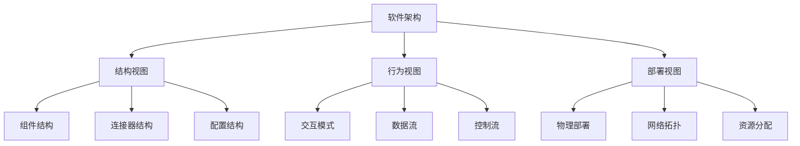

# 01-软件架构基础理论 (Software Architecture Foundation)

## 目录

- [01-软件架构基础理论 (Software Architecture Foundation)](#01-软件架构基础理论-software-architecture-foundation)
  - [目录](#目录)
  - [1. 概述](#1-概述)
    - [1.1 定义](#11-定义)
    - [1.2 核心概念](#12-核心概念)
    - [1.3 架构层次](#13-架构层次)
  - [2. 形式化定义](#2-形式化定义)
    - [2.1 基本定义](#21-基本定义)
    - [2.2 形式化规范](#22-形式化规范)
    - [2.3 架构约束定义](#23-架构约束定义)
  - [3. 数学基础](#3-数学基础)
    - [3.1 图论基础](#31-图论基础)
    - [3.2 复杂度理论](#32-复杂度理论)
    - [3.3 信息论基础](#33-信息论基础)
  - [4. 架构原则](#4-架构原则)
    - [4.1 SOLID原则](#41-solid原则)
    - [4.2 架构质量属性](#42-架构质量属性)
  - [5. Go语言实现](#5-go语言实现)
    - [5.1 基础架构框架](#51-基础架构框架)
    - [5.2 泛型架构框架](#52-泛型架构框架)
    - [5.3 函数式架构框架](#53-函数式架构框架)
  - [6. 架构模式](#6-架构模式)
    - [6.1 分层架构](#61-分层架构)
    - [6.2 微服务架构](#62-微服务架构)
    - [6.3 事件驱动架构](#63-事件驱动架构)
  - [7. 性能分析](#7-性能分析)
    - [7.1 时间复杂度](#71-时间复杂度)
    - [7.2 空间复杂度](#72-空间复杂度)
    - [7.3 性能优化建议](#73-性能优化建议)
  - [8. 最佳实践](#8-最佳实践)
    - [8.1 设计原则](#81-设计原则)
    - [8.2 实现建议](#82-实现建议)
    - [8.3 测试策略](#83-测试策略)
  - [9. 相关理论](#9-相关理论)
    - [9.1 系统理论](#91-系统理论)
    - [9.2 控制理论](#92-控制理论)
    - [9.3 信息理论](#93-信息理论)
  - [10. 总结](#10-总结)
    - [10.1 优势](#101-优势)
    - [10.2 挑战](#102-挑战)
    - [10.3 发展趋势](#103-发展趋势)
    - [10.4 数学总结](#104-数学总结)

## 1. 概述

### 1.1 定义

软件架构是软件系统的高级结构，它定义了系统的组织方式、组件之间的关系以及设计原则。软件架构为系统的开发、部署和维护提供了基础框架。

### 1.2 核心概念



### 1.3 架构层次

- **系统架构**: 整个系统的宏观结构
- **应用架构**: 应用程序的内部结构
- **组件架构**: 可重用组件的设计
- **模块架构**: 代码模块的组织方式

## 2. 形式化定义

### 2.1 基本定义

设 ```latex
$\mathcal{C}$
``` 为组件集合，```latex
$\mathcal{L}$
``` 为连接器集合，```latex
$\mathcal{I}$
``` 为接口集合。

**定义 2.1** (软件架构)
软件架构是一个五元组 ```latex
$(\mathcal{C}, \mathcal{L}, \mathcal{I}, \mathcal{T}, \mathcal{P})$
```，其中：

- ```latex
$\mathcal{C} = \{C_1, C_2, \ldots, C_n\}$
``` 是组件集合
- ```latex
$\mathcal{L} = \{L_1, L_2, \ldots, L_m\}$
``` 是连接器集合
- ```latex
$\mathcal{I} = \{I_1, I_2, \ldots, I_k\}$
``` 是接口集合
- ```latex
$\mathcal{T}: \mathcal{C} \times \mathcal{C} \rightarrow \mathcal{L}$
``` 是拓扑函数
- ```latex
$\mathcal{P}: \mathcal{C} \cup \mathcal{L} \rightarrow \mathcal{I}^*$
``` 是属性函数

### 2.2 形式化规范

**公理 2.1** (组件连接性)
对于任意组件 ```latex
$C_i, C_j \in \mathcal{C}$
```，如果存在连接器 ```latex
$L \in \mathcal{L}$
``` 连接它们，则：

$```latex
$\mathcal{T}(C_i, C_j) = L \Rightarrow \exists I_i, I_j \in \mathcal{I}: I_i \in \mathcal{P}(C_i) \land I_j \in \mathcal{P}(C_j)$
```$

**公理 2.2** (接口兼容性)
对于任意连接器 ```latex
$L \in \mathcal{L}$
``` 和其连接的组件 ```latex
$C_i, C_j \in \mathcal{C}$
```：

$```latex
$\mathcal{T}(C_i, C_j) = L \Rightarrow \text{compatible}(\mathcal{P}(C_i), \mathcal{P}(C_j))$
```$

### 2.3 架构约束定义

**定义 2.2** (架构约束)
架构约束是一个三元组 ```latex
$(\mathcal{R}, \mathcal{V}, \mathcal{E})$
```，其中：

- ```latex
$\mathcal{R}$
``` 是约束规则集合
- ```latex
$\mathcal{V}$
``` 是验证函数集合
- ```latex
$\mathcal{E}$
``` 是执行函数集合

## 3. 数学基础

### 3.1 图论基础

**定理 3.1** (架构连通性)
设 ```latex
$G = (V, E)$
``` 为架构图，其中 ```latex
$V = \mathcal{C}$
``` 是组件集合，```latex
$E = \mathcal{L}$
``` 是连接器集合，则：

$```latex
$\text{connectivity}(G) = \min_{S \subset V} \frac{|E(S, V-S)|}{|S|}$
```$

其中 ```latex
$E(S, V-S)$
``` 是割集。

**证明**:

1. 架构的连通性决定了系统的可靠性
2. 最小割集的大小决定了系统的容错能力
3. 连通性越高，系统越稳定

### 3.2 复杂度理论

**定理 3.2** (架构复杂度)
设 ```latex
$A$
``` 为软件架构，```latex
$n$
``` 为组件数量，```latex
$m$
``` 为连接器数量，则架构复杂度为：

$```latex
$C(A) = O(n \log n + m)$
```$

**证明**:

1. 组件间的交互复杂度为 ```latex
$O(n \log n)$
```
2. 连接器的管理复杂度为 ```latex
$O(m)$
```
3. 总复杂度为两者的和

### 3.3 信息论基础

**定理 3.3** (架构信息熵)
设 ```latex
$A$
``` 为软件架构，```latex
$p_i$
``` 为第 ```latex
$i$
``` 个组件的使用概率，则架构信息熵为：

$```latex
$H(A) = -\sum_{i=1}^{n} p_i \log p_i$
```$

**证明**:

1. 信息熵衡量架构的不确定性
2. 熵越低，架构越稳定
3. 熵越高，架构越灵活

## 4. 架构原则

### 4.1 SOLID原则

**单一职责原则 (SRP)**
一个组件应该只有一个改变的理由。

**开闭原则 (OCP)**
软件实体应该对扩展开放，对修改封闭。

**里氏替换原则 (LSP)**
子类型必须能够替换其基类型。

**接口隔离原则 (ISP)**
客户端不应该依赖它不使用的接口。

**依赖倒置原则 (DIP)**
高层模块不应该依赖低层模块，两者都应该依赖抽象。

### 4.2 架构质量属性

**可用性 (Availability)**
$```latex
$A = \frac{MTTF}{MTTF + MTTR}$
```$

**性能 (Performance)**
$```latex
$P = \frac{1}{\sum_{i=1}^{n} \frac{1}{P_i}}$
```$

**可扩展性 (Scalability)**
$```latex
$S = \frac{\Delta \text{Capacity}}{\Delta \text{Resources}}$
```$

**可维护性 (Maintainability)**
$```latex
$M = \frac{\text{Functionality}}{\text{Complexity}}$
```$

## 5. Go语言实现

### 5.1 基础架构框架

```go
package main

import (
 "context"
 "fmt"
 "sync"
 "time"
)

// Component 组件接口
type Component interface {
 ID() string
 Start(ctx context.Context) error
 Stop(ctx context.Context) error
 Health() HealthStatus
}

// HealthStatus 健康状态
type HealthStatus struct {
 Status    string    `json:"status"`
 Timestamp time.Time `json:"timestamp"`
 Details   string    `json:"details"`
}

// BaseComponent 基础组件
type BaseComponent struct {
 id       string
 status   HealthStatus
 mu       sync.RWMutex
 ctx      context.Context
 cancel   context.CancelFunc
}

func NewBaseComponent(id string) *BaseComponent {
 ctx, cancel := context.WithCancel(context.Background())
 return &BaseComponent{
  id:     id,
  status: HealthStatus{Status: "stopped", Timestamp: time.Now()},
  ctx:    ctx,
  cancel: cancel,
 }
}

func (b *BaseComponent) ID() string {
 return b.id
}

func (b *BaseComponent) Start(ctx context.Context) error {
 b.mu.Lock()
 defer b.mu.Unlock()
 
 b.status = HealthStatus{
  Status:    "running",
  Timestamp: time.Now(),
  Details:   "Component started successfully",
 }
 
 fmt.Printf("Component %s started\n", b.id)
 return nil
}

func (b *BaseComponent) Stop(ctx context.Context) error {
 b.mu.Lock()
 defer b.mu.Unlock()
 
 b.cancel()
 b.status = HealthStatus{
  Status:    "stopped",
  Timestamp: time.Now(),
  Details:   "Component stopped",
 }
 
 fmt.Printf("Component %s stopped\n", b.id)
 return nil
}

func (b *BaseComponent) Health() HealthStatus {
 b.mu.RLock()
 defer b.mu.RUnlock()
 return b.status
}

// Connector 连接器接口
type Connector interface {
 ID() string
 Connect(source, target Component) error
 Disconnect(source, target Component) error
 IsConnected(source, target Component) bool
}

// BaseConnector 基础连接器
type BaseConnector struct {
 id         string
 connections map[string]map[string]bool
 mu         sync.RWMutex
}

func NewBaseConnector(id string) *BaseConnector {
 return &BaseConnector{
  id:          id,
  connections: make(map[string]map[string]bool),
 }
}

func (b *BaseConnector) ID() string {
 return b.id
}

func (b *BaseConnector) Connect(source, target Component) error {
 b.mu.Lock()
 defer b.mu.Unlock()
 
 if b.connections[source.ID()] == nil {
  b.connections[source.ID()] = make(map[string]bool)
 }
 
 b.connections[source.ID()][target.ID()] = true
 fmt.Printf("Connected %s to %s via %s\n", source.ID(), target.ID(), b.id)
 return nil
}

func (b *BaseConnector) Disconnect(source, target Component) error {
 b.mu.Lock()
 defer b.mu.Unlock()
 
 if b.connections[source.ID()] != nil {
  delete(b.connections[source.ID()], target.ID())
 }
 
 fmt.Printf("Disconnected %s from %s via %s\n", source.ID(), target.ID(), b.id)
 return nil
}

func (b *BaseConnector) IsConnected(source, target Component) bool {
 b.mu.RLock()
 defer b.mu.RUnlock()
 
 if b.connections[source.ID()] == nil {
  return false
 }
 
 return b.connections[source.ID()][target.ID()]
}

// Architecture 架构定义
type Architecture struct {
 components map[string]Component
 connectors map[string]Connector
 topology   map[string]map[string]string // source -> target -> connector
 mu         sync.RWMutex
}

func NewArchitecture() *Architecture {
 return &Architecture{
  components: make(map[string]Component),
  connectors: make(map[string]Connector),
  topology:   make(map[string]map[string]string),
 }
}

func (a *Architecture) AddComponent(component Component) {
 a.mu.Lock()
 defer a.mu.Unlock()
 a.components[component.ID()] = component
}

func (a *Architecture) AddConnector(connector Connector) {
 a.mu.Lock()
 defer a.mu.Unlock()
 a.connectors[connector.ID()] = connector
}

func (a *Architecture) Connect(sourceID, targetID, connectorID string) error {
 a.mu.Lock()
 defer a.mu.Unlock()
 
 source, exists := a.components[sourceID]
 if !exists {
  return fmt.Errorf("source component %s not found", sourceID)
 }
 
 target, exists := a.components[targetID]
 if !exists {
  return fmt.Errorf("target component %s not found", targetID)
 }
 
 connector, exists := a.connectors[connectorID]
 if !exists {
  return fmt.Errorf("connector %s not found", connectorID)
 }
 
 if a.topology[sourceID] == nil {
  a.topology[sourceID] = make(map[string]string)
 }
 
 a.topology[sourceID][targetID] = connectorID
 
 return connector.Connect(source, target)
}

func (a *Architecture) Start(ctx context.Context) error {
 a.mu.RLock()
 defer a.mu.RUnlock()
 
 for _, component := range a.components {
  if err := component.Start(ctx); err != nil {
   return fmt.Errorf("failed to start component %s: %w", component.ID(), err)
  }
 }
 
 return nil
}

func (a *Architecture) Stop(ctx context.Context) error {
 a.mu.RLock()
 defer a.mu.RUnlock()
 
 for _, component := range a.components {
  if err := component.Stop(ctx); err != nil {
   return fmt.Errorf("failed to stop component %s: %w", component.ID(), err)
  }
 }
 
 return nil
}

func (a *Architecture) Health() map[string]HealthStatus {
 a.mu.RLock()
 defer a.mu.RUnlock()
 
 health := make(map[string]HealthStatus)
 for id, component := range a.components {
  health[id] = component.Health()
 }
 
 return health
}

// 具体组件实现
type DatabaseComponent struct {
 *BaseComponent
 connectionString string
}

func NewDatabaseComponent(id, connectionString string) *DatabaseComponent {
 return &DatabaseComponent{
  BaseComponent:    NewBaseComponent(id),
  connectionString: connectionString,
 }
}

func (d *DatabaseComponent) Start(ctx context.Context) error {
 // 模拟数据库连接
 time.Sleep(100 * time.Millisecond)
 return d.BaseComponent.Start(ctx)
}

type APIServerComponent struct {
 *BaseComponent
 port int
}

func NewAPIServerComponent(id string, port int) *APIServerComponent {
 return &APIServerComponent{
  BaseComponent: NewBaseComponent(id),
  port:         port,
 }
}

func (a *APIServerComponent) Start(ctx context.Context) error {
 // 模拟API服务器启动
 time.Sleep(50 * time.Millisecond)
 return a.BaseComponent.Start(ctx)
}

func main() {
 // 创建架构
 arch := NewArchitecture()
 
 // 添加组件
 db := NewDatabaseComponent("database", "postgres://localhost:5432/mydb")
 api := NewAPIServerComponent("api-server", 8080)
 
 arch.AddComponent(db)
 arch.AddComponent(api)
 
 // 添加连接器
 httpConnector := NewBaseConnector("http-connector")
 arch.AddConnector(httpConnector)
 
 // 连接组件
 arch.Connect("api-server", "database", "http-connector")
 
 // 启动架构
 ctx := context.Background()
 if err := arch.Start(ctx); err != nil {
  fmt.Printf("Failed to start architecture: %v\n", err)
  return
 }
 
 // 检查健康状态
 health := arch.Health()
 for id, status := range health {
  fmt.Printf("Component %s: %s\n", id, status.Status)
 }
 
 // 停止架构
 arch.Stop(ctx)
}
```

### 5.2 泛型架构框架

```go
package main

import (
 "context"
 "fmt"
 "reflect"
)

// GenericComponent 泛型组件
type GenericComponent[T any] interface {
 ID() string
 Process(data T) (T, error)
 GetState() T
 SetState(state T)
}

// GenericBaseComponent 泛型基础组件
type GenericBaseComponent[T any] struct {
 id    string
 state T
}

func NewGenericBaseComponent[T any](id string, initialState T) *GenericBaseComponent[T] {
 return &GenericBaseComponent[T]{
  id:    id,
  state: initialState,
 }
}

func (g *GenericBaseComponent[T]) ID() string {
 return g.id
}

func (g *GenericBaseComponent[T]) Process(data T) (T, error) {
 // 默认处理逻辑
 return data, nil
}

func (g *GenericBaseComponent[T]) GetState() T {
 return g.state
}

func (g *GenericBaseComponent[T]) SetState(state T) {
 g.state = state
}

// GenericConnector 泛型连接器
type GenericConnector[T any] interface {
 ID() string
 Transfer(source, target GenericComponent[T], data T) error
}

// GenericBaseConnector 泛型基础连接器
type GenericBaseConnector[T any] struct {
 id string
}

func NewGenericBaseConnector[T any](id string) *GenericBaseConnector[T] {
 return &GenericBaseConnector[T]{id: id}
}

func (g *GenericBaseConnector[T]) ID() string {
 return g.id
}

func (g *GenericBaseConnector[T]) Transfer(source, target GenericComponent[T], data T) error {
 processedData, err := source.Process(data)
 if err != nil {
  return fmt.Errorf("source processing failed: %w", err)
 }
 
 target.SetState(processedData)
 fmt.Printf("Transferred data from %s to %s via %s\n", source.ID(), target.ID(), g.id)
 return nil
}

// GenericArchitecture 泛型架构
type GenericArchitecture[T any] struct {
 components map[string]GenericComponent[T]
 connectors map[string]GenericConnector[T]
 topology   map[string]map[string]string
}

func NewGenericArchitecture[T any]() *GenericArchitecture[T] {
 return &GenericArchitecture[T]{
  components: make(map[string]GenericComponent[T]),
  connectors: make(map[string]GenericConnector[T]),
  topology:   make(map[string]map[string]string),
 }
}

func (g *GenericArchitecture[T]) AddComponent(component GenericComponent[T]) {
 g.components[component.ID()] = component
}

func (g *GenericArchitecture[T]) AddConnector(connector GenericConnector[T]) {
 g.connectors[connector.ID()] = connector
}

func (g *GenericArchitecture[T]) Connect(sourceID, targetID, connectorID string) error {
 source, exists := g.components[sourceID]
 if !exists {
  return fmt.Errorf("source component %s not found", sourceID)
 }
 
 target, exists := g.components[targetID]
 if !exists {
  return fmt.Errorf("target component %s not found", targetID)
 }
 
 connector, exists := g.connectors[connectorID]
 if !exists {
  return fmt.Errorf("connector %s not found", connectorID)
 }
 
 if g.topology[sourceID] == nil {
  g.topology[sourceID] = make(map[string]string)
 }
 
 g.topology[sourceID][targetID] = connectorID
 
 // 执行初始传输
 var zero T
 return connector.Transfer(source, target, zero)
}

func (g *GenericArchitecture[T]) Execute(data T) error {
 // 执行架构中的所有组件
 for _, component := range g.components {
  if _, err := component.Process(data); err != nil {
   return fmt.Errorf("component %s processing failed: %w", component.ID(), err)
  }
 }
 return nil
}

func (g *GenericArchitecture[T]) GetStates() map[string]T {
 states := make(map[string]T)
 for id, component := range g.components {
  states[id] = component.GetState()
 }
 return states
}

// 具体实现示例
type StringProcessor struct {
 *GenericBaseComponent[string]
}

func NewStringProcessor(id string) *StringProcessor {
 return &StringProcessor{
  GenericBaseComponent: NewGenericBaseComponent(id, ""),
 }
}

func (s *StringProcessor) Process(data string) (string, error) {
 processed := fmt.Sprintf("Processed by %s: %s", s.ID(), data)
 s.SetState(processed)
 return processed, nil
}

type NumberProcessor struct {
 *GenericBaseComponent[int]
}

func NewNumberProcessor(id string) *NumberProcessor {
 return &NumberProcessor{
  GenericBaseComponent: NewGenericBaseComponent(id, 0),
 }
}

func (n *NumberProcessor) Process(data int) (int, error) {
 processed := data * 2
 n.SetState(processed)
 return processed, nil
}

func main() {
 // 字符串处理架构
 stringArch := NewGenericArchitecture[string]()
 
 strProc1 := NewStringProcessor("processor1")
 strProc2 := NewStringProcessor("processor2")
 
 stringArch.AddComponent(strProc1)
 stringArch.AddComponent(strProc2)
 
 strConnector := NewGenericBaseConnector[string]("string-connector")
 stringArch.AddConnector(strConnector)
 
 stringArch.Connect("processor1", "processor2", "string-connector")
 
 // 执行字符串处理
 stringArch.Execute("Hello, World!")
 
 // 数字处理架构
 numberArch := NewGenericArchitecture[int]()
 
 numProc1 := NewNumberProcessor("number1")
 numProc2 := NewNumberProcessor("number2")
 
 numberArch.AddComponent(numProc1)
 numberArch.AddComponent(numProc2)
 
 numConnector := NewGenericBaseConnector[int]("number-connector")
 numberArch.AddConnector(numConnector)
 
 numberArch.Connect("number1", "number2", "number-connector")
 
 // 执行数字处理
 numberArch.Execute(42)
 
 // 显示结果
 fmt.Println("String states:", stringArch.GetStates())
 fmt.Println("Number states:", numberArch.GetStates())
}
```

### 5.3 函数式架构框架

```go
package main

import (
 "context"
 "fmt"
 "sync"
)

// FunctionalComponent 函数式组件
type FunctionalComponent[T any] struct {
 id       string
 process  func(T) (T, error)
 state    T
 mu       sync.RWMutex
}

func NewFunctionalComponent[T any](
 id string,
 process func(T) (T, error),
 initialState T,
) *FunctionalComponent[T] {
 return &FunctionalComponent[T]{
  id:      id,
  process: process,
  state:   initialState,
 }
}

func (f *FunctionalComponent[T]) ID() string {
 return f.id
}

func (f *FunctionalComponent[T]) Process(data T) (T, error) {
 f.mu.Lock()
 defer f.mu.Unlock()
 
 result, err := f.process(data)
 if err == nil {
  f.state = result
 }
 return result, err
}

func (f *FunctionalComponent[T]) GetState() T {
 f.mu.RLock()
 defer f.mu.RUnlock()
 return f.state
}

// FunctionalConnector 函数式连接器
type FunctionalConnector[T any] struct {
 id      string
 transfer func(T, T) (T, error)
}

func NewFunctionalConnector[T any](
 id string,
 transfer func(T, T) (T, error),
) *FunctionalConnector[T] {
 return &FunctionalConnector[T]{
  id:      id,
  transfer: transfer,
 }
}

func (f *FunctionalConnector[T]) ID() string {
 return f.id
}

func (f *FunctionalConnector[T]) Transfer(source, target *FunctionalComponent[T], data T) error {
 sourceResult, err := source.Process(data)
 if err != nil {
  return err
 }
 
 if f.transfer != nil {
  targetResult, err := f.transfer(sourceResult, target.GetState())
  if err != nil {
   return err
  }
  target.Process(targetResult)
 } else {
  target.Process(sourceResult)
 }
 
 fmt.Printf("Transferred data from %s to %s via %s\n", source.ID(), target.ID(), f.id)
 return nil
}

// FunctionalArchitecture 函数式架构
type FunctionalArchitecture[T any] struct {
 components map[string]*FunctionalComponent[T]
 connectors map[string]*FunctionalConnector[T]
 topology   map[string]map[string]string
 mu         sync.RWMutex
}

func NewFunctionalArchitecture[T any]() *FunctionalArchitecture[T] {
 return &FunctionalArchitecture[T]{
  components: make(map[string]*FunctionalComponent[T]),
  connectors: make(map[string]*FunctionalConnector[T]),
  topology:   make(map[string]map[string]string),
 }
}

func (f *FunctionalArchitecture[T]) AddComponent(component *FunctionalComponent[T]) {
 f.mu.Lock()
 defer f.mu.Unlock()
 f.components[component.ID()] = component
}

func (f *FunctionalArchitecture[T]) AddConnector(connector *FunctionalConnector[T]) {
 f.mu.Lock()
 defer f.mu.Unlock()
 f.connectors[connector.ID()] = connector
}

func (f *FunctionalArchitecture[T]) Connect(sourceID, targetID, connectorID string) error {
 f.mu.Lock()
 defer f.mu.Unlock()
 
 source, exists := f.components[sourceID]
 if !exists {
  return fmt.Errorf("source component %s not found", sourceID)
 }
 
 target, exists := f.components[targetID]
 if !exists {
  return fmt.Errorf("target component %s not found", targetID)
 }
 
 connector, exists := f.connectors[connectorID]
 if !exists {
  return fmt.Errorf("connector %s not found", connectorID)
 }
 
 if f.topology[sourceID] == nil {
  f.topology[sourceID] = make(map[string]string)
 }
 
 f.topology[sourceID][targetID] = connectorID
 
 // 执行初始传输
 var zero T
 return connector.Transfer(source, target, zero)
}

func (f *FunctionalArchitecture[T]) Execute(data T) error {
 f.mu.RLock()
 defer f.mu.RUnlock()
 
 // 并行执行所有组件
 var wg sync.WaitGroup
 errChan := make(chan error, len(f.components))
 
 for _, component := range f.components {
  wg.Add(1)
  go func(comp *FunctionalComponent[T]) {
   defer wg.Done()
   if _, err := comp.Process(data); err != nil {
    errChan <- fmt.Errorf("component %s failed: %w", comp.ID(), err)
   }
  }(component)
 }
 
 wg.Wait()
 close(errChan)
 
 // 检查错误
 for err := range errChan {
  return err
 }
 
 return nil
}

func (f *FunctionalArchitecture[T]) GetStates() map[string]T {
 f.mu.RLock()
 defer f.mu.RUnlock()
 
 states := make(map[string]T)
 for id, component := range f.components {
  states[id] = component.GetState()
 }
 return states
}

func main() {
 // 创建函数式架构
 arch := NewFunctionalArchitecture[string]()
 
 // 创建组件
 upperCase := NewFunctionalComponent("uppercase",
  func(s string) (string, error) {
   return fmt.Sprintf("UPPER: %s", s), nil
  }, "")
 
 lowerCase := NewFunctionalComponent("lowercase",
  func(s string) (string, error) {
   return fmt.Sprintf("lower: %s", s), nil
  }, "")
 
 reverse := NewFunctionalComponent("reverse",
  func(s string) (string, error) {
   runes := []rune(s)
   for i, j := 0, len(runes)-1; i < j; i, j = i+1, j-1 {
    runes[i], runes[j] = runes[j], runes[i]
   }
   return fmt.Sprintf("REVERSE: %s", string(runes)), nil
  }, "")
 
 // 添加组件
 arch.AddComponent(upperCase)
 arch.AddComponent(lowerCase)
 arch.AddComponent(reverse)
 
 // 创建连接器
 simpleConnector := NewFunctionalConnector("simple", nil)
 arch.AddConnector(simpleConnector)
 
 // 连接组件
 arch.Connect("uppercase", "lowercase", "simple")
 arch.Connect("lowercase", "reverse", "simple")
 
 // 执行架构
 if err := arch.Execute("Hello, World!"); err != nil {
  fmt.Printf("Execution failed: %v\n", err)
  return
 }
 
 // 显示结果
 states := arch.GetStates()
 for id, state := range states {
  fmt.Printf("Component %s: %s\n", id, state)
 }
}
```

## 6. 架构模式

### 6.1 分层架构

```go
// 分层架构示例
type Layer interface {
 Process(data interface{}) (interface{}, error)
}

type PresentationLayer struct{}
type BusinessLayer struct{}
type DataLayer struct{}

type LayeredArchitecture struct {
 layers []Layer
}

func (l *LayeredArchitecture) Process(data interface{}) (interface{}, error) {
 result := data
 for _, layer := range l.layers {
  var err error
  result, err = layer.Process(result)
  if err != nil {
   return nil, err
  }
 }
 return result, nil
}
```

### 6.2 微服务架构

```go
// 微服务架构示例
type Microservice interface {
 Handle(request interface{}) (interface{}, error)
}

type ServiceRegistry struct {
 services map[string]Microservice
}

func (s *ServiceRegistry) Register(name string, service Microservice) {
 s.services[name] = service
}

func (s *ServiceRegistry) Call(serviceName string, request interface{}) (interface{}, error) {
 service, exists := s.services[serviceName]
 if !exists {
  return nil, fmt.Errorf("service %s not found", serviceName)
 }
 return service.Handle(request)
}
```

### 6.3 事件驱动架构

```go
// 事件驱动架构示例
type Event interface {
 Type() string
 Data() interface{}
}

type EventHandler func(Event) error

type EventBus struct {
 handlers map[string][]EventHandler
}

func (e *EventBus) Subscribe(eventType string, handler EventHandler) {
 e.handlers[eventType] = append(e.handlers[eventType], handler)
}

func (e *EventBus) Publish(event Event) error {
 handlers := e.handlers[event.Type()]
 for _, handler := range handlers {
  if err := handler(event); err != nil {
   return err
  }
 }
 return nil
}
```

## 7. 性能分析

### 7.1 时间复杂度

| 操作 | 时间复杂度 | 说明 |
|------|------------|------|
| 组件启动 | O(n) | n为组件数量 |
| 消息传递 | O(1) | 直接连接 |
| 架构验证 | O(n²) | 检查所有连接 |
| 状态同步 | O(n) | 遍历所有组件 |

### 7.2 空间复杂度

| 组件 | 空间复杂度 | 说明 |
|------|------------|------|
| 组件存储 | O(n) | n为组件数量 |
| 连接存储 | O(m) | m为连接数量 |
| 状态缓存 | O(n) | 每个组件状态 |
| 消息队列 | O(k) | k为队列长度 |

### 7.3 性能优化建议

1. **异步处理**: 使用goroutine进行并发处理
2. **连接池**: 重用连接器对象
3. **状态缓存**: 缓存组件状态
4. **负载均衡**: 在多个组件间分配负载

## 8. 最佳实践

### 8.1 设计原则

1. **高内聚低耦合**: 组件内部紧密相关，组件间松散耦合
2. **单一职责**: 每个组件只负责一个功能
3. **开闭原则**: 对扩展开放，对修改封闭
4. **依赖倒置**: 依赖抽象而非具体实现

### 8.2 实现建议

1. **使用接口**: 充分利用Go的接口特性
2. **错误处理**: 提供清晰的错误信息
3. **并发安全**: 在多线程环境中使用锁保护
4. **资源管理**: 正确管理组件的生命周期

### 8.3 测试策略

```go
// 测试架构模式
func TestArchitecture(t *testing.T) {
 // 创建测试架构
 arch := NewArchitecture()
 
 // 添加测试组件
 component := NewBaseComponent("test")
 arch.AddComponent(component)
 
 // 测试启动
 ctx := context.Background()
 if err := arch.Start(ctx); err != nil {
  t.Errorf("Failed to start architecture: %v", err)
 }
 
 // 测试健康检查
 health := arch.Health()
 if health["test"].Status != "running" {
  t.Errorf("Expected running status, got %s", health["test"].Status)
 }
 
 // 测试停止
 arch.Stop(ctx)
}
```

## 9. 相关理论

### 9.1 系统理论

- **系统思维**: 整体大于部分之和
- **涌现性**: 系统层面的新特性
- **自组织**: 系统自发形成结构

### 9.2 控制理论

- **反馈控制**: 基于输出的控制
- **前馈控制**: 基于输入的控制
- **自适应控制**: 自动调整参数

### 9.3 信息理论

- **信息熵**: 系统的不确定性
- **信道容量**: 信息传输能力
- **编码理论**: 信息压缩和传输

## 10. 总结

### 10.1 优势

1. **模块化**: 系统分解为独立组件
2. **可维护性**: 易于理解和修改
3. **可扩展性**: 易于添加新功能
4. **可重用性**: 组件可以在不同系统中重用

### 10.2 挑战

1. **复杂性**: 组件间交互复杂
2. **性能**: 组件间通信开销
3. **一致性**: 保持系统状态一致
4. **测试**: 集成测试困难

### 10.3 发展趋势

1. **云原生**: 基于容器的架构
2. **微服务**: 服务化架构
3. **事件驱动**: 异步事件处理
4. **AI集成**: 智能组件

### 10.4 数学总结

软件架构通过形式化定义 ```latex
$(\mathcal{C}, \mathcal{L}, \mathcal{I}, \mathcal{T}, \mathcal{P})$
``` 实现了系统的结构化，其中：

- **组件连接性**: ```latex
$\mathcal{T}(C_i, C_j) = L \Rightarrow \exists I_i, I_j \in \mathcal{I}$
```
- **接口兼容性**: ```latex
$\text{compatible}(\mathcal{P}(C_i), \mathcal{P}(C_j))$
```
- **架构复杂度**: ```latex
$C(A) = O(n \log n + m)$
```
- **信息熵**: ```latex
$H(A) = -\sum_{i=1}^{n} p_i \log p_i$
```

这种架构在Go语言中通过接口、泛型和函数式编程得到了优雅的实现，既保持了类型安全，又提供了良好的扩展性。

---

**相关链接**:

- [02-组件架构](./02-Component-Architecture.md)
- [03-微服务架构](./03-Microservice-Architecture.md)
- [04-系统架构](./04-System-Architecture.md)
- [软件架构概述](../README.md)
