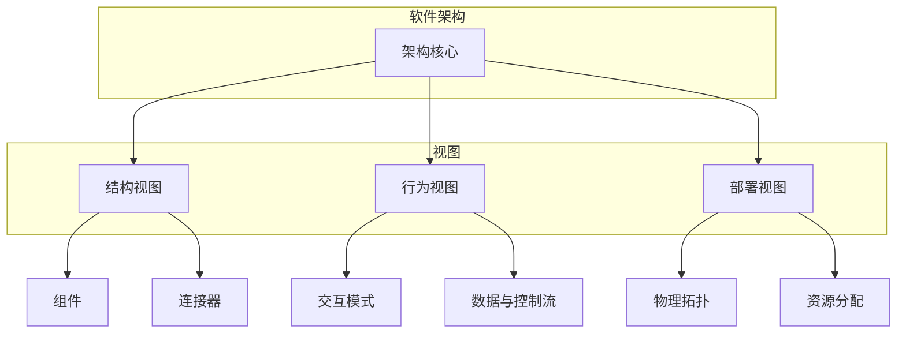

# 01-软件架构基础理论 (Software Architecture Foundation)

## 目录

- [01-软件架构基础理论 (Software Architecture Foundation)](#01-软件架构基础理论-software-architecture-foundation)
  - [目录](#目录)
  - [1. 概述](#1-概述)
    - [1.1 定义](#11-定义)
    - [1.2 核心概念](#12-核心概念)
    - [1.3 架构层次](#13-架构层次)
  - [2. 形式化定义](#2-形式化定义)
    - [2.1 基本定义](#21-基本定义)
    - [2.2 形式化规范](#22-形式化规范)
  - [3. 数学基础](#3-数学基础)
    - [3.1 图论基础](#31-图论基础)
    - [3.2 复杂度理论](#32-复杂度理论)
    - [3.3 信息论基础](#33-信息论基础)
  - [4. 架构原则](#4-架构原则)
    - [4.1 SOLID原则](#41-solid原则)
    - [4.2 架构质量属性](#42-架构质量属性)
  - [5. Go语言实现](#5-go语言实现)
    - [5.1 基础架构框架](#51-基础架构框架)
    - [5.2 接口与组件](#52-接口与组件)
  - [6. 架构模式](#6-架构模式)
    - [6.1 分层架构](#61-分层架构)
    - [6.2 微服务架构](#62-微服务架构)
    - [6.3 事件驱动架构](#63-事件驱动架构)
  - [7. 总结](#7-总结)

## 1. 概述

### 1.1 定义

软件架构是软件系统的高级结构，它定义了系统的组织方式、组件之间的关系以及指导其设计和演化的原则。软件架构为系统的开发、部署和维护提供了基础框架，并对系统的质量属性（如性能、可维护性、安全性）产生决定性影响。

### 1.2 核心概念

软件架构可以通过多个视图来描述，常见的包括：
- **结构视图 (Structural View)**: 关注系统的静态组织，如组件、连接器和它们的配置。
- **行为视图 (Behavioral View)**: 关注系统的动态行为，如交互模式、数据流和控制流。
- **部署视图 (Deployment View)**: 关注系统如何映射到物理或虚拟硬件资源。



### 1.3 架构层次

- **系统架构**: 整个系统的宏观结构，可能包含多个应用。
- **应用架构**: 单个应用程序的内部结构。
- **组件架构**: 可重用、可替换的软件单元的设计。
- **模块架构**: 代码模块（如包、命名空间）的组织方式。

## 2. 形式化定义

### 2.1 基本定义

设 $\mathcal{C}$ 为组件集合, $\mathcal{L}$ 为连接器集合, $\mathcal{I}$ 为接口集合。

**定义 2.1** (软件架构)
一个软件架构是一个五元组 $(\mathcal{C}, \mathcal{L}, \mathcal{I}, \mathcal{T}, \mathcal{P})$，其中：
- $\mathcal{C} = \{C_1, C_2, \ldots, C_n\}$ 是组件的有限集合。
- $\mathcal{L} = \{L_1, L_2, \ldots, L_m\}$ 是连接器的有限集合。
- $\mathcal{I} = \{I_1, I_2, \ldots, I_k\}$ 是接口的有限集合。
- $\mathcal{T}: \mathcal{C} \times \mathcal{C} \to \mathcal{P}(\mathcal{L})$ 是拓扑函数，将一对组件映射到连接它们的连接器集合（$\mathcal{P}$表示幂集）。
- $\mathcal{A}: (\mathcal{C} \cup \mathcal{L}) \to \mathcal{P}(\mathcal{I})$ 是附着函数，将组件或连接器映射到它们实现的接口集合。

### 2.2 形式化规范

**公理 2.1** (组件连接性)
对于任意组件 $C_i, C_j \in \mathcal{C}$，如果它们之间存在一个连接器 $L \in \mathcal{T}(C_i, C_j)$，那么它们必须有可连接的接口。
$$
\exists L \in \mathcal{T}(C_i, C_j) \implies \exists I_i \in \mathcal{A}(C_i), I_j \in \mathcal{A}(C_j) \text{ such that } \text{connectable}(I_i, I_j)
$$

**公理 2.2** (接口兼容性)
对于任意连接器 $L$ 所连接的两个接口 $I_i, I_j$，它们的规约必须是兼容的。
$$
\text{connected}(I_i, I_j, L) \implies \text{compatible}(\text{spec}(I_i), \text{spec}(I_j))
$$

## 3. 数学基础

### 3.1 图论基础

软件架构可以被建模为一个图 $G = (V, E)$，其中顶点 $V$ 代表组件，边 $E$ 代表连接器。

**定理 3.1** (架构耦合度)
架构的耦合度可以与图的**代数连通度 (Algebraic Connectivity)** $\lambda_2$ 相关联。$\lambda_2$ 是图的拉普拉斯矩阵的第二个最小特征值。$\lambda_2$ 越大，图的连通性越好，但也可能意味着更高的耦合度。

### 3.2 复杂度理论

**定理 3.2** (架构复杂度)
设 $A$ 为一个软件架构，$n$ 为组件数量，$m$ 为连接器数量。架构的结构复杂度 $C_s(A)$ 可以用与组件和连接器相关的度量来表示。一个简化的度量可以是：
$$
C_s(A) = w_c \sum_{i=1}^{n} C(c_i) + w_l \sum_{j=1}^{m} C(l_j)
$$
其中 $C(x)$ 是元素 $x$ 的内部复杂度，$w$是权重。

### 3.3 信息论基础

**定理 3.3** (架构信息熵)
设 $A$ 为一个软件架构，令 $d_i$ 为组件 $c_i$ 的度（连接数），$D = \sum d_i$。我们可以定义一个组件被"访问"的概率为 $p_i = d_i / D$。则架构的结构熵为：
$$
H(A) = -\sum_{i=1}^{n} p_i \log_2 p_i
$$
熵值可以用来衡量架构的均匀性和复杂性。低熵可能意味着架构更规整、更简单。

## 4. 架构原则

### 4.1 SOLID原则

- **S (Single Responsibility Principle)**: 一个组件或类应该只有一个引起它变化的原因。
- **O (Open/Closed Principle)**: 软件实体（类、模块、函数等）应该对扩展开放，对修改关闭。
- **L (Liskov Substitution Principle)**: 子类型必须能够替换它们的基类型。
- **I (Interface Segregation Principle)**: 客户端不应该被强迫依赖于它们不使用的方法。
- **D (Dependency Inversion Principle)**: 高层模块不应该依赖于低层模块。两者都应该依赖于抽象。抽象不应该依赖于细节，细节应该依赖于抽象。

### 4.2 架构质量属性

- **可用性 (Availability)**: 系统正常运行的时间比例。 $A = \frac{\text{MTTF}}{\text{MTTF} + \text{MTTR}}$
- **可维护性 (Maintainability)**: 修改和修复系统的难易程度。
- **性能 (Performance)**: 系统的响应能力和处理能力（延迟、吞吐量）。
- **可扩展性 (Scalability)**: 系统在负载增加时维持性能的能力。
- **安全性 (Security)**: 系统抵御威胁和攻击的能力。
- **可测试性 (Testability)**: 验证系统需求的难易程度。

## 5. Go语言实现

### 5.1 基础架构框架

在Go中，我们可以使用接口来定义架构的核心概念，并通过结构体来实现它们。

```go
package architecture

// Component 代表系统中的一个组件。
type Component interface {
    ID() string
    // Init 初始化组件并处理其依赖关系。
    Init(resolver DependencyResolver) error
    // Start 启动组件的后台进程。
    Start() error
    // Stop 优雅地停止组件。
    Stop() error
}

// DependencyResolver 用于解决组件之间的依赖关系。
type DependencyResolver interface {
    Resolve(componentID string, target interface{}) error
}

// Application 是组件的容器。
type Application struct {
    components map[string]Component
    resolver   DependencyResolver
}

func (a *Application) Register(c Component) {
    // ... 注册组件
}

func (a *Application) Run() {
    // ... 初始化、启动和管理所有组件的生命周期
}
```

### 5.2 接口与组件

```go
package main

import "fmt"

// UserService 是一个处理用户逻辑的组件。
type UserService struct {
    id string
    db Database
}

func (s *UserService) ID() string { return s.id }
func (s *UserService) Init(resolver DependencyResolver) error {
    // 依赖注入：向容器请求数据库组件
    return resolver.Resolve("database", &s.db)
}
// ... Start, Stop, and other methods

// Database 是数据存储接口。
type Database interface {
    GetUser(id string) (string, error)
}

// PostgresDB 是数据库组件的一个实现。
type PostgresDB struct {
    id string
}

func (db *PostgresDB) ID() string { return db.id }
func (db *PostgresDB) GetUser(id string) (string, error) {
    return fmt.Sprintf("user_%s", id), nil
}
// ... Init, Start, Stop
```

## 6. 架构模式

- **分层架构**: 将系统组织成层次结构，每一层为上一层提供特定的服务。
- **微服务架构**: 将应用构建成一组小型、独立、可独立部署的服务。
- **事件驱动架构**: 组件之间通过异步发送和接收事件进行通信。

## 7. 总结

软件架构基础理论为设计和分析复杂系统提供了坚实的理论基础。通过形式化定义、数学工具和设计原则，我们可以更系统地推理架构决策，并更好地预测其对系统质量属性的影响。 