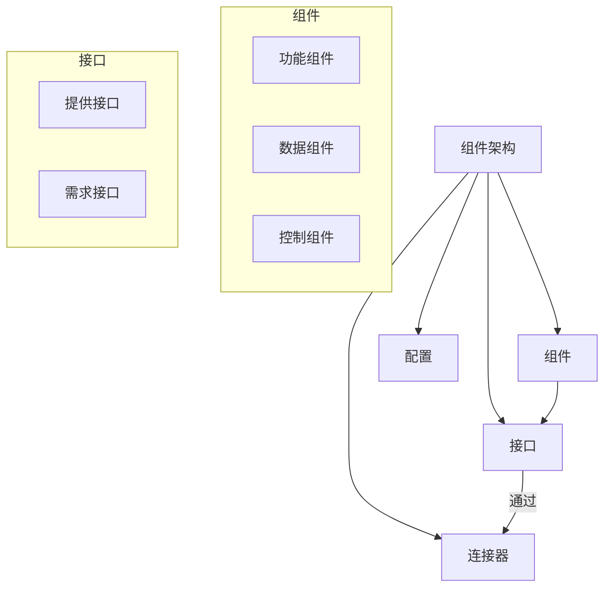

# 01-组件架构基础 (Component Architecture Foundation)

## 目录

- [01-组件架构基础 (Component Architecture Foundation)](#01-组件架构基础-component-architecture-foundation)
  - [目录](#目录)
  - [1. 概述](#1-概述)
    - [1.1 定义](#11-定义)
    - [1.2 核心概念](#12-核心概念)
    - [1.3 组件类型](#13-组件类型)
  - [2. 形式化定义](#2-形式化定义)
    - [2.1 基本定义](#21-基本定义)
    - [2.2 形式化规范](#22-形式化规范)
    - [2.3 组件生命周期](#23-组件生命周期)
  - [3. 数学基础](#3-数学基础)
    - [3.1 图论基础](#31-图论基础)
    - [3.2 组合理论](#32-组合理论)
    - [3.3 信息论基础](#33-信息论基础)
  - [4. 设计原则](#4-设计原则)
    - [4.1 组件设计原则](#41-组件设计原则)
    - [4.2 架构设计原则](#42-架构设计原则)
  - [5. Go语言实现](#5-go语言实现)
    - [5.1 基础组件框架](#51-基础组件框架)
  - [6. 组件模式](#6-组件模式)
    - [6.1 适配器模式](#61-适配器模式)
    - [6.2 装饰器模式](#62-装饰器模式)
    - [6.3 工厂模式](#63-工厂模式)
  - [7. 总结](#7-总结)

## 1. 概述

### 1.1 定义

**组件架构 (Component-Based Architecture)** 是一种软件架构模式，它将系统功能分解为一组独立的、可重用的、可替换的**组件 (Components)**。每个组件封装了特定的功能或数据，并通过定义良好的**接口 (Interfaces)** 与其他组件进行交互。

### 1.2 核心概念



- **组件 (Component)**: 系统的基本构造单元，是功能和/或数据的封装体。
- **接口 (Interface)**: 组件与外部世界通信的契约，定义了组件能做什么（提供接口）和需要什么（需求接口）。
- **连接器 (Connector)**: 组件之间交互的机制，如方法调用、消息队列、事件总线等。
- **配置 (Configuration)**: 描述系统中组件的布局以及它们如何通过连接器连接在一起。

### 1.3 组件类型

- **功能组件**: 提供特定的业务功能。
- **数据组件**: 管理数据存储和访问。
- **控制组件**: 协调其他组件的行为。
- **适配器组件**: 转换不兼容的接口。
- **装饰器组件**: 在不改变组件接口的情况下为其增加新功能。

## 2. 形式化定义

### 2.1 基本定义

设 $\mathcal{C}$ 为组件类型集合，$\mathcal{I}$ 为接口集合。

**定义 2.1 (组件)**
一个组件类型 $C \in \mathcal{C}$ 是一个三元组 $C = (I_p, I_r, B)$，其中：
- $I_p \subseteq \mathcal{I}$ 是组件提供的**接口集合 (Provided Interfaces)**。
- $I_r \subseteq \mathcal{I}$ 是组件需求的**接口集合 (Required Interfaces)**。
- $B$ 是描述组件行为的形式化规约。

**定义 2.2 (组件架构)**
一个组件架构是一个二元组 $CA = (\text{Inst}, \text{Conn})$，其中：
- $\text{Inst}$ 是一组组件实例，每个实例 $\text{inst}: C$ 都是某个组件类型 $C$ 的实例。
- $\text{Conn}$ 是一组连接关系，$\text{Conn} \subseteq \bigcup (\text{inst}_i.I_r \times \text{inst}_j.I_p)$，表示一个实例的需求接口连接到另一个实例的提供接口。

### 2.2 形式化规范

**公理 2.1 (接口兼容性)**
对于一个连接 $(r, p) \in \text{Conn}$，其中 $r$ 是需求接口，$p$ 是提供接口，它们的规约必须兼容。
$$
\text{compatible}(\text{spec}(r), \text{spec}(p))
$$

**公理 2.2 (组件封装性)**
组件的内部状态 $S$ 只能通过其提供的接口 $I_p$ 进行访问和修改。
$$
\forall s \in S, \text{access}(s) \implies \text{via}(I_p)
$$

### 2.3 组件生命周期

组件生命周期可以被建模为一个状态机 $M = (Q, \Sigma, \delta, q_0, F)$，其中：
- $Q = \{\text{Created}, \text{Initialized}, \text{Active}, \text{Inactive}, \text{Destroyed}\}$ 是状态集合。
- $\Sigma = \{\text{init}, \text{start}, \text{stop}, \text{destroy}\}$ 是事件集合。
- $\delta: Q \times \Sigma \to Q$ 是状态转换函数。
- $q_0 = \text{Created}$ 是初始状态。
- $F = \{\text{Destroyed}\}$ 是终止状态。

## 3. 数学基础

### 3.1 图论基础

**定理 3.1 (组件依赖图)**
设 $G = (V, E)$ 为组件依赖图，其中顶点 $V$ 是组件实例集合，有向边 $(u, v) \in E$ 表示组件 $u$ 依赖于组件 $v$。架构的有效性要求该图必须是**有向无环图 (DAG)**。
$$
\text{is_valid_architecture}(CA) \implies \text{is_acyclic}(G)
$$
**证明**:
如果图中存在循环依赖（环），例如 $A \to B \to A$，那么任何一个组件都无法在它的依赖项完全就绪之前完成初始化，导致系统无法启动。因此，无环是组件架构能够正确初始化的必要条件。

### 3.2 组合理论

**定理 3.2 (组件组合)**
设 $C_1 = (I_{p1}, I_{r1}, B_1)$ 和 $C_2 = (I_{p2}, I_{r2}, B_2)$ 为两个组件。它们的组合 $C = C_1 \oplus C_2$ 是一个新的复合组件，其接口为：
$$
I_p(C) = (I_{p1} \cup I_{p2}) \setminus \text{Bound}_p
$$
$$
I_r(C) = (I_{r1} \cup I_{r2}) \setminus \text{Bound}_r
$$
其中 $\text{Bound}_p$ 和 $\text{Bound}_r$ 是在组合内部被满足（绑定）的提供和需求接口。

### 3.3 信息论基础

**定理 3.3 (组件接口复杂度)**
设组件 $C$ 有 $n$ 个操作（方法）在其接口中，每个操作 $m_i$ 的使用概率为 $p_i$。该组件接口的**信息熵** $H(C)$ 为：
$$
H(C) = -\sum_{i=1}^{n} p_i \log_2 p_i
$$
**解释**:
$H(C)$ 衡量了预测下一个被调用的操作的不确定性。高熵可能意味着接口功能分散，违反了单一职责原则。低熵则可能表示接口功能高度集中。

## 4. 设计原则

### 4.1 组件设计原则

- **REP (Reuse/Release Equivalence Principle)**: 发布的单元就是重用的单元。
- **CCP (Common Closure Principle)**: 将那些会因为相同原因而改变的类放在同一个包中。
- **CRP (Common Reuse Principle)**: 不要强迫一个包的用户依赖他们不需要的东西。

### 4.2 架构设计原则

- **高内聚 (High Cohesion)**: 组件内部的元素应该紧密相关。
- **低耦合 (Low Coupling)**: 组件之间应该有最小的依赖。
- **依赖倒置 (Dependency Inversion)**: 组件应该依赖于抽象接口，而不是具体实现。

## 5. Go语言实现

### 5.1 基础组件框架

```go
package component

// Manager 定义了组件生命周期管理的核心接口。
type Manager interface {
    Register(c Component)
    InitAll() error
    StartAll() error
    StopAll() error
    Get(name string) (Component, bool)
}

// Component 是所有组件必须实现的接口。
type Component interface {
    Name() string
    Init(m Manager) error // 允许组件在初始化时解析依赖
    Start() error
    Stop() error
}

// NewManager 创建一个新的组件管理器。
func NewManager() Manager {
    // 返回管理器的实现
    return &managerImpl{
        components: make(map[string]Component),
    }
}

type managerImpl struct {
    components map[string]Component
    // ... 其他字段用于管理启动顺序等
}

// ... managerImpl 的方法实现 ...
```

## 6. 组件模式

- **适配器模式 (Adapter)**: 适配两个不兼容的接口。
- **装饰器模式 (Decorator)**: 动态地为一个组件添加额外的职责。
- **工厂模式 (Factory)**: 用于创建组件实例，将创建过程与使用过程分离。

## 7. 总结

组件架构通过模块化、封装和接口定义，极大地提高了软件系统的可维护性、可重用性和可扩展性。其背后的形式化定义和数学原理为构建健壮、可靠的系统提供了理论指导。 