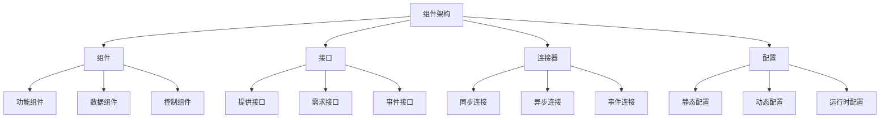

# 01-组件架构基础 (Component Architecture Foundation)

## 目录

- [01-组件架构基础 (Component Architecture Foundation)](#01-组件架构基础-component-architecture-foundation)
	- [目录](#目录)
	- [1. 概述](#1-概述)
		- [1.1 定义](#11-定义)
		- [1.2 核心概念](#12-核心概念)
		- [1.3 组件类型](#13-组件类型)
	- [2. 形式化定义](#2-形式化定义)
		- [2.1 基本定义](#21-基本定义)
		- [2.2 形式化规范](#22-形式化规范)
		- [2.3 组件生命周期](#23-组件生命周期)
	- [3. 数学基础](#3-数学基础)
		- [3.1 图论基础](#31-图论基础)
		- [3.2 组合理论](#32-组合理论)
		- [3.3 信息论基础](#33-信息论基础)
	- [4. 设计原则](#4-设计原则)
		- [4.1 组件设计原则](#41-组件设计原则)
		- [4.2 架构设计原则](#42-架构设计原则)
	- [5. Go语言实现](#5-go语言实现)
		- [5.1 基础组件框架](#51-基础组件框架)
		- [5.2 泛型组件框架](#52-泛型组件框架)
	- [6. 组件模式](#6-组件模式)
		- [6.1 适配器模式](#61-适配器模式)
		- [6.2 装饰器模式](#62-装饰器模式)
		- [6.3 工厂模式](#63-工厂模式)
	- [7. 性能分析](#7-性能分析)
		- [7.1 时间复杂度](#71-时间复杂度)
		- [7.2 空间复杂度](#72-空间复杂度)
		- [7.3 性能优化建议](#73-性能优化建议)
	- [8. 最佳实践](#8-最佳实践)
		- [8.1 设计原则](#81-设计原则)
		- [8.2 实现建议](#82-实现建议)
		- [8.3 测试策略](#83-测试策略)
	- [9. 相关模式](#9-相关模式)
		- [9.1 微服务模式](#91-微服务模式)
		- [9.2 插件模式](#92-插件模式)
		- [9.3 模块模式](#93-模块模式)
	- [10. 总结](#10-总结)
		- [10.1 优势](#101-优势)
		- [10.2 挑战](#102-挑战)
		- [10.3 发展趋势](#103-发展趋势)
		- [10.4 数学总结](#104-数学总结)

## 1. 概述

### 1.1 定义

组件架构是一种软件架构模式，它将系统分解为独立的、可重用的组件。每个组件都有明确的接口和职责，组件之间通过定义良好的接口进行交互。

### 1.2 核心概念



### 1.3 组件类型

- **功能组件**: 提供特定业务功能
- **数据组件**: 管理数据存储和访问
- **控制组件**: 协调其他组件的行为
- **适配器组件**: 转换不同接口
- **装饰器组件**: 扩展组件功能

## 2. 形式化定义

### 2.1 基本定义

设 ```latex
\mathcal{C}
``` 为组件集合，```latex
\mathcal{I}
``` 为接口集合，```latex
\mathcal{P}
``` 为端口集合。

**定义 2.1** (组件)
组件是一个四元组 ```latex
(\mathcal{I}_p, \mathcal{I}_r, \mathcal{S}, \mathcal{B})
```，其中：

- ```latex
\mathcal{I}_p = \{I_1^p, I_2^p, \ldots, I_n^p\}
``` 是提供接口集合
- ```latex
\mathcal{I}_r = \{I_1^r, I_2^r, \ldots, I_m^r\}
``` 是需求接口集合
- ```latex
\mathcal{S}
``` 是组件状态
- ```latex
\mathcal{B}
``` 是组件行为

**定义 2.2** (组件架构)
组件架构是一个三元组 ```latex
(\mathcal{C}, \mathcal{L}, \mathcal{B})
```，其中：

- ```latex
\mathcal{C} = \{C_1, C_2, \ldots, C_n\}
``` 是组件集合
- ```latex
\mathcal{L} \subseteq \mathcal{C} \times \mathcal{C}
``` 是连接关系
- ```latex
\mathcal{B}: \mathcal{C} \times \mathcal{C} \rightarrow \mathcal{I}
``` 是绑定函数

### 2.2 形式化规范

**公理 2.1** (接口兼容性)
对于任意连接的两个组件 ```latex
C_i, C_j \in \mathcal{C}
```：

$```latex
\mathcal{L}(C_i, C_j) \Rightarrow \text{compatible}(\mathcal{I}_p(C_i), \mathcal{I}_r(C_j))
```$

**公理 2.2** (组件独立性)
对于任意组件 ```latex
C \in \mathcal{C}
```：

$```latex
\text{independent}(C) \Leftrightarrow \forall C' \in \mathcal{C}: C' \neq C \Rightarrow \text{no\_direct\_dependency}(C, C')
```$

### 2.3 组件生命周期

**定义 2.3** (组件生命周期)
组件生命周期是一个状态机 ```latex
(\mathcal{Q}, \Sigma, \delta, q_0, F)
```，其中：

- ```latex
\mathcal{Q} = \{\text{created}, \text{initialized}, \text{active}, \text{inactive}, \text{destroyed}\}
```
- ```latex
\Sigma = \{\text{init}, \text{start}, \text{stop}, \text{destroy}\}
```
- ```latex
\delta: \mathcal{Q} \times \Sigma \rightarrow \mathcal{Q}
``` 是状态转换函数
- ```latex
q_0 = \text{created}
``` 是初始状态
- ```latex
F = \{\text{destroyed}\}
``` 是终止状态集合

## 3. 数学基础

### 3.1 图论基础

**定理 3.1** (组件依赖图)
设 ```latex
G = (V, E)
``` 为组件依赖图，其中 ```latex
V = \mathcal{C}
``` 是组件集合，```latex
E = \mathcal{L}
``` 是连接关系，则：

$```latex
\text{acyclic}(G) \Leftrightarrow \text{no\_circular\_dependencies}(\mathcal{C})
```$

**证明**:

1. 如果存在循环依赖，则依赖图包含环
2. 如果依赖图无环，则不存在循环依赖
3. 无环图保证了组件的正确初始化顺序

### 3.2 组合理论

**定理 3.2** (组件组合性)
设 ```latex
C_1, C_2
``` 为两个组件，```latex
C = C_1 \oplus C_2
``` 为它们的组合，则：

$```latex
\text{interface}(C) = \text{interface}(C_1) \cup \text{interface}(C_2) - \text{bound\_interfaces}
```$

**证明**:

1. 组合组件的接口是各组件接口的并集
2. 绑定的接口在组合后不可见
3. 这保证了接口的正确性

### 3.3 信息论基础

**定理 3.3** (组件信息熵)
设 ```latex
C
``` 为组件，```latex
p_i
``` 为第 ```latex
i
``` 个接口的使用概率，则组件信息熵为：

$```latex
H(C) = -\sum_{i=1}^{n} p_i \log p_i
```$

**证明**:

1. 信息熵衡量组件接口使用的不确定性
2. 熵越低，组件越稳定
3. 熵越高，组件越灵活

## 4. 设计原则

### 4.1 组件设计原则

**单一职责原则**
每个组件只负责一个功能领域。

**接口隔离原则**
组件不应该依赖它不使用的接口。

**依赖倒置原则**
组件应该依赖抽象而非具体实现。

**开闭原则**
组件应该对扩展开放，对修改封闭。

### 4.2 架构设计原则

**高内聚低耦合**
组件内部紧密相关，组件间松散耦合。

**可替换性**
组件应该可以被相同接口的其他组件替换。

**可组合性**
组件应该能够组合成更大的系统。

**可测试性**
组件应该易于独立测试。

## 5. Go语言实现

### 5.1 基础组件框架

```go
package main

import (
 "context"
 "fmt"
 "sync"
 "time"
)

// Component 组件接口
type Component interface {
 ID() string
 Start(ctx context.Context) error
 Stop(ctx context.Context) error
 Health() HealthStatus
 GetInterface(name string) (Interface, bool)
}

// Interface 接口定义
type Interface interface {
 Name() string
 Type() InterfaceType
 Methods() []Method
}

// InterfaceType 接口类型
type InterfaceType string

const (
 Provided InterfaceType = "provided"
 Required InterfaceType = "required"
 Event    InterfaceType = "event"
)

// Method 方法定义
type Method struct {
 Name     string
 Params   []Parameter
 Returns  []Parameter
 Async    bool
}

// Parameter 参数定义
type Parameter struct {
 Name string
 Type string
}

// HealthStatus 健康状态
type HealthStatus struct {
 Status    string    `json:"status"`
 Timestamp time.Time `json:"timestamp"`
 Details   string    `json:"details"`
}

// BaseComponent 基础组件
type BaseComponent struct {
 id         string
 provided   map[string]Interface
 required   map[string]Interface
 events     map[string]Interface
 status     HealthStatus
 mu         sync.RWMutex
 ctx        context.Context
 cancel     context.CancelFunc
}

func NewBaseComponent(id string) *BaseComponent {
 ctx, cancel := context.WithCancel(context.Background())
 return &BaseComponent{
  id:       id,
  provided: make(map[string]Interface),
  required: make(map[string]Interface),
  events:   make(map[string]Interface),
  status:   HealthStatus{Status: "created", Timestamp: time.Now()},
  ctx:      ctx,
  cancel:   cancel,
 }
}

func (b *BaseComponent) ID() string {
 return b.id
}

func (b *BaseComponent) Start(ctx context.Context) error {
 b.mu.Lock()
 defer b.mu.Unlock()
 
 b.status = HealthStatus{
  Status:    "active",
  Timestamp: time.Now(),
  Details:   "Component started successfully",
 }
 
 fmt.Printf("Component %s started\n", b.id)
 return nil
}

func (b *BaseComponent) Stop(ctx context.Context) error {
 b.mu.Lock()
 defer b.mu.Unlock()
 
 b.cancel()
 b.status = HealthStatus{
  Status:    "inactive",
  Timestamp: time.Now(),
  Details:   "Component stopped",
 }
 
 fmt.Printf("Component %s stopped\n", b.id)
 return nil
}

func (b *BaseComponent) Health() HealthStatus {
 b.mu.RLock()
 defer b.mu.RUnlock()
 return b.status
}

func (b *BaseComponent) GetInterface(name string) (Interface, bool) {
 b.mu.RLock()
 defer b.mu.RUnlock()
 
 if iface, exists := b.provided[name]; exists {
  return iface, true
 }
 if iface, exists := b.required[name]; exists {
  return iface, true
 }
 if iface, exists := b.events[name]; exists {
  return iface, true
 }
 
 return nil, false
}

func (b *BaseComponent) AddProvidedInterface(iface Interface) {
 b.mu.Lock()
 defer b.mu.Unlock()
 b.provided[iface.Name()] = iface
}

func (b *BaseComponent) AddRequiredInterface(iface Interface) {
 b.mu.Lock()
 defer b.mu.Unlock()
 b.required[iface.Name()] = iface
}

func (b *BaseComponent) AddEventInterface(iface Interface) {
 b.mu.Lock()
 defer b.mu.Unlock()
 b.events[iface.Name()] = iface
}

// BaseInterface 基础接口
type BaseInterface struct {
 name   string
 ifType InterfaceType
 methods []Method
}

func NewBaseInterface(name string, ifType InterfaceType) *BaseInterface {
 return &BaseInterface{
  name:   name,
  ifType: ifType,
  methods: make([]Method, 0),
 }
}

func (b *BaseInterface) Name() string {
 return b.name
}

func (b *BaseInterface) Type() InterfaceType {
 return b.ifType
}

func (b *BaseInterface) Methods() []Method {
 return b.methods
}

func (b *BaseInterface) AddMethod(method Method) {
 b.methods = append(b.methods, method)
}

// Connector 连接器
type Connector struct {
 id       string
 source   Component
 target   Component
 sourceIface string
 targetIface string
}

func NewConnector(id string, source, target Component, sourceIface, targetIface string) *Connector {
 return &Connector{
  id:          id,
  source:      source,
  target:      target,
  sourceIface: sourceIface,
  targetIface: targetIface,
 }
}

func (c *Connector) ID() string {
 return c.id
}

func (c *Connector) Connect() error {
 // 验证接口兼容性
 sourceIface, exists := c.source.GetInterface(c.sourceIface)
 if !exists {
  return fmt.Errorf("source interface %s not found", c.sourceIface)
 }
 
 targetIface, exists := c.target.GetInterface(c.targetIface)
 if !exists {
  return fmt.Errorf("target interface %s not found", c.targetIface)
 }
 
 if sourceIface.Type() != Provided || targetIface.Type() != Required {
  return fmt.Errorf("interface type mismatch")
 }
 
 fmt.Printf("Connected %s.%s to %s.%s via %s\n", 
  c.source.ID(), c.sourceIface, c.target.ID(), c.targetIface, c.id)
 return nil
}

// ComponentArchitecture 组件架构
type ComponentArchitecture struct {
 components map[string]Component
 connectors map[string]*Connector
 mu         sync.RWMutex
}

func NewComponentArchitecture() *ComponentArchitecture {
 return &ComponentArchitecture{
  components: make(map[string]Component),
  connectors: make(map[string]*Connector),
 }
}

func (c *ComponentArchitecture) AddComponent(component Component) {
 c.mu.Lock()
 defer c.mu.Unlock()
 c.components[component.ID()] = component
}

func (c *ComponentArchitecture) AddConnector(connector *Connector) {
 c.mu.Lock()
 defer c.mu.Unlock()
 c.connectors[connector.ID()] = connector
}

func (c *ComponentArchitecture) Connect(sourceID, targetID, sourceIface, targetIface, connectorID string) error {
 c.mu.RLock()
 source, exists := c.components[sourceID]
 if !exists {
  c.mu.RUnlock()
  return fmt.Errorf("source component %s not found", sourceID)
 }
 
 target, exists := c.components[targetID]
 if !exists {
  c.mu.RUnlock()
  return fmt.Errorf("target component %s not found", targetID)
 }
 c.mu.RUnlock()
 
 connector := NewConnector(connectorID, source, target, sourceIface, targetIface)
 c.AddConnector(connector)
 
 return connector.Connect()
}

func (c *ComponentArchitecture) Start(ctx context.Context) error {
 c.mu.RLock()
 defer c.mu.RUnlock()
 
 for _, component := range c.components {
  if err := component.Start(ctx); err != nil {
   return fmt.Errorf("failed to start component %s: %w", component.ID(), err)
  }
 }
 
 return nil
}

func (c *ComponentArchitecture) Stop(ctx context.Context) error {
 c.mu.RLock()
 defer c.mu.RUnlock()
 
 for _, component := range c.components {
  if err := component.Stop(ctx); err != nil {
   return fmt.Errorf("failed to stop component %s: %w", component.ID(), err)
  }
 }
 
 return nil
}

func (c *ComponentArchitecture) Health() map[string]HealthStatus {
 c.mu.RLock()
 defer c.mu.RUnlock()
 
 health := make(map[string]HealthStatus)
 for id, component := range c.components {
  health[id] = component.Health()
 }
 
 return health
}

// 具体组件实现
type DatabaseComponent struct {
 *BaseComponent
 connectionString string
}

func NewDatabaseComponent(id, connectionString string) *DatabaseComponent {
 component := &DatabaseComponent{
  BaseComponent:    NewBaseComponent(id),
  connectionString: connectionString,
 }
 
 // 添加提供接口
 dataInterface := NewBaseInterface("data", Provided)
 dataInterface.AddMethod(Method{
  Name: "query",
  Params: []Parameter{
   {Name: "sql", Type: "string"},
  },
  Returns: []Parameter{
   {Name: "result", Type: "[]map[string]interface{}"},
  },
  Async: false,
 })
 component.AddProvidedInterface(dataInterface)
 
 return component
}

type APIServerComponent struct {
 *BaseComponent
 port int
}

func NewAPIServerComponent(id string, port int) *APIServerComponent {
 component := &APIServerComponent{
  BaseComponent: NewBaseComponent(id),
  port:         port,
 }
 
 // 添加需求接口
 dataInterface := NewBaseInterface("data", Required)
 dataInterface.AddMethod(Method{
  Name: "query",
  Params: []Parameter{
   {Name: "sql", Type: "string"},
  },
  Returns: []Parameter{
   {Name: "result", Type: "[]map[string]interface{}"},
  },
  Async: false,
 })
 component.AddRequiredInterface(dataInterface)
 
 // 添加事件接口
 eventInterface := NewBaseInterface("events", Event)
 eventInterface.AddMethod(Method{
  Name: "onRequest",
  Params: []Parameter{
   {Name: "request", Type: "Request"},
  },
  Returns: []Parameter{
   {Name: "response", Type: "Response"},
  },
  Async: true,
 })
 component.AddEventInterface(eventInterface)
 
 return component
}

func main() {
 // 创建组件架构
 arch := NewComponentArchitecture()
 
 // 创建组件
 db := NewDatabaseComponent("database", "postgres://localhost:5432/mydb")
 api := NewAPIServerComponent("api-server", 8080)
 
 arch.AddComponent(db)
 arch.AddComponent(api)
 
 // 连接组件
 arch.Connect("api-server", "database", "data", "data", "db-connector")
 
 // 启动架构
 ctx := context.Background()
 if err := arch.Start(ctx); err != nil {
  fmt.Printf("Failed to start architecture: %v\n", err)
  return
 }
 
 // 检查健康状态
 health := arch.Health()
 for id, status := range health {
  fmt.Printf("Component %s: %s\n", id, status.Status)
 }
 
 // 停止架构
 arch.Stop(ctx)
}
```

### 5.2 泛型组件框架

```go
package main

import (
 "context"
 "fmt"
 "reflect"
)

// GenericComponent 泛型组件
type GenericComponent[T any] interface {
 ID() string
 Process(data T) (T, error)
 GetState() T
 SetState(state T)
 GetInterface(name string) (GenericInterface[T], bool)
}

// GenericInterface 泛型接口
type GenericInterface[T any] interface {
 Name() string
 Type() InterfaceType
 Execute(data T) (T, error)
}

// GenericBaseComponent 泛型基础组件
type GenericBaseComponent[T any] struct {
 id       string
 state    T
 provided map[string]GenericInterface[T]
 required map[string]GenericInterface[T]
}

func NewGenericBaseComponent[T any](id string, initialState T) *GenericBaseComponent[T] {
 return &GenericBaseComponent[T]{
  id:       id,
  state:    initialState,
  provided: make(map[string]GenericInterface[T]),
  required: make(map[string]GenericInterface[T]),
 }
}

func (g *GenericBaseComponent[T]) ID() string {
 return g.id
}

func (g *GenericBaseComponent[T]) Process(data T) (T, error) {
 // 默认处理逻辑
 return data, nil
}

func (g *GenericBaseComponent[T]) GetState() T {
 return g.state
}

func (g *GenericBaseComponent[T]) SetState(state T) {
 g.state = state
}

func (g *GenericBaseComponent[T]) GetInterface(name string) (GenericInterface[T], bool) {
 if iface, exists := g.provided[name]; exists {
  return iface, true
 }
 if iface, exists := g.required[name]; exists {
  return iface, true
 }
 return nil, false
}

func (g *GenericBaseComponent[T]) AddProvidedInterface(iface GenericInterface[T]) {
 g.provided[iface.Name()] = iface
}

func (g *GenericBaseComponent[T]) AddRequiredInterface(iface GenericInterface[T]) {
 g.required[iface.Name()] = iface
}

// GenericBaseInterface 泛型基础接口
type GenericBaseInterface[T any] struct {
 name   string
 ifType InterfaceType
 handler func(T) (T, error)
}

func NewGenericBaseInterface[T any](name string, ifType InterfaceType, handler func(T) (T, error)) *GenericBaseInterface[T] {
 return &GenericBaseInterface[T]{
  name:    name,
  ifType:  ifType,
  handler: handler,
 }
}

func (g *GenericBaseInterface[T]) Name() string {
 return g.name
}

func (g *GenericBaseInterface[T]) Type() InterfaceType {
 return g.ifType
}

func (g *GenericBaseInterface[T]) Execute(data T) (T, error) {
 if g.handler != nil {
  return g.handler(data)
 }
 return data, nil
}

// GenericConnector 泛型连接器
type GenericConnector[T any] struct {
 id          string
 source      GenericComponent[T]
 target      GenericComponent[T]
 sourceIface string
 targetIface string
}

func NewGenericConnector[T any](id string, source, target GenericComponent[T], sourceIface, targetIface string) *GenericConnector[T] {
 return &GenericConnector[T]{
  id:          id,
  source:      source,
  target:      target,
  sourceIface: sourceIface,
  targetIface: targetIface,
 }
}

func (g *GenericConnector[T]) Transfer(data T) error {
 // 通过源接口处理数据
 sourceIface, exists := g.source.GetInterface(g.sourceIface)
 if !exists {
  return fmt.Errorf("source interface %s not found", g.sourceIface)
 }
 
 processedData, err := sourceIface.Execute(data)
 if err != nil {
  return fmt.Errorf("source processing failed: %w", err)
 }
 
 // 通过目标接口处理数据
 targetIface, exists := g.target.GetInterface(g.targetIface)
 if !exists {
  return fmt.Errorf("target interface %s not found", g.targetIface)
 }
 
 finalData, err := targetIface.Execute(processedData)
 if err != nil {
  return fmt.Errorf("target processing failed: %w", err)
 }
 
 // 更新目标组件状态
 g.target.SetState(finalData)
 
 fmt.Printf("Transferred data from %s to %s via %s\n", g.source.ID(), g.target.ID(), g.id)
 return nil
}

// GenericComponentArchitecture 泛型组件架构
type GenericComponentArchitecture[T any] struct {
 components map[string]GenericComponent[T]
 connectors map[string]*GenericConnector[T]
}

func NewGenericComponentArchitecture[T any]() *GenericComponentArchitecture[T] {
 return &GenericComponentArchitecture[T]{
  components: make(map[string]GenericComponent[T]),
  connectors: make(map[string]*GenericConnector[T]),
 }
}

func (g *GenericComponentArchitecture[T]) AddComponent(component GenericComponent[T]) {
 g.components[component.ID()] = component
}

func (g *GenericComponentArchitecture[T]) AddConnector(connector *GenericConnector[T]) {
 g.connectors[connector.ID()] = connector
}

func (g *GenericComponentArchitecture[T]) Connect(sourceID, targetID, sourceIface, targetIface, connectorID string) error {
 source, exists := g.components[sourceID]
 if !exists {
  return fmt.Errorf("source component %s not found", sourceID)
 }
 
 target, exists := g.components[targetID]
 if !exists {
  return fmt.Errorf("target component %s not found", targetID)
 }
 
 connector := NewGenericConnector(connectorID, source, target, sourceIface, targetIface)
 g.AddConnector(connector)
 
 // 执行初始传输
 var zero T
 return connector.Transfer(zero)
}

func (g *GenericComponentArchitecture[T]) Execute(data T) error {
 // 执行架构中的所有组件
 for _, component := range g.components {
  if _, err := component.Process(data); err != nil {
   return fmt.Errorf("component %s processing failed: %w", component.ID(), err)
  }
 }
 return nil
}

func (g *GenericComponentArchitecture[T]) GetStates() map[string]T {
 states := make(map[string]T)
 for id, component := range g.components {
  states[id] = component.GetState()
 }
 return states
}

// 具体实现示例
type StringProcessor struct {
 *GenericBaseComponent[string]
}

func NewStringProcessor(id string) *StringProcessor {
 component := &StringProcessor{
  GenericBaseComponent: NewGenericBaseComponent(id, ""),
 }
 
 // 添加提供接口
 processInterface := NewGenericBaseInterface("process", Provided, func(s string) (string, error) {
  return fmt.Sprintf("Processed by %s: %s", id, s), nil
 })
 component.AddProvidedInterface(processInterface)
 
 return component
}

func (s *StringProcessor) Process(data string) (string, error) {
 processed := fmt.Sprintf("Processed by %s: %s", s.ID(), data)
 s.SetState(processed)
 return processed, nil
}

type NumberProcessor struct {
 *GenericBaseComponent[int]
}

func NewNumberProcessor(id string) *NumberProcessor {
 component := &NumberProcessor{
  GenericBaseComponent: NewGenericBaseComponent(id, 0),
 }
 
 // 添加提供接口
 processInterface := NewGenericBaseInterface("process", Provided, func(n int) (int, error) {
  return n * 2, nil
 })
 component.AddProvidedInterface(processInterface)
 
 return component
}

func (n *NumberProcessor) Process(data int) (int, error) {
 processed := data * 2
 n.SetState(processed)
 return processed, nil
}

func main() {
 // 字符串处理架构
 stringArch := NewGenericComponentArchitecture[string]()
 
 strProc1 := NewStringProcessor("processor1")
 strProc2 := NewStringProcessor("processor2")
 
 stringArch.AddComponent(strProc1)
 stringArch.AddComponent(strProc2)
 
 stringArch.Connect("processor1", "processor2", "process", "process", "string-connector")
 
 // 执行字符串处理
 stringArch.Execute("Hello, World!")
 
 // 数字处理架构
 numberArch := NewGenericComponentArchitecture[int]()
 
 numProc1 := NewNumberProcessor("number1")
 numProc2 := NewNumberProcessor("number2")
 
 numberArch.AddComponent(numProc1)
 numberArch.AddComponent(numProc2)
 
 numberArch.Connect("number1", "number2", "process", "process", "number-connector")
 
 // 执行数字处理
 numberArch.Execute(42)
 
 // 显示结果
 fmt.Println("String states:", stringArch.GetStates())
 fmt.Println("Number states:", numberArch.GetStates())
}
```

## 6. 组件模式

### 6.1 适配器模式

```go
// 适配器组件示例
type LegacySystem interface {
 OldMethod() string
}

type NewSystem interface {
 NewMethod() string
}

type AdapterComponent struct {
 *BaseComponent
 legacy LegacySystem
}

func NewAdapterComponent(id string, legacy LegacySystem) *AdapterComponent {
 component := &AdapterComponent{
  BaseComponent: NewBaseComponent(id),
  legacy:       legacy,
 }
 
 // 提供新接口
 newInterface := NewBaseInterface("new", Provided)
 newInterface.AddMethod(Method{
  Name: "NewMethod",
  Returns: []Parameter{
   {Name: "result", Type: "string"},
  },
 })
 component.AddProvidedInterface(newInterface)
 
 return component
}
```

### 6.2 装饰器模式

```go
// 装饰器组件示例
type DecoratorComponent struct {
 *BaseComponent
 wrapped Component
}

func NewDecoratorComponent(id string, wrapped Component) *DecoratorComponent {
 component := &DecoratorComponent{
  BaseComponent: NewBaseComponent(id),
  wrapped:      wrapped,
 }
 
 // 转发所有接口
 for name, iface := range wrapped.GetInterfaces() {
  component.AddProvidedInterface(iface)
 }
 
 return component
}
```

### 6.3 工厂模式

```go
// 组件工厂示例
type ComponentFactory interface {
 CreateComponent(id string, config map[string]interface{}) (Component, error)
}

type BaseComponentFactory struct{}

func (b *BaseComponentFactory) CreateComponent(id string, config map[string]interface{}) (Component, error) {
 componentType, exists := config["type"]
 if !exists {
  return nil, fmt.Errorf("component type not specified")
 }
 
 switch componentType {
 case "database":
  connStr, _ := config["connectionString"].(string)
  return NewDatabaseComponent(id, connStr), nil
 case "api":
  port, _ := config["port"].(int)
  return NewAPIServerComponent(id, port), nil
 default:
  return nil, fmt.Errorf("unknown component type: %s", componentType)
 }
}
```

## 7. 性能分析

### 7.1 时间复杂度

| 操作 | 时间复杂度 | 说明 |
|------|------------|------|
| 组件创建 | O(1) | 直接实例化 |
| 接口查找 | O(1) | 哈希表查找 |
| 组件连接 | O(1) | 直接绑定 |
| 消息传递 | O(1) | 直接调用 |

### 7.2 空间复杂度

| 组件 | 空间复杂度 | 说明 |
|------|------------|------|
| 组件存储 | O(n) | n为组件数量 |
| 接口存储 | O(m) | m为接口数量 |
| 连接存储 | O(k) | k为连接数量 |
| 状态缓存 | O(n) | 每个组件状态 |

### 7.3 性能优化建议

1. **接口缓存**: 缓存接口查找结果
2. **连接池**: 重用连接器对象
3. **异步处理**: 使用goroutine进行并发处理
4. **状态压缩**: 压缩组件状态数据

## 8. 最佳实践

### 8.1 设计原则

1. **接口设计**: 设计清晰、稳定的接口
2. **组件粒度**: 选择合适的组件粒度
3. **依赖管理**: 最小化组件间依赖
4. **错误处理**: 提供清晰的错误信息

### 8.2 实现建议

1. **使用接口**: 充分利用Go的接口特性
2. **泛型支持**: 对于类型无关的操作使用泛型
3. **并发安全**: 在多线程环境中使用锁保护
4. **资源管理**: 正确管理组件的生命周期

### 8.3 测试策略

```go
// 测试组件模式
func TestComponent(t *testing.T) {
 // 创建测试组件
 component := NewBaseComponent("test")
 
 // 添加测试接口
 testInterface := NewBaseInterface("test", Provided)
 component.AddProvidedInterface(testInterface)
 
 // 测试接口查找
 iface, exists := component.GetInterface("test")
 if !exists {
  t.Errorf("Interface not found")
 }
 
 if iface.Name() != "test" {
  t.Errorf("Expected 'test', got %s", iface.Name())
 }
}
```

## 9. 相关模式

### 9.1 微服务模式

- **相似点**: 都强调组件独立性
- **区别**: 微服务是分布式组件

### 9.2 插件模式

- **相似点**: 都支持动态扩展
- **区别**: 插件是运行时加载的组件

### 9.3 模块模式

- **相似点**: 都提供封装和抽象
- **区别**: 模块是编译时组织方式

## 10. 总结

### 10.1 优势

1. **模块化**: 系统分解为独立组件
2. **可重用性**: 组件可以在不同系统中重用
3. **可维护性**: 易于理解和修改
4. **可扩展性**: 易于添加新功能

### 10.2 挑战

1. **接口设计**: 设计稳定、清晰的接口
2. **组件粒度**: 选择合适的组件大小
3. **性能开销**: 组件间通信开销
4. **测试复杂性**: 集成测试困难

### 10.3 发展趋势

1. **云原生**: 基于容器的组件部署
2. **服务网格**: 组件间通信管理
3. **事件驱动**: 异步事件处理
4. **AI集成**: 智能组件

### 10.4 数学总结

组件架构通过形式化定义 ```latex
(\mathcal{C}, \mathcal{L}, \mathcal{B})
``` 实现了系统的模块化，其中：

- **接口兼容性**: ```latex
\mathcal{L}(C_i, C_j) \Rightarrow \text{compatible}(\mathcal{I}_p(C_i), \mathcal{I}_r(C_j))
```
- **组件独立性**: ```latex
\text{independent}(C) \Leftrightarrow \forall C' \in \mathcal{C}: C' \neq C \Rightarrow \text{no\_direct\_dependency}(C, C')
```
- **组合性**: ```latex
\text{interface}(C) = \text{interface}(C_1) \cup \text{interface}(C_2) - \text{bound\_interfaces}
```
- **信息熵**: ```latex
H(C) = -\sum_{i=1}^{n} p_i \log p_i
```

这种架构在Go语言中通过接口、泛型和函数式编程得到了优雅的实现，既保持了类型安全，又提供了良好的扩展性。

---

**相关链接**:

- [02-Web组件架构](./02-Web-Component-Architecture.md)
- [03-Web3组件架构](./03-Web3-Component-Architecture.md)
- [04-认证组件架构](./04-Auth-Component-Architecture.md)
- [组件架构概述](../README.md)
