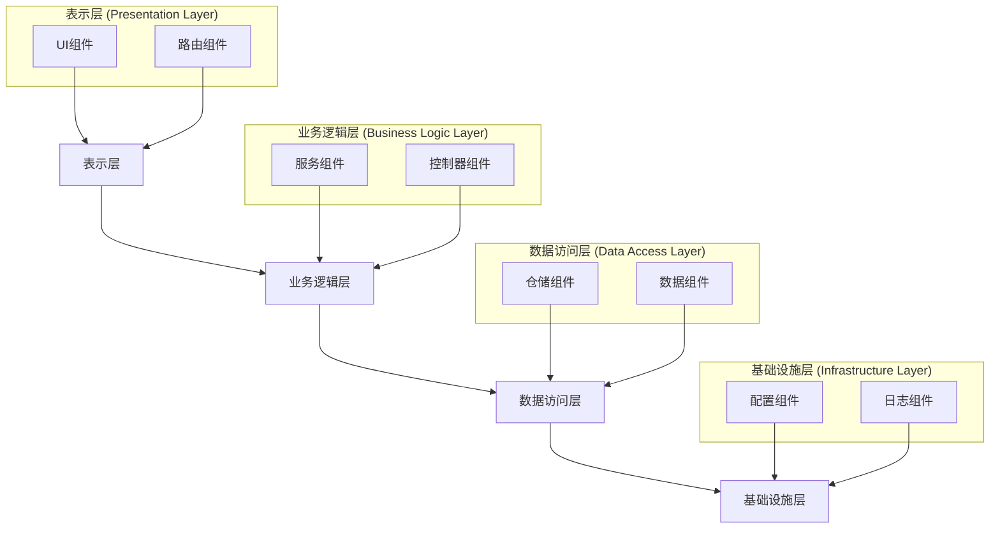
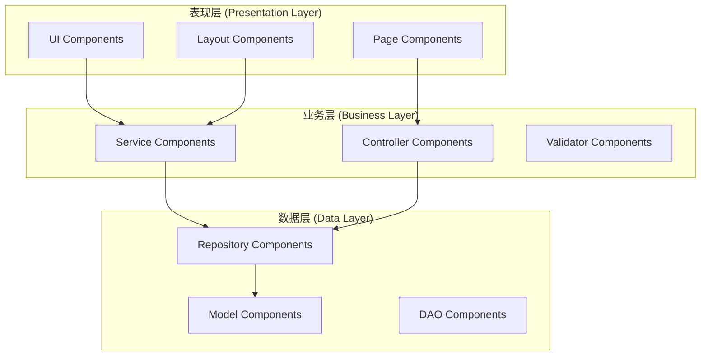

# Web组件架构 (Web Component Architecture)

## 目录

- [Web组件架构 (Web Component Architecture)](#web组件架构-web-component-architecture)
  - [目录](#目录)
  - [1. 概述](#1-概述)
    - [1.1 核心概念](#11-核心概念)
    - [1.2 架构层次](#12-架构层次)
  - [2. 形式化定义](#2-形式化定义)
    - [2.1 组件定义](#21-组件定义)
    - [2.2 组件组合](#22-组件组合)
    - [2.3 组件生命周期](#23-组件生命周期)
  - [3. 架构模式](#3-架构模式)
    - [3.1 分层组件架构](#31-分层组件架构)
    - [3.2 组件通信模式](#32-组件通信模式)
      - [3.2.1 事件驱动模式](#321-事件驱动模式)
      - [3.2.2 状态管理模式](#322-状态管理模式)
  - [4. Go语言实现](#4-go语言实现)
    - [4.1 基础组件接口](#41-基础组件接口)
    - [4.2 具体组件实现](#42-具体组件实现)
      - [4.2.1 UI组件](#421-ui组件)
      - [4.2.2 容器组件](#422-容器组件)
    - [4.3 组件管理器](#43-组件管理器)
  - [5. 性能优化](#5-性能优化)
    - [5.1 虚拟DOM](#51-虚拟dom)
    - [5.2 组件缓存](#52-组件缓存)
  - [6. 测试策略](#6-测试策略)
    - [6.1 单元测试](#61-单元测试)
    - [6.2 集成测试](#62-集成测试)
  - [7. 最佳实践](#7-最佳实践)
    - [7.1 组件设计原则](#71-组件设计原则)
    - [7.2 性能优化建议](#72-性能优化建议)
    - [7.3 安全考虑](#73-安全考虑)
  - [8. 总结](#8-总结)
  - [相关链接](#相关链接)

---

## 1. 概述

Web组件架构是现代Web应用开发的核心架构模式，它通过组件化的方式构建可复用、可维护的Web应用。本文档从形式化定义、架构模式、Go语言实现等多个维度深入分析Web组件架构。

### 1.1 核心概念

**定义 1.1.1 (Web组件)**
Web组件是一个自包含的、可重用的软件单元，具有以下特性：

- **封装性**：内部实现对外部隐藏
- **可重用性**：可在不同上下文中使用
- **可组合性**：可与其他组件组合
- **独立性**：具有明确的接口和职责

**定义 1.1.2 (组件接口)**
组件接口定义了组件与外部系统的交互契约：
$$
I = (M, E, S)
$$
其中：

- $M$ 是方法集合
- $E$ 是事件集合
- $S$ 是状态集合

### 1.2 架构层次



---

## 2. 形式化定义

### 2.1 组件定义

**定义 2.1 (Web组件)**
Web组件是一个三元组 $C = (S, I, B)$，其中：

- $S$ 是组件的状态集合 (State Set)
- $I$ 是组件的接口集合 (Interface Set)
- $B$ 是组件的行为集合 (Behavior Set)

**定义 2.2 (组件状态)**
组件状态是一个映射 $s: V \rightarrow D$，其中：

- $V$ 是状态变量集合
- $D$ 是数据域集合

**定义 2.3 (组件接口)**
组件接口是一个四元组 $i = (\text{name}, \text{type}, \text{direction}, \text{contract})$，其中：

- `name` 是接口名称
- `type` 是数据类型
- `direction` 是数据流向 (in/out/bidirectional)
- `contract` 是接口契约

### 2.2 组件组合

**定义 2.4 (组件组合)**
给定组件集合 $C_1, C_2, ..., C_n$，其组合 $C_{\text{composite}} = \bigoplus(C_1, C_2, ..., C_n)$ 满足：

$$
C_{\text{composite}} = \left( \bigcup_{i=1}^n S_i, \bigcup_{i=1}^n I_i, \bigcup_{i=1}^n B_i \right)
$$

**定理 2.1 (组合可交换性)**
对于任意组件 $C_1, C_2$，有：
$$
\bigoplus(C_1, C_2) = \bigoplus(C_2, C_1)
$$

**证明**：
由集合运算的可交换性，$\cup$ 运算满足交换律，因此组件组合满足可交换性。

### 2.3 组件生命周期

**定义 2.5 (组件生命周期)**
组件生命周期是一个状态机 $L = (Q, \Sigma, \delta, q_0, F)$，其中：

- $Q = \{\text{Initialized, Mounted, Updated, Unmounted}\}$ 是状态集合
- $\Sigma$ 是事件集合
- $\delta: Q \times \Sigma \rightarrow Q$ 是状态转移函数
- $q_0 = \text{Initialized}$ 是初始状态
- $F = \{\text{Unmounted}\}$ 是终止状态集合

---

## 3. 架构模式

### 3.1 分层组件架构



### 3.2 组件通信模式

#### 3.2.1 事件驱动模式

```go
// 事件定义
type Event interface {
    Type() string
    Data() interface{}
    Timestamp() time.Time
}

// 事件总线
type EventBus struct {
    subscribers map[string][]chan Event
    mu          sync.RWMutex
}

func NewEventBus() *EventBus {
    return &EventBus{
        subscribers: make(map[string][]chan Event),
    }
}

func (eb *EventBus) Subscribe(eventType string, ch chan Event) {
    eb.mu.Lock()
    defer eb.mu.Unlock()
    
    eb.subscribers[eventType] = append(eb.subscribers[eventType], ch)
}

func (eb *EventBus) Publish(event Event) {
    eb.mu.RLock()
    defer eb.mu.RUnlock()
    
    if subscribers, found := eb.subscribers[event.Type()]; found {
        for _, ch := range subscribers {
            go func(ch chan Event) {
                ch <- event
            }(ch)
        }
    }
}
```

#### 3.2.2 状态管理模式

**定义 3.1 (共享状态)**
共享状态是多个组件可以访问和修改的数据存储。形式化表示为：
$$
S_{\text{shared}} = \{s_1, s_2, ..., s_m\}
$$

**定义 3.2 (状态更新函数)**
状态更新函数是一个纯函数，用于根据当前状态和动作生成新状态：
$$
f: (S, A) \rightarrow S'
$$
其中 $S$ 是当前状态，$A$ 是动作，$S'$ 是新状态。

---

## 4. Go语言实现

### 4.1 基础组件接口

```go
package component

import "context"

// Component 是所有组件的基础接口
type Component interface {
    // Mount 将组件挂载到父组件
    Mount(parent Component) error
    // Unmount 将组件从父组件卸载
    Unmount() error
    // SetState 设置组件状态
    SetState(state map[string]interface{})
    // GetState 获取组件状态
    GetState() map[string]interface{}
    // Render 渲染组件
    Render(ctx context.Context) (string, error)
}
```

### 4.2 具体组件实现

#### 4.2.1 UI组件

```go
package component

import (
    "context"
    "html/template"
    "bytes"
)

// UIComponent 渲染UI元素
type UIComponent struct {
    State map[string]interface{}
    Template *template.Template
}

func (c *UIComponent) Mount(parent Component) error { return nil }
func (c *UIComponent) Unmount() error { return nil }
func (c *UIComponent) SetState(state map[string]interface{}) { c.State = state }
func (c *UIComponent) GetState() map[string]interface{} { return c.State }

func (c *UIComponent) Render(ctx context.Context) (string, error) {
    var buf bytes.Buffer
    err := c.Template.Execute(&buf, c.State)
    if err != nil {
        return "", err
    }
    return buf.String(), nil
}
```

#### 4.2.2 容器组件

```go
package component

import (
    "context"
    "strings"
)

// ContainerComponent 包含子组件
type ContainerComponent struct {
    Children []Component
}

func (c *ContainerComponent) Mount(parent Component) error { return nil }
func (c *ContainerComponent) Unmount() error { return nil }
func (c *ContainerComponent) SetState(state map[string]interface{}) { }
func (c *ContainerComponent) GetState() map[string]interface{} { return nil }

func (c *ContainerComponent) Render(ctx context.Context) (string, error) {
    var sb strings.Builder
    for _, child := range c.Children {
        html, err := child.Render(ctx)
        if err != nil {
            return "", err
        }
        sb.WriteString(html)
    }
    return sb.String(), nil
}
```

### 4.3 组件管理器

```go
package component

// Manager 负责管理组件生命周期
type Manager struct {
    Root Component
}

func NewManager(root Component) *Manager {
    return &Manager{Root: root}
}

func (m *Manager) Mount() error {
    return m.Root.Mount(nil)
}

func (m *Manager) Unmount() error {
    return m.Root.Unmount()
}
```

---

## 5. 性能优化

### 5.1 虚拟DOM

**定义 5.1 (虚拟DOM)**
虚拟DOM (VDOM) 是UI的轻量级内存表示。
$$
V = T(S)
$$
其中 $S$ 是应用状态，$T$ 是渲染函数。当状态 $S$ 变化为 $S'$ 时，生成新的VDOM $V'$。

**Diff算法**
Diff算法用于比较 $V$ 和 $V'$ 的差异：
$$
\Delta = \text{Diff}(V, V')
$$
然后将差异 $\Delta$ 应用于真实DOM，最小化DOM操作。

### 5.2 组件缓存

**定义 5.2 (组件缓存)**
对于给定输入 $P$ (props)，如果组件是纯函数，其输出 $O$ (HTML) 是确定的。可以缓存结果：
$$
\text{Cache}[P] = O
$$
下次使用相同 $P$ 渲染时，直接从缓存返回 $O$。

---

## 6. 测试策略

### 6.1 单元测试

单元测试针对单个组件，验证其在给定输入下的输出。

```go
func TestUIComponent_Render(t *testing.T) {
    tmpl := template.Must(template.New("test").Parse("<h1>{{.title}}</h1>"))
    comp := &UIComponent{
        State:    map[string]interface{}{"title": "Hello"},
        Template: tmpl,
    }
    
    html, err := comp.Render(context.Background())
    assert.NoError(t, err)
    assert.Equal(t, "<h1>Hello</h1>", html)
}
```

### 6.2 集成测试

集成测试验证多个组件协同工作的正确性。

---

## 7. 最佳实践

### 7.1 组件设计原则

- **单一职责原则 (SRP)**：每个组件只做一件事。
- **开闭原则 (OCP)**：对扩展开放，对修改关闭。
- **高内聚，低耦合**：最大化组件内部相关性，最小化组件间依赖。

### 7.2 性能优化建议

- 避免在渲染函数中创建新函数。
- 使用`key`属性帮助React识别列表项。
- 懒加载非关键组件。

### 7.3 安全考虑

- **跨站脚本 (XSS)**：对用户输入进行净化。
- **跨站请求伪造 (CSRF)**：使用CSRF令牌。
- **组件注入**：验证动态加载的组件来源。

---

## 8. 总结

Web组件架构通过提供标准化的封装、复用和组合机制，极大地提升了现代Web应用的可维护性和可扩展性。本文从理论和实践层面详细阐述了其核心概念、模式和实现，为构建高质量的Web应用提供了坚实的架构基础。

---

## 相关链接

- [W3C Web Components](https://www.webcomponents.org/)
- [React Components](https://reactjs.org/docs/components-and-props.html)
- [Vue Components](https://vuejs.org/v2/guide/components.html)
- [Go `html/template` package](https://pkg.go.dev/html/template) 