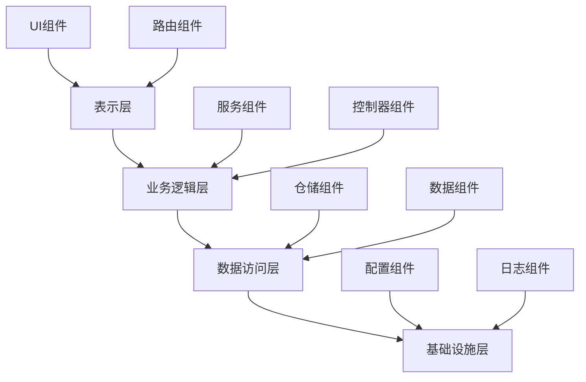

# 02-Web组件架构 (Web Component Architecture)

## 目录

- [02-Web组件架构 (Web Component Architecture)](#02-web组件架构-web-component-architecture)
  - [目录](#目录)
  - [1. 概述](#1-概述)
    - [1.1 核心概念](#11-核心概念)
    - [1.2 架构层次](#12-架构层次)
  - [2. 形式化定义](#2-形式化定义)
    - [2.1 组件代数](#21-组件代数)
    - [2.2 组件生命周期](#22-组件生命周期)
  - [3. 架构模式](#3-架构模式)
    - [3.1 MVC模式](#31-mvc模式)
    - [3.2 微前端架构](#32-微前端架构)
  - [4. Go语言实现](#4-go语言实现)
    - [4.1 基础组件框架](#41-基础组件框架)
    - [4.2 HTTP组件](#42-http组件)
    - [4.3 组件管理器](#43-组件管理器)
    - [4.4 使用示例](#44-使用示例)
  - [5. 设计原则](#5-设计原则)
    - [5.1 SOLID原则](#51-solid原则)
    - [5.2 组件设计模式](#52-组件设计模式)
  - [6. 性能优化](#6-性能优化)
    - [6.1 并发优化](#61-并发优化)
    - [6.2 缓存策略](#62-缓存策略)
  - [7. 安全考虑](#7-安全考虑)
    - [7.1 输入验证](#71-输入验证)
    - [7.2 访问控制](#72-访问控制)
  - [8. 测试策略](#8-测试策略)
    - [8.1 单元测试](#81-单元测试)
    - [8.2 集成测试](#82-集成测试)
  - [9. 部署和运维](#9-部署和运维)
    - [9.1 容器化部署](#91-容器化部署)
    - [9.2 监控和日志](#92-监控和日志)
  - [10. 总结](#10-总结)
    - [10.1 最佳实践](#101-最佳实践)
    - [10.2 未来发展方向](#102-未来发展方向)

---

## 1. 概述

Web组件架构是一种基于组件的软件架构模式，专门用于构建Web应用程序。它将应用程序分解为可重用、可组合的组件，每个组件负责特定的功能或业务逻辑。

### 1.1 核心概念

**定义 1.1.1 (Web组件)**
Web组件是一个自包含的、可重用的软件单元，具有以下特性：

- 封装性：内部实现对外部隐藏
- 可重用性：可在不同上下文中使用
- 可组合性：可与其他组件组合
- 独立性：具有明确的接口和职责

**定义 1.1.2 (组件接口)**
组件接口定义了组件与外部系统的交互契约：
$$I = (M, E, S)$$
其中：

- $M$ 是方法集合
- $E$ 是事件集合  
- $S$ 是状态集合

### 1.2 架构层次



---

## 2. 形式化定义

### 2.1 组件代数

**公理 2.1.1 (组件组合)**
对于任意两个组件 $C_1$ 和 $C_2$，其组合 $C_1 \circ C_2$ 满足：
$$(C_1 \circ C_2) \circ C_3 = C_1 \circ (C_2 \circ C_3)$$

**定理 2.1.1 (组件可交换性)**
如果组件 $C_1$ 和 $C_2$ 无依赖关系，则：
$$C_1 \circ C_2 = C_2 \circ C_1$$

**证明**：
设 $I_1$ 和 $I_2$ 分别为 $C_1$ 和 $C_2$ 的接口，由于无依赖关系：
$$I_1 \cap I_2 = \emptyset$$
因此组合顺序不影响最终结果。

### 2.2 组件生命周期

**定义 2.2.1 (组件状态)**
组件状态是一个有限状态机：
$$S = (Q, \Sigma, \delta, q_0, F)$$
其中：

- $Q$ 是状态集合
- $\Sigma$ 是输入字母表
- $\delta$ 是状态转移函数
- $q_0$ 是初始状态
- $F$ 是接受状态集合

---

## 3. 架构模式

### 3.1 MVC模式

**定义 3.1.1 (MVC组件)**
MVC组件包含三个子组件：
$$C_{MVC} = (M, V, C)$$
其中：

- $M$ 是模型组件
- $V$ 是视图组件
- $C$ 是控制器组件

```go
// MVC组件接口
type MVCComponent interface {
    Model() Model
    View() View
    Controller() Controller
}

// 模型组件
type Model interface {
    GetData() interface{}
    SetData(data interface{}) error
    Validate() error
}

// 视图组件
type View interface {
    Render(data interface{}) ([]byte, error)
    Update(data interface{}) error
}

// 控制器组件
type Controller interface {
    HandleRequest(req *http.Request) (*http.Response, error)
    ProcessInput(input interface{}) error
}
```

### 3.2 微前端架构

**定义 3.2.1 (微前端组件)**
微前端组件是一个独立的、可部署的前端应用：
$$C_{MF} = (A, R, S)$$
其中：

- $A$ 是应用组件
- $R$ 是路由组件
- $S$ 是共享组件

```go
// 微前端容器
type MicroFrontendContainer struct {
    apps    map[string]MicroFrontendApp
    router  Router
    shared  SharedServices
}

// 微前端应用
type MicroFrontendApp interface {
    ID() string
    Mount(container *MicroFrontendContainer) error
    Unmount() error
    HandleRoute(path string) error
}
```

---

## 4. Go语言实现

### 4.1 基础组件框架

```go
package webcomponent

import (
    "context"
    "fmt"
    "net/http"
    "sync"
)

// Component 基础组件接口
type Component interface {
    ID() string
    Initialize(ctx context.Context) error
    Start(ctx context.Context) error
    Stop(ctx context.Context) error
    Health() HealthStatus
}

// HealthStatus 健康状态
type HealthStatus struct {
    Status    string `json:"status"`
    Message   string `json:"message"`
    Timestamp int64  `json:"timestamp"`
}

// BaseComponent 基础组件实现
type BaseComponent struct {
    id       string
    status   HealthStatus
    mutex    sync.RWMutex
    ctx      context.Context
    cancel   context.CancelFunc
}

// NewBaseComponent 创建基础组件
func NewBaseComponent(id string) *BaseComponent {
    return &BaseComponent{
        id: id,
        status: HealthStatus{
            Status:    "initialized",
            Message:   "Component created",
            Timestamp: time.Now().Unix(),
        },
    }
}

func (c *BaseComponent) ID() string {
    return c.id
}

func (c *BaseComponent) Initialize(ctx context.Context) error {
    c.mutex.Lock()
    defer c.mutex.Unlock()
    
    c.ctx, c.cancel = context.WithCancel(ctx)
    c.status.Status = "initialized"
    c.status.Timestamp = time.Now().Unix()
    
    return nil
}

func (c *BaseComponent) Start(ctx context.Context) error {
    c.mutex.Lock()
    defer c.mutex.Unlock()
    
    c.status.Status = "running"
    c.status.Timestamp = time.Now().Unix()
    
    return nil
}

func (c *BaseComponent) Stop(ctx context.Context) error {
    c.mutex.Lock()
    defer c.mutex.Unlock()
    
    if c.cancel != nil {
        c.cancel()
    }
    
    c.status.Status = "stopped"
    c.status.Timestamp = time.Now().Unix()
    
    return nil
}

func (c *BaseComponent) Health() HealthStatus {
    c.mutex.RLock()
    defer c.mutex.RUnlock()
    
    return c.status
}
```

### 4.2 HTTP组件

```go
// HTTPComponent HTTP组件
type HTTPComponent struct {
    *BaseComponent
    server   *http.Server
    handlers map[string]http.HandlerFunc
    port     int
}

// NewHTTPComponent 创建HTTP组件
func NewHTTPComponent(id string, port int) *HTTPComponent {
    return &HTTPComponent{
        BaseComponent: NewBaseComponent(id),
        handlers:     make(map[string]http.HandlerFunc),
        port:         port,
    }
}

// RegisterHandler 注册处理器
func (c *HTTPComponent) RegisterHandler(path string, handler http.HandlerFunc) {
    c.handlers[path] = handler
}

// Start 启动HTTP服务器
func (c *HTTPComponent) Start(ctx context.Context) error {
    if err := c.BaseComponent.Start(ctx); err != nil {
        return err
    }
    
    mux := http.NewServeMux()
    for path, handler := range c.handlers {
        mux.HandleFunc(path, handler)
    }
    
    c.server = &http.Server{
        Addr:    fmt.Sprintf(":%d", c.port),
        Handler: mux,
    }
    
    go func() {
        if err := c.server.ListenAndServe(); err != nil && err != http.ErrServerClosed {
            log.Printf("HTTP server error: %v", err)
        }
    }()
    
    return nil
}

// Stop 停止HTTP服务器
func (c *HTTPComponent) Stop(ctx context.Context) error {
    if c.server != nil {
        c.server.Shutdown(ctx)
    }
    
    return c.BaseComponent.Stop(ctx)
}
```

### 4.3 组件管理器

```go
// ComponentManager 组件管理器
type ComponentManager struct {
    components map[string]Component
    mutex      sync.RWMutex
    ctx        context.Context
    cancel     context.CancelFunc
}

// NewComponentManager 创建组件管理器
func NewComponentManager() *ComponentManager {
    return &ComponentManager{
        components: make(map[string]Component),
    }
}

// RegisterComponent 注册组件
func (c *ComponentManager) RegisterComponent(component Component) error {
    c.mutex.Lock()
    defer c.mutex.Unlock()
    
    id := component.ID()
    if _, exists := c.components[id]; exists {
        return fmt.Errorf("component %s already exists", id)
    }
    
    c.components[id] = component
    return nil
}

// StartAll 启动所有组件
func (c *ComponentManager) StartAll(ctx context.Context) error {
    c.mutex.Lock()
    defer c.mutex.Unlock()
    
    c.ctx, c.cancel = context.WithCancel(ctx)
    
    for _, component := range c.components {
        if err := component.Initialize(c.ctx); err != nil {
            return fmt.Errorf("failed to initialize component %s: %w", component.ID(), err)
        }
        
        if err := component.Start(c.ctx); err != nil {
            return fmt.Errorf("failed to start component %s: %w", component.ID(), err)
        }
    }
    
    return nil
}

// StopAll 停止所有组件
func (c *ComponentManager) StopAll() error {
    c.mutex.Lock()
    defer c.mutex.Unlock()
    
    if c.cancel != nil {
        c.cancel()
    }
    
    for _, component := range c.components {
        if err := component.Stop(c.ctx); err != nil {
            log.Printf("Failed to stop component %s: %v", component.ID(), err)
        }
    }
    
    return nil
}

// GetComponent 获取组件
func (c *ComponentManager) GetComponent(id string) (Component, bool) {
    c.mutex.RLock()
    defer c.mutex.RUnlock()
    
    component, exists := c.components[id]
    return component, exists
}

// Health 健康检查
func (c *ComponentManager) Health() map[string]HealthStatus {
    c.mutex.RLock()
    defer c.mutex.RUnlock()
    
    health := make(map[string]HealthStatus)
    for id, component := range c.components {
        health[id] = component.Health()
    }
    
    return health
}
```

### 4.4 使用示例

```go
package main

import (
    "context"
    "fmt"
    "log"
    "net/http"
    "os"
    "os/signal"
    "syscall"
    "time"
    
    "github.com/yourproject/webcomponent"
)

func main() {
    // 创建组件管理器
    manager := webcomponent.NewComponentManager()
    
    // 创建HTTP组件
    httpComponent := webcomponent.NewHTTPComponent("api-server", 8080)
    
    // 注册处理器
    httpComponent.RegisterHandler("/health", func(w http.ResponseWriter, r *http.Request) {
        health := manager.Health()
        fmt.Fprintf(w, "Health: %+v", health)
    })
    
    httpComponent.RegisterHandler("/api/users", func(w http.ResponseWriter, r *http.Request) {
        fmt.Fprintf(w, "Users API")
    })
    
    // 注册组件
    if err := manager.RegisterComponent(httpComponent); err != nil {
        log.Fatal(err)
    }
    
    // 启动所有组件
    ctx := context.Background()
    if err := manager.StartAll(ctx); err != nil {
        log.Fatal(err)
    }
    
    // 等待中断信号
    sigChan := make(chan os.Signal, 1)
    signal.Notify(sigChan, syscall.SIGINT, syscall.SIGTERM)
    <-sigChan
    
    // 优雅关闭
    log.Println("Shutting down...")
    if err := manager.StopAll(); err != nil {
        log.Printf("Error during shutdown: %v", err)
    }
}
```

---

## 5. 设计原则

### 5.1 SOLID原则

**单一职责原则 (SRP)**
每个组件应该只有一个改变的理由。

**开闭原则 (OCP)**
组件应该对扩展开放，对修改关闭。

**里氏替换原则 (LSP)**
子组件应该能够替换其父组件。

**接口隔离原则 (ISP)**
客户端不应该依赖它不使用的接口。

**依赖倒置原则 (DIP)**
高层组件不应该依赖低层组件，两者都应该依赖抽象。

### 5.2 组件设计模式

```go
// 工厂模式
type ComponentFactory interface {
    CreateComponent(config ComponentConfig) (Component, error)
}

// 建造者模式
type ComponentBuilder struct {
    component Component
}

func (b *ComponentBuilder) WithID(id string) *ComponentBuilder {
    // 设置ID
    return b
}

func (b *ComponentBuilder) WithConfig(config interface{}) *ComponentBuilder {
    // 设置配置
    return b
}

func (b *ComponentBuilder) Build() Component {
    return b.component
}

// 观察者模式
type ComponentObserver interface {
    OnComponentEvent(event ComponentEvent)
}

type ComponentEvent struct {
    Type      string
    Component Component
    Data      interface{}
    Timestamp time.Time
}
```

---

## 6. 性能优化

### 6.1 并发优化

```go
// 并发安全的组件池
type ComponentPool struct {
    components chan Component
    factory    ComponentFactory
    maxSize    int
}

func NewComponentPool(factory ComponentFactory, maxSize int) *ComponentPool {
    return &ComponentPool{
        components: make(chan Component, maxSize),
        factory:    factory,
        maxSize:    maxSize,
    }
}

func (p *ComponentPool) Get() (Component, error) {
    select {
    case component := <-p.components:
        return component, nil
    default:
        return p.factory.CreateComponent(ComponentConfig{})
    }
}

func (p *ComponentPool) Put(component Component) {
    select {
    case p.components <- component:
    default:
        // 池已满，丢弃组件
    }
}
```

### 6.2 缓存策略

```go
// 组件缓存
type ComponentCache struct {
    cache map[string]Component
    mutex sync.RWMutex
    ttl   time.Duration
}

func (c *ComponentCache) Get(key string) (Component, bool) {
    c.mutex.RLock()
    defer c.mutex.RUnlock()
    
    component, exists := c.cache[key]
    return component, exists
}

func (c *ComponentCache) Set(key string, component Component) {
    c.mutex.Lock()
    defer c.mutex.Unlock()
    
    c.cache[key] = component
}
```

---

## 7. 安全考虑

### 7.1 输入验证

```go
// 输入验证器
type InputValidator interface {
    Validate(input interface{}) error
}

// 组件安全包装器
type SecureComponent struct {
    component Component
    validator InputValidator
}

func (s *SecureComponent) HandleRequest(req *http.Request) (*http.Response, error) {
    // 验证输入
    if err := s.validator.Validate(req); err != nil {
        return nil, fmt.Errorf("input validation failed: %w", err)
    }
    
    // 处理请求
    return s.component.HandleRequest(req)
}
```

### 7.2 访问控制

```go
// 访问控制
type AccessControl interface {
    CheckPermission(user string, resource string, action string) bool
}

// 安全组件
type SecureComponent struct {
    component     Component
    accessControl AccessControl
}

func (s *SecureComponent) HandleRequest(req *http.Request) (*http.Response, error) {
    user := getUserFromRequest(req)
    resource := getResourceFromRequest(req)
    action := getActionFromRequest(req)
    
    if !s.accessControl.CheckPermission(user, resource, action) {
        return nil, fmt.Errorf("access denied")
    }
    
    return s.component.HandleRequest(req)
}
```

---

## 8. 测试策略

### 8.1 单元测试

```go
package webcomponent_test

import (
    "context"
    "testing"
    "time"
    
    "github.com/yourproject/webcomponent"
)

func TestBaseComponent(t *testing.T) {
    component := webcomponent.NewBaseComponent("test")
    
    // 测试初始化
    ctx := context.Background()
    if err := component.Initialize(ctx); err != nil {
        t.Errorf("Failed to initialize component: %v", err)
    }
    
    // 测试启动
    if err := component.Start(ctx); err != nil {
        t.Errorf("Failed to start component: %v", err)
    }
    
    // 测试健康检查
    health := component.Health()
    if health.Status != "running" {
        t.Errorf("Expected status 'running', got '%s'", health.Status)
    }
    
    // 测试停止
    if err := component.Stop(ctx); err != nil {
        t.Errorf("Failed to stop component: %v", err)
    }
}
```

### 8.2 集成测试

```go
func TestComponentManager(t *testing.T) {
    manager := webcomponent.NewComponentManager()
    
    // 创建测试组件
    component := webcomponent.NewBaseComponent("test")
    
    // 注册组件
    if err := manager.RegisterComponent(component); err != nil {
        t.Errorf("Failed to register component: %v", err)
    }
    
    // 启动所有组件
    ctx := context.Background()
    if err := manager.StartAll(ctx); err != nil {
        t.Errorf("Failed to start components: %v", err)
    }
    
    // 检查健康状态
    health := manager.Health()
    if len(health) != 1 {
        t.Errorf("Expected 1 component, got %d", len(health))
    }
    
    // 停止所有组件
    if err := manager.StopAll(); err != nil {
        t.Errorf("Failed to stop components: %v", err)
    }
}
```

---

## 9. 部署和运维

### 9.1 容器化部署

```dockerfile
FROM golang:1.21-alpine AS builder

WORKDIR /app
COPY go.mod go.sum ./
RUN go mod download

COPY . .
RUN go build -o main .

FROM alpine:latest
RUN apk --no-cache add ca-certificates
WORKDIR /root/

COPY --from=builder /app/main .
CMD ["./main"]
```

### 9.2 监控和日志

```go
// 监控指标
type Metrics struct {
    ComponentCount    int64
    RequestCount      int64
    ErrorCount        int64
    ResponseTime      time.Duration
}

// 日志记录
type Logger interface {
    Info(msg string, fields map[string]interface{})
    Error(msg string, err error, fields map[string]interface{})
    Debug(msg string, fields map[string]interface{})
}

// 可观测组件
type ObservableComponent struct {
    component Component
    metrics   *Metrics
    logger    Logger
}

func (o *ObservableComponent) HandleRequest(req *http.Request) (*http.Response, error) {
    start := time.Now()
    
    o.logger.Info("Handling request", map[string]interface{}{
        "method": req.Method,
        "path":   req.URL.Path,
    })
    
    response, err := o.component.HandleRequest(req)
    
    o.metrics.RequestCount++
    o.metrics.ResponseTime = time.Since(start)
    
    if err != nil {
        o.metrics.ErrorCount++
        o.logger.Error("Request failed", err, map[string]interface{}{
            "method": req.Method,
            "path":   req.URL.Path,
        })
    }
    
    return response, err
}
```

---

## 10. 总结

Web组件架构提供了一种模块化、可扩展的方式来构建Web应用程序。通过Go语言的实现，我们可以获得：

1. **高性能**: Go的并发模型和编译优化
2. **类型安全**: 编译时类型检查
3. **内存安全**: 自动内存管理
4. **可维护性**: 清晰的接口和职责分离
5. **可测试性**: 易于单元测试和集成测试

### 10.1 最佳实践

1. **组件设计**: 遵循SOLID原则
2. **错误处理**: 使用Go的错误处理模式
3. **并发安全**: 使用互斥锁和通道
4. **性能优化**: 使用连接池和缓存
5. **安全考虑**: 输入验证和访问控制
6. **监控**: 指标收集和日志记录

### 10.2 未来发展方向

1. **云原生**: 支持Kubernetes部署
2. **服务网格**: 集成Istio等服务网格
3. **事件驱动**: 支持事件流处理
4. **AI集成**: 智能组件和自动优化
5. **边缘计算**: 支持边缘部署

---

**相关链接**:

- [01-组件架构基础](./01-Component-Architecture-Foundation.md)
- [03-Web3组件架构](./03-Web3-Component-Architecture.md)
- [04-认证组件架构](./04-Auth-Component-Architecture.md)
- [01-微服务架构基础](../03-Microservice-Architecture/01-Microservice-Architecture-Foundation.md)
