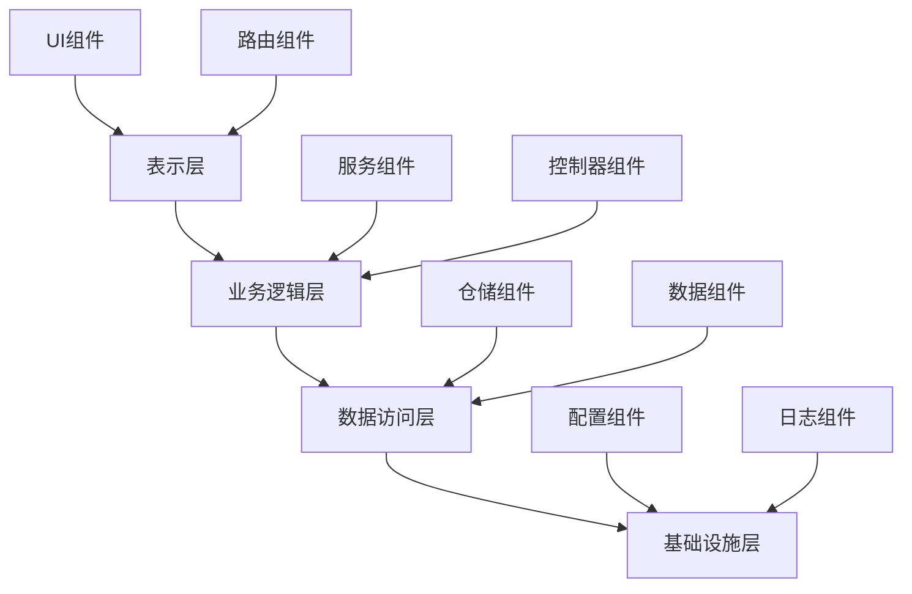
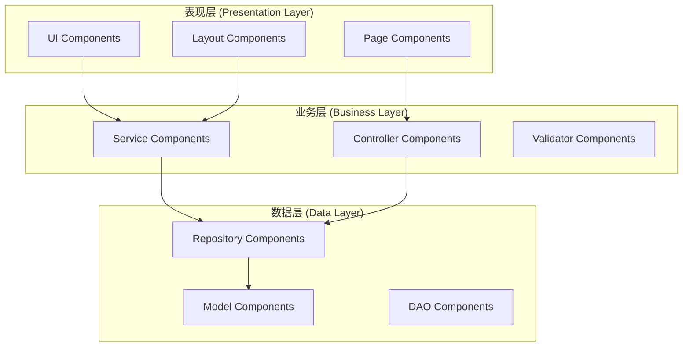

# 02-Web组件架构 (Web Component Architecture)

## 目录

- [02-Web组件架构 (Web Component Architecture)](#02-web组件架构-web-component-architecture)
  - [目录](#目录)
  - [1. 概述](#1-概述)
    - [1.1 核心概念](#11-核心概念)
    - [1.2 架构层次](#12-架构层次)
  - [2. 形式化定义](#2-形式化定义)
    - [2.1 组件定义](#21-组件定义)
    - [2.2 组件组合](#22-组件组合)
    - [2.3 组件生命周期](#23-组件生命周期)
  - [3. 架构模式](#3-架构模式)
    - [3.1 分层组件架构](#31-分层组件架构)
    - [3.2 组件通信模式](#32-组件通信模式)
      - [3.2.1 事件驱动模式](#321-事件驱动模式)
      - [3.2.2 状态管理模式](#322-状态管理模式)
  - [4. Go语言实现](#4-go语言实现)
    - [4.1 基础组件接口](#41-基础组件接口)
    - [4.2 具体组件实现](#42-具体组件实现)
      - [4.2.1 UI组件](#421-ui组件)
      - [4.2.2 容器组件](#422-容器组件)
    - [4.3 组件管理器](#43-组件管理器)
  - [5. 性能优化](#5-性能优化)
    - [5.1 虚拟DOM](#51-虚拟dom)
    - [5.2 组件缓存](#52-组件缓存)
  - [6. 测试策略](#6-测试策略)
    - [6.1 单元测试](#61-单元测试)
    - [6.2 集成测试](#62-集成测试)
  - [7. 最佳实践](#7-最佳实践)
    - [7.1 组件设计原则](#71-组件设计原则)
    - [7.2 性能优化建议](#72-性能优化建议)
    - [7.3 安全考虑](#73-安全考虑)
  - [8. 总结](#8-总结)
  - [相关链接](#相关链接)

---

## 1. 概述

Web组件架构是现代Web应用开发的核心架构模式，它通过组件化的方式构建可复用、可维护的Web应用。本文档从形式化定义、架构模式、Go语言实现等多个维度深入分析Web组件架构。

### 1.1 核心概念

**定义 1.1.1 (Web组件)**
Web组件是一个自包含的、可重用的软件单元，具有以下特性：

- 封装性：内部实现对外部隐藏
- 可重用性：可在不同上下文中使用
- 可组合性：可与其他组件组合
- 独立性：具有明确的接口和职责

**定义 1.1.2 (组件接口)**
组件接口定义了组件与外部系统的交互契约：
$$I = (M, E, S)$$
其中：

- $M$ 是方法集合
- $E$ 是事件集合  
- $S$ 是状态集合

### 1.2 架构层次



---

## 2. 形式化定义

### 2.1 组件定义

**定义 1.1** (Web组件)
Web组件是一个三元组 $C = (S, I, B)$，其中：

- $S$ 是组件的状态集合 (State Set)
- $I$ 是组件的接口集合 (Interface Set)  
- $B$ 是组件的行为集合 (Behavior Set)

**定义 1.2** (组件状态)
组件状态是一个映射 $s: V \rightarrow D$，其中：

- $V$ 是状态变量集合
- $D$ 是数据域集合

**定义 1.3** (组件接口)
组件接口是一个四元组 $i = (name, type, direction, contract)$，其中：

- $name$ 是接口名称
- $type$ 是数据类型
- $direction$ 是数据流向 (in/out/bidirectional)
- $contract$ 是接口契约

### 2.2 组件组合

**定义 1.4** (组件组合)
给定组件集合 $C_1, C_2, ..., C_n$，其组合 $C_{composite} = \oplus(C_1, C_2, ..., C_n)$ 满足：

$$C_{composite} = (\bigcup_{i=1}^n S_i, \bigcup_{i=1}^n I_i, \bigcup_{i=1}^n B_i)$$

**定理 1.1** (组合可交换性)
对于任意组件 $C_1, C_2$，有：
$$\oplus(C_1, C_2) = \oplus(C_2, C_1)$$

**证明**：
由集合运算的可交换性，$\bigcup$ 运算满足交换律，因此组件组合满足可交换性。

### 2.3 组件生命周期

**定义 1.5** (组件生命周期)
组件生命周期是一个状态机 $L = (Q, \Sigma, \delta, q_0, F)$，其中：

- $Q = \{Initialized, Mounted, Updated, Unmounted\}$ 是状态集合
- $\Sigma$ 是事件集合
- $\delta: Q \times \Sigma \rightarrow Q$ 是状态转移函数
- $q_0 = Initialized$ 是初始状态
- $F = \{Unmounted\}$ 是终止状态集合

---

## 3. 架构模式

### 3.1 分层组件架构



### 3.2 组件通信模式

#### 3.2.1 事件驱动模式

```go
// 事件定义
type Event interface {
    Type() string
    Data() interface{}
    Timestamp() time.Time
}

// 事件总线
type EventBus struct {
    subscribers map[string][]chan Event
    mu          sync.RWMutex
}

func NewEventBus() *EventBus {
    return &EventBus{
        subscribers: make(map[string][]chan Event),
    }
}

func (eb *EventBus) Subscribe(eventType string, ch chan Event) {
    eb.mu.Lock()
    defer eb.mu.Unlock()
    
    if eb.subscribers[eventType] == nil {
        eb.subscribers[eventType] = make([]chan Event, 0)
    }
    eb.subscribers[eventType] = append(eb.subscribers[eventType], ch)
}

func (eb *EventBus) Publish(event Event) {
    eb.mu.RLock()
    defer eb.mu.RUnlock()
    
    if channels, exists := eb.subscribers[event.Type()]; exists {
        for _, ch := range channels {
            select {
            case ch <- event:
            default:
                // 非阻塞发送
            }
        }
    }
}
```

#### 3.2.2 状态管理模式

```go
// 状态管理器
type StateManager struct {
    state     map[string]interface{}
    listeners map[string][]func(interface{})
    mu        sync.RWMutex
}

func NewStateManager() *StateManager {
    return &StateManager{
        state:     make(map[string]interface{}),
        listeners: make(map[string][]func(interface{})),
    }
}

func (sm *StateManager) SetState(key string, value interface{}) {
    sm.mu.Lock()
    defer sm.mu.Unlock()
    
    sm.state[key] = value
    
    // 通知监听器
    if listeners, exists := sm.listeners[key]; exists {
        for _, listener := range listeners {
            go listener(value)
        }
    }
}

func (sm *StateManager) GetState(key string) (interface{}, bool) {
    sm.mu.RLock()
    defer sm.mu.RUnlock()
    
    value, exists := sm.state[key]
    return value, exists
}

func (sm *StateManager) Subscribe(key string, listener func(interface{})) {
    sm.mu.Lock()
    defer sm.mu.Unlock()
    
    if sm.listeners[key] == nil {
        sm.listeners[key] = make([]func(interface{}), 0)
    }
    sm.listeners[key] = append(sm.listeners[key], listener)
}
```

---

## 4. Go语言实现

### 4.1 基础组件接口

```go
// 组件接口
type Component interface {
    ID() string
    Name() string
    Type() string
    Initialize() error
    Mount() error
    Update(props interface{}) error
    Unmount() error
    Render() ([]byte, error)
}

// 基础组件实现
type BaseComponent struct {
    id       string
    name     string
    compType string
    props    interface{}
    state    interface{}
    children []Component
}

func NewBaseComponent(id, name, compType string) *BaseComponent {
    return &BaseComponent{
        id:       id,
        name:     name,
        compType: compType,
        children: make([]Component, 0),
    }
}

func (bc *BaseComponent) ID() string {
    return bc.id
}

func (bc *BaseComponent) Name() string {
    return bc.name
}

func (bc *BaseComponent) Type() string {
    return bc.compType
}

func (bc *BaseComponent) Initialize() error {
    // 基础初始化逻辑
    return nil
}

func (bc *BaseComponent) Mount() error {
    // 基础挂载逻辑
    return nil
}

func (bc *BaseComponent) Update(props interface{}) error {
    bc.props = props
    return nil
}

func (bc *BaseComponent) Unmount() error {
    // 基础卸载逻辑
    return nil
}

func (bc *BaseComponent) Render() ([]byte, error) {
    // 基础渲染逻辑
    return []byte(""), nil
}
```

### 4.2 具体组件实现

#### 4.2.1 UI组件

```go
// 按钮组件
type ButtonComponent struct {
    *BaseComponent
    text     string
    onClick  func()
    disabled bool
}

func NewButtonComponent(id, text string, onClick func()) *ButtonComponent {
    return &ButtonComponent{
        BaseComponent: NewBaseComponent(id, "Button", "ui"),
        text:         text,
        onClick:      onClick,
        disabled:     false,
    }
}

func (bc *ButtonComponent) SetDisabled(disabled bool) {
    bc.disabled = disabled
}

func (bc *ButtonComponent) Render() ([]byte, error) {
    disabledAttr := ""
    if bc.disabled {
        disabledAttr = " disabled"
    }
    
    html := fmt.Sprintf(`<button id="%s" class="btn"%s>%s</button>`, 
        bc.id, disabledAttr, bc.text)
    return []byte(html), nil
}

// 输入框组件
type InputComponent struct {
    *BaseComponent
    placeholder string
    value       string
    onChange    func(string)
}

func NewInputComponent(id, placeholder string, onChange func(string)) *InputComponent {
    return &InputComponent{
        BaseComponent: NewBaseComponent(id, "Input", "ui"),
        placeholder:   placeholder,
        value:        "",
        onChange:     onChange,
    }
}

func (ic *InputComponent) SetValue(value string) {
    ic.value = value
}

func (ic *InputComponent) Render() ([]byte, error) {
    html := fmt.Sprintf(`<input id="%s" type="text" placeholder="%s" value="%s" class="input">`, 
        ic.id, ic.placeholder, ic.value)
    return []byte(html), nil
}
```

#### 4.2.2 容器组件

```go
// 容器组件
type ContainerComponent struct {
    *BaseComponent
    layout string
}

func NewContainerComponent(id, layout string) *ContainerComponent {
    return &ContainerComponent{
        BaseComponent: NewBaseComponent(id, "Container", "layout"),
        layout:       layout,
    }
}

func (cc *ContainerComponent) AddChild(child Component) {
    cc.children = append(cc.children, child)
}

func (cc *ContainerComponent) Render() ([]byte, error) {
    var childrenHTML strings.Builder
    
    for _, child := range cc.children {
        childBytes, err := child.Render()
        if err != nil {
            return nil, err
        }
        childrenHTML.Write(childBytes)
    }
    
    html := fmt.Sprintf(`<div id="%s" class="container %s">%s</div>`, 
        cc.id, cc.layout, childrenHTML.String())
    return []byte(html), nil
}
```

### 4.3 组件管理器

```go
// 组件管理器
type ComponentManager struct {
    components map[string]Component
    registry   map[string]func() Component
    mu         sync.RWMutex
}

func NewComponentManager() *ComponentManager {
    return &ComponentManager{
        components: make(map[string]Component),
        registry:   make(map[string]func() Component),
    }
}

func (cm *ComponentManager) Register(compType string, factory func() Component) {
    cm.mu.Lock()
    defer cm.mu.Unlock()
    
    cm.registry[compType] = factory
}

func (cm *ComponentManager) Create(compType, id string) (Component, error) {
    cm.mu.RLock()
    factory, exists := cm.registry[compType]
    cm.mu.RUnlock()
    
    if !exists {
        return nil, fmt.Errorf("component type %s not registered", compType)
    }
    
    component := factory()
    if err := component.Initialize(); err != nil {
        return nil, err
    }
    
    cm.mu.Lock()
    cm.components[id] = component
    cm.mu.Unlock()
    
    return component, nil
}

func (cm *ComponentManager) Get(id string) (Component, bool) {
    cm.mu.RLock()
    defer cm.mu.RUnlock()
    
    component, exists := cm.components[id]
    return component, exists
}

func (cm *ComponentManager) Remove(id string) {
    cm.mu.Lock()
    defer cm.mu.Unlock()
    
    if component, exists := cm.components[id]; exists {
        component.Unmount()
        delete(cm.components, id)
    }
}
```

---

## 5. 性能优化

### 5.1 虚拟DOM

```go
// 虚拟DOM节点
type VNode struct {
    Type      string
    Props     map[string]interface{}
    Children  []*VNode
    Key       string
    Component Component
}

// 虚拟DOM差异算法
func Diff(oldNode, newNode *VNode) []Patch {
    var patches []Patch
    
    if oldNode.Type != newNode.Type {
        patches = append(patches, Patch{
            Type: Replace,
            Node: newNode,
        })
        return patches
    }
    
    // 属性差异
    if !reflect.DeepEqual(oldNode.Props, newNode.Props) {
        patches = append(patches, Patch{
            Type: UpdateProps,
            Props: newNode.Props,
        })
    }
    
    // 子节点差异
    childPatches := diffChildren(oldNode.Children, newNode.Children)
    patches = append(patches, childPatches...)
    
    return patches
}

type Patch struct {
    Type  PatchType
    Node  *VNode
    Props map[string]interface{}
}

type PatchType int

const (
    Replace PatchType = iota
    UpdateProps
    UpdateChildren
    Remove
)
```

### 5.2 组件缓存

```go
// 组件缓存
type ComponentCache struct {
    cache map[string]*CacheEntry
    mu    sync.RWMutex
}

type CacheEntry struct {
    Component Component
    Timestamp time.Time
    Hits      int
}

func NewComponentCache() *ComponentCache {
    return &ComponentCache{
        cache: make(map[string]*CacheEntry),
    }
}

func (cc *ComponentCache) Get(key string) (Component, bool) {
    cc.mu.RLock()
    defer cc.mu.RUnlock()
    
    if entry, exists := cc.cache[key]; exists {
        entry.Hits++
        return entry.Component, true
    }
    return nil, false
}

func (cc *ComponentCache) Set(key string, component Component) {
    cc.mu.Lock()
    defer cc.mu.Unlock()
    
    cc.cache[key] = &CacheEntry{
        Component: component,
        Timestamp: time.Now(),
        Hits:      0,
    }
}

func (cc *ComponentCache) Cleanup(maxAge time.Duration) {
    cc.mu.Lock()
    defer cc.mu.Unlock()
    
    now := time.Now()
    for key, entry := range cc.cache {
        if now.Sub(entry.Timestamp) > maxAge {
            delete(cc.cache, key)
        }
    }
}
```

---

## 6. 测试策略

### 6.1 单元测试

```go
func TestButtonComponent(t *testing.T) {
    clicked := false
    onClick := func() {
        clicked = true
    }
    
    button := NewButtonComponent("test-btn", "Click Me", onClick)
    
    // 测试初始化
    err := button.Initialize()
    assert.NoError(t, err)
    
    // 测试渲染
    html, err := button.Render()
    assert.NoError(t, err)
    assert.Contains(t, string(html), "Click Me")
    
    // 测试状态更新
    button.SetDisabled(true)
    html, err = button.Render()
    assert.NoError(t, err)
    assert.Contains(t, string(html), "disabled")
}

func TestComponentManager(t *testing.T) {
    manager := NewComponentManager()
    
    // 注册组件工厂
    manager.Register("button", func() Component {
        return NewButtonComponent("", "", nil)
    })
    
    // 创建组件
    component, err := manager.Create("button", "btn-1")
    assert.NoError(t, err)
    assert.NotNil(t, component)
    
    // 获取组件
    retrieved, exists := manager.Get("btn-1")
    assert.True(t, exists)
    assert.Equal(t, component, retrieved)
}
```

### 6.2 集成测试

```go
func TestComponentIntegration(t *testing.T) {
    manager := NewComponentManager()
    
    // 注册组件
    manager.Register("container", func() Component {
        return NewContainerComponent("", "flex")
    })
    manager.Register("button", func() Component {
        return NewButtonComponent("", "", nil)
    })
    
    // 创建组件树
    container, _ := manager.Create("container", "main")
    button, _ := manager.Create("button", "btn")
    
    container.(*ContainerComponent).AddChild(button)
    
    // 测试渲染
    html, err := container.Render()
    assert.NoError(t, err)
    assert.Contains(t, string(html), "container")
    assert.Contains(t, string(html), "btn")
}
```

---

## 7. 最佳实践

### 7.1 组件设计原则

1. **单一职责原则**: 每个组件只负责一个功能
2. **开闭原则**: 对扩展开放，对修改关闭
3. **依赖倒置原则**: 依赖抽象而非具体实现
4. **接口隔离原则**: 使用小而专一的接口
5. **组合优于继承**: 优先使用组合而非继承

### 7.2 性能优化建议

1. **懒加载**: 按需加载组件
2. **缓存**: 缓存计算结果和组件实例
3. **批处理**: 批量更新DOM
4. **虚拟化**: 对长列表使用虚拟滚动
5. **代码分割**: 按路由分割代码

### 7.3 安全考虑

1. **输入验证**: 验证所有用户输入
2. **XSS防护**: 转义HTML内容
3. **CSRF防护**: 使用CSRF令牌
4. **权限控制**: 实现细粒度权限控制
5. **审计日志**: 记录重要操作

---

## 8. 总结

Web组件架构通过组件化的方式提供了可复用、可维护的Web应用开发模式。通过形式化定义、Go语言实现和最佳实践，可以构建高性能、高可靠的Web组件系统。

关键要点：

- 组件是状态、接口和行为的组合
- 事件驱动和状态管理是核心通信模式
- 虚拟DOM和缓存是重要的性能优化手段
- 测试和最佳实践确保系统质量

## 相关链接

- [01-组件架构基础](./01-Component-Architecture-Foundation.md)
- [03-Web3组件架构](./03-Web3-Component-Architecture.md)
- [04-认证组件架构](./04-Auth-Component-Architecture.md)
