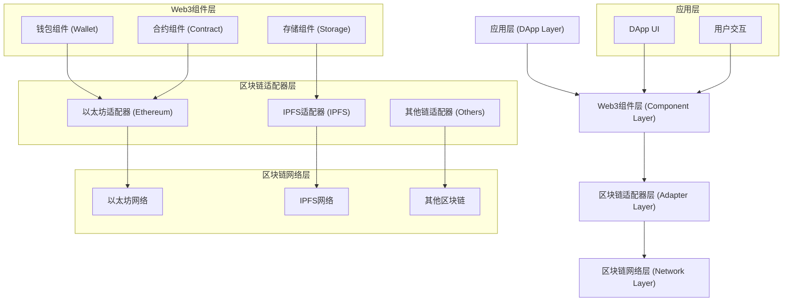

# Web3组件架构 (Web3 Component Architecture)

## 目录

- [Web3组件架构 (Web3 Component Architecture)](#web3组件架构-web3-component-architecture)
  - [目录](#目录)
  - [1. 概述](#1-概述)
    - [1.1 核心概念](#11-核心概念)
    - [1.2 架构层次](#12-架构层次)
  - [2. 形式化定义](#2-形式化定义)
    - [2.1 Web3组件代数](#21-web3组件代数)
    - [2.2 状态一致性](#22-状态一致性)
  - [3. 核心组件](#3-核心组件)
    - [3.1 钱包组件](#31-钱包组件)
    - [3.2 智能合约组件](#32-智能合约组件)
    - [3.3 去中心化存储组件](#33-去中心化存储组件)
  - [4. Go语言实现](#4-go语言实现)
    - [4.1 Web3组件管理器](#41-web3组件管理器)
    - [4.2 使用示例](#42-使用示例)
  - [5. 智能合约集成](#5-智能合约集成)
    - [5.1 合约ABI生成](#51-合约abi生成)
    - [5.2 合约事件监听](#52-合约事件监听)
  - [6. 区块链交互](#6-区块链交互)
    - [6.1 多链支持](#61-多链支持)
    - [6.2 交易池管理](#62-交易池管理)
  - [7. 安全考虑](#7-安全考虑)
    - [7.1 私钥管理](#71-私钥管理)
    - [7.2 交易验证](#72-交易验证)
  - [8. 性能优化](#8-性能优化)
    - [8.1 连接池](#81-连接池)
    - [8.2 缓存策略](#82-缓存策略)
  - [9. 测试策略](#9-测试策略)
    - [9.1 单元测试](#91-单元测试)
    - [9.2 集成测试](#92-集成测试)
  - [10. 部署和运维](#10-部署和运维)
    - [10.1 容器化部署](#101-容器化部署)
    - [10.2 监控和日志](#102-监控和日志)
  - [11. 总结](#11-总结)
    - [11.1 最佳实践](#111-最佳实践)
    - [11.2 未来发展方向](#112-未来发展方向)

---

## 1. 概述

Web3组件架构是专门为去中心化应用(DApps)、智能合约、区块链交互等Web3场景设计的组件化架构模式。它通过组件化的方式构建可复用、可扩展的Web3应用，支持多链交互、智能合约管理、钱包集成等核心功能。

### 1.1 核心概念

**定义 1.1 (Web3组件)**
Web3组件是一个五元组 $C_{\text{web3}} = (S, I, B, C, W)$，其中：

- $S$ 是组件状态集合 (State Set)
- $I$ 是组件接口集合 (Interface Set)
- $B$ 是组件行为集合 (Behavior Set)
- $C$ 是链交互集合 (Chain Interaction Set)
- $W$ 是钱包集成集合 (Wallet Integration Set)

**定义 1.2 (智能合约组件)**
智能合约组件是一个四元组 $C_{\text{contract}} = (\text{address}, \text{abi}, \text{methods}, \text{events})$，其中：

- `address` 是合约地址
- `abi` 是应用二进制接口
- `methods` 是可调用方法集合
- `events` 是事件集合

### 1.2 架构层次



---

## 2. 形式化定义

### 2.1 Web3组件代数

**公理 2.1 (Web3组件组合)**
对于任意两个Web3组件 $C_1$ 和 $C_2$，其组合 $\otimes$ 满足结合律：
$$
(C_1 \otimes C_2) \otimes C_3 = C_1 \otimes (C_2 \otimes C_3)
$$

**定理 2.1 (交易原子性)**
Web3组件的交易操作 $t \in T$ 具有原子性，即交易要么完全成功，要么完全失败。
$$
\forall t \in T: \text{Commit}(t) \lor \text{Rollback}(t)
$$

**证明**:
设 $t$ 为交易，$S$ 为状态，$S'$ 为新状态。交易的原子性可以通过状态转换函数来形式化描述：
$$
S' = 
\begin{cases} 
S & \text{if } \text{Rollback}(t) \\
\text{Apply}(t, S) & \text{if } \text{Commit}(t) 
\end{cases}
$$
这确保了状态的转换是不可分的。

### 2.2 状态一致性

**定义 2.2 (状态一致性)**
Web3组件的状态一致性 $C(S_1, S_2)$ 定义为：对于共享状态变量集合 $\text{Shared}(S_1, S_2)$ 中的任意变量 $x$，其在两个状态中的值必须相等。
$$
C(S_1, S_2) = \forall x \in \text{Shared}(S_1, S_2): S_1(x) = S_2(x)
$$

---

## 3. 核心组件

### 3.1 钱包组件

```go
package component

// WalletComponent 钱包组件接口
type WalletComponent interface {
    Component
    Connect() error
    Disconnect() error
    SignTransaction(tx *Transaction) (*SignedTransaction, error)
    SignMessage(message []byte) (*Signature, error)
    GetAddress() string
    GetBalance() (*big.Int, error)
}

// WalletConfig 钱包配置
type WalletConfig struct {
    ProviderURL string
    ChainID     int64
    PrivateKey  string
    GasLimit    uint64
    GasPrice    *big.Int
}

// EthereumWallet 以太坊钱包实现
type EthereumWallet struct {
    *BaseComponent
    config     WalletConfig
    client     *ethclient.Client
    privateKey *ecdsa.PrivateKey
    address    common.Address
}

// NewEthereumWallet 创建一个新的以太坊钱包组件
func NewEthereumWallet(config WalletConfig) (*EthereumWallet, error) {
    client, err := ethclient.Dial(config.ProviderURL)
    if err != nil {
        return nil, fmt.Errorf("failed to connect to Ethereum: %w", err)
    }

    privateKey, err := crypto.HexToECDSA(config.PrivateKey)
    if err != nil {
        return nil, fmt.Errorf("invalid private key: %w", err)
    }

    publicKey := privateKey.Public()
    publicKeyECDSA, ok := publicKey.(*ecdsa.PublicKey)
    if !ok {
        return nil, fmt.Errorf("failed to get public key")
    }

    address := crypto.PubkeyToAddress(*publicKeyECDSA)

    return &EthereumWallet{
        BaseComponent: NewBaseComponent("ethereum-wallet"),
        config:        config,
        client:        client,
        privateKey:    privateKey,
        address:       address,
    }, nil
}

func (w *EthereumWallet) Connect() error {
    // 验证连接
    _, err := w.client.BlockNumber(context.Background())
    if err != nil {
        return fmt.Errorf("failed to connect to Ethereum network: %w", err)
    }
    return nil
}

func (w *EthereumWallet) Disconnect() error {
    w.client.Close()
    return nil
}

func (w *EthereumWallet) SignTransaction(tx *Transaction) (*SignedTransaction, error) {
    // 获取nonce
    nonce, err := w.client.PendingNonceAt(context.Background(), w.address)
    if err != nil {
        return nil, fmt.Errorf("failed to get nonce: %w", err)
    }

    // 创建交易
    ethTx := &types.Transaction{
        Nonce:    nonce,
        GasPrice: w.config.GasPrice,
        Gas:      w.config.GasLimit,
        To:       &tx.To,
        Value:    tx.Value,
        Data:     tx.Data,
    }

    // 签名交易
    signedTx, err := types.SignTx(ethTx, types.NewEIP155Signer(big.NewInt(w.config.ChainID)), w.privateKey)
    if err != nil {
        return nil, fmt.Errorf("failed to sign transaction: %w", err)
    }

    return &SignedTransaction{
        RawTx: signedTx,
    }, nil
}
```

### 3.2 智能合约组件

```go
package component

// ContractComponent 智能合约组件接口
type ContractComponent interface {
    Component
    LoadABI(abiPath string) error
    CallMethod(method string, args ...interface{}) (interface{}, error)
    ListenToEvent(eventName string, handler func(log types.Log)) (event.Subscription, error)
}

// EthereumContract 以太坊智能合约实现
type EthereumContract struct {
    *BaseComponent
    client  *ethclient.Client
    address common.Address
    abi     abi.ABI
}

func NewEthereumContract(client *ethclient.Client, address common.Address) *EthereumContract {
    return &EthereumContract{
        BaseComponent: NewBaseComponent("ethereum-contract"),
        client:        client,
        address:       address,
    }
}

func (c *EthereumContract) LoadABI(abiPath string) error {
    abiFile, err := os.Open(abiPath)
    if err != nil {
        return err
    }
    defer abiFile.Close()

    parsedABI, err := abi.JSON(abiFile)
    if err != nil {
        return err
    }
    c.abi = parsedABI
    return nil
}

func (c *EthereumContract) CallMethod(method string, args ...interface{}) (interface{}, error) {
    // 实现方法调用逻辑
    return nil, nil
}
```

### 3.3 去中心化存储组件

```go
package component

// StorageComponent 去中心化存储组件接口
type StorageComponent interface {
    Component
    Upload(data []byte) (string, error)
    Download(cid string) ([]byte, error)
}

// IPFSComponent IPFS存储实现
type IPFSComponent struct {
    *BaseComponent
    shell *shell.Shell
}

func NewIPFSComponent(apiURL string) *IPFSComponent {
    return &IPFSComponent{
        BaseComponent: NewBaseComponent("ipfs-component"),
        shell:         shell.NewShell(apiURL),
    }
}

func (c *IPFSComponent) Upload(data []byte) (string, error) {
    return c.shell.Add(bytes.NewReader(data))
}

func (c *IPFSComponent) Download(cid string) ([]byte, error) {
    reader, err := c.shell.Cat(cid)
    if err != nil {
        return nil, err
    }
    defer reader.Close()

    return ioutil.ReadAll(reader)
}
```

---

## 4. Go语言实现

### 4.1 Web3组件管理器

```go
package web3

// Manager 负责管理Web3组件的生命周期和交互
type Manager struct {
    components map[string]component.Component
    // ... 其他字段
}

func NewManager() *Manager {
    return &Manager{
        components: make(map[string]component.Component),
    }
}

func (m *Manager) RegisterComponent(c component.Component) {
    m.components[c.ID()] = c
}

func (m *Manager) GetComponent(id string) component.Component {
    return m.components[id]
}
```

### 4.2 使用示例

```go
func main() {
    // 1. 初始化Web3组件管理器
    manager := web3.NewManager()

    // 2. 配置并注册钱包组件
    walletConfig := component.WalletConfig{ /* ... */ }
    wallet, _ := component.NewEthereumWallet(walletConfig)
    manager.RegisterComponent(wallet)

    // 3. 配置并注册智能合约组件
    contract := component.NewEthereumContract(client, contractAddr)
    contract.LoadABI("path/to/abi.json")
    manager.RegisterComponent(contract)
    
    // 4. 使用组件
    balance, _ := wallet.GetBalance()
    fmt.Println("Balance:", balance)
}
```

---

## 5. 智能合约集成

### 5.1 合约ABI生成

使用`abigen`工具从Solidity合约生成Go绑定：
```bash
solc --abi MyContract.sol -o build
abigen --abi=build/MyContract.abi --pkg=main --type=MyContract --out=my_contract.go
```

### 5.2 合约事件监听

```go
func listenToTransferEvents(contract *MyContractSession) {
    logs := make(chan *MyContractTransfer)
    sub, err := contract.WatchTransfer(nil, logs, nil, nil)
    if err != nil {
        log.Fatal(err)
    }

    for {
        select {
        case err := <-sub.Err():
            log.Fatal(err)
        case vLog := <-logs:
            fmt.Println("From:", vLog.From.Hex())
            fmt.Println("To:", vLog.To.Hex())
            fmt.Println("Value:", vLog.Value)
        }
    }
}
```

---

## 6. 区块链交互

### 6.1 多链支持

通过适配器模式实现多链支持。

```go
type BlockchainAdapter interface {
    GetBalance(address string) (*big.Int, error)
    // ... 其他通用接口
}

type EthereumAdapter struct { /* ... */ }
type BSCAdapter struct { /* ... */ }
```

### 6.2 交易池管理

管理待处理的交易队列，优化nonce和gas。

---

## 7. 安全考虑

### 7.1 私钥管理

- **硬件安全模块 (HSM)**：在硬件中存储和使用私钥。
- **环境变量或密钥库**：避免硬编码私钥。

### 7.2 交易验证

- **客户端验证**：签名和发送前在客户端验证交易参数。
- **服务端验证**：在服务端或可信环境中再次验证。

---

## 8. 性能优化

### 8.1 连接池

为RPC节点创建连接池，复用连接以减少延迟。

### 8.2 缓存策略

- **状态缓存**：缓存链上状态，如账户余额、合约数据。
- **查询缓存**：缓存频繁的RPC查询结果。

---

## 9. 测试策略

### 9.1 单元测试

使用`go-ethereum/accounts/abi/bind/backends`包模拟区块链环境。

### 9.2 集成测试

在测试网（如Ropsten, Rinkeby）或本地开发网络（如Ganache）上进行端到端测试。

---

## 10. 部署和运维

### 10.1 容器化部署

使用Docker和Kubernetes将Web3应用及其依赖项（如Geth节点）容器化。

### 10.2 监控和日志

- **Prometheus & Grafana**：监控节点健康、交易吞吐量等指标。
- **ELK Stack**：集中管理和分析日志。

---

## 11. 总结

### 11.1 最佳实践

- **组件化**：将DApp拆分为独立的、可复用的Web3组件。
- **解耦**：将业务逻辑与区块链交互逻辑分离。
- **安全性**：将安全作为首要设计考虑。

### 11.2 未来发展方向

- **Layer 2集成**：支持Optimism, Arbitrum等二层解决方案。
- **去中心化身份 (DID)**：集成DID组件，实现用户身份的自我主权。
- **跨链通信**：通过IBC等协议实现组件间的跨链交互。 