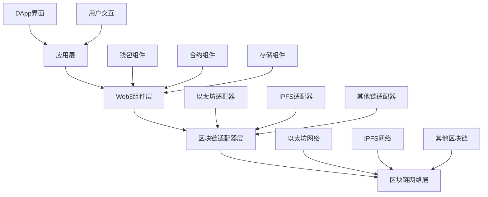

# 03-Web3组件架构 (Web3 Component Architecture)

## 目录

- [03-Web3组件架构 (Web3 Component Architecture)](#03-web3组件架构-web3-component-architecture)
  - [目录](#目录)
  - [1. 概述](#1-概述)
    - [1.1 核心概念](#11-核心概念)
    - [1.2 架构层次](#12-架构层次)
  - [2. 形式化定义](#2-形式化定义)
    - [2.1 Web3组件代数](#21-web3组件代数)
    - [2.2 状态一致性](#22-状态一致性)
  - [3. 核心组件](#3-核心组件)
    - [3.1 钱包组件](#31-钱包组件)
    - [3.2 智能合约组件](#32-智能合约组件)
    - [3.3 去中心化存储组件](#33-去中心化存储组件)
  - [4. Go语言实现](#4-go语言实现)
    - [4.1 Web3组件管理器](#41-web3组件管理器)
    - [4.2 使用示例](#42-使用示例)
  - [5. 智能合约集成](#5-智能合约集成)
    - [5.1 合约ABI生成](#51-合约abi生成)
    - [5.2 合约事件监听](#52-合约事件监听)
  - [6. 区块链交互](#6-区块链交互)
    - [6.1 多链支持](#61-多链支持)
    - [6.2 交易池管理](#62-交易池管理)
  - [7. 安全考虑](#7-安全考虑)
    - [7.1 私钥管理](#71-私钥管理)
    - [7.2 交易验证](#72-交易验证)
  - [8. 性能优化](#8-性能优化)
    - [8.1 连接池](#81-连接池)
    - [8.2 缓存策略](#82-缓存策略)
  - [9. 测试策略](#9-测试策略)
    - [9.1 单元测试](#91-单元测试)
    - [9.2 集成测试](#92-集成测试)
  - [10. 部署和运维](#10-部署和运维)
    - [10.1 容器化部署](#101-容器化部署)
    - [10.2 监控和日志](#102-监控和日志)
  - [11. 总结](#11-总结)
    - [11.1 最佳实践](#111-最佳实践)
    - [11.2 未来发展方向](#112-未来发展方向)

---

## 1. 概述

Web3组件架构是专门为去中心化应用(DeFi)、智能合约、区块链交互等Web3场景设计的组件化架构模式。它通过组件化的方式构建可复用、可扩展的Web3应用，支持多链交互、智能合约管理、钱包集成等核心功能。

### 1.1 核心概念

**定义 1.1.1 (Web3组件)**
Web3组件是一个五元组 ```latex
$C_{web3} = (S, I, B, C, W)$
```，其中：

- ```latex
$S$
``` 是组件状态集合 (State Set)
- ```latex
$I$
``` 是组件接口集合 (Interface Set)
- ```latex
$B$
``` 是组件行为集合 (Behavior Set)
- ```latex
$C$
``` 是链交互集合 (Chain Interaction Set)
- ```latex
$W$
``` 是钱包集成集合 (Wallet Integration Set)

**定义 1.1.2 (智能合约组件)**
智能合约组件是一个四元组 ```latex
$C_{contract} = (address, abi, methods, events)$
```，其中：

- ```latex
$address$
``` 是合约地址
- ```latex
$abi$
``` 是应用二进制接口
- ```latex
$methods$
``` 是可调用方法集合
- ```latex
$events$
``` 是事件集合

### 1.2 架构层次



---

## 2. 形式化定义

### 2.1 Web3组件代数

**公理 2.1.1 (Web3组件组合)**
对于任意两个Web3组件 ```latex
$C_1$
``` 和 ```latex
$C_2$
```，其组合满足：
$```latex
$(C_1 \otimes C_2) \otimes C_3 = C_1 \otimes (C_2 \otimes C_3)$
```$

**定理 2.1.1 (交易原子性)**
Web3组件的交易操作具有原子性：
$```latex
$\forall t \in T: \text{Commit}(t) \lor \text{Rollback}(t)$
```$

**证明**：

```latex
设 ```latex
$t$
``` 为交易，```latex
$S$
``` 为状态，```latex
$S'$
``` 为新状态：
$$S' = \begin{cases}
S & \text{if } \text{Rollback}(t) \\
\text{Apply}(t, S) & \text{if } \text{Commit}(t)
\end{cases}$$
```

### 2.2 状态一致性

**定义 2.2.1 (状态一致性)**
Web3组件的状态一致性定义为：
$```latex
$C(S_1, S_2) = \forall x \in \text{Shared}(S_1, S_2): S_1(x) = S_2(x)$
```$

---

## 3. 核心组件

### 3.1 钱包组件

```go
// WalletComponent 钱包组件
type WalletComponent interface {
    Component
    Connect() error
    Disconnect() error
    SignTransaction(tx *Transaction) (*SignedTransaction, error)
    SignMessage(message []byte) (*Signature, error)
    GetAddress() string
    GetBalance() (*big.Int, error)
}

// WalletConfig 钱包配置
type WalletConfig struct {
    ProviderURL string
    ChainID     int64
    PrivateKey  string
    GasLimit    uint64
    GasPrice    *big.Int
}

// EthereumWallet 以太坊钱包实现
type EthereumWallet struct {
    *BaseComponent
    config     WalletConfig
    client     *ethclient.Client
    privateKey *ecdsa.PrivateKey
    address    common.Address
}

func NewEthereumWallet(config WalletConfig) (*EthereumWallet, error) {
    client, err := ethclient.Dial(config.ProviderURL)
    if err != nil {
        return nil, fmt.Errorf("failed to connect to Ethereum: %w", err)
    }

    privateKey, err := crypto.HexToECDSA(config.PrivateKey)
    if err != nil {
        return nil, fmt.Errorf("invalid private key: %w", err)
    }

    publicKey := privateKey.Public()
    publicKeyECDSA, ok := publicKey.(*ecdsa.PublicKey)
    if !ok {
        return nil, fmt.Errorf("failed to get public key")
    }

    address := crypto.PubkeyToAddress(*publicKeyECDSA)

    return &EthereumWallet{
        BaseComponent: NewBaseComponent("ethereum-wallet"),
        config:        config,
        client:        client,
        privateKey:    privateKey,
        address:       address,
    }, nil
}

func (w *EthereumWallet) Connect() error {
    // 验证连接
    _, err := w.client.BlockNumber(context.Background())
    if err != nil {
        return fmt.Errorf("failed to connect to Ethereum network: %w", err)
    }

    return nil
}

func (w *EthereumWallet) Disconnect() error {
    w.client.Close()
    return nil
}

func (w *EthereumWallet) SignTransaction(tx *Transaction) (*SignedTransaction, error) {
    // 获取nonce
    nonce, err := w.client.PendingNonceAt(context.Background(), w.address)
    if err != nil {
        return nil, fmt.Errorf("failed to get nonce: %w", err)
    }

    // 创建交易
    ethTx := &types.Transaction{
        Nonce:    nonce,
        GasPrice: w.config.GasPrice,
        Gas:      w.config.GasLimit,
        To:       &tx.To,
        Value:    tx.Value,
        Data:     tx.Data,
    }

    // 签名交易
    signedTx, err := types.SignTx(ethTx, types.NewEIP155Signer(big.NewInt(w.config.ChainID)), w.privateKey)
    if err != nil {
        return nil, fmt.Errorf("failed to sign transaction: %w", err)
    }

    return &SignedTransaction{
        Transaction: signedTx,
        Hash:        signedTx.Hash(),
    }, nil
}

func (w *EthereumWallet) SignMessage(message []byte) (*Signature, error) {
    // 创建以太坊签名消息
    ethMessage := fmt.Sprintf("\x19Ethereum Signed Message:\n%d%s", len(message), message)
    hash := crypto.Keccak256Hash([]byte(ethMessage))

    // 签名
    signature, err := crypto.Sign(hash.Bytes(), w.privateKey)
    if err != nil {
        return nil, fmt.Errorf("failed to sign message: %w", err)
    }

    return &Signature{
        R: new(big.Int).SetBytes(signature[:32]),
        S: new(big.Int).SetBytes(signature[32:64]),
        V: signature[64],
    }, nil
}

func (w *EthereumWallet) GetAddress() string {
    return w.address.Hex()
}

func (w *EthereumWallet) GetBalance() (*big.Int, error) {
    balance, err := w.client.BalanceAt(context.Background(), w.address, nil)
    if err != nil {
        return nil, fmt.Errorf("failed to get balance: %w", err)
    }

    return balance, nil
}
```

### 3.2 智能合约组件

```go
// ContractComponent 智能合约组件
type ContractComponent interface {
    Component
    Deploy(bytecode []byte, args ...interface{}) (string, error)
    Call(method string, args ...interface{}) ([]interface{}, error)
    Send(method string, value *big.Int, args ...interface{}) (*Transaction, error)
    GetEvents(eventName string, fromBlock, toBlock uint64) ([]Event, error)
}

// ContractConfig 合约配置
type ContractConfig struct {
    Address    string
    ABI        string
    Wallet     WalletComponent
    GasLimit   uint64
    GasPrice   *big.Int
}

// EthereumContract 以太坊合约实现
type EthereumContract struct {
    *BaseComponent
    config   ContractConfig
    contract *bind.BoundContract
    wallet   WalletComponent
}

func NewEthereumContract(config ContractConfig) (*EthereumContract, error) {
    // 解析ABI
    parsedABI, err := abi.JSON(strings.NewReader(config.ABI))
    if err != nil {
        return nil, fmt.Errorf("failed to parse ABI: %w", err)
    }

    // 创建合约绑定
    address := common.HexToAddress(config.Address)
    contract := bind.NewBoundContract(address, parsedABI, nil, nil, nil)

    return &EthereumContract{
        BaseComponent: NewBaseComponent("ethereum-contract"),
        config:        config,
        contract:      &contract,
        wallet:        config.Wallet,
    }, nil
}

func (c *EthereumContract) Deploy(bytecode []byte, args ...interface{}) (string, error) {
    // 创建部署交易
    auth, err := c.getTransactOpts()
    if err != nil {
        return "", err
    }

    // 部署合约
    address, tx, _, err := bind.DeployContract(auth, *c.contract.ABI, bytecode, nil, args...)
    if err != nil {
        return "", fmt.Errorf("failed to deploy contract: %w", err)
    }

    // 等待交易确认
    receipt, err := c.waitForTransaction(tx.Hash())
    if err != nil {
        return "", err
    }

    if receipt.Status == 0 {
        return "", fmt.Errorf("contract deployment failed")
    }

    return address.Hex(), nil
}

func (c *EthereumContract) Call(method string, args ...interface{}) ([]interface{}, error) {
    // 调用合约方法
    result, err := c.contract.Call(nil, method, args...)
    if err != nil {
        return nil, fmt.Errorf("failed to call method %s: %w", method, err)
    }

    return result, nil
}

func (c *EthereumContract) Send(method string, value *big.Int, args ...interface{}) (*Transaction, error) {
    // 获取交易选项
    auth, err := c.getTransactOpts()
    if err != nil {
        return nil, err
    }

    auth.Value = value

    // 发送交易
    tx, err := c.contract.Transact(auth, method, args...)
    if err != nil {
        return nil, fmt.Errorf("failed to send transaction: %w", err)
    }

    return &Transaction{
        Hash:   tx.Hash().Hex(),
        From:   auth.From.Hex(),
        To:     c.config.Address,
        Value:  value,
        Data:   tx.Data(),
    }, nil
}

func (c *EthereumContract) GetEvents(eventName string, fromBlock, toBlock uint64) ([]Event, error) {
    // 获取事件日志
    logs, err := c.contract.FilterLogs(&bind.FilterOpts{
        Start:   fromBlock,
        End:     &toBlock,
        Context: context.Background(),
    }, eventName)
    if err != nil {
        return nil, fmt.Errorf("failed to get events: %w", err)
    }

    events := make([]Event, 0, len(logs))
    for _, log := range logs {
        events = append(events, Event{
            Address:     log.Address.Hex(),
            Topics:      log.Topics,
            Data:        log.Data,
            BlockNumber: log.BlockNumber,
            TxHash:      log.TxHash.Hex(),
        })
    }

    return events, nil
}

func (c *EthereumContract) getTransactOpts() (*bind.TransactOpts, error) {
    wallet, ok := c.wallet.(*EthereumWallet)
    if !ok {
        return nil, fmt.Errorf("unsupported wallet type")
    }

    return &bind.TransactOpts{
        From:     wallet.address,
        Signer:   wallet.getSigner(),
        GasLimit: c.config.GasLimit,
        GasPrice: c.config.GasPrice,
    }, nil
}

func (c *EthereumContract) waitForTransaction(hash common.Hash) (*types.Receipt, error) {
    // 等待交易确认
    for {
        receipt, err := c.wallet.(*EthereumWallet).client.TransactionReceipt(context.Background(), hash)
        if err == nil {
            return receipt, nil
        }

        time.Sleep(1 * time.Second)
    }
}
```

### 3.3 去中心化存储组件

```go
// StorageComponent 去中心化存储组件
type StorageComponent interface {
    Component
    Upload(data []byte) (string, error)
    Download(hash string) ([]byte, error)
    Pin(hash string) error
    Unpin(hash string) error
    GetStats() (*StorageStats, error)
}

// IPFSStorage IPFS存储实现
type IPFSStorage struct {
    *BaseComponent
    client *ipfsapi.Shell
    config StorageConfig
}

type StorageConfig struct {
    APIURL string
    Timeout time.Duration
}

func NewIPFSStorage(config StorageConfig) (*IPFSStorage, error) {
    client := ipfsapi.NewShell(config.APIURL)
    client.SetTimeout(config.Timeout)

    return &IPFSStorage{
        BaseComponent: NewBaseComponent("ipfs-storage"),
        client:        client,
        config:        config,
    }, nil
}

func (s *IPFSStorage) Upload(data []byte) (string, error) {
    // 上传数据到IPFS
    hash, err := s.client.Add(bytes.NewReader(data))
    if err != nil {
        return "", fmt.Errorf("failed to upload to IPFS: %w", err)
    }

    return hash, nil
}

func (s *IPFSStorage) Download(hash string) ([]byte, error) {
    // 从IPFS下载数据
    reader, err := s.client.Cat(hash)
    if err != nil {
        return nil, fmt.Errorf("failed to download from IPFS: %w", err)
    }
    defer reader.Close()

    data, err := io.ReadAll(reader)
    if err != nil {
        return nil, fmt.Errorf("failed to read data: %w", err)
    }

    return data, nil
}

func (s *IPFSStorage) Pin(hash string) error {
    // 固定文件到IPFS
    err := s.client.Pin(hash)
    if err != nil {
        return fmt.Errorf("failed to pin file: %w", err)
    }

    return nil
}

func (s *IPFSStorage) Unpin(hash string) error {
    // 取消固定文件
    err := s.client.Unpin(hash)
    if err != nil {
        return fmt.Errorf("failed to unpin file: %w", err)
    }

    return nil
}

func (s *IPFSStorage) GetStats() (*StorageStats, error) {
    // 获取存储统计信息
    stats, err := s.client.RepoStat()
    if err != nil {
        return nil, fmt.Errorf("failed to get repo stats: %w", err)
    }

    return &StorageStats{
        NumObjects: stats.NumObjects,
        RepoSize:   stats.RepoSize,
        StorageMax: stats.StorageMax,
    }, nil
}
```

---

## 4. Go语言实现

### 4.1 Web3组件管理器

```go
// Web3ComponentManager Web3组件管理器
type Web3ComponentManager struct {
    *ComponentManager
    wallets   map[string]WalletComponent
    contracts map[string]ContractComponent
    storage   map[string]StorageComponent
}

func NewWeb3ComponentManager() *Web3ComponentManager {
    return &Web3ComponentManager{
        ComponentManager: NewComponentManager(),
        wallets:         make(map[string]WalletComponent),
        contracts:       make(map[string]ContractComponent),
        storage:         make(map[string]StorageComponent),
    }
}

func (m *Web3ComponentManager) RegisterWallet(name string, wallet WalletComponent) error {
    m.wallets[name] = wallet
    return m.RegisterComponent(wallet)
}

func (m *Web3ComponentManager) RegisterContract(name string, contract ContractComponent) error {
    m.contracts[name] = contract
    return m.RegisterComponent(contract)
}

func (m *Web3ComponentManager) RegisterStorage(name string, storage StorageComponent) error {
    m.storage[name] = storage
    return m.RegisterComponent(storage)
}

func (m *Web3ComponentManager) GetWallet(name string) (WalletComponent, bool) {
    wallet, exists := m.wallets[name]
    return wallet, exists
}

func (m *Web3ComponentManager) GetContract(name string) (ContractComponent, bool) {
    contract, exists := m.contracts[name]
    return contract, exists
}

func (m *Web3ComponentManager) GetStorage(name string) (StorageComponent, bool) {
    storage, exists := m.storage[name]
    return storage, exists
}
```

### 4.2 使用示例

```go
package main

import (
    "context"
    "fmt"
    "log"
    "math/big"

    "github.com/yourproject/webcomponent"
)

func main() {
    // 创建Web3组件管理器
    manager := webcomponent.NewWeb3ComponentManager()

    // 创建钱包
    walletConfig := webcomponent.WalletConfig{
        ProviderURL: "https://mainnet.infura.io/v3/YOUR_PROJECT_ID",
        ChainID:     1,
        PrivateKey:  "your_private_key_here",
        GasLimit:    21000,
        GasPrice:    big.NewInt(20000000000), // 20 Gwei
    }

    wallet, err := webcomponent.NewEthereumWallet(walletConfig)
    if err != nil {
        log.Fatal(err)
    }

    // 注册钱包
    if err := manager.RegisterWallet("main", wallet); err != nil {
        log.Fatal(err)
    }

    // 创建IPFS存储
    storageConfig := webcomponent.StorageConfig{
        APIURL:  "http://localhost:5001",
        Timeout: 30 * time.Second,
    }

    storage, err := webcomponent.NewIPFSStorage(storageConfig)
    if err != nil {
        log.Fatal(err)
    }

    // 注册存储
    if err := manager.RegisterStorage("ipfs", storage); err != nil {
        log.Fatal(err)
    }

    // 启动所有组件
    ctx := context.Background()
    if err := manager.StartAll(ctx); err != nil {
        log.Fatal(err)
    }

    // 连接钱包
    if err := wallet.Connect(); err != nil {
        log.Fatal(err)
    }

    // 获取余额
    balance, err := wallet.GetBalance()
    if err != nil {
        log.Fatal(err)
    }

    fmt.Printf("Wallet balance: %s wei\n", balance.String())

    // 上传数据到IPFS
    data := []byte("Hello, Web3!")
    hash, err := storage.Upload(data)
    if err != nil {
        log.Fatal(err)
    }

    fmt.Printf("Data uploaded to IPFS: %s\n", hash)

    // 下载数据
    downloaded, err := storage.Download(hash)
    if err != nil {
        log.Fatal(err)
    }

    fmt.Printf("Downloaded data: %s\n", string(downloaded))

    // 停止所有组件
    if err := manager.StopAll(); err != nil {
        log.Printf("Error during shutdown: %v", err)
    }
}
```

---

## 5. 智能合约集成

### 5.1 合约ABI生成

```go
// ContractGenerator 合约生成器
type ContractGenerator struct {
    abiPath    string
    outputPath string
}

func (g *ContractGenerator) GenerateGoBindings() error {
    // 使用abigen生成Go绑定
    cmd := exec.Command("abigen",
        "--abi="+g.abiPath,
        "--pkg=contract",
        "--out="+g.outputPath,
    )

    return cmd.Run()
}
```

### 5.2 合约事件监听

```go
// EventListener 事件监听器
type EventListener struct {
    contract ContractComponent
    events   chan Event
    done     chan struct{}
}

func NewEventListener(contract ContractComponent) *EventListener {
    return &EventListener{
        contract: contract,
        events:   make(chan Event, 100),
        done:     make(chan struct{}),
    }
}

func (l *EventListener) Start() {
    go func() {
        for {
            select {
            case <-l.done:
                return
            default:
                // 监听最新区块
                events, err := l.contract.GetEvents("Transfer", 0, 0)
                if err != nil {
                    log.Printf("Failed to get events: %v", err)
                    time.Sleep(1 * time.Second)
                    continue
                }

                for _, event := range events {
                    select {
                    case l.events <- event:
                    default:
                        // 通道已满，丢弃事件
                    }
                }

                time.Sleep(1 * time.Second)
            }
        }
    }()
}

func (l *EventListener) Stop() {
    close(l.done)
}

func (l *EventListener) Events() <-chan Event {
    return l.events
}
```

---

## 6. 区块链交互

### 6.1 多链支持

```go
// ChainAdapter 链适配器接口
type ChainAdapter interface {
    GetName() string
    GetChainID() int64
    GetBlockNumber() (uint64, error)
    GetBalance(address string) (*big.Int, error)
    SendTransaction(tx *Transaction) (string, error)
}

// EthereumAdapter 以太坊适配器
type EthereumAdapter struct {
    client *ethclient.Client
    chainID int64
}

func (a *EthereumAdapter) GetName() string {
    return "Ethereum"
}

func (a *EthereumAdapter) GetChainID() int64 {
    return a.chainID
}

func (a *EthereumAdapter) GetBlockNumber() (uint64, error) {
    return a.client.BlockNumber(context.Background())
}

func (a *EthereumAdapter) GetBalance(address string) (*big.Int, error) {
    addr := common.HexToAddress(address)
    return a.client.BalanceAt(context.Background(), addr, nil)
}

func (a *EthereumAdapter) SendTransaction(tx *Transaction) (string, error) {
    // 发送交易
    return "", nil
}

// PolygonAdapter Polygon适配器
type PolygonAdapter struct {
    client *ethclient.Client
    chainID int64
}

func (a *PolygonAdapter) GetName() string {
    return "Polygon"
}

func (a *PolygonAdapter) GetChainID() int64 {
    return a.chainID
}

// 其他方法实现...
```

### 6.2 交易池管理

```go
// TransactionPool 交易池
type TransactionPool struct {
    transactions map[string]*Transaction
    mutex        sync.RWMutex
    maxSize      int
}

func NewTransactionPool(maxSize int) *TransactionPool {
    return &TransactionPool{
        transactions: make(map[string]*Transaction),
        maxSize:      maxSize,
    }
}

func (p *TransactionPool) Add(tx *Transaction) error {
    p.mutex.Lock()
    defer p.mutex.Unlock()

    if len(p.transactions) >= p.maxSize {
        return fmt.Errorf("transaction pool is full")
    }

    p.transactions[tx.Hash] = tx
    return nil
}

func (p *TransactionPool) Remove(hash string) {
    p.mutex.Lock()
    defer p.mutex.Unlock()

    delete(p.transactions, hash)
}

func (p *TransactionPool) Get(hash string) (*Transaction, bool) {
    p.mutex.RLock()
    defer p.mutex.RUnlock()

    tx, exists := p.transactions[hash]
    return tx, exists
}

func (p *TransactionPool) GetAll() []*Transaction {
    p.mutex.RLock()
    defer p.mutex.RUnlock()

    txs := make([]*Transaction, 0, len(p.transactions))
    for _, tx := range p.transactions {
        txs = append(txs, tx)
    }

    return txs
}
```

---

## 7. 安全考虑

### 7.1 私钥管理

```go
// KeyManager 密钥管理器
type KeyManager interface {
    GenerateKey() (*ecdsa.PrivateKey, error)
    ImportKey(privateKeyHex string) (*ecdsa.PrivateKey, error)
    ExportKey(privateKey *ecdsa.PrivateKey) (string, error)
    EncryptKey(privateKey *ecdsa.PrivateKey, password string) ([]byte, error)
    DecryptKey(encryptedKey []byte, password string) (*ecdsa.PrivateKey, error)
}

// SecureKeyManager 安全密钥管理器
type SecureKeyManager struct {
    keystore string
}

func (k *SecureKeyManager) GenerateKey() (*ecdsa.PrivateKey, error) {
    return crypto.GenerateKey()
}

func (k *SecureKeyManager) ImportKey(privateKeyHex string) (*ecdsa.PrivateKey, error) {
    return crypto.HexToECDSA(privateKeyHex)
}

func (k *SecureKeyManager) ExportKey(privateKey *ecdsa.PrivateKey) (string, error) {
    return hex.EncodeToString(crypto.FromECDSA(privateKey)), nil
}

func (k *SecureKeyManager) EncryptKey(privateKey *ecdsa.PrivateKey, password string) ([]byte, error) {
    // 使用AES加密私钥
    return nil, nil
}

func (k *SecureKeyManager) DecryptKey(encryptedKey []byte, password string) (*ecdsa.PrivateKey, error) {
    // 解密私钥
    return nil, nil
}
```

### 7.2 交易验证

```go
// TransactionValidator 交易验证器
type TransactionValidator interface {
    ValidateTransaction(tx *Transaction) error
    ValidateSignature(tx *SignedTransaction) error
    CheckNonce(address string, nonce uint64) error
}

// EthereumValidator 以太坊交易验证器
type EthereumValidator struct {
    client *ethclient.Client
}

func (v *EthereumValidator) ValidateTransaction(tx *Transaction) error {
    // 验证交易格式
    if tx.To == (common.Address{}) {
        return fmt.Errorf("invalid recipient address")
    }

    if tx.Value.Cmp(big.NewInt(0)) < 0 {
        return fmt.Errorf("negative value")
    }

    return nil
}

func (v *EthereumValidator) ValidateSignature(tx *SignedTransaction) error {
    // 验证签名
    return nil
}

func (v *EthereumValidator) CheckNonce(address string, nonce uint64) error {
    // 检查nonce
    addr := common.HexToAddress(address)
    currentNonce, err := v.client.PendingNonceAt(context.Background(), addr)
    if err != nil {
        return err
    }

    if nonce < currentNonce {
        return fmt.Errorf("nonce too low")
    }

    return nil
}
```

---

## 8. 性能优化

### 8.1 连接池

```go
// ConnectionPool 连接池
type ConnectionPool struct {
    connections chan *ethclient.Client
    factory     func() (*ethclient.Client, error)
    maxSize     int
}

func NewConnectionPool(factory func() (*ethclient.Client, error), maxSize int) *ConnectionPool {
    return &ConnectionPool{
        connections: make(chan *ethclient.Client, maxSize),
        factory:     factory,
        maxSize:     maxSize,
    }
}

func (p *ConnectionPool) Get() (*ethclient.Client, error) {
    select {
    case conn := <-p.connections:
        return conn, nil
    default:
        return p.factory()
    }
}

func (p *ConnectionPool) Put(conn *ethclient.Client) {
    select {
    case p.connections <- conn:
    default:
        conn.Close()
    }
}
```

### 8.2 缓存策略

```go
// BlockchainCache 区块链缓存
type BlockchainCache struct {
    cache map[string]interface{}
    mutex sync.RWMutex
    ttl   time.Duration
}

func (c *BlockchainCache) Get(key string) (interface{}, bool) {
    c.mutex.RLock()
    defer c.mutex.RUnlock()

    value, exists := c.cache[key]
    return value, exists
}

func (c *BlockchainCache) Set(key string, value interface{}) {
    c.mutex.Lock()
    defer c.mutex.Unlock()

    c.cache[key] = value
}
```

---

## 9. 测试策略

### 9.1 单元测试

```go
package webcomponent_test

import (
    "context"
    "testing"
    "time"

    "github.com/yourproject/webcomponent"
)

func TestEthereumWallet(t *testing.T) {
    config := webcomponent.WalletConfig{
        ProviderURL: "https://goerli.infura.io/v3/YOUR_PROJECT_ID",
        ChainID:     5,
        PrivateKey:  "test_private_key",
        GasLimit:    21000,
        GasPrice:    big.NewInt(20000000000),
    }

    wallet, err := webcomponent.NewEthereumWallet(config)
    if err != nil {
        t.Fatal(err)
    }

    // 测试连接
    if err := wallet.Connect(); err != nil {
        t.Errorf("Failed to connect: %v", err)
    }

    // 测试获取地址
    address := wallet.GetAddress()
    if address == "" {
        t.Error("Expected non-empty address")
    }

    // 测试获取余额
    balance, err := wallet.GetBalance()
    if err != nil {
        t.Errorf("Failed to get balance: %v", err)
    }

    if balance.Cmp(big.NewInt(0)) < 0 {
        t.Error("Expected non-negative balance")
    }
}
```

### 9.2 集成测试

```go
func TestWeb3ComponentManager(t *testing.T) {
    manager := webcomponent.NewWeb3ComponentManager()

    // 创建测试钱包
    walletConfig := webcomponent.WalletConfig{
        ProviderURL: "https://goerli.infura.io/v3/YOUR_PROJECT_ID",
        ChainID:     5,
        PrivateKey:  "test_private_key",
    }

    wallet, err := webcomponent.NewEthereumWallet(walletConfig)
    if err != nil {
        t.Fatal(err)
    }

    // 注册钱包
    if err := manager.RegisterWallet("test", wallet); err != nil {
        t.Errorf("Failed to register wallet: %v", err)
    }

    // 启动管理器
    ctx := context.Background()
    if err := manager.StartAll(ctx); err != nil {
        t.Errorf("Failed to start manager: %v", err)
    }

    // 测试获取钱包
    retrievedWallet, exists := manager.GetWallet("test")
    if !exists {
        t.Error("Wallet not found")
    }

    if retrievedWallet != wallet {
        t.Error("Retrieved wallet does not match")
    }

    // 停止管理器
    if err := manager.StopAll(); err != nil {
        t.Errorf("Failed to stop manager: %v", err)
    }
}
```

---

## 10. 部署和运维

### 10.1 容器化部署

```dockerfile
FROM golang:1.21-alpine AS builder

WORKDIR /app
COPY go.mod go.sum ./
RUN go mod download

COPY . .
RUN go build -o web3app .

FROM alpine:latest
RUN apk --no-cache add ca-certificates
WORKDIR /root/

COPY --from=builder /app/web3app .
CMD ["./web3app"]
```

### 10.2 监控和日志

```go
// Web3Metrics Web3指标
type Web3Metrics struct {
    TransactionCount    int64
    BlockNumber        uint64
    GasUsed            uint64
    ErrorCount         int64
    ResponseTime       time.Duration
}

// Web3Logger Web3日志记录器
type Web3Logger struct {
    logger *zap.Logger
}

func (l *Web3Logger) LogTransaction(tx *Transaction) {
    l.logger.Info("Transaction sent",
        zap.String("hash", tx.Hash),
        zap.String("from", tx.From),
        zap.String("to", tx.To),
        zap.String("value", tx.Value.String()),
    )
}

func (l *Web3Logger) LogError(err error, context map[string]interface{}) {
    l.logger.Error("Web3 error",
        zap.Error(err),
        zap.Any("context", context),
    )
}
```

---

## 11. 总结

Web3组件架构为构建去中心化应用提供了强大的基础。通过Go语言的实现，我们可以获得：

1. **高性能**: Go的并发模型和编译优化
2. **类型安全**: 编译时类型检查
3. **内存安全**: 自动内存管理
4. **区块链集成**: 完整的Web3功能支持
5. **可扩展性**: 模块化设计支持多链

### 11.1 最佳实践

1. **安全第一**: 私钥管理和交易验证
2. **错误处理**: 完善的错误处理机制
3. **性能优化**: 连接池和缓存策略
4. **监控**: 完整的指标和日志记录
5. **测试**: 全面的单元测试和集成测试

### 11.2 未来发展方向

1. **Layer 2支持**: 支持Optimism、Arbitrum等Layer 2解决方案
2. **跨链桥接**: 支持不同区块链之间的资产转移
3. **DeFi集成**: 集成Uniswap、Compound等DeFi协议
4. **NFT支持**: 完整的NFT创建和交易功能
5. **DAO治理**: 支持去中心化自治组织

---

**相关链接**:

- [01-组件架构基础](./01-Component-Architecture-Foundation.md)
- [02-Web组件架构](./02-Web-Component-Architecture.md)
- [04-认证组件架构](./04-Auth-Component-Architecture.md)
- [01-微服务架构基础](../03-Microservice-Architecture/01-Microservice-Architecture-Foundation.md)
