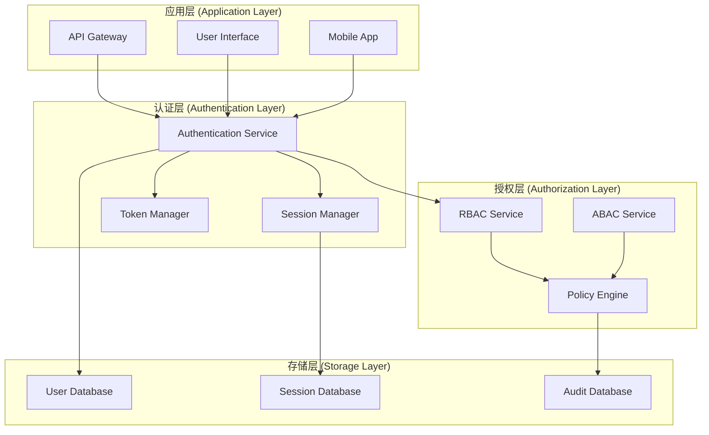

# 04-认证组件架构 (Auth Component Architecture)

## 概述

认证组件架构是专门为身份验证、授权、会话管理等安全功能设计的组件化架构模式。它通过组件化的方式构建可复用、可扩展的认证系统，支持多种认证方式、权限控制和安全策略。

## 1. 形式化定义

### 1.1 认证组件定义

**定义 1.1** (认证组件)
认证组件是一个六元组 ```latex
$C_{auth} = (S, I, B, P, T, R)$
```，其中：

- ```latex
$S$
``` 是组件状态集合 (State Set)
- ```latex
$I$
``` 是组件接口集合 (Interface Set)
- ```latex
$B$
``` 是组件行为集合 (Behavior Set)
- ```latex
$P$
``` 是权限集合 (Permission Set)
- ```latex
$T$
``` 是令牌集合 (Token Set)
- ```latex
$R$
``` 是角色集合 (Role Set)

**定义 1.2** (用户实体)
用户实体是一个四元组 ```latex
$U = (id, credentials, roles, permissions)$
```，其中：

- ```latex
$id$
``` 是用户唯一标识符
- ```latex
$credentials$
``` 是认证凭据集合
- ```latex
$roles$
``` 是用户角色集合
- ```latex
$permissions$
``` 是用户权限集合

**定义 1.3** (认证会话)
认证会话是一个五元组 ```latex
$S_{auth} = (session_id, user_id, token, expires_at, metadata)$
```，其中：

- ```latex
$session_id$
``` 是会话唯一标识符
- ```latex
$user_id$
``` 是用户标识符
- ```latex
$token$
``` 是认证令牌
- ```latex
$expires_at$
``` 是过期时间
- ```latex
$metadata$
``` 是会话元数据

### 1.2 权限模型

**定义 1.4** (权限)
权限是一个三元组 ```latex
$P = (resource, action, conditions)$
```，其中：

- ```latex
$resource$
``` 是资源标识符
- ```latex
$action$
``` 是操作类型 (read, write, delete, execute)
- ```latex
$conditions$
``` 是权限条件集合

**定义 1.5** (角色)
角色是一个三元组 ```latex
$R = (role_id, permissions, inheritance)$
```，其中：

- ```latex
$role_id$
``` 是角色标识符
- ```latex
$permissions$
``` 是权限集合
- ```latex
$inheritance$
``` 是继承关系集合

**定理 1.1** (权限传递性)
对于任意角色 ```latex
$R_1, R_2, R_3$
```，如果 ```latex
$R_1$
``` 继承 ```latex
$R_2$
```，```latex
$R_2$
``` 继承 ```latex
$R_3$
```，则：
$```latex
$R_1.permissions \supseteq R_2.permissions \supseteq R_3.permissions$
```$

### 1.3 认证流程

**定义 1.6** (认证流程)
认证流程是一个状态机 ```latex
$A = (Q, \Sigma, \delta, q_0, F)$
```，其中：

- ```latex
$Q = \{Unauthenticated, Authenticating, Authenticated, Expired, Revoked\}$
``` 是状态集合
- ```latex
$\Sigma$
``` 是事件集合
- ```latex
$\delta: Q \times \Sigma \rightarrow Q$
``` 是状态转移函数
- ```latex
$q_0 = Unauthenticated$
``` 是初始状态
- ```latex
$F = \{Authenticated\}$
``` 是接受状态集合

## 2. 架构模式

### 2.1 分层认证架构



### 2.2 认证模式

#### 2.2.1 多因素认证

```go
// 认证因子接口
type AuthFactor interface {
    Type() string
    Validate(credential interface{}) error
    IsRequired() bool
}

// 密码因子
type PasswordFactor struct {
    required bool
    hasher   PasswordHasher
}

func NewPasswordFactor(required bool) *PasswordFactor {
    return &PasswordFactor{
        required: required,
        hasher:   NewBCryptHasher(),
    }
}

func (pf *PasswordFactor) Type() string {
    return "password"
}

func (pf *PasswordFactor) Validate(credential interface{}) error {
    password, ok := credential.(string)
    if !ok {
        return fmt.Errorf("invalid credential type")
    }
    
    // 验证密码强度
    if err := pf.validatePasswordStrength(password); err != nil {
        return err
    }
    
    return nil
}

func (pf *PasswordFactor) IsRequired() bool {
    return pf.required
}

func (pf *PasswordFactor) validatePasswordStrength(password string) error {
    if len(password) < 8 {
        return fmt.Errorf("password too short")
    }
    
    // 检查复杂度要求
    hasUpper := false
    hasLower := false
    hasDigit := false
    hasSpecial := false
    
    for _, char := range password {
        switch {
        case unicode.IsUpper(char):
            hasUpper = true
        case unicode.IsLower(char):
            hasLower = true
        case unicode.IsDigit(char):
            hasDigit = true
        case unicode.IsPunct(char) || unicode.IsSymbol(char):
            hasSpecial = true
        }
    }
    
    if !hasUpper || !hasLower || !hasDigit || !hasSpecial {
        return fmt.Errorf("password does not meet complexity requirements")
    }
    
    return nil
}

// 双因素认证
type TwoFactorAuth struct {
    factors []AuthFactor
    ttl     time.Duration
}

func NewTwoFactorAuth(factors ...AuthFactor) *TwoFactorAuth {
    return &TwoFactorAuth{
        factors: factors,
        ttl:     5 * time.Minute,
    }
}

func (tfa *TwoFactorAuth) Authenticate(credentials map[string]interface{}) error {
    for _, factor := range tfa.factors {
        if factor.IsRequired() {
            credential, exists := credentials[factor.Type()]
            if !exists {
                return fmt.Errorf("missing required factor: %s", factor.Type())
            }
            
            if err := factor.Validate(credential); err != nil {
                return fmt.Errorf("factor %s validation failed: %w", factor.Type(), err)
            }
        }
    }
    
    return nil
}
```

#### 2.2.2 会话管理

```go
// 会话管理器
type SessionManager struct {
    sessions map[string]*Session
    store    SessionStore
    mu       sync.RWMutex
}

type Session struct {
    ID        string
    UserID    string
    Token     string
    ExpiresAt time.Time
    Metadata  map[string]interface{}
    CreatedAt time.Time
    UpdatedAt time.Time
}

type SessionStore interface {
    Save(session *Session) error
    Get(id string) (*Session, error)
    Delete(id string) error
    List(userID string) ([]*Session, error)
}

func NewSessionManager(store SessionStore) *SessionManager {
    return &SessionManager{
        sessions: make(map[string]*Session),
        store:    store,
    }
}

func (sm *SessionManager) CreateSession(userID string, ttl time.Duration) (*Session, error) {
    sessionID := generateSessionID()
    token := generateToken()
    
    session := &Session{
        ID:        sessionID,
        UserID:    userID,
        Token:     token,
        ExpiresAt: time.Now().Add(ttl),
        Metadata:  make(map[string]interface{}),
        CreatedAt: time.Now(),
        UpdatedAt: time.Now(),
    }
    
    sm.mu.Lock()
    sm.sessions[sessionID] = session
    sm.mu.Unlock()
    
    if err := sm.store.Save(session); err != nil {
        return nil, err
    }
    
    return session, nil
}

func (sm *SessionManager) GetSession(sessionID string) (*Session, error) {
    sm.mu.RLock()
    session, exists := sm.sessions[sessionID]
    sm.mu.RUnlock()
    
    if !exists {
        // 从存储中加载
        session, err := sm.store.Get(sessionID)
        if err != nil {
            return nil, err
        }
        
        sm.mu.Lock()
        sm.sessions[sessionID] = session
        sm.mu.Unlock()
    }
    
    // 检查是否过期
    if time.Now().After(session.ExpiresAt) {
        sm.DeleteSession(sessionID)
        return nil, fmt.Errorf("session expired")
    }
    
    return session, nil
}

func (sm *SessionManager) DeleteSession(sessionID string) error {
    sm.mu.Lock()
    delete(sm.sessions, sessionID)
    sm.mu.Unlock()
    
    return sm.store.Delete(sessionID)
}

func (sm *SessionManager) RefreshSession(sessionID string, ttl time.Duration) error {
    session, err := sm.GetSession(sessionID)
    if err != nil {
        return err
    }
    
    session.ExpiresAt = time.Now().Add(ttl)
    session.UpdatedAt = time.Now()
    
    return sm.store.Save(session)
}
```

## 3. Go语言实现

### 3.1 基础认证组件接口

```go
// 认证组件接口
type AuthComponent interface {
    Component
    Authenticate(credentials interface{}) (*AuthResult, error)
    Authorize(userID string, resource string, action string) error
    ValidateToken(token string) (*TokenInfo, error)
    RefreshToken(token string) (*TokenInfo, error)
    RevokeToken(token string) error
}

// 认证结果
type AuthResult struct {
    UserID    string
    Token     string
    ExpiresAt time.Time
    Roles     []string
    Permissions []string
}

// 令牌信息
type TokenInfo struct {
    Token     string
    UserID    string
    IssuedAt  time.Time
    ExpiresAt time.Time
    Claims    map[string]interface{}
}

// 基础认证组件实现
type BaseAuthComponent struct {
    *BaseComponent
    sessionManager *SessionManager
    tokenManager   *TokenManager
    userManager    *UserManager
    policyEngine   *PolicyEngine
}

func NewBaseAuthComponent(id, name string) *BaseAuthComponent {
    return &BaseAuthComponent{
        BaseComponent: NewBaseComponent(id, name, "auth"),
    }
}

func (bac *BaseAuthComponent) Authenticate(credentials interface{}) (*AuthResult, error) {
    // 基础认证逻辑
    return nil, nil
}

func (bac *BaseAuthComponent) Authorize(userID string, resource string, action string) error {
    // 基础授权逻辑
    return nil
}

func (bac *BaseAuthComponent) ValidateToken(token string) (*TokenInfo, error) {
    // 基础令牌验证逻辑
    return nil, nil
}

func (bac *BaseAuthComponent) RefreshToken(token string) (*TokenInfo, error) {
    // 基础令牌刷新逻辑
    return nil, nil
}

func (bac *BaseAuthComponent) RevokeToken(token string) error {
    // 基础令牌撤销逻辑
    return nil
}
```

### 3.2 具体认证组件实现

#### 3.2.1 JWT认证组件

```go
// JWT认证组件
type JWTAuthComponent struct {
    *BaseAuthComponent
    secretKey []byte
    issuer    string
    audience  string
    ttl       time.Duration
}

func NewJWTAuthComponent(id, name, secretKey, issuer, audience string, ttl time.Duration) *JWTAuthComponent {
    return &JWTAuthComponent{
        BaseAuthComponent: NewBaseAuthComponent(id, name),
        secretKey:        []byte(secretKey),
        issuer:           issuer,
        audience:         audience,
        ttl:              ttl,
    }
}

func (jac *JWTAuthComponent) Authenticate(credentials interface{}) (*AuthResult, error) {
    // 验证用户凭据
    userCreds, ok := credentials.(*UserCredentials)
    if !ok {
        return nil, fmt.Errorf("invalid credentials type")
    }
    
    // 验证用户名密码
    user, err := jac.userManager.ValidateCredentials(userCreds.Username, userCreds.Password)
    if err != nil {
        return nil, err
    }
    
    // 生成JWT令牌
    token, err := jac.generateJWT(user)
    if err != nil {
        return nil, err
    }
    
    return &AuthResult{
        UserID:      user.ID,
        Token:       token,
        ExpiresAt:   time.Now().Add(jac.ttl),
        Roles:       user.Roles,
        Permissions: user.Permissions,
    }, nil
}

func (jac *JWTAuthComponent) ValidateToken(tokenString string) (*TokenInfo, error) {
    token, err := jwt.Parse(tokenString, func(token *jwt.Token) (interface{}, error) {
        if _, ok := token.Method.(*jwt.SigningMethodHMAC); !ok {
            return nil, fmt.Errorf("unexpected signing method: %v", token.Header["alg"])
        }
        return jac.secretKey, nil
    })
    
    if err != nil {
        return nil, err
    }
    
    if claims, ok := token.Claims.(jwt.MapClaims); ok && token.Valid {
        return &TokenInfo{
            Token:     tokenString,
            UserID:    claims["sub"].(string),
            IssuedAt:  time.Unix(int64(claims["iat"].(float64)), 0),
            ExpiresAt: time.Unix(int64(claims["exp"].(float64)), 0),
            Claims:    claims,
        }, nil
    }
    
    return nil, fmt.Errorf("invalid token")
}

func (jac *JWTAuthComponent) generateJWT(user *User) (string, error) {
    claims := jwt.MapClaims{
        "sub": user.ID,
        "iss": jac.issuer,
        "aud": jac.audience,
        "iat": time.Now().Unix(),
        "exp": time.Now().Add(jac.ttl).Unix(),
        "roles": user.Roles,
        "permissions": user.Permissions,
    }
    
    token := jwt.NewWithClaims(jwt.SigningMethodHS256, claims)
    return token.SignedString(jac.secretKey)
}
```

#### 3.2.2 OAuth2认证组件

```go
// OAuth2认证组件
type OAuth2AuthComponent struct {
    *BaseAuthComponent
    clientID     string
    clientSecret string
    redirectURI  string
    authURL      string
    tokenURL     string
    userInfoURL  string
}

func NewOAuth2AuthComponent(id, name, clientID, clientSecret, redirectURI, authURL, tokenURL, userInfoURL string) *OAuth2AuthComponent {
    return &OAuth2AuthComponent{
        BaseAuthComponent: NewBaseAuthComponent(id, name),
        clientID:         clientID,
        clientSecret:     clientSecret,
        redirectURI:      redirectURI,
        authURL:          authURL,
        tokenURL:         tokenURL,
        userInfoURL:      userInfoURL,
    }
}

func (oac *OAuth2AuthComponent) GetAuthorizationURL(state string) string {
    params := url.Values{}
    params.Set("client_id", oac.clientID)
    params.Set("redirect_uri", oac.redirectURI)
    params.Set("response_type", "code")
    params.Set("state", state)
    params.Set("scope", "openid profile email")
    
    return fmt.Sprintf("%s?%s", oac.authURL, params.Encode())
}

func (oac *OAuth2AuthComponent) ExchangeCodeForToken(code string) (*OAuth2Token, error) {
    data := url.Values{}
    data.Set("client_id", oac.clientID)
    data.Set("client_secret", oac.clientSecret)
    data.Set("code", code)
    data.Set("redirect_uri", oac.redirectURI)
    data.Set("grant_type", "authorization_code")
    
    resp, err := http.PostForm(oac.tokenURL, data)
    if err != nil {
        return nil, err
    }
    defer resp.Body.Close()
    
    var token OAuth2Token
    if err := json.NewDecoder(resp.Body).Decode(&token); err != nil {
        return nil, err
    }
    
    return &token, nil
}

func (oac *OAuth2AuthComponent) GetUserInfo(accessToken string) (*OAuth2UserInfo, error) {
    req, err := http.NewRequest("GET", oac.userInfoURL, nil)
    if err != nil {
        return nil, err
    }
    
    req.Header.Set("Authorization", "Bearer "+accessToken)
    
    client := &http.Client{}
    resp, err := client.Do(req)
    if err != nil {
        return nil, err
    }
    defer resp.Body.Close()
    
    var userInfo OAuth2UserInfo
    if err := json.NewDecoder(resp.Body).Decode(&userInfo); err != nil {
        return nil, err
    }
    
    return &userInfo, nil
}

type OAuth2Token struct {
    AccessToken  string `json:"access_token"`
    TokenType    string `json:"token_type"`
    ExpiresIn    int    `json:"expires_in"`
    RefreshToken string `json:"refresh_token"`
    Scope        string `json:"scope"`
}

type OAuth2UserInfo struct {
    ID       string `json:"id"`
    Email    string `json:"email"`
    Name     string `json:"name"`
    Picture  string `json:"picture"`
    Verified bool   `json:"email_verified"`
}
```

#### 3.2.3 RBAC授权组件

```go
// RBAC授权组件
type RBACAuthComponent struct {
    *BaseAuthComponent
    roles       map[string]*Role
    permissions map[string]*Permission
    userRoles   map[string][]string
}

type Role struct {
    ID          string
    Name        string
    Permissions []string
    Inherits    []string
}

type Permission struct {
    ID       string
    Resource string
    Action   string
    Effect   string // allow, deny
}

func NewRBACAuthComponent(id, name string) *RBACAuthComponent {
    return &RBACAuthComponent{
        BaseAuthComponent: NewBaseAuthComponent(id, name),
        roles:            make(map[string]*Role),
        permissions:      make(map[string]*Permission),
        userRoles:        make(map[string][]string),
    }
}

func (rac *RBACAuthComponent) AddRole(role *Role) {
    rac.roles[role.ID] = role
}

func (rac *RBACAuthComponent) AddPermission(permission *Permission) {
    rac.permissions[permission.ID] = permission
}

func (rac *RBACAuthComponent) AssignRoleToUser(userID, roleID string) {
    if rac.userRoles[userID] == nil {
        rac.userRoles[userID] = make([]string, 0)
    }
    rac.userRoles[userID] = append(rac.userRoles[userID], roleID)
}

func (rac *RBACAuthComponent) Authorize(userID string, resource string, action string) error {
    userRoles := rac.userRoles[userID]
    if len(userRoles) == 0 {
        return fmt.Errorf("user has no roles")
    }
    
    // 检查用户的所有角色
    for _, roleID := range userRoles {
        if rac.checkRolePermission(roleID, resource, action) {
            return nil
        }
    }
    
    return fmt.Errorf("access denied")
}

func (rac *RBACAuthComponent) checkRolePermission(roleID, resource, action string) bool {
    role, exists := rac.roles[roleID]
    if !exists {
        return false
    }
    
    // 检查直接权限
    for _, permID := range role.Permissions {
        if perm, exists := rac.permissions[permID]; exists {
            if perm.Resource == resource && perm.Action == action {
                return perm.Effect == "allow"
            }
        }
    }
    
    // 检查继承权限
    for _, inheritedRoleID := range role.Inherits {
        if rac.checkRolePermission(inheritedRoleID, resource, action) {
            return true
        }
    }
    
    return false
}
```

### 3.3 认证组件管理器

```go
// 认证组件管理器
type AuthComponentManager struct {
    components map[string]AuthComponent
    registry   map[string]func() AuthComponent
    strategies map[string]AuthStrategy
    mu         sync.RWMutex
}

type AuthStrategy interface {
    Name() string
    Authenticate(credentials interface{}) (*AuthResult, error)
    ValidateToken(token string) (*TokenInfo, error)
}

func NewAuthComponentManager() *AuthComponentManager {
    return &AuthComponentManager{
        components: make(map[string]AuthComponent),
        registry:   make(map[string]func() AuthComponent),
        strategies: make(map[string]AuthStrategy),
    }
}

func (acm *AuthComponentManager) Register(compType string, factory func() AuthComponent) {
    acm.mu.Lock()
    defer acm.mu.Unlock()
    
    acm.registry[compType] = factory
}

func (acm *AuthComponentManager) RegisterStrategy(strategy AuthStrategy) {
    acm.mu.Lock()
    defer acm.mu.Unlock()
    
    acm.strategies[strategy.Name()] = strategy
}

func (acm *AuthComponentManager) Create(compType, id string) (AuthComponent, error) {
    acm.mu.RLock()
    factory, exists := acm.registry[compType]
    acm.mu.RUnlock()
    
    if !exists {
        return nil, fmt.Errorf("component type %s not registered", compType)
    }
    
    component := factory()
    if err := component.Initialize(); err != nil {
        return nil, err
    }
    
    acm.mu.Lock()
    acm.components[id] = component
    acm.mu.Unlock()
    
    return component, nil
}

func (acm *AuthComponentManager) Authenticate(strategyName string, credentials interface{}) (*AuthResult, error) {
    acm.mu.RLock()
    strategy, exists := acm.strategies[strategyName]
    acm.mu.RUnlock()
    
    if !exists {
        return nil, fmt.Errorf("strategy %s not found", strategyName)
    }
    
    return strategy.Authenticate(credentials)
}

func (acm *AuthComponentManager) Get(id string) (AuthComponent, bool) {
    acm.mu.RLock()
    defer acm.mu.RUnlock()
    
    component, exists := acm.components[id]
    return component, exists
}
```

## 4. 性能优化

### 4.1 令牌缓存

```go
// 令牌缓存管理器
type TokenCacheManager struct {
    cache map[string]*TokenCacheEntry
    mu    sync.RWMutex
    ttl   time.Duration
}

type TokenCacheEntry struct {
    TokenInfo *TokenInfo
    Timestamp time.Time
    Hits      int
}

func NewTokenCacheManager(ttl time.Duration) *TokenCacheManager {
    return &TokenCacheManager{
        cache: make(map[string]*TokenCacheEntry),
        ttl:   ttl,
    }
}

func (tcm *TokenCacheManager) Get(token string) (*TokenInfo, bool) {
    tcm.mu.RLock()
    defer tcm.mu.RUnlock()
    
    if entry, exists := tcm.cache[token]; exists {
        if time.Now().Sub(entry.Timestamp) < tcm.ttl {
            entry.Hits++
            return entry.TokenInfo, true
        }
        // 过期，删除
        delete(tcm.cache, token)
    }
    
    return nil, false
}

func (tcm *TokenCacheManager) Set(token string, tokenInfo *TokenInfo) {
    tcm.mu.Lock()
    defer tcm.mu.Unlock()
    
    tcm.cache[token] = &TokenCacheEntry{
        TokenInfo: tokenInfo,
        Timestamp: time.Now(),
        Hits:      0,
    }
}

func (tcm *TokenCacheManager) Cleanup() {
    tcm.mu.Lock()
    defer tcm.mu.Unlock()
    
    now := time.Now()
    for token, entry := range tcm.cache {
        if now.Sub(entry.Timestamp) > tcm.ttl {
            delete(tcm.cache, token)
        }
    }
}
```

### 4.2 权限缓存

```go
// 权限缓存管理器
type PermissionCacheManager struct {
    cache map[string]*PermissionCacheEntry
    mu    sync.RWMutex
    ttl   time.Duration
}

type PermissionCacheEntry struct {
    Permissions []string
    Timestamp   time.Time
    Hits        int
}

func NewPermissionCacheManager(ttl time.Duration) *PermissionCacheManager {
    return &PermissionCacheManager{
        cache: make(map[string]*PermissionCacheEntry),
        ttl:   ttl,
    }
}

func (pcm *PermissionCacheManager) Get(userID string) ([]string, bool) {
    pcm.mu.RLock()
    defer pcm.mu.RUnlock()
    
    if entry, exists := pcm.cache[userID]; exists {
        if time.Now().Sub(entry.Timestamp) < pcm.ttl {
            entry.Hits++
            return entry.Permissions, true
        }
        // 过期，删除
        delete(pcm.cache, userID)
    }
    
    return nil, false
}

func (pcm *PermissionCacheManager) Set(userID string, permissions []string) {
    pcm.mu.Lock()
    defer pcm.mu.Unlock()
    
    pcm.cache[userID] = &PermissionCacheEntry{
        Permissions: permissions,
        Timestamp:   time.Now(),
        Hits:        0,
    }
}
```

## 5. 测试策略

### 5.1 单元测试

```go
func TestJWTAuthComponent(t *testing.T) {
    component := NewJWTAuthComponent("test-jwt", "JWT Auth", "secret", "issuer", "audience", time.Hour)
    
    // 测试令牌生成
    user := &User{
        ID:          "user1",
        Username:    "testuser",
        Roles:       []string{"user"},
        Permissions: []string{"read:profile"},
    }
    
    token, err := component.generateJWT(user)
    assert.NoError(t, err)
    assert.NotEmpty(t, token)
    
    // 测试令牌验证
    tokenInfo, err := component.ValidateToken(token)
    assert.NoError(t, err)
    assert.Equal(t, user.ID, tokenInfo.UserID)
    assert.Equal(t, user.Roles, tokenInfo.Claims["roles"])
}

func TestRBACAuthComponent(t *testing.T) {
    component := NewRBACAuthComponent("test-rbac", "RBAC Auth")
    
    // 添加权限
    component.AddPermission(&Permission{
        ID:       "read:profile",
        Resource: "profile",
        Action:   "read",
        Effect:   "allow",
    })
    
    // 添加角色
    component.AddRole(&Role{
        ID:          "user",
        Name:        "User",
        Permissions: []string{"read:profile"},
    })
    
    // 分配角色
    component.AssignRoleToUser("user1", "user")
    
    // 测试授权
    err := component.Authorize("user1", "profile", "read")
    assert.NoError(t, err)
    
    // 测试拒绝
    err = component.Authorize("user1", "profile", "write")
    assert.Error(t, err)
}
```

### 5.2 集成测试

```go
func TestAuthComponentIntegration(t *testing.T) {
    manager := NewAuthComponentManager()
    
    // 注册组件
    manager.Register("jwt", func() AuthComponent {
        return NewJWTAuthComponent("", "", "secret", "issuer", "audience", time.Hour)
    })
    manager.Register("rbac", func() AuthComponent {
        return NewRBACAuthComponent("", "")
    })
    
    // 创建组件
    jwtComp, err := manager.Create("jwt", "jwt-1")
    assert.NoError(t, err)
    
    rbacComp, err := manager.Create("rbac", "rbac-1")
    assert.NoError(t, err)
    
    // 测试认证流程
    credentials := &UserCredentials{
        Username: "testuser",
        Password: "password123",
    }
    
    result, err := jwtComp.Authenticate(credentials)
    assert.NoError(t, err)
    assert.NotNil(t, result)
    
    // 测试授权
    err = rbacComp.Authorize(result.UserID, "profile", "read")
    assert.NoError(t, err)
}
```

## 6. 最佳实践

### 6.1 安全考虑

1. **密码安全**: 使用强密码策略和安全的哈希算法
2. **令牌安全**: 使用HTTPS传输，设置合理的过期时间
3. **会话安全**: 实现会话固定攻击防护
4. **权限最小化**: 遵循最小权限原则
5. **审计日志**: 记录所有认证和授权操作

### 6.2 性能优化

1. **缓存策略**: 缓存用户权限和会话信息
2. **连接池**: 使用数据库连接池
3. **异步处理**: 异步处理日志和审计
4. **负载均衡**: 使用负载均衡器分发请求
5. **CDN**: 使用CDN加速静态资源

### 6.3 可扩展性

1. **微服务**: 将认证服务拆分为微服务
2. **多租户**: 支持多租户架构
3. **插件架构**: 支持多种认证方式
4. **API网关**: 使用API网关统一管理
5. **服务发现**: 使用服务发现机制

## 总结

认证组件架构通过组件化的方式提供了完整的身份验证和授权解决方案。通过形式化定义、Go语言实现和最佳实践，可以构建安全、高效、可扩展的认证系统。

关键要点：

- 认证组件包含权限、令牌和角色管理
- 多因素认证和OAuth2支持多种认证方式
- RBAC和ABAC提供灵活的授权模型
- 缓存和性能优化确保系统高效运行

## 相关链接

- [01-组件架构基础](./01-Component-Architecture-Foundation.md)
- [02-Web组件架构](./02-Web-Component-Architecture.md)
- [03-Web3组件架构](./03-Web3-Component-Architecture.md)
