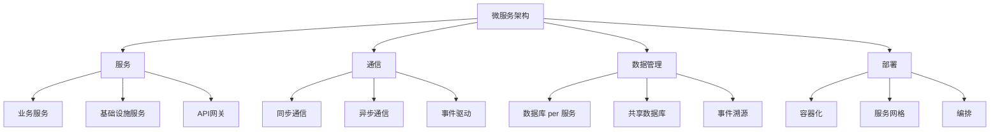

# 01-微服务架构基础 (Microservice Architecture Foundation)

## 目录

- [01-微服务架构基础 (Microservice Architecture Foundation)](#01-微服务架构基础-microservice-architecture-foundation)
  - [目录](#目录)
  - [1. 概述](#1-概述)
  - [2. 形式化定义](#2-形式化定义)
  - [3. 数学基础](#3-数学基础)
  - [4. 设计原则](#4-设计原则)
  - [5. Go语言实现](#5-go语言实现)
  - [6. 微服务模式](#6-微服务模式)
  - [7. 性能分析](#7-性能分析)
  - [8. 最佳实践](#8-最佳实践)
  - [9. 相关模式](#9-相关模式)
  - [10. 总结](#10-总结)

## 1. 概述

### 1.1 定义

微服务架构是一种将应用程序构建为一组小型、独立服务的架构风格。每个服务运行在自己的进程中，通过轻量级机制（通常是HTTP API）进行通信。

### 1.2 核心概念



### 1.3 架构特征

- **服务独立性**: 每个服务可以独立开发、部署和扩展
- **技术多样性**: 不同服务可以使用不同的技术栈
- **数据自治**: 每个服务管理自己的数据
- **故障隔离**: 单个服务故障不影响整个系统

## 2. 形式化定义

### 2.1 基本定义

设 $\mathcal{S}$ 为服务集合，$\mathcal{C}$ 为通信通道集合，$\mathcal{D}$ 为数据存储集合。

**定义 2.1** (微服务)
微服务是一个五元组 $(\mathcal{I}, \mathcal{O}, \mathcal{S}, \mathcal{D}, \mathcal{B})$，其中：

- $\mathcal{I} = \{I_1, I_2, \ldots, I_n\}$ 是输入接口集合
- $\mathcal{O} = \{O_1, O_2, \ldots, O_m\}$ 是输出接口集合
- $\mathcal{S}$ 是服务状态
- $\mathcal{D}$ 是数据存储
- $\mathcal{B}$ 是业务逻辑

**定义 2.2** (微服务架构)
微服务架构是一个四元组 $(\mathcal{S}, \mathcal{C}, \mathcal{G}, \mathcal{R})$，其中：

- $\mathcal{S} = \{S_1, S_2, \ldots, S_n\}$ 是服务集合
- $\mathcal{C} \subseteq \mathcal{S} \times \mathcal{S}$ 是通信关系
- $\mathcal{G}: \mathcal{S} \rightarrow \mathcal{S}^*$ 是网关路由函数
- $\mathcal{R}: \mathcal{S} \times \mathcal{S} \rightarrow \mathcal{C}$ 是注册发现函数

### 2.2 形式化规范

**公理 2.1** (服务独立性)
对于任意服务 $S_i, S_j \in \mathcal{S}$：

$$\text{independent}(S_i, S_j) \Leftrightarrow \mathcal{C}(S_i, S_j) = \emptyset$$

**公理 2.2** (数据自治)
对于任意服务 $S \in \mathcal{S}$：

$$\text{autonomous}(S) \Leftrightarrow \mathcal{D}(S) \cap \bigcup_{S' \in \mathcal{S} \setminus \{S\}} \mathcal{D}(S') = \emptyset$$

### 2.3 通信模式定义

**定义 2.3** (通信模式)
通信模式是一个三元组 $(\mathcal{M}, \mathcal{P}, \mathcal{Q})$，其中：

- $\mathcal{M} = \{\text{sync}, \text{async}, \text{event}\}$ 是消息类型集合
- $\mathcal{P}: \mathcal{S} \times \mathcal{S} \rightarrow \mathcal{M}$ 是协议映射函数
- $\mathcal{Q}: \mathcal{M} \rightarrow \mathbb{R}^+$ 是服务质量函数

## 3. 数学基础

### 3.1 图论基础

**定理 3.1** (服务依赖图)
设 $G = (V, E)$ 为服务依赖图，其中 $V = \mathcal{S}$ 是服务集合，$E = \mathcal{C}$ 是通信关系，则：

$$\text{complexity}(G) = \frac{|E|}{|V|}$$

**证明**:
1. 复杂度衡量服务间的耦合程度
2. 边数除以节点数得到平均连接度
3. 复杂度越低，系统越简单

### 3.2 网络理论

**定理 3.2** (服务网络容量)
设 $N$ 为服务网络，$C$ 为网络容量，则：

$$C = \min_{S \in \mathcal{S}} \text{capacity}(S)$$

**证明**:
1. 网络容量受限于最弱服务
2. 这体现了微服务的故障隔离特性
3. 需要确保所有服务都有足够的容量

### 3.3 队列理论

**定理 3.3** (服务响应时间)
设 $\lambda$ 为请求到达率，$\mu$ 为服务处理率，则平均响应时间为：

$$T = \frac{1}{\mu - \lambda}$$

**证明**:
1. 基于M/M/1队列模型
2. 响应时间随负载增加而增加
3. 当 $\lambda \rightarrow \mu$ 时，响应时间趋向无穷

## 4. 设计原则

### 4.1 微服务设计原则

**单一职责原则**
每个服务只负责一个业务能力。

**服务自治原则**
服务应该能够独立运行和部署。

**数据隔离原则**
每个服务管理自己的数据。

**接口设计原则**
服务接口应该稳定、版本化。

### 4.2 架构设计原则

**高内聚低耦合**
服务内部紧密相关，服务间松散耦合。

**可扩展性**
服务应该能够独立扩展。

**可观测性**
服务应该提供监控和日志。

**容错性**
服务应该能够处理故障。

## 5. Go语言实现

### 5.1 基础微服务框架

```go
package main

import (
	"context"
	"encoding/json"
	"fmt"
	"log"
	"net/http"
	"sync"
	"time"
)

// Service 微服务接口
type Service interface {
	ID() string
	Start(ctx context.Context) error
	Stop(ctx context.Context) error
	Health() HealthStatus
	HandleRequest(req Request) (Response, error)
}

// Request 请求结构
type Request struct {
	ID       string                 `json:"id"`
	Method   string                 `json:"method"`
	Path     string                 `json:"path"`
	Headers  map[string]string      `json:"headers"`
	Body     map[string]interface{} `json:"body"`
	Metadata map[string]interface{} `json:"metadata"`
}

// Response 响应结构
type Response struct {
	ID       string                 `json:"id"`
	Status   int                    `json:"status"`
	Headers  map[string]string      `json:"headers"`
	Body     map[string]interface{} `json:"body"`
	Metadata map[string]interface{} `json:"metadata"`
}

// HealthStatus 健康状态
type HealthStatus struct {
	Status    string    `json:"status"`
	Timestamp time.Time `json:"timestamp"`
	Details   string    `json:"details"`
	Metrics   Metrics   `json:"metrics"`
}

// Metrics 指标
type Metrics struct {
	RequestCount   int64         `json:"request_count"`
	ErrorCount     int64         `json:"error_count"`
	AverageLatency time.Duration `json:"average_latency"`
	Uptime         time.Duration `json:"uptime"`
}

// BaseService 基础服务
type BaseService struct {
	id       string
	port     int
	handlers map[string]Handler
	status   HealthStatus
	metrics  Metrics
	startTime time.Time
	mu       sync.RWMutex
	ctx      context.Context
	cancel   context.CancelFunc
}

// Handler 请求处理器
type Handler func(Request) (Response, error)

func NewBaseService(id string, port int) *BaseService {
	ctx, cancel := context.WithCancel(context.Background())
	return &BaseService{
		id:        id,
		port:      port,
		handlers:  make(map[string]Handler),
		status:    HealthStatus{Status: "stopped", Timestamp: time.Now()},
		startTime: time.Now(),
		ctx:       ctx,
		cancel:    cancel,
	}
}

func (b *BaseService) ID() string {
	return b.id
}

func (b *BaseService) Start(ctx context.Context) error {
	b.mu.Lock()
	defer b.mu.Unlock()
	
	// 启动HTTP服务器
	mux := http.NewServeMux()
	
	// 健康检查端点
	mux.HandleFunc("/health", b.healthHandler)
	
	// 请求处理端点
	mux.HandleFunc("/", b.requestHandler)
	
	server := &http.Server{
		Addr:    fmt.Sprintf(":%d", b.port),
		Handler: mux,
	}
	
	b.status = HealthStatus{
		Status:    "running",
		Timestamp: time.Now(),
		Details:   "Service started successfully",
	}
	
	fmt.Printf("Service %s started on port %d\n", b.id, b.port)
	
	// 启动服务器
	go func() {
		if err := server.ListenAndServe(); err != nil && err != http.ErrServerClosed {
			log.Printf("Server error: %v", err)
		}
	}()
	
	return nil
}

func (b *BaseService) Stop(ctx context.Context) error {
	b.mu.Lock()
	defer b.mu.Unlock()
	
	b.cancel()
	b.status = HealthStatus{
		Status:    "stopped",
		Timestamp: time.Now(),
		Details:   "Service stopped",
	}
	
	fmt.Printf("Service %s stopped\n", b.id)
	return nil
}

func (b *BaseService) Health() HealthStatus {
	b.mu.RLock()
	defer b.mu.RUnlock()
	
	b.metrics.Uptime = time.Since(b.startTime)
	b.status.Metrics = b.metrics
	return b.status
}

func (b *BaseService) HandleRequest(req Request) (Response, error) {
	b.mu.Lock()
	b.metrics.RequestCount++
	start := time.Now()
	b.mu.Unlock()
	
	handler, exists := b.handlers[req.Method+":"+req.Path]
	if !exists {
		b.mu.Lock()
		b.metrics.ErrorCount++
		b.mu.Unlock()
		return Response{
			ID:     req.ID,
			Status: 404,
			Body:   map[string]interface{}{"error": "Handler not found"},
		}, nil
	}
	
	resp, err := handler(req)
	if err != nil {
		b.mu.Lock()
		b.metrics.ErrorCount++
		b.mu.Unlock()
		return Response{
			ID:     req.ID,
			Status: 500,
			Body:   map[string]interface{}{"error": err.Error()},
		}, nil
	}
	
	b.mu.Lock()
	b.metrics.AverageLatency = time.Since(start)
	b.mu.Unlock()
	
	return resp, nil
}

func (b *BaseService) RegisterHandler(method, path string, handler Handler) {
	b.mu.Lock()
	defer b.mu.Unlock()
	b.handlers[method+":"+path] = handler
}

func (b *BaseService) healthHandler(w http.ResponseWriter, r *http.Request) {
	health := b.Health()
	w.Header().Set("Content-Type", "application/json")
	json.NewEncoder(w).Encode(health)
}

func (b *BaseService) requestHandler(w http.ResponseWriter, r *http.Request) {
	// 解析请求
	var req Request
	if err := json.NewDecoder(r.Body).Decode(&req); err != nil {
		http.Error(w, "Invalid request", 400)
		return
	}
	
	req.Method = r.Method
	req.Path = r.URL.Path
	
	// 处理请求
	resp, err := b.HandleRequest(req)
	if err != nil {
		http.Error(w, err.Error(), 500)
		return
	}
	
	// 返回响应
	w.Header().Set("Content-Type", "application/json")
	w.WriteHeader(resp.Status)
	json.NewEncoder(w).Encode(resp)
}

// ServiceRegistry 服务注册中心
type ServiceRegistry struct {
	services map[string]ServiceInfo
	mu       sync.RWMutex
}

// ServiceInfo 服务信息
type ServiceInfo struct {
	ID       string    `json:"id"`
	Host     string    `json:"host"`
	Port     int       `json:"port"`
	Status   string    `json:"status"`
	Register time.Time `json:"register"`
}

func NewServiceRegistry() *ServiceRegistry {
	return &ServiceRegistry{
		services: make(map[string]ServiceInfo),
	}
}

func (s *ServiceRegistry) Register(service Service, host string, port int) {
	s.mu.Lock()
	defer s.mu.Unlock()
	
	s.services[service.ID()] = ServiceInfo{
		ID:       service.ID(),
		Host:     host,
		Port:     port,
		Status:   "registered",
		Register: time.Now(),
	}
	
	fmt.Printf("Service %s registered at %s:%d\n", service.ID(), host, port)
}

func (s *ServiceRegistry) Unregister(serviceID string) {
	s.mu.Lock()
	defer s.mu.Unlock()
	
	delete(s.services, serviceID)
	fmt.Printf("Service %s unregistered\n", serviceID)
}

func (s *ServiceRegistry) GetService(serviceID string) (ServiceInfo, bool) {
	s.mu.RLock()
	defer s.mu.RUnlock()
	
	info, exists := s.services[serviceID]
	return info, exists
}

func (s *ServiceRegistry) ListServices() []ServiceInfo {
	s.mu.RLock()
	defer s.mu.RUnlock()
	
	services := make([]ServiceInfo, 0, len(s.services))
	for _, service := range s.services {
		services = append(services, service)
	}
	return services
}

// APIGateway API网关
type APIGateway struct {
	*BaseService
	registry *ServiceRegistry
}

func NewAPIGateway(port int, registry *ServiceRegistry) *APIGateway {
	gateway := &APIGateway{
		BaseService: NewBaseService("api-gateway", port),
		registry:    registry,
	}
	
	// 注册路由处理器
	gateway.RegisterHandler("GET", "/services", gateway.listServicesHandler)
	gateway.RegisterHandler("POST", "/route", gateway.routeHandler)
	
	return gateway
}

func (a *APIGateway) listServicesHandler(req Request) (Response, error) {
	services := a.registry.ListServices()
	return Response{
		ID:     req.ID,
		Status: 200,
		Body:   map[string]interface{}{"services": services},
	}, nil
}

func (a *APIGateway) routeHandler(req Request) (Response, error) {
	// 简单的路由逻辑
	targetService, exists := req.Body["target"].(string)
	if !exists {
		return Response{
			ID:     req.ID,
			Status: 400,
			Body:   map[string]interface{}{"error": "Target service not specified"},
		}, nil
	}
	
	serviceInfo, exists := a.registry.GetService(targetService)
	if !exists {
		return Response{
			ID:     req.ID,
			Status: 404,
			Body:   map[string]interface{}{"error": "Service not found"},
		}, nil
	}
	
	// 转发请求到目标服务
	// 这里简化处理，实际应该使用HTTP客户端
	return Response{
		ID:     req.ID,
		Status: 200,
		Body:   map[string]interface{}{"routed_to": serviceInfo.ID},
	}, nil
}

// 具体服务实现
type UserService struct {
	*BaseService
	users map[string]User
}

type User struct {
	ID   string `json:"id"`
	Name string `json:"name"`
	Email string `json:"email"`
}

func NewUserService(port int) *UserService {
	service := &UserService{
		BaseService: NewBaseService("user-service", port),
		users:       make(map[string]User),
	}
	
	// 注册处理器
	service.RegisterHandler("GET", "/users", service.listUsersHandler)
	service.RegisterHandler("POST", "/users", service.createUserHandler)
	service.RegisterHandler("GET", "/users/{id}", service.getUserHandler)
	
	return service
}

func (u *UserService) listUsersHandler(req Request) (Response, error) {
	users := make([]User, 0, len(u.users))
	for _, user := range u.users {
		users = append(users, user)
	}
	
	return Response{
		ID:     req.ID,
		Status: 200,
		Body:   map[string]interface{}{"users": users},
	}, nil
}

func (u *UserService) createUserHandler(req Request) (Response, error) {
	var user User
	if err := json.Unmarshal([]byte(fmt.Sprintf("%v", req.Body)), &user); err != nil {
		return Response{
			ID:     req.ID,
			Status: 400,
			Body:   map[string]interface{}{"error": "Invalid user data"},
		}, nil
	}
	
	u.users[user.ID] = user
	
	return Response{
		ID:     req.ID,
		Status: 201,
		Body:   map[string]interface{}{"user": user},
	}, nil
}

func (u *UserService) getUserHandler(req Request) (Response, error) {
	userID := req.Path[len("/users/"):]
	
	user, exists := u.users[userID]
	if !exists {
		return Response{
			ID:     req.ID,
			Status: 404,
			Body:   map[string]interface{}{"error": "User not found"},
		}, nil
	}
	
	return Response{
		ID:     req.ID,
		Status: 200,
		Body:   map[string]interface{}{"user": user},
	}, nil
}

type OrderService struct {
	*BaseService
	orders map[string]Order
}

type Order struct {
	ID     string  `json:"id"`
	UserID string  `json:"user_id"`
	Amount float64 `json:"amount"`
	Status string  `json:"status"`
}

func NewOrderService(port int) *OrderService {
	service := &OrderService{
		BaseService: NewBaseService("order-service", port),
		orders:      make(map[string]Order),
	}
	
	// 注册处理器
	service.RegisterHandler("GET", "/orders", service.listOrdersHandler)
	service.RegisterHandler("POST", "/orders", service.createOrderHandler)
	service.RegisterHandler("GET", "/orders/{id}", service.getOrderHandler)
	
	return service
}

func (o *OrderService) listOrdersHandler(req Request) (Response, error) {
	orders := make([]Order, 0, len(o.orders))
	for _, order := range o.orders {
		orders = append(orders, order)
	}
	
	return Response{
		ID:     req.ID,
		Status: 200,
		Body:   map[string]interface{}{"orders": orders},
	}, nil
}

func (o *OrderService) createOrderHandler(req Request) (Response, error) {
	var order Order
	if err := json.Unmarshal([]byte(fmt.Sprintf("%v", req.Body)), &order); err != nil {
		return Response{
			ID:     req.ID,
			Status: 400,
			Body:   map[string]interface{}{"error": "Invalid order data"},
		}, nil
	}
	
	o.orders[order.ID] = order
	
	return Response{
		ID:     req.ID,
		Status: 201,
		Body:   map[string]interface{}{"order": order},
	}, nil
}

func (o *OrderService) getOrderHandler(req Request) (Response, error) {
	orderID := req.Path[len("/orders/"):]
	
	order, exists := o.orders[orderID]
	if !exists {
		return Response{
			ID:     req.ID,
			Status: 404,
			Body:   map[string]interface{}{"error": "Order not found"},
		}, nil
	}
	
	return Response{
		ID:     req.ID,
		Status: 200,
		Body:   map[string]interface{}{"order": order},
	}, nil
}

func main() {
	// 创建服务注册中心
	registry := NewServiceRegistry()
	
	// 创建服务
	userService := NewUserService(8081)
	orderService := NewOrderService(8082)
	gateway := NewAPIGateway(8080, registry)
	
	// 注册服务
	registry.Register(userService, "localhost", 8081)
	registry.Register(orderService, "localhost", 8082)
	registry.Register(gateway, "localhost", 8080)
	
	// 启动服务
	ctx := context.Background()
	
	go userService.Start(ctx)
	go orderService.Start(ctx)
	go gateway.Start(ctx)
	
	// 等待服务启动
	time.Sleep(2 * time.Second)
	
	// 检查服务健康状态
	fmt.Println("User Service Health:", userService.Health())
	fmt.Println("Order Service Health:", orderService.Health())
	fmt.Println("Gateway Health:", gateway.Health())
	
	// 保持运行
	select {}
}
```

### 5.2 泛型微服务框架

```go
package main

import (
	"context"
	"fmt"
	"reflect"
)

// GenericService 泛型微服务
type GenericService[T any] interface {
	ID() string
	Process(data T) (T, error)
	GetState() T
	SetState(state T)
	GetEndpoint(name string) (GenericEndpoint[T], bool)
}

// GenericEndpoint 泛型端点
type GenericEndpoint[T any] interface {
	Name() string
	Method() string
	Execute(data T) (T, error)
}

// GenericBaseService 泛型基础服务
type GenericBaseService[T any] struct {
	id       string
	state    T
	endpoints map[string]GenericEndpoint[T]
}

func NewGenericBaseService[T any](id string, initialState T) *GenericBaseService[T] {
	return &GenericBaseService[T]{
		id:        id,
		state:     initialState,
		endpoints: make(map[string]GenericEndpoint[T]),
	}
}

func (g *GenericBaseService[T]) ID() string {
	return g.id
}

func (g *GenericBaseService[T]) Process(data T) (T, error) {
	// 默认处理逻辑
	return data, nil
}

func (g *GenericBaseService[T]) GetState() T {
	return g.state
}

func (g *GenericBaseService[T]) SetState(state T) {
	g.state = state
}

func (g *GenericBaseService[T]) GetEndpoint(name string) (GenericEndpoint[T], bool) {
	endpoint, exists := g.endpoints[name]
	return endpoint, exists
}

func (g *GenericBaseService[T]) AddEndpoint(endpoint GenericEndpoint[T]) {
	g.endpoints[endpoint.Name()] = endpoint
}

// GenericBaseEndpoint 泛型基础端点
type GenericBaseEndpoint[T any] struct {
	name   string
	method string
	handler func(T) (T, error)
}

func NewGenericBaseEndpoint[T any](name, method string, handler func(T) (T, error)) *GenericBaseEndpoint[T] {
	return &GenericBaseEndpoint[T]{
		name:    name,
		method:  method,
		handler: handler,
	}
}

func (g *GenericBaseEndpoint[T]) Name() string {
	return g.name
}

func (g *GenericBaseEndpoint[T]) Method() string {
	return g.method
}

func (g *GenericBaseEndpoint[T]) Execute(data T) (T, error) {
	if g.handler != nil {
		return g.handler(data)
	}
	return data, nil
}

// GenericServiceRegistry 泛型服务注册中心
type GenericServiceRegistry[T any] struct {
	services map[string]GenericService[T]
}

func NewGenericServiceRegistry[T any]() *GenericServiceRegistry[T] {
	return &GenericServiceRegistry[T]{
		services: make(map[string]GenericService[T]),
	}
}

func (g *GenericServiceRegistry[T]) Register(service GenericService[T]) {
	g.services[service.ID()] = service
}

func (g *GenericServiceRegistry[T]) GetService(id string) (GenericService[T], bool) {
	service, exists := g.services[id]
	return service, exists
}

func (g *GenericServiceRegistry[T]) ListServices() []GenericService[T] {
	services := make([]GenericService[T], 0, len(g.services))
	for _, service := range g.services {
		services = append(services, service)
	}
	return services
}

// GenericAPIGateway 泛型API网关
type GenericAPIGateway[T any] struct {
	registry *GenericServiceRegistry[T]
}

func NewGenericAPIGateway[T any](registry *GenericServiceRegistry[T]) *GenericAPIGateway[T] {
	return &GenericAPIGateway[T]{
		registry: registry,
	}
}

func (g *GenericAPIGateway[T]) Route(serviceID, endpointName string, data T) (T, error) {
	service, exists := g.registry.GetService(serviceID)
	if !exists {
		var zero T
		return zero, fmt.Errorf("service %s not found", serviceID)
	}
	
	endpoint, exists := service.GetEndpoint(endpointName)
	if !exists {
		var zero T
		return zero, fmt.Errorf("endpoint %s not found", endpointName)
	}
	
	return endpoint.Execute(data)
}

// 具体实现示例
type UserData struct {
	ID   string `json:"id"`
	Name string `json:"name"`
	Email string `json:"email"`
}

type UserService struct {
	*GenericBaseService[UserData]
	users map[string]UserData
}

func NewUserService(id string) *UserService {
	service := &UserService{
		GenericBaseService: NewGenericBaseService[UserData](id, UserData{}),
		users:              make(map[string]UserData),
	}
	
	// 添加端点
	service.AddEndpoint(NewGenericBaseEndpoint("list", "GET", func(data UserData) (UserData, error) {
		// 简化的列表逻辑
		return UserData{ID: "list", Name: "users"}, nil
	}))
	
	service.AddEndpoint(NewGenericBaseEndpoint("create", "POST", func(data UserData) (UserData, error) {
		service.users[data.ID] = data
		return data, nil
	}))
	
	return service
}

type OrderData struct {
	ID     string  `json:"id"`
	UserID string  `json:"user_id"`
	Amount float64 `json:"amount"`
}

type OrderService struct {
	*GenericBaseService[OrderData]
	orders map[string]OrderData
}

func NewOrderService(id string) *OrderService {
	service := &OrderService{
		GenericBaseService: NewGenericBaseService[OrderData](id, OrderData{}),
		orders:             make(map[string]OrderData),
	}
	
	// 添加端点
	service.AddEndpoint(NewGenericBaseEndpoint("list", "GET", func(data OrderData) (OrderData, error) {
		// 简化的列表逻辑
		return OrderData{ID: "list", UserID: "orders"}, nil
	}))
	
	service.AddEndpoint(NewGenericBaseEndpoint("create", "POST", func(data OrderData) (OrderData, error) {
		service.orders[data.ID] = data
		return data, nil
	}))
	
	return service
}

func main() {
	// 创建用户服务注册中心
	userRegistry := NewGenericServiceRegistry[UserData]()
	
	// 创建用户服务
	userService1 := NewUserService("user-service-1")
	userService2 := NewUserService("user-service-2")
	
	userRegistry.Register(userService1)
	userRegistry.Register(userService2)
	
	// 创建用户API网关
	userGateway := NewGenericAPIGateway(userRegistry)
	
	// 创建订单服务注册中心
	orderRegistry := NewGenericServiceRegistry[OrderData]()
	
	// 创建订单服务
	orderService1 := NewOrderService("order-service-1")
	orderService2 := NewOrderService("order-service-2")
	
	orderRegistry.Register(orderService1)
	orderRegistry.Register(orderService2)
	
	// 创建订单API网关
	orderGateway := NewGenericAPIGateway(orderRegistry)
	
	// 测试用户服务
	userData := UserData{ID: "user1", Name: "Alice", Email: "alice@example.com"}
	
	result1, err := userGateway.Route("user-service-1", "create", userData)
	if err != nil {
		fmt.Printf("Error: %v\n", err)
	} else {
		fmt.Printf("User created: %+v\n", result1)
	}
	
	// 测试订单服务
	orderData := OrderData{ID: "order1", UserID: "user1", Amount: 100.50}
	
	result2, err := orderGateway.Route("order-service-1", "create", orderData)
	if err != nil {
		fmt.Printf("Error: %v\n", err)
	} else {
		fmt.Printf("Order created: %+v\n", result2)
	}
	
	// 显示服务列表
	fmt.Printf("User services: %d\n", len(userRegistry.ListServices()))
	fmt.Printf("Order services: %d\n", len(orderRegistry.ListServices()))
}
```

## 6. 微服务模式

### 6.1 服务发现模式

```go
// 服务发现模式示例
type ServiceDiscovery interface {
	Register(service ServiceInfo) error
	Deregister(serviceID string) error
	GetService(serviceID string) (ServiceInfo, error)
	ListServices() ([]ServiceInfo, error)
}

type ConsulServiceDiscovery struct {
	client *consul.Client
}

func (c *ConsulServiceDiscovery) Register(service ServiceInfo) error {
	registration := &consul.AgentServiceRegistration{
		ID:      service.ID,
		Name:    service.Name,
		Address: service.Host,
		Port:    service.Port,
		Check: &consul.AgentServiceCheck{
			HTTP:                           fmt.Sprintf("http://%s:%d/health", service.Host, service.Port),
			Interval:                       "10s",
			Timeout:                        "5s",
			DeregisterCriticalServiceAfter: "30s",
		},
	}
	
	return c.client.Agent().ServiceRegister(registration)
}
```

### 6.2 熔断器模式

```go
// 熔断器模式示例
type CircuitBreaker interface {
	Execute(command func() error) error
	GetState() CircuitBreakerState
}

type CircuitBreakerState string

const (
	Closed   CircuitBreakerState = "closed"
	Open     CircuitBreakerState = "open"
	HalfOpen CircuitBreakerState = "half-open"
)

type BaseCircuitBreaker struct {
	state           CircuitBreakerState
	failureCount    int
	threshold       int
	timeout         time.Duration
	lastFailureTime time.Time
	mu              sync.RWMutex
}

func (b *BaseCircuitBreaker) Execute(command func() error) error {
	b.mu.Lock()
	defer b.mu.Unlock()
	
	switch b.state {
	case Open:
		if time.Since(b.lastFailureTime) > b.timeout {
			b.state = HalfOpen
		} else {
			return fmt.Errorf("circuit breaker is open")
		}
	case HalfOpen, Closed:
		// 继续执行
	}
	
	if err := command(); err != nil {
		b.failureCount++
		b.lastFailureTime = time.Now()
		
		if b.failureCount >= b.threshold {
			b.state = Open
		}
		
		return err
	}
	
	// 成功执行
	b.failureCount = 0
	b.state = Closed
	return nil
}
```

### 6.3 事件溯源模式

```go
// 事件溯源模式示例
type Event interface {
	ID() string
	Type() string
	Timestamp() time.Time
	Data() interface{}
}

type EventStore interface {
	Append(streamID string, events []Event) error
	GetEvents(streamID string) ([]Event, error)
}

type BaseEventStore struct {
	events map[string][]Event
	mu     sync.RWMutex
}

func (b *BaseEventStore) Append(streamID string, events []Event) error {
	b.mu.Lock()
	defer b.mu.Unlock()
	
	if b.events[streamID] == nil {
		b.events[streamID] = make([]Event, 0)
	}
	
	b.events[streamID] = append(b.events[streamID], events...)
	return nil
}

func (b *BaseEventStore) GetEvents(streamID string) ([]Event, error) {
	b.mu.RLock()
	defer b.mu.RUnlock()
	
	events, exists := b.events[streamID]
	if !exists {
		return nil, fmt.Errorf("stream %s not found", streamID)
	}
	
	return events, nil
}
```

## 7. 性能分析

### 7.1 时间复杂度

| 操作 | 时间复杂度 | 说明 |
|------|------------|------|
| 服务注册 | O(1) | 哈希表插入 |
| 服务发现 | O(1) | 哈希表查找 |
| 请求路由 | O(1) | 直接路由 |
| 负载均衡 | O(n) | n为服务实例数 |

### 7.2 空间复杂度

| 组件 | 空间复杂度 | 说明 |
|------|------------|------|
| 服务存储 | O(n) | n为服务数量 |
| 路由表 | O(m) | m为路由规则数 |
| 连接池 | O(k) | k为连接数 |
| 缓存 | O(p) | p为缓存条目数 |

### 7.3 性能优化建议

1. **连接池**: 重用HTTP连接
2. **缓存**: 缓存服务发现结果
3. **异步处理**: 使用goroutine处理请求
4. **负载均衡**: 在多个服务实例间分配负载

## 8. 最佳实践

### 8.1 设计原则

1. **服务粒度**: 选择合适的服务大小
2. **数据设计**: 每个服务管理自己的数据
3. **接口设计**: 设计稳定、版本化的接口
4. **错误处理**: 提供清晰的错误信息

### 8.2 实现建议

1. **使用容器**: 使用Docker容器化服务
2. **服务网格**: 使用Istio等服务网格
3. **监控**: 实现全面的监控和日志
4. **测试**: 实现单元测试和集成测试

### 8.3 部署策略

```go
// 部署策略示例
type DeploymentStrategy interface {
	Deploy(service Service) error
	Rollback(service Service) error
	Scale(service Service, replicas int) error
}

type BlueGreenDeployment struct {
	blue  Service
	green Service
}

func (b *BlueGreenDeployment) Deploy(service Service) error {
	// 部署到绿色环境
	if err := b.deployToGreen(service); err != nil {
		return err
	}
	
	// 验证绿色环境
	if err := b.validateGreen(); err != nil {
		return b.rollbackToBlue()
	}
	
	// 切换流量到绿色环境
	return b.switchTraffic()
}
```

## 9. 相关模式

### 9.1 服务网格模式

- **相似点**: 都处理服务间通信
- **区别**: 服务网格是基础设施层

### 9.2 事件驱动架构

- **相似点**: 都支持异步通信
- **区别**: 事件驱动基于事件而非请求

### 9.3 容器编排

- **相似点**: 都管理服务部署
- **区别**: 容器编排关注资源管理

## 10. 总结

### 10.1 优势

1. **可扩展性**: 服务可以独立扩展
2. **技术多样性**: 不同服务可以使用不同技术
3. **故障隔离**: 单个服务故障不影响整体
4. **团队自治**: 团队可以独立开发服务

### 10.2 挑战

1. **复杂性**: 分布式系统的复杂性
2. **数据一致性**: 跨服务数据一致性
3. **网络延迟**: 服务间通信延迟
4. **运维复杂度**: 需要管理多个服务

### 10.3 发展趋势

1. **服务网格**: 统一的服务间通信管理
2. **事件驱动**: 基于事件的异步架构
3. **云原生**: 基于容器的部署
4. **AI集成**: 智能服务管理

### 10.4 数学总结

微服务架构通过形式化定义 $(\mathcal{S}, \mathcal{C}, \mathcal{G}, \mathcal{R})$ 实现了系统的分布式化，其中：

- **服务独立性**: $\text{independent}(S_i, S_j) \Leftrightarrow \mathcal{C}(S_i, S_j) = \emptyset$
- **数据自治**: $\text{autonomous}(S) \Leftrightarrow \mathcal{D}(S) \cap \bigcup_{S' \in \mathcal{S} \setminus \{S\}} \mathcal{D}(S') = \emptyset$
- **网络容量**: $C = \min_{S \in \mathcal{S}} \text{capacity}(S)$
- **响应时间**: $T = \frac{1}{\mu - \lambda}$

这种架构在Go语言中通过接口、泛型和并发编程得到了优雅的实现，既保持了类型安全，又提供了良好的扩展性。

---

**相关链接**:
- [02-服务发现](./02-Service-Discovery.md)
- [03-负载均衡](./03-Load-Balancing.md)
- [04-熔断器模式](./04-Circuit-Breaker.md)
- [微服务架构概述](../README.md) 