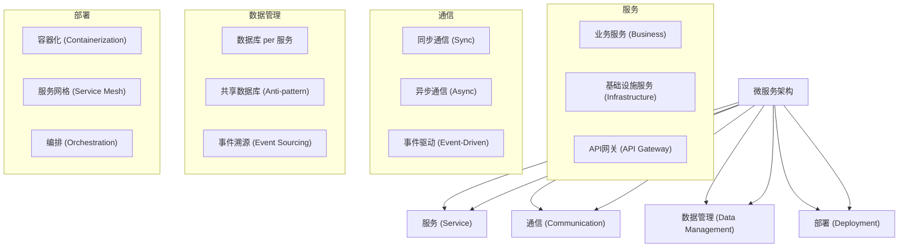

# 微服务架构基础 (Microservice Architecture Foundation)

## 目录

- [微服务架构基础 (Microservice Architecture Foundation)](#微服务架构基础-microservice-architecture-foundation)
  - [目录](#目录)
  - [1. 概述](#1-概述)
    - [1.1 定义](#11-定义)
    - [1.2 核心概念](#12-核心概念)
    - [1.3 架构特征](#13-架构特征)
  - [2. 形式化定义](#2-形式化定义)
    - [2.1 基本定义](#21-基本定义)
    - [2.2 形式化规范](#22-形式化规范)
    - [2.3 通信模式定义](#23-通信模式定义)
  - [3. 数学基础](#3-数学基础)
    - [3.1 图论基础](#31-图论基础)
    - [3.2 网络理论](#32-网络理论)
    - [3.3 队列理论](#33-队列理论)
  - [4. 设计原则](#4-设计原则)
    - [4.1 微服务设计原则](#41-微服务设计原则)
    - [4.2 架构设计原则](#42-架构设计原则)
  - [5. Go语言实现](#5-go语言实现)
    - [5.1 基础微服务框架](#51-基础微服务框架)
    - [5.2 泛型微服务框架](#52-泛型微服务框架)
  - [6. 微服务模式](#6-微服务模式)
    - [6.1 服务发现模式](#61-服务发现模式)
    - [6.2 熔断器模式](#62-熔断器模式)
    - [6.3 事件溯源模式](#63-事件溯源模式)
  - [7. 性能分析](#7-性能分析)
    - [7.1 时间复杂度](#71-时间复杂度)
    - [7.2 空间复杂度](#72-空间复杂度)
    - [7.3 性能优化建议](#73-性能优化建议)
  - [8. 最佳实践](#8-最佳实践)
    - [8.1 设计原则](#81-设计原则)
    - [8.2 实现建议](#82-实现建议)
    - [8.3 部署策略](#83-部署策略)
  - [9. 相关模式](#9-相关模式)
    - [9.1 服务网格模式](#91-服务网格模式)
    - [9.2 事件驱动架构](#92-事件驱动架构)
    - [9.3 容器编排](#93-容器编排)
  - [10. 总结](#10-总结)
    - [10.1 优势](#101-优势)
    - [10.2 挑战](#102-挑战)
    - [10.3 发展趋势](#103-发展趋势)
    - [10.4 数学总结](#104-数学总结)

---

## 1. 概述

### 1.1 定义

微服务架构是一种将应用程序构建为一组小型、独立服务的架构风格。每个服务运行在自己的进程中，通过轻量级机制（通常是HTTP API）进行通信。

### 1.2 核心概念



### 1.3 架构特征

- **服务独立性**: 每个服务可以独立开发、部署和扩展。
- **技术多样性**: 不同服务可以使用不同的技术栈。
- **数据自治**: 每个服务管理自己的数据。
- **故障隔离**: 单个服务故障不影响整个系统。

---

## 2. 形式化定义

### 2.1 基本定义

设 $\mathcal{S}$ 为服务集合，$\mathcal{C}$ 为通信通道集合，$\mathcal{D}$ 为数据存储集合。

**定义 2.1 (微服务)**
微服务是一个五元组 $(\mathcal{I}, \mathcal{O}, S, D, \mathcal{B})$，其中：

- $\mathcal{I} = \{I_1, I_2, \ldots, I_n\}$ 是输入接口集合
- $\mathcal{O} = \{O_1, O_2, \ldots, O_m\}$ 是输出接口集合
- $S$ 是服务状态
- $D$ 是数据存储
- $\mathcal{B}$ 是业务逻辑

**定义 2.2 (微服务架构)**
微服务架构是一个四元组 $(\mathcal{S}, C, \mathcal{G}, \mathcal{R})$，其中：

- $\mathcal{S} = \{S_1, S_2, \ldots, S_n\}$ 是服务集合
- $C \subseteq \mathcal{S} \times \mathcal{S}$ 是通信关系
- $\mathcal{G}: \mathcal{S} \rightarrow \mathcal{S}^*$ 是网关路由函数
- $\mathcal{R}: \mathcal{S} \times \mathcal{S} \rightarrow C$ 是注册发现函数

### 2.2 形式化规范

**公理 2.1 (服务独立性)**
对于任意服务 $S_i, S_j \in \mathcal{S}$：
$$
\text{independent}(S_i, S_j) \iff C(S_i, S_j) = \emptyset
$$

**公理 2.2 (数据自治)**
对于任意服务 $S \in \mathcal{S}$：
$$
\text{autonomous}(S) \iff D(S) \cap \bigcup_{S' \in \mathcal{S} \setminus \{S\}} D(S') = \emptyset
$$

### 2.3 通信模式定义

**定义 2.3 (通信模式)**
通信模式是一个三元组 $(\mathcal{M}, \mathcal{P}, \mathcal{Q})$，其中：

- $\mathcal{M} = \{\text{sync}, \text{async}, \text{event}\}$ 是消息类型集合
- $\mathcal{P}: \mathcal{S} \times \mathcal{S} \rightarrow \mathcal{M}$ 是协议映射函数
- $\mathcal{Q}: \mathcal{M} \rightarrow \mathbb{R}^+$ 是服务质量函数

---

## 3. 数学基础

### 3.1 图论基础

**定理 3.1 (服务依赖图)**
设 $G = (V, E)$ 为服务依赖图，其中 $V = \mathcal{S}$ 是服务集合，$E = C$ 是通信关系，则图的**环路复杂度 (Cyclomatic Complexity)** 是衡量其可测试性和可维护性的一个指标。对于强连通图，它可以简化为：
$$
\text{complexity}(G) = |E| - |V| + 1
$$
一个更简单的耦合度量是 **平均度 (Average Degree)**：
$$
\text{avg_degree}(G) = \frac{2|E|}{|V|}
$$

### 3.2 网络理论

**定理 3.2 (服务网络容量 - 最大流最小割定理)**
设 $N$ 为服务网络，其容量 $C$ 受限于网络中的瓶颈（最小割）。网络的最大吞吐量等于源和汇之间的最大流，等于最小割的容量。
$$
\text{Max-Flow}(s, t) = \text{Min-Cut}(s, t)
$$
在微服务中，这意味着整个系统的吞吐量受限于最薄弱的通信链路或服务处理能力。

### 3.3 队列理论

**定理 3.3 (服务响应时间 - Little's Law)**
设 $\lambda$ 为请求平均到达率， $W$ 为请求在系统中的平均等待时间， $L$ 为系统中的平均请求数，则它们的关系为：
$$
L = \lambda W
$$
对于一个M/M/1排队系统（泊松到达，指数服务时间，单个服务器），平均响应时间 $T$ 为：
$$
T = \frac{1}{\mu - \lambda}
$$
其中 $\mu$ 是平均服务率。这表明当请求到达率 $\lambda$ 接近服务率 $\mu$ 时，响应时间会急剧增加。

---

## 4. 设计原则

### 4.1 微服务设计原则

- **单一职责原则 (SRP)**: 每个服务只负责一个业务能力。
- **服务自治原则**: 服务应该能够独立开发、部署、扩展和管理。
- **数据隔离原则**: 每个服务拥有并管理自己的数据。

### 4.2 架构设计原则

- **去中心化治理**: 技术选型和决策应分散到各个团队。
- **围绕业务能力构建**: 服务划分应基于业务领域而非技术分层。
- **容错设计**: 系统应设计为能够容忍服务故障。

---

## 5. Go语言实现

### 5.1 基础微服务框架

```go
package micro

import (
    "net/http"
    "log"
)

// Service 定义微服务接口
type Service interface {
    Start() error
    Stop() error
    Handle(w http.ResponseWriter, r *http.Request)
}

// BaseService 提供基础实现
type BaseService struct {
    Name    string
    Address string
}

func (s *BaseService) Start() error {
    log.Printf("%s starting on %s", s.Name, s.Address)
    http.HandleFunc("/", s.Handle)
    return http.ListenAndServe(s.Address, nil)
}

func (s *BaseService) Stop() error {
    log.Printf("%s stopping", s.Name)
    return nil // 实际中需要更优雅的关闭
}

func (s *BaseService) Handle(w http.ResponseWriter, r *http.Request) {
    w.Write([]byte("Hello from " + s.Name))
}
```

### 5.2 泛型微服务框架

使用Go 1.18+的泛型，我们可以构建更通用的服务框架。

```go
package micro

// Request 定义通用请求结构
type Request[T any] struct {
    Data T
}

// Response 定义通用响应结构
type Response[T any] struct {
    Result T
    Error  error
}

// GenericHandler 定义泛型处理函数
type GenericHandler[ReqT any, ResT any] func(Request[ReqT]) Response[ResT]

// CreateHTTPHandler 将泛型处理函数包装为http.HandlerFunc
func CreateHTTPHandler[ReqT any, ResT any](handler GenericHandler[ReqT, ResT]) http.HandlerFunc {
    return func(w http.ResponseWriter, r *http.Request) {
        // 1. 反序列化请求
        var req Request[ReqT]
        // ... json.NewDecoder(r.Body).Decode(&req)

        // 2. 调用业务逻辑
        res := handler(req)

        // 3. 序列化响应
        // ... json.NewEncoder(w).Encode(res)
    }
}
```

---

## 6. 微服务模式

### 6.1 服务发现模式

- **客户端发现**: 客户端查询服务注册表以找到服务实例。
- **服务端发现**: 路由器/API网关查询注册表并转发请求。

### 6.2 熔断器模式

防止因重复尝试调用失败服务而导致的级联故障。

### 6.3 事件溯源模式

将所有状态更改持久化为一系列事件，而不是直接更新状态。

---

## 7. 性能分析

### 7.1 时间复杂度

- **调用链延迟**: $T_{\text{total}} = \sum_{i=1}^{n} T_i$ (串行) 或 $\max(T_1, T_2, ..., T_n)$ (并行)。
- **网络开销**: 额外的序列化/反序列化和网络传输时间。

### 7.2 空间复杂度

- **服务内存**: 每个服务实例都需要自己的内存空间。
- **数据冗余**: 数据可能在多个服务中被缓存或复制。

### 7.3 性能优化建议

- **异步通信**: 使用消息队列解耦服务，提高吞吐量。
- **缓存**: 在API网关或服务内部缓存常用数据。
- **本地化**: 将频繁通信的服务部署在一起以减少网络延迟。

---

## 8. 最佳实践

### 8.1 设计原则

- **限界上下文 (Bounded Context)**: 使用DDD的限界上下文来定义服务边界。
- **API优先**: 先设计服务的API契约，再进行实现。

### 8.2 实现建议

- **健康检查**: 实现`/health`端点以报告服务状态。
- **配置外化**: 将配置与代码分离。

### 8.3 部署策略

- **蓝绿部署**: 维护两个生产环境，实现零停机切换。
- **金丝雀发布**: 将一小部分流量引导到新版本，验证后再全面推广。

---

## 9. 相关模式

### 9.1 服务网格模式

使用Sidecar代理来处理服务间通信、监控和安全。

### 9.2 事件驱动架构

服务通过发布和订阅事件进行异步通信。

### 9.3 容器编排

使用Kubernetes或Nomad等工具自动化部署、扩展和管理容器化服务。

---

## 10. 总结

### 10.1 优势

- **技术灵活性**
- **可扩展性**
- **容错性**
- **团队自治**

### 10.2 挑战

- **分布式系统复杂性**
- **数据一致性**
- **运维开销**
- **端到端测试**

### 10.3 发展趋势

- **Serverless微服务**
- **gRPC和HTTP/3的应用**
- **Dapr等分布式应用运行时的兴起**

### 10.4 数学总结

微服务架构将一个大型的、复杂的系统分解为多个更小、更易于管理的子系统。从数学角度看，这是将一个复杂的优化问题（整体优化）分解为多个局部优化问题。虽然局部最优解的合集不一定等于全局最优解，但这种分解极大地降低了问题的求解难度和管理成本。图论、网络流理论和排队论为我们分析和优化这些分布式系统提供了强大的数学工具。 