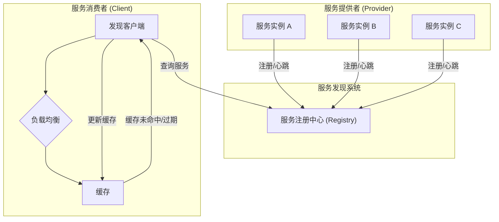

# 服务发现 (Service Discovery)

## 目录

- [服务发现 (Service Discovery)](#服务发现-service-discovery)
  - [目录](#目录)
  - [1. 概述](#1-概述)
    - [1.1 设计原则](#11-设计原则)
    - [1.2 架构模式](#12-架构模式)
  - [2. 形式化定义](#2-形式化定义)
    - [2.1 服务发现系统](#21-服务发现系统)
    - [2.2 服务状态](#22-服务状态)
    - [2.3 一致性模型](#23-一致性模型)
  - [3. 服务注册](#3-服务注册)
    - [3.1 注册接口](#31-注册接口)
    - [3.2 注册实现](#32-注册实现)
  - [4. 服务发现](#4-服务发现)
    - [4.1 发现接口](#41-发现接口)
    - [4.2 服务缓存](#42-服务缓存)
  - [5. 健康检查](#5-健康检查)
    - [5.1 健康检查接口](#51-健康检查接口)
  - [6. 负载均衡](#6-负载均衡)
    - [6.1 负载均衡接口](#61-负载均衡接口)
  - [7. 故障转移](#7-故障转移)
    - [7.1 故障转移策略](#71-故障转移策略)
  - [8. Go语言实现](#8-go语言实现)
    - [8.1 服务发现管理器](#81-服务发现管理器)
    - [8.2 使用示例](#82-使用示例)
  - [9. 应用场景](#9-应用场景)
    - [9.1 微服务架构](#91-微服务架构)
    - [9.2 容器编排](#92-容器编排)
  - [10. 总结](#10-总结)
    - [10.1 核心特性](#101-核心特性)
    - [10.2 技术优势](#102-技术优势)
    - [10.3 应用价值](#103-应用价值)

---

## 1. 概述

服务发现是微服务架构中的核心组件，负责服务的动态注册、发现、健康检查和负载均衡。它解决了分布式系统中服务实例地址不固定、动态变化的根本问题。

### 1.1 设计原则

1.  **高可用性**: 服务发现系统本身必须是高可用的，避免单点故障。
2.  **一致性**: 确保客户端获取的服务信息是准确的，通常在可用性和一致性之间做权衡（CAP定理）。
3.  **实时性**: 能够快速反映服务实例的状态变化（上线、下线、不健康）。
4.  **可扩展性**: 支持大规模服务集群的注册与发现请求。
5.  **容错性**: 客户端应具备容错能力，如本地缓存，以应对服务发现系统的短暂不可用。

### 1.2 架构模式



---

## 2. 形式化定义

### 2.1 服务发现系统

**定义 2.1 (服务发现系统)**:
服务发现系统是一个五元组 $\Sigma = (S, R, D, H, L)$，其中：

- $S$ 是服务实例的集合。
- $R$ 是注册表 (Registry)，是一个从服务ID到服务实例信息的映射。
- $D$ 是发现器 (Discoverer)，提供查询服务实例的接口。
- $H$ 是健康检查器 (Health Checker)，监控服务实例的健康状态。
- $L$ 是负载均衡器 (Load Balancer)，在多个健康实例中选择一个。

**定义 2.2 (服务实例)**:
服务实例是一个六元组 $s = (\text{id}, \text{name}, \text{address}, \text{port}, \text{metadata}, \text{status})$。

### 2.2 服务状态

**定义 2.3 (服务状态)**:
服务状态集合 $\text{Status} = \{\text{UP, DOWN, STARTING, OUT_OF_SERVICE}\}$。

**定义 2.4 (状态转换)**:
状态转换函数 $\delta: \text{Status} \times \text{Event} \to \text{Status}$，例如：
$$
\delta(\text{UP, health_check_fail}) = \text{DOWN}
$$
$$
\delta(\text{DOWN, health_check_pass}) = \text{UP}
$$

### 2.3 一致性模型

**定义 2.5 (最终一致性)**:
对于任意两个节点 $n_1, n_2$，存在一个时间点 $t$ 之后，对于任意服务 $s \in S$，它们查询到的信息是相同的。
$$
\forall s \in S, \exists t_0, \forall t > t_0 : \text{lookup}(n_1, s, t) = \text{lookup}(n_2, s, t)
$$

**定理 2.1 (CAP定理)**:
在分布式服务发现系统中（如etcd, Consul集群），最多只能同时满足**一致性 (Consistency)**、**可用性 (Availability)** 和 **分区容错性 (Partition tolerance)** 中的两个。大多数服务发现系统选择AP（如Eureka）或CP（如etcd, Zookeeper）。

---

## 3. 服务注册

### 3.1 注册接口

```go
package discovery

import "time"

// ServiceRegistry 服务注册接口
type ServiceRegistry interface {
    Register(service *Service) error
    Deregister(serviceID string) error
    Update(service *Service) error
    GetService(serviceID string) (*Service, error)
    ListServices(serviceName string) ([]*Service, error)
    Watch(serviceName string) (<-chan *ServiceEvent, error)
}

// Service 服务实例定义
type Service struct {
    ID       string            `json:"id"`
    Name     string            `json:"name"`
    Address  string            `json:"address"`
    Port     int               `json:"port"`
    Metadata map[string]string `json:"metadata"`
    Status   ServiceStatus     `json:"status"`
    LastHeartbeat time.Time    `json:"last_heartbeat"`
}

type ServiceStatus int

const (
    StatusStarting ServiceStatus = iota
    StatusUp
    StatusDown
    StatusOutOfService
)

// ServiceEvent 服务事件
type ServiceEvent struct {
    Type    ServiceEventType
    Service *Service
}

type ServiceEventType int

const (
    EventAdd ServiceEventType = iota
    EventUpdate
    EventDelete
)
```

### 3.2 注册实现 (Etcd)

```go
import (
    "context"
    "encoding/json"
    "go.etcd.io/etcd/clientv3"
)

// EtcdRegistry 基于Etcd的服务注册实现
type EtcdRegistry struct {
    client *clientv3.Client
    // ...
}

func (r *EtcdRegistry) Register(service *Service) error {
    // 序列化服务信息
    data, err := json.Marshal(service)
    if err != nil {
        return err
    }

    // 创建一个租约(lease)用于心跳
    lease, err := r.client.Grant(context.Background(), 30) // 30秒TTL
    if err != nil {
        return err
    }

    // 将服务信息与租约绑定并写入etcd
    key := "/services/" + service.Name + "/" + service.ID
    _, err = r.client.Put(context.Background(), key, string(data), clientv3.WithLease(lease.ID))
    if err != nil {
        return err
    }

    // 保持租约活跃 (心跳)
    go r.keepAlive(lease.ID)

    return nil
}

func (r *EtcdRegistry) keepAlive(leaseID clientv3.LeaseID) {
    ch, _ := r.client.KeepAlive(context.Background(), leaseID)
    for range ch {
        // 租约续期成功
    }
}
```

---

## 4. 服务发现

### 4.1 发现接口

```go
// ServiceDiscoverer 服务发现接口
type ServiceDiscoverer interface {
    Discover(serviceName string) ([]*Service, error)
    Watch(serviceName string) (<-chan []*Service, error)
}
```

### 4.2 服务缓存

客户端应缓存发现的服务列表，以提高性能并增加对注册中心故障的容忍度。当无法连接注册中心时，可使用缓存中的旧数据。

---

## 5. 健康检查

### 5.1 健康检查接口

```go
// HealthChecker 健康检查接口
type HealthChecker interface {
    Check(service *Service) (bool, error)
}

// TCPHealthChecker TCP端口健康检查
type TCPHealthChecker struct{}

func (c *TCPHealthChecker) Check(service *Service) (bool, error) {
    conn, err := net.DialTimeout("tcp", fmt.Sprintf("%s:%d", service.Address, service.Port), 2*time.Second)
    if err != nil {
        return false, err
    }
    conn.Close()
    return true, nil
}
```

---

## 6. 负载均衡

### 6.1 负载均衡接口

```go
// LoadBalancer 负载均衡接口
type LoadBalancer interface {
    Select(services []*Service) (*Service, error)
}
```

---

## 7. 故障转移

### 7.1 故障转移策略

当选定的服务实例调用失败时，应有策略进行重试或选择另一个实例。

- **重试**: 对同一个实例进行有限次数的重试。
- **选择下一个**: 立即从负载均衡器获取下一个可用实例。

---

## 8. Go语言实现

### 8.1 服务发现管理器

```go
// DiscoveryManager 集成服务发现、健康检查和负载均衡
type DiscoveryManager struct {
    registry   ServiceRegistry
    discoverer ServiceDiscoverer
    checker    HealthChecker
    balancer   LoadBalancer
    // ...
}
```

### 8.2 使用示例

```go
func main() {
    // 1. 初始化服务发现客户端
    discoverer, _ := NewEtcdDiscoverer(...)

    // 2. 发现服务
    services, _ := discoverer.Discover("user-service")

    // 3. 使用负载均衡器选择一个实例
    balancer := NewRoundRobinBalancer()
    selected, _ := balancer.Select(services)

    // 4. 调用服务
    fmt.Printf("Calling user-service at %s:%d\n", selected.Address, selected.Port)
}
```

---

## 9. 应用场景

### 9.1 微服务架构

服务发现是微服务架构的基石，使得服务之间可以解耦和动态扩展。

### 9.2 容器编排

Kubernetes等容器编排系统内置了强大的服务发现机制。`kube-dns`将Service名称解析为Cluster IP，再由`kube-proxy`通过iptables或IPVS将请求负载均衡到后端的Pod。

---

## 10. 总结

### 10.1 核心特性

- **动态性**: 适应服务实例的动态变化。
- **解耦**: 调用方无需硬编码服务地址。
- **弹性**: 结合健康检查和负载均衡，提升系统整体弹性。

### 10.2 技术优势

- 简化了分布式系统的配置管理。
- 支持服务的自动伸缩。
- 提高了系统的可用性和可靠性。

### 10.3 应用价值

服务发现是构建现代化、可扩展、高可用分布式系统的关键技术之一，是从单体架构迈向微服务架构的必备组件。 