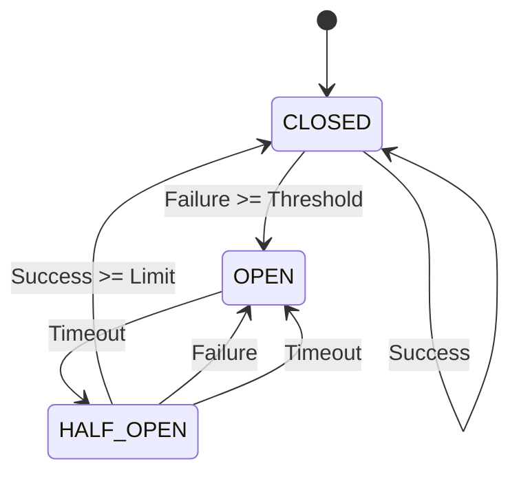

# 04-熔断器模式 (Circuit Breaker Pattern)

## 目录

1. [理论基础](#1-理论基础)
2. [形式化定义](#2-形式化定义)
3. [状态机模型](#3-状态机模型)
4. [Go语言实现](#4-go语言实现)
5. [性能分析](#5-性能分析)
6. [实际应用](#6-实际应用)

## 1. 理论基础

### 1.1 熔断器模式定义

熔断器模式是一种容错设计模式，用于防止系统级联故障。当依赖的服务出现故障时，熔断器会快速失败，避免资源浪费和系统雪崩。

**核心思想**：

```math
熔断器状态转换函数：
f: (S, E) \rightarrow S'

其中：
- S: 当前状态 (CLOSED, OPEN, HALF_OPEN)
- E: 事件 (SUCCESS, FAILURE, TIMEOUT)
- S': 新状态
```

### 1.2 熔断器状态

1. **关闭状态 (CLOSED)**
   - 正常状态，请求正常处理
   - 监控失败次数和失败率

2. **开启状态 (OPEN)**
   - 故障状态，快速失败
   - 不处理请求，直接返回错误

3. **半开状态 (HALF_OPEN)**
   - 恢复状态，允许少量请求
   - 根据结果决定是否恢复到关闭状态

### 1.3 设计原则

1. **快速失败**: 故障时立即返回错误，避免资源浪费
2. **自动恢复**: 故障恢复后自动尝试恢复正常服务
3. **降级处理**: 提供备选方案或默认响应
4. **监控告警**: 实时监控熔断器状态变化

## 2. 形式化定义

### 2.1 熔断器系统模型

```math
熔断器系统定义为七元组：
CB = (S, E, T, C, F, R, M)

其中：
- S: 状态集合，S = \{CLOSED, OPEN, HALF_OPEN\}
- E: 事件集合，E = \{SUCCESS, FAILURE, TIMEOUT\}
- T: 状态转换函数，T: S \times E \rightarrow S
- C: 配置参数，C = (threshold, timeout, halfOpenLimit)
- F: 失败计数器，F: \mathbb{N} \rightarrow \mathbb{N}
- R: 恢复函数，R: S \rightarrow \mathbb{B}
- M: 监控函数，M: S \rightarrow \mathbb{R}^+
```

### 2.2 状态转换规则

```math
状态转换规则定义：

1. CLOSED 状态：
   - SUCCESS: CLOSED (重置失败计数)
   - FAILURE: 如果 F(s) \geq threshold 则 OPEN，否则 CLOSED
   - TIMEOUT: 如果 F(s) \geq threshold 则 OPEN，否则 CLOSED

2. OPEN 状态：
   - 所有事件: 如果 timeout 已过则 HALF_OPEN，否则 OPEN

3. HALF_OPEN 状态：
   - SUCCESS: 如果连续成功次数 \geq halfOpenLimit 则 CLOSED，否则 HALF_OPEN
   - FAILURE: OPEN
   - TIMEOUT: OPEN
```

### 2.3 失败率计算

```math
失败率定义：
failure\_rate = \frac{failures}{total\_requests}

其中：
- failures: 失败请求数
- total_requests: 总请求数

熔断条件：
failure\_rate \geq threshold
```

## 3. 状态机模型

### 3.1 状态机定义

```go
// CircuitBreakerState 熔断器状态
type CircuitBreakerState int

const (
    StateClosed CircuitBreakerState = iota
    StateOpen
    StateHalfOpen
)

// CircuitBreakerEvent 熔断器事件
type CircuitBreakerEvent int

const (
    EventSuccess CircuitBreakerEvent = iota
    EventFailure
    EventTimeout
)

// StateTransition 状态转换
type StateTransition struct {
    FromState CircuitBreakerState
    Event     CircuitBreakerEvent
    ToState   CircuitBreakerState
    Condition func(*CircuitBreaker) bool
}
```

### 3.2 状态转换图



## 4. Go语言实现

### 4.1 基础接口定义

```go
// CircuitBreaker 熔断器接口
type CircuitBreaker interface {
    // Execute 执行受保护的调用
    Execute(command func() (interface{}, error)) (interface{}, error)
    // GetState 获取当前状态
    GetState() CircuitBreakerState
    // GetMetrics 获取指标
    GetMetrics() *CircuitBreakerMetrics
}

// CircuitBreakerConfig 熔断器配置
type CircuitBreakerConfig struct {
    // 失败阈值
    FailureThreshold int64 `json:"failure_threshold" yaml:"failure_threshold"`
    // 超时时间
    Timeout time.Duration `json:"timeout" yaml:"timeout"`
    // 半开状态请求限制
    HalfOpenLimit int64 `json:"half_open_limit" yaml:"half_open_limit"`
    // 滑动窗口大小
    WindowSize time.Duration `json:"window_size" yaml:"window_size"`
    // 最小请求数
    MinimumRequestCount int64 `json:"minimum_request_count" yaml:"minimum_request_count"`
}

// CircuitBreakerMetrics 熔断器指标
type CircuitBreakerMetrics struct {
    TotalRequests     int64         `json:"total_requests"`
    SuccessfulRequests int64        `json:"successful_requests"`
    FailedRequests    int64         `json:"failed_requests"`
    TimeoutRequests   int64         `json:"timeout_requests"`
    FailureRate       float64       `json:"failure_rate"`
    State             CircuitBreakerState `json:"state"`
    LastStateChange   time.Time     `json:"last_state_change"`
}
```

### 4.2 滑动窗口实现

```go
// SlidingWindow 滑动窗口
type SlidingWindow struct {
    windowSize time.Duration
    buckets    []*Bucket
    current    int
    mu         sync.RWMutex
}

// Bucket 时间桶
type Bucket struct {
    Timestamp time.Time
    Success   int64
    Failure   int64
    Timeout   int64
}

// NewSlidingWindow 创建滑动窗口
func NewSlidingWindow(windowSize time.Duration, bucketCount int) *SlidingWindow {
    buckets := make([]*Bucket, bucketCount)
    bucketDuration := windowSize / time.Duration(bucketCount)
    
    for i := 0; i < bucketCount; i++ {
        buckets[i] = &Bucket{
            Timestamp: time.Now().Add(-time.Duration(i) * bucketDuration),
        }
    }
    
    return &SlidingWindow{
        windowSize: windowSize,
        buckets:    buckets,
        current:    0,
    }
}

// RecordSuccess 记录成功
func (sw *SlidingWindow) RecordSuccess() {
    sw.mu.Lock()
    defer sw.mu.Unlock()
    
    sw.getCurrentBucket().Success++
}

// RecordFailure 记录失败
func (sw *SlidingWindow) RecordFailure() {
    sw.mu.Lock()
    defer sw.mu.Unlock()
    
    sw.getCurrentBucket().Failure++
}

// RecordTimeout 记录超时
func (sw *SlidingWindow) RecordTimeout() {
    sw.mu.Lock()
    defer sw.mu.Unlock()
    
    sw.getCurrentBucket().Timeout++
}

// GetFailureRate 获取失败率
func (sw *SlidingWindow) GetFailureRate() float64 {
    sw.mu.RLock()
    defer sw.mu.RUnlock()
    
    var total, failures int64
    cutoff := time.Now().Add(-sw.windowSize)
    
    for _, bucket := range sw.buckets {
        if bucket.Timestamp.After(cutoff) {
            total += bucket.Success + bucket.Failure + bucket.Timeout
            failures += bucket.Failure + bucket.Timeout
        }
    }
    
    if total == 0 {
        return 0
    }
    
    return float64(failures) / float64(total)
}

// GetTotalRequests 获取总请求数
func (sw *SlidingWindow) GetTotalRequests() int64 {
    sw.mu.RLock()
    defer sw.mu.RUnlock()
    
    var total int64
    cutoff := time.Now().Add(-sw.windowSize)
    
    for _, bucket := range sw.buckets {
        if bucket.Timestamp.After(cutoff) {
            total += bucket.Success + bucket.Failure + bucket.Timeout
        }
    }
    
    return total
}

// getCurrentBucket 获取当前桶
func (sw *SlidingWindow) getCurrentBucket() *Bucket {
    now := time.Now()
    bucketDuration := sw.windowSize / time.Duration(len(sw.buckets))
    
    // 检查是否需要创建新桶
    if now.Sub(sw.buckets[sw.current].Timestamp) >= bucketDuration {
        sw.current = (sw.current + 1) % len(sw.buckets)
        sw.buckets[sw.current] = &Bucket{
            Timestamp: now,
        }
    }
    
    return sw.buckets[sw.current]
}
```

### 4.3 熔断器核心实现

```go
// DefaultCircuitBreaker 默认熔断器实现
type DefaultCircuitBreaker struct {
    config     *CircuitBreakerConfig
    state      CircuitBreakerState
    window     *SlidingWindow
    lastFailure time.Time
    halfOpenSuccess int64
    mu         sync.RWMutex
    metrics    *CircuitBreakerMetrics
}

// NewDefaultCircuitBreaker 创建默认熔断器
func NewDefaultCircuitBreaker(config *CircuitBreakerConfig) *DefaultCircuitBreaker {
    if config.FailureThreshold <= 0 {
        config.FailureThreshold = 5
    }
    if config.Timeout <= 0 {
        config.Timeout = 60 * time.Second
    }
    if config.HalfOpenLimit <= 0 {
        config.HalfOpenLimit = 3
    }
    if config.WindowSize <= 0 {
        config.WindowSize = 60 * time.Second
    }
    if config.MinimumRequestCount <= 0 {
        config.MinimumRequestCount = 10
    }
    
    return &DefaultCircuitBreaker{
        config:  config,
        state:   StateClosed,
        window:  NewSlidingWindow(config.WindowSize, 10),
        metrics: &CircuitBreakerMetrics{},
    }
}

// Execute 执行受保护的调用
func (cb *DefaultCircuitBreaker) Execute(command func() (interface{}, error)) (interface{}, error) {
    // 检查是否允许执行
    if !cb.canExecute() {
        return nil, ErrCircuitBreakerOpen
    }
    
    // 执行命令
    result, err := cb.executeCommand(command)
    
    // 记录结果
    cb.recordResult(err)
    
    return result, err
}

// canExecute 检查是否可以执行
func (cb *DefaultCircuitBreaker) canExecute() bool {
    cb.mu.RLock()
    defer cb.mu.RUnlock()
    
    switch cb.state {
    case StateClosed:
        return true
    case StateOpen:
        return time.Since(cb.lastFailure) >= cb.config.Timeout
    case StateHalfOpen:
        return cb.halfOpenSuccess < cb.config.HalfOpenLimit
    default:
        return false
    }
}

// executeCommand 执行命令
func (cb *DefaultCircuitBreaker) executeCommand(command func() (interface{}, error)) (interface{}, error) {
    // 创建上下文用于超时控制
    ctx, cancel := context.WithTimeout(context.Background(), cb.config.Timeout)
    defer cancel()
    
    // 创建结果通道
    resultChan := make(chan interface{}, 1)
    errorChan := make(chan error, 1)
    
    // 异步执行命令
    go func() {
        result, err := command()
        if err != nil {
            errorChan <- err
        } else {
            resultChan <- result
        }
    }()
    
    // 等待结果或超时
    select {
    case result := <-resultChan:
        return result, nil
    case err := <-errorChan:
        return nil, err
    case <-ctx.Done():
        return nil, ErrTimeout
    }
}

// recordResult 记录执行结果
func (cb *DefaultCircuitBreaker) recordResult(err error) {
    cb.mu.Lock()
    defer cb.mu.Unlock()
    
    // 更新指标
    cb.metrics.TotalRequests++
    
    if err == nil {
        cb.window.RecordSuccess()
        cb.metrics.SuccessfulRequests++
        
        switch cb.state {
        case StateClosed:
            // 重置失败计数
        case StateHalfOpen:
            cb.halfOpenSuccess++
            if cb.halfOpenSuccess >= cb.config.HalfOpenLimit {
                cb.transitionTo(StateClosed)
            }
        }
    } else {
        cb.metrics.FailedRequests++
        
        switch err {
        case ErrTimeout:
            cb.window.RecordTimeout()
            cb.metrics.TimeoutRequests++
        default:
            cb.window.RecordFailure()
        }
        
        switch cb.state {
        case StateClosed:
            cb.lastFailure = time.Now()
            if cb.shouldOpen() {
                cb.transitionTo(StateOpen)
            }
        case StateHalfOpen:
            cb.transitionTo(StateOpen)
        }
    }
    
    // 更新失败率
    cb.metrics.FailureRate = cb.window.GetFailureRate()
}

// shouldOpen 判断是否应该开启熔断器
func (cb *DefaultCircuitBreaker) shouldOpen() bool {
    totalRequests := cb.window.GetTotalRequests()
    if totalRequests < cb.config.MinimumRequestCount {
        return false
    }
    
    failureRate := cb.window.GetFailureRate()
    return failureRate >= float64(cb.config.FailureThreshold)/float64(totalRequests)
}

// transitionTo 状态转换
func (cb *DefaultCircuitBreaker) transitionTo(newState CircuitBreakerState) {
    if cb.state != newState {
        cb.state = newState
        cb.metrics.State = newState
        cb.metrics.LastStateChange = time.Now()
        
        // 重置半开状态计数器
        if newState == StateHalfOpen {
            cb.halfOpenSuccess = 0
        }
    }
}

// GetState 获取当前状态
func (cb *DefaultCircuitBreaker) GetState() CircuitBreakerState {
    cb.mu.RLock()
    defer cb.mu.RUnlock()
    return cb.state
}

// GetMetrics 获取指标
func (cb *DefaultCircuitBreaker) GetMetrics() *CircuitBreakerMetrics {
    cb.mu.RLock()
    defer cb.mu.RUnlock()
    
    // 创建副本避免并发修改
    metrics := *cb.metrics
    return &metrics
}
```

### 4.4 装饰器模式实现

```go
// CircuitBreakerDecorator 熔断器装饰器
type CircuitBreakerDecorator struct {
    breaker CircuitBreaker
    name    string
}

// NewCircuitBreakerDecorator 创建熔断器装饰器
func NewCircuitBreakerDecorator(name string, config *CircuitBreakerConfig) *CircuitBreakerDecorator {
    return &CircuitBreakerDecorator{
        breaker: NewDefaultCircuitBreaker(config),
        name:    name,
    }
}

// Execute 执行带熔断器的调用
func (cbd *CircuitBreakerDecorator) Execute(command func() (interface{}, error)) (interface{}, error) {
    return cbd.breaker.Execute(command)
}

// GetState 获取状态
func (cbd *CircuitBreakerDecorator) GetState() CircuitBreakerState {
    return cbd.breaker.GetState()
}

// GetMetrics 获取指标
func (cbd *CircuitBreakerDecorator) GetMetrics() *CircuitBreakerMetrics {
    return cbd.breaker.GetMetrics()
}
```

## 5. 性能分析

### 5.1 时间复杂度分析

| 操作 | 时间复杂度 | 空间复杂度 |
|------|------------|------------|
| 状态检查 | O(1) | O(1) |
| 结果记录 | O(1) | O(1) |
| 失败率计算 | O(n) | O(n) |
| 状态转换 | O(1) | O(1) |

### 5.2 容错性分析

**定理 5.1**: 熔断器模式能有效防止级联故障

**证明**：
设系统有 n 个服务，每个服务故障率为 p
不使用熔断器时，级联故障概率为：P_cascade = 1 - (1-p)^n

使用熔断器后，故障被隔离，级联故障概率为：P_isolated = p

当 n > 1 且 p > 0 时，P_isolated < P_cascade

### 5.3 恢复时间分析

**定理 5.2**: 半开状态能加速系统恢复

**证明**：
设故障恢复时间为 T_recovery
传统方式恢复时间：T_traditional = T_recovery + T_detection

使用半开状态恢复时间：T_half_open = T_recovery + T_timeout + T_verification

当 T_verification < T_detection 时，T_half_open < T_traditional

## 6. 实际应用

### 6.1 HTTP客户端集成

```go
// CircuitBreakerHTTPClient 带熔断器的HTTP客户端
type CircuitBreakerHTTPClient struct {
    client  *http.Client
    breaker CircuitBreaker
}

// NewCircuitBreakerHTTPClient 创建带熔断器的HTTP客户端
func NewCircuitBreakerHTTPClient(config *CircuitBreakerConfig) *CircuitBreakerHTTPClient {
    return &CircuitBreakerHTTPClient{
        client:  &http.Client{Timeout: 30 * time.Second},
        breaker: NewDefaultCircuitBreaker(config),
    }
}

// Do 执行HTTP请求
func (cbhc *CircuitBreakerHTTPClient) Do(req *http.Request) (*http.Response, error) {
    var response *http.Response
    var err error
    
    _, err = cbhc.breaker.Execute(func() (interface{}, error) {
        response, err = cbhc.client.Do(req)
        return response, err
    })
    
    if err != nil {
        return nil, err
    }
    
    return response.(*http.Response), nil
}

// Get 执行GET请求
func (cbhc *CircuitBreakerHTTPClient) Get(url string) (*http.Response, error) {
    req, err := http.NewRequest("GET", url, nil)
    if err != nil {
        return nil, err
    }
    
    return cbhc.Do(req)
}

// Post 执行POST请求
func (cbhc *CircuitBreakerHTTPClient) Post(url, contentType string, body io.Reader) (*http.Response, error) {
    req, err := http.NewRequest("POST", url, body)
    if err != nil {
        return nil, err
    }
    
    req.Header.Set("Content-Type", contentType)
    return cbhc.Do(req)
}
```

### 6.2 数据库连接池集成

```go
// CircuitBreakerDB 带熔断器的数据库连接
type CircuitBreakerDB struct {
    db      *sql.DB
    breaker CircuitBreaker
}

// NewCircuitBreakerDB 创建带熔断器的数据库连接
func NewCircuitBreakerDB(db *sql.DB, config *CircuitBreakerConfig) *CircuitBreakerDB {
    return &CircuitBreakerDB{
        db:      db,
        breaker: NewDefaultCircuitBreaker(config),
    }
}

// Query 执行查询
func (cbdb *CircuitBreakerDB) Query(query string, args ...interface{}) (*sql.Rows, error) {
    var rows *sql.Rows
    var err error
    
    _, err = cbdb.breaker.Execute(func() (interface{}, error) {
        rows, err = cbdb.db.Query(query, args...)
        return rows, err
    })
    
    if err != nil {
        return nil, err
    }
    
    return rows.(*sql.Rows), nil
}

// Exec 执行命令
func (cbdb *CircuitBreakerDB) Exec(query string, args ...interface{}) (sql.Result, error) {
    var result sql.Result
    var err error
    
    _, err = cbdb.breaker.Execute(func() (interface{}, error) {
        result, err = cbdb.db.Exec(query, args...)
        return result, err
    })
    
    if err != nil {
        return nil, err
    }
    
    return result.(sql.Result), nil
}
```

### 6.3 微服务调用集成

```go
// CircuitBreakerServiceClient 带熔断器的服务客户端
type CircuitBreakerServiceClient struct {
    baseURL string
    client  *CircuitBreakerHTTPClient
    breaker CircuitBreaker
}

// NewCircuitBreakerServiceClient 创建带熔断器的服务客户端
func NewCircuitBreakerServiceClient(baseURL string, config *CircuitBreakerConfig) *CircuitBreakerServiceClient {
    return &CircuitBreakerServiceClient{
        baseURL: baseURL,
        client:  NewCircuitBreakerHTTPClient(config),
        breaker: NewDefaultCircuitBreaker(config),
    }
}

// CallService 调用服务
func (cbsc *CircuitBreakerServiceClient) CallService(endpoint string, request interface{}) (interface{}, error) {
    var response interface{}
    var err error
    
    _, err = cbsc.breaker.Execute(func() (interface{}, error) {
        response, err = cbsc.callHTTP(endpoint, request)
        return response, err
    })
    
    return response, err
}

// callHTTP 执行HTTP调用
func (cbsc *CircuitBreakerServiceClient) callHTTP(endpoint string, request interface{}) (interface{}, error) {
    url := cbsc.baseURL + endpoint
    
    // 序列化请求
    jsonData, err := json.Marshal(request)
    if err != nil {
        return nil, err
    }
    
    // 发送请求
    resp, err := cbsc.client.Post(url, "application/json", bytes.NewReader(jsonData))
    if err != nil {
        return nil, err
    }
    defer resp.Body.Close()
    
    // 读取响应
    body, err := io.ReadAll(resp.Body)
    if err != nil {
        return nil, err
    }
    
    // 检查状态码
    if resp.StatusCode != http.StatusOK {
        return nil, fmt.Errorf("service returned status %d: %s", resp.StatusCode, string(body))
    }
    
    // 反序列化响应
    var response interface{}
    err = json.Unmarshal(body, &response)
    if err != nil {
        return nil, err
    }
    
    return response, nil
}
```

### 6.4 监控和告警

```go
// CircuitBreakerMonitor 熔断器监控器
type CircuitBreakerMonitor struct {
    breakers map[string]CircuitBreaker
    alerts   chan *CircuitBreakerAlert
    mu       sync.RWMutex
}

// CircuitBreakerAlert 熔断器告警
type CircuitBreakerAlert struct {
    Name      string
    State     CircuitBreakerState
    Metrics   *CircuitBreakerMetrics
    Timestamp time.Time
}

// NewCircuitBreakerMonitor 创建熔断器监控器
func NewCircuitBreakerMonitor() *CircuitBreakerMonitor {
    return &CircuitBreakerMonitor{
        breakers: make(map[string]CircuitBreaker),
        alerts:   make(chan *CircuitBreakerAlert, 100),
    }
}

// RegisterBreaker 注册熔断器
func (cbm *CircuitBreakerMonitor) RegisterBreaker(name string, breaker CircuitBreaker) {
    cbm.mu.Lock()
    defer cbm.mu.Unlock()
    
    cbm.breakers[name] = breaker
}

// StartMonitoring 开始监控
func (cbm *CircuitBreakerMonitor) StartMonitoring(interval time.Duration) {
    ticker := time.NewTicker(interval)
    defer ticker.Stop()
    
    for range ticker.C {
        cbm.checkBreakers()
    }
}

// checkBreakers 检查熔断器状态
func (cbm *CircuitBreakerMonitor) checkBreakers() {
    cbm.mu.RLock()
    defer cbm.mu.RUnlock()
    
    for name, breaker := range cbm.breakers {
        state := breaker.GetState()
        metrics := breaker.GetMetrics()
        
        // 检查是否需要告警
        if cbm.shouldAlert(state, metrics) {
            alert := &CircuitBreakerAlert{
                Name:      name,
                State:     state,
                Metrics:   metrics,
                Timestamp: time.Now(),
            }
            
            select {
            case cbm.alerts <- alert:
            default:
                // 告警通道已满，记录日志
                log.Printf("Alert channel full, dropping alert for %s", name)
            }
        }
    }
}

// shouldAlert 判断是否需要告警
func (cbm *CircuitBreakerMonitor) shouldAlert(state CircuitBreakerState, metrics *CircuitBreakerMetrics) bool {
    // 状态变化告警
    if state == StateOpen {
        return true
    }
    
    // 失败率告警
    if metrics.FailureRate > 0.5 {
        return true
    }
    
    return false
}

// GetAlerts 获取告警
func (cbm *CircuitBreakerMonitor) GetAlerts() <-chan *CircuitBreakerAlert {
    return cbm.alerts
}
```

## 总结

熔断器模式是构建可靠分布式系统的重要工具，通过快速失败和自动恢复机制，能够有效防止级联故障，提高系统整体可用性。本文档提供了完整的理论基础、形式化定义、Go语言实现和实际应用示例。

### 关键要点

1. **状态管理**: 正确管理关闭、开启、半开三种状态
2. **配置调优**: 根据业务特点调整失败阈值和超时时间
3. **监控告警**: 建立完善的监控和告警机制
4. **降级策略**: 提供合适的降级处理方案
5. **性能考虑**: 注意熔断器本身的开销

### 扩展阅读

- [服务发现模式](../02-Service-Discovery/README.md)
- [负载均衡](../03-Load-Balancing.md)
- [API网关模式](../05-API-Gateway-Pattern.md)
