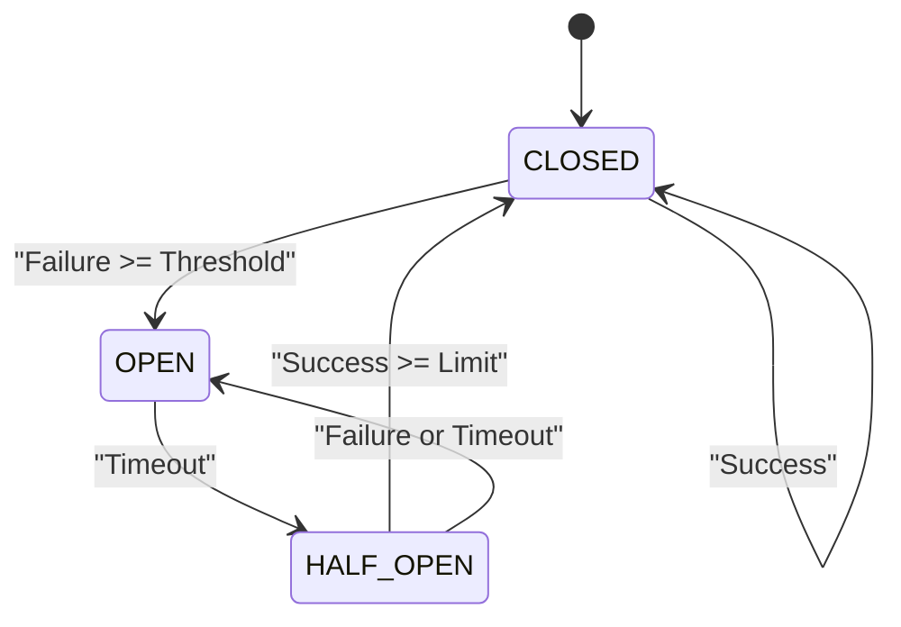

# 熔断器模式 (Circuit Breaker Pattern)

## 目录

- [熔断器模式 (Circuit Breaker Pattern)](#熔断器模式-circuit-breaker-pattern)
  - [目录](#目录)
  - [1. 理论基础](#1-理论基础)
    - [1.1 熔断器模式定义](#11-熔断器模式定义)
    - [1.2 熔断器状态](#12-熔断器状态)
    - [1.3 设计原则](#13-设计原则)
  - [2. 形式化定义](#2-形式化定义)
    - [2.1 熔断器系统模型](#21-熔断器系统模型)
    - [2.2 状态转换规则](#22-状态转换规则)
    - [2.3 失败率计算](#23-失败率计算)
  - [3. 状态机模型](#3-状态机模型)
    - [3.1 状态机定义](#31-状态机定义)
    - [3.2 状态转换图](#32-状态转换图)
  - [4. Go语言实现](#4-go语言实现)
    - [4.1 基础接口定义](#41-基础接口定义)
    - [4.2 滑动窗口实现](#42-滑动窗口实现)
  - [5. 性能分析](#5-性能分析)
  - [6. 实际应用](#6-实际应用)

---

## 1. 理论基础

### 1.1 熔断器模式定义

熔断器模式是一种容错设计模式，用于防止在分布式系统中因依赖服务故障而导致的级联失败。当对某个服务的调用持续失败时，熔断器会"跳闸"（打开），在一段时间内阻止后续的调用，从而让依赖的服务有时间恢复，并避免调用方耗尽资源。

**核心思想**：
熔断器的行为可以被建模为一个状态转换函数：
$$
f: (S, E) \to S'
$$
其中：
- $S$: 当前状态 (CLOSED, OPEN, HALF_OPEN)
- $E$: 事件 (SUCCESS, FAILURE, TIMEOUT)
- $S'$: 新状态

### 1.2 熔断器状态

1.  **关闭状态 (CLOSED)**
    -   正常状态，请求被允许通过。
    -   监控调用结果，统计失败次数或失败率。
    -   如果失败达到阈值，转换到开启状态。

2.  **开启状态 (OPEN)**
    -   故障状态，所有请求都会被立即拒绝（快速失败），而不会尝试调用依赖服务。
    -   经过一个预设的超时时间后，转换到半开状态。

3.  **半开状态 (HALF_OPEN)**
    -   恢复探测状态，允许有限数量的"探测"请求通过，以测试依赖服务是否已恢复。
    -   如果探测请求成功，则认为服务已恢复，转换到关闭状态。
    -   如果探测请求失败，则返回到开启状态，重新开始计时。

### 1.3 设计原则

1.  **快速失败**: 故障时立即返回错误，避免资源浪费和长时间等待。
2.  **自动恢复**: 故障恢复后自动尝试恢复正常服务，无需人工干预。
3.  **降级处理**: 在熔断期间，可以执行降级逻辑（Fallback），如返回缓存数据或默认值。
4.  **监控与告警**: 实时监控熔断器的状态变化，并在状态转换时发出告警。

---

## 2. 形式化定义

### 2.1 熔断器系统模型

一个熔断器系统可以形式化地定义为一个七元组：
$CB = (S, E, T, C, F, R, M)$

其中：
- $S$: 状态集合, $S = \{\text{CLOSED, OPEN, HALF_OPEN}\}$
- $E$: 事件集合, $E = \{\text{SUCCESS, FAILURE, TIMEOUT}\}$
- $T$: 状态转换函数, $T: S \times E \to S$
- $C$: 配置参数, $C = (\text{threshold}, \text{timeout}, \text{halfOpenLimit})$
- $F$: 失败计数器, $F: \mathbb{N} \to \mathbb{N}$
- $R$: 恢复函数, $R: S \to \mathbb{B}$
- $M$: 监控函数, $M: S \to \mathbb{R}^+$

### 2.2 状态转换规则

状态转换规则可以定义如下：

1.  **CLOSED 状态**:
    -   `SUCCESS`: 状态保持 `CLOSED`，重置失败计数。
    -   `FAILURE` 或 `TIMEOUT`: 失败计数加一。如果失败计数 $F(s) \ge \text{threshold}$，则状态转换为 `OPEN`。

2.  **OPEN 状态**:
    -   所有事件: 如果自进入 `OPEN` 状态以来经过的时间超过 `timeout`，则状态转换为 `HALF_OPEN`。否则，状态保持 `OPEN`。

3.  **HALF_OPEN 状态**:
    -   `SUCCESS`: 如果连续成功次数达到 `halfOpenLimit`，则状态转换为 `CLOSED`。否则，状态保持 `HALF_OPEN`。
    -   `FAILURE` 或 `TIMEOUT`: 状态立即转换回 `OPEN`。

### 2.3 失败率计算

在更复杂的实现中，会使用滑动窗口来计算失败率。
$$
\text{failure\_rate} = \frac{\text{failures}}{\text{total\_requests}}
$$
其中 `failures` 和 `total_requests` 是在特定时间窗口内统计的。

熔断条件：$\text{failure\_rate} \ge \text{threshold}$ 且 $\text{total\_requests} \ge \text{min\_requests}$

---

## 3. 状态机模型

### 3.1 状态机定义 (Go示例)

```go
// CircuitBreakerState 熔断器状态
type CircuitBreakerState int

const (
    StateClosed CircuitBreakerState = iota
    StateOpen
    StateHalfOpen
)

// CircuitBreakerEvent 熔断器事件
type CircuitBreakerEvent int

const (
    EventSuccess CircuitBreakerEvent = iota
    EventFailure
    EventTimeout
)

// StateTransition 定义了状态转换的逻辑
type StateTransition struct {
    FromState CircuitBreakerState
    Event     CircuitBreakerEvent
    ToState   CircuitBreakerState
    Condition func(*CircuitBreaker) bool
}
```

### 3.2 状态转换图



---

## 4. Go语言实现

### 4.1 基础接口定义

```go
package circuitbreaker

import "time"

// CircuitBreaker 熔断器接口
type CircuitBreaker interface {
    Execute(command func() (interface{}, error)) (interface{}, error)
    State() CircuitBreakerState
    Metrics() *Metrics
}

// Config 熔断器配置
type Config struct {
    FailureRateThreshold float64       // 失败率阈值 (例如 0.5 for 50%)
    Timeout              time.Duration // 从OPEN到HALF_OPEN的等待时间
    HalfOpenRequests     int           // HALF_OPEN状态下允许的请求数
    WindowSize           time.Duration // 滑动窗口大小
    MinRequests          int           // 窗口内触发熔断的最小请求数
}

// Metrics 熔断器指标
type Metrics struct {
    TotalRequests     int64
    SuccessfulRequests int64
    FailedRequests    int64
    CurrentState      CircuitBreakerState
    LastStateChange   time.Time
}
```

### 4.2 滑动窗口实现

滑动窗口是实现精确失败率统计的关键。

```go
package circuitbreaker

import "sync"

// SlidingWindow 滑动窗口
type SlidingWindow struct {
    windowSize time.Duration
    buckets    []*Bucket
    numBuckets int
    mu         sync.RWMutex
}

// Bucket 时间桶
type Bucket struct {
    Success int64
    Failure int64
}

// NewSlidingWindow 创建滑动窗口
func NewSlidingWindow(numBuckets int, windowSize time.Duration) *SlidingWindow {
    return &SlidingWindow{
        numBuckets: numBuckets,
        windowSize: windowSize,
        buckets:    make([]*Bucket, numBuckets),
    }
    // ... 需要一个goroutine来定期滚动窗口
}

// RecordSuccess 记录成功
func (sw *SlidingWindow) RecordSuccess() {
    sw.mu.Lock()
    defer sw.mu.Unlock()
    // ... 获取当前时间桶并增加成功计数
}

// RecordFailure 记录失败
func (sw *SlidingWindow) RecordFailure() {
    sw.mu.Lock()
    defer sw.mu.Unlock()
    // ... 获取当前时间桶并增加失败计数
}

// FailureRate 获取失败率
func (sw *SlidingWindow) FailureRate() float64 {
    sw.mu.RLock()
    defer sw.mu.RUnlock()

    var total, failures int64
    for _, bucket := range sw.buckets {
        if bucket != nil {
            total += bucket.Success + bucket.Failure
            failures += bucket.Failure
        }
    }

    if total == 0 {
        return 0.0
    }
    return float64(failures) / float64(total)
}
```

---

## 5. 性能分析

- **内存开销**: 主要由滑动窗口的桶数量决定。如果桶数量过多或存储的指标过多，会增加内存消耗。
- **CPU开销**: 每次调用都需要进行计数和状态检查，通常涉及锁操作，在高并发下会有一定性能损耗。
- **延迟**: 正常情况下（CLOSED状态），熔断器引入的延迟非常小，仅为几次原子操作或锁的开销。

---

## 6. 实际应用

- **Istio/Envoy**: 在服务网格中，Sidecar代理（如Envoy）内置了强大的熔断功能。
- **Netflix Hystrix**: Java生态中最著名的熔断器实现（现已停止维护，但思想影响深远）。
- **go-hystrix**: Hystrix的Go语言实现。
- **gobreaker**: 一个简单纯粹的Go熔断器实现。
- **Resilience4j**: Java中Hystrix的继任者，功能更强大、更轻量。 