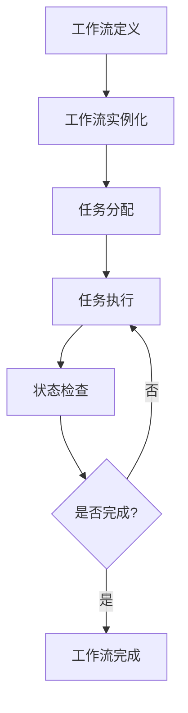

# 01-工作流基础理论 (Workflow Foundation Theory)

## 概述

工作流基础理论是软件工程中处理业务流程自动化的核心理论体系。本文档基于形式化方法，建立了工作流系统的理论基础，并使用Go语言提供实现示例。

## 目录

- [01-工作流基础理论](#01-工作流基础理论)
  - [概述](#概述)
  - [1. 工作流基本概念](#1-工作流基本概念)
  - [2. 形式化定义](#2-形式化定义)
  - [3. 工作流分类体系](#3-工作流分类体系)
  - [4. 理论基础](#4-理论基础)
  - [5. Go语言实现](#5-go语言实现)
  - [6. 应用场景](#6-应用场景)
  - [7. 总结](#7-总结)

## 1. 工作流基本概念

### 1.1 工作流定义

**工作流（Workflow）** 是一系列相互关联的任务或活动的集合，这些任务按照预定义的规则和顺序执行，以实现特定的业务目标。

### 1.2 核心要素

```go
// 工作流核心要素定义
type WorkflowElement struct {
    // 任务（Task）：工作流中的基本执行单元
    Tasks []Task
    
    // 活动（Activity）：任务的执行过程
    Activities []Activity
    
    // 网关（Gateway）：控制流程分支和合并的决策点
    Gateways []Gateway
    
    // 事件（Event）：触发或响应工作流状态变化
    Events []Event
    
    // 连接（Connection）：连接各个元素的路径
    Connections []Connection
}
```

### 1.3 工作流生命周期



## 2. 形式化定义

### 2.1 工作流系统形式化模型

**定义 2.1.1** 工作流系统是一个五元组 $W = (S, T, R, I, F)$，其中：

- $S$ 是状态集合
- $T$ 是任务集合
- $R$ 是规则集合
- $I$ 是初始状态
- $F$ 是最终状态集合

**定义 2.1.2** 工作流状态转换函数：

$$\delta: S \times T \rightarrow S$$

**定义 2.1.3** 工作流执行路径：

$$P = s_0 \xrightarrow{t_1} s_1 \xrightarrow{t_2} s_2 \xrightarrow{t_3} \cdots \xrightarrow{t_n} s_n$$

其中 $s_0 \in I$ 且 $s_n \in F$。

### 2.2 工作流代数

**公理 2.2.1** 顺序组合（Sequential Composition）：

$$(W_1 \cdot W_2)(s) = W_2(W_1(s))$$

**公理 2.2.2** 并行组合（Parallel Composition）：

$$(W_1 \parallel W_2)(s) = W_1(s) \cap W_2(s)$$

**公理 2.2.3** 选择组合（Choice Composition）：

$$(W_1 + W_2)(s) = W_1(s) \cup W_2(s)$$

## 3. 工作流分类体系

### 3.1 按执行模式分类

```go
// 工作流执行模式枚举
type ExecutionMode int

const (
    SequentialMode ExecutionMode = iota  // 顺序执行
    ParallelMode                         // 并行执行
    ConditionalMode                      // 条件执行
    IterativeMode                        // 迭代执行
    EventDrivenMode                      // 事件驱动
)
```

### 3.2 按业务领域分类

```go
// 业务领域分类
type BusinessDomain int

const (
    BusinessProcessDomain BusinessDomain = iota  // 业务流程
    SystemIntegrationDomain                      // 系统集成
    DataProcessingDomain                         // 数据处理
    DecisionSupportDomain                        // 决策支持
    CollaborationDomain                          // 协作流程
)
```

### 3.3 按复杂度分类

```go
// 复杂度分类
type ComplexityLevel int

const (
    SimpleLevel ComplexityLevel = iota    // 简单工作流
    MediumLevel                           // 中等复杂度
    ComplexLevel                          // 复杂工作流
    VeryComplexLevel                      // 非常复杂
)
```

## 4. 理论基础

### 4.1 状态机理论

工作流可以建模为有限状态机（FSM）：

**定义 4.1.1** 工作流状态机：

$$M = (Q, \Sigma, \delta, q_0, F)$$

其中：

- $Q$ 是状态集合
- $\Sigma$ 是输入字母表（任务集合）
- $\delta$ 是状态转换函数
- $q_0$ 是初始状态
- $F$ 是接受状态集合

### 4.2 Petri网理论

**定义 4.2.1** 工作流Petri网：

$$N = (P, T, F, M_0)$$

其中：

- $P$ 是库所集合（状态）
- $T$ 是变迁集合（任务）
- $F$ 是流关系
- $M_0$ 是初始标识

### 4.3 时态逻辑

**定义 4.3.1** 工作流时态逻辑公式：

$$\phi ::= p \mid \neg \phi \mid \phi \land \psi \mid \phi \lor \psi \mid \mathbf{X}\phi \mid \mathbf{F}\phi \mid \mathbf{G}\phi \mid \phi \mathbf{U}\psi$$

其中：

- $\mathbf{X}\phi$：下一个状态满足 $\phi$
- $\mathbf{F}\phi$：将来某个状态满足 $\phi$
- $\mathbf{G}\phi$：所有将来状态都满足 $\phi$
- $\phi \mathbf{U}\psi$：$\phi$ 一直为真直到 $\psi$ 为真

## 5. Go语言实现

### 5.1 工作流引擎核心接口

```go
package workflow

import (
    "context"
    "time"
)

// WorkflowEngine 工作流引擎接口
type WorkflowEngine interface {
    // 启动工作流
    Start(ctx context.Context, workflowID string, input map[string]interface{}) error
    
    // 暂停工作流
    Pause(ctx context.Context, workflowID string) error
    
    // 恢复工作流
    Resume(ctx context.Context, workflowID string) error
    
    // 取消工作流
    Cancel(ctx context.Context, workflowID string) error
    
    // 获取工作流状态
    GetStatus(ctx context.Context, workflowID string) (*WorkflowStatus, error)
}

// WorkflowStatus 工作流状态
type WorkflowStatus struct {
    WorkflowID   string                 `json:"workflow_id"`
    Status       WorkflowState          `json:"status"`
    CurrentTask  string                 `json:"current_task"`
    Progress     float64                `json:"progress"`
    StartTime    time.Time              `json:"start_time"`
    EndTime      *time.Time             `json:"end_time,omitempty"`
    Variables    map[string]interface{} `json:"variables"`
    Error        *string                `json:"error,omitempty"`
}

// WorkflowState 工作流状态枚举
type WorkflowState int

const (
    Created WorkflowState = iota
    Running
    Paused
    Completed
    Failed
    Cancelled
)
```

### 5.2 工作流定义结构

```go
// WorkflowDefinition 工作流定义
type WorkflowDefinition struct {
    ID          string                 `json:"id"`
    Name        string                 `json:"name"`
    Version     string                 `json:"version"`
    Description string                 `json:"description"`
    Tasks       []TaskDefinition       `json:"tasks"`
    Gateways    []GatewayDefinition    `json:"gateways"`
    Events      []EventDefinition      `json:"events"`
    Connections []ConnectionDefinition `json:"connections"`
    Variables   []VariableDefinition   `json:"variables"`
}

// TaskDefinition 任务定义
type TaskDefinition struct {
    ID          string                 `json:"id"`
    Name        string                 `json:"name"`
    Type        TaskType               `json:"type"`
    Handler     string                 `json:"handler"`
    Input       map[string]interface{} `json:"input"`
    Output      map[string]interface{} `json:"output"`
    Timeout     time.Duration          `json:"timeout"`
    RetryPolicy *RetryPolicy           `json:"retry_policy,omitempty"`
}

// TaskType 任务类型
type TaskType string

const (
    UserTask     TaskType = "user_task"
    ServiceTask  TaskType = "service_task"
    ScriptTask   TaskType = "script_task"
    SubProcess   TaskType = "sub_process"
    ParallelTask TaskType = "parallel_task"
)

// RetryPolicy 重试策略
type RetryPolicy struct {
    MaxAttempts int           `json:"max_attempts"`
    Delay       time.Duration `json:"delay"`
    Backoff     float64       `json:"backoff"`
}
```

### 5.3 工作流执行器实现

```go
// WorkflowExecutor 工作流执行器
type WorkflowExecutor struct {
    engine    WorkflowEngine
    registry  TaskRegistry
    storage   WorkflowStorage
    notifier  EventNotifier
}

// NewWorkflowExecutor 创建工作流执行器
func NewWorkflowExecutor(engine WorkflowEngine, registry TaskRegistry, storage WorkflowStorage, notifier EventNotifier) *WorkflowExecutor {
    return &WorkflowExecutor{
        engine:    engine,
        registry:  registry,
        storage:   storage,
        notifier:  notifier,
    }
}

// Execute 执行工作流
func (e *WorkflowExecutor) Execute(ctx context.Context, definition *WorkflowDefinition, input map[string]interface{}) error {
    // 1. 创建工作流实例
    instance := &WorkflowInstance{
        ID:           generateWorkflowID(),
        DefinitionID: definition.ID,
        Status:       Created,
        Variables:    input,
        StartTime:    time.Now(),
    }
    
    // 2. 保存实例
    if err := e.storage.SaveInstance(ctx, instance); err != nil {
        return fmt.Errorf("failed to save workflow instance: %w", err)
    }
    
    // 3. 通知工作流开始
    e.notifier.NotifyWorkflowStarted(ctx, instance)
    
    // 4. 开始执行
    return e.executeWorkflow(ctx, instance, definition)
}

// executeWorkflow 执行工作流逻辑
func (e *WorkflowExecutor) executeWorkflow(ctx context.Context, instance *WorkflowInstance, definition *WorkflowDefinition) error {
    // 更新状态为运行中
    instance.Status = Running
    e.storage.UpdateInstance(ctx, instance)
    
    // 获取起始任务
    startTasks := e.findStartTasks(definition)
    
    // 并行执行起始任务
    for _, task := range startTasks {
        go e.executeTask(ctx, instance, task)
    }
    
    return nil
}

// executeTask 执行单个任务
func (e *WorkflowExecutor) executeTask(ctx context.Context, instance *WorkflowInstance, task *TaskDefinition) error {
    // 1. 获取任务处理器
    handler, err := e.registry.GetHandler(task.Handler)
    if err != nil {
        return fmt.Errorf("failed to get task handler: %w", err)
    }
    
    // 2. 准备任务输入
    input := e.prepareTaskInput(instance, task)
    
    // 3. 执行任务
    result, err := handler.Execute(ctx, input)
    if err != nil {
        // 处理重试逻辑
        return e.handleTaskError(ctx, instance, task, err)
    }
    
    // 4. 更新工作流变量
    e.updateWorkflowVariables(instance, task, result)
    
    // 5. 查找下一个任务
    nextTasks := e.findNextTasks(instance, task)
    
    // 6. 执行下一个任务
    for _, nextTask := range nextTasks {
        go e.executeTask(ctx, instance, nextTask)
    }
    
    return nil
}
```

### 5.4 任务注册表

```go
// TaskRegistry 任务注册表
type TaskRegistry interface {
    // 注册任务处理器
    Register(handlerName string, handler TaskHandler) error
    
    // 获取任务处理器
    GetHandler(handlerName string) (TaskHandler, error)
    
    // 列出所有处理器
    ListHandlers() []string
}

// TaskHandler 任务处理器接口
type TaskHandler interface {
    // 执行任务
    Execute(ctx context.Context, input map[string]interface{}) (map[string]interface{}, error)
    
    // 获取处理器信息
    GetInfo() TaskHandlerInfo
}

// TaskHandlerInfo 任务处理器信息
type TaskHandlerInfo struct {
    Name        string                 `json:"name"`
    Description string                 `json:"description"`
    Version     string                 `json:"version"`
    InputSchema map[string]interface{} `json:"input_schema"`
    OutputSchema map[string]interface{} `json:"output_schema"`
}

// DefaultTaskRegistry 默认任务注册表实现
type DefaultTaskRegistry struct {
    handlers map[string]TaskHandler
    mu       sync.RWMutex
}

// NewDefaultTaskRegistry 创建默认任务注册表
func NewDefaultTaskRegistry() *DefaultTaskRegistry {
    return &DefaultTaskRegistry{
        handlers: make(map[string]TaskHandler),
    }
}

// Register 注册任务处理器
func (r *DefaultTaskRegistry) Register(handlerName string, handler TaskHandler) error {
    r.mu.Lock()
    defer r.mu.Unlock()
    
    if _, exists := r.handlers[handlerName]; exists {
        return fmt.Errorf("handler %s already registered", handlerName)
    }
    
    r.handlers[handlerName] = handler
    return nil
}

// GetHandler 获取任务处理器
func (r *DefaultTaskRegistry) GetHandler(handlerName string) (TaskHandler, error) {
    r.mu.RLock()
    defer r.mu.RUnlock()
    
    handler, exists := r.handlers[handlerName]
    if !exists {
        return nil, fmt.Errorf("handler %s not found", handlerName)
    }
    
    return handler, nil
}

// ListHandlers 列出所有处理器
func (r *DefaultTaskRegistry) ListHandlers() []string {
    r.mu.RLock()
    defer r.mu.RUnlock()
    
    handlers := make([]string, 0, len(r.handlers))
    for name := range r.handlers {
        handlers = append(handlers, name)
    }
    
    return handlers
}
```

## 6. 应用场景

### 6.1 业务流程自动化

```go
// 订单处理工作流示例
func createOrderProcessingWorkflow() *WorkflowDefinition {
    return &WorkflowDefinition{
        ID:          "order_processing",
        Name:        "订单处理工作流",
        Version:     "1.0.0",
        Description: "处理客户订单的完整业务流程",
        Tasks: []TaskDefinition{
            {
                ID:      "validate_order",
                Name:    "验证订单",
                Type:    ServiceTask,
                Handler: "order_validation_service",
                Input: map[string]interface{}{
                    "order_id": "${order.id}",
                },
            },
            {
                ID:      "check_inventory",
                Name:    "检查库存",
                Type:    ServiceTask,
                Handler: "inventory_service",
                Input: map[string]interface{}{
                    "product_id": "${order.product_id}",
                    "quantity":   "${order.quantity}",
                },
            },
            {
                ID:      "process_payment",
                Name:    "处理支付",
                Type:    ServiceTask,
                Handler: "payment_service",
                Input: map[string]interface{}{
                    "order_id": "${order.id}",
                    "amount":   "${order.total_amount}",
                },
                RetryPolicy: &RetryPolicy{
                    MaxAttempts: 3,
                    Delay:       5 * time.Second,
                    Backoff:     2.0,
                },
            },
            {
                ID:      "ship_order",
                Name:    "发货",
                Type:    ServiceTask,
                Handler: "shipping_service",
                Input: map[string]interface{}{
                    "order_id": "${order.id}",
                    "address":  "${order.shipping_address}",
                },
            },
        },
        Gateways: []GatewayDefinition{
            {
                ID:   "inventory_check_gateway",
                Type: ExclusiveGateway,
                Conditions: map[string]string{
                    "in_stock":    "${inventory.available} >= ${order.quantity}",
                    "out_of_stock": "${inventory.available} < ${order.quantity}",
                },
            },
        },
        Connections: []ConnectionDefinition{
            {
                From: "validate_order",
                To:   "check_inventory",
            },
            {
                From: "check_inventory",
                To:   "inventory_check_gateway",
            },
            {
                From:      "inventory_check_gateway",
                To:        "process_payment",
                Condition: "in_stock",
            },
            {
                From:      "inventory_check_gateway",
                To:        "notify_out_of_stock",
                Condition: "out_of_stock",
            },
            {
                From: "process_payment",
                To:   "ship_order",
            },
        },
    }
}
```

### 6.2 数据处理管道

```go
// 数据处理工作流示例
func createDataProcessingWorkflow() *WorkflowDefinition {
    return &WorkflowDefinition{
        ID:          "data_processing",
        Name:        "数据处理管道",
        Version:     "1.0.0",
        Description: "大数据处理和分析管道",
        Tasks: []TaskDefinition{
            {
                ID:      "data_ingestion",
                Name:    "数据摄入",
                Type:    ServiceTask,
                Handler: "kafka_consumer_service",
                Input: map[string]interface{}{
                    "topic":    "raw_data",
                    "batch_size": 1000,
                },
            },
            {
                ID:      "data_cleaning",
                Name:    "数据清洗",
                Type:    ServiceTask,
                Handler: "data_cleaning_service",
                Input: map[string]interface{}{
                    "rules": []string{
                        "remove_duplicates",
                        "fill_missing_values",
                        "validate_format",
                    },
                },
            },
            {
                ID:      "data_transformation",
                Name:    "数据转换",
                Type:    ServiceTask,
                Handler: "data_transformation_service",
                Input: map[string]interface{}{
                    "transformations": []map[string]interface{}{
                        {"type": "normalize", "columns": []string{"price", "quantity"}},
                        {"type": "encode", "columns": []string{"category", "region"}},
                    },
                },
            },
            {
                ID:      "data_analysis",
                Name:    "数据分析",
                Type:    ParallelTask,
                Handler: "analytics_service",
                Input: map[string]interface{}{
                    "analyses": []string{
                        "trend_analysis",
                        "correlation_analysis",
                        "anomaly_detection",
                    },
                },
            },
            {
                ID:      "generate_report",
                Name:    "生成报告",
                Type:    ServiceTask,
                Handler: "report_generation_service",
                Input: map[string]interface{}{
                    "format": "pdf",
                    "template": "standard_report",
                },
            },
        },
        Connections: []ConnectionDefinition{
            {From: "data_ingestion", To: "data_cleaning"},
            {From: "data_cleaning", To: "data_transformation"},
            {From: "data_transformation", To: "data_analysis"},
            {From: "data_analysis", To: "generate_report"},
        },
    }
}
```

## 7. 总结

工作流基础理论为业务流程自动化提供了坚实的理论基础：

### 7.1 理论贡献

1. **形式化建模**：通过状态机、Petri网、时态逻辑等形式化方法建模工作流
2. **分类体系**：建立了完整的工作流分类体系，便于理解和应用
3. **代数理论**：提供了工作流组合和分解的代数基础
4. **验证方法**：支持工作流正确性和性能的形式化验证

### 7.2 实践价值

1. **标准化**：为工作流系统开发提供标准化指导
2. **可扩展性**：支持复杂业务流程的建模和执行
3. **可靠性**：通过形式化方法保证工作流的正确性
4. **性能优化**：提供性能分析和优化的理论基础

### 7.3 技术特色

1. **Go语言实现**：充分利用Go语言的并发和性能优势
2. **模块化设计**：清晰的分层架构和接口设计
3. **事件驱动**：支持事件驱动的工作流执行
4. **可观测性**：完整的状态监控和日志记录

通过工作流基础理论，可以构建高性能、高可靠、高可扩展的工作流系统，满足各种复杂的业务需求。

---

**相关链接**：

- [02-工作流引擎设计](../02-Workflow-Engine-Design/README.md)
- [03-工作流模式](../03-Workflow-Patterns/README.md)
- [04-工作流优化](../04-Workflow-Optimization/README.md)
- [返回软件架构层](../../README.md)
