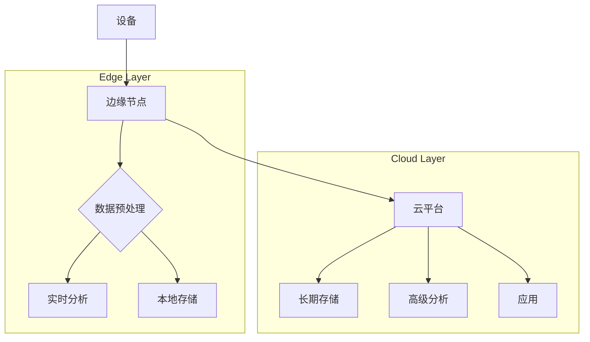
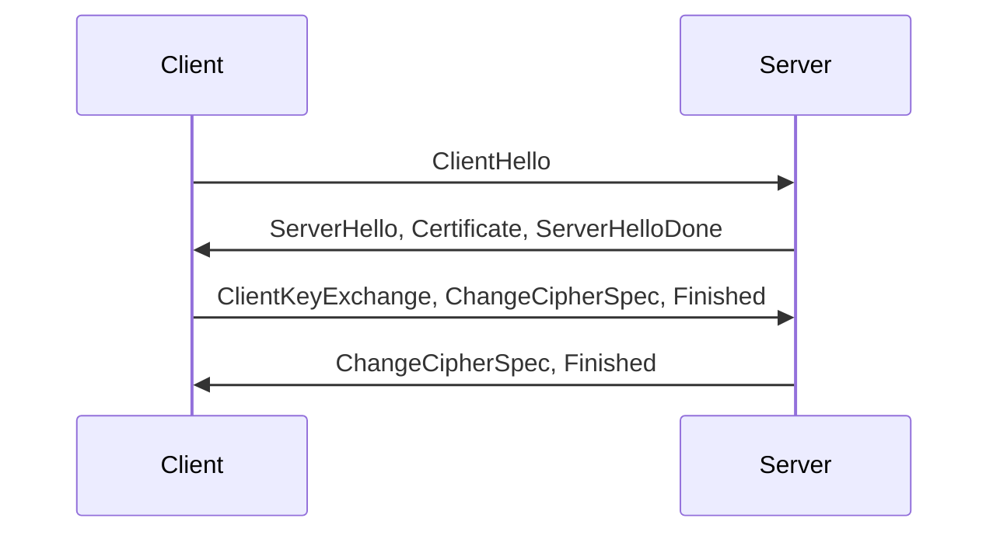

# 1. IoT架构基础

## 1.1 IoT理论基础

### 1.1.1 IoT系统形式化定义

**定义 1.1** (IoT系统): IoT系统是一个五元组 $$ \mathcal{I} = (D, G, C, P, A) $$，其中：

- $$ D $$ 是设备集合 (Devices)
- $$ G $$ 是网关集合 (Gateways)
- $$ C $$ 是云平台集合 (Cloud)
- $$ P $$ 是协议集合 (Protocols)
- $$ A $$ 是应用集合 (Applications)

**IoT架构层次**:

$$
\text{IoTArchitecture} = \text{DeviceLayer} \times \text{GatewayLayer} \times \text{CloudLayer} \times \text{ApplicationLayer}
$$

### 1.1.2 IoT设备模型

**定义 1.2** (IoT设备): IoT设备是一个四元组 $$ \text{Device} = (S, A, P, C) $$，其中：

- $$ S $$ 是传感器集合
- $$ A $$ 是执行器集合
- $$ P $$ 是处理单元
- $$ C $$ 是通信模块

**设备能力模型**:

$$
\text{DeviceCapability} = \text{Sensing} \cup \text{Actuation} \cup \text{Processing} \cup \text{Communication}
$$

## 1.2 Go语言IoT设备实现

### 1.2.1 设备抽象层

```go
// Device IoT设备接口
type Device interface {
    // 设备标识
    GetID() string
    GetName() string
    GetType() DeviceType
    
    // 设备状态
    GetStatus() DeviceStatus
    Start() error
    Stop() error
    
    // 数据操作
    ReadSensor(sensorID string) (SensorData, error)
    WriteActuator(actuatorID string, value interface{}) error
    
    // 配置管理
    GetConfig() DeviceConfig
    UpdateConfig(config DeviceConfig) error
}

// DeviceType 设备类型
type DeviceType string

const (
    DeviceTypeSensor    DeviceType = "SENSOR"
    DeviceTypeActuator  DeviceType = "ACTUATOR"
    DeviceTypeGateway   DeviceType = "GATEWAY"
    DeviceTypeController DeviceType = "CONTROLLER"
)

// DeviceStatus 设备状态
type DeviceStatus struct {
    ID          string    `json:"id"`
    Name        string    `json:"name"`
    Type        DeviceType `json:"type"`
    Status      string    `json:"status"`
    LastSeen    time.Time `json:"last_seen"`
    Battery     float64   `json:"battery"`
    Signal      float64   `json:"signal"`
    Temperature float64   `json:"temperature"`
    Errors      []string  `json:"errors"`
}

// DeviceConfig 设备配置
type DeviceConfig struct {
    ID           string                 `json:"id"`
    Name         string                 `json:"name"`
    Type         DeviceType             `json:"type"`
    Location     Location               `json:"location"`
    Parameters   map[string]interface{} `json:"parameters"`
    Sensors      []SensorConfig         `json:"sensors"`
    Actuators    []ActuatorConfig       `json:"actuators"`
    Communication CommunicationConfig   `json:"communication"`
}

// Location 位置信息
type Location struct {
    Latitude  float64 `json:"latitude"`
    Longitude float64 `json:"longitude"`
    Altitude  float64 `json:"altitude"`
    Address   string  `json:"address"`
}

// BaseDevice 基础设备实现
type BaseDevice struct {
    id       string
    name     string
    deviceType DeviceType
    config   DeviceConfig
    status   DeviceStatus
    sensors  map[string]Sensor
    actuators map[string]Actuator
    comm     CommunicationModule
    mutex    sync.RWMutex
    stopChan chan struct{}
}

// NewBaseDevice 创建基础设备
func NewBaseDevice(id, name string, deviceType DeviceType) *BaseDevice {
    return &BaseDevice{
        id:         id,
        name:       name,
        deviceType: deviceType,
        sensors:    make(map[string]Sensor),
        actuators:  make(map[string]Actuator),
        stopChan:   make(chan struct{}),
    }
}

// GetID 获取设备ID
func (bd *BaseDevice) GetID() string {
    return bd.id
}

// GetName 获取设备名称
func (bd *BaseDevice) GetName() string {
    return bd.name
}

// GetType 获取设备类型
func (bd *BaseDevice) GetType() DeviceType {
    return bd.deviceType
}

// GetStatus 获取设备状态
func (bd *BaseDevice) GetStatus() DeviceStatus {
    bd.mutex.RLock()
    defer bd.mutex.RUnlock()
    
    status := bd.status
    status.LastSeen = time.Now()
    return status
}

// Start 启动设备
func (bd *BaseDevice) Start() error {
    bd.mutex.Lock()
    defer bd.mutex.Unlock()
    
    bd.status.Status = "RUNNING"
    
    // 启动通信模块
    if bd.comm != nil {
        if err := bd.comm.Start(); err != nil {
            return fmt.Errorf("failed to start communication: %w", err)
        }
    }
    
    // 启动传感器
    for _, sensor := range bd.sensors {
        if err := sensor.Start(); err != nil {
            return fmt.Errorf("failed to start sensor: %w", err)
        }
    }
    
    // 启动执行器
    for _, actuator := range bd.actuators {
        if err := actuator.Start(); err != nil {
            return fmt.Errorf("failed to start actuator: %w", err)
        }
    }
    
    return nil
}

// Stop 停止设备
func (bd *BaseDevice) Stop() error {
    bd.mutex.Lock()
    defer bd.mutex.Unlock()
    
    bd.status.Status = "STOPPED"
    close(bd.stopChan)
    
    // 停止通信模块
    if bd.comm != nil {
        if err := bd.comm.Stop(); err != nil {
            return fmt.Errorf("failed to stop communication: %w", err)
        }
    }
    
    // 停止传感器
    for _, sensor := range bd.sensors {
        if err := sensor.Stop(); err != nil {
            return fmt.Errorf("failed to stop sensor: %w", err)
        }
    }
    
    // 停止执行器
    for _, actuator := range bd.actuators {
        if err := actuator.Stop(); err != nil {
            return fmt.Errorf("failed to stop actuator: %w", err)
        }
    }
    
    return nil
}

// ReadSensor 读取传感器数据
func (bd *BaseDevice) ReadSensor(sensorID string) (SensorData, error) {
    bd.mutex.RLock()
    defer bd.mutex.RUnlock()
    
    sensor, exists := bd.sensors[sensorID]
    if !exists {
        return SensorData{}, fmt.Errorf("sensor not found: %s", sensorID)
    }
    
    return sensor.Read()
}
```

### 1.2.2 传感器与执行器

```go
// Sensor 传感器接口
type Sensor interface {
    GetID() string
    GetType() SensorType
    Read() (SensorData, error)
    Start() error
    Stop() error
    UpdateConfig(config SensorConfig) error
}

// SensorType 传感器类型
type SensorType string

const (
    SensorTypeTemperature SensorType = "TEMPERATURE"
    SensorTypeHumidity    SensorType = "HUMIDITY"
    SensorTypeGPS         SensorType = "GPS"
    SensorTypeLight       SensorType = "LIGHT"
    SensorTypeMotion      SensorType = "MOTION"
)

// SensorData 传感器数据
type SensorData struct {
    SensorID  string      `json:"sensor_id"`
    Timestamp time.Time   `json:"timestamp"`
    Value     interface{} `json:"value"`
    Unit      string      `json:"unit"`
}

// SensorConfig 传感器配置
type SensorConfig struct {
    ID          string                 `json:"id"`
    Type        SensorType             `json:"type"`
    Parameters  map[string]interface{} `json:"parameters"`
    UpdateInterval time.Duration        `json:"update_interval"`
}

// Actuator 执行器接口
type Actuator interface {
    GetID() string
    GetType() ActuatorType
    Write(value interface{}) error
    Start() error
    Stop() error
    UpdateConfig(config ActuatorConfig) error
}

// ActuatorType 执行器类型
type ActuatorType string

const (
    ActuatorTypeRelay    ActuatorType = "RELAY"
    ActuatorTypeMotor    ActuatorType = "MOTOR"
    ActuatorTypeLight    ActuatorType = "LIGHT"
    ActuatorTypeValve    ActuatorType = "VALVE"
)

// ActuatorConfig 执行器配置
type ActuatorConfig struct {
    ID         string                 `json:"id"`
    Type       ActuatorType           `json:"type"`
    Parameters map[string]interface{} `json:"parameters"`
}
```

### 1.2.3 通信模块

```go
// CommunicationModule 通信模块接口
type CommunicationModule interface {
    Start() error
    Stop() error
    Send(data interface{}) error
    Receive() (<-chan interface{}, error)
    UpdateConfig(config CommunicationConfig) error
}

// CommunicationConfig 通信配置
type CommunicationConfig struct {
    Protocol   string                 `json:"protocol"` // MQTT, CoAP, HTTP, etc.
    Endpoint   string                 `json:"endpoint"`
    Username   string                 `json:"username"`
    Password   string                 `json:"password"`
    Parameters map[string]interface{} `json:"parameters"`
}
```

## 1.3 IoT通信协议

### 1.3.1 MQTT (Message Queuing Telemetry Transport)

**特点**:
- 发布/订阅模型
- 轻量级
- QoS (Quality of Service) 支持

**QoS 等级**:
- QoS 0: 最多一次
- QoS 1: 至少一次
- QoS 2: 只有一次

**MQTT URL 格式**: `tcp://<host>:<port>`

```go
// MQTTModule MQTT通信模块
type MQTTModule struct {
    client mqtt.Client
    config CommunicationConfig
    stopChan chan struct{}
}

// NewMQTTModule 创建MQTT模块
func NewMQTTModule(config CommunicationConfig) *MQTTModule {
    return &MQTTModule{
        config:   config,
        stopChan: make(chan struct{}),
    }
}

// Start 启动MQTT模块
func (m *MQTTModule) Start() error {
    opts := mqtt.NewClientOptions().AddBroker(m.config.Endpoint)
    opts.SetClientID(fmt.Sprintf("go-iot-device-%d", time.Now().Unix()))
    opts.SetUsername(m.config.Username)
    opts.SetPassword(m.config.Password)
    
    m.client = mqtt.NewClient(opts)
    if token := m.client.Connect(); token.Wait() && token.Error() != nil {
        return fmt.Errorf("failed to connect to MQTT broker: %w", token.Error())
    }
    
    return nil
}

// Stop 停止MQTT模块
func (m *MQTTModule) Stop() error {
    m.client.Disconnect(250)
    close(m.stopChan)
    return nil
}

// Send 发送数据
func (m *MQTTModule) Send(data interface{}) error {
    topic := m.config.Parameters["topic"].(string)
    payload, err := json.Marshal(data)
    if err != nil {
        return fmt.Errorf("failed to marshal data: %w", err)
    }
    
    token := m.client.Publish(topic, 0, false, payload)
    token.Wait()
    return token.Error()
}

// Receive 接收数据
func (m *MQTTModule) Receive() (<-chan interface{}, error) {
    topic := m.config.Parameters["topic"].(string)
    dataChan := make(chan interface{})
    
    token := m.client.Subscribe(topic, 0, func(client mqtt.Client, msg mqtt.Message) {
        var data interface{}
        if err := json.Unmarshal(msg.Payload(), &data); err == nil {
            dataChan <- data
        }
    })
    
    if token.Wait() && token.Error() != nil {
        return nil, fmt.Errorf("failed to subscribe to topic: %w", token.Error())
    }
    
    go func() {
        <-m.stopChan
        close(dataChan)
    }()
    
    return dataChan, nil
}

// UpdateConfig 更新配置
func (m *MQTTModule) UpdateConfig(config CommunicationConfig) error {
    m.config = config
    // 可能需要重新连接
    return nil
}
```

### 1.3.2 CoAP (Constrained Application Protocol)

**特点**:
- RESTful 模型
- 轻量级 (UDP)
- 支持资源发现

**CoAP URL 格式**: `coap://<host>:<port>/<path>`

```go
// CoAPModule CoAP通信模块
type CoAPModule struct {
    client *coap.Client
    config CommunicationConfig
    stopChan chan struct{}
}

// NewCoAPModule 创建CoAP模块
func NewCoAPModule(config CommunicationConfig) *CoAPModule {
    return &CoAPModule{
        config:   config,
        stopChan: make(chan struct{}),
    }
}

// Start 启动CoAP模块
func (c *CoAPModule) Start() error {
    // CoAP客户端通常不需要显式启动
    return nil
}

// Stop 停止CoAP模块
func (c *CoAPModule) Stop() error {
    close(c.stopChan)
    return nil
}

// Send 发送数据
func (c *CoAPModule) Send(data interface{}) error {
    payload, err := json.Marshal(data)
    if err != nil {
        return fmt.Errorf("failed to marshal data: %w", err)
    }
    
    resp, err := coap.Post(c.config.Endpoint, "application/json", bytes.NewReader(payload))
    if err != nil {
        return fmt.Errorf("failed to send CoAP request: %w", err)
    }
    
    log.Printf("CoAP response: %s", resp.Payload)
    return nil
}

// Receive 接收数据 (通常通过CoAP服务器实现)
func (c *CoAPModule) Receive() (<-chan interface{}, error) {
    return nil, fmt.Errorf("receive not supported for CoAP client, use a CoAP server")
}

// UpdateConfig 更新配置
func (c *CoAPModule) UpdateConfig(config CommunicationConfig) error {
    c.config = config
    return nil
}
```

### 1.3.3 HTTP/HTTPS

**特点**:
- 成熟、广泛支持
- 开销较大
- 安全性好 (HTTPS)

**HTTP URL 格式**: `http(s)://<host>:<port>/<path>`

```go
// HTTPModule HTTP通信模块
type HTTPModule struct {
    client *http.Client
    config CommunicationConfig
}

// NewHTTPModule 创建HTTP模块
func NewHTTPModule(config CommunicationConfig) *HTTPModule {
    return &HTTPModule{
        client: &http.Client{Timeout: 10 * time.Second},
        config: config,
    }
}

// Start 启动HTTP模块
func (h *HTTPModule) Start() error {
    return nil
}

// Stop 停止HTTP模块
func (h *HTTPModule) Stop() error {
    return nil
}

// Send 发送数据
func (h *HTTPModule) Send(data interface{}) error {
    payload, err := json.Marshal(data)
    if err != nil {
        return fmt.Errorf("failed to marshal data: %w", err)
    }
    
    req, err := http.NewRequest("POST", h.config.Endpoint, bytes.NewReader(payload))
    if err != nil {
        return fmt.Errorf("failed to create HTTP request: %w", err)
    }
    req.Header.Set("Content-Type", "application/json")
    
    resp, err := h.client.Do(req)
    if err != nil {
        return fmt.Errorf("failed to send HTTP request: %w", err)
    }
    defer resp.Body.Close()
    
    if resp.StatusCode != http.StatusOK {
        return fmt.Errorf("received non-200 status code: %d", resp.StatusCode)
    }
    
    return nil
}

// Receive 接收数据
func (h *HTTPModule) Receive() (<-chan interface{}, error) {
    return nil, fmt.Errorf("receive not supported for HTTP client, use an HTTP server")
}

// UpdateConfig 更新配置
func (h *HTTPModule) UpdateConfig(config CommunicationConfig) error {
    h.config = config
    return nil
}
```

## 1.4 IoT数据处理

### 1.4.1 数据模型

**时间序列数据 (Time Series Data)**

$$
D = \{ (t_i, v_i) \}_{i=1}^n
$$

- $$ t_i $$: 时间戳
- $$ v_i $$: 传感器值

**数据压缩 (Data Compression)**

- **无损压缩 (Lossless)**: e.g., Run-length encoding
- **有损压缩 (Lossy)**: e.g., Downsampling, DFT

### 1.4.2 边缘计算 (Edge Computing)

**定义 1.3** (边缘计算): 在数据源附近执行计算，以减少延迟和带宽使用。

**边缘计算架构**:



### 1.4.3 Go语言数据处理

```go
// DataPoint 数据点
type DataPoint struct {
    Timestamp time.Time `json:"timestamp"`
    Value     float64   `json:"value"`
    Metadata  map[string]string `json:"metadata"`
}

// TimeSeries 时间序列
type TimeSeries struct {
    ID     string      `json:"id"`
    Points []DataPoint `json:"points"`
}

// Downsample 降采样
func (ts *TimeSeries) Downsample(interval time.Duration) *TimeSeries {
    if len(ts.Points) == 0 {
        return &TimeSeries{ID: ts.ID}
    }
    
    newPoints := []DataPoint{}
    lastPoint := ts.Points[0]
    
    for i := 1; i < len(ts.Points); i++ {
        if ts.Points[i].Timestamp.Sub(lastPoint.Timestamp) >= interval {
            newPoints = append(newPoints, lastPoint)
            lastPoint = ts.Points[i]
        }
    }
    newPoints = append(newPoints, lastPoint)
    
    return &TimeSeries{ID: ts.ID, Points: newPoints}
}

// MovingAverage 移动平均
func (ts *TimeSeries) MovingAverage(windowSize int) *TimeSeries {
    if len(ts.Points) < windowSize {
        return &TimeSeries{ID: ts.ID}
    }
    
    newPoints := []DataPoint{}
    for i := 0; i <= len(ts.Points)-windowSize; i++ {
        sum := 0.0
        for j := 0; j < windowSize; j++ {
            sum += ts.Points[i+j].Value
        }
        avg := sum / float64(windowSize)
        
        newPoints = append(newPoints, DataPoint{
            Timestamp: ts.Points[i+windowSize-1].Timestamp,
            Value:     avg,
        })
    }
    
    return &TimeSeries{ID: ts.ID, Points: newPoints}
}
```

## 1.5 IoT安全

### 1.5.1 安全威胁

- **物理攻击**: 设备篡改
- **网络攻击**: DDoS, MITM
- **软件攻击**: 恶意软件, 固件漏洞
- **数据隐私**: 数据泄露

### 1.5.2 安全措施

- **设备安全**: 安全启动, 加密存储
- **通信安全**: TLS, DTLS
- **云平台安全**: IAM, VPC
- **固件更新**: OTA (Over-the-Air) 更新

**TLS/DTLS 握手**:



### 1.5.3 Go语言安全实现

```go
// 安全配置
type SecurityConfig struct {
    UseTLS      bool   `json:"use_tls"`
    CACertFile  string `json:"ca_cert_file"`
    ClientCertFile string `json:"client_cert_file"`
    ClientKeyFile string `json:"client_key_file"`
}

// 创建TLS配置
func NewTLSConfig(secConfig SecurityConfig) (*tls.Config, error) {
    if !secConfig.UseTLS {
        return nil, nil
    }
    
    caCert, err := ioutil.ReadFile(secConfig.CACertFile)
    if err != nil {
        return nil, fmt.Errorf("failed to read CA cert: %w", err)
    }
    caCertPool := x509.NewCertPool()
    caCertPool.AppendCertsFromPEM(caCert)
    
    cert, err := tls.LoadX509KeyPair(secConfig.ClientCertFile, secConfig.ClientKeyFile)
    if err != nil {
        return nil, fmt.Errorf("failed to load client key pair: %w", err)
    }
    
    return &tls.Config{
        RootCAs:      caCertPool,
        Certificates: []tls.Certificate{cert},
    }, nil
}
```

</rewritten_file>