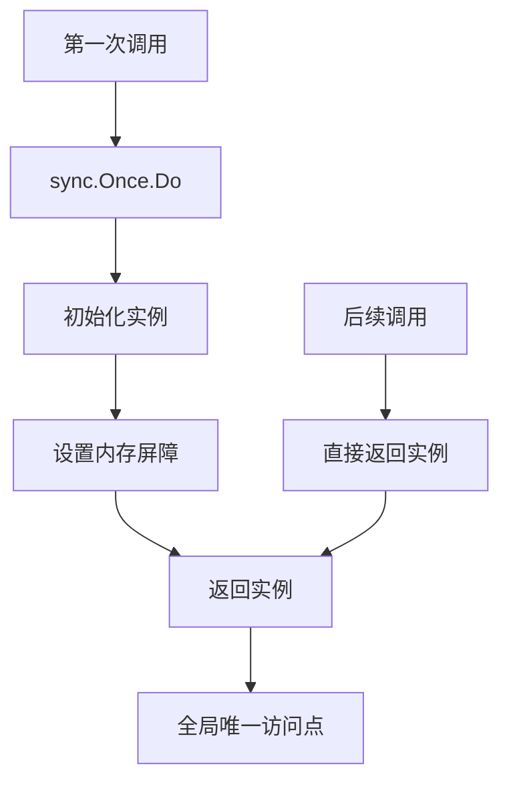
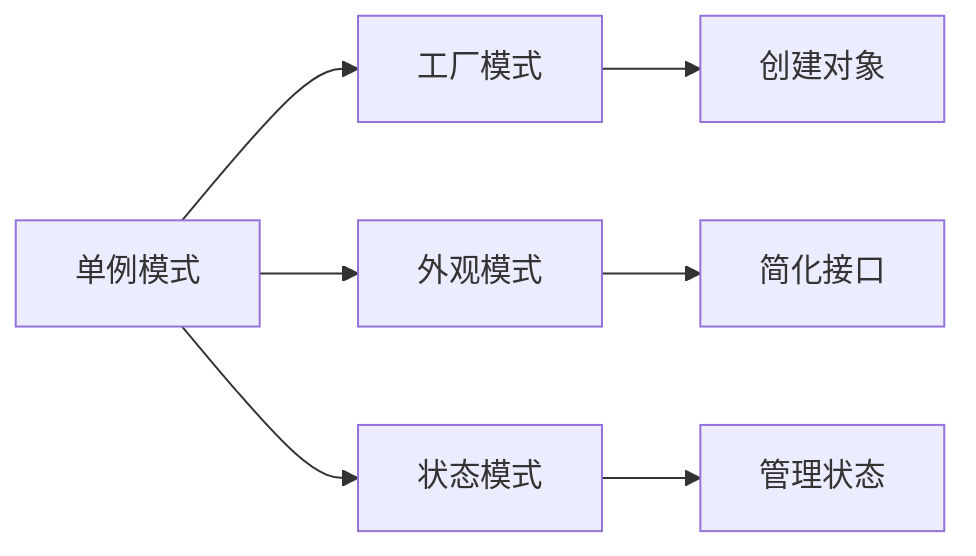

# 01-单例模式 (Singleton Pattern)

## 1. 形式化定义

### 1.1 数学定义

设 $S$ 为单例类，$I$ 为实例集合，单例模式满足以下公理：

$$\forall s_1, s_2 \in I: s_1 = s_2$$

**形式化约束**：

- **唯一性**: $\exists! s \in I$
- **全局访问**: $\forall x \in \text{System}: \text{access}(x, s)$
- **延迟初始化**: $\text{init}(s) \iff \text{first\_access}(s)$

### 1.2 类型理论定义

```go
// 单例接口定义
type Singleton interface {
    GetInstance() *Singleton
    DoSomething() string
}

// 单例实现
type singleton struct {
    data string
}

var (
    instance *singleton
    once     sync.Once
)
```

## 2. 实现原理

### 2.1 线程安全保证

**定理**: 使用 `sync.Once` 的单例模式是线程安全的。

**证明**:

1. `sync.Once` 保证 `Do` 方法只执行一次
2. 内存屏障确保可见性
3. 原子操作保证原子性

```go
// 线程安全单例实现
func GetInstance() *singleton {
    once.Do(func() {
        instance = &singleton{
            data: "Initialized",
        }
    })
    return instance
}
```

### 2.2 内存模型分析



## 3. Go语言实现

### 3.1 基础实现

```go
package singleton

import (
    "fmt"
    "sync"
    "time"
)

// Singleton 单例接口
type Singleton interface {
    GetID() string
    DoWork() string
}

// singleton 具体实现
type singleton struct {
    id        string
    createdAt time.Time
}

var (
    instance *singleton
    once     sync.Once
)

// GetInstance 获取单例实例
func GetInstance() Singleton {
    once.Do(func() {
        instance = &singleton{
            id:        fmt.Sprintf("singleton-%d", time.Now().UnixNano()),
            createdAt: time.Now(),
        }
        fmt.Printf("Singleton created: %s\n", instance.id)
    })
    return instance
}

// GetID 获取实例ID
func (s *singleton) GetID() string {
    return s.id
}

// DoWork 执行工作
func (s *singleton) DoWork() string {
    return fmt.Sprintf("Working with singleton: %s", s.id)
}
```

### 3.2 高级实现（带配置）

```go
// ConfigurableSingleton 可配置单例
type ConfigurableSingleton struct {
    config map[string]interface{}
    mutex  sync.RWMutex
}

var (
    configInstance *ConfigurableSingleton
    configOnce     sync.Once
)

// GetConfigurableInstance 获取可配置单例
func GetConfigurableInstance() *ConfigurableSingleton {
    configOnce.Do(func() {
        configInstance = &ConfigurableSingleton{
            config: make(map[string]interface{}),
        }
    })
    return configInstance
}

// SetConfig 设置配置
func (cs *ConfigurableSingleton) SetConfig(key string, value interface{}) {
    cs.mutex.Lock()
    defer cs.mutex.Unlock()
    cs.config[key] = value
}

// GetConfig 获取配置
func (cs *ConfigurableSingleton) GetConfig(key string) (interface{}, bool) {
    cs.mutex.RLock()
    defer cs.mutex.RUnlock()
    value, exists := cs.config[key]
    return value, exists
}
```

## 4. 使用示例

### 4.1 基础使用

```go
package main

import (
    "fmt"
    "sync"
    "time"
    
    "github.com/your-project/singleton"
)

func main() {
    // 测试单例的唯一性
    var wg sync.WaitGroup
    
    for i := 0; i < 5; i++ {
        wg.Add(1)
        go func(id int) {
            defer wg.Done()
            
            instance := singleton.GetInstance()
            fmt.Printf("Goroutine %d: %s\n", id, instance.GetID())
            fmt.Printf("Goroutine %d: %s\n", id, instance.DoWork())
        }(i)
    }
    
    wg.Wait()
    
    // 验证所有实例都是同一个
    instance1 := singleton.GetInstance()
    instance2 := singleton.GetInstance()
    
    fmt.Printf("Instance1 ID: %s\n", instance1.GetID())
    fmt.Printf("Instance2 ID: %s\n", instance2.GetID())
    fmt.Printf("Same instance: %v\n", instance1.GetID() == instance2.GetID())
}
```

### 4.2 配置管理示例

```go
func configExample() {
    config := singleton.GetConfigurableInstance()
    
    // 设置配置
    config.SetConfig("database_url", "postgres://localhost:5432/mydb")
    config.SetConfig("redis_url", "redis://localhost:6379")
    config.SetConfig("max_connections", 100)
    
    // 获取配置
    if dbURL, exists := config.GetConfig("database_url"); exists {
        fmt.Printf("Database URL: %s\n", dbURL)
    }
    
    if maxConn, exists := config.GetConfig("max_connections"); exists {
        fmt.Printf("Max connections: %d\n", maxConn)
    }
}
```

## 5. 性能分析

### 5.1 时间复杂度

| 操作 | 时间复杂度 | 说明 |
|------|------------|------|
| 首次获取 | O(1) | 包含初始化开销 |
| 后续获取 | O(1) | 直接返回引用 |

### 5.2 空间复杂度

- **内存占用**: O(1) - 只存储一个实例
- **线程安全开销**: O(1) - `sync.Once` 的固定开销

### 5.3 基准测试

```go
func BenchmarkGetInstance(b *testing.B) {
    b.ResetTimer()
    for i := 0; i < b.N; i++ {
        singleton.GetInstance()
    }
}

func BenchmarkGetInstanceParallel(b *testing.B) {
    b.ResetTimer()
    b.RunParallel(func(pb *testing.PB) {
        for pb.Next() {
            singleton.GetInstance()
        }
    })
}
```

## 6. 应用场景

### 6.1 适用场景

1. **配置管理**: 全局配置对象
2. **日志记录器**: 统一的日志处理
3. **数据库连接池**: 共享连接资源
4. **缓存管理器**: 全局缓存访问
5. **线程池**: 共享线程资源

### 6.2 不适用场景

1. **需要多个实例**: 违反单例原则
2. **频繁创建销毁**: 单例的生命周期管理
3. **测试困难**: 全局状态影响测试

## 7. 设计模式关系

### 7.1 与其他模式的关系



### 7.2 组合使用

```go
// 单例 + 工厂模式
type ServiceFactory struct {
    services map[string]Service
}

var factory *ServiceFactory
var factoryOnce sync.Once

func GetServiceFactory() *ServiceFactory {
    factoryOnce.Do(func() {
        factory = &ServiceFactory{
            services: make(map[string]Service),
        }
    })
    return factory
}

func (sf *ServiceFactory) GetService(name string) Service {
    if service, exists := sf.services[name]; exists {
        return service
    }
    
    // 创建新服务
    service := createService(name)
    sf.services[name] = service
    return service
}
```

## 8. 形式化验证

### 8.1 不变式验证

```go
// 验证单例不变式
func VerifySingletonInvariant() bool {
    instance1 := GetInstance()
    instance2 := GetInstance()
    
    // 唯一性检查
    if instance1 != instance2 {
        return false
    }
    
    // 一致性检查
    if instance1.GetID() != instance2.GetID() {
        return false
    }
    
    return true
}
```

### 8.2 线程安全验证

```go
func TestThreadSafety(t *testing.T) {
    const numGoroutines = 1000
    var wg sync.WaitGroup
    instances := make([]Singleton, numGoroutines)
    
    for i := 0; i < numGoroutines; i++ {
        wg.Add(1)
        go func(index int) {
            defer wg.Done()
            instances[index] = GetInstance()
        }(i)
    }
    
    wg.Wait()
    
    // 验证所有实例都是同一个
    firstID := instances[0].GetID()
    for i := 1; i < numGoroutines; i++ {
        if instances[i].GetID() != firstID {
            t.Errorf("Instance %d has different ID: %s", i, instances[i].GetID())
        }
    }
}
```

## 9. 总结

单例模式是创建型模式中最简单但最重要的模式之一。在Go语言中，通过 `sync.Once` 可以优雅地实现线程安全的单例模式。

### 9.1 关键要点

1. **线程安全**: 使用 `sync.Once` 保证
2. **延迟初始化**: 首次访问时创建
3. **全局访问**: 提供统一的访问点
4. **内存效率**: 只维护一个实例

### 9.2 最佳实践

1. 优先使用 `sync.Once` 而非手动加锁
2. 考虑是否需要可配置的单例
3. 注意单例的生命周期管理
4. 在测试中考虑单例的影响

---

**下一模式**: [02-工厂方法模式](./02-Factory-Method-Pattern.md)

**返回**: [创建型模式目录](./README.md)
