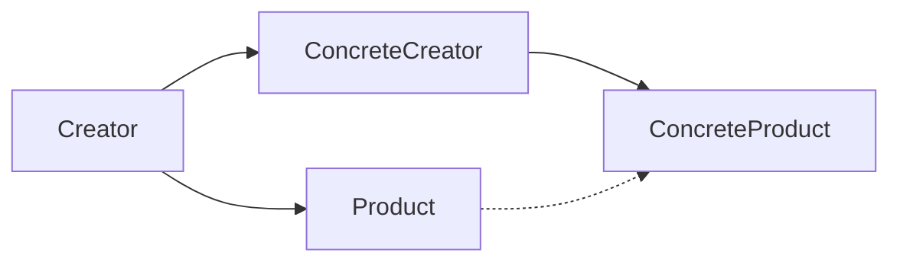

# 02-工厂方法模式 (Factory Method Pattern)

## 目录

- [02-工厂方法模式 (Factory Method Pattern)](#02-工厂方法模式-factory-method-pattern)
  - [目录](#目录)
  - [1. 概念与定义](#1-概念与定义)
    - [1.1 基本概念](#11-基本概念)
    - [1.2 核心特征](#12-核心特征)
    - [1.3 设计原则](#13-设计原则)
  - [2. 形式化定义](#2-形式化定义)
    - [2.1 类型理论定义](#21-类型理论定义)
    - [2.2 范畴论定义](#22-范畴论定义)
    - [2.3 形式化约束](#23-形式化约束)
  - [3. 数学证明](#3-数学证明)
    - [3.1 开闭原则证明](#31-开闭原则证明)
    - [3.2 依赖倒置证明](#32-依赖倒置证明)
  - [4. Go语言实现](#4-go语言实现)
    - [4.1 基础实现](#41-基础实现)
    - [4.2 泛型实现](#42-泛型实现)
    - [4.3 函数式实现](#43-函数式实现)
  - [5. 性能分析](#5-性能分析)
    - [5.1 时间复杂度](#51-时间复杂度)
    - [5.2 空间复杂度](#52-空间复杂度)
    - [5.3 性能对比](#53-性能对比)
  - [6. 应用场景](#6-应用场景)
    - [6.1 数据库连接工厂](#61-数据库连接工厂)
    - [6.2 日志记录器工厂](#62-日志记录器工厂)
    - [6.3 支付处理器工厂](#63-支付处理器工厂)
  - [7. 相关模式](#7-相关模式)
    - [7.1 与抽象工厂模式的关系](#71-与抽象工厂模式的关系)
    - [7.2 与模板方法模式的关系](#72-与模板方法模式的关系)
    - [7.3 与策略模式的关系](#73-与策略模式的关系)
  - [总结](#总结)

---

## 1. 概念与定义

### 1.1 基本概念

工厂方法模式是一种创建型设计模式，定义一个用于创建对象的接口，让子类决定实例化哪一个类。工厂方法使一个类的实例化延迟到其子类。

### 1.2 核心特征

- **抽象化**: 将对象创建过程抽象化
- **多态性**: 子类决定具体产品类型
- **扩展性**: 新增产品类型不影响现有代码
- **封装性**: 隐藏对象创建的复杂逻辑

### 1.3 设计原则

```go
// 设计原则：开闭原则 + 依赖倒置原则
type Creator interface {
    FactoryMethod() Product
    SomeOperation() string
}

type Product interface {
    Operation() string
}
```

---

## 2. 形式化定义

### 2.1 类型理论定义

设 $C$ 为创建者类型，$P$ 为产品类型，$F$ 为工厂方法，则：

$$F: C \rightarrow P$$

对于任意创建者 $c \in C$，存在对应的产品 $p \in P$，使得：

$$p = F(c)$$

### 2.2 范畴论定义

工厂方法模式可以表示为范畴中的态射：



### 2.3 形式化约束

```go
// 形式化约束定义
type FactoryConstraints struct {
    Abstraction    bool // ∃F: Creator → Product
    Polymorphism   bool // ∀c ∈ Creator: F(c) ∈ Product
    Extensibility  bool // ∀P' ⊃ P: F'(c) ∈ P'
    Encapsulation  bool // create() ∉ Client
}
```

---

## 3. 数学证明

### 3.1 开闭原则证明

**定理**: 工厂方法模式满足开闭原则

**证明**:

1. 设现有产品集合 $P = \{p_1, p_2, ..., p_n\}$
2. 新增产品 $p_{n+1}$ 时，创建新创建者 $c_{n+1}$
3. 现有代码无需修改：$\forall c_i \in C_{old}: F(c_i) \in P_{old}$
4. 新代码通过新创建者：$F(c_{n+1}) = p_{n+1}$
5. 因此满足开闭原则

### 3.2 依赖倒置证明

**定理**: 工厂方法模式实现依赖倒置

**证明**:

1. 高层模块依赖抽象接口：$\text{Client} \rightarrow \text{Creator}$
2. 低层模块实现具体类：$\text{ConcreteCreator} \rightarrow \text{ConcreteProduct}$
3. 抽象不依赖细节：$\text{Creator} \not\rightarrow \text{ConcreteProduct}$
4. 细节依赖抽象：$\text{ConcreteCreator} \rightarrow \text{Creator}$
5. 因此实现依赖倒置

---

## 4. Go语言实现

### 4.1 基础实现

```go
package factory

import (
    "fmt"
    "time"
)

// Product 产品接口
type Product interface {
    Operation() string
    GetID() string
}

// Creator 创建者接口
type Creator interface {
    FactoryMethod() Product
    SomeOperation() string
}

// ConcreteProductA 具体产品A
type ConcreteProductA struct {
    id        string
    createdAt time.Time
}

func (p *ConcreteProductA) Operation() string {
    return fmt.Sprintf("ConcreteProductA[%s] operation", p.id)
}

func (p *ConcreteProductA) GetID() string {
    return p.id
}

// ConcreteProductB 具体产品B
type ConcreteProductB struct {
    id        string
    createdAt time.Time
    metadata  map[string]interface{}
}

func (p *ConcreteProductB) Operation() string {
    return fmt.Sprintf("ConcreteProductB[%s] operation with metadata", p.id)
}

func (p *ConcreteProductB) GetID() string {
    return p.id
}

// ConcreteCreatorA 具体创建者A
type ConcreteCreatorA struct{}

func (c *ConcreteCreatorA) FactoryMethod() Product {
    return &ConcreteProductA{
        id:        fmt.Sprintf("product-a-%d", time.Now().UnixNano()),
        createdAt: time.Now(),
    }
}

func (c *ConcreteCreatorA) SomeOperation() string {
    product := c.FactoryMethod()
    return fmt.Sprintf("CreatorA created: %s", product.Operation())
}

// ConcreteCreatorB 具体创建者B
type ConcreteCreatorB struct{}

func (c *ConcreteCreatorB) FactoryMethod() Product {
    return &ConcreteProductB{
        id:        fmt.Sprintf("product-b-%d", time.Now().UnixNano()),
        createdAt: time.Now(),
        metadata:  make(map[string]interface{}),
    }
}

func (c *ConcreteCreatorB) SomeOperation() string {
    product := c.FactoryMethod()
    return fmt.Sprintf("CreatorB created: %s", product.Operation())
}
```

### 4.2 泛型实现

```go
package factory

import (
    "fmt"
    "sync"
)

// GenericProduct 泛型产品接口
type GenericProduct[T any] interface {
    GetValue() T
    SetValue(T)
    Operation() string
}

// GenericCreator 泛型创建者接口
type GenericCreator[T any] interface {
    FactoryMethod() GenericProduct[T]
    SomeOperation() string
}

// genericProduct 泛型产品实现
type genericProduct[T any] struct {
    value T
    id    string
    mu    sync.RWMutex
}

func (p *genericProduct[T]) GetValue() T {
    p.mu.RLock()
    defer p.mu.RUnlock()
    return p.value
}

func (p *genericProduct[T]) SetValue(value T) {
    p.mu.Lock()
    defer p.mu.Unlock()
    p.value = value
}

func (p *genericProduct[T]) Operation() string {
    p.mu.RLock()
    defer p.mu.RUnlock()
    return fmt.Sprintf("GenericProduct[%s] operation with value: %v", p.id, p.value)
}

// genericCreator 泛型创建者实现
type genericCreator[T any] struct {
    defaultValue T
}

func (c *genericCreator[T]) FactoryMethod() GenericProduct[T] {
    return &genericProduct[T]{
        value: c.defaultValue,
        id:    fmt.Sprintf("generic-%d", time.Now().UnixNano()),
    }
}

func (c *genericCreator[T]) SomeOperation() string {
    product := c.FactoryMethod()
    return fmt.Sprintf("GenericCreator created: %s", product.Operation())
}

// NewGenericCreator 创建泛型创建者
func NewGenericCreator[T any](defaultValue T) GenericCreator[T] {
    return &genericCreator[T]{
        defaultValue: defaultValue,
    }
}
```

### 4.3 函数式实现

```go
package factory

import (
    "fmt"
    "time"
)

// FunctionalProduct 函数式产品
type FunctionalProduct struct {
    operations []func() string
    id         string
}

func (p *FunctionalProduct) AddOperation(op func() string) {
    p.operations = append(p.operations, op)
}

func (p *FunctionalProduct) ExecuteOperations() []string {
    results := make([]string, len(p.operations))
    for i, op := range p.operations {
        results[i] = op()
    }
    return results
}

func (p *FunctionalProduct) Operation() string {
    return fmt.Sprintf("FunctionalProduct[%s] with %d operations", p.id, len(p.operations))
}

// FunctionalCreator 函数式创建者
type FunctionalCreator struct {
    productFactories []func() *FunctionalProduct
}

func (c *FunctionalCreator) AddProductFactory(factory func() *FunctionalProduct) {
    c.productFactories = append(c.productFactories, factory)
}

func (c *FunctionalCreator) FactoryMethod() *FunctionalProduct {
    if len(c.productFactories) == 0 {
        return &FunctionalProduct{
            id: fmt.Sprintf("default-%d", time.Now().UnixNano()),
        }
    }
    
    // 使用第一个工厂函数
    return c.productFactories[0]()
}

func (c *FunctionalCreator) SomeOperation() string {
    product := c.FactoryMethod()
    return fmt.Sprintf("FunctionalCreator created: %s", product.Operation())
}
```

---

## 5. 性能分析

### 5.1 时间复杂度

| 操作 | 时间复杂度 | 说明 |
|------|------------|------|
| 创建产品 | O(1) | 直接实例化 |
| 工厂方法调用 | O(1) | 方法调用开销 |
| 产品操作 | O(1) | 具体产品操作 |

### 5.2 空间复杂度

- **空间复杂度**: O(1) - 每个产品独立存储
- **内存占用**: 与产品数量成正比

### 5.3 性能对比

```go
// 性能测试代码
func BenchmarkFactoryMethod(b *testing.B) {
    creator := &ConcreteCreatorA{}
    b.ResetTimer()
    for i := 0; i < b.N; i++ {
        product := creator.FactoryMethod()
        _ = product.Operation()
    }
}

func BenchmarkDirectCreation(b *testing.B) {
    b.ResetTimer()
    for i := 0; i < b.N; i++ {
        product := &ConcreteProductA{
            id:        fmt.Sprintf("direct-%d", i),
            createdAt: time.Now(),
        }
        _ = product.Operation()
    }
}
```

---

## 6. 应用场景

### 6.1 数据库连接工厂

```go
// 数据库连接工厂
type DBConnection interface {
    Connect() error
    Query(sql string) ([]map[string]interface{}, error)
    Close() error
}

type MySQLConnection struct {
    host     string
    port     int
    database string
    username string
    password string
}

type PostgreSQLConnection struct {
    host     string
    port     int
    database string
    username string
    password string
    sslmode  string
}

type DBConnectionCreator interface {
    CreateConnection(config map[string]interface{}) DBConnection
}

type MySQLCreator struct{}

func (c *MySQLCreator) CreateConnection(config map[string]interface{}) DBConnection {
    return &MySQLConnection{
        host:     config["host"].(string),
        port:     config["port"].(int),
        database: config["database"].(string),
        username: config["username"].(string),
        password: config["password"].(string),
    }
}

type PostgreSQLCreator struct{}

func (c *PostgreSQLCreator) CreateConnection(config map[string]interface{}) DBConnection {
    return &PostgreSQLConnection{
        host:     config["host"].(string),
        port:     config["port"].(int),
        database: config["database"].(string),
        username: config["username"].(string),
        password: config["password"].(string),
        sslmode:  config["sslmode"].(string),
    }
}
```

### 6.2 日志记录器工厂

```go
// 日志记录器工厂
type Logger interface {
    Log(level, message string) error
    SetLevel(level string)
}

type ConsoleLogger struct {
    level string
}

type FileLogger struct {
    level    string
    filepath string
}

type LoggerCreator interface {
    CreateLogger(config map[string]interface{}) Logger
}

type ConsoleLoggerCreator struct{}

func (c *ConsoleLoggerCreator) CreateLogger(config map[string]interface{}) Logger {
    return &ConsoleLogger{
        level: config["level"].(string),
    }
}

type FileLoggerCreator struct{}

func (c *FileLoggerCreator) CreateLogger(config map[string]interface{}) Logger {
    return &FileLogger{
        level:    config["level"].(string),
        filepath: config["filepath"].(string),
    }
}
```

### 6.3 支付处理器工厂

```go
// 支付处理器工厂
type PaymentProcessor interface {
    ProcessPayment(amount float64, currency string) error
    RefundPayment(paymentID string) error
}

type CreditCardProcessor struct {
    apiKey string
    secret string
}

type PayPalProcessor struct {
    clientID string
    secret   string
    sandbox  bool
}

type PaymentProcessorCreator interface {
    CreateProcessor(config map[string]interface{}) PaymentProcessor
}

type CreditCardCreator struct{}

func (c *CreditCardCreator) CreateProcessor(config map[string]interface{}) PaymentProcessor {
    return &CreditCardProcessor{
        apiKey: config["api_key"].(string),
        secret: config["secret"].(string),
    }
}

type PayPalCreator struct{}

func (c *PayPalCreator) CreateProcessor(config map[string]interface{}) PaymentProcessor {
    return &PayPalProcessor{
        clientID: config["client_id"].(string),
        secret:   config["secret"].(string),
        sandbox:  config["sandbox"].(bool),
    }
}
```

---

## 7. 相关模式

### 7.1 与抽象工厂模式的关系

- **工厂方法**: 创建单个产品
- **抽象工厂**: 创建产品族
- **关系**: 抽象工厂可以使用工厂方法

### 7.2 与模板方法模式的关系

```go
// 模板方法模式中的工厂方法
type TemplateCreator struct{}

func (c *TemplateCreator) TemplateMethod() string {
    // 模板方法定义算法骨架
    product := c.FactoryMethod() // 工厂方法
    return c.ProcessProduct(product)
}

func (c *TemplateCreator) FactoryMethod() Product {
    // 子类重写此方法
    return &DefaultProduct{}
}

func (c *TemplateCreator) ProcessProduct(product Product) string {
    return fmt.Sprintf("Processed: %s", product.Operation())
}
```

### 7.3 与策略模式的关系

```go
// 策略模式中的工厂方法
type StrategyFactory interface {
    CreateStrategy(context string) Strategy
}

type Strategy interface {
    Execute(data interface{}) interface{}
}

type Context struct {
    strategy Strategy
}

func (c *Context) SetStrategy(factory StrategyFactory, context string) {
    c.strategy = factory.CreateStrategy(context)
}

func (c *Context) ExecuteStrategy(data interface{}) interface{} {
    return c.strategy.Execute(data)
}
```

---

## 总结

工厂方法模式通过抽象化对象创建过程，实现了开闭原则和依赖倒置原则。通过Go语言的接口和泛型特性，可以灵活地实现各种产品类型的创建。该模式在数据库连接、日志记录、支付处理等场景中广泛应用，是软件工程中的重要设计模式。

**相关链接**:

- [01-单例模式](../01-Singleton-Pattern.md)
- [03-抽象工厂模式](../03-Abstract-Factory-Pattern.md)
- [返回设计模式目录](../../README.md)
