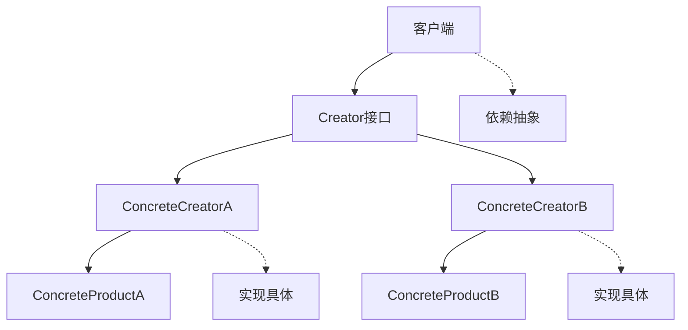
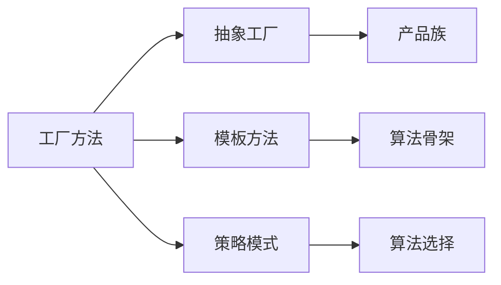

# 02-工厂方法模式 (Factory Method Pattern)

## 1. 形式化定义

### 1.1 数学定义

设 $C$ 为创建者类集合，$P$ 为产品类集合，工厂方法模式满足以下公理：

$$\forall c \in C, \exists f_c: \text{FactoryMethod} \rightarrow P$$

**形式化约束**：

- **抽象创建**: $\forall c \in C: \text{abstract}(c)$
- **具体创建**: $\forall p \in P: \exists c \in C: f_c() = p$
- **延迟绑定**: $\text{create}(p) \iff \text{runtime}(f_c)$

### 1.2 类型理论定义

```go
// 产品接口
type Product interface {
    Operation() string
    GetType() string
}

// 创建者接口
type Creator interface {
    FactoryMethod() Product
    SomeOperation() string
}
```

## 2. 实现原理

### 2.1 多态性保证

**定理**: 工厂方法模式实现了运行时多态性。

**证明**:

1. 创建者接口定义了抽象工厂方法
2. 具体创建者实现具体的工厂方法
3. 客户端通过接口调用，实现延迟绑定

```go
// 抽象创建者
type Creator interface {
    FactoryMethod() Product
    SomeOperation() string
}

// 具体创建者A
type ConcreteCreatorA struct{}

func (c *ConcreteCreatorA) FactoryMethod() Product {
    return &ConcreteProductA{}
}

func (c *ConcreteCreatorA) SomeOperation() string {
    product := c.FactoryMethod()
    return fmt.Sprintf("Creator A: %s", product.Operation())
}
```

### 2.2 依赖倒置分析



## 3. Go语言实现

### 3.1 基础实现

```go
package factory

import (
    "fmt"
    "time"
)

// Product 产品接口
type Product interface {
    Operation() string
    GetType() string
    GetCreatedAt() time.Time
}

// ConcreteProductA 具体产品A
type ConcreteProductA struct {
    createdAt time.Time
}

func NewConcreteProductA() *ConcreteProductA {
    return &ConcreteProductA{
        createdAt: time.Now(),
    }
}

func (p *ConcreteProductA) Operation() string {
    return "ConcreteProductA operation"
}

func (p *ConcreteProductA) GetType() string {
    return "ProductA"
}

func (p *ConcreteProductA) GetCreatedAt() time.Time {
    return p.createdAt
}

// ConcreteProductB 具体产品B
type ConcreteProductB struct {
    createdAt time.Time
}

func NewConcreteProductB() *ConcreteProductB {
    return &ConcreteProductB{
        createdAt: time.Now(),
    }
}

func (p *ConcreteProductB) Operation() string {
    return "ConcreteProductB operation"
}

func (p *ConcreteProductB) GetType() string {
    return "ProductB"
}

func (p *ConcreteProductB) GetCreatedAt() time.Time {
    return p.createdAt
}

// Creator 创建者接口
type Creator interface {
    FactoryMethod() Product
    SomeOperation() string
}

// ConcreteCreatorA 具体创建者A
type ConcreteCreatorA struct{}

func NewConcreteCreatorA() *ConcreteCreatorA {
    return &ConcreteCreatorA{}
}

func (c *ConcreteCreatorA) FactoryMethod() Product {
    return NewConcreteProductA()
}

func (c *ConcreteCreatorA) SomeOperation() string {
    product := c.FactoryMethod()
    return fmt.Sprintf("Creator A working with: %s", product.Operation())
}

// ConcreteCreatorB 具体创建者B
type ConcreteCreatorB struct{}

func NewConcreteCreatorB() *ConcreteCreatorB {
    return &ConcreteCreatorB{}
}

func (c *ConcreteCreatorB) FactoryMethod() Product {
    return NewConcreteProductB()
}

func (c *ConcreteCreatorB) SomeOperation() string {
    product := c.FactoryMethod()
    return fmt.Sprintf("Creator B working with: %s", product.Operation())
}
```

### 3.2 高级实现（带参数）

```go
// ParameterizedCreator 参数化创建者
type ParameterizedCreator interface {
    FactoryMethod(params map[string]interface{}) Product
    SomeOperation(params map[string]interface{}) string
}

// ConfigurableProduct 可配置产品
type ConfigurableProduct struct {
    config    map[string]interface{}
    createdAt time.Time
}

func NewConfigurableProduct(config map[string]interface{}) *ConfigurableProduct {
    return &ConfigurableProduct{
        config:    config,
        createdAt: time.Now(),
    }
}

func (p *ConfigurableProduct) Operation() string {
    if name, exists := p.config["name"]; exists {
        return fmt.Sprintf("ConfigurableProduct operation with name: %v", name)
    }
    return "ConfigurableProduct operation"
}

func (p *ConfigurableProduct) GetType() string {
    return "ConfigurableProduct"
}

func (p *ConfigurableProduct) GetCreatedAt() time.Time {
    return p.createdAt
}

func (p *ConfigurableProduct) GetConfig() map[string]interface{} {
    return p.config
}

// ConfigurableCreator 可配置创建者
type ConfigurableCreator struct{}

func NewConfigurableCreator() *ConfigurableCreator {
    return &ConfigurableCreator{}
}

func (c *ConfigurableCreator) FactoryMethod(params map[string]interface{}) Product {
    return NewConfigurableProduct(params)
}

func (c *ConfigurableCreator) SomeOperation(params map[string]interface{}) string {
    product := c.FactoryMethod(params)
    return fmt.Sprintf("ConfigurableCreator working with: %s", product.Operation())
}
```

## 4. 使用示例

### 4.1 基础使用

```go
package main

import (
    "fmt"
    
    "github.com/your-project/factory"
)

// ClientCode 客户端代码
func ClientCode(creator factory.Creator) {
    fmt.Println("Client: I'm not aware of the creator's class, but it still works.")
    fmt.Println(creator.SomeOperation())
}

func main() {
    fmt.Println("App: Launched with the ConcreteCreatorA.")
    creatorA := factory.NewConcreteCreatorA()
    ClientCode(creatorA)

    fmt.Println("\nApp: Launched with the ConcreteCreatorB.")
    creatorB := factory.NewConcreteCreatorB()
    ClientCode(creatorB)
}
```

### 4.2 参数化使用

```go
func parameterizedExample() {
    creator := factory.NewConfigurableCreator()
    
    // 创建带配置的产品
    params := map[string]interface{}{
        "name":    "TestProduct",
        "version": "1.0",
        "enabled": true,
    }
    
    product := creator.FactoryMethod(params)
    fmt.Printf("Created product: %s\n", product.GetType())
    fmt.Printf("Product operation: %s\n", product.Operation())
    
    // 使用配置
    if configurable, ok := product.(*factory.ConfigurableProduct); ok {
        config := configurable.GetConfig()
        fmt.Printf("Product config: %+v\n", config)
    }
}
```

## 5. 性能分析

### 5.1 时间复杂度

| 操作 | 时间复杂度 | 说明 |
|------|------------|------|
| 创建产品 | O(1) | 直接实例化 |
| 工厂方法调用 | O(1) | 方法调用开销 |
| 产品操作 | O(1) | 具体实现决定 |

### 5.2 空间复杂度

- **内存占用**: O(n) - n为产品实例数量
- **接口开销**: O(1) - 接口表查找
- **多态开销**: O(1) - 虚函数调用

## 6. 应用场景

### 6.1 适用场景

1. **框架开发**: 定义框架接口，用户实现具体产品
2. **插件系统**: 动态加载和创建插件
3. **配置驱动**: 根据配置创建不同产品
4. **测试模拟**: 创建测试替身
5. **跨平台**: 为不同平台创建适配产品

### 6.2 不适用场景

1. **简单对象创建**: 过度设计
2. **性能敏感**: 额外的抽象层开销
3. **固定产品**: 不需要扩展的产品

## 7. 设计模式关系

### 7.1 与其他模式的关系



## 8. 形式化验证

### 8.1 不变式验证

```go
// 验证工厂方法不变式
func VerifyFactoryMethodInvariant(creator Creator) bool {
    product1 := creator.FactoryMethod()
    product2 := creator.FactoryMethod()
    
    // 产品类型一致性
    if product1.GetType() != product2.GetType() {
        return false
    }
    
    // 产品行为一致性
    if product1.Operation() != product2.Operation() {
        return false
    }
    
    return true
}
```

## 9. 总结

工厂方法模式是创建型模式中的核心模式，它通过定义抽象创建者接口，让子类决定创建什么产品，实现了创建逻辑与使用逻辑的分离。

### 9.1 关键要点

1. **抽象创建**: 定义创建者接口
2. **具体实现**: 子类实现具体创建逻辑
3. **延迟绑定**: 运行时决定创建什么产品
4. **扩展性**: 易于添加新的产品类型

### 9.2 最佳实践

1. 使用接口定义创建者，而不是具体类
2. 考虑是否需要参数化工厂方法
3. 注意工厂方法的性能开销
4. 合理使用产品族概念

---

**下一模式**: [03-抽象工厂模式](./03-Abstract-Factory-Pattern.md)

**返回**: [创建型模式目录](./README.md)
