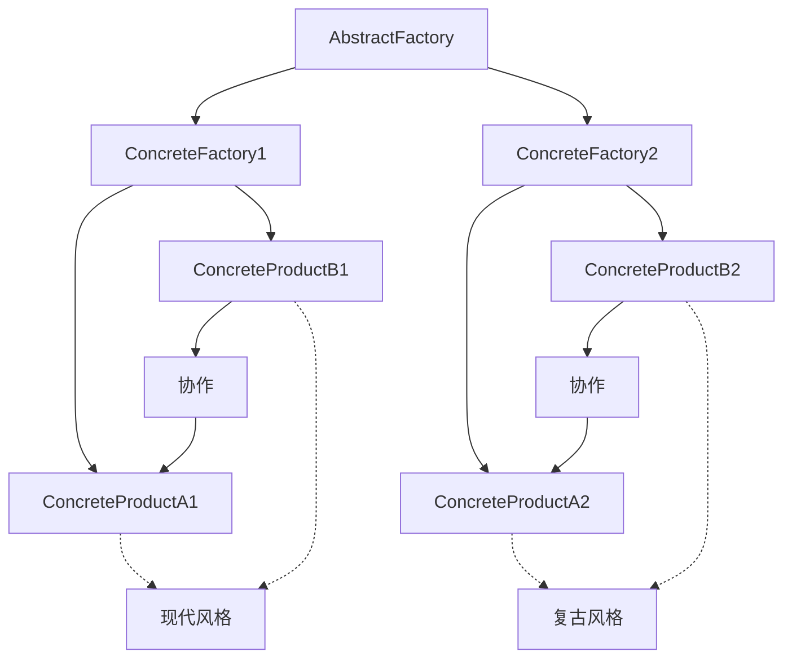
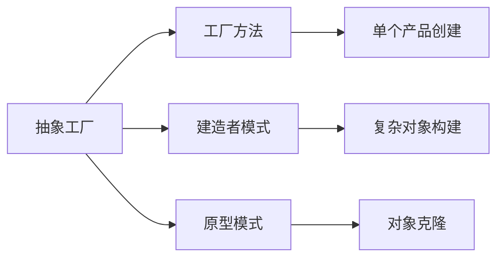

# 03-抽象工厂模式 (Abstract Factory Pattern)

## 1. 形式化定义

### 1.1 数学定义

设 $F$ 为工厂类集合，$P_A, P_B$ 为产品族集合，抽象工厂模式满足以下公理：

$$\forall f \in F, \exists f_A: F \rightarrow P_A, f_B: F \rightarrow P_B$$

**形式化约束**：

- **产品族一致性**: $\forall f \in F: \text{compatible}(f_A(f), f_B(f))$
- **抽象创建**: $\forall p \in P_A \cup P_B: \exists f \in F: \text{create}(f, p)$
- **族内约束**: $\text{family}(p_1, p_2) \iff \exists f: f_A(f) = p_1 \land f_B(f) = p_2$

### 1.2 类型理论定义

```go
// 抽象产品A
type AbstractProductA interface {
    UsefulFunctionA() string
}

// 抽象产品B
type AbstractProductB interface {
    UsefulFunctionB() string
    AnotherUsefulFunctionB(collaborator AbstractProductA) string
}

// 抽象工厂
type AbstractFactory interface {
    CreateProductA() AbstractProductA
    CreateProductB() AbstractProductB
}
```

## 2. 实现原理

### 2.1 产品族一致性

**定理**: 抽象工厂确保同一工厂创建的产品相互兼容。

**证明**:

1. 每个具体工厂实现完整的产品族
2. 产品族内的产品设计为相互协作
3. 工厂接口保证产品族的一致性

```go
// 抽象工厂接口
type AbstractFactory interface {
    CreateProductA() AbstractProductA
    CreateProductB() AbstractProductB
}

// 具体工厂1 - 现代风格
type ConcreteFactory1 struct{}

func (f *ConcreteFactory1) CreateProductA() AbstractProductA {
    return &ConcreteProductA1{}
}

func (f *ConcreteFactory1) CreateProductB() AbstractProductB {
    return &ConcreteProductB1{}
}

// 具体工厂2 - 复古风格
type ConcreteFactory2 struct{}

func (f *ConcreteFactory2) CreateProductA() AbstractProductA {
    return &ConcreteProductA2{}
}

func (f *ConcreteFactory2) CreateProductB() AbstractProductB {
    return &ConcreteProductB2{}
}
```

### 2.2 产品族协作分析



## 3. Go语言实现

### 3.1 基础实现

```go
package abstractfactory

import (
    "fmt"
    "time"
)

// AbstractProductA 抽象产品A
type AbstractProductA interface {
    UsefulFunctionA() string
    GetType() string
}

// ConcreteProductA1 具体产品A1
type ConcreteProductA1 struct {
    createdAt time.Time
}

func NewConcreteProductA1() *ConcreteProductA1 {
    return &ConcreteProductA1{
        createdAt: time.Now(),
    }
}

func (p *ConcreteProductA1) UsefulFunctionA() string {
    return "The result of the product A1."
}

func (p *ConcreteProductA1) GetType() string {
    return "ModernProductA"
}

// ConcreteProductA2 具体产品A2
type ConcreteProductA2 struct {
    createdAt time.Time
}

func NewConcreteProductA2() *ConcreteProductA2 {
    return &ConcreteProductA2{
        createdAt: time.Now(),
    }
}

func (p *ConcreteProductA2) UsefulFunctionA() string {
    return "The result of the product A2."
}

func (p *ConcreteProductA2) GetType() string {
    return "VintageProductA"
}

// AbstractProductB 抽象产品B
type AbstractProductB interface {
    UsefulFunctionB() string
    AnotherUsefulFunctionB(collaborator AbstractProductA) string
    GetType() string
}

// ConcreteProductB1 具体产品B1
type ConcreteProductB1 struct {
    createdAt time.Time
}

func NewConcreteProductB1() *ConcreteProductB1 {
    return &ConcreteProductB1{
        createdAt: time.Now(),
    }
}

func (p *ConcreteProductB1) UsefulFunctionB() string {
    return "The result of the product B1."
}

func (p *ConcreteProductB1) AnotherUsefulFunctionB(collaborator AbstractProductA) string {
    result := collaborator.UsefulFunctionA()
    return fmt.Sprintf("The result of the B1 collaborating with the (%s)", result)
}

func (p *ConcreteProductB1) GetType() string {
    return "ModernProductB"
}

// ConcreteProductB2 具体产品B2
type ConcreteProductB2 struct {
    createdAt time.Time
}

func NewConcreteProductB2() *ConcreteProductB2 {
    return &ConcreteProductB2{
        createdAt: time.Now(),
    }
}

func (p *ConcreteProductB2) UsefulFunctionB() string {
    return "The result of the product B2."
}

func (p *ConcreteProductB2) AnotherUsefulFunctionB(collaborator AbstractProductA) string {
    result := collaborator.UsefulFunctionA()
    return fmt.Sprintf("The result of the B2 collaborating with the (%s)", result)
}

func (p *ConcreteProductB2) GetType() string {
    return "VintageProductB"
}

// AbstractFactory 抽象工厂
type AbstractFactory interface {
    CreateProductA() AbstractProductA
    CreateProductB() AbstractProductB
}

// ConcreteFactory1 具体工厂1
type ConcreteFactory1 struct{}

func NewConcreteFactory1() *ConcreteFactory1 {
    return &ConcreteFactory1{}
}

func (f *ConcreteFactory1) CreateProductA() AbstractProductA {
    return NewConcreteProductA1()
}

func (f *ConcreteFactory1) CreateProductB() AbstractProductB {
    return NewConcreteProductB1()
}

// ConcreteFactory2 具体工厂2
type ConcreteFactory2 struct{}

func NewConcreteFactory2() *ConcreteFactory2 {
    return &ConcreteFactory2{}
}

func (f *ConcreteFactory2) CreateProductA() AbstractProductA {
    return NewConcreteProductA2()
}

func (f *ConcreteFactory2) CreateProductB() AbstractProductB {
    return NewConcreteProductB2()
}
```

### 3.2 高级实现（带配置）

```go
// ConfigurableFactory 可配置工厂
type ConfigurableFactory struct {
    config map[string]interface{}
}

func NewConfigurableFactory(config map[string]interface{}) *ConfigurableFactory {
    return &ConfigurableFactory{
        config: config,
    }
}

func (f *ConfigurableFactory) CreateProductA() AbstractProductA {
    if theme, exists := f.config["theme"]; exists {
        switch theme {
        case "modern":
            return NewConcreteProductA1()
        case "vintage":
            return NewConcreteProductA2()
        default:
            return NewConcreteProductA1()
        }
    }
    return NewConcreteProductA1()
}

func (f *ConfigurableFactory) CreateProductB() AbstractProductB {
    if theme, exists := f.config["theme"]; exists {
        switch theme {
        case "modern":
            return NewConcreteProductB1()
        case "vintage":
            return NewConcreteProductB2()
        default:
            return NewConcreteProductB1()
        }
    }
    return NewConcreteProductB1()
}

// ProductFamily 产品族接口
type ProductFamily interface {
    CreateProductA() AbstractProductA
    CreateProductB() AbstractProductB
    GetFamilyName() string
}

// ModernProductFamily 现代产品族
type ModernProductFamily struct{}

func (f *ModernProductFamily) CreateProductA() AbstractProductA {
    return NewConcreteProductA1()
}

func (f *ModernProductFamily) CreateProductB() AbstractProductB {
    return NewConcreteProductB1()
}

func (f *ModernProductFamily) GetFamilyName() string {
    return "Modern"
}

// VintageProductFamily 复古产品族
type VintageProductFamily struct{}

func (f *VintageProductFamily) CreateProductA() AbstractProductA {
    return NewConcreteProductA2()
}

func (f *VintageProductFamily) CreateProductB() AbstractProductB {
    return NewConcreteProductB2()
}

func (f *VintageProductFamily) GetFamilyName() string {
    return "Vintage"
}
```

## 4. 使用示例

### 4.1 基础使用

```go
package main

import (
    "fmt"
    
    "github.com/your-project/abstractfactory"
)

// ClientCode 客户端代码
func ClientCode(factory abstractfactory.AbstractFactory) {
    productA := factory.CreateProductA()
    productB := factory.CreateProductB()

    fmt.Println(productB.UsefulFunctionB())
    fmt.Println(productB.AnotherUsefulFunctionB(productA))
}

func main() {
    fmt.Println("Client: Testing client code with the first factory type...")
    factory1 := abstractfactory.NewConcreteFactory1()
    ClientCode(factory1)

    fmt.Println("\nClient: Testing the same client code with the second factory type...")
    factory2 := abstractfactory.NewConcreteFactory2()
    ClientCode(factory2)
}
```

### 4.2 产品族使用

```go
func productFamilyExample() {
    families := []abstractfactory.ProductFamily{
        &abstractfactory.ModernProductFamily{},
        &abstractfactory.VintageProductFamily{},
    }
    
    for _, family := range families {
        fmt.Printf("\n=== %s Product Family ===\n", family.GetFamilyName())
        
        productA := family.CreateProductA()
        productB := family.CreateProductB()
        
        fmt.Printf("ProductA: %s\n", productA.UsefulFunctionA())
        fmt.Printf("ProductB: %s\n", productB.UsefulFunctionB())
        fmt.Printf("Collaboration: %s\n", productB.AnotherUsefulFunctionB(productA))
    }
}
```

### 4.3 配置驱动示例

```go
func configurableExample() {
    configs := []map[string]interface{}{
        {"theme": "modern", "version": "1.0"},
        {"theme": "vintage", "version": "2.0"},
    }
    
    for _, config := range configs {
        factory := abstractfactory.NewConfigurableFactory(config)
        
        productA := factory.CreateProductA()
        productB := factory.CreateProductB()
        
        fmt.Printf("\nTheme: %s\n", config["theme"])
        fmt.Printf("ProductA Type: %s\n", productA.GetType())
        fmt.Printf("ProductB Type: %s\n", productB.GetType())
        fmt.Printf("Collaboration: %s\n", productB.AnotherUsefulFunctionB(productA))
    }
}
```

## 5. 性能分析

### 5.1 时间复杂度

| 操作 | 时间复杂度 | 说明 |
|------|------------|------|
| 创建产品族 | O(n) | n为产品族中产品数量 |
| 单个产品创建 | O(1) | 直接实例化 |
| 产品协作 | O(1) | 方法调用 |

### 5.2 空间复杂度

- **内存占用**: O(n×m) - n为工厂数量，m为产品族大小
- **接口开销**: O(1) - 接口表查找
- **产品族开销**: O(k) - k为产品族中产品类型数量

## 6. 应用场景

### 6.1 适用场景

1. **UI框架**: 不同主题的产品族
2. **数据库抽象**: 不同数据库的适配器族
3. **操作系统适配**: 不同平台的API族
4. **游戏引擎**: 不同渲染风格的对象族
5. **配置系统**: 不同配置风格的产品族

### 6.2 不适用场景

1. **简单对象创建**: 过度设计
2. **单一产品**: 不需要产品族
3. **频繁变化**: 产品族结构不稳定

## 7. 设计模式关系

### 7.1 与其他模式的关系



### 7.2 组合使用

```go
// 抽象工厂 + 建造者模式
type ComplexProductBuilder interface {
    BuildProductA() AbstractProductA
    BuildProductB() AbstractProductB
    BuildProductC() AbstractProductC
}

type ModernComplexBuilder struct {
    factory AbstractFactory
}

func (b *ModernComplexBuilder) BuildProductA() AbstractProductA {
    return b.factory.CreateProductA()
}

func (b *ModernComplexBuilder) BuildProductB() AbstractProductB {
    return b.factory.CreateProductB()
}

func (b *ModernComplexBuilder) BuildProductC() AbstractProductC {
    return &ModernProductC{}
}
```

## 8. 形式化验证

### 8.1 产品族一致性验证

```go
// 验证产品族一致性
func VerifyProductFamilyConsistency(factory AbstractFactory) bool {
    productA := factory.CreateProductA()
    productB := factory.CreateProductB()
    
    // 检查产品类型兼容性
    if !isCompatible(productA.GetType(), productB.GetType()) {
        return false
    }
    
    // 检查协作功能
    collaboration := productB.AnotherUsefulFunctionB(productA)
    if collaboration == "" {
        return false
    }
    
    return true
}

func isCompatible(typeA, typeB string) bool {
    // 现代产品族
    if typeA == "ModernProductA" && typeB == "ModernProductB" {
        return true
    }
    // 复古产品族
    if typeA == "VintageProductA" && typeB == "VintageProductB" {
        return true
    }
    return false
}
```

### 8.2 工厂替换性验证

```go
func TestFactorySubstitutability(t *testing.T) {
    factories := []AbstractFactory{
        NewConcreteFactory1(),
        NewConcreteFactory2(),
    }
    
    for _, factory := range factories {
        // 验证工厂可以创建所有产品
        productA := factory.CreateProductA()
        productB := factory.CreateProductB()
        
        if productA == nil {
            t.Error("Factory failed to create ProductA")
        }
        
        if productB == nil {
            t.Error("Factory failed to create ProductB")
        }
        
        // 验证产品协作
        collaboration := productB.AnotherUsefulFunctionB(productA)
        if collaboration == "" {
            t.Error("Products failed to collaborate")
        }
    }
}
```

## 9. 总结

抽象工厂模式是创建型模式中的高级模式，它通过定义抽象工厂接口，确保创建的产品族内部相互兼容，同时支持产品族的扩展。

### 9.1 关键要点

1. **产品族一致性**: 同一工厂创建的产品相互兼容
2. **抽象创建**: 定义抽象工厂接口
3. **族内协作**: 产品族内产品可以相互协作
4. **扩展性**: 易于添加新的产品族

### 9.2 最佳实践

1. 确保产品族内产品设计为相互协作
2. 使用接口定义抽象工厂和产品
3. 考虑产品族的配置驱动
4. 注意产品族的版本管理

### 9.3 与Go语言的结合

Go语言的接口和组合机制非常适合抽象工厂模式：

- 接口定义产品族契约
- 结构体实现具体产品
- 组合实现产品族
- 简洁的类型系统

---

**下一模式**: [04-建造者模式](./04-Builder-Pattern.md)

**返回**: [创建型模式目录](./README.md)
