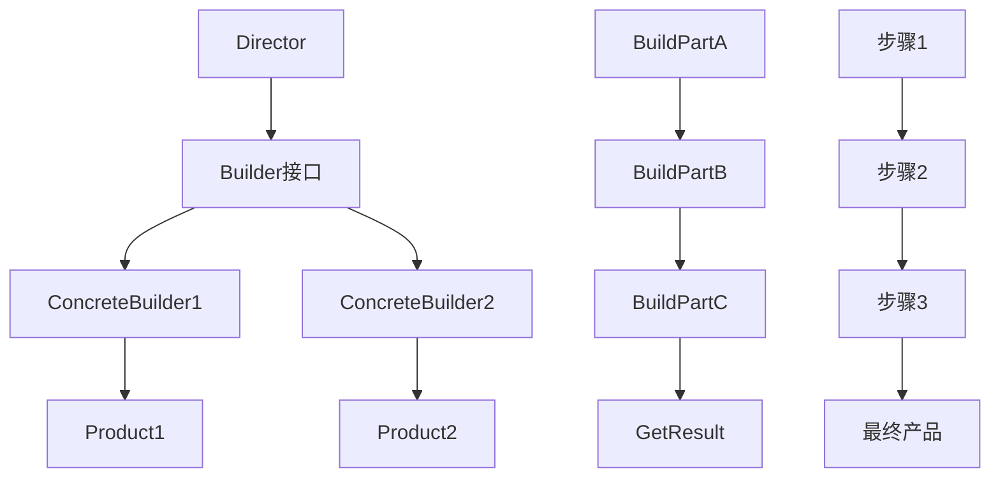
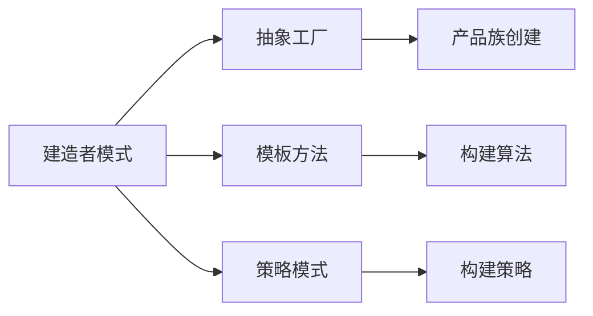

# 04-建造者模式 (Builder Pattern)

## 1. 形式化定义

### 1.1 数学定义

设 ```latex
B
``` 为建造者集合，```latex
P
``` 为产品集合，```latex
S
``` 为构建步骤集合，建造者模式满足以下公理：

$```latex
\forall b \in B, \exists f_b: S^* \rightarrow P
```$

**形式化约束**：

- **分步构建**: ```latex
\forall p \in P: \exists s_1, s_2, ..., s_n \in S: f_b(s_1, s_2, ..., s_n) = p
```
- **构建顺序**: ```latex
\text{valid}(s_1, s_2, ..., s_n) \iff \text{order}(s_i) \leq \text{order}(s_{i+1})
```
- **最终产品**: ```latex
\text{complete}(p) \iff \forall s \in S: \text{applied}(s, p)
```

### 1.2 类型理论定义

```go
// 产品接口
type Product interface {
    GetParts() []string
    Show() string
}

// 建造者接口
type Builder interface {
    BuildPartA()
    BuildPartB()
    BuildPartC()
    GetResult() Product
    Reset()
}
```

## 2. 实现原理

### 2.1 分步构建保证

**定理**: 建造者模式确保复杂对象的分步构建。

**证明**:

1. 建造者接口定义构建步骤
2. 每个步骤独立执行
3. 最终组装完整产品

```go
// 抽象建造者
type Builder interface {
    BuildPartA()
    BuildPartB()
    BuildPartC()
    GetResult() Product
    Reset()
}

// 具体建造者
type ConcreteBuilder struct {
    product *Product
}

func (b *ConcreteBuilder) BuildPartA() {
    b.product.AddPart("PartA")
}

func (b *ConcreteBuilder) BuildPartB() {
    b.product.AddPart("PartB")
}

func (b *ConcreteBuilder) BuildPartC() {
    b.product.AddPart("PartC")
}
```

### 2.2 构建流程分析



## 3. Go语言实现

### 3.1 基础实现

```go
package builder

import (
    "fmt"
    "strings"
    "time"
)

// Product 产品
type Product struct {
    parts     []string
    createdAt time.Time
}

func NewProduct() *Product {
    return &Product{
        parts:     make([]string, 0),
        createdAt: time.Now(),
    }
}

func (p *Product) AddPart(part string) {
    p.parts = append(p.parts, part)
}

func (p *Product) GetParts() []string {
    return p.parts
}

func (p *Product) Show() string {
    return fmt.Sprintf("Product parts: %s", strings.Join(p.parts, ", "))
}

func (p *Product) GetCreatedAt() time.Time {
    return p.createdAt
}

// Builder 建造者接口
type Builder interface {
    BuildPartA()
    BuildPartB()
    BuildPartC()
    GetResult() *Product
    Reset()
}

// ConcreteBuilder1 具体建造者1
type ConcreteBuilder1 struct {
    product *Product
}

func NewConcreteBuilder1() *ConcreteBuilder1 {
    return &ConcreteBuilder1{
        product: NewProduct(),
    }
}

func (b *ConcreteBuilder1) BuildPartA() {
    b.product.AddPart("PartA1")
}

func (b *ConcreteBuilder1) BuildPartB() {
    b.product.AddPart("PartB1")
}

func (b *ConcreteBuilder1) BuildPartC() {
    b.product.AddPart("PartC1")
}

func (b *ConcreteBuilder1) GetResult() *Product {
    return b.product
}

func (b *ConcreteBuilder1) Reset() {
    b.product = NewProduct()
}

// ConcreteBuilder2 具体建造者2
type ConcreteBuilder2 struct {
    product *Product
}

func NewConcreteBuilder2() *ConcreteBuilder2 {
    return &ConcreteBuilder2{
        product: NewProduct(),
    }
}

func (b *ConcreteBuilder2) BuildPartA() {
    b.product.AddPart("PartA2")
}

func (b *ConcreteBuilder2) BuildPartB() {
    b.product.AddPart("PartB2")
}

func (b *ConcreteBuilder2) BuildPartC() {
    b.product.AddPart("PartC2")
}

func (b *ConcreteBuilder2) GetResult() *Product {
    return b.product
}

func (b *ConcreteBuilder2) Reset() {
    b.product = NewProduct()
}

// Director 指导者
type Director struct {
    builder Builder
}

func NewDirector(builder Builder) *Director {
    return &Director{
        builder: builder,
    }
}

func (d *Director) SetBuilder(builder Builder) {
    d.builder = builder
}

func (d *Director) BuildMinimalViableProduct() *Product {
    d.builder.Reset()
    d.builder.BuildPartA()
    return d.builder.GetResult()
}

func (d *Director) BuildFullFeaturedProduct() *Product {
    d.builder.Reset()
    d.builder.BuildPartA()
    d.builder.BuildPartB()
    d.builder.BuildPartC()
    return d.builder.GetResult()
}
```

### 3.2 高级实现（方法链）

```go
// FluentBuilder 流式建造者
type FluentBuilder struct {
    product *Product
}

func NewFluentBuilder() *FluentBuilder {
    return &FluentBuilder{
        product: NewProduct(),
    }
}

func (b *FluentBuilder) BuildPartA() *FluentBuilder {
    b.product.AddPart("PartA")
    return b
}

func (b *FluentBuilder) BuildPartB() *FluentBuilder {
    b.product.AddPart("PartB")
    return b
}

func (b *FluentBuilder) BuildPartC() *FluentBuilder {
    b.product.AddPart("PartC")
    return b
}

func (b *FluentBuilder) BuildPartD(part string) *FluentBuilder {
    b.product.AddPart(fmt.Sprintf("PartD-%s", part))
    return b
}

func (b *FluentBuilder) Build() *Product {
    return b.product
}

func (b *FluentBuilder) Reset() *FluentBuilder {
    b.product = NewProduct()
    return b
}

// ConfigurableBuilder 可配置建造者
type ConfigurableBuilder struct {
    product *Product
    config  map[string]interface{}
}

func NewConfigurableBuilder(config map[string]interface{}) *ConfigurableBuilder {
    return &ConfigurableBuilder{
        product: NewProduct(),
        config:  config,
    }
}

func (b *ConfigurableBuilder) BuildPartA() *ConfigurableBuilder {
    if enabled, exists := b.config["partA"]; exists && enabled.(bool) {
        b.product.AddPart("PartA")
    }
    return b
}

func (b *ConfigurableBuilder) BuildPartB() *ConfigurableBuilder {
    if enabled, exists := b.config["partB"]; exists && enabled.(bool) {
        b.product.AddPart("PartB")
    }
    return b
}

func (b *ConfigurableBuilder) BuildPartC() *ConfigurableBuilder {
    if enabled, exists := b.config["partC"]; exists && enabled.(bool) {
        b.product.AddPart("PartC")
    }
    return b
}

func (b *ConfigurableBuilder) Build() *Product {
    return b.product
}
```

## 4. 使用示例

### 4.1 基础使用

```go
package main

import (
    "fmt"
    
    "github.com/your-project/builder"
)

func main() {
    // 使用指导者模式
    concreteBuilder1 := builder.NewConcreteBuilder1()
    director := builder.NewDirector(concreteBuilder1)
    
    fmt.Println("Standard basic product:")
    basicProduct := director.BuildMinimalViableProduct()
    fmt.Println(basicProduct.Show())
    
    fmt.Println("\nStandard full featured product:")
    fullProduct := director.BuildFullFeaturedProduct()
    fmt.Println(fullProduct.Show())
    
    // 使用不同的建造者
    concreteBuilder2 := builder.NewConcreteBuilder2()
    director.SetBuilder(concreteBuilder2)
    
    fmt.Println("\nCustom product:")
    customProduct := director.BuildFullFeaturedProduct()
    fmt.Println(customProduct.Show())
}
```

### 4.2 流式构建

```go
func fluentBuilderExample() {
    // 流式构建
    fluentBuilder := builder.NewFluentBuilder()
    
    product := fluentBuilder.
        BuildPartA().
        BuildPartB().
        BuildPartD("Custom").
        Build()
    
    fmt.Printf("Fluent built product: %s\n", product.Show())
    
    // 重置并重新构建
    product2 := fluentBuilder.
        Reset().
        BuildPartA().
        BuildPartC().
        Build()
    
    fmt.Printf("Reset and rebuilt product: %s\n", product2.Show())
}
```

### 4.3 配置驱动构建

```go
func configurableBuilderExample() {
    configs := []map[string]interface{}{
        {"partA": true, "partB": true, "partC": false},
        {"partA": true, "partB": false, "partC": true},
        {"partA": true, "partB": true, "partC": true},
    }
    
    for i, config := range configs {
        builder := builder.NewConfigurableBuilder(config)
        
        product := builder.
            BuildPartA().
            BuildPartB().
            BuildPartC().
            Build()
        
        fmt.Printf("Config %d product: %s\n", i+1, product.Show())
    }
}
```

## 5. 性能分析

### 5.1 时间复杂度

| 操作 | 时间复杂度 | 说明 |
|------|------------|------|
| 单个步骤构建 | O(1) | 直接添加部件 |
| 完整产品构建 | O(n) | n为构建步骤数量 |
| 产品展示 | O(n) | n为部件数量 |

### 5.2 空间复杂度

- **内存占用**: O(n) - n为产品部件数量
- **建造者开销**: O(1) - 建造者状态
- **指导者开销**: O(1) - 指导者状态

## 6. 应用场景

### 6.1 适用场景

1. **复杂对象创建**: 需要多个步骤构建的对象
2. **配置驱动**: 根据配置构建不同产品
3. **参数化构建**: 构建过程需要参数
4. **构建顺序控制**: 需要控制构建步骤顺序
5. **产品族构建**: 构建相关但不同的产品

### 6.2 不适用场景

1. **简单对象**: 直接构造即可
2. **不可变对象**: 构建后不需要修改
3. **性能敏感**: 构建过程开销过大

## 7. 设计模式关系

### 7.1 与其他模式的关系



### 7.2 组合使用

```go
// 建造者 + 抽象工厂
type ProductBuilderFactory interface {
    CreateBuilder(productType string) Builder
}

type ConcreteProductBuilderFactory struct{}

func (f *ConcreteProductBuilderFactory) CreateBuilder(productType string) Builder {
    switch productType {
    case "type1":
        return NewConcreteBuilder1()
    case "type2":
        return NewConcreteBuilder2()
    default:
        return NewConcreteBuilder1()
    }
}

// 建造者 + 策略模式
type BuildStrategy interface {
    Build(builder Builder) *Product
}

type MinimalBuildStrategy struct{}

func (s *MinimalBuildStrategy) Build(builder Builder) *Product {
    builder.Reset()
    builder.BuildPartA()
    return builder.GetResult()
}

type FullBuildStrategy struct{}

func (s *FullBuildStrategy) Build(builder Builder) *Product {
    builder.Reset()
    builder.BuildPartA()
    builder.BuildPartB()
    builder.BuildPartC()
    return builder.GetResult()
}
```

## 8. 形式化验证

### 8.1 构建完整性验证

```go
// 验证构建完整性
func VerifyBuildCompleteness(builder Builder, expectedParts []string) bool {
    builder.Reset()
    builder.BuildPartA()
    builder.BuildPartB()
    builder.BuildPartC()
    
    product := builder.GetResult()
    actualParts := product.GetParts()
    
    if len(actualParts) != len(expectedParts) {
        return false
    }
    
    for i, part := range expectedParts {
        if actualParts[i] != part {
            return false
        }
    }
    
    return true
}
```

### 8.2 构建顺序验证

```go
func TestBuildOrder(t *testing.T) {
    builder := NewConcreteBuilder1()
    
    // 测试构建顺序
    builder.Reset()
    builder.BuildPartA()
    builder.BuildPartB()
    builder.BuildPartC()
    
    product := builder.GetResult()
    parts := product.GetParts()
    
    expectedOrder := []string{"PartA1", "PartB1", "PartC1"}
    
    for i, expected := range expectedOrder {
        if parts[i] != expected {
            t.Errorf("Expected part %s at position %d, got %s", expected, i, parts[i])
        }
    }
}
```

## 9. 总结

建造者模式是创建型模式中的重要模式，它通过分步构建复杂对象，提供了灵活的对象创建机制。

### 9.1 关键要点

1. **分步构建**: 将复杂对象的构建分解为多个步骤
2. **构建控制**: 通过指导者控制构建过程
3. **产品隔离**: 构建过程与产品表示分离
4. **扩展性**: 易于添加新的构建步骤

### 9.2 最佳实践

1. 使用流式接口提高代码可读性
2. 考虑配置驱动的构建过程
3. 合理使用指导者模式
4. 注意构建步骤的顺序控制

### 9.3 与Go语言的结合

Go语言的方法链和接口机制非常适合建造者模式：

- 方法链实现流式构建
- 接口定义构建契约
- 结构体实现具体构建逻辑
- 简洁的错误处理

---

**下一模式**: [05-原型模式](./05-Prototype-Pattern.md)

**返回**: [创建型模式目录](./README.md)
