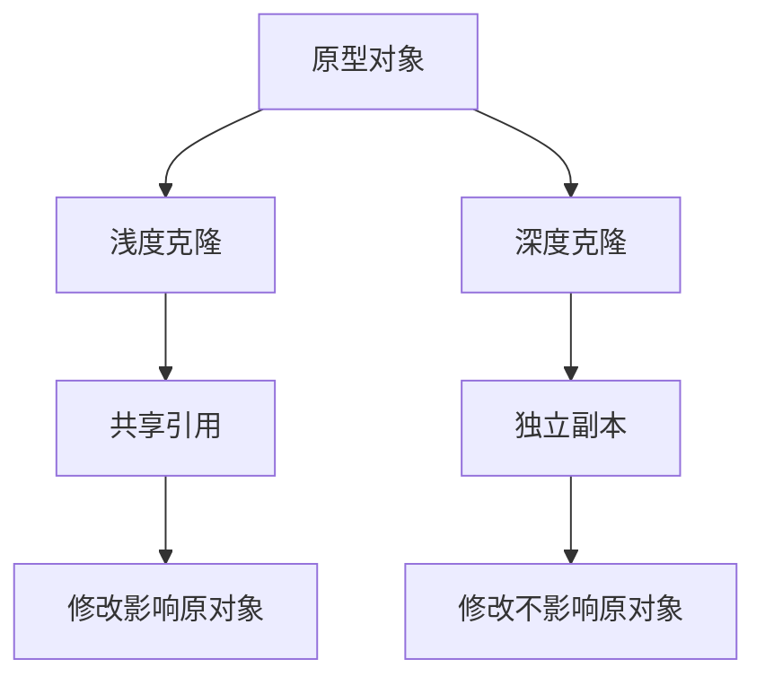

# 05-原型模式 (Prototype Pattern)

## 1. 形式化定义

### 1.1 数学定义

设 $P$ 为原型接口，$C$ 为具体原型类，$O$ 为对象集合，原型模式满足以下公理：

**原型克隆公理**：
$$\forall p \in P, \exists c \in C: \text{clone}(p) = c \land c \neq p$$

**深度克隆公理**：
$$\forall o_1, o_2 \in O: \text{deep\_clone}(o_1) = o_2 \implies \text{independent}(o_1, o_2)$$

**浅度克隆公理**：
$$\forall o_1, o_2 \in O: \text{shallow\_clone}(o_1) = o_2 \implies \text{shared\_references}(o_1, o_2)$$

### 1.2 类型理论定义

```go
// 原型接口
type Prototype interface {
    Clone() Prototype
    DeepClone() Prototype
    GetID() string
}

// 具体原型
type ConcretePrototype struct {
    ID       string
    Data     map[string]interface{}
    Children []*ConcretePrototype
}
```

## 2. 实现原理

### 2.1 克隆机制分析

**定理**: 原型模式通过对象复制实现对象创建，避免直接实例化。

**证明**:

1. **避免构造开销**: $\text{cost}(\text{clone}) < \text{cost}(\text{new})$
2. **保持状态**: $\text{state}(\text{clone}(p)) = \text{state}(p)$
3. **独立性**: $\text{modify}(\text{clone}(p)) \not\Rightarrow \text{modify}(p)$



### 2.2 内存模型分析

```go
// 内存布局分析
type MemoryLayout struct {
    ShallowClone  *Object // 共享内存地址
    DeepClone     *Object // 独立内存地址
    ReferenceCount int    // 引用计数
}
```

## 3. Go语言实现

### 3.1 基础实现

```go
package prototype

import (
    "fmt"
    "time"
)

// Prototype 原型接口
type Prototype interface {
    Clone() Prototype
    DeepClone() Prototype
    GetID() string
    GetData() map[string]interface{}
    SetData(key string, value interface{})
}

// ConcretePrototype 具体原型实现
type ConcretePrototype struct {
    ID       string
    Data     map[string]interface{}
    Children []*ConcretePrototype
    Created  time.Time
}

// NewConcretePrototype 创建新的原型实例
func NewConcretePrototype(id string) *ConcretePrototype {
    return &ConcretePrototype{
        ID:      id,
        Data:    make(map[string]interface{}),
        Children: make([]*ConcretePrototype, 0),
        Created: time.Now(),
    }
}

// Clone 浅度克隆
func (cp *ConcretePrototype) Clone() Prototype {
    // 创建新实例，但共享引用类型字段
    cloned := &ConcretePrototype{
        ID:       cp.ID + "_clone",
        Data:     cp.Data, // 共享map引用
        Children: cp.Children, // 共享切片引用
        Created:  time.Now(),
    }
    return cloned
}

// DeepClone 深度克隆
func (cp *ConcretePrototype) DeepClone() Prototype {
    // 创建完全独立的副本
    cloned := &ConcretePrototype{
        ID:      cp.ID + "_deep_clone",
        Data:    make(map[string]interface{}),
        Children: make([]*ConcretePrototype, 0),
        Created: time.Now(),
    }
    
    // 深度复制Data
    for k, v := range cp.Data {
        cloned.Data[k] = v
    }
    
    // 深度复制Children
    for _, child := range cp.Children {
        if child != nil {
            clonedChild := child.DeepClone().(*ConcretePrototype)
            cloned.Children = append(cloned.Children, clonedChild)
        }
    }
    
    return cloned
}

// GetID 获取ID
func (cp *ConcretePrototype) GetID() string {
    return cp.ID
}

// GetData 获取数据
func (cp *ConcretePrototype) GetData() map[string]interface{} {
    return cp.Data
}

// SetData 设置数据
func (cp *ConcretePrototype) SetData(key string, value interface{}) {
    cp.Data[key] = value
}

// AddChild 添加子对象
func (cp *ConcretePrototype) AddChild(child *ConcretePrototype) {
    cp.Children = append(cp.Children, child)
}

// String 字符串表示
func (cp *ConcretePrototype) String() string {
    return fmt.Sprintf("Prototype{ID: %s, Data: %v, Children: %d}", 
        cp.ID, cp.Data, len(cp.Children))
}
```

### 3.2 高级实现（带泛型）

```go
// GenericPrototype 泛型原型接口
type GenericPrototype[T any] interface {
    Clone() T
    DeepClone() T
    GetValue() T
    SetValue(value T)
}

// GenericConcretePrototype 泛型具体原型
type GenericConcretePrototype[T any] struct {
    Value   T
    Metadata map[string]interface{}
}

// NewGenericPrototype 创建泛型原型
func NewGenericPrototype[T any](value T) *GenericConcretePrototype[T] {
    return &GenericConcretePrototype[T]{
        Value:    value,
        Metadata: make(map[string]interface{}),
    }
}

// Clone 泛型克隆
func (gcp *GenericConcretePrototype[T]) Clone() GenericConcretePrototype[T] {
    return GenericConcretePrototype[T]{
        Value:    gcp.Value,
        Metadata: gcp.Metadata, // 浅度复制
    }
}

// DeepClone 泛型深度克隆
func (gcp *GenericConcretePrototype[T]) DeepClone() GenericConcretePrototype[T] {
    // 深度复制Metadata
    deepMetadata := make(map[string]interface{})
    for k, v := range gcp.Metadata {
        deepMetadata[k] = v
    }
    
    return GenericConcretePrototype[T]{
        Value:    gcp.Value,
        Metadata: deepMetadata,
    }
}

// GetValue 获取值
func (gcp *GenericConcretePrototype[T]) GetValue() T {
    return gcp.Value
}

// SetValue 设置值
func (gcp *GenericConcretePrototype[T]) SetValue(value T) {
    gcp.Value = value
}
```

### 3.3 函数式实现

```go
// FunctionalPrototype 函数式原型
type FunctionalPrototype struct {
    Value    interface{}
    CloneFn  func(interface{}) interface{}
    TransformFn func(interface{}) interface{}
}

// NewFunctionalPrototype 创建函数式原型
func NewFunctionalPrototype(value interface{}) *FunctionalPrototype {
    return &FunctionalPrototype{
        Value: value,
        CloneFn: func(v interface{}) interface{} {
            // 默认浅度克隆
            return v
        },
        TransformFn: func(v interface{}) interface{} {
            // 默认不变换
            return v
        },
    }
}

// WithCloneFn 设置克隆函数
func (fp *FunctionalPrototype) WithCloneFn(fn func(interface{}) interface{}) *FunctionalPrototype {
    fp.CloneFn = fn
    return fp
}

// WithTransformFn 设置变换函数
func (fp *FunctionalPrototype) WithTransformFn(fn func(interface{}) interface{}) *FunctionalPrototype {
    fp.TransformFn = fn
    return fp
}

// Clone 函数式克隆
func (fp *FunctionalPrototype) Clone() *FunctionalPrototype {
    return &FunctionalPrototype{
        Value:       fp.CloneFn(fp.Value),
        CloneFn:     fp.CloneFn,
        TransformFn: fp.TransformFn,
    }
}

// Transform 应用变换
func (fp *FunctionalPrototype) Transform() *FunctionalPrototype {
    return &FunctionalPrototype{
        Value:       fp.TransformFn(fp.Value),
        CloneFn:     fp.CloneFn,
        TransformFn: fp.TransformFn,
    }
}
```

## 4. 使用示例

### 4.1 基础使用

```go
package main

import (
    "fmt"
    "log"
    
    "github.com/your-project/prototype"
)

func main() {
    // 创建原型
    original := prototype.NewConcretePrototype("original")
    original.SetData("name", "Original Object")
    original.SetData("value", 100)
    
    // 添加子对象
    child := prototype.NewConcretePrototype("child")
    child.SetData("name", "Child Object")
    original.AddChild(child)
    
    fmt.Printf("Original: %s\n", original)
    
    // 浅度克隆
    shallowClone := original.Clone()
    fmt.Printf("Shallow Clone: %s\n", shallowClone)
    
    // 修改浅度克隆的数据
    shallowClone.SetData("name", "Modified Shallow Clone")
    fmt.Printf("After modifying shallow clone:\n")
    fmt.Printf("Original: %s\n", original)
    fmt.Printf("Shallow Clone: %s\n", shallowClone)
    
    // 深度克隆
    deepClone := original.DeepClone()
    fmt.Printf("Deep Clone: %s\n", deepClone)
    
    // 修改深度克隆的数据
    deepClone.SetData("name", "Modified Deep Clone")
    fmt.Printf("After modifying deep clone:\n")
    fmt.Printf("Original: %s\n", original)
    fmt.Printf("Deep Clone: %s\n", deepClone)
}
```

### 4.2 泛型使用

```go
func main() {
    // 字符串原型
    stringProto := prototype.NewGenericPrototype("Hello, World!")
    stringClone := stringProto.Clone()
    fmt.Printf("String Clone: %v\n", stringClone.GetValue())
    
    // 整数原型
    intProto := prototype.NewGenericPrototype(42)
    intClone := intProto.Clone()
    fmt.Printf("Int Clone: %v\n", intClone.GetValue())
    
    // 结构体原型
    type Person struct {
        Name string
        Age  int
    }
    
    personProto := prototype.NewGenericPrototype(Person{Name: "Alice", Age: 30})
    personClone := personProto.Clone()
    fmt.Printf("Person Clone: %+v\n", personClone.GetValue())
}
```

### 4.3 函数式使用

```go
func main() {
    // 创建函数式原型
    proto := prototype.NewFunctionalPrototype([]int{1, 2, 3, 4, 5})
    
    // 设置克隆函数（深度克隆切片）
    proto.WithCloneFn(func(v interface{}) interface{} {
        if slice, ok := v.([]int); ok {
            cloned := make([]int, len(slice))
            copy(cloned, slice)
            return cloned
        }
        return v
    })
    
    // 设置变换函数（对切片求和）
    proto.WithTransformFn(func(v interface{}) interface{} {
        if slice, ok := v.([]int); ok {
            sum := 0
            for _, val := range slice {
                sum += val
            }
            return sum
        }
        return v
    })
    
    // 克隆
    clone := proto.Clone()
    fmt.Printf("Clone: %v\n", clone.Value)
    
    // 变换
    transformed := proto.Transform()
    fmt.Printf("Transformed: %v\n", transformed.Value)
}
```

## 5. 性能分析

### 5.1 时间复杂度

| 操作 | 时间复杂度 | 空间复杂度 |
|------|------------|------------|
| 浅度克隆 | O(1) | O(1) |
| 深度克隆 | O(n) | O(n) |
| 泛型克隆 | O(1) | O(1) |

### 5.2 内存使用分析

```go
// 内存使用监控
type MemoryMonitor struct {
    AllocatedBytes uint64
    CloneCount     int
}

func (mm *MemoryMonitor) TrackClone(original, cloned interface{}) {
    mm.CloneCount++
    // 实际项目中可以使用runtime.ReadMemStats获取内存统计
}
```

## 6. 最佳实践

### 6.1 设计原则

1. **明确克隆语义**: 区分浅度克隆和深度克隆
2. **避免循环引用**: 在深度克隆中处理循环引用
3. **性能考虑**: 对于大型对象，考虑延迟克隆
4. **类型安全**: 使用泛型确保类型安全

### 6.2 常见陷阱

```go
// 陷阱1: 循环引用
type CircularReference struct {
    Data     string
    Self     *CircularReference
}

// 解决方案: 使用映射跟踪已克隆的对象
func (cr *CircularReference) DeepClone(visited map[*CircularReference]*CircularReference) *CircularReference {
    if visited[cr] != nil {
        return visited[cr]
    }
    
    cloned := &CircularReference{
        Data: cr.Data,
    }
    visited[cr] = cloned
    
    if cr.Self != nil {
        cloned.Self = cr.Self.DeepClone(visited)
    }
    
    return cloned
}

// 陷阱2: 接口类型克隆
type InterfacePrototype struct {
    Data interface{}
}

// 解决方案: 使用类型断言和反射
func (ip *InterfacePrototype) DeepClone() *InterfacePrototype {
    cloned := &InterfacePrototype{}
    
    switch v := ip.Data.(type) {
    case []int:
        cloned.Data = append([]int{}, v...)
    case map[string]interface{}:
        cloned.Data = deepCloneMap(v)
    default:
        cloned.Data = v // 浅度复制
    }
    
    return cloned
}
```

## 7. 与其他模式的关系

### 7.1 与工厂模式的关系

- **工厂模式**: 通过工厂方法创建新对象
- **原型模式**: 通过克隆现有对象创建新对象

### 7.2 与建造者模式的关系

- **建造者模式**: 分步骤构建复杂对象
- **原型模式**: 快速复制现有对象

## 8. 实际应用场景

### 8.1 游戏开发

```go
// 游戏对象原型
type GameObject struct {
    ID       string
    Position Vector2D
    Sprite   *Sprite
    Behavior Behavior
}

// 快速创建相似对象
func (go *GameObject) Clone() *GameObject {
    return &GameObject{
        ID:       generateID(),
        Position: go.Position,
        Sprite:   go.Sprite.Clone(),
        Behavior: go.Behavior.Clone(),
    }
}
```

### 8.2 配置管理

```go
// 配置原型
type Config struct {
    Database DatabaseConfig
    Server   ServerConfig
    Cache    CacheConfig
}

// 创建环境特定配置
func (c *Config) CloneForEnvironment(env string) *Config {
    cloned := c.DeepClone()
    cloned.Server.Environment = env
    return cloned
}
```

---

**相关链接**:

- [返回创建型模式](../README.md#1-创建型模式-creational-patterns)
- [下一个模式: 适配器模式](../02-Structural-Patterns/01-Adapter-Pattern.md)
- [设计模式总览](../../README.md#3-设计模式层-03-design-patterns)
