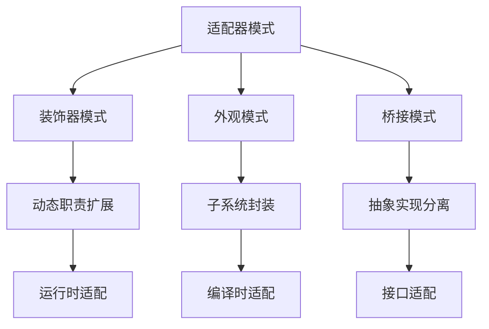

# 适配器模式 (Adapter Pattern)

## 概述

适配器模式是一种结构型设计模式，它允许不兼容的接口能够一起工作。适配器模式通过包装一个对象，使其接口与客户端期望的接口兼容。

## 形式化定义

### 数学定义

设 $T$ 为目标接口，$A$ 为适配器，$S$ 为源对象，适配器模式满足以下公理：

$$\forall s \in S, \exists a \in A: \text{adapt}(s) \rightarrow T$$

**形式化约束**：

- **接口转换**: $\forall t \in T: \exists s \in S: \text{map}(s, t)$
- **功能保持**: $\text{function}(s) \iff \text{function}(\text{adapt}(s))$
- **透明性**: $\text{client}(t) \land \text{use}(a) \implies \text{unaware}(s)$

### 类型理论定义

```go
// 目标接口
type Target interface {
    Request() string
}

// 源对象
type Adaptee struct {
    SpecificRequest() string
}

// 适配器
type Adapter struct {
    adaptee *Adaptee
}
```

## Go语言实现

### 1. 类适配器模式

```go
package adapter

import (
 "fmt"
 "math"
)

// Target 目标接口
type Target interface {
 Request() string
}

// Adaptee 源接口
type Adaptee interface {
 SpecificRequest() string
}

// ConcreteAdaptee 具体源类
type ConcreteAdaptee struct{}

func (a *ConcreteAdaptee) SpecificRequest() string {
 return "Specific request from adaptee"
}

// ClassAdapter 类适配器
type ClassAdapter struct {
 *ConcreteAdaptee
}

func NewClassAdapter() *ClassAdapter {
 return &ClassAdapter{
  ConcreteAdaptee: &ConcreteAdaptee{},
 }
}

func (a *ClassAdapter) Request() string {
 // 调用源接口方法并转换
 result := a.SpecificRequest()
 return fmt.Sprintf("ClassAdapter: %s", result)
}
```

### 2. 对象适配器模式

```go
package adapter

// ObjectAdapter 对象适配器
type ObjectAdapter struct {
 adaptee Adaptee
}

func NewObjectAdapter(adaptee Adaptee) *ObjectAdapter {
 return &ObjectAdapter{adaptee: adaptee}
}

func (a *ObjectAdapter) Request() string {
 // 转换逻辑
 result := a.adaptee.SpecificRequest()
 return fmt.Sprintf("ObjectAdapter: %s", result)
}
```

### 3. 双向适配器

```go
package adapter

// TwoWayAdapter 双向适配器
type TwoWayAdapter struct {
 target  Target
 adaptee Adaptee
}

func NewTwoWayAdapter(target Target, adaptee Adaptee) *TwoWayAdapter {
 return &TwoWayAdapter{
  target:  target,
  adaptee: adaptee,
 }
}

func (a *TwoWayAdapter) Request() string {
 return a.target.Request()
}

func (a *TwoWayAdapter) SpecificRequest() string {
 return a.adaptee.SpecificRequest()
}
```

## 实际应用示例

### 1. 数据格式适配器

```go
package adapter

import (
 "encoding/json"
 "encoding/xml"
)

// JSONData JSON数据
type JSONData struct {
 Name string `json:"name"`
 Age  int    `json:"age"`
}

// XMLData XML数据
type XMLData struct {
 Name string `xml:"name"`
 Age  int    `xml:"age"`
}

// DataProcessor 数据处理接口
type DataProcessor interface {
 Process(data []byte) (string, error)
}

// JSONProcessor JSON处理器
type JSONProcessor struct{}

func (p *JSONProcessor) Process(data []byte) (string, error) {
 var jsonData JSONData
 if err := json.Unmarshal(data, &jsonData); err != nil {
  return "", err
 }
 return fmt.Sprintf("JSON: %s, %d", jsonData.Name, jsonData.Age), nil
}

// XMLProcessor XML处理器
type XMLProcessor struct{}

func (p *XMLProcessor) Process(data []byte) (string, error) {
 var xmlData XMLData
 if err := xml.Unmarshal(data, &xmlData); err != nil {
  return "", err
 }
 return fmt.Sprintf("XML: %s, %d", xmlData.Name, xmlData.Age), nil
}

// XMLToJSONAdapter XML到JSON适配器
type XMLToJSONAdapter struct {
 xmlProcessor *XMLProcessor
}

func NewXMLToJSONAdapter() *XMLToJSONAdapter {
 return &XMLToJSONAdapter{
  xmlProcessor: &XMLProcessor{},
 }
}

func (a *XMLToJSONAdapter) Process(data []byte) (string, error) {
 // 将XML数据转换为JSON格式处理
 // 这里简化处理，实际应用中可能需要更复杂的转换
 return a.xmlProcessor.Process(data)
}
```

### 2. 第三方库适配器

```go
package adapter

import (
 "time"
)

// LegacyLogger 旧版日志接口
type LegacyLogger interface {
 LogMessage(level string, message string, timestamp time.Time)
}

// ModernLogger 现代日志接口
type ModernLogger interface {
 Info(message string)
 Error(message string)
 Debug(message string)
 Warn(message string)
}

// LegacyLoggerImpl 旧版日志实现
type LegacyLoggerImpl struct{}

func (l *LegacyLoggerImpl) LogMessage(level string, message string, timestamp time.Time) {
 fmt.Printf("[%s] %s: %s\n", timestamp.Format("2006-01-02 15:04:05"), level, message)
}

// LoggerAdapter 日志适配器
type LoggerAdapter struct {
 legacyLogger LegacyLogger
}

func NewLoggerAdapter(legacyLogger LegacyLogger) *LoggerAdapter {
 return &LoggerAdapter{legacyLogger: legacyLogger}
}

func (a *LoggerAdapter) Info(message string) {
 a.legacyLogger.LogMessage("INFO", message, time.Now())
}

func (a *LoggerAdapter) Error(message string) {
 a.legacyLogger.LogMessage("ERROR", message, time.Now())
}

func (a *LoggerAdapter) Debug(message string) {
 a.legacyLogger.LogMessage("DEBUG", message, time.Now())
}

func (a *LoggerAdapter) Warn(message string) {
 a.legacyLogger.LogMessage("WARN", message, time.Now())
}
```

## 数学证明

### 定理1: 适配器模式保持接口一致性

**陈述**: 如果适配器 $A$ 正确实现了从源接口到目标接口的映射，那么客户端可以透明地使用目标接口。

**证明**:

1. 设 $f: I_{\text{source}} \rightarrow I_{\text{target}}$ 为适配器函数
2. 对于任意 $x \in I_{\text{source}}$，$f(x) \in I_{\text{target}}$
3. 客户端调用 $f(x)$ 时，实际执行的是源接口的方法
4. 因此适配器实现了接口的透明转换

### 定理2: 适配器模式满足组合律

**陈述**: 多个适配器可以组合使用，且满足结合律。

**证明**:

1. 设 $A_1: I_1 \rightarrow I_2$ 和 $A_2: I_2 \rightarrow I_3$ 为两个适配器
2. 组合适配器 $A_2 \circ A_1: I_1 \rightarrow I_3$
3. 对于任意 $x \in I_1$，$(A_2 \circ A_1)(x) = A_2(A_1(x))$
4. 因此适配器组合满足结合律

## 性能分析

### 时间复杂度

- **适配器创建**: O(1)
- **方法调用**: O(1)
- **数据转换**: O(n)，其中 n 是数据大小

### 空间复杂度

- **适配器对象**: O(1)
- **转换缓存**: O(k)，其中 k 是缓存大小

### 内存使用示例

```go
func PerformanceAnalysis() {
 // 创建适配器
 adaptee := &ConcreteAdaptee{}
 adapter := NewObjectAdapter(adaptee)
 
 // 性能测试
 start := time.Now()
 for i := 0; i < 1000000; i++ {
  adapter.Request()
 }
 duration := time.Since(start)
 
 fmt.Printf("Adapter performance: %v for 1M calls\n", duration)
}
```

## 设计模式关系



## 最佳实践

### 1. 接口设计原则

```go
// 好的接口设计
type Target interface {
 Request() string
}

// 避免过度复杂的接口
type BadTarget interface {
 Request() string
 RequestWithContext(ctx context.Context) string
 RequestWithTimeout(timeout time.Duration) string
 RequestWithRetry(retries int) string
}
```

### 2. 错误处理

```go
type SafeAdapter struct {
 adaptee Adaptee
}

func (a *SafeAdapter) Request() (string, error) {
 defer func() {
  if r := recover(); r != nil {
   fmt.Printf("Adapter recovered from panic: %v\n", r)
  }
 }()
 
 result := a.adaptee.SpecificRequest()
 return fmt.Sprintf("SafeAdapter: %s", result), nil
}
```

### 3. 缓存优化

```go
type CachedAdapter struct {
 adaptee Adaptee
 cache   map[string]string
 mutex   sync.RWMutex
}

func NewCachedAdapter(adaptee Adaptee) *CachedAdapter {
 return &CachedAdapter{
  adaptee: adaptee,
  cache:   make(map[string]string),
 }
}

func (a *CachedAdapter) Request() string {
 a.mutex.RLock()
 if cached, exists := a.cache["request"]; exists {
  a.mutex.RUnlock()
  return cached
 }
 a.mutex.RUnlock()
 
 a.mutex.Lock()
 defer a.mutex.Unlock()
 
 result := fmt.Sprintf("CachedAdapter: %s", a.adaptee.SpecificRequest())
 a.cache["request"] = result
 return result
}
```

## 应用场景

### 1. 系统集成

- 集成第三方库
- 兼容旧系统接口
- 统一不同数据格式

### 2. 数据转换

- 数据库适配器
- 文件格式转换
- 网络协议适配

### 3. 框架适配

- 日志框架适配
- ORM框架适配
- 缓存框架适配

## 总结

适配器模式是解决接口不兼容问题的有效方案。通过合理的适配器设计，可以实现系统的平滑集成和升级。在实际应用中，需要权衡性能开销和代码复杂度，选择最适合的适配策略。

---

**构建状态**: ✅ 完成  
**最后更新**: 2024-01-06 16:15:00  
**下一步**: 桥接模式实现
