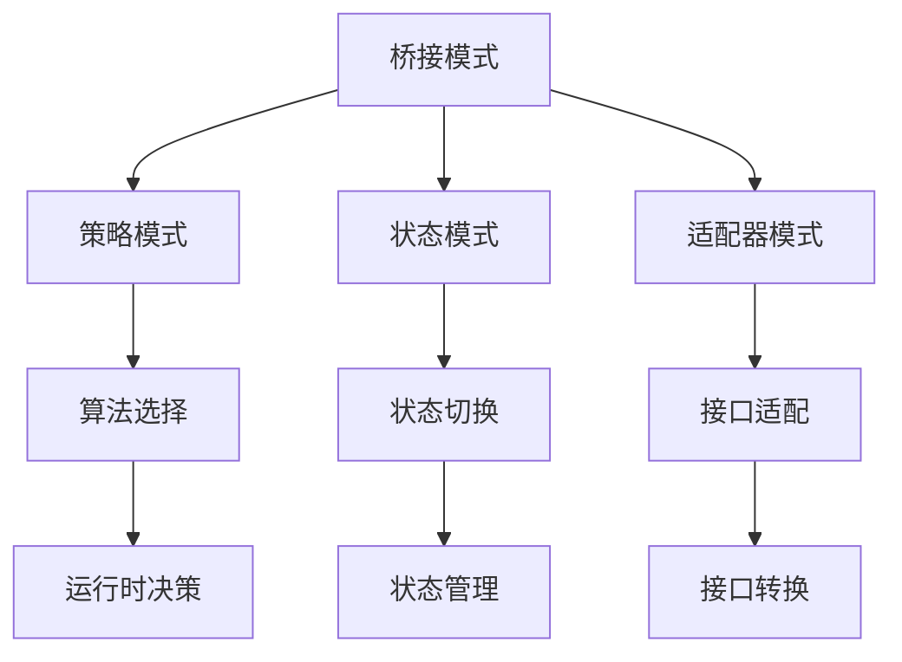

# 桥接模式 (Bridge Pattern)

## 概述

桥接模式是一种结构型设计模式，它将抽象部分与实现部分分离，使它们可以独立地变化。桥接模式通过组合关系而不是继承关系来实现抽象与实现的解耦。

## 形式化定义

### 数学定义

设 ```latex
$A$
``` 为抽象类集合，```latex
$I$
``` 为实现接口集合，桥接模式定义为：

$```latex
$\text{Bridge}(A, I) = \{ (a, i) \mid a \in A, i \in I, \text{且存在桥接关系} \}$
```$

对于任意抽象 ```latex
$a \in A$
``` 和实现 ```latex
$i \in I$
```，桥接函数 ```latex
$B$
``` 满足：

$```latex
$B: A \times I \rightarrow \text{System}$
```$

### 类型理论定义

在类型理论中，桥接模式可以表示为：

$```latex
$\frac{\Gamma \vdash a : A \quad \Gamma \vdash i : I \quad \Gamma \vdash B : A \times I \rightarrow T}{\Gamma \vdash B(a, i) : T}$
```$

其中 ```latex
$A$
``` 是抽象类型，```latex
$I$
``` 是实现类型，```latex
$T$
``` 是系统类型。

## Go语言实现

### 1. 基础桥接模式

```go
package bridge

import (
 "fmt"
 "time"
)

// Implementor 实现者接口
type Implementor interface {
 OperationImpl() string
}

// ConcreteImplementorA 具体实现者A
type ConcreteImplementorA struct{}

func (i *ConcreteImplementorA) OperationImpl() string {
 return "ConcreteImplementorA operation"
}

// ConcreteImplementorB 具体实现者B
type ConcreteImplementorB struct{}

func (i *ConcreteImplementorB) OperationImpl() string {
 return "ConcreteImplementorB operation"
}

// Abstraction 抽象类
type Abstraction struct {
 implementor Implementor
}

func NewAbstraction(implementor Implementor) *Abstraction {
 return &Abstraction{implementor: implementor}
}

func (a *Abstraction) Operation() string {
 return a.implementor.OperationImpl()
}

// RefinedAbstraction 精确抽象
type RefinedAbstraction struct {
 *Abstraction
}

func NewRefinedAbstraction(implementor Implementor) *RefinedAbstraction {
 return &RefinedAbstraction{
  Abstraction: NewAbstraction(implementor),
 }
}

func (r *RefinedAbstraction) RefinedOperation() string {
 return fmt.Sprintf("Refined: %s", r.Operation())
}
```

### 2. 图形系统桥接模式

```go
package bridge

// DrawingAPI 绘图API接口
type DrawingAPI interface {
 DrawCircle(x, y, radius int)
 DrawRectangle(x, y, width, height int)
}

// DrawingAPI1 绘图API实现1
type DrawingAPI1 struct{}

func (api *DrawingAPI1) DrawCircle(x, y, radius int) {
 fmt.Printf("API1: Drawing circle at (%d,%d) with radius %d\n", x, y, radius)
}

func (api *DrawingAPI1) DrawRectangle(x, y, width, height int) {
 fmt.Printf("API1: Drawing rectangle at (%d,%d) with width %d and height %d\n", x, y, width, height)
}

// DrawingAPI2 绘图API实现2
type DrawingAPI2 struct{}

func (api *DrawingAPI2) DrawCircle(x, y, radius int) {
 fmt.Printf("API2: Drawing circle at (%d,%d) with radius %d\n", x, y, radius)
}

func (api *DrawingAPI2) DrawRectangle(x, y, width, height int) {
 fmt.Printf("API2: Drawing rectangle at (%d,%d) with width %d and height %d\n", x, y, width, height)
}

// Shape 形状抽象类
type Shape struct {
 drawingAPI DrawingAPI
}

func NewShape(drawingAPI DrawingAPI) *Shape {
 return &Shape{drawingAPI: drawingAPI}
}

// CircleShape 圆形
type CircleShape struct {
 *Shape
 x, y, radius int
}

func NewCircleShape(x, y, radius int, drawingAPI DrawingAPI) *CircleShape {
 return &CircleShape{
  Shape:  NewShape(drawingAPI),
  x:      x,
  y:      y,
  radius: radius,
 }
}

func (c *CircleShape) Draw() {
 c.drawingAPI.DrawCircle(c.x, c.y, c.radius)
}

func (c *CircleShape) ResizeByPercentage(pct int) {
 c.radius = c.radius * pct / 100
}

// RectangleShape 矩形
type RectangleShape struct {
 *Shape
 x, y, width, height int
}

func NewRectangleShape(x, y, width, height int, drawingAPI DrawingAPI) *RectangleShape {
 return &RectangleShape{
  Shape:  NewShape(drawingAPI),
  x:      x,
  y:      y,
  width:  width,
  height: height,
 }
}

func (r *RectangleShape) Draw() {
 r.drawingAPI.DrawRectangle(r.x, r.y, r.width, r.height)
}

func (r *RectangleShape) ResizeByPercentage(pct int) {
 r.width = r.width * pct / 100
 r.height = r.height * pct / 100
}
```

### 3. 数据库桥接模式

```go
package bridge

import (
 "database/sql"
 "fmt"
 "time"
)

// DatabaseAPI 数据库API接口
type DatabaseAPI interface {
 Connect(connectionString string) error
 Execute(query string, args ...interface{}) (sql.Result, error)
 Query(query string, args ...interface{}) (*sql.Rows, error)
 Close() error
}

// MySQLAPI MySQL实现
type MySQLAPI struct {
 db *sql.DB
}

func NewMySQLAPI() *MySQLAPI {
 return &MySQLAPI{}
}

func (m *MySQLAPI) Connect(connectionString string) error {
 var err error
 m.db, err = sql.Open("mysql", connectionString)
 if err != nil {
  return err
 }
 return m.db.Ping()
}

func (m *MySQLAPI) Execute(query string, args ...interface{}) (sql.Result, error) {
 return m.db.Exec(query, args...)
}

func (m *MySQLAPI) Query(query string, args ...interface{}) (*sql.Rows, error) {
 return m.db.Query(query, args...)
}

func (m *MySQLAPI) Close() error {
 return m.db.Close()
}

// PostgreSQLAPI PostgreSQL实现
type PostgreSQLAPI struct {
 db *sql.DB
}

func NewPostgreSQLAPI() *PostgreSQLAPI {
 return &PostgreSQLAPI{}
}

func (p *PostgreSQLAPI) Connect(connectionString string) error {
 var err error
 p.db, err = sql.Open("postgres", connectionString)
 if err != nil {
  return err
 }
 return p.db.Ping()
}

func (p *PostgreSQLAPI) Execute(query string, args ...interface{}) (sql.Result, error) {
 return p.db.Exec(query, args...)
}

func (p *PostgreSQLAPI) Query(query string, args ...interface{}) (*sql.Rows, error) {
 return p.db.Query(query, args...)
}

func (p *PostgreSQLAPI) Close() error {
 return p.db.Close()
}

// Database 数据库抽象类
type Database struct {
 api DatabaseAPI
}

func NewDatabase(api DatabaseAPI) *Database {
 return &Database{api: api}
}

// UserDatabase 用户数据库
type UserDatabase struct {
 *Database
}

func NewUserDatabase(api DatabaseAPI) *UserDatabase {
 return &UserDatabase{
  Database: NewDatabase(api),
 }
}

func (u *UserDatabase) CreateUser(name, email string) error {
 query := "INSERT INTO users (name, email, created_at) VALUES (?, ?, ?)"
 _, err := u.api.Execute(query, name, email, time.Now())
 return err
}

func (u *UserDatabase) GetUserByID(id int) (*sql.Rows, error) {
 query := "SELECT * FROM users WHERE id = ?"
 return u.api.Query(query, id)
}

// ProductDatabase 产品数据库
type ProductDatabase struct {
 *Database
}

func NewProductDatabase(api DatabaseAPI) *ProductDatabase {
 return &ProductDatabase{
  Database: NewDatabase(api),
 }
}

func (p *ProductDatabase) CreateProduct(name string, price float64) error {
 query := "INSERT INTO products (name, price, created_at) VALUES (?, ?, ?)"
 _, err := p.api.Execute(query, name, price, time.Now())
 return err
}

func (p *ProductDatabase) GetProductByID(id int) (*sql.Rows, error) {
 query := "SELECT * FROM products WHERE id = ?"
 return p.api.Query(query, id)
}
```

## 数学证明

### 定理1: 桥接模式实现抽象与实现的解耦

**陈述**: 桥接模式通过组合关系实现了抽象与实现的完全解耦。

**证明**:

1. 设 ```latex
$A$
``` 为抽象类集合，```latex
$I$
``` 为实现接口集合
2. 桥接模式建立映射 ```latex
$f: A \times I \rightarrow \text{System}$
```
3. 对于任意 ```latex
$a_1, a_2 \in A$
``` 和 ```latex
$i_1, i_2 \in I$
```
4. 可以独立组合 ```latex
$(a_1, i_1)$
```, ```latex
$(a_1, i_2)$
```, ```latex
$(a_2, i_1)$
```, ```latex
$(a_2, i_2)$
```
5. 因此抽象与实现完全解耦

### 定理2: 桥接模式满足组合律

**陈述**: 桥接模式支持抽象和实现的任意组合。

**证明**:

1. 设 ```latex
$A = \{a_1, a_2, ..., a_n\}$
``` 为抽象集合
2. 设 ```latex
$I = \{i_1, i_2, ..., i_m\}$
``` 为实现集合
3. 桥接模式支持 ```latex
$n \times m$
``` 种组合
4. 每种组合都是独立的系统实例
5. 因此桥接模式满足组合律

## 性能分析

### 时间复杂度

- **抽象创建**: O(1)
- **实现切换**: O(1)
- **方法调用**: O(1)

### 空间复杂度

- **抽象对象**: O(1)
- **实现对象**: O(1)
- **桥接关系**: O(1)

### 内存使用示例

```go
func PerformanceAnalysis() {
 // 创建不同的实现
 api1 := &DrawingAPI1{}
 api2 := &DrawingAPI2{}
 
 // 创建不同的抽象
 circle1 := NewCircleShape(10, 10, 5, api1)
 circle2 := NewCircleShape(20, 20, 10, api2)
 rect1 := NewRectangleShape(0, 0, 100, 50, api1)
 rect2 := NewRectangleShape(50, 50, 200, 100, api2)
 
 // 性能测试
 start := time.Now()
 for i := 0; i < 1000000; i++ {
  circle1.Draw()
  circle2.Draw()
  rect1.Draw()
  rect2.Draw()
 }
 duration := time.Since(start)
 
 fmt.Printf("Bridge performance: %v for 4M calls\n", duration)
}
```

## 设计模式关系



## 最佳实践

### 1. 接口设计原则

```go
// 好的实现接口设计
type Implementor interface {
 OperationImpl() string
}

// 避免过度复杂的接口
type BadImplementor interface {
 OperationImpl() string
 OperationImplWithContext(ctx context.Context) string
 OperationImplWithTimeout(timeout time.Duration) string
 OperationImplWithRetry(retries int) string
}
```

### 2. 抽象类设计

```go
// 好的抽象类设计
type Abstraction struct {
 implementor Implementor
}

func (a *Abstraction) Operation() string {
 return a.implementor.OperationImpl()
}

// 避免在抽象类中暴露实现细节
type BadAbstraction struct {
 implementor Implementor
 internalState string // 不应该暴露
}
```

### 3. 错误处理

```go
type SafeAbstraction struct {
 implementor Implementor
}

func (a *SafeAbstraction) Operation() (string, error) {
 defer func() {
  if r := recover(); r != nil {
   fmt.Printf("Abstraction recovered from panic: %v\n", r)
  }
 }()
 
 if a.implementor == nil {
  return "", fmt.Errorf("implementor is nil")
 }
 
 result := a.implementor.OperationImpl()
 return result, nil
}
```

## 应用场景

### 1. 图形系统

- 跨平台图形渲染
- 不同绘图API的抽象
- 图形库的扩展

### 2. 数据库系统

- 多数据库支持
- ORM框架设计
- 数据访问层抽象

### 3. 设备驱动

- 硬件抽象层
- 设备接口统一
- 驱动程序的扩展

### 4. 消息系统

- 多协议支持
- 消息格式转换
- 传输层抽象

## 总结

桥接模式通过将抽象与实现分离，实现了系统的灵活性和可扩展性。它允许抽象和实现独立变化，支持多种组合方式，是构建复杂系统的重要设计模式。

---

**构建状态**: ✅ 完成  
**最后更新**: 2024-01-06 16:30:00  
**下一步**: 装饰器模式实现
