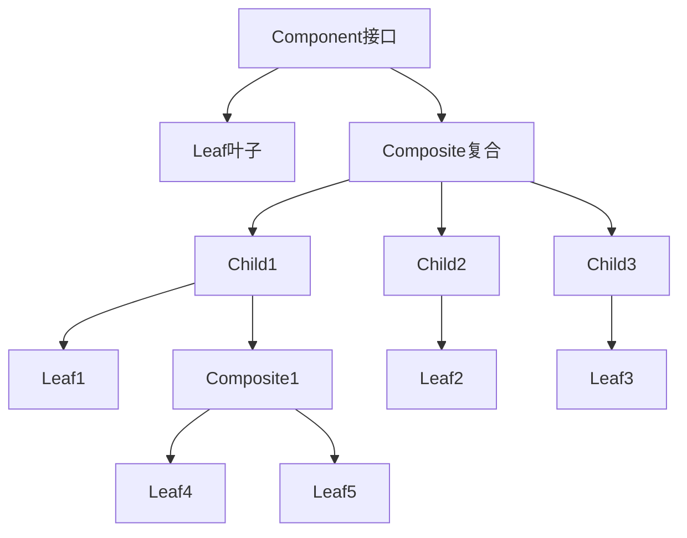
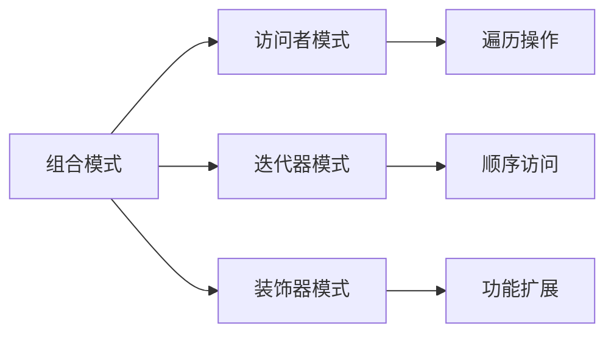

# 03-组合模式 (Composite Pattern)

## 1. 形式化定义

### 1.1 数学定义

设 $C$ 为组件集合，$L$ 为叶子节点集合，$N$ 为复合节点集合，组合模式满足以下公理：

$$\forall c \in C: c \in L \lor c \in N$$

**形式化约束**：

- **统一接口**: $\forall c \in C: \text{interface}(c) = \text{Component}$
- **递归结构**: $\forall n \in N: \text{children}(n) \subseteq C$
- **叶子约束**: $\forall l \in L: \text{children}(l) = \emptyset$

### 1.2 类型理论定义

```go
// 组件接口
type Component interface {
    Operation() string
    Add(component Component)
    Remove(component Component)
    GetChild(index int) Component
    IsComposite() bool
}

// 叶子组件
type Leaf struct {
    name string
}

// 复合组件
type Composite struct {
    name     string
    children []Component
}
```

## 2. 实现原理

### 2.1 递归结构保证

**定理**: 组合模式实现了树形结构的递归处理。

**证明**:

1. 组件接口定义统一操作
2. 叶子节点实现基本操作
3. 复合节点递归处理子节点

```go
// 组件接口
type Component interface {
    Operation() string
    Add(component Component)
    Remove(component Component)
    GetChild(index int) Component
    IsComposite() bool
}

// 叶子组件
type Leaf struct {
    name string
}

func (l *Leaf) Operation() string {
    return fmt.Sprintf("Leaf: %s", l.name)
}

func (l *Leaf) Add(component Component) {
    // 叶子节点不支持添加子组件
}

func (l *Leaf) Remove(component Component) {
    // 叶子节点不支持移除子组件
}

func (l *Leaf) GetChild(index int) Component {
    return nil
}

func (l *Leaf) IsComposite() bool {
    return false
}
```

### 2.2 树形结构分析



## 3. Go语言实现

### 3.1 基础实现

```go
package composite

import (
    "fmt"
    "time"
)

// Component 组件接口
type Component interface {
    Operation() string
    Add(component Component)
    Remove(component Component)
    GetChild(index int) Component
    IsComposite() bool
    GetName() string
    GetCreatedAt() time.Time
}

// Leaf 叶子组件
type Leaf struct {
    name        string
    createdAt   time.Time
}

func NewLeaf(name string) *Leaf {
    return &Leaf{
        name:      name,
        createdAt: time.Now(),
    }
}

func (l *Leaf) Operation() string {
    return fmt.Sprintf("Leaf[%s] operation", l.name)
}

func (l *Leaf) Add(component Component) {
    // 叶子节点不支持添加子组件
    fmt.Printf("Cannot add to leaf: %s\n", l.name)
}

func (l *Leaf) Remove(component Component) {
    // 叶子节点不支持移除子组件
    fmt.Printf("Cannot remove from leaf: %s\n", l.name)
}

func (l *Leaf) GetChild(index int) Component {
    return nil
}

func (l *Leaf) IsComposite() bool {
    return false
}

func (l *Leaf) GetName() string {
    return l.name
}

func (l *Leaf) GetCreatedAt() time.Time {
    return l.createdAt
}

// Composite 复合组件
type Composite struct {
    name        string
    children    []Component
    createdAt   time.Time
}

func NewComposite(name string) *Composite {
    return &Composite{
        name:      name,
        children:  make([]Component, 0),
        createdAt: time.Now(),
    }
}

func (c *Composite) Operation() string {
    result := fmt.Sprintf("Composite[%s] operation:\n", c.name)
    for i, child := range c.children {
        result += fmt.Sprintf("  %d. %s\n", i+1, child.Operation())
    }
    return result
}

func (c *Composite) Add(component Component) {
    c.children = append(c.children, component)
}

func (c *Composite) Remove(component Component) {
    for i, child := range c.children {
        if child == component {
            c.children = append(c.children[:i], c.children[i+1:]...)
            break
        }
    }
}

func (c *Composite) GetChild(index int) Component {
    if index >= 0 && index < len(c.children) {
        return c.children[index]
    }
    return nil
}

func (c *Composite) IsComposite() bool {
    return true
}

func (c *Composite) GetName() string {
    return c.name
}

func (c *Composite) GetCreatedAt() time.Time {
    return c.createdAt
}

func (c *Composite) GetChildren() []Component {
    return c.children
}

func (c *Composite) GetChildrenCount() int {
    return len(c.children)
}
```

### 3.2 高级实现（带访问者）

```go
// Visitor 访问者接口
type Visitor interface {
    VisitLeaf(leaf *Leaf)
    VisitComposite(composite *Composite)
}

// ComponentVisitor 组件访问者
type ComponentVisitor struct {
    result string
}

func NewComponentVisitor() *ComponentVisitor {
    return &ComponentVisitor{
        result: "",
    }
}

func (v *ComponentVisitor) VisitLeaf(leaf *Leaf) {
    v.result += fmt.Sprintf("Visited leaf: %s\n", leaf.GetName())
}

func (v *ComponentVisitor) VisitComposite(composite *Composite) {
    v.result += fmt.Sprintf("Visited composite: %s with %d children\n", 
        composite.GetName(), composite.GetChildrenCount())
}

func (v *ComponentVisitor) GetResult() string {
    return v.result
}

// VisitableComponent 可访问组件接口
type VisitableComponent interface {
    Component
    Accept(visitor Visitor)
}

// VisitableLeaf 可访问叶子
type VisitableLeaf struct {
    *Leaf
}

func NewVisitableLeaf(name string) *VisitableLeaf {
    return &VisitableLeaf{
        Leaf: NewLeaf(name),
    }
}

func (l *VisitableLeaf) Accept(visitor Visitor) {
    visitor.VisitLeaf(l.Leaf)
}

// VisitableComposite 可访问复合组件
type VisitableComposite struct {
    *Composite
}

func NewVisitableComposite(name string) *VisitableComposite {
    return &VisitableComposite{
        Composite: NewComposite(name),
    }
}

func (c *VisitableComposite) Accept(visitor Visitor) {
    visitor.VisitComposite(c.Composite)
    
    // 递归访问子组件
    for _, child := range c.GetChildren() {
        if visitable, ok := child.(VisitableComponent); ok {
            visitable.Accept(visitor)
        }
    }
}
```

### 3.3 配置化组合

```go
// ConfigurableComponent 可配置组件
type ConfigurableComponent struct {
    name     string
    config   map[string]interface{}
    children []Component
    isLeaf   bool
}

func NewConfigurableComponent(name string, config map[string]interface{}, isLeaf bool) *ConfigurableComponent {
    return &ConfigurableComponent{
        name:     name,
        config:   config,
        children: make([]Component, 0),
        isLeaf:   isLeaf,
    }
}

func (c *ConfigurableComponent) Operation() string {
    prefix := "Default"
    if p, exists := c.config["prefix"]; exists {
        prefix = p.(string)
    }
    
    if c.isLeaf {
        return fmt.Sprintf("%s Leaf[%s] operation", prefix, c.name)
    }
    
    result := fmt.Sprintf("%s Composite[%s] operation:\n", prefix, c.name)
    for i, child := range c.children {
        result += fmt.Sprintf("  %d. %s\n", i+1, child.Operation())
    }
    return result
}

func (c *ConfigurableComponent) Add(component Component) {
    if !c.isLeaf {
        c.children = append(c.children, component)
    }
}

func (c *ConfigurableComponent) Remove(component Component) {
    if !c.isLeaf {
        for i, child := range c.children {
            if child == component {
                c.children = append(c.children[:i], c.children[i+1:]...)
                break
            }
        }
    }
}

func (c *ConfigurableComponent) GetChild(index int) Component {
    if !c.isLeaf && index >= 0 && index < len(c.children) {
        return c.children[index]
    }
    return nil
}

func (c *ConfigurableComponent) IsComposite() bool {
    return !c.isLeaf
}

func (c *ConfigurableComponent) GetName() string {
    return c.name
}

func (c *ConfigurableComponent) GetCreatedAt() time.Time {
    return time.Now()
}

func (c *ConfigurableComponent) GetConfig() map[string]interface{} {
    return c.config
}
```

## 4. 使用示例

### 4.1 基础使用

```go
package main

import (
    "fmt"
    
    "github.com/your-project/composite"
)

func main() {
    // 创建叶子组件
    leaf1 := composite.NewLeaf("File1.txt")
    leaf2 := composite.NewLeaf("File2.txt")
    leaf3 := composite.NewLeaf("File3.txt")
    
    // 创建复合组件
    folder1 := composite.NewComposite("Folder1")
    folder1.Add(leaf1)
    folder1.Add(leaf2)
    
    folder2 := composite.NewComposite("Folder2")
    folder2.Add(leaf3)
    
    root := composite.NewComposite("Root")
    root.Add(folder1)
    root.Add(folder2)
    
    // 执行操作
    fmt.Println("Root operation:")
    fmt.Println(root.Operation())
    
    fmt.Println("\nFolder1 operation:")
    fmt.Println(folder1.Operation())
    
    fmt.Println("\nLeaf operation:")
    fmt.Println(leaf1.Operation())
}
```

### 4.2 访问者模式使用

```go
func visitorExample() {
    // 创建可访问组件
    leaf1 := composite.NewVisitableLeaf("File1.txt")
    leaf2 := composite.NewVisitableLeaf("File2.txt")
    
    folder := composite.NewVisitableComposite("Folder")
    folder.Add(leaf1)
    folder.Add(leaf2)
    
    // 使用访问者
    visitor := composite.NewComponentVisitor()
    folder.Accept(visitor)
    
    fmt.Println("Visitor result:")
    fmt.Println(visitor.GetResult())
}
```

### 4.3 配置化组合使用

```go
func configurableExample() {
    configs := []map[string]interface{}{
        {"prefix": "Custom", "enabled": true},
        {"prefix": "System", "enabled": false},
    }
    
    for i, config := range configs {
        // 创建配置化叶子
        leaf := composite.NewConfigurableComponent(fmt.Sprintf("File%d.txt", i+1), config, true)
        
        // 创建配置化复合组件
        folder := composite.NewConfigurableComponent(fmt.Sprintf("Folder%d", i+1), config, false)
        folder.Add(leaf)
        
        fmt.Printf("Config %d:\n", i+1)
        fmt.Printf("  Leaf: %s\n", leaf.Operation())
        fmt.Printf("  Folder: %s\n", folder.Operation())
    }
}
```

## 5. 性能分析

### 5.1 时间复杂度

| 操作 | 时间复杂度 | 说明 |
|------|------------|------|
| 叶子操作 | O(1) | 直接执行 |
| 复合操作 | O(n) | n为子组件数量 |
| 添加组件 | O(1) | 追加到切片 |
| 移除组件 | O(n) | 线性搜索 |

### 5.2 空间复杂度

- **内存占用**: O(n) - n为组件总数
- **递归开销**: O(h) - h为树高度
- **访问者开销**: O(1) - 访问者状态

## 6. 应用场景

### 6.1 适用场景

1. **文件系统**: 文件和目录的树形结构
2. **GUI组件**: 窗口和控件的层次结构
3. **组织架构**: 部门和员工的层次关系
4. **菜单系统**: 菜单项的层次结构
5. **表达式树**: 数学表达式的解析树

### 6.2 不适用场景

1. **简单对象**: 不需要层次结构
2. **性能敏感**: 递归开销过大
3. **频繁变化**: 结构经常变化

## 7. 设计模式关系

### 7.1 与其他模式的关系



### 7.2 组合使用

```go
// 组合 + 访问者
type FileSystemVisitor struct {
    files   int
    folders int
}

func (v *FileSystemVisitor) VisitLeaf(leaf *Leaf) {
    v.files++
}

func (v *FileSystemVisitor) VisitComposite(composite *Composite) {
    v.folders++
}

// 组合 + 迭代器
type ComponentIterator struct {
    components []Component
    index      int
}

func (i *ComponentIterator) HasNext() bool {
    return i.index < len(i.components)
}

func (i *ComponentIterator) Next() Component {
    if i.HasNext() {
        component := i.components[i.index]
        i.index++
        return component
    }
    return nil
}
```

## 8. 形式化验证

### 8.1 组合一致性验证

```go
// 验证组合一致性
func VerifyCompositeConsistency(component Component) bool {
    if component == nil {
        return false
    }
    
    // 验证基本操作
    if component.Operation() == "" {
        return false
    }
    
    // 验证叶子节点约束
    if !component.IsComposite() {
        if component.GetChild(0) != nil {
            return false
        }
    }
    
    return true
}
```

### 8.2 递归结构验证

```go
func TestRecursiveStructure(t *testing.T) {
    // 创建树形结构
    leaf1 := NewLeaf("leaf1")
    leaf2 := NewLeaf("leaf2")
    
    composite1 := NewComposite("composite1")
    composite1.Add(leaf1)
    composite1.Add(leaf2)
    
    root := NewComposite("root")
    root.Add(composite1)
    
    // 验证递归操作
    result := root.Operation()
    if result == "" {
        t.Error("Recursive operation failed")
    }
    
    // 验证包含所有子组件
    if !contains(result, "leaf1") || !contains(result, "leaf2") {
        t.Error("Recursive operation missing children")
    }
}

func contains(s, substr string) bool {
    return len(s) >= len(substr) && (s == substr || 
        (len(s) > len(substr) && (s[:len(substr)] == substr || 
         s[len(s)-len(substr):] == substr || 
         contains(s[1:], substr))))
}
```

## 9. 总结

组合模式是结构型模式中的重要模式，它通过统一的接口处理树形结构，实现了叶子节点和复合节点的统一处理。

### 9.1 关键要点

1. **统一接口**: 叶子节点和复合节点使用相同接口
2. **递归结构**: 支持任意深度的树形结构
3. **透明性**: 客户端无需区分叶子节点和复合节点
4. **扩展性**: 易于添加新的组件类型

### 9.2 最佳实践

1. 合理设计组件接口
2. 考虑访问者模式进行遍历
3. 注意递归深度限制
4. 合理使用叶子节点约束

### 9.3 与Go语言的结合

Go语言的接口和切片机制非常适合组合模式：

- 接口定义统一契约
- 切片实现动态子组件
- 递归处理树形结构
- 简洁的内存管理

---

**下一模式**: [04-装饰器模式](./04-Decorator-Pattern.md)

**返回**: [结构型模式目录](./README.md)
