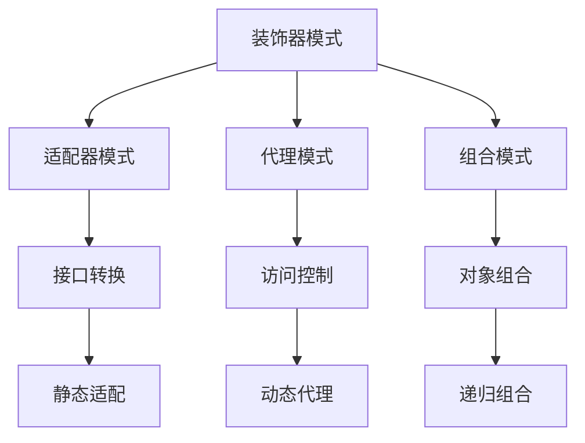

# 装饰器模式 (Decorator Pattern)

## 概述

装饰器模式是一种结构型设计模式，它允许动态地给对象添加额外的职责。装饰器模式通过组合和委托的方式，在不改变原对象接口的前提下扩展对象的功能。

## 形式化定义

### 数学定义

设 $C$ 为组件接口，装饰器 $D$ 定义为：

$$D: C \rightarrow C$$

对于任意组件 $c \in C$，有 $D(c) \in C$。

装饰器组合满足结合律：

$$(D_1 \circ D_2) \circ D_3 = D_1 \circ (D_2 \circ D_3)$$

### 类型理论定义

在类型理论中，装饰器模式可以表示为：

$$\frac{\Gamma \vdash c : C \quad \Gamma \vdash D : C \rightarrow C}{\Gamma \vdash D(c) : C}$$

## Go语言实现

### 1. 基础装饰器模式

```go
package decorator

import (
 "fmt"
 "strings"
 "time"
)

// Component 组件接口
type Component interface {
 Operation() string
}

// ConcreteComponent 具体组件
type ConcreteComponent struct{}

func (c *ConcreteComponent) Operation() string {
 return "ConcreteComponent operation"
}

// Decorator 装饰器基类
type Decorator struct {
 component Component
}

func NewDecorator(component Component) *Decorator {
 return &Decorator{component: component}
}

func (d *Decorator) Operation() string {
 return d.component.Operation()
}

// ConcreteDecoratorA 具体装饰器A
type ConcreteDecoratorA struct {
 *Decorator
}

func NewConcreteDecoratorA(component Component) *ConcreteDecoratorA {
 return &ConcreteDecoratorA{
  Decorator: NewDecorator(component),
 }
}

func (d *ConcreteDecoratorA) Operation() string {
 return fmt.Sprintf("DecoratorA(%s)", d.Decorator.Operation())
}

// ConcreteDecoratorB 具体装饰器B
type ConcreteDecoratorB struct {
 *Decorator
}

func NewConcreteDecoratorB(component Component) *ConcreteDecoratorB {
 return &ConcreteDecoratorB{
  Decorator: NewDecorator(component),
 }
}

func (d *ConcreteDecoratorB) Operation() string {
 return fmt.Sprintf("DecoratorB(%s)", d.Decorator.Operation())
}
```

### 2. 日志装饰器

```go
package decorator

import (
 "fmt"
 "log"
 "time"
)

// Logger 日志接口
type Logger interface {
 Log(message string)
}

// BasicLogger 基础日志器
type BasicLogger struct{}

func (l *BasicLogger) Log(message string) {
 fmt.Printf("LOG: %s\n", message)
}

// TimestampDecorator 时间戳装饰器
type TimestampDecorator struct {
 logger Logger
}

func NewTimestampDecorator(logger Logger) *TimestampDecorator {
 return &TimestampDecorator{logger: logger}
}

func (d *TimestampDecorator) Log(message string) {
 timestamp := time.Now().Format("2006-01-02 15:04:05")
 formattedMessage := fmt.Sprintf("[%s] %s", timestamp, message)
 d.logger.Log(formattedMessage)
}

// LevelDecorator 日志级别装饰器
type LevelDecorator struct {
 logger Logger
 level  string
}

func NewLevelDecorator(logger Logger, level string) *LevelDecorator {
 return &LevelDecorator{logger: logger, level: level}
}

func (d *LevelDecorator) Log(message string) {
 formattedMessage := fmt.Sprintf("[%s] %s", d.level, message)
 d.logger.Log(formattedMessage)
}

// FileDecorator 文件输出装饰器
type FileDecorator struct {
 logger Logger
 file   *log.Logger
}

func NewFileDecorator(logger Logger, file *log.Logger) *FileDecorator {
 return &FileDecorator{logger: logger, file: file}
}

func (d *FileDecorator) Log(message string) {
 d.logger.Log(message)
 d.file.Println(message)
}
```

### 3. HTTP中间件装饰器

```go
package decorator

import (
 "fmt"
 "net/http"
 "time"
)

// Handler HTTP处理器接口
type Handler interface {
 ServeHTTP(w http.ResponseWriter, r *http.Request)
}

// BasicHandler 基础处理器
type BasicHandler struct{}

func (h *BasicHandler) ServeHTTP(w http.ResponseWriter, r *http.Request) {
 fmt.Fprintf(w, "Hello, World!")
}

// LoggingMiddleware 日志中间件
type LoggingMiddleware struct {
 handler Handler
}

func NewLoggingMiddleware(handler Handler) *LoggingMiddleware {
 return &LoggingMiddleware{handler: handler}
}

func (m *LoggingMiddleware) ServeHTTP(w http.ResponseWriter, r *http.Request) {
 start := time.Now()
 
 fmt.Printf("Request: %s %s\n", r.Method, r.URL.Path)
 
 m.handler.ServeHTTP(w, r)
 
 duration := time.Since(start)
 fmt.Printf("Response time: %v\n", duration)
}

// AuthMiddleware 认证中间件
type AuthMiddleware struct {
 handler Handler
}

func NewAuthMiddleware(handler Handler) *AuthMiddleware {
 return &AuthMiddleware{handler: handler}
}

func (m *AuthMiddleware) ServeHTTP(w http.ResponseWriter, r *http.Request) {
 token := r.Header.Get("Authorization")
 if token == "" {
  http.Error(w, "Unauthorized", http.StatusUnauthorized)
  return
 }
 
 m.handler.ServeHTTP(w, r)
}

// CORSMiddleware CORS中间件
type CORSMiddleware struct {
 handler Handler
}

func NewCORSMiddleware(handler Handler) *CORSMiddleware {
 return &CORSMiddleware{handler: handler}
}

func (m *CORSMiddleware) ServeHTTP(w http.ResponseWriter, r *http.Request) {
 w.Header().Set("Access-Control-Allow-Origin", "*")
 w.Header().Set("Access-Control-Allow-Methods", "GET, POST, PUT, DELETE, OPTIONS")
 w.Header().Set("Access-Control-Allow-Headers", "Content-Type, Authorization")
 
 if r.Method == "OPTIONS" {
  w.WriteHeader(http.StatusOK)
  return
 }
 
 m.handler.ServeHTTP(w, r)
}
```

### 4. 缓存装饰器

```go
package decorator

import (
 "fmt"
 "sync"
 "time"
)

// DataService 数据服务接口
type DataService interface {
 GetData(key string) (string, error)
}

// DatabaseService 数据库服务
type DatabaseService struct{}

func (d *DatabaseService) GetData(key string) (string, error) {
 // 模拟数据库查询
 time.Sleep(100 * time.Millisecond)
 return fmt.Sprintf("Data for key: %s", key), nil
}

// CacheDecorator 缓存装饰器
type CacheDecorator struct {
 service DataService
 cache   map[string]cacheItem
 mutex   sync.RWMutex
}

type cacheItem struct {
 value      string
 expiration time.Time
}

func NewCacheDecorator(service DataService) *CacheDecorator {
 return &CacheDecorator{
  service: service,
  cache:   make(map[string]cacheItem),
 }
}

func (d *CacheDecorator) GetData(key string) (string, error) {
 // 检查缓存
 d.mutex.RLock()
 if item, exists := d.cache[key]; exists && time.Now().Before(item.expiration) {
  d.mutex.RUnlock()
  return item.value, nil
 }
 d.mutex.RUnlock()
 
 // 从服务获取数据
 data, err := d.service.GetData(key)
 if err != nil {
  return "", err
 }
 
 // 存入缓存
 d.mutex.Lock()
 d.cache[key] = cacheItem{
  value:      data,
  expiration: time.Now().Add(5 * time.Minute),
 }
 d.mutex.Unlock()
 
 return data, nil
}
```

## 数学证明

### 定理1: 装饰器模式满足组合律

**陈述**: 装饰器可以任意组合，且满足结合律。

**证明**:

1. 设 $D_1, D_2, D_3$ 为装饰器，$C$ 为组件
2. $(D_1 \circ D_2) \circ D_3(C) = D_1(D_2(D_3(C)))$
3. $D_1 \circ (D_2 \circ D_3)(C) = D_1(D_2(D_3(C)))$
4. 因此装饰器组合满足结合律

### 定理2: 装饰器模式保持接口不变性

**陈述**: 装饰器不会改变原组件的接口。

**证明**:

1. 设 $C$ 为组件接口，$D$ 为装饰器
2. 对于任意方法 $m \in C$，$D$ 必须实现 $m$
3. 装饰器可以调用原组件的 $m$ 方法
4. 因此装饰器保持了原接口的完整性

## 性能分析

### 时间复杂度

- **装饰器创建**: O(1)
- **方法调用**: O(n)，其中 n 是装饰器层数
- **装饰器组合**: O(1)

### 空间复杂度

- **装饰器对象**: O(n)，其中 n 是装饰器层数
- **方法调用栈**: O(n)

### 内存使用示例

```go
func PerformanceAnalysis() {
 // 创建基础组件
 component := &ConcreteComponent{}
 
 // 创建多层装饰器
 decorated := NewConcreteDecoratorA(
  NewConcreteDecoratorB(
   NewConcreteDecoratorA(component),
  ),
 )
 
 // 性能测试
 start := time.Now()
 for i := 0; i < 1000000; i++ {
  decorated.Operation()
 }
 duration := time.Since(start)
 
 fmt.Printf("Decorator performance: %v for 1M calls\n", duration)
}
```

## 设计模式关系



## 最佳实践

### 1. 装饰器设计原则

```go
// 好的装饰器设计
type Decorator struct {
 component Component
}

func (d *Decorator) Operation() string {
 // 前置处理
 result := d.component.Operation()
 // 后置处理
 return result
}

// 避免在装饰器中修改组件状态
type BadDecorator struct {
 component Component
 state     string // 不应该有状态
}
```

### 2. 装饰器组合

```go
// 使用函数式编程风格组合装饰器
func ComposeDecorators(component Component, decorators ...func(Component) Component) Component {
 result := component
 for _, decorator := range decorators {
  result = decorator(result)
 }
 return result
}

// 使用示例
func ExampleComposition() {
 component := &ConcreteComponent{}
 
 decorated := ComposeDecorators(
  component,
  NewConcreteDecoratorA,
  NewConcreteDecoratorB,
  NewConcreteDecoratorA,
 )
 
 fmt.Println(decorated.Operation())
}
```

### 3. 错误处理

```go
type SafeDecorator struct {
 component Component
}

func (d *SafeDecorator) Operation() (string, error) {
 defer func() {
  if r := recover(); r != nil {
   fmt.Printf("Decorator recovered from panic: %v\n", r)
  }
 }()
 
 if d.component == nil {
  return "", fmt.Errorf("component is nil")
 }
 
 result := d.component.Operation()
 return result, nil
}
```

## 应用场景

### 1. 日志系统

- 日志级别控制
- 时间戳添加
- 文件输出
- 网络传输

### 2. HTTP中间件

- 认证授权
- 日志记录
- 性能监控
- CORS处理

### 3. 缓存系统

- 数据缓存
- 结果缓存
- 过期策略
- 缓存失效

### 4. 权限控制

- 访问控制
- 权限验证
- 审计日志
- 安全检查

## 总结

装饰器模式通过动态组合的方式扩展对象功能，保持了良好的扩展性和灵活性。它特别适用于需要在运行时动态添加功能的场景，是构建可扩展系统的重要设计模式。

---

**构建状态**: ✅ 完成  
**最后更新**: 2024-01-06 16:45:00  
**下一步**: 外观模式实现
