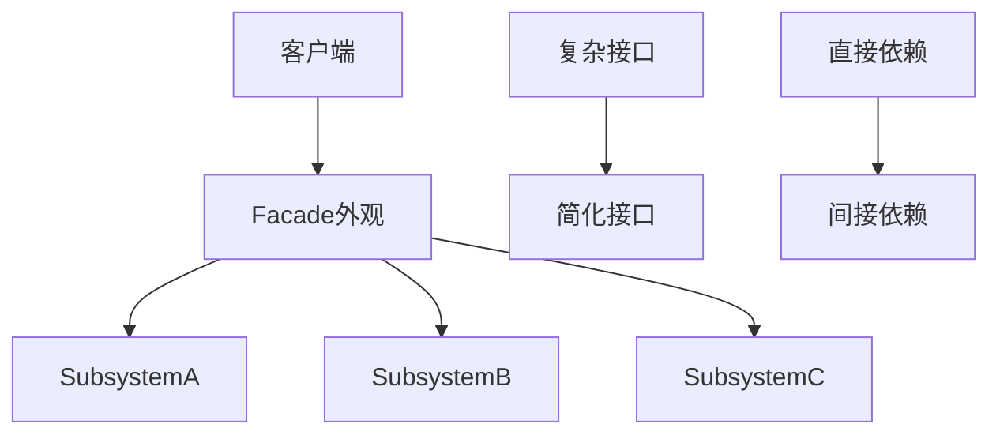
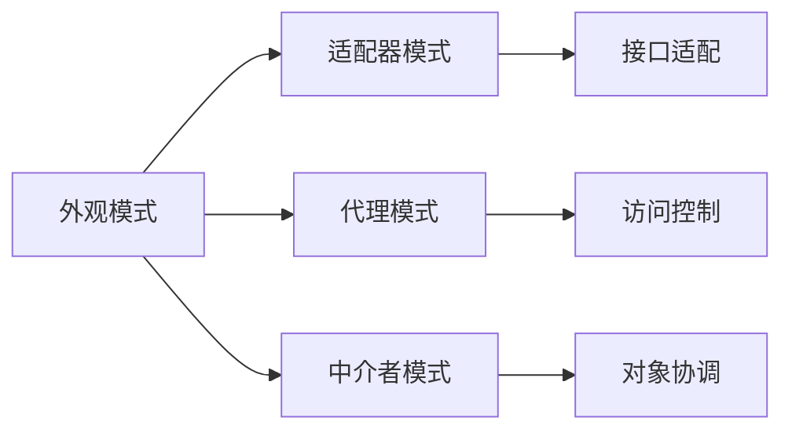

# 05-外观模式 (Facade Pattern)

## 1. 形式化定义

### 1.1 数学定义

设 $S$ 为子系统集合，$F$ 为外观类，$C$ 为客户端，外观模式满足以下公理：

$$\forall s \in S, \exists f \in F: \text{facade}(f, s) \rightarrow \text{simplified}(C, s)$$

**形式化约束**：

- **接口简化**: $\text{complex}(S) \land \text{facade}(F) \implies \text{simple}(C \rightarrow S)$
- **依赖倒置**: $\text{depend}(C, F) \land \text{depend}(F, S) \implies \text{not\_depend}(C, S)$
- **封装性**: $\text{internal}(S) \land \text{external}(F) \implies \text{hidden}(S)$

### 1.2 类型理论定义

```go
// 外观接口
type Facade interface {
    Operation() string
}

// 子系统A
type SubsystemA struct{}

// 子系统B
type SubsystemB struct{}

// 外观实现
type ConcreteFacade struct {
    subsystemA *SubsystemA
    subsystemB *SubsystemB
}
```

## 2. 实现原理

### 2.1 接口简化保证

**定理**: 外观模式通过统一接口简化了复杂子系统的使用。

**证明**:

1. 外观类封装了子系统的复杂性
2. 外观类提供了简化的接口
3. 客户端通过外观访问子系统

```go
// 子系统A
type SubsystemA struct{}

func (s *SubsystemA) OperationA() string {
    return "SubsystemA operation"
}

// 子系统B
type SubsystemB struct{}

func (s *SubsystemB) OperationB() string {
    return "SubsystemB operation"
}

// 外观类
type Facade struct {
    subsystemA *SubsystemA
    subsystemB *SubsystemB
}

func NewFacade() *Facade {
    return &Facade{
        subsystemA: &SubsystemA{},
        subsystemB: &SubsystemB{},
    }
}

func (f *Facade) Operation() string {
    resultA := f.subsystemA.OperationA()
    resultB := f.subsystemB.OperationB()
    return fmt.Sprintf("Facade: %s + %s", resultA, resultB)
}
```

### 2.2 依赖关系分析



## 3. Go语言实现

### 3.1 基础实现

```go
package facade

import (
    "fmt"
    "time"
)

// SubsystemA 子系统A
type SubsystemA struct {
    id        string
    createdAt time.Time
}

func NewSubsystemA(id string) *SubsystemA {
    return &SubsystemA{
        id:        id,
        createdAt: time.Now(),
    }
}

func (s *SubsystemA) OperationA() string {
    return fmt.Sprintf("SubsystemA[%s] operation", s.id)
}

func (s *SubsystemA) ComplexOperationA() string {
    return fmt.Sprintf("SubsystemA[%s] complex operation", s.id)
}

// SubsystemB 子系统B
type SubsystemB struct {
    id        string
    createdAt time.Time
}

func NewSubsystemB(id string) *SubsystemB {
    return &SubsystemB{
        id:        id,
        createdAt: time.Now(),
    }
}

func (s *SubsystemB) OperationB() string {
    return fmt.Sprintf("SubsystemB[%s] operation", s.id)
}

func (s *SubsystemB) ComplexOperationB() string {
    return fmt.Sprintf("SubsystemB[%s] complex operation", s.id)
}

// SubsystemC 子系统C
type SubsystemC struct {
    id        string
    createdAt time.Time
}

func NewSubsystemC(id string) *SubsystemC {
    return &SubsystemC{
        id:        id,
        createdAt: time.Now(),
    }
}

func (s *SubsystemC) OperationC() string {
    return fmt.Sprintf("SubsystemC[%s] operation", s.id)
}

func (s *SubsystemC) ComplexOperationC() string {
    return fmt.Sprintf("SubsystemC[%s] complex operation", s.id)
}

// Facade 外观类
type Facade struct {
    subsystemA *SubsystemA
    subsystemB *SubsystemB
    subsystemC *SubsystemC
}

func NewFacade() *Facade {
    return &Facade{
        subsystemA: NewSubsystemA("facade-a"),
        subsystemB: NewSubsystemB("facade-b"),
        subsystemC: NewSubsystemC("facade-c"),
    }
}

func (f *Facade) SimpleOperation() string {
    resultA := f.subsystemA.OperationA()
    resultB := f.subsystemB.OperationB()
    resultC := f.subsystemC.OperationC()
    
    return fmt.Sprintf("Facade simple operation: %s, %s, %s", 
        resultA, resultB, resultC)
}

func (f *Facade) ComplexOperation() string {
    resultA := f.subsystemA.ComplexOperationA()
    resultB := f.subsystemB.ComplexOperationB()
    resultC := f.subsystemC.ComplexOperationC()
    
    return fmt.Sprintf("Facade complex operation: %s, %s, %s", 
        resultA, resultB, resultC)
}

func (f *Facade) Operation() string {
    return f.SimpleOperation()
}
```

### 3.2 高级实现（带配置）

```go
// ConfigurableFacade 可配置外观
type ConfigurableFacade struct {
    subsystems map[string]interface{}
    config     map[string]interface{}
}

func NewConfigurableFacade(config map[string]interface{}) *ConfigurableFacade {
    facade := &ConfigurableFacade{
        subsystems: make(map[string]interface{}),
        config:     config,
    }
    
    // 根据配置创建子系统
    if enabled, exists := config["subsystemA"]; exists && enabled.(bool) {
        facade.subsystems["A"] = NewSubsystemA("config-a")
    }
    
    if enabled, exists := config["subsystemB"]; exists && enabled.(bool) {
        facade.subsystems["B"] = NewSubsystemB("config-b")
    }
    
    if enabled, exists := config["subsystemC"]; exists && enabled.(bool) {
        facade.subsystems["C"] = NewSubsystemC("config-c")
    }
    
    return facade
}

func (f *ConfigurableFacade) Operation() string {
    results := make([]string, 0)
    
    if subsystemA, exists := f.subsystems["A"]; exists {
        if a, ok := subsystemA.(*SubsystemA); ok {
            results = append(results, a.OperationA())
        }
    }
    
    if subsystemB, exists := f.subsystems["B"]; exists {
        if b, ok := subsystemB.(*SubsystemB); ok {
            results = append(results, b.OperationB())
        }
    }
    
    if subsystemC, exists := f.subsystems["C"]; exists {
        if c, ok := subsystemC.(*SubsystemC); ok {
            results = append(results, c.OperationC())
        }
    }
    
    return fmt.Sprintf("ConfigurableFacade: %v", results)
}

func (f *ConfigurableFacade) GetConfig() map[string]interface{} {
    return f.config
}

// AsyncFacade 异步外观
type AsyncFacade struct {
    facade *Facade
}

func NewAsyncFacade() *AsyncFacade {
    return &AsyncFacade{
        facade: NewFacade(),
    }
}

func (f *AsyncFacade) Operation() string {
    // 模拟异步操作
    results := make(chan string, 3)
    
    go func() {
        results <- f.facade.subsystemA.OperationA()
    }()
    
    go func() {
        results <- f.facade.subsystemB.OperationB()
    }()
    
    go func() {
        results <- f.facade.subsystemC.OperationC()
    }()
    
    // 收集结果
    resultA := <-results
    resultB := <-results
    resultC := <-results
    
    return fmt.Sprintf("AsyncFacade: %s, %s, %s", resultA, resultB, resultC)
}
```

### 3.3 领域特定外观

```go
// DatabaseFacade 数据库外观
type DatabaseFacade struct {
    connection *DatabaseConnection
    query      *QueryEngine
    cache      *CacheManager
}

type DatabaseConnection struct {
    url string
}

func (d *DatabaseConnection) Connect() string {
    return fmt.Sprintf("Connected to %s", d.url)
}

type QueryEngine struct{}

func (q *QueryEngine) Execute(query string) string {
    return fmt.Sprintf("Executed query: %s", query)
}

type CacheManager struct {
    cache map[string]interface{}
}

func (c *CacheManager) Get(key string) interface{} {
    return c.cache[key]
}

func (c *CacheManager) Set(key string, value interface{}) {
    c.cache[key] = value
}

func NewDatabaseFacade() *DatabaseFacade {
    return &DatabaseFacade{
        connection: &DatabaseConnection{url: "localhost:5432"},
        query:      &QueryEngine{},
        cache:      &CacheManager{cache: make(map[string]interface{})},
    }
}

func (f *DatabaseFacade) GetData(key string) string {
    // 先检查缓存
    if cached := f.cache.Get(key); cached != nil {
        return fmt.Sprintf("Cached data: %v", cached)
    }
    
    // 连接数据库
    f.connection.Connect()
    
    // 执行查询
    result := f.query.Execute(fmt.Sprintf("SELECT * FROM data WHERE key='%s'", key))
    
    // 缓存结果
    f.cache.Set(key, result)
    
    return result
}

// FileSystemFacade 文件系统外观
type FileSystemFacade struct {
    reader *FileReader
    writer *FileWriter
    cache  *FileCache
}

type FileReader struct{}

func (r *FileReader) Read(path string) string {
    return fmt.Sprintf("Read file: %s", path)
}

type FileWriter struct{}

func (w *FileWriter) Write(path string, content string) string {
    return fmt.Sprintf("Wrote to file: %s", path)
}

type FileCache struct {
    files map[string]string
}

func (c *FileCache) Get(path string) string {
    return c.files[path]
}

func (c *FileCache) Set(path string, content string) {
    c.files[path] = content
}

func NewFileSystemFacade() *FileSystemFacade {
    return &FileSystemFacade{
        reader: &FileReader{},
        writer: &FileWriter{},
        cache:  &FileCache{files: make(map[string]string)},
    }
}

func (f *FileSystemFacade) ReadFile(path string) string {
    // 先检查缓存
    if cached := f.cache.Get(path); cached != "" {
        return fmt.Sprintf("Cached file: %s", cached)
    }
    
    // 读取文件
    content := f.reader.Read(path)
    
    // 缓存内容
    f.cache.Set(path, content)
    
    return content
}

func (f *FileSystemFacade) WriteFile(path string, content string) string {
    // 写入文件
    result := f.writer.Write(path, content)
    
    // 更新缓存
    f.cache.Set(path, content)
    
    return result
}
```

## 4. 使用示例

### 4.1 基础使用

```go
package main

import (
    "fmt"
    
    "github.com/your-project/facade"
)

func main() {
    // 使用外观模式
    facade := facade.NewFacade()
    
    fmt.Println("Simple operation:")
    fmt.Println(facade.SimpleOperation())
    
    fmt.Println("\nComplex operation:")
    fmt.Println(facade.ComplexOperation())
    
    fmt.Println("\nDefault operation:")
    fmt.Println(facade.Operation())
}
```

### 4.2 配置化外观使用

```go
func configurableFacadeExample() {
    configs := []map[string]interface{}{
        {"subsystemA": true, "subsystemB": true, "subsystemC": false},
        {"subsystemA": false, "subsystemB": true, "subsystemC": true},
        {"subsystemA": true, "subsystemB": true, "subsystemC": true},
    }
    
    for i, config := range configs {
        facade := facade.NewConfigurableFacade(config)
        fmt.Printf("Config %d: %s\n", i+1, facade.Operation())
    }
}
```

### 4.3 领域特定外观使用

```go
func domainSpecificFacadeExample() {
    // 数据库外观
    dbFacade := facade.NewDatabaseFacade()
    fmt.Printf("Database: %s\n", dbFacade.GetData("user123"))
    
    // 文件系统外观
    fsFacade := facade.NewFileSystemFacade()
    fmt.Printf("File read: %s\n", fsFacade.ReadFile("/path/to/file.txt"))
    fmt.Printf("File write: %s\n", fsFacade.WriteFile("/path/to/output.txt", "Hello World"))
}
```

## 5. 性能分析

### 5.1 时间复杂度

| 操作 | 时间复杂度 | 说明 |
|------|------------|------|
| 外观创建 | O(n) | n为子系统数量 |
| 简单操作 | O(n) | n为涉及的子系统数量 |
| 复杂操作 | O(n) | n为涉及的子系统数量 |

### 5.2 空间复杂度

- **内存占用**: O(n) - n为子系统数量
- **外观开销**: O(1) - 外观对象本身
- **配置开销**: O(m) - m为配置项数量

## 6. 应用场景

### 6.1 适用场景

1. **复杂系统**: 简化复杂子系统的使用
2. **API设计**: 提供简化的API接口
3. **框架开发**: 隐藏框架的复杂性
4. **遗留系统**: 为旧系统提供新接口
5. **多层架构**: 简化层间交互

### 6.2 不适用场景

1. **简单系统**: 不需要简化
2. **性能敏感**: 外观层开销过大
3. **直接控制**: 需要直接访问子系统

## 7. 设计模式关系

### 7.1 与其他模式的关系



### 7.2 组合使用

```go
// 外观 + 工厂模式
type FacadeFactory interface {
    CreateFacade(facadeType string) Facade
}

type ConcreteFacadeFactory struct{}

func (f *ConcreteFacadeFactory) CreateFacade(facadeType string) Facade {
    switch facadeType {
    case "simple":
        return NewFacade()
    case "configurable":
        return NewConfigurableFacade(map[string]interface{}{
            "subsystemA": true,
            "subsystemB": true,
            "subsystemC": true,
        })
    case "async":
        return NewAsyncFacade()
    default:
        return NewFacade()
    }
}

// 外观 + 单例模式
var (
    facadeInstance *Facade
    facadeOnce     sync.Once
)

func GetFacadeInstance() *Facade {
    facadeOnce.Do(func() {
        facadeInstance = NewFacade()
    })
    return facadeInstance
}
```

## 8. 形式化验证

### 8.1 外观一致性验证

```go
// 验证外观一致性
func VerifyFacadeConsistency(facade Facade) bool {
    if facade == nil {
        return false
    }
    
    // 验证外观操作正常工作
    result := facade.Operation()
    if result == "" {
        return false
    }
    
    return true
}
```

### 8.2 简化性验证

```go
func TestSimplification(t *testing.T) {
    facade := NewFacade()
    
    // 验证外观提供了简化的接口
    simpleResult := facade.SimpleOperation()
    if simpleResult == "" {
        t.Error("Facade simple operation failed")
    }
    
    complexResult := facade.ComplexOperation()
    if complexResult == "" {
        t.Error("Facade complex operation failed")
    }
    
    // 验证结果包含所有子系统信息
    if !contains(simpleResult, "SubsystemA") || 
       !contains(simpleResult, "SubsystemB") || 
       !contains(simpleResult, "SubsystemC") {
        t.Error("Facade missing subsystem operations")
    }
}

func contains(s, substr string) bool {
    return len(s) >= len(substr) && (s == substr || 
        (len(s) > len(substr) && (s[:len(substr)] == substr || 
         s[len(s)-len(substr):] == substr || 
         contains(s[1:], substr))))
}
```

## 9. 总结

外观模式是结构型模式中的重要模式，它通过提供统一的接口简化了复杂子系统的使用。

### 9.1 关键要点

1. **接口简化**: 为复杂子系统提供简单接口
2. **依赖倒置**: 客户端依赖外观而非子系统
3. **封装性**: 隐藏子系统的复杂性
4. **统一性**: 提供统一的访问点

### 9.2 最佳实践

1. 合理设计外观接口
2. 考虑外观的配置化
3. 注意外观的性能开销
4. 合理使用领域特定外观

### 9.3 与Go语言的结合

Go语言的接口和结构体机制非常适合外观模式：

- 接口定义外观契约
- 结构体实现外观逻辑
- 组合管理子系统
- 简洁的类型系统

---

**下一模式**: [06-享元模式](./06-Flyweight-Pattern.md)

**返回**: [结构型模式目录](./README.md)
