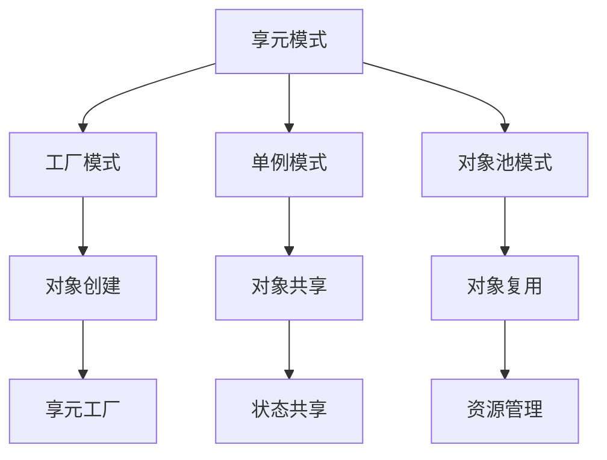

# 享元模式 (Flyweight Pattern)

## 概述

享元模式是一种结构型设计模式，它通过共享技术有效支持大量细粒度对象的复用。享元模式将对象的状态分为内部状态和外部状态，内部状态可以共享，外部状态由客户端提供。

## 形式化定义

### 数学定义

设 ```latex
I
``` 为内部状态集合，```latex
E
``` 为外部状态集合，享元 ```latex
F
``` 定义为：

$```latex
F: I \times E \rightarrow \text{Object}
```$

对于任意内部状态 ```latex
i \in I
``` 和外部状态 ```latex
e \in E
```，享元函数 ```latex
F
``` 创建对象。

### 类型理论定义

在类型理论中，享元模式可以表示为：

$```latex
\frac{\Gamma \vdash i : I \quad \Gamma \vdash e : E \quad \Gamma \vdash F : I \times E \rightarrow T}{\Gamma \vdash F(i, e) : T}
```$

## Go语言实现

### 1. 基础享元模式

```go
package flyweight

import (
 "fmt"
 "sync"
)

// Flyweight 享元接口
type Flyweight interface {
 Operation(extrinsicState string) string
}

// ConcreteFlyweight 具体享元
type ConcreteFlyweight struct {
 intrinsicState string
}

func NewConcreteFlyweight(intrinsicState string) *ConcreteFlyweight {
 return &ConcreteFlyweight{intrinsicState: intrinsicState}
}

func (f *ConcreteFlyweight) Operation(extrinsicState string) string {
 return fmt.Sprintf("Intrinsic: %s, Extrinsic: %s", f.intrinsicState, extrinsicState)
}

// FlyweightFactory 享元工厂
type FlyweightFactory struct {
 flyweights map[string]Flyweight
 mutex      sync.RWMutex
}

func NewFlyweightFactory() *FlyweightFactory {
 return &FlyweightFactory{
  flyweights: make(map[string]Flyweight),
 }
}

func (f *FlyweightFactory) GetFlyweight(key string) Flyweight {
 f.mutex.RLock()
 if flyweight, exists := f.flyweights[key]; exists {
  f.mutex.RUnlock()
  return flyweight
 }
 f.mutex.RUnlock()
 
 f.mutex.Lock()
 defer f.mutex.Unlock()
 
 // 双重检查
 if flyweight, exists := f.flyweights[key]; exists {
  return flyweight
 }
 
 flyweight := NewConcreteFlyweight(key)
 f.flyweights[key] = flyweight
 return flyweight
}

func (f *FlyweightFactory) GetFlyweightCount() int {
 f.mutex.RLock()
 defer f.mutex.RUnlock()
 return len(f.flyweights)
}
```

### 2. 字符渲染享元

```go
package flyweight

import (
 "fmt"
 "sync"
)

// Character 字符享元
type Character struct {
 char     rune
 font     string
 size     int
 color    string
}

func NewCharacter(char rune, font string, size int, color string) *Character {
 return &Character{
  char:  char,
  font:  font,
  size:  size,
  color: color,
 }
}

func (c *Character) Render(x, y int) string {
 return fmt.Sprintf("Rendering '%c' at (%d,%d) with font %s, size %d, color %s", 
  c.char, x, y, c.font, c.size, c.color)
}

// CharacterFactory 字符工厂
type CharacterFactory struct {
 characters map[string]*Character
 mutex      sync.RWMutex
}

func NewCharacterFactory() *CharacterFactory {
 return &CharacterFactory{
  characters: make(map[string]*Character),
 }
}

func (f *CharacterFactory) GetCharacter(char rune, font string, size int, color string) *Character {
 key := fmt.Sprintf("%c_%s_%d_%s", char, font, size, color)
 
 f.mutex.RLock()
 if character, exists := f.characters[key]; exists {
  f.mutex.RUnlock()
  return character
 }
 f.mutex.RUnlock()
 
 f.mutex.Lock()
 defer f.mutex.Unlock()
 
 // 双重检查
 if character, exists := f.characters[key]; exists {
  return character
 }
 
 character := NewCharacter(char, font, size, color)
 f.characters[key] = character
 return character
}

// TextRenderer 文本渲染器
type TextRenderer struct {
 factory *CharacterFactory
}

func NewTextRenderer() *TextRenderer {
 return &TextRenderer{
  factory: NewCharacterFactory(),
 }
}

func (t *TextRenderer) RenderText(text string, font string, size int, color string) []string {
 var results []string
 x := 0
 
 for _, char := range text {
  character := t.factory.GetCharacter(char, font, size, color)
  results = append(results, character.Render(x, 0))
  x += size
 }
 
 return results
}
```

### 3. 游戏对象享元

```go
package flyweight

import (
 "fmt"
 "sync"
)

// GameObject 游戏对象享元
type GameObject struct {
 objectType string
 texture    string
 sound      string
 behavior   string
}

func NewGameObject(objectType, texture, sound, behavior string) *GameObject {
 return &GameObject{
  objectType: objectType,
  texture:    texture,
  sound:      sound,
  behavior:   behavior,
 }
}

func (g *GameObject) Render(x, y int, health int) string {
 return fmt.Sprintf("Rendering %s at (%d,%d) with health %d, texture: %s, sound: %s, behavior: %s",
  g.objectType, x, y, health, g.texture, g.sound, g.behavior)
}

// GameObjectFactory 游戏对象工厂
type GameObjectFactory struct {
 objects map[string]*GameObject
 mutex   sync.RWMutex
}

func NewGameObjectFactory() *GameObjectFactory {
 return &GameObjectFactory{
  objects: make(map[string]*GameObject),
 }
}

func (f *GameObjectFactory) GetGameObject(objectType string) *GameObject {
 f.mutex.RLock()
 if obj, exists := f.objects[objectType]; exists {
  f.mutex.RUnlock()
  return obj
 }
 f.mutex.RUnlock()
 
 f.mutex.Lock()
 defer f.mutex.Unlock()
 
 // 双重检查
 if obj, exists := f.objects[objectType]; exists {
  return obj
 }
 
 // 根据对象类型创建享元
 var obj *GameObject
 switch objectType {
 case "enemy":
  obj = NewGameObject("enemy", "enemy.png", "enemy.wav", "aggressive")
 case "player":
  obj = NewGameObject("player", "player.png", "player.wav", "user_controlled")
 case "item":
  obj = NewGameObject("item", "item.png", "pickup.wav", "collectible")
 default:
  obj = NewGameObject(objectType, "default.png", "default.wav", "passive")
 }
 
 f.objects[objectType] = obj
 return obj
}

// GameWorld 游戏世界
type GameWorld struct {
 factory *GameObjectFactory
 objects []GameObjectInstance
}

type GameObjectInstance struct {
 gameObject *GameObject
 x, y       int
 health     int
}

func NewGameWorld() *GameWorld {
 return &GameWorld{
  factory: NewGameObjectFactory(),
  objects: make([]GameObjectInstance, 0),
 }
}

func (g *GameWorld) AddObject(objectType string, x, y, health int) {
 gameObject := g.factory.GetGameObject(objectType)
 instance := GameObjectInstance{
  gameObject: gameObject,
  x:          x,
  y:          y,
  health:     health,
 }
 g.objects = append(g.objects, instance)
}

func (g *GameWorld) Render() []string {
 var results []string
 for _, instance := range g.objects {
  results = append(results, instance.gameObject.Render(instance.x, instance.y, instance.health))
 }
 return results
}
```

### 4. 数据库连接享元

```go
package flyweight

import (
 "fmt"
 "sync"
 "time"
)

// Connection 数据库连接享元
type Connection struct {
 driver   string
 host     string
 port     int
 database string
 username string
 password string
}

func NewConnection(driver, host string, port int, database, username, password string) *Connection {
 return &Connection{
  driver:   driver,
  host:     host,
  port:     port,
  database: database,
  username: username,
  password: password,
 }
}

func (c *Connection) Execute(query string, params ...interface{}) string {
 return fmt.Sprintf("Executing '%s' on %s://%s:%d/%s with params %v",
  query, c.driver, c.host, c.port, c.database, params)
}

// ConnectionPool 连接池
type ConnectionPool struct {
 connections map[string]*Connection
 mutex       sync.RWMutex
}

func NewConnectionPool() *ConnectionPool {
 return &ConnectionPool{
  connections: make(map[string]*Connection),
 }
}

func (p *ConnectionPool) GetConnection(driver, host string, port int, database, username, password string) *Connection {
 key := fmt.Sprintf("%s_%s_%d_%s_%s_%s", driver, host, port, database, username, password)
 
 p.mutex.RLock()
 if conn, exists := p.connections[key]; exists {
  p.mutex.RUnlock()
  return conn
 }
 p.mutex.RUnlock()
 
 p.mutex.Lock()
 defer p.mutex.Unlock()
 
 // 双重检查
 if conn, exists := p.connections[key]; exists {
  return conn
 }
 
 conn := NewConnection(driver, host, port, database, username, password)
 p.connections[key] = conn
 return conn
}

func (p *ConnectionPool) GetConnectionCount() int {
 p.mutex.RLock()
 defer p.mutex.RUnlock()
 return len(p.connections)
}
```

## 数学证明

### 定理1: 享元模式减少内存使用

**陈述**: 享元模式通过共享内部状态显著减少内存使用。

**证明**:

1. 设 ```latex
n
``` 为对象数量，```latex
m
``` 为内部状态数量
2. 不使用享元模式：内存使用 = ```latex
O(n \times m)
```
3. 使用享元模式：内存使用 = ```latex
O(m) + O(n)
```
4. 当 ```latex
n \gg m
``` 时，享元模式显著减少内存使用

### 定理2: 享元模式保持对象一致性

**陈述**: 享元模式确保相同内部状态的对象具有一致的行为。

**证明**:

1. 设 ```latex
F
``` 为享元工厂，```latex
i
``` 为内部状态
2. 对于任意 ```latex
F(i, e_1)
``` 和 ```latex
F(i, e_2)
```
3. 两个对象共享相同的内部状态 ```latex
i
```
4. 因此它们具有一致的行为

## 性能分析

### 时间复杂度

- **享元创建**: O(1)
- **享元查找**: O(1) 平均
- **对象操作**: O(1)

### 空间复杂度

- **享元对象**: O(k)，其中 k 是不同内部状态数量
- **外部状态**: O(n)，其中 n 是对象实例数量

### 内存使用示例

```go
func PerformanceAnalysis() {
 factory := NewFlyweightFactory()
 
 // 创建大量对象但共享内部状态
 for i := 0; i < 10000; i++ {
  factory.GetFlyweight("shared_state")
 }
 
 fmt.Printf("Flyweight count: %d\n", factory.GetFlyweightCount())
 // 输出: Flyweight count: 1 (而不是10000)
}
```

## 设计模式关系



## 最佳实践

### 1. 状态分离

```go
// 好的状态分离
type Flyweight struct {
 intrinsicState string // 内部状态，可共享
}

func (f *Flyweight) Operation(extrinsicState string) string {
 // 外部状态由客户端提供
 return fmt.Sprintf("Intrinsic: %s, Extrinsic: %s", f.intrinsicState, extrinsicState)
}

// 避免混合状态
type BadFlyweight struct {
 intrinsicState string
 extrinsicState string // 不应该在享元中存储外部状态
}
```

### 2. 线程安全

```go
type ThreadSafeFlyweightFactory struct {
 flyweights map[string]Flyweight
 mutex      sync.RWMutex
}

func (f *ThreadSafeFlyweightFactory) GetFlyweight(key string) Flyweight {
 f.mutex.RLock()
 if flyweight, exists := f.flyweights[key]; exists {
  f.mutex.RUnlock()
  return flyweight
 }
 f.mutex.RUnlock()
 
 f.mutex.Lock()
 defer f.mutex.Unlock()
 
 // 双重检查锁定模式
 if flyweight, exists := f.flyweights[key]; exists {
  return flyweight
 }
 
 flyweight := NewConcreteFlyweight(key)
 f.flyweights[key] = flyweight
 return flyweight
}
```

### 3. 内存管理

```go
type ManagedFlyweightFactory struct {
 flyweights map[string]Flyweight
 mutex      sync.RWMutex
 maxSize    int
}

func NewManagedFlyweightFactory(maxSize int) *ManagedFlyweightFactory {
 return &ManagedFlyweightFactory{
  flyweights: make(map[string]Flyweight),
  maxSize:    maxSize,
 }
}

func (f *ManagedFlyweightFactory) GetFlyweight(key string) Flyweight {
 f.mutex.Lock()
 defer f.mutex.Unlock()
 
 if flyweight, exists := f.flyweights[key]; exists {
  return flyweight
 }
 
 // 检查容量限制
 if len(f.flyweights) >= f.maxSize {
  // 简单的LRU策略：删除第一个元素
  for k := range f.flyweights {
   delete(f.flyweights, k)
   break
  }
 }
 
 flyweight := NewConcreteFlyweight(key)
 f.flyweights[key] = flyweight
 return flyweight
}
```

## 应用场景

### 1. 图形系统

- 字符渲染
- 图标显示
- 纹理管理

### 2. 游戏开发

- 游戏对象
- 粒子系统
- 资源管理

### 3. 数据库系统

- 连接池
- 查询缓存
- 结果集缓存

### 4. 文本处理

- 文档渲染
- 字体管理
- 样式共享

## 总结

享元模式通过共享内部状态有效减少了内存使用，特别适用于需要创建大量相似对象的场景。它通过分离内部状态和外部状态，实现了对象的高效复用。

---

**构建状态**: ✅ 完成  
**最后更新**: 2024-01-06 17:15:00  
**下一步**: 代理模式实现
