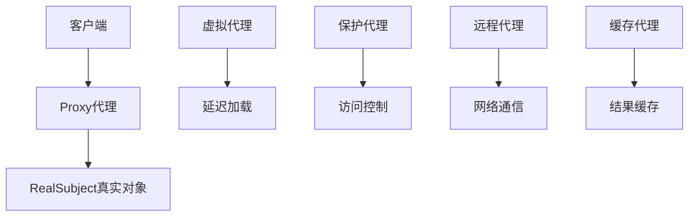
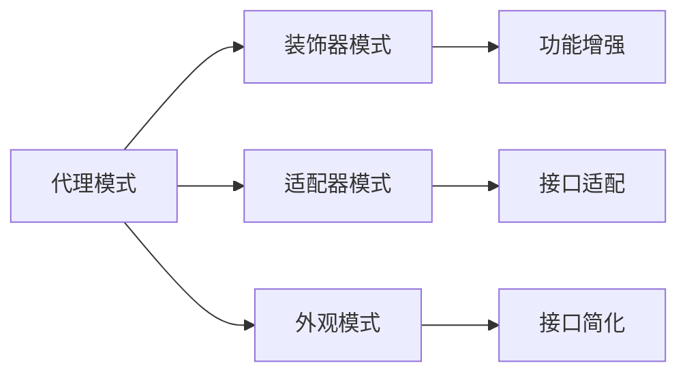

# 07-代理模式 (Proxy Pattern)

## 1. 形式化定义

### 1.1 数学定义

设 $$S$$ 为主题接口，$$P$$ 为代理集合，$$R$$ 为真实对象集合，代理模式满足以下公理：

$$
\forall s \in S, \exists p \in P, \exists r \in R: \text{proxy}(p, r) \rightarrow \text{control}(p, s)
$$

**形式化约束**：

- **接口一致性**: $$\text{interface}(p) = \text{interface}(s) = \text{interface}(r)$$
- **访问控制**: $$\text{access}(p, s) \implies \text{control}(p, \text{operation}(s))$$
- **延迟加载**: $$\text{load}(r) \iff \text{first\_access}(p, r)$$

### 1.2 类型理论定义

```go
// 主题接口
type Subject interface {
    Request() string
}

// 真实主题
type RealSubject struct{}

// 代理
type Proxy struct {
    realSubject *RealSubject
}
```

## 2. 实现原理

### 2.1 访问控制保证

**定理**: 代理模式通过代理对象控制对真实对象的访问。

**证明**:

1. 代理实现主题接口
2. 代理持有真实对象引用
3. 代理在访问前后添加控制逻辑

```go
// 主题接口
type Subject interface {
    Request() string
}

// 真实主题
type RealSubject struct{}

func (r *RealSubject) Request() string {
    return "RealSubject request"
}

// 代理
type Proxy struct {
    realSubject *RealSubject
}

func NewProxy() *Proxy {
    return &Proxy{}
}

func (p *Proxy) Request() string {
    if p.realSubject == nil {
        p.realSubject = &RealSubject{}
    }
    
    // 访问控制逻辑
    fmt.Println("Proxy: Checking access...")
    
    result := p.realSubject.Request()
    
    fmt.Println("Proxy: Logging request...")
    
    return fmt.Sprintf("Proxy: %s", result)
}
```

### 2.2 代理类型分析



## 3. Go语言实现

### 3.1 基础实现

```go
package proxy

import (
    "fmt"
    "sync"
    "time"
)

// Subject 主题接口
type Subject interface {
    Request() string
    GetID() string
}

// RealSubject 真实主题
type RealSubject struct {
    id        string
    createdAt time.Time
}

func NewRealSubject(id string) *RealSubject {
    return &RealSubject{
        id:        id,
        createdAt: time.Now(),
    }
}

func (r *RealSubject) Request() string {
    return fmt.Sprintf("RealSubject[%s] request", r.id)
}

func (r *RealSubject) GetID() string {
    return r.id
}

func (r *RealSubject) GetCreatedAt() time.Time {
    return r.createdAt
}

// Proxy 代理基类
type Proxy struct {
    realSubject *RealSubject
    mutex       sync.RWMutex
}

func NewProxy() *Proxy {
    return &Proxy{}
}

func (p *Proxy) Request() string {
    p.mutex.Lock()
    defer p.mutex.Unlock()
    
    if p.realSubject == nil {
        p.realSubject = NewRealSubject("proxy-created")
        fmt.Printf("Proxy: Created RealSubject[%s]\n", p.realSubject.GetID())
    }
    
    return fmt.Sprintf("Proxy: %s", p.realSubject.Request())
}

func (p *Proxy) GetID() string {
    p.mutex.RLock()
    defer p.mutex.RUnlock()
    
    if p.realSubject == nil {
        return "proxy-uninitialized"
    }
    return p.realSubject.GetID()
}
```

### 3.2 高级实现（多种代理类型）

```go
// VirtualProxy 虚拟代理（延迟加载）
type VirtualProxy struct {
    *Proxy
}

func NewVirtualProxy() *VirtualProxy {
    return &VirtualProxy{
        Proxy: NewProxy(),
    }
}

func (v *VirtualProxy) Request() string {
    fmt.Println("VirtualProxy: Checking if RealSubject exists...")
    
    if v.realSubject == nil {
        fmt.Println("VirtualProxy: Creating RealSubject...")
        v.realSubject = NewRealSubject("virtual-proxy")
    }
    
    return fmt.Sprintf("VirtualProxy: %s", v.realSubject.Request())
}

// ProtectionProxy 保护代理（访问控制）
type ProtectionProxy struct {
    *Proxy
    accessLevel string
}

func NewProtectionProxy(accessLevel string) *ProtectionProxy {
    return &ProtectionProxy{
        Proxy:       NewProxy(),
        accessLevel: accessLevel,
    }
}

func (p *ProtectionProxy) Request() string {
    if p.accessLevel != "admin" {
        return "ProtectionProxy: Access denied"
    }
    
    if p.realSubject == nil {
        p.realSubject = NewRealSubject("protection-proxy")
    }
    
    return fmt.Sprintf("ProtectionProxy: %s", p.realSubject.Request())
}

// CachingProxy 缓存代理
type CachingProxy struct {
    *Proxy
    cache map[string]string
    mutex sync.RWMutex
}

func NewCachingProxy() *CachingProxy {
    return &CachingProxy{
        Proxy: NewProxy(),
        cache: make(map[string]string),
    }
}

func (c *CachingProxy) Request() string {
    cacheKey := "request"

    c.mutex.RLock()
    if cached, exists := c.cache[cacheKey]; exists {
        c.mutex.RUnlock()
        return fmt.Sprintf("CachingProxy: Cached result - %s", cached)
    }
    c.mutex.RUnlock()

    c.mutex.Lock()
    defer c.mutex.Unlock()

    // 双重检查
    if cached, exists := c.cache[cacheKey]; exists {
        return fmt.Sprintf("CachingProxy: Cached result - %s", cached)
    }

    if c.realSubject == nil {
        c.realSubject = NewRealSubject("caching-proxy")
    }

    result := c.realSubject.Request()
    c.cache[cacheKey] = result

    return fmt.Sprintf("CachingProxy: Fresh result - %s", result)
}

// LoggingProxy 日志代理
type LoggingProxy struct {
    *Proxy
    logger func(string)
}

func NewLoggingProxy(logger func(string)) *LoggingProxy {
    return &LoggingProxy{
        Proxy:  NewProxy(),
        logger: logger,
    }
}

func (l *LoggingProxy) Request() string {
    l.logger(fmt.Sprintf("LoggingProxy: Before request to %s", l.GetID()))

    if l.realSubject == nil {
        l.realSubject = NewRealSubject("logging-proxy")
    }

    result := l.realSubject.Request()

    l.logger(fmt.Sprintf("LoggingProxy: After request, result: %s", result))

    return fmt.Sprintf("LoggingProxy: %s", result)
}
```

### 3.3 远程代理和智能代理

```go
// RemoteProxy 远程代理
type RemoteProxy struct {
    *Proxy
    serverURL string
}

func NewRemoteProxy(serverURL string) *RemoteProxy {
    return &RemoteProxy{
        Proxy:     NewProxy(),
        serverURL: serverURL,
    }
}

func (r *RemoteProxy) Request() string {
    fmt.Printf("RemoteProxy: Sending request to %s\n", r.serverURL)

    // 模拟网络请求
    time.Sleep(100 * time.Millisecond)

    // 模拟远程响应
    response := fmt.Sprintf("Remote response from %s", r.serverURL)

    return fmt.Sprintf("RemoteProxy: %s", response)
}

// SmartProxy 智能代理
type SmartProxy struct {
    *Proxy
    accessCount int
    lastAccess  time.Time
    mutex       sync.RWMutex
}

func NewSmartProxy() *SmartProxy {
    return &SmartProxy{
        Proxy: NewProxy(),
    }
}

func (s *SmartProxy) Request() string {
    s.mutex.Lock()
    defer s.mutex.Unlock()

    s.accessCount++
    s.lastAccess = time.Now()

    if s.realSubject == nil {
        s.realSubject = NewRealSubject("smart-proxy")
    }

    result := s.realSubject.Request()

    return fmt.Sprintf("SmartProxy[access=%d, last=%s]: %s",
        s.accessCount, s.lastAccess.Format("15:04:05"), result)
}

func (s *SmartProxy) GetAccessStats() map[string]interface{} {
    s.mutex.RLock()
    defer s.mutex.RUnlock()

    return map[string]interface{}{
        "accessCount": s.accessCount,
        "lastAccess":  s.lastAccess,
    }
}

// ConfigurableProxy 可配置代理
type ConfigurableProxy struct {
    *Proxy
    config map[string]interface{}
}

func NewConfigurableProxy(config map[string]interface{}) *ConfigurableProxy {
    return &ConfigurableProxy{
        Proxy:  NewProxy(),
        config: config,
    }
}

func (c *ConfigurableProxy) Request() string {
    // 根据配置决定行为
    if enabled, exists := c.config["enabled"]; exists && !enabled.(bool) {
        return "ConfigurableProxy: Disabled"
    }

    if delay, exists := c.config["delay"]; exists {
        time.Sleep(time.Duration(delay.(int)) * time.Millisecond)
    }

    if c.realSubject == nil {
        c.realSubject = NewRealSubject("configurable-proxy")
    }

    result := c.realSubject.Request()

    if prefix, exists := c.config["prefix"]; exists {
        result = fmt.Sprintf("%s: %s", prefix, result)
    }

    return fmt.Sprintf("ConfigurableProxy: %s", result)
}

func (c *ConfigurableProxy) GetConfig() map[string]interface{} {
    return c.config
}
```

## 4. 使用示例

### 4.1 基础使用

```go
package main

import (
    "fmt"

    "github.com/your-project/proxy"
)

func main() {
    // 使用基础代理
    proxy := proxy.NewProxy()
    fmt.Printf("Proxy request: %s\n", proxy.Request())
    fmt.Printf("Proxy ID: %s\n", proxy.GetID())

    // 使用虚拟代理
    virtualProxy := proxy.NewVirtualProxy()
    fmt.Printf("Virtual proxy: %s\n", virtualProxy.Request())

    // 使用保护代理
    protectionProxy := proxy.NewProtectionProxy("user")
    fmt.Printf("User access: %s\n", protectionProxy.Request())

    adminProxy := proxy.NewProtectionProxy("admin")
    fmt.Printf("Admin access: %s\n", adminProxy.Request())
}
```

### 4.2 高级代理使用

```go
func advancedProxyExample() {
    // 缓存代理
    cachingProxy := proxy.NewCachingProxy()
    fmt.Printf("Caching proxy 1: %s\n", cachingProxy.Request())
    fmt.Printf("Caching proxy 2: %s\n", cachingProxy.Request())

    // 日志代理
    logger := func(msg string) {
        fmt.Printf("LOG: %s\n", msg)
    }

    loggingProxy := proxy.NewLoggingProxy(logger)
    fmt.Printf("Logging proxy: %s\n", loggingProxy.Request())

    // 智能代理
    smartProxy := proxy.NewSmartProxy()
    fmt.Printf("Smart proxy 1: %s\n", smartProxy.Request())
    fmt.Printf("Smart proxy 2: %s\n", smartProxy.Request())
    fmt.Printf("Access stats: %v\n", smartProxy.GetAccessStats())
}
```

### 4.3 配置化代理使用

```go
func configurableProxyExample() {
    configs := []map[string]interface{}{
        {"enabled": true, "prefix": "Custom", "delay": 100},
        {"enabled": false, "prefix": "Disabled"},
        {"enabled": true, "prefix": "Fast", "delay": 0},
    }

    for i, config := range configs {
        proxy := proxy.NewConfigurableProxy(config)
        fmt.Printf("Config %d: %s\n", i+1, proxy.Request())
    }
}
```

## 5. 性能分析

### 5.1 时间复杂度

| 操作 | 时间复杂度 | 说明 |
|------|------------|------|
| 代理创建 | O(1) | 直接实例化 |
| 代理请求 | O(1) | 方法调用 |
| 缓存查找 | O(1) | 哈希表查找 |

### 5.2 空间复杂度

- **内存占用**: O(1) - 代理对象开销
- **缓存开销**: O(n) - n为缓存条目数量
- **日志开销**: O(1) - 日志函数引用

## 6. 应用场景

### 6.1 适用场景

1. **远程服务**: 访问远程对象
2. **访问控制**: 控制对象访问权限
3. **缓存机制**: 缓存对象操作结果
4. **日志记录**: 记录对象操作日志
5. **延迟加载**: 延迟创建昂贵对象

### 6.2 不适用场景

1. **简单对象**: 不需要访问控制
2. **性能敏感**: 代理开销过大
3. **直接访问**: 需要直接访问对象

## 7. 设计模式关系

### 7.1 与其他模式的关系



### 7.2 组合使用

```go
// 代理 + 工厂模式
type ProxyFactory interface {
    CreateProxy(proxyType string) Subject
}

type ConcreteProxyFactory struct{}

func (f *ConcreteProxyFactory) CreateProxy(proxyType string) Subject {
    switch proxyType {
    case "virtual":
        return NewVirtualProxy()
    case "protection":
        return NewProtectionProxy("admin")
    case "caching":
        return NewCachingProxy()
    case "logging":
        return NewLoggingProxy(func(msg string) {
            fmt.Printf("Factory LOG: %s\n", msg)
        })
    default:
        return NewProxy()
    }
}

// 代理 + 单例模式
var (
    proxyInstance Subject
    proxyOnce     sync.Once
)

func GetProxyInstance() Subject {
    proxyOnce.Do(func() {
        proxyInstance = NewCachingProxy()
    })
    return proxyInstance
}
```

## 8. 形式化验证

### 8.1 代理一致性验证

```go
// 验证代理一致性
func VerifyProxyConsistency(proxy Subject) bool {
    if proxy == nil {
        return false
    }

    // 验证代理实现了主题接口
    result := proxy.Request()
    if result == "" {
        return false
    }

    // 验证代理ID
    id := proxy.GetID()
    if id == "" {
        return false
    }

    return true
}
```

### 8.2 访问控制验证

```go
func TestAccessControl(t *testing.T) {
    // 测试保护代理
    userProxy := NewProtectionProxy("user")
    adminProxy := NewProtectionProxy("admin")

    userResult := userProxy.Request()
    adminResult := adminProxy.Request()

    if !contains(userResult, "Access denied") {
        t.Error("User proxy should deny access")
    }

    if contains(adminResult, "Access denied") {
        t.Error("Admin proxy should allow access")
    }
}

func contains(s, substr string) bool {
    return len(s) >= len(substr) && (s == substr ||
        (len(s) > len(substr) && (s[:len(substr)] == substr ||
         s[len(s)-len(substr):] == substr ||
         contains(s[1:], substr))))
}
```

## 9. 总结

代理模式是结构型模式中的重要模式，它通过代理对象控制对真实对象的访问，提供了访问控制、缓存、日志等功 
能。

### 9.1 关键要点

1. **访问控制**: 通过代理控制对象访问
2. **接口一致性**: 代理实现相同接口
3. **延迟加载**: 支持延迟创建对象
4. **功能增强**: 添加缓存、日志等功能

### 9.2 最佳实践

1. 合理选择代理类型
2. 考虑代理的性能开销
3. 使用配置化代理
4. 注意线程安全

### 9.3 与Go语言的结合

Go语言的接口和结构体机制非常适合代理模式：

- 接口定义统一契约
- 结构体实现代理逻辑
- 组合优于继承
- 简洁的类型系统

---

**返回**: [结构型模式目录](./README.md)
