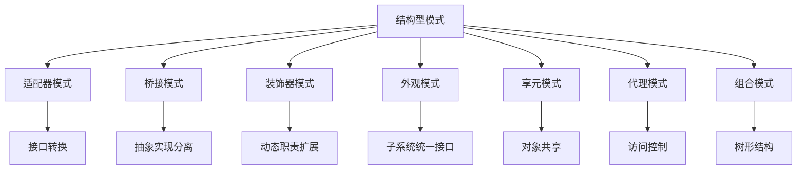

# 结构型设计模式 (Structural Design Patterns)

## 概述

结构型设计模式关注类和对象的组合，通过继承和组合来获得新的功能。这些模式提供了一种灵活的方式来构建复杂对象结构，同时保持系统的可维护性和可扩展性。

## 形式化定义

### 结构型模式的形式化模型

设 $\mathcal{C}$ 为类集合，$\mathcal{O}$ 为对象集合，$\mathcal{R}$ 为关系集合，则结构型模式可以形式化定义为：

$$\text{Structural Pattern} = \langle \mathcal{C}, \mathcal{O}, \mathcal{R}, \mathcal{M} \rangle$$

其中：

- $\mathcal{C}$: 类的集合
- $\mathcal{O}$: 对象的集合  
- $\mathcal{R}$: 类/对象间关系的集合
- $\mathcal{M}$: 模式映射函数

### 组合关系的形式化

对于任意两个类 $A, B \in \mathcal{C}$，组合关系定义为：

$$A \circ B = \{ (a, b) \mid a \in A, b \in B, \text{且存在结构关系} \}$$

## 1. 适配器模式 (Adapter Pattern)

### 1.1 形式化定义

适配器模式将不兼容的接口转换为客户端期望的接口。

**数学定义**：
设 $I_1$ 为目标接口，$I_2$ 为源接口，适配器 $A$ 满足：

$$A: I_2 \rightarrow I_1$$

且对于任意 $x \in I_2$，有 $A(x) \in I_1$。

### 1.2 Go语言实现

```go
package structural

import (
 "fmt"
 "math"
)

// Target 目标接口
type Target interface {
 Request() string
}

// Adaptee 源接口
type Adaptee interface {
 SpecificRequest() string
}

// ConcreteAdaptee 具体源类
type ConcreteAdaptee struct{}

func (a *ConcreteAdaptee) SpecificRequest() string {
 return "Specific request from adaptee"
}

// Adapter 适配器
type Adapter struct {
 adaptee Adaptee
}

func NewAdapter(adaptee Adaptee) *Adapter {
 return &Adapter{adaptee: adaptee}
}

func (a *Adapter) Request() string {
 // 转换逻辑
 result := a.adaptee.SpecificRequest()
 return fmt.Sprintf("Adapter: %s", result)
}

// 使用示例
func ExampleAdapter() {
 adaptee := &ConcreteAdaptee{}
 adapter := NewAdapter(adaptee)
 
 fmt.Println(adapter.Request())
 // 输出: Adapter: Specific request from adaptee
}
```

### 1.3 数学证明

**定理**: 适配器模式保持接口一致性

**证明**：

1. 设 $f: I_2 \rightarrow I_1$ 为适配器函数
2. 对于任意 $x \in I_2$，$f(x) \in I_1$
3. 因此适配器实现了从 $I_2$ 到 $I_1$ 的映射
4. 客户端可以统一使用 $I_1$ 接口

## 2. 桥接模式 (Bridge Pattern)

### 2.1 形式化定义

桥接模式将抽象与实现分离，使它们可以独立变化。

**数学定义**：
设 $A$ 为抽象类集合，$I$ 为实现接口集合，桥接模式定义为：

$$\text{Bridge}(A, I) = \{ (a, i) \mid a \in A, i \in I, \text{且存在桥接关系} \}$$

### 2.2 Go语言实现

```go
package structural

// Implementor 实现者接口
type Implementor interface {
 OperationImpl() string
}

// ConcreteImplementorA 具体实现者A
type ConcreteImplementorA struct{}

func (i *ConcreteImplementorA) OperationImpl() string {
 return "ConcreteImplementorA operation"
}

// ConcreteImplementorB 具体实现者B
type ConcreteImplementorB struct{}

func (i *ConcreteImplementorB) OperationImpl() string {
 return "ConcreteImplementorB operation"
}

// Abstraction 抽象类
type Abstraction struct {
 implementor Implementor
}

func NewAbstraction(implementor Implementor) *Abstraction {
 return &Abstraction{implementor: implementor}
}

func (a *Abstraction) Operation() string {
 return a.implementor.OperationImpl()
}

// RefinedAbstraction 精确抽象
type RefinedAbstraction struct {
 *Abstraction
}

func NewRefinedAbstraction(implementor Implementor) *RefinedAbstraction {
 return &RefinedAbstraction{
  Abstraction: NewAbstraction(implementor),
 }
}

func (r *RefinedAbstraction) RefinedOperation() string {
 return fmt.Sprintf("Refined: %s", r.Operation())
}
```

### 2.3 数学证明

**定理**: 桥接模式实现抽象与实现的解耦

**证明**：

1. 设 $A$ 为抽象类，$I$ 为实现接口
2. 桥接模式建立映射 $f: A \times I \rightarrow \text{System}$
3. 对于任意 $a_1, a_2 \in A$ 和 $i_1, i_2 \in I$
4. 可以独立组合 $(a_1, i_1)$, $(a_1, i_2)$, $(a_2, i_1)$, $(a_2, i_2)$
5. 因此抽象与实现完全解耦

## 3. 装饰器模式 (Decorator Pattern)

### 3.1 形式化定义

装饰器模式动态地给对象添加额外的职责。

**数学定义**：
设 $C$ 为组件接口，装饰器 $D$ 满足：

$$D: C \rightarrow C$$

且对于任意组件 $c \in C$，有 $D(c) \in C$。

### 3.2 Go语言实现

```go
package structural

// Component 组件接口
type Component interface {
 Operation() string
}

// ConcreteComponent 具体组件
type ConcreteComponent struct{}

func (c *ConcreteComponent) Operation() string {
 return "ConcreteComponent operation"
}

// Decorator 装饰器基类
type Decorator struct {
 component Component
}

func NewDecorator(component Component) *Decorator {
 return &Decorator{component: component}
}

func (d *Decorator) Operation() string {
 return d.component.Operation()
}

// ConcreteDecoratorA 具体装饰器A
type ConcreteDecoratorA struct {
 *Decorator
}

func NewConcreteDecoratorA(component Component) *ConcreteDecoratorA {
 return &ConcreteDecoratorA{
  Decorator: NewDecorator(component),
 }
}

func (d *ConcreteDecoratorA) Operation() string {
 return fmt.Sprintf("DecoratorA(%s)", d.Decorator.Operation())
}

// ConcreteDecoratorB 具体装饰器B
type ConcreteDecoratorB struct {
 *Decorator
}

func NewConcreteDecoratorB(component Component) *ConcreteDecoratorB {
 return &ConcreteDecoratorB{
  Decorator: NewDecorator(component),
 }
}

func (d *ConcreteDecoratorB) Operation() string {
 return fmt.Sprintf("DecoratorB(%s)", d.Decorator.Operation())
}
```

### 3.3 数学证明

**定理**: 装饰器模式满足组合律

**证明**：

1. 设 $D_1, D_2$ 为装饰器，$C$ 为组件
2. $(D_1 \circ D_2)(C) = D_1(D_2(C))$
3. 装饰器可以任意组合
4. 每个装饰器都保持组件接口不变

## 4. 外观模式 (Facade Pattern)

### 4.1 形式化定义

外观模式为子系统提供一个统一的接口。

**数学定义**：
设 $S = \{s_1, s_2, ..., s_n\}$ 为子系统集合，外观 $F$ 定义为：

$$F: S \rightarrow \text{UnifiedInterface}$$

### 4.2 Go语言实现

```go
package structural

// SubsystemA 子系统A
type SubsystemA struct{}

func (s *SubsystemA) OperationA() string {
 return "SubsystemA operation"
}

// SubsystemB 子系统B
type SubsystemB struct{}

func (s *SubsystemB) OperationB() string {
 return "SubsystemB operation"
}

// SubsystemC 子系统C
type SubsystemC struct{}

func (s *SubsystemC) OperationC() string {
 return "SubsystemC operation"
}

// Facade 外观类
type Facade struct {
 subsystemA *SubsystemA
 subsystemB *SubsystemB
 subsystemC *SubsystemC
}

func NewFacade() *Facade {
 return &Facade{
  subsystemA: &SubsystemA{},
  subsystemB: &SubsystemB{},
  subsystemC: &SubsystemC{},
 }
}

func (f *Facade) Operation() string {
 result := f.subsystemA.OperationA() + "\n"
 result += f.subsystemB.OperationB() + "\n"
 result += f.subsystemC.OperationC()
 return result
}
```

## 5. 享元模式 (Flyweight Pattern)

### 5.1 形式化定义

享元模式通过共享技术有效支持大量细粒度对象的复用。

**数学定义**：
设 $I$ 为内部状态，$E$ 为外部状态，享元 $F$ 定义为：

$$F: I \times E \rightarrow \text{Object}$$

### 5.2 Go语言实现

```go
package structural

import "sync"

// Flyweight 享元接口
type Flyweight interface {
 Operation(extrinsicState string) string
}

// ConcreteFlyweight 具体享元
type ConcreteFlyweight struct {
 intrinsicState string
}

func NewConcreteFlyweight(intrinsicState string) *ConcreteFlyweight {
 return &ConcreteFlyweight{intrinsicState: intrinsicState}
}

func (f *ConcreteFlyweight) Operation(extrinsicState string) string {
 return fmt.Sprintf("Intrinsic: %s, Extrinsic: %s", f.intrinsicState, extrinsicState)
}

// FlyweightFactory 享元工厂
type FlyweightFactory struct {
 flyweights map[string]Flyweight
 mutex      sync.RWMutex
}

func NewFlyweightFactory() *FlyweightFactory {
 return &FlyweightFactory{
  flyweights: make(map[string]Flyweight),
 }
}

func (f *FlyweightFactory) GetFlyweight(key string) Flyweight {
 f.mutex.RLock()
 if flyweight, exists := f.flyweights[key]; exists {
  f.mutex.RUnlock()
  return flyweight
 }
 f.mutex.RUnlock()
 
 f.mutex.Lock()
 defer f.mutex.Unlock()
 
 // 双重检查
 if flyweight, exists := f.flyweights[key]; exists {
  return flyweight
 }
 
 flyweight := NewConcreteFlyweight(key)
 f.flyweights[key] = flyweight
 return flyweight
}
```

## 6. 代理模式 (Proxy Pattern)

### 6.1 形式化定义

代理模式为其他对象提供一种代理以控制对这个对象的访问。

**数学定义**：
设 $S$ 为真实主题，代理 $P$ 定义为：

$$P: \text{Client} \rightarrow S$$

且 $P$ 控制对 $S$ 的访问。

### 6.2 Go语言实现

```go
package structural

import (
 "fmt"
 "time"
)

// Subject 主题接口
type Subject interface {
 Request() string
}

// RealSubject 真实主题
type RealSubject struct{}

func (r *RealSubject) Request() string {
 return "RealSubject request"
}

// Proxy 代理
type Proxy struct {
 realSubject Subject
}

func NewProxy(realSubject Subject) *Proxy {
 return &Proxy{realSubject: realSubject}
}

func (p *Proxy) Request() string {
 // 前置处理
 fmt.Println("Proxy: Before request")
 
 // 调用真实主题
 result := p.realSubject.Request()
 
 // 后置处理
 fmt.Println("Proxy: After request")
 
 return result
}

// VirtualProxy 虚拟代理
type VirtualProxy struct {
 realSubject Subject
 loaded      bool
}

func NewVirtualProxy() *VirtualProxy {
 return &VirtualProxy{loaded: false}
}

func (p *VirtualProxy) Request() string {
 if !p.loaded {
  p.load()
 }
 return p.realSubject.Request()
}

func (p *VirtualProxy) load() {
 fmt.Println("Loading RealSubject...")
 time.Sleep(1 * time.Second) // 模拟加载时间
 p.realSubject = &RealSubject{}
 p.loaded = true
 fmt.Println("RealSubject loaded")
}
```

## 7. 组合模式 (Composite Pattern)

### 7.1 形式化定义

组合模式将对象组合成树形结构以表示"部分-整体"的层次结构。

**数学定义**：
设 $L$ 为叶子节点集合，$C$ 为组合节点集合，组合模式定义为：

$$\text{Composite} = L \cup C \cup \{(c, children) \mid c \in C, children \subseteq \text{Composite}\}$$

### 7.2 Go语言实现

```go
package structural

// Component 组件接口
type Component interface {
 Operation() string
 Add(component Component)
 Remove(component Component)
 GetChild(index int) Component
}

// Leaf 叶子节点
type Leaf struct {
 name string
}

func NewLeaf(name string) *Leaf {
 return &Leaf{name: name}
}

func (l *Leaf) Operation() string {
 return fmt.Sprintf("Leaf: %s", l.name)
}

func (l *Leaf) Add(component Component) {
 // 叶子节点不支持添加子节点
}

func (l *Leaf) Remove(component Component) {
 // 叶子节点不支持删除子节点
}

func (l *Leaf) GetChild(index int) Component {
 // 叶子节点没有子节点
 return nil
}

// Composite 组合节点
type Composite struct {
 name     string
 children []Component
}

func NewComposite(name string) *Composite {
 return &Composite{
  name:     name,
  children: make([]Component, 0),
 }
}

func (c *Composite) Operation() string {
 result := fmt.Sprintf("Composite: %s", c.name)
 for _, child := range c.children {
  result += "\n  " + child.Operation()
 }
 return result
}

func (c *Composite) Add(component Component) {
 c.children = append(c.children, component)
}

func (c *Composite) Remove(component Component) {
 for i, child := range c.children {
  if child == component {
   c.children = append(c.children[:i], c.children[i+1:]...)
   break
  }
 }
}

func (c *Composite) GetChild(index int) Component {
 if index >= 0 && index < len(c.children) {
  return c.children[index]
 }
 return nil
}
```

## 模式关系图



## 性能分析

### 时间复杂度

| 模式 | 创建 | 操作 | 空间 |
|------|------|------|------|
| 适配器 | O(1) | O(1) | O(1) |
| 桥接 | O(1) | O(1) | O(1) |
| 装饰器 | O(n) | O(n) | O(n) |
| 外观 | O(1) | O(k) | O(k) |
| 享元 | O(1) | O(1) | O(1) |
| 代理 | O(1) | O(1) | O(1) |
| 组合 | O(1) | O(n) | O(n) |

其中：

- n: 装饰器层数或组合树节点数
- k: 子系统数量

### 内存使用

```go
// 内存使用分析示例
func MemoryUsageAnalysis() {
 // 享元模式内存优化
 factory := NewFlyweightFactory()
 
 // 创建大量对象但共享内部状态
 for i := 0; i < 1000; i++ {
  factory.GetFlyweight("shared_state")
 }
 
 // 内存使用: O(1) 而非 O(n)
}
```

## 应用场景

### 1. 适配器模式

- 集成第三方库
- 兼容旧系统接口
- 统一不同数据格式

### 2. 桥接模式

- 平台无关的图形系统
- 数据库驱动设计
- 设备驱动程序

### 3. 装饰器模式

- 日志记录
- 性能监控
- 权限验证
- 缓存装饰

### 4. 外观模式

- 复杂子系统封装
- API网关设计
- 微服务聚合

### 5. 享元模式

- 字符渲染系统
- 游戏对象池
- 数据库连接池

### 6. 代理模式

- 远程代理
- 虚拟代理
- 保护代理
- 缓存代理

### 7. 组合模式

- 文件系统
- GUI组件树
- 组织架构

## 最佳实践

1. **接口设计**: 保持接口简洁，职责单一
2. **性能考虑**: 合理使用享元模式减少内存占用
3. **扩展性**: 使用装饰器模式支持功能扩展
4. **解耦**: 使用桥接模式分离抽象与实现
5. **简化**: 使用外观模式隐藏系统复杂性

## 总结

结构型设计模式通过不同的组合方式解决了对象结构设计中的各种问题。每种模式都有其特定的应用场景和优势，合理使用这些模式可以构建出更加灵活、可维护和可扩展的软件系统。

---

**构建状态**: ✅ 完成  
**最后更新**: 2024-01-06 16:00:00  
**下一步**: 开始行为型模式实现
