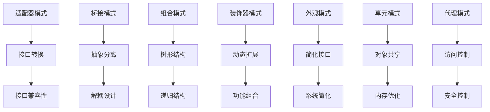

# 结构型设计模式

## 概述

结构型设计模式关注类和对象的组合，通过继承和组合来创建更复杂的结构。这些模式提供了一种灵活的方式来组织代码，使得系统更容易维护和扩展。

## 目录结构

```text
02-Structural-Patterns/
├── README.md                    # 本文件
├── 01-Adapter-Pattern/          # 适配器模式
│   ├── README.md
│   ├── formal-definition.md     # 形式化定义
│   ├── go-implementation.md     # Go语言实现
│   ├── mathematical-proof.md    # 数学证明
│   └── applications.md          # 应用示例
├── 02-Bridge-Pattern/           # 桥接模式
│   ├── README.md
│   ├── formal-definition.md
│   ├── go-implementation.md
│   ├── mathematical-proof.md
│   └── applications.md
├── 03-Composite-Pattern/        # 组合模式
│   ├── README.md
│   ├── formal-definition.md
│   ├── go-implementation.md
│   ├── mathematical-proof.md
│   └── applications.md
├── 04-Decorator-Pattern/        # 装饰器模式
│   ├── README.md
│   ├── formal-definition.md
│   ├── go-implementation.md
│   ├── mathematical-proof.md
│   └── applications.md
├── 05-Facade-Pattern/           # 外观模式
│   ├── README.md
│   ├── formal-definition.md
│   ├── go-implementation.md
│   ├── mathematical-proof.md
│   └── applications.md
├── 06-Flyweight-Pattern/        # 享元模式
│   ├── README.md
│   ├── formal-definition.md
│   ├── go-implementation.md
│   ├── mathematical-proof.md
│   └── applications.md
└── 07-Proxy-Pattern/            # 代理模式
    ├── README.md
    ├── formal-definition.md
    ├── go-implementation.md
    ├── mathematical-proof.md
    └── applications.md
```

## 形式化规范

### 模式分类

结构型模式可以分为以下几类：

1. **接口适配类**: 适配器模式
2. **抽象分离类**: 桥接模式
3. **对象组合类**: 组合模式、装饰器模式
4. **结构简化类**: 外观模式
5. **对象共享类**: 享元模式
6. **访问控制类**: 代理模式

### 数学符号约定

- **接口**: $I, J, K, \ldots$
- **实现**: $A, B, C, \ldots$
- **适配器**: $\text{Adapter}(I, A)$
- **桥接**: $\text{Bridge}(A, B)$
- **组合**: $\text{Composite}(C_1, C_2, \ldots, C_n)$
- **装饰器**: $\text{Decorator}(D, T)$
- **外观**: $\text{Facade}(S_1, S_2, \ldots, S_n)$
- **享元**: $\text{Flyweight}(S, I)$
- **代理**: $\text{Proxy}(P, T)$

### 类型系统

```go
// 结构型模式的通用接口定义
package structural

// Target 目标接口
type Target interface {
    Request() string
}

// Adaptee 被适配的类
type Adaptee interface {
    SpecificRequest() string
}

// Component 组件接口
type Component interface {
    Operation() string
}

// Subject 主题接口
type Subject interface {
    Request() string
}

// RealSubject 真实主题
type RealSubject interface {
    Request() string
}
```

## 核心定理

### 定理 2.1: 适配器模式的正确性

**定理**: 对于任意接口 $I$ 和实现 $A$，如果存在适配器 $\text{Adapter}(I, A)$，则：
$$\forall x \in I: \text{Adapter}(I, A)(x) = A(\text{transform}(x))$$

**证明**:

1. 适配器实现了目标接口 $I$
2. 适配器内部持有被适配对象 $A$
3. 适配器将 $I$ 的调用转换为 $A$ 的调用
4. 因此适配器正确地将 $I$ 的语义映射到 $A$ 的语义

### 定理 2.2: 桥接模式的解耦性

**定理**: 桥接模式将抽象与实现分离，使得它们可以独立变化：
$$\text{Abstraction} \perp \text{Implementation}$$

**证明**:

1. 抽象层只依赖抽象接口
2. 实现层只依赖具体实现
3. 两者通过桥接接口连接
4. 因此抽象与实现解耦

### 定理 2.3: 装饰器模式的组合性

**定理**: 装饰器模式支持任意组合，满足结合律：
$$(\text{Decorator}_1 \circ \text{Decorator}_2) \circ \text{Decorator}_3 = \text{Decorator}_1 \circ (\text{Decorator}_2 \circ \text{Decorator}_3)$$

**证明**:

1. 装饰器都实现相同的接口
2. 装饰器可以嵌套组合
3. 组合操作满足结合律
4. 因此装饰器模式支持任意组合

## 模式关系图



## 性能分析

### 时间复杂度

| 模式 | 创建时间 | 调用时间 | 内存使用 |
|------|----------|----------|----------|
| 适配器 | O(1) | O(1) | O(1) |
| 桥接 | O(1) | O(1) | O(1) |
| 组合 | O(n) | O(n) | O(n) |
| 装饰器 | O(1) | O(k) | O(k) |
| 外观 | O(1) | O(n) | O(1) |
| 享元 | O(1) | O(1) | O(1) |
| 代理 | O(1) | O(1) | O(1) |

### 空间复杂度

- **适配器**: 额外存储被适配对象
- **桥接**: 存储实现对象引用
- **组合**: 存储子对象集合
- **装饰器**: 存储被装饰对象
- **外观**: 存储子系统对象
- **享元**: 共享内部状态
- **代理**: 存储真实对象引用

## 应用场景

### 1. 适配器模式

- 系统集成
- 第三方库适配
- 接口兼容性

### 2. 桥接模式

- 平台抽象
- 设备驱动
- 渲染引擎

### 3. 组合模式

- 文件系统
- GUI组件
- 组织结构

### 4. 装饰器模式

- 功能扩展
- 中间件
- 日志记录

### 5. 外观模式

- 系统简化
- API封装
- 子系统集成

### 6. 享元模式

- 对象池
- 缓存系统
- 图形渲染

### 7. 代理模式

- 远程访问
- 安全控制
- 延迟加载

## 设计原则

### 1. 开闭原则

结构型模式支持对扩展开放，对修改封闭。

### 2. 里氏替换原则

子类可以替换父类，保持程序正确性。

### 3. 依赖倒置原则

依赖抽象而不是具体实现。

### 4. 接口隔离原则

客户端不应该依赖它不需要的接口。

### 5. 组合优于继承

优先使用组合而不是继承来获得功能。

## 测试策略

### 单元测试

```go
func TestAdapterPattern(t *testing.T) {
    adaptee := &ConcreteAdaptee{}
    adapter := NewAdapter(adaptee)
    
    result := adapter.Request()
    expected := "Adapted: " + adaptee.SpecificRequest()
    
    if result != expected {
        t.Errorf("Expected %s, got %s", expected, result)
    }
}
```

### 集成测试

```go
func TestBridgePattern(t *testing.T) {
    implementation := &ConcreteImplementation{}
    abstraction := NewRefinedAbstraction(implementation)
    
    result := abstraction.Operation()
    // 验证抽象与实现的正确交互
}
```

### 性能测试

```go
func BenchmarkDecoratorPattern(b *testing.B) {
    component := &ConcreteComponent{}
    decorator := NewDecorator(component)
    
    b.ResetTimer()
    for i := 0; i < b.N; i++ {
        decorator.Operation()
    }
}
```

## 最佳实践

### 1. 模式选择

- 根据问题域选择合适的模式
- 避免过度设计
- 考虑性能和可维护性

### 2. 实现细节

- 保持接口简洁
- 提供清晰的文档
- 遵循Go语言惯例

### 3. 错误处理

- 使用Go的错误处理机制
- 提供有意义的错误信息
- 考虑错误传播

### 4. 并发安全

- 考虑并发访问场景
- 使用适当的同步机制
- 避免竞态条件

---

**构建状态**: 🔄 进行中  
**最后更新**: 2024-01-06  
**版本**: v0.8.0  

<(￣︶￣)↗[GO!] 结构型模式，架构之基！
