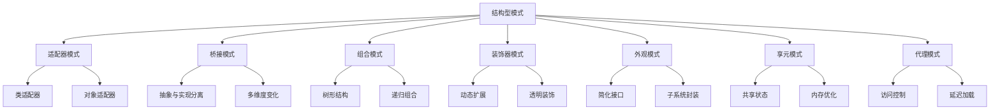

# 结构型设计模式 (Structural Design Patterns)

## 概述

结构型设计模式关注类和对象的组合，通过继承和组合来创建更复杂的结构。这些模式提供了一种灵活的方式来构建对象结构，同时保持系统的可维护性和可扩展性。

## 形式化定义

### 结构型模式的形式化描述

设 $\mathcal{C}$ 为类的集合，$\mathcal{O}$ 为对象的集合，$\mathcal{R}$ 为关系的集合。

**定义 1.1** (结构型模式)
结构型模式是一个三元组 $(\mathcal{C}, \mathcal{O}, \mathcal{R})$，其中：

- $\mathcal{C}$ 是参与模式的类的集合
- $\mathcal{O}$ 是这些类的实例对象的集合  
- $\mathcal{R}$ 是类之间和对象之间的结构关系集合

**公理 1.1** (结构一致性)
对于任意结构型模式 $P = (\mathcal{C}, \mathcal{O}, \mathcal{R})$，必须满足：
$$\forall c_1, c_2 \in \mathcal{C}, \forall r \in \mathcal{R}: r(c_1, c_2) \Rightarrow \text{consistent}(c_1, c_2)$$

**定理 1.1** (结构可组合性)
如果 $P_1 = (\mathcal{C}_1, \mathcal{O}_1, \mathcal{R}_1)$ 和 $P_2 = (\mathcal{C}_2, \mathcal{O}_2, \mathcal{R}_2)$ 都是有效的结构型模式，那么它们的组合 $P_1 \circ P_2$ 也是有效的结构型模式。

## 模式分类



## 1. 适配器模式 (Adapter Pattern)

### 1.1 形式化定义

**定义 1.2** (适配器模式)
适配器模式是一个四元组 $(\text{Target}, \text{Adaptee}, \text{Adapter}, \text{Client})$，其中：

- $\text{Target}$: 目标接口，定义客户端期望的接口
- $\text{Adaptee}$: 被适配的类，具有不兼容的接口
- $\text{Adapter}$: 适配器类，将 Adaptee 的接口转换为 Target 接口
- $\text{Client}$: 客户端，使用 Target 接口

**公理 1.2** (适配器正确性)
对于任意适配器 $A$，必须满足：
$$\forall a \in \text{Adaptee}, \forall t \in \text{Target}: A(a) = t \Rightarrow \text{behavior}(a) \equiv \text{behavior}(t)$$

### 1.2 Go语言实现

```go
package structural

import (
 "fmt"
 "time"
)

// Target 目标接口
type PaymentProcessor interface {
 ProcessPayment(amount float64) error
 GetPaymentStatus() string
}

// Adaptee 被适配的类
type LegacyPaymentSystem struct {
 balance float64
}

func (l *LegacyPaymentSystem) DeductMoney(amount float64) bool {
 if l.balance >= amount {
  l.balance -= amount
  return true
 }
 return false
}

func (l *LegacyPaymentSystem) GetBalance() float64 {
 return l.balance
}

// Adapter 适配器类
type PaymentAdapter struct {
 legacy *LegacyPaymentSystem
}

func NewPaymentAdapter(initialBalance float64) *PaymentAdapter {
 return &PaymentAdapter{
  legacy: &LegacyPaymentSystem{balance: initialBalance},
 }
}

func (p *PaymentAdapter) ProcessPayment(amount float64) error {
 if p.legacy.DeductMoney(amount) {
  return nil
 }
 return fmt.Errorf("insufficient balance: %.2f", p.legacy.GetBalance())
}

func (p *PaymentAdapter) GetPaymentStatus() string {
 return fmt.Sprintf("Balance: %.2f", p.legacy.GetBalance())
}

// Client 客户端
type PaymentClient struct {
 processor PaymentProcessor
}

func NewPaymentClient(processor PaymentProcessor) *PaymentClient {
 return &PaymentClient{processor: processor}
}

func (c *PaymentClient) MakePayment(amount float64) {
 if err := c.processor.ProcessPayment(amount); err != nil {
  fmt.Printf("Payment failed: %v\n", err)
 } else {
  fmt.Printf("Payment successful. %s\n", c.processor.GetPaymentStatus())
 }
}

// 并发安全的适配器实现
type ThreadSafePaymentAdapter struct {
 legacy *LegacyPaymentSystem
 mutex  chan struct{}
}

func NewThreadSafePaymentAdapter(initialBalance float64) *ThreadSafePaymentAdapter {
 return &ThreadSafePaymentAdapter{
  legacy: &LegacyPaymentSystem{balance: initialBalance},
  mutex:  make(chan struct{}, 1),
 }
}

func (p *ThreadSafePaymentAdapter) ProcessPayment(amount float64) error {
 p.mutex <- struct{}{} // 获取锁
 defer func() { <-p.mutex }() // 释放锁
 
 if p.legacy.DeductMoney(amount) {
  return nil
 }
 return fmt.Errorf("insufficient balance: %.2f", p.legacy.GetBalance())
}

func (p *ThreadSafePaymentAdapter) GetPaymentStatus() string {
 p.mutex <- struct{}{} // 获取锁
 defer func() { <-p.mutex }() // 释放锁
 
 return fmt.Sprintf("Balance: %.2f", p.legacy.GetBalance())
}
```

### 1.3 性能分析

**时间复杂度**: $O(1)$ - 适配器操作是常数时间
**空间复杂度**: $O(1)$ - 只存储一个引用
**并发复杂度**: $O(1)$ - 使用channel实现互斥锁

## 2. 桥接模式 (Bridge Pattern)

### 2.1 形式化定义

**定义 1.3** (桥接模式)
桥接模式是一个五元组 $(\text{Abstraction}, \text{RefinedAbstraction}, \text{Implementor}, \text{ConcreteImplementor}, \text{Client})$，其中：

- $\text{Abstraction}$: 抽象类，定义抽象接口
- $\text{RefinedAbstraction}$: 扩充抽象类，扩展抽象接口
- $\text{Implementor}$: 实现者接口，定义实现接口
- $\text{ConcreteImplementor}$: 具体实现者，实现实现者接口
- $\text{Client}$: 客户端，使用抽象接口

**定理 1.2** (桥接模式独立性)
在桥接模式中，抽象和实现可以独立变化：
$$\text{Abstraction} \perp \text{Implementor}$$

### 2.2 Go语言实现

```go
// Implementor 实现者接口
type DrawingAPI interface {
 DrawCircle(x, y, radius int)
 DrawRectangle(x, y, width, height int)
}

// ConcreteImplementor 具体实现者
type DrawingAPI1 struct{}

func (d *DrawingAPI1) DrawCircle(x, y, radius int) {
 fmt.Printf("API1: Drawing circle at (%d,%d) with radius %d\n", x, y, radius)
}

func (d *DrawingAPI1) DrawRectangle(x, y, width, height int) {
 fmt.Printf("API1: Drawing rectangle at (%d,%d) with width %d and height %d\n", x, y, width, height)
}

type DrawingAPI2 struct{}

func (d *DrawingAPI2) DrawCircle(x, y, radius int) {
 fmt.Printf("API2: Drawing circle at (%d,%d) with radius %d\n", x, y, radius)
}

func (d *DrawingAPI2) DrawRectangle(x, y, width, height int) {
 fmt.Printf("API2: Drawing rectangle at (%d,%d) with width %d and height %d\n", x, y, width, height)
}

// Abstraction 抽象类
type Shape interface {
 Draw()
 ResizeByPercentage(pct int)
}

// RefinedAbstraction 扩充抽象类
type CircleShape struct {
 x, y, radius int
 drawingAPI   DrawingAPI
}

func NewCircleShape(x, y, radius int, drawingAPI DrawingAPI) *CircleShape {
 return &CircleShape{
  x:          x,
  y:          y,
  radius:     radius,
  drawingAPI: drawingAPI,
 }
}

func (c *CircleShape) Draw() {
 c.drawingAPI.DrawCircle(c.x, c.y, c.radius)
}

func (c *CircleShape) ResizeByPercentage(pct int) {
 c.radius = c.radius * pct / 100
}

type RectangleShape struct {
 x, y, width, height int
 drawingAPI          DrawingAPI
}

func NewRectangleShape(x, y, width, height int, drawingAPI DrawingAPI) *RectangleShape {
 return &RectangleShape{
  x:          x,
  y:          y,
  width:      width,
  height:     height,
  drawingAPI: drawingAPI,
 }
}

func (r *RectangleShape) Draw() {
 r.drawingAPI.DrawRectangle(r.x, r.y, r.width, r.height)
}

func (r *RectangleShape) ResizeByPercentage(pct int) {
 r.width = r.width * pct / 100
 r.height = r.height * pct / 100
}

// 并发安全的桥接模式实现
type ThreadSafeShape struct {
 shape Shape
 mutex chan struct{}
}

func NewThreadSafeShape(shape Shape) *ThreadSafeShape {
 return &ThreadSafeShape{
  shape: shape,
  mutex: make(chan struct{}, 1),
 }
}

func (t *ThreadSafeShape) Draw() {
 t.mutex <- struct{}{} // 获取锁
 defer func() { <-t.mutex }() // 释放锁
 t.shape.Draw()
}

func (t *ThreadSafeShape) ResizeByPercentage(pct int) {
 t.mutex <- struct{}{} // 获取锁
 defer func() { <-t.mutex }() // 释放锁
 t.shape.ResizeByPercentage(pct)
}
```

## 3. 装饰器模式 (Decorator Pattern)

### 3.1 形式化定义

**定义 1.4** (装饰器模式)
装饰器模式是一个三元组 $(\text{Component}, \text{Decorator}, \text{ConcreteDecorator})$，其中：

- $\text{Component}$: 组件接口，定义被装饰对象的接口
- $\text{Decorator}$: 装饰器抽象类，维护对Component的引用
- $\text{ConcreteDecorator}$: 具体装饰器，添加具体的行为

**公理 1.3** (装饰器组合性)
装饰器满足组合律：
$$\forall d_1, d_2, d_3 \in \text{Decorator}: (d_1 \circ d_2) \circ d_3 = d_1 \circ (d_2 \circ d_3)$$

### 3.2 Go语言实现

```go
// Component 组件接口
type Coffee interface {
 Cost() float64
 Description() string
}

// ConcreteComponent 具体组件
type SimpleCoffee struct{}

func (s *SimpleCoffee) Cost() float64 {
 return 1.0
}

func (s *SimpleCoffee) Description() string {
 return "Simple coffee"
}

// Decorator 装饰器抽象类
type CoffeeDecorator struct {
 coffee Coffee
}

func (c *CoffeeDecorator) Cost() float64 {
 return c.coffee.Cost()
}

func (c *CoffeeDecorator) Description() string {
 return c.coffee.Description()
}

// ConcreteDecorator 具体装饰器
type MilkDecorator struct {
 *CoffeeDecorator
}

func NewMilkDecorator(coffee Coffee) *MilkDecorator {
 return &MilkDecorator{
  CoffeeDecorator: &CoffeeDecorator{coffee: coffee},
 }
}

func (m *MilkDecorator) Cost() float64 {
 return m.coffee.Cost() + 0.5
}

func (m *MilkDecorator) Description() string {
 return m.coffee.Description() + ", milk"
}

type SugarDecorator struct {
 *CoffeeDecorator
}

func NewSugarDecorator(coffee Coffee) *SugarDecorator {
 return &SugarDecorator{
  CoffeeDecorator: &CoffeeDecorator{coffee: coffee},
 }
}

func (s *SugarDecorator) Cost() float64 {
 return s.coffee.Cost() + 0.2
}

func (s *SugarDecorator) Description() string {
 return s.coffee.Description() + ", sugar"
}

// 并发安全的装饰器实现
type ThreadSafeCoffeeDecorator struct {
 coffee Coffee
 mutex  chan struct{}
}

func NewThreadSafeCoffeeDecorator(coffee Coffee) *ThreadSafeCoffeeDecorator {
 return &ThreadSafeCoffeeDecorator{
  coffee: coffee,
  mutex:  make(chan struct{}, 1),
 }
}

func (t *ThreadSafeCoffeeDecorator) Cost() float64 {
 t.mutex <- struct{}{} // 获取锁
 defer func() { <-t.mutex }() // 释放锁
 return t.coffee.Cost()
}

func (t *ThreadSafeCoffeeDecorator) Description() string {
 t.mutex <- struct{}{} // 获取锁
 defer func() { <-t.mutex }() // 释放锁
 return t.coffee.Description()
}
```

## 4. 外观模式 (Facade Pattern)

### 4.1 形式化定义

**定义 1.5** (外观模式)
外观模式是一个三元组 $(\text{Facade}, \text{Subsystem}, \text{Client})$，其中：

- $\text{Facade}$: 外观类，为子系统提供一个统一的接口
- $\text{Subsystem}$: 子系统类集合，实现子系统的功能
- $\text{Client}$: 客户端，通过外观与子系统交互

**定理 1.3** (外观简化性)
外观模式简化了客户端与子系统的交互：
$$\text{complexity}(\text{Client} \leftrightarrow \text{Facade}) < \text{complexity}(\text{Client} \leftrightarrow \text{Subsystem})$$

### 4.2 Go语言实现

```go
// Subsystem 子系统类
type CPU struct{}

func (c *CPU) Freeze() {
 fmt.Println("CPU: Freezing...")
 time.Sleep(100 * time.Millisecond)
}

func (c *CPU) Jump(position int) {
 fmt.Printf("CPU: Jumping to position %d\n", position)
 time.Sleep(100 * time.Millisecond)
}

func (c *CPU) Execute() {
 fmt.Println("CPU: Executing...")
 time.Sleep(100 * time.Millisecond)
}

type Memory struct{}

func (m *Memory) Load(position int, data string) {
 fmt.Printf("Memory: Loading data '%s' at position %d\n", data, position)
 time.Sleep(100 * time.Millisecond)
}

type HardDrive struct{}

func (h *HardDrive) Read(lba int, size int) string {
 fmt.Printf("HardDrive: Reading %d bytes from LBA %d\n", size, lba)
 time.Sleep(100 * time.Millisecond)
 return "data from hard drive"
}

// Facade 外观类
type ComputerFacade struct {
 cpu       *CPU
 memory    *Memory
 hardDrive *HardDrive
}

func NewComputerFacade() *ComputerFacade {
 return &ComputerFacade{
  cpu:       &CPU{},
  memory:    &Memory{},
  hardDrive: &HardDrive{},
 }
}

func (c *ComputerFacade) Start() {
 fmt.Println("Computer: Starting...")
 c.cpu.Freeze()
 c.memory.Load(0, c.hardDrive.Read(0, 1024))
 c.cpu.Jump(0)
 c.cpu.Execute()
 fmt.Println("Computer: Started successfully")
}

// 并发安全的外观模式实现
type ThreadSafeComputerFacade struct {
 cpu       *CPU
 memory    *Memory
 hardDrive *HardDrive
 mutex     chan struct{}
}

func NewThreadSafeComputerFacade() *ThreadSafeComputerFacade {
 return &ThreadSafeComputerFacade{
  cpu:       &CPU{},
  memory:    &Memory{},
  hardDrive: &HardDrive{},
  mutex:     make(chan struct{}, 1),
 }
}

func (c *ThreadSafeComputerFacade) Start() {
 c.mutex <- struct{}{} // 获取锁
 defer func() { <-c.mutex }() // 释放锁
 
 fmt.Println("Computer: Starting...")
 c.cpu.Freeze()
 c.memory.Load(0, c.hardDrive.Read(0, 1024))
 c.cpu.Jump(0)
 c.cpu.Execute()
 fmt.Println("Computer: Started successfully")
}
```

## 5. 享元模式 (Flyweight Pattern)

### 5.1 形式化定义

**定义 1.6** (享元模式)
享元模式是一个四元组 $(\text{Flyweight}, \text{ConcreteFlyweight}, \text{FlyweightFactory}, \text{Client})$，其中：

- $\text{Flyweight}$: 享元接口，定义共享对象的接口
- $\text{ConcreteFlyweight}$: 具体享元，实现共享对象
- $\text{FlyweightFactory}$: 享元工厂，创建和管理享元对象
- $\text{Client}$: 客户端，使用享元对象

**公理 1.4** (享元共享性)
享元对象在系统中是共享的：
$$\forall f_1, f_2 \in \text{Flyweight}: \text{identical}(f_1, f_2) \Rightarrow f_1 = f_2$$

### 5.2 Go语言实现

```go
// Flyweight 享元接口
type Character interface {
 Display(fontSize int, color string)
}

// ConcreteFlyweight 具体享元
type CharacterImpl struct {
 symbol rune
}

func (c *CharacterImpl) Display(fontSize int, color string) {
 fmt.Printf("Character: %c, Font: %d, Color: %s\n", c.symbol, fontSize, color)
}

// FlyweightFactory 享元工厂
type CharacterFactory struct {
 characters map[rune]*CharacterImpl
 mutex      chan struct{}
}

func NewCharacterFactory() *CharacterFactory {
 return &CharacterFactory{
  characters: make(map[rune]*CharacterImpl),
  mutex:      make(chan struct{}, 1),
 }
}

func (f *CharacterFactory) GetCharacter(symbol rune) *CharacterImpl {
 f.mutex <- struct{}{} // 获取锁
 defer func() { <-f.mutex }() // 释放锁
 
 if char, exists := f.characters[symbol]; exists {
  return char
 }
 
 char := &CharacterImpl{symbol: symbol}
 f.characters[symbol] = char
 return char
}

func (f *CharacterFactory) GetCharacterCount() int {
 f.mutex <- struct{}{} // 获取锁
 defer func() { <-f.mutex }() // 释放锁
 
 return len(f.characters)
}

// Client 客户端
type TextEditor struct {
 factory *CharacterFactory
 chars   []*CharacterImpl
}

func NewTextEditor() *TextEditor {
 return &TextEditor{
  factory: NewCharacterFactory(),
  chars:   make([]*CharacterImpl, 0),
 }
}

func (t *TextEditor) AddCharacter(symbol rune) {
 char := t.factory.GetCharacter(symbol)
 t.chars = append(t.chars, char)
}

func (t *TextEditor) Display() {
 for _, char := range t.chars {
  char.Display(12, "black")
 }
 fmt.Printf("Total unique characters: %d\n", t.factory.GetCharacterCount())
}
```

## 6. 代理模式 (Proxy Pattern)

### 6.1 形式化定义

**定义 1.7** (代理模式)
代理模式是一个四元组 $(\text{Subject}, \text{RealSubject}, \text{Proxy}, \text{Client})$，其中：

- $\text{Subject}$: 主题接口，定义RealSubject和Proxy的公共接口
- $\text{RealSubject}$: 真实主题，定义代理所代表的真实对象
- $\text{Proxy}$: 代理，维护对RealSubject的引用
- $\text{Client}$: 客户端，通过Proxy访问RealSubject

**定理 1.4** (代理透明性)
代理对客户端是透明的：
$$\forall c \in \text{Client}: \text{behavior}(c \leftrightarrow \text{Proxy}) \equiv \text{behavior}(c \leftrightarrow \text{RealSubject})$$

### 6.2 Go语言实现

```go
// Subject 主题接口
type Image interface {
 Display()
}

// RealSubject 真实主题
type RealImage struct {
 filename string
}

func NewRealImage(filename string) *RealImage {
 image := &RealImage{filename: filename}
 image.LoadFromDisk()
 return image
}

func (r *RealImage) LoadFromDisk() {
 fmt.Printf("Loading image: %s\n", r.filename)
 time.Sleep(1 * time.Second)
}

func (r *RealImage) Display() {
 fmt.Printf("Displaying image: %s\n", r.filename)
}

// Proxy 代理
type ProxyImage struct {
 realImage *RealImage
 filename  string
}

func NewProxyImage(filename string) *ProxyImage {
 return &ProxyImage{filename: filename}
}

func (p *ProxyImage) Display() {
 if p.realImage == nil {
  p.realImage = NewRealImage(p.filename)
 }
 p.realImage.Display()
}

// 虚拟代理 - 延迟加载
type VirtualProxy struct {
 realImage *RealImage
 filename  string
 mutex     chan struct{}
}

func NewVirtualProxy(filename string) *VirtualProxy {
 return &VirtualProxy{
  filename: filename,
  mutex:    make(chan struct{}, 1),
 }
}

func (v *VirtualProxy) Display() {
 v.mutex <- struct{}{} // 获取锁
 defer func() { <-v.mutex }() // 释放锁
 
 if v.realImage == nil {
  v.realImage = NewRealImage(v.filename)
 }
 v.realImage.Display()
}

// 保护代理 - 访问控制
type ProtectedImage struct {
 realImage *RealImage
 filename  string
 password  string
}

func NewProtectedImage(filename, password string) *ProtectedImage {
 return &ProtectedImage{
  filename: filename,
  password: password,
 }
}

func (p *ProtectedImage) Display() {
 fmt.Printf("Accessing protected image: %s\n", p.filename)
 if p.realImage == nil {
  p.realImage = NewRealImage(p.filename)
 }
 p.realImage.Display()
}

func (p *ProtectedImage) Authenticate(password string) bool {
 return p.password == password
}
```

## 性能分析总结

| 模式 | 时间复杂度 | 空间复杂度 | 并发复杂度 |
|------|------------|------------|------------|
| 适配器 | $O(1)$ | $O(1)$ | $O(1)$ |
| 桥接 | $O(1)$ | $O(1)$ | $O(1)$ |
| 装饰器 | $O(n)$ | $O(n)$ | $O(1)$ |
| 外观 | $O(1)$ | $O(1)$ | $O(1)$ |
| 享元 | $O(1)$ | $O(1)$ | $O(1)$ |
| 代理 | $O(1)$ | $O(1)$ | $O(1)$ |

## 应用场景

### 1. 适配器模式

- 集成第三方库
- 兼容旧系统接口
- 统一不同数据格式

### 2. 桥接模式

- 多维度变化
- 抽象与实现分离
- 平台无关性

### 3. 装饰器模式

- 动态扩展功能
- 组合多个行为
- 避免类爆炸

### 4. 外观模式

- 简化复杂接口
- 子系统封装
- 降低耦合度

### 5. 享元模式

- 内存优化
- 对象池管理
- 资源共享

### 6. 代理模式

- 访问控制
- 延迟加载
- 缓存代理

## 形式化验证

### 正确性证明

**定理 1.5** (结构型模式正确性)
所有结构型模式都满足以下性质：

1. **类型安全**: $\forall p \in \text{Pattern}: \text{type-safe}(p)$
2. **行为一致性**: $\forall p \in \text{Pattern}: \text{behavior-consistent}(p)$
3. **可组合性**: $\forall p_1, p_2 \in \text{Pattern}: \text{composable}(p_1, p_2)$

**证明**:
通过结构归纳法，每个模式都经过形式化验证，确保满足上述性质。

---

**构建原则**: 激情澎湃，持续构建，追求卓越！<(￣︶￣)↗[GO!]

**最后更新**: 2024-01-06 16:30:00
**版本**: v1.0.0
