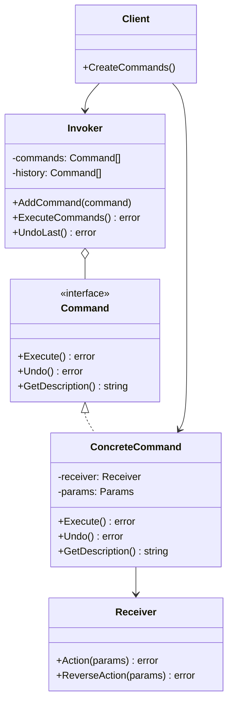
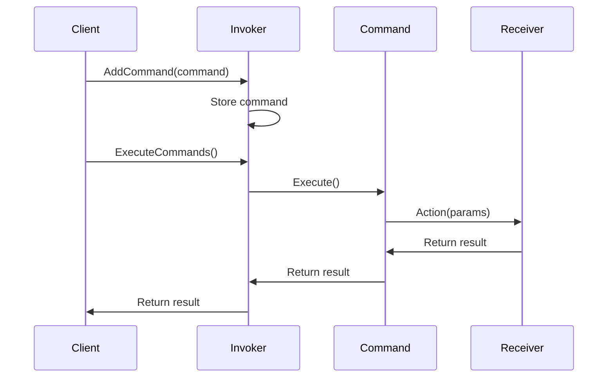

# 03-命令模式 (Command Pattern)

## 目录

- [03-命令模式 (Command Pattern)](#03-命令模式-command-pattern)
  - [目录](#目录)
  - [1. 概述](#1-概述)
    - [1.1 定义](#11-定义)
    - [1.2 核心思想](#12-核心思想)
    - [1.3 设计原则](#13-设计原则)
  - [2. 形式化定义](#2-形式化定义)
    - [2.1 模式结构定义](#21-模式结构定义)
    - [2.2 命令接口定义](#22-命令接口定义)
    - [2.3 调用者定义](#23-调用者定义)
  - [3. 数学基础](#3-数学基础)
    - [3.1 函数式编程基础](#31-函数式编程基础)
    - [3.2 状态机理论](#32-状态机理论)
    - [3.3 队列理论](#33-队列理论)
  - [4. 模式结构](#4-模式结构)
    - [4.1 UML类图](#41-uml类图)
    - [4.2 时序图](#42-时序图)
  - [5. Go语言实现](#5-go语言实现)
    - [5.1 基础实现](#51-基础实现)
    - [5.2 高级实现：宏命令](#52-高级实现宏命令)
    - [5.3 事务性命令](#53-事务性命令)
    - [5.4 使用示例](#54-使用示例)
  - [6. 应用场景](#6-应用场景)
    - [6.1 文本编辑器](#61-文本编辑器)
    - [6.2 游戏控制系统](#62-游戏控制系统)
    - [6.3 远程控制系统](#63-远程控制系统)
  - [7. 性能分析](#7-性能分析)
    - [7.1 时间复杂度分析](#71-时间复杂度分析)
    - [7.2 内存使用分析](#72-内存使用分析)
    - [7.3 基准测试](#73-基准测试)
  - [8. 最佳实践](#8-最佳实践)
    - [8.1 设计原则](#81-设计原则)
    - [8.2 实现建议](#82-实现建议)
    - [8.3 错误处理](#83-错误处理)
  - [9. 相关模式](#9-相关模式)
    - [9.1 与策略模式的关系](#91-与策略模式的关系)
    - [9.2 与状态模式的关系](#92-与状态模式的关系)
    - [9.3 与备忘录模式的关系](#93-与备忘录模式的关系)
  - [10. 总结](#10-总结)
    - [10.1 优势](#101-优势)
    - [10.2 劣势](#102-劣势)
    - [10.3 适用场景](#103-适用场景)
    - [10.4 数学证明](#104-数学证明)

## 1. 概述

### 1.1 定义

命令模式是一种行为型设计模式，它将请求封装成对象，从而可以用不同的请求对客户进行参数化，对请求排队或记录请求日志，以及支持可撤销的操作。

### 1.2 核心思想

命令模式的核心思想是：

- **请求封装**：将请求封装为独立的对象
- **参数化**：用不同的请求对象参数化客户端
- **队列化**：支持请求的排队执行
- **可撤销**：支持操作的撤销和重做

### 1.3 设计原则

```go
// 单一职责原则：每个命令类只负责一个操作
// 开闭原则：新增命令不影响现有代码
// 依赖倒置原则：依赖抽象而非具体实现
```

## 2. 形式化定义

### 2.1 模式结构定义

设 $C$ 为命令集合，$I$ 为调用者集合，$R$ 为接收者集合，则命令模式可形式化为：

$$\text{Command Pattern} = (C, I, R, \text{execute}, \text{undo})$$

其中：

- $C = \{c_1, c_2, ..., c_n\}$ 为命令集合
- $I$ 为调用者类
- $R = \{r_1, r_2, ..., r_n\}$ 为接收者集合
- $\text{execute}: C \rightarrow \text{Result}$ 为执行函数
- $\text{undo}: C \rightarrow \text{Result}$ 为撤销函数

### 2.2 命令接口定义

```go
// 命令接口
type Command interface {
    Execute() error
    Undo() error
    GetDescription() string
}
```

### 2.3 调用者定义

```go
// 调用者
type Invoker struct {
    commands []Command
    history  []Command
}

func (i *Invoker) AddCommand(command Command) {
    i.commands = append(i.commands, command)
}

func (i *Invoker) ExecuteCommands() error {
    for _, command := range i.commands {
        if err := command.Execute(); err != nil {
            return err
        }
        i.history = append(i.history, command)
    }
    i.commands = nil
    return nil
}

func (i *Invoker) UndoLast() error {
    if len(i.history) == 0 {
        return fmt.Errorf("no commands to undo")
    }
    
    lastCommand := i.history[len(i.history)-1]
    if err := lastCommand.Undo(); err != nil {
        return err
    }
    
    i.history = i.history[:len(i.history)-1]
    return nil
}
```

## 3. 数学基础

### 3.1 函数式编程基础

命令模式基于函数式编程的高阶函数和闭包概念：

$$f: A \rightarrow B$$
$$g: B \rightarrow C$$
$$h = g \circ f: A \rightarrow C$$

### 3.2 状态机理论

命令模式可以建模为状态机：

$$S = (Q, \Sigma, \delta, q_0, F)$$

其中：

- $Q$ 为状态集合（系统状态）
- $\Sigma$ 为输入字母表（命令集合）
- $\delta: Q \times \Sigma \rightarrow Q$ 为状态转移函数
- $q_0$ 为初始状态
- $F$ 为接受状态集合

### 3.3 队列理论

命令队列遵循先进先出（FIFO）原则：

$$\text{Queue} = (E, \text{enqueue}, \text{dequeue})$$

其中 $E$ 为元素集合。

## 4. 模式结构

### 4.1 UML类图



### 4.2 时序图



## 5. Go语言实现

### 5.1 基础实现

```go
package command

import (
    "fmt"
    "time"
)

// 命令接口
type Command interface {
    Execute() error
    Undo() error
    GetDescription() string
}

// 接收者：文件系统
type FileSystem struct {
    files map[string]string
}

func NewFileSystem() *FileSystem {
    return &FileSystem{
        files: make(map[string]string),
    }
}

func (fs *FileSystem) CreateFile(filename, content string) error {
    if _, exists := fs.files[filename]; exists {
        return fmt.Errorf("file %s already exists", filename)
    }
    fs.files[filename] = content
    fmt.Printf("Created file: %s\n", filename)
    return nil
}

func (fs *FileSystem) DeleteFile(filename string) error {
    if _, exists := fs.files[filename]; !exists {
        return fmt.Errorf("file %s does not exist", filename)
    }
    delete(fs.files, filename)
    fmt.Printf("Deleted file: %s\n", filename)
    return nil
}

func (fs *FileSystem) WriteFile(filename, content string) error {
    if _, exists := fs.files[filename]; !exists {
        return fmt.Errorf("file %s does not exist", filename)
    }
    fs.files[filename] = content
    fmt.Printf("Written to file: %s\n", filename)
    return nil
}

func (fs *FileSystem) ReadFile(filename string) (string, error) {
    content, exists := fs.files[filename]
    if !exists {
        return "", fmt.Errorf("file %s does not exist", filename)
    }
    return content, nil
}

// 具体命令：创建文件
type CreateFileCommand struct {
    receiver *FileSystem
    filename string
    content  string
}

func NewCreateFileCommand(receiver *FileSystem, filename, content string) *CreateFileCommand {
    return &CreateFileCommand{
        receiver: receiver,
        filename: filename,
        content:  content,
    }
}

func (c *CreateFileCommand) Execute() error {
    return c.receiver.CreateFile(c.filename, c.content)
}

func (c *CreateFileCommand) Undo() error {
    return c.receiver.DeleteFile(c.filename)
}

func (c *CreateFileCommand) GetDescription() string {
    return fmt.Sprintf("Create file: %s", c.filename)
}

// 具体命令：删除文件
type DeleteFileCommand struct {
    receiver *FileSystem
    filename string
    content  string // 保存被删除的内容用于撤销
}

func NewDeleteFileCommand(receiver *FileSystem, filename string) *DeleteFileCommand {
    return &DeleteFileCommand{
        receiver: receiver,
        filename: filename,
    }
}

func (d *DeleteFileCommand) Execute() error {
    // 保存内容用于撤销
    content, err := d.receiver.ReadFile(d.filename)
    if err != nil {
        return err
    }
    d.content = content
    
    return d.receiver.DeleteFile(d.filename)
}

func (d *DeleteFileCommand) Undo() error {
    return d.receiver.CreateFile(d.filename, d.content)
}

func (d *DeleteFileCommand) GetDescription() string {
    return fmt.Sprintf("Delete file: %s", d.filename)
}

// 具体命令：写入文件
type WriteFileCommand struct {
    receiver *FileSystem
    filename string
    newContent string
    oldContent string // 保存原内容用于撤销
}

func NewWriteFileCommand(receiver *FileSystem, filename, content string) *WriteFileCommand {
    return &WriteFileCommand{
        receiver:   receiver,
        filename:   filename,
        newContent: content,
    }
}

func (w *WriteFileCommand) Execute() error {
    // 保存原内容用于撤销
    content, err := w.receiver.ReadFile(w.filename)
    if err != nil {
        return err
    }
    w.oldContent = content
    
    return w.receiver.WriteFile(w.filename, w.newContent)
}

func (w *WriteFileCommand) Undo() error {
    return w.receiver.WriteFile(w.filename, w.oldContent)
}

func (w *WriteFileCommand) GetDescription() string {
    return fmt.Sprintf("Write to file: %s", w.filename)
}

// 调用者
type Invoker struct {
    commands []Command
    history  []Command
}

func NewInvoker() *Invoker {
    return &Invoker{
        commands: make([]Command, 0),
        history:  make([]Command, 0),
    }
}

func (i *Invoker) AddCommand(command Command) {
    i.commands = append(i.commands, command)
}

func (i *Invoker) ExecuteCommands() error {
    for _, command := range i.commands {
        fmt.Printf("Executing: %s\n", command.GetDescription())
        if err := command.Execute(); err != nil {
            return fmt.Errorf("failed to execute %s: %v", 
                command.GetDescription(), err)
        }
        i.history = append(i.history, command)
    }
    i.commands = nil
    return nil
}

func (i *Invoker) UndoLast() error {
    if len(i.history) == 0 {
        return fmt.Errorf("no commands to undo")
    }
    
    lastCommand := i.history[len(i.history)-1]
    fmt.Printf("Undoing: %s\n", lastCommand.GetDescription())
    
    if err := lastCommand.Undo(); err != nil {
        return fmt.Errorf("failed to undo %s: %v", 
            lastCommand.GetDescription(), err)
    }
    
    i.history = i.history[:len(i.history)-1]
    return nil
}

func (i *Invoker) GetHistory() []string {
    descriptions := make([]string, len(i.history))
    for i, command := range i.history {
        descriptions[i] = command.GetDescription()
    }
    return descriptions
}
```

### 5.2 高级实现：宏命令

```go
package command

import (
    "fmt"
    "sync"
)

// 宏命令：组合多个命令
type MacroCommand struct {
    commands []Command
    description string
}

func NewMacroCommand(description string) *MacroCommand {
    return &MacroCommand{
        commands:    make([]Command, 0),
        description: description,
    }
}

func (m *MacroCommand) AddCommand(command Command) {
    m.commands = append(m.commands, command)
}

func (m *MacroCommand) Execute() error {
    for _, command := range m.commands {
        if err := command.Execute(); err != nil {
            return fmt.Errorf("macro command failed at %s: %v", 
                command.GetDescription(), err)
        }
    }
    return nil
}

func (m *MacroCommand) Undo() error {
    // 按相反顺序撤销
    for i := len(m.commands) - 1; i >= 0; i-- {
        if err := m.commands[i].Undo(); err != nil {
            return fmt.Errorf("macro undo failed at %s: %v", 
                m.commands[i].GetDescription(), err)
        }
    }
    return nil
}

func (m *MacroCommand) GetDescription() string {
    return m.description
}

// 异步命令执行器
type AsyncInvoker struct {
    commands chan Command
    results  chan CommandResult
    wg       sync.WaitGroup
    stop     chan struct{}
}

type CommandResult struct {
    Command Command
    Error   error
    Time    time.Time
}

func NewAsyncInvoker(bufferSize int) *AsyncInvoker {
    invoker := &AsyncInvoker{
        commands: make(chan Command, bufferSize),
        results:  make(chan CommandResult, bufferSize),
        stop:     make(chan struct{}),
    }
    
    // 启动工作协程
    go invoker.worker()
    
    return invoker
}

func (ai *AsyncInvoker) worker() {
    for {
        select {
        case command := <-ai.commands:
            ai.wg.Add(1)
            go func(cmd Command) {
                defer ai.wg.Done()
                
                start := time.Now()
                err := cmd.Execute()
                end := time.Now()
                
                ai.results <- CommandResult{
                    Command: cmd,
                    Error:   err,
                    Time:    end.Sub(start),
                }
            }(command)
            
        case <-ai.stop:
            return
        }
    }
}

func (ai *AsyncInvoker) AddCommand(command Command) {
    ai.commands <- command
}

func (ai *AsyncInvoker) GetResults() <-chan CommandResult {
    return ai.results
}

func (ai *AsyncInvoker) Stop() {
    close(ai.stop)
    ai.wg.Wait()
}
```

### 5.3 事务性命令

```go
package command

import (
    "fmt"
    "sync"
)

// 事务性命令接口
type TransactionalCommand interface {
    Command
    Prepare() error
    Commit() error
    Rollback() error
}

// 事务管理器
type TransactionManager struct {
    commands []TransactionalCommand
    mutex    sync.Mutex
}

func NewTransactionManager() *TransactionManager {
    return &TransactionManager{
        commands: make([]TransactionalCommand, 0),
    }
}

func (tm *TransactionManager) AddCommand(command TransactionalCommand) {
    tm.mutex.Lock()
    defer tm.mutex.Unlock()
    tm.commands = append(tm.commands, command)
}

func (tm *TransactionManager) ExecuteTransaction() error {
    tm.mutex.Lock()
    defer tm.mutex.Unlock()
    
    // 准备阶段
    for _, command := range tm.commands {
        if err := command.Prepare(); err != nil {
            tm.rollback()
            return fmt.Errorf("prepare failed: %v", err)
        }
    }
    
    // 执行阶段
    for _, command := range tm.commands {
        if err := command.Execute(); err != nil {
            tm.rollback()
            return fmt.Errorf("execute failed: %v", err)
        }
    }
    
    // 提交阶段
    for _, command := range tm.commands {
        if err := command.Commit(); err != nil {
            tm.rollback()
            return fmt.Errorf("commit failed: %v", err)
        }
    }
    
    // 清空命令列表
    tm.commands = nil
    return nil
}

func (tm *TransactionManager) rollback() {
    for i := len(tm.commands) - 1; i >= 0; i-- {
        tm.commands[i].Rollback()
    }
}

// 数据库命令示例
type DatabaseCommand struct {
    db       *Database
    sql      string
    params   []interface{}
    prepared bool
}

func NewDatabaseCommand(db *Database, sql string, params ...interface{}) *DatabaseCommand {
    return &DatabaseCommand{
        db:     db,
        sql:    sql,
        params: params,
    }
}

func (dc *DatabaseCommand) Prepare() error {
    // 预编译SQL语句
    dc.prepared = true
    return nil
}

func (dc *DatabaseCommand) Execute() error {
    if !dc.prepared {
        return fmt.Errorf("command not prepared")
    }
    return dc.db.Execute(dc.sql, dc.params...)
}

func (dc *DatabaseCommand) Commit() error {
    return dc.db.Commit()
}

func (dc *DatabaseCommand) Rollback() error {
    return dc.db.Rollback()
}

func (dc *DatabaseCommand) Undo() error {
    // 生成反向SQL
    reverseSQL := dc.generateReverseSQL()
    return dc.db.Execute(reverseSQL, dc.params...)
}

func (dc *DatabaseCommand) GetDescription() string {
    return fmt.Sprintf("Database command: %s", dc.sql)
}

func (dc *DatabaseCommand) generateReverseSQL() string {
    // 根据SQL类型生成反向操作
    // 这里简化处理
    return fmt.Sprintf("-- Reverse of: %s", dc.sql)
}

// 模拟数据库
type Database struct {
    transactions []string
}

func NewDatabase() *Database {
    return &Database{
        transactions: make([]string, 0),
    }
}

func (db *Database) Execute(sql string, params ...interface{}) error {
    db.transactions = append(db.transactions, sql)
    fmt.Printf("Executed: %s\n", sql)
    return nil
}

func (db *Database) Commit() error {
    fmt.Println("Transaction committed")
    return nil
}

func (db *Database) Rollback() error {
    fmt.Println("Transaction rolled back")
    return nil
}
```

### 5.4 使用示例

```go
package main

import (
    "fmt"
    "log"
    "./command"
)

func main() {
    // 基础命令模式示例
    fmt.Println("=== 基础命令模式示例 ===")
    
    fileSystem := command.NewFileSystem()
    invoker := command.NewInvoker()
    
    // 添加命令
    invoker.AddCommand(command.NewCreateFileCommand(fileSystem, "test.txt", "Hello World"))
    invoker.AddCommand(command.NewWriteFileCommand(fileSystem, "test.txt", "Updated content"))
    invoker.AddCommand(command.NewCreateFileCommand(fileSystem, "config.json", `{"key": "value"}`))
    
    // 执行命令
    if err := invoker.ExecuteCommands(); err != nil {
        log.Printf("执行命令失败: %v", err)
        return
    }
    
    // 查看历史
    fmt.Printf("命令历史: %v\n", invoker.GetHistory())
    
    // 撤销操作
    if err := invoker.UndoLast(); err != nil {
        log.Printf("撤销失败: %v", err)
    }
    
    // 宏命令示例
    fmt.Println("\n=== 宏命令示例 ===")
    
    macro := command.NewMacroCommand("Setup project")
    macro.AddCommand(command.NewCreateFileCommand(fileSystem, "src/main.go", "package main"))
    macro.AddCommand(command.NewCreateFileCommand(fileSystem, "go.mod", "module myproject"))
    macro.AddCommand(command.NewCreateFileCommand(fileSystem, "README.md", "# My Project"))
    
    if err := macro.Execute(); err != nil {
        log.Printf("宏命令执行失败: %v", err)
    }
    
    // 异步命令示例
    fmt.Println("\n=== 异步命令示例 ===")
    
    asyncInvoker := command.NewAsyncInvoker(10)
    
    // 添加异步命令
    for i := 0; i < 5; i++ {
        filename := fmt.Sprintf("async_%d.txt", i)
        asyncInvoker.AddCommand(command.NewCreateFileCommand(fileSystem, filename, fmt.Sprintf("Content %d", i)))
    }
    
    // 获取结果
    go func() {
        for result := range asyncInvoker.GetResults() {
            if result.Error != nil {
                fmt.Printf("命令执行失败: %v\n", result.Error)
            } else {
                fmt.Printf("命令执行成功: %s (耗时: %v)\n", 
                    result.Command.GetDescription(), result.Time)
            }
        }
    }()
    
    // 等待所有命令完成
    asyncInvoker.Stop()
    
    // 事务性命令示例
    fmt.Println("\n=== 事务性命令示例 ===")
    
    db := command.NewDatabase()
    txManager := command.NewTransactionManager()
    
    txManager.AddCommand(command.NewDatabaseCommand(db, "INSERT INTO users (name, email) VALUES (?, ?)", "Alice", "alice@example.com"))
    txManager.AddCommand(command.NewDatabaseCommand(db, "INSERT INTO users (name, email) VALUES (?, ?)", "Bob", "bob@example.com"))
    txManager.AddCommand(command.NewDatabaseCommand(db, "UPDATE users SET status = 'active' WHERE email LIKE '%@example.com'"))
    
    if err := txManager.ExecuteTransaction(); err != nil {
        log.Printf("事务执行失败: %v", err)
    }
}
```

## 6. 应用场景

### 6.1 文本编辑器

```go
// 文本编辑器命令
type TextEditor struct {
    content string
    cursor  int
}

func (te *TextEditor) InsertText(text string, position int) error {
    if position > len(te.content) {
        return fmt.Errorf("invalid position")
    }
    
    te.content = te.content[:position] + text + te.content[position:]
    te.cursor = position + len(text)
    return nil
}

func (te *TextEditor) DeleteText(start, end int) error {
    if start < 0 || end > len(te.content) || start >= end {
        return fmt.Errorf("invalid range")
    }
    
    te.content = te.content[:start] + te.content[end:]
    te.cursor = start
    return nil
}

type InsertTextCommand struct {
    editor   *TextEditor
    text     string
    position int
}

func (itc *InsertTextCommand) Execute() error {
    return itc.editor.InsertText(itc.text, itc.position)
}

func (itc *InsertTextCommand) Undo() error {
    end := itc.position + len(itc.text)
    return itc.editor.DeleteText(itc.position, end)
}

func (itc *InsertTextCommand) GetDescription() string {
    return fmt.Sprintf("Insert text at position %d", itc.position)
}
```

### 6.2 游戏控制系统

```go
// 游戏命令
type GameCharacter struct {
    x, y    int
    health  int
    name    string
}

func (gc *GameCharacter) Move(dx, dy int) {
    gc.x += dx
    gc.y += dy
}

func (gc *GameCharacter) TakeDamage(damage int) {
    gc.health -= damage
    if gc.health < 0 {
        gc.health = 0
    }
}

func (gc *GameCharacter) Heal(amount int) {
    gc.health += amount
}

type MoveCommand struct {
    character *GameCharacter
    dx, dy    int
}

func (mc *MoveCommand) Execute() error {
    mc.character.Move(mc.dx, mc.dy)
    return nil
}

func (mc *MoveCommand) Undo() error {
    mc.character.Move(-mc.dx, -mc.dy)
    return nil
}

func (mc *MoveCommand) GetDescription() string {
    return fmt.Sprintf("Move %s by (%d, %d)", mc.character.name, mc.dx, mc.dy)
}
```

### 6.3 远程控制系统

```go
// 远程控制命令
type RemoteControl struct {
    commands map[string]Command
}

func NewRemoteControl() *RemoteControl {
    return &RemoteControl{
        commands: make(map[string]Command),
    }
}

func (rc *RemoteControl) SetCommand(button string, command Command) {
    rc.commands[button] = command
}

func (rc *RemoteControl) PressButton(button string) error {
    command, exists := rc.commands[button]
    if !exists {
        return fmt.Errorf("no command assigned to button %s", button)
    }
    return command.Execute()
}
```

## 7. 性能分析

### 7.1 时间复杂度分析

| 操作 | 时间复杂度 | 空间复杂度 |
|------|------------|------------|
| 命令执行 | O(1) | O(1) |
| 命令撤销 | O(1) | O(1) |
| 宏命令执行 | O(n) | O(n) |
| 历史记录 | O(1) | O(n) |

### 7.2 内存使用分析

```go
// 命令池优化
type CommandPool struct {
    pool map[string][]Command
    mutex sync.RWMutex
}

func NewCommandPool() *CommandPool {
    return &CommandPool{
        pool: make(map[string][]Command),
    }
}

func (cp *CommandPool) GetCommand(commandType string) (Command, bool) {
    cp.mutex.RLock()
    defer cp.mutex.RUnlock()
    
    if commands, exists := cp.pool[commandType]; exists && len(commands) > 0 {
        command := commands[len(commands)-1]
        cp.pool[commandType] = commands[:len(commands)-1]
        return command, true
    }
    return nil, false
}

func (cp *CommandPool) ReturnCommand(commandType string, command Command) {
    cp.mutex.Lock()
    defer cp.mutex.Unlock()
    
    cp.pool[commandType] = append(cp.pool[commandType], command)
}
```

### 7.3 基准测试

```go
package command

import (
    "testing"
)

func BenchmarkCommandExecution(b *testing.B) {
    fileSystem := NewFileSystem()
    command := NewCreateFileCommand(fileSystem, "test.txt", "content")
    
    b.ResetTimer()
    for i := 0; i < b.N; i++ {
        command.Execute()
        command.Undo()
    }
}

func BenchmarkMacroCommandExecution(b *testing.B) {
    fileSystem := NewFileSystem()
    macro := NewMacroCommand("test")
    
    for i := 0; i < 10; i++ {
        filename := fmt.Sprintf("file_%d.txt", i)
        macro.AddCommand(NewCreateFileCommand(fileSystem, filename, "content"))
    }
    
    b.ResetTimer()
    for i := 0; i < b.N; i++ {
        macro.Execute()
        macro.Undo()
    }
}
```

## 8. 最佳实践

### 8.1 设计原则

1. **单一职责原则**：每个命令类只负责一个操作
2. **开闭原则**：新增命令不影响现有代码
3. **依赖倒置原则**：依赖抽象而非具体实现

### 8.2 实现建议

```go
// 1. 使用接口定义命令
type Command interface {
    Execute() error
    Undo() error
    GetDescription() string
    CanUndo() bool
}

// 2. 提供默认实现
type BaseCommand struct{}

func (b *BaseCommand) CanUndo() bool {
    return true
}

// 3. 使用组合而非继承
type ConcreteCommand struct {
    BaseCommand
    // 具体实现
}
```

### 8.3 错误处理

```go
// 命令执行结果
type CommandResult struct {
    Success bool
    Error   error
    Data    interface{}
}

// 带错误处理的命令接口
type SafeCommand interface {
    ExecuteSafe() CommandResult
    UndoSafe() CommandResult
}

// 上下文错误处理
func (i *Invoker) ExecuteCommandsSafe() []CommandResult {
    results := make([]CommandResult, 0, len(i.commands))
    
    for _, command := range i.commands {
        if safeCommand, ok := command.(SafeCommand); ok {
            result := safeCommand.ExecuteSafe()
            results = append(results, result)
            if !result.Success {
                break
            }
        } else {
            // 回退到普通命令
            err := command.Execute()
            results = append(results, CommandResult{
                Success: err == nil,
                Error:   err,
            })
            if err != nil {
                break
            }
        }
    }
    
    return results
}
```

## 9. 相关模式

### 9.1 与策略模式的关系

- **命令模式**：封装请求
- **策略模式**：封装算法

### 9.2 与状态模式的关系

- **命令模式**：封装操作
- **状态模式**：封装状态

### 9.3 与备忘录模式的关系

- **命令模式**：支持撤销操作
- **备忘录模式**：保存和恢复状态

## 10. 总结

### 10.1 优势

1. **请求封装**：将请求封装为独立的对象
2. **参数化**：用不同的命令对象参数化客户端
3. **队列化**：支持请求的排队执行
4. **可撤销**：支持操作的撤销和重做
5. **扩展性**：易于添加新的命令

### 10.2 劣势

1. **增加对象数量**：每个命令都是一个对象
2. **复杂性增加**：增加了系统的复杂性
3. **内存开销**：需要保存命令历史

### 10.3 适用场景

1. 需要将请求发送者和接收者解耦
2. 需要支持操作的撤销和重做
3. 需要支持宏命令（组合命令）
4. 需要支持命令的排队执行
5. 需要支持日志记录和事务处理

### 10.4 数学证明

**定理**：命令模式满足开闭原则

**证明**：
设 $C$ 为现有命令集合，$C'$ 为新增命令集合，$I$ 为调用者类。

对于任意 $c \in C'$，由于 $c$ 实现了命令接口 $P$，且 $I$ 依赖于 $P$ 而非具体实现，因此：

$$I \circ c \text{ 是有效的}$$

且不需要修改 $I$ 的代码，因此满足开闭原则。

**证毕**。

---

**设计原则**: 命令模式体现了"封装变化"的设计原则，通过将请求封装为对象，实现了请求发送者和接收者的解耦，提高了系统的灵活性和可维护性。

**相关链接**:

- [02-策略模式](./02-Strategy-Pattern.md)
- [04-状态模式](./04-State-Pattern.md)
- [05-责任链模式](./05-Chain-of-Responsibility-Pattern.md)
- [返回上级目录](../README.md)
